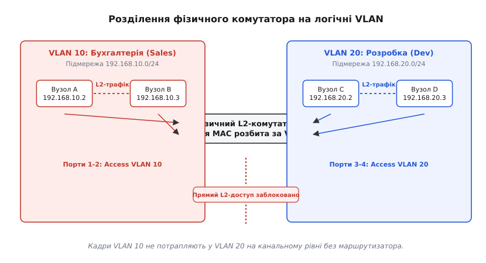
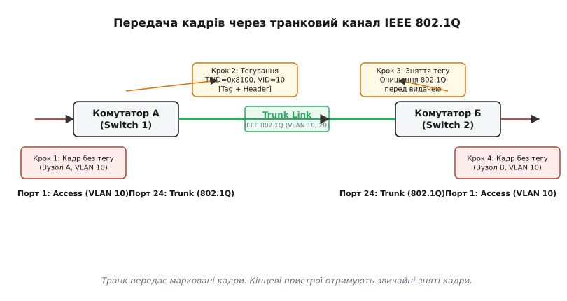
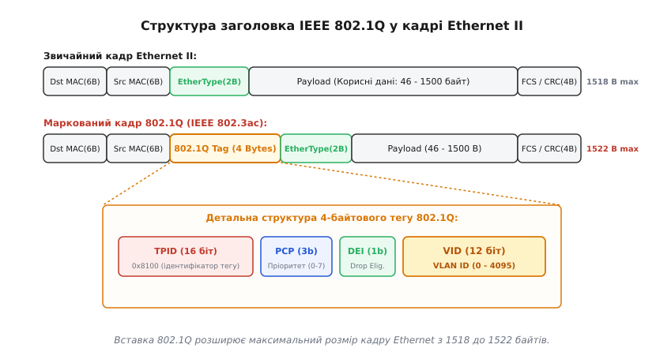

# VLAN та транкінг

<preknowlist>
- [MAC, IP і ARP](topic:communications/mac-ip-arp) — комутатор передає кадри за MAC-адресами у межах одного канального сегмента.
- [Маршрутизація IP](topic:communications/ip-routing) — передача пакетів між різними IP-мережами через маршрутизатор.
- [Канал, смуга і пакет](topic:communications/channel-band-packet) — фізична і логічна організація передачі даних.
</preknowlist>

Коли у мережі компанії під'єднати 200 комп'ютерів до кількох з'єднаних між собою комутаторів, кожен пристрій опиняється в єдиному середовищі канального рівня. Щоразу, коли комп'ютер бухгалтера надсилає широкомовний ARP-запит `FF:FF:FF:FF:FF:FF` для пошуку шлюзу, комутатор реплікує цей кадр на **всі** свої порти. У результаті кожен робочий ПК у мережі — від робочої станції інженера до сервера розробки — отримує цей кадр, викликом переривання змушує мережеву карту передати його процесору і витрачає процесорний час на перевірку, чи стосується це його IP-адреси. Зі зростанням кількості вузлів трафік ARP, DHCP та службових системних протоколів лавиноподібно зростає, з'їдаючи смугу пропускання і створюючи загрозу перехоплення даних: будь-хто, увімкнувшись у довільну розетку в коридорі, бачить увесь широкомовний і незахищений трафік компанії.

Купівля окремого фізичного комутатора для кожного відділу виглядає очевидним виходом, але швидко виявляється фінансовою та інженерною пасткою. Якщо у відділі кадрів працює лише 3 особи, окремий 24-портовий комутатор залишається зайнятим лише на 12%, а для об'єднання відділів між собою доводиться прокладати десятки фізичних кабелів до загального маршрутизатора. Розумнішим рішенням є розділити **один фізичний комутатор на кілька незалежних логічних комутаторів** на канальному рівні. Саме цю задачу розв'язує технологія **VLAN** (англ. *Virtual Local Area Network* — віртуальна локальна мережа), а механізм **транкінгу** дозволяє пропустити трафік десятків таких віртуальних мереж через один фізичний кабель між комутаторами.

### Плоска мережа канального рівня та пастка широкомовлення

Щоб зрозуміти необхідність виникнення віртуальних мереж, потрібно подивитися на внутрішню роботу звичайного Ethernet-комутатора 2-го рівня (L2). Його головним інструментом є таблиця MAC-адрес (англ. *MAC address table* або *CAM table*), яка пов'язує апаратну MAC-адресу кожного пристрою з номером фізичного порту, куди його підключено.

Процес формування цієї таблиці базується на самонавчанні: коли комутатор отримує кадр на порту `1`, він дивиться на MAC-адресу відправника (`Src MAC`) і записує у пам'ять: «пристрій з цією адресою знаходиться на порту 1». Коли пізніше на будь-який інший порт надходить кадр з адресою призначення (`Dst MAC`), яка відповідає цьому запису, комутатор комутує кадр **тільки** на порт `1` (режим unicast).

Проте ця ідеальна адресація працює лише тоді, коли адреса призначення **вже відома** комутатору і відправнику. Якщо ж адреса у таблиці відсутня (unknown unicast), або якщо кадр призначено усім пристроям (широкомовна адреса `FF:FF:FF:FF:FF:FF`), комутатор застосовує базове правило Ethernet — **затоплення** (англ. *flooding*). Він дублює і розсилає копію вхідного кадру геть на всі активні порти, крім того, з якого кадр початково прийшов.

У плоскій мережі без розділення на віртуальні сегменти виникають дві фундаментальні проблеми, які унеможливлюють масштабування:

1. **Широкомовний шторм та паразитна навантаженість**: Одночасна робота протоколів автовиявлення, ARP-запитів, DHCP-запитів, служб друку NetBIOS та IPv6 Neighbor Discovery створює постійну фонову «паразитну» шумність. Якщо в мережі виникає фізичне кільце між комутаторами (через вимкнений або неправильно налаштований протокол Spanning Tree), один широкомовний кадр починає нескінченно циркулювати й дублюватися, викликаючи широкомовний шторм (broadcast storm). Це миттєво забиває смугу пропускання і паралізує мережеві карти усіх вузлів.
2. **Відсутність ізоляції безпеки**: Звичайний комутатор 2-го рівня перевіряє лише цілісність контрольної суми CRC і не аналізує права доступу. Пристрій у гостьовій мережі Wi-Fi, підключений до того самого комутатора, що й сервер баз даних, може надсилати кадри прямо на його MAC-адресу, здійснювати атаки ARP-poisoning (підміняючи MAC-адресу маршрутизатора на свою) і перехоплювати чужий незашифрований трафік.

Пряме інженерне розв'язання проблеми — розірвати єдине середовище передачі на ізольовані домени широкомовлення. І замість переключення фізичних дротів це робиться програмно у пам'яті комутатора.

### Анатомія VLAN: порти доступу та логічне розділення

Віртуальна локальна мережа (**VLAN**) — це логічна група пристроїв на 2-му рівні моделі OSI, яка функціонує як повністю ізольований фізичний комутатор. Пристрої усередині одного VLAN можуть вільно обмінюватися кадрами між собою, але **жоден кадр не може потрапити з одного VLAN до іншого на канальному рівні** без участі пристрою 3-го рівня (маршрутизатора).

Щоб реалізувати таку ізоляцію на рівні заліза, розробники комутаторів модифікували структуру таблиці MAC-адрес. Замість простого зв'язку `MAC -> Порт`, таблиця у спец-пам'яті TCAM (Ternary Content Addressable Memory) стала двовимірною: `(VLAN ID, MAC) -> Порт`. Кожній віртуальній мережі призначається числовий ідентифікатор — **VLAN ID (VID)** у діапазоні від `1` до `4094`.


*Фізичний комутатор розділено на два логічні VLAN. Кадри між вузлами А та B (VLAN 10) передаються вільно. Спроба вузла A звернутися до вузла C (VLAN 20) блокується комутатором на L2-рівні.*

Робота з кінцевими пристроями (робочі ПК, принтери, відеокамери, IP-телефони) відбувається через **порти доступу** (англ. *Access Ports*):

- **Вхідний трафік (Ingress)**: Кінцевий пристрій не знає про існування VLAN і надсилає стандартний, немаркований Ethernet-кадр. Комутатор, приймаючи кадр на порту доступу, дивлячись у свої налаштування, прив'язує до нього параметр **PVID** (англ. *Port VLAN ID*). Якщо порт `1` налаштовано як `Access VLAN 10`, то усім вхідним кадрам з цього порту внутрішньо присвоюється VID=10.
- **Прийняття рішення про просування**: Комутатор шукає MAC-адресу призначення **виключно** серед тих записів у CAM-таблиці, які належать до того самого `VLAN 10`. Якщо кадр є широкомовним, його копії відправляються **тільки** на ті порти, які входять до `VLAN 10`. Порти `VLAN 20` цей кадр навіть не побачать.
- **Вихідний трафік (Egress)**: Перед тим як видати кадр із порту доступу на ПК бухгалтера, комутатор переконується, що кадр виходить у звичайному, немаркованому вигляді. Кінцевий комп'ютер отримує стандартний кадр Ethernet і навіть не підозрює, що він пройшов через віртуальну мережу.

Детальну історію розвитку цього підходу від перших експериментів у Bellcore до боротьби фірмових протоколів викладено у вставці [Історія виникнення VLAN та стандарту IEEE 802.1Q](topic:communications/vlan-and-trunking/hist-vlan-history.md).

### Транкові канали та маркування кадрів (Frame Tagging)

У реальних мережах підприємства один і той самий VLAN часто має бути присутній на кількох комутаторах, розташованих на різних поверхах або в різних будівлях. Наприклад, ПК бухгалтерії є і на 1-му, і на 3-му поверхах, а сервери знаходяться в окремій серверній кімнаті.

Якби ми з'єднували комутатори між собою звичайними портами доступу, для кожного VLAN знадобився б **окремий фізичний кабель**: один дріт для VLAN 10, другий для VLAN 20, третій для VLAN 30. При наявності 50 віртуальних мереж це вимагало б 50 фізичних кабелів між кожною парою комутаторів, що швидко вичерпало б доступні порти й перетворило кабельну інфраструктуру на хаос.

Виходом став **транковий канал** (англ. *Trunk Link* або *Trunk Port*): один фізичний або агрегований кабель між комутаторами, який здатний одночасно передавати трафік **багатьох різних VLAN**.


*Немаркований кадр входить на Access-порт Switch 1, отримує тег 802.1Q (VID=10), передається через транковий канал, на Switch 2 тег знімається і кадр видається у немаркованому вигляді на порт призначення.*

Але як приймальний комутатор (Switch 2) дізнається, до якого саме VLAN належить кадр, що прийшов через спільний транковий кабель? Для цього застосовують **маркування кадрів** (англ. *Frame Tagging*). Передавальний комутатор (Switch 1) перед відправкою кадру в транк вставляє в нього спеціальну мітку — **тег VLAN**, де чітко вказано номер VID. Приймальний комутатор читає цей тег, дізнається номер віртуальної мережі, видаляє тег і спрямовує кадр у відповідні порти доступу.

### Стандарт IEEE 802.1Q та структура тегу

Історично існували різні способи маркування кадрів (зокрема пропрієтарний Cisco ISL), але абсолютним світовим стандартом став **IEEE 802.1Q**.

Замість загортання всього кадру у новий зовнішній конверт (як це робив ISL), розробники 802.1Q обрали елегантне рішення: **вставити 4 байти додаткових даних прямо всередину стандартного кадру Ethernet II** — між MAC-адресою відправника (`Src MAC`) та полем `EtherType`.


*Детальна структура 4-байтового вставленого заголовка 802.1Q. Розшифровано поля TPID, PCP, DEI та VID.*

Вставка складається з чотирьох полів загальною довжиною 32 біти (4 байти):

1. **TPID (Tag Protocol Identifier)** — 16 біт. Має фіксоване значення **`0x8100`**. Коли мережева карта або комутатор бачить це значення на місці стандартного поля `EtherType`, вони миттєво розуміють: кадр маркований за стандартом 802.1Q, і наступні 2 байти містять управлінську інформацію тегу.
2. **PCP (Priority Code Point)** — 3 біти. Визначає пріоритет кадру за стандартом **IEEE 802.1p** (Class of Service, CoS). Дозволяє задати 8 рівнів пріоритету (від `0` для звичайного трафіку до `7` для критичних мережевих BPDU-кадрів чи голосних даних VoIP). Комутатори використовують це поле для розподілу кадрів по апаратних вихідних чергах (Strict Priority або WRR).
3. **DEI (Drop Eligible Indicator)** — 1 біт. Прапор придатності до відкидання. Якщо комутатор переповнений трафіком, кадри з `DEI = 1` відкидаються першими для збереження важливіших пакетів.
4. **VID (VLAN Identifier)** — 12 біт. Сам номер віртуальної мережі. Оскільки поле має довжину 12 біт, воно може набувати 2¹² = 4096 значень — від `0` до `4095`.

Повний опис усіх полів, прапорців та інструкції з перегляду конфігурації у Linux наведено у вставці [Поля заголовка IEEE 802.1Q та системні інтерфейси](topic:communications/vlan-and-trunking/api-8021q-header.md).

> ⚠️ **Зміна максимального розміру кадру**: Додавання 4-байтового тегу збільшує максимальний розмір Ethernet-кадру з 1518 до **1522 байтів**. Щоб застаріле мережеве обладнання не сприймало такі кадри як пошкоджені й занадто довгі (oversized frames), комітет IEEE ухвалив специфікацію **IEEE 802.3ac**, яка офіційно розширила допустимий розмір кадру Ethernet для підтримки тегів 802.1Q.

### Нативний VLAN (Native VLAN) та вектор внутрішніх загроз

На кожному транковому порту 802.1Q існує особливе поняття — **Нативний VLAN** (англ. *Native VLAN*). Це один-єдиний VLAN, трафік якого передається через транковий канал **без додавання тегу 802.1Q**.

За замовчуванням на більшості комутаторів нативним є `VLAN 1`. Коли комутатор надсилає кадр, що належить до Native VLAN, у транковий порт, він **не вставляє** 4-байтовий тег `0x8100`. І навпаки: якщо на транковий порт комутатора приходить звичайний немаркований кадр, комутатор вважає, що цей кадр належить до його Native VLAN.

Існування Native VLAN виправдане двома основними інженерними причинами:
- **Зворотна сумісність**: Дозволяє підключати до транкового порту старі комутатори чи концентратори (hubs), які взагалі не розуміють тегування 802.1Q.
- **Службовий трафік**: Деякі системні протоколи керування (наприклад, STP BPDU, CDP, DTP) історично передаються немаркованими.

Проте залишення нативного VLAN за замовчуванням створює небезпечний вектор атаки — **VLAN Hopping (атака з подвійним тегуванням)**.

```
Схема атаки VLAN Hopping (Double Tagging):
 Зловмисник (VLAN 1 Native)                       Комутатор А                              Комутатор Б
 [Dst MAC][Src MAC][Tag: VID=1][Tag: VID=20][Data] ───> [Зриває зовнішній Tag VID=1] ─── (Транк без тегу) ───> [Бачить inner Tag: VID=20]
                                                        бо він Native на транку!                                 Доправляє у VLAN 20!
```

Механіка атаки полягає в тому, що зловмисник, перебуваючи в `VLAN 1` (нативному), надсилає кадр із **двома** тегами 802.1Q: зовнішній `VID = 1` (нативний) та внутрішній `VID = 20` (цільова мережа жертви).

Коли Комутатор А отримує цей кадр, він дивиться на зовнішній тег `VID = 1`. Оскільки `VLAN 1` є нативним для транку, комутатор **зриває** зовнішній тег і відправляє кадр далі в транк. Але в кадрі залишається **другий тег** (`VID = 20`)! Коли Комутатор Б отримує цей кадр із транку, він бачить тег `VID = 20` і беззастережно доправляє кадр у віртуальну мережу жертви. Зловмисник зумів відправити пакет в чужий VLAN вмибіч.

> 🔧 **Навіщо це (Правила безпечного налаштування транків)**:
> 1. **Ніколи не використовуйте `VLAN 1` для робочого трафіку**.
> 2. **Змініть Native VLAN на невиристовуваний номер**: Призначте нативним для транків спеціальний «глухий» VLAN (наприклад, `VLAN 999`), до якого не прив'язано жодного користувацького порту.
> 3. **Вмикайте примусове тегування нативного трафіку**: Конфігурація `vlan dot1q tag native` змушує комутатор маркувати геть усі кадри в транку, включаючи нативний VLAN, унеможливлюючи атаки double-tagging.
> 4. **Явно відключайте автоузгодження транків DTP**: На всіх портах доступу слід виконувати команду `switchport mode access` та `switchport nonegotiate`, щоб хакер не міг надіслати DTP-кадр і перетворити свій порт на транковий.

### Розширені режими: Приватні VLAN (PVLAN) та Голосовий VLAN (Voice VLAN)

У складних мережевих інфраструктурах стандартного поділу на порти доступу й транки іноді виявляється замало. Для розв'язання специфічних задач безпеки та організації IP-телефонії застосовують розширені механізми:

#### 1. Приватні VLAN (Private VLANs / PVLAN)

Уявіть готель або дата-центр, де сотні віртуальних машин або гостьових ноутбуків підключені до одного VLAN для економії IP-адрес. Нам потрібно, щоб кожен гостьовий ПК міг виходити в Інтернет через маршрутизатор, але **не міг бачити сусідні ноутбуки** в тій самій кімнаті чи підмережі.

Звичайний VLAN цього не дозволяє, оскільки всі вузли усередині VLAN вільно бачать один одного на L2. Створення 500 окремих VLAN виснажило б простір ідентифікаторів.

Розв'язанням є **Private VLAN (PVLAN)**, який ділить один первинний VLAN (Primary VLAN) на три типи під-портів:
- **Promiscuous Port (Загальний порт)**: Порт маршрутизатора чи брандмауера. Може спілкуватися з абсолютно всіма портами усередині PVLAN.
- **Isolated Port (Ізольований порт)**: Може спілкуватися **тільки** із Promiscuous-портами. Два Isolated-порти усередині одного VLAN не бачать один одного взагалі.
- **Community Port (Груповий порт)**: Порти усередині однієї «спільноти» бачать один одного та Promiscuous-порт, але ізольовані від інших груп.

#### 2. Голосовий VLAN (Voice VLAN)

У сучасних офісах IP-телефон та робочий ПК зазвичай стоять на одному столі. Щоб не прокладати дві розетки витої пари до кожного столу, більшість IP-телефонів мають вбудований 3-портовий міні-комутатор: один порт йде в розетку стіни, другий — в комп'ютер, а третій — у внутрішній процесор телефона.

За допомогою технології **Voice VLAN** один фізичний порт комутатора працює у гібридному режимі:
- Трафік комп'ютера проходить у немаркованому вигляді (`Access VLAN 10`).
- Трафік IP-телефона передається у маркованому вигляді (`Voice VLAN 100` з пріоритетом `PCP = 5`).

Номер Voice VLAN передається телефону автоматично під час підключення за допомогою протоколів виявлення **LLDP-MED** (Link Layer Discovery Protocol Media Endpoint Discovery) або **CDP** (Cisco Discovery Protocol). Телефон дістає номер VLAN, налаштовує свій внутрішній тег і відправляє голосові пакети із найвищим пріоритетом.

### Зв'язок між VLAN: маршрутизація L3 (Inter-VLAN Routing)

Оскільки VLAN повністю ізолюють трафік на 2-му рівні, виникає питання: як комп'ютер з `VLAN 10` (бухгалтерія) може легально отримати доступ до сервера у `VLAN 30` (база даних)?

Оскільки ізоляцію виконано на канальному рівні, передача даних між різними VLAN можлива **тільки через 3-й мережевий рівень (L3)** — тобто за участю IP-маршрутизатора. Існує два класичних архітектурних підходи до організації Inter-VLAN Routing:

#### 1. Router on a Stick («Маршрутизатор на паличці»)

До комутатора підключається один фізичний маршрутизатор за допомогою **одного транкового каналу**. На фізичному мережевому інтерфейсі маршрутизатора (наприклад, `eth0`) створюються логічні віртуальні субінтерфейси для кожного VLAN: `eth0.10`, `eth0.20`, `eth0.30`.

```
Схема Router on a Stick:
 +--------------------+                     +------------------------+
 |   Маршрутизатор    |                     |     L2-Комутатор       |
 |                    |                     |                        |
 |  eth0.10 (10.0.0.1)|<==== Trunk link ===>| Port 24 (Trunk 802.1Q) |
 |  eth0.20 (20.0.0.1)|  (eth0 фізичний)    | Port 1 (Access VLAN 10)|── ПК A (10.0.0.2)
 |  eth0.30 (30.0.0.1)|                     | Port 2 (Access VLAN 20)|── ПК B (20.0.0.2)
 +--------------------+                     +------------------------+
```

Коли ПК A (`10.0.0.2`, VLAN 10) хоче надіслати пакет на ПК B (`20.0.0.2`, VLAN 20):
1. ПК A бачить, що цільова IP-адреса належить до іншої підмережі, і відправляє кадр на MAC-адресу свого замовчуваного шлюзу (`10.0.0.1` — субінтерфейс `eth0.10`).
2. Комутатор тегує кадр (`VID=10`) і передає його через транк на маршрутизатор.
3. Маршрутизатор приймає маркований кадр на `eth0.10`, знімає заголовок L2, вилучає IP-пакет, дивиться у свою [таблицю маршрутизації IP](topic:communications/ip-routing) і бачить, що мережа `20.0.0.0/24` доступна через субінтерфейс `eth0.20`.
4. Маршрутизатор пакує IP-пакет у новий кадр L2, додає тег `VID=20` і відправляє його назад у той самий транковий кабель до комутатора.
5. Комутатор приймає кадр `VID=20`, знімає тег і віддає його на ПК B.

Перевага підходу — простота й дешевизна. Недолік — фізичний інтерфейс маршрутизатора стає «вузьким місцем» (bottleneck), оскільки трафік між VLAN проходить через той самий кабель двічі.

#### 2. L3-комутатор (Багатошаровий комутатор та SVI)

У сучасних корпоративних мережах функцію маршрутизації виконують безпосередньо **L3-комутатори** (англ. *Layer 3 Switch*). Усередині операційної системи комутатора створюються віртуальні мережеві інтерфейси для кожного VLAN — **SVI** (англ. *Switch Virtual Interface*, наприклад `interface vlan 10`).

Маршрутизація між SVI здійснюється апаратно за допомогою спеціалізованих мікросхем ASIC на повній швидкості порту (wire-speed) без затримок і без використання зовнішніх дротів.

### Практичний вимір: VLAN у Лінукс і мережевому стеку

У сучасних операційних системах Linux обробка VLAN вбудована безпосередньо у мережевий стек ядра (модуль `8021q`). Фізична мережева карта (наприклад `eth0`) може бути перетворена на транковий порт, поверх якого створюються віртуальні мережеві пристрої `eth0.10`, `eth0.20` тощо.

Для програмного розбору кадрів у власних застосунках на мовах C чи C++ використовуються сирі сокети `AF_PACKET`. Застосунок отримує байтовий масив кадру і може вручну прочитати значення полів `TPID` та `TCI`.

Приклад робочого C/C++ коду для низькорівневого аналізу кадрів та повні команди CLI для налаштування мережевих мостів Linux викладено у вставці [Низькорівневий розбір кадрів 802.1Q на C/C++ та налаштування VLAN у Linux](topic:communications/vlan-and-trunking/proj-vlan-handling.md).

### Межа застосування та розвиток технології

Незважаючи на універсальність стандарту IEEE 802.1Q, у сучасних хмарних дата-центрах та великих провадерах технологія VLAN зіштовхнулася із двома фундаментальними обмеженнями:

1. **Обмеження кількості (4094 VID)**: 12-бітове поле `VID` дозволяє створити максимум 4094 віртуальні мережі. Для великого дата-центру (наприклад, AWS або Azure), де кожен з тисяч клієнтів вимагає власних ізольованих мереж, 4094 ідентифікаторів катастрофічно замало.
2. **Розтягування L2-мереж між дата-центрами**: Стандарт 802.1Q вимагає наявності суцільного канального з'єднання між комутаторами. Передавати кадри 802.1Q через глобальну мережу Інтернет без додаткового тунелювання неможливо.

Для подолання цих меж розроблено новіші протоколи інкапсуляції:
- **QinQ (IEEE 802.1ad)**: Вставляє **два** теги 802.1Q поспіль (тег клієнта C-VLAN та тег провайдера S-VLAN), розширюючи кількість комбінацій до 4094 × 4094 ≈ 16.7 мільйонів.
- **VXLAN (Virtual Extensible LAN)**: Сучасний стандарт тунелювання, який упаковує весь кадр L2 Ethernet у звичайний IP/UDP-пакет (порт UDP 4789). Замість 12-бітового VID використовується 24-бітовий ідентифікатор **VNI** (Virtual Network Identifier), що надає **16.7 мільйонів** віртуальних мереж і дозволяє передавати L2-кадри поверх будь-якої L3 IP-мережі.

Тим не менш, IEEE 802.1Q залишається фундаментальним базовим стандартом канального рівня: саме на ньому базується внутрішня мікросегментація обладнання, підключення серверів віртуалізації (Hyper-V, Proxmox, VMware ESXi) та робота корпоративних мереж зв'язку.
