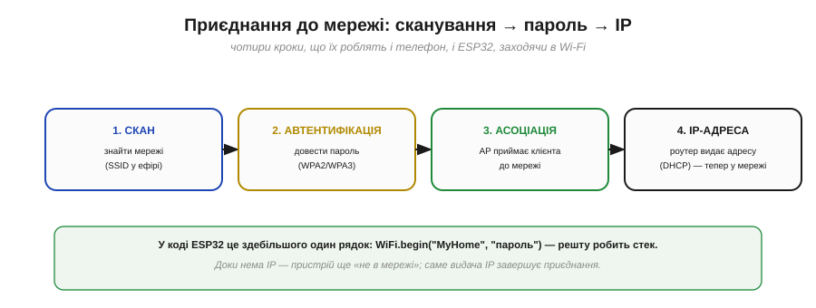
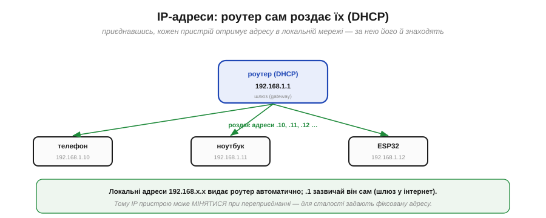

# Wi-Fi: клієнт, точка доступу, IP

Wi-Fi — це не просто «радіо», а ціла **система** поверх нього: спосіб під'єднати пристрій до мережі так, ніби він з'єднаний дротом, і дати йому повний доступ до інтернету. Для розробника найцінніше тут — що вся складність радіо й мережі схована, і маленький чіп на кшталт ESP32 стає **повноцінним вузлом мережі** за кілька рядків коду. Щоб користуватися цим свідомо, розберімо ключові поняття: точку доступу, приєднання, режими чіпа й, головне, **IP-адресу**, з якої й відкривається весь інтернет.

### Інфраструктурний режим: усе через точку доступу

Звичайний Wi-Fi працює в **інфраструктурному** режимі: пристрої не говорять напряму один з одним, а всі підключаються до центрального вузла — **точки доступу** (*access point*, AP), якою зазвичай є домашній роутер.

*Рис. Телефон, ноутбук, ESP32 — усі **клієнти** — під'єднуються по радіо до **точки доступу**, а вона з'єднує їх між собою й виводить у решту мережі (часто дротом — в інтернет). Клієнти не спілкуються напряму: усе йде через AP. Ім'я мережі — **SSID** — це те, що ти бачиш у списку Wi-Fi.*

Точка доступу — це **хаб** і водночас **міст**: вона і керує тим, хто в мережі, і з'єднує радіо-світ із дротовим (виходом в інтернет). Звідси й перше практичне поняття — **SSID** (*Service Set Identifier*), ім'я мережі: саме його ти обираєш у списку Wi-Fi і вказуєш пристрою, до якої мережі приєднатися.

### Як приєднатися: скан, пароль, IP

Приєднання до Wi-Fi — це коротка послідовність кроків, однакова і для телефона, і для ESP32.

*Рис. **Скан** — знайти доступні мережі (їхні SSID лунають в ефірі). **Автентифікація** — довести, що знаєш пароль (шифрування WPA2/WPA3). **Асоціація** — AP приймає клієнта в мережу. **IP-адреса** — роутер видає пристрою адресу (через DHCP), і лише тоді той по-справжньому «в мережі».*

У коді ESP32 усе це зазвичай стискається в один рядок на кшталт `WiFi.begin("MyHome", "пароль")` — а решту (скан, рукостискання, шифрування) робить вбудований стек. Важливий нюанс: **доки пристрій не отримав IP-адресу, він ще не «в мережі»**. Саме видача IP завершує приєднання.

### Два режими чіпа: STA і AP

Цікаво, що чіп на кшталт ESP32 може бути **по обидва боки** Wi-Fi.

*Рис. У режимі **STA** (*station*, клієнт) ESP32 приєднується до наявної мережі — точно як телефон до домашнього Wi-Fi. У режимі **AP** (*access point*) він **сам** створює мережу, і вже інші пристрої заходять до нього. ESP32 уміє навіть обидва режими одночасно (AP+STA).*

Це дуже практично. **STA** потрібен, щоб вийти в інтернет — пристрій стає клієнтом домашньої мережі. **AP** зручний, коли треба віддати дані **напряму**, без роутера: наприклад, ESP32 піднімає власну мережу й сторінку налаштувань, до якої під'єднуєшся телефоном, щоб ввести пароль домашнього Wi-Fi. А режим **AP+STA** дозволяє і бути в домашній мережі, і водночас приймати прямі підключення.

### IP-адреси й DHCP

Тепер — про ту саму IP-адресу. Коли пристрій приєднується, роутер автоматично видає йому **IP-адресу** — номер, за яким його знаходять у мережі. Робить це служба **DHCP** (*Dynamic Host Configuration Protocol*), вбудована в роутер.

*Рис. Роутер (зазвичай сам із адресою 192.168.1.1 — це **шлюз** в інтернет) роздає приєднаним пристроям адреси: телефону 192.168.1.10, ноутбуку .11, ESP32 .12. Так кожен отримує свою адресу в локальній мережі автоматично.*

Локальні адреси виду **192.168.x.x** (є й інші приватні діапазони) роздаються в межах твоєї мережі; адреса .1 зазвичай належить самому роутеру й слугує **шлюзом** — воротами в інтернет. Один важливий наслідок: оскільки IP **видається** при приєднанні, він може **мінятися** — пристрій, переприєднавшись, дістане іншу адресу. Тому, коли потрібна стала адреса (щоб до пристрою завжди можна було звернутися), задають **фіксований** IP.

### Дві адреси: MAC і IP

Тут варто розрізнити дві зовсім різні «адреси», які має пристрій, бо їх часто плутають.

*Рис. **MAC-адреса** (як-от A4:CF:12:9B:5E:07) зашита виробником у саме радіо, унікальна й не міняється — «паспорт заліза». **IP-адреса** (192.168.1.12) видається мережею й може змінюватися — «адреса в цій мережі». Це два різні рівні.*

Гарна аналогія: **MAC** — як ім'я людини (незмінне, дане раз), а **IP** — як її поточна адреса проживання (може помінятися при переїзді). MAC зашита в чіп назавжди й унікальна на весь світ; IP залежить від того, у якій мережі пристрій зараз. Маршрутизація по інтернету працює з **IP**-адресами, а [MAC потрібен для доставки в межах однієї локальної ланки](book:communications/mac-ip-arp). Обидві потрібні, але на різних рівнях.

### З IP відкривається весь інтернет

І ось головне диво Wi-Fi. Щойно пристрій отримав IP-адресу, він користується тим самим **TCP/IP**, що й будь-який комп'ютер, — і раптом йому стає доступний **весь інтернет**.

*Рис. ESP32 (192.168.1.12) → роутер (шлюз) → інтернет → сервер чи хмара. З IP-адресою маленький чіп шле дані в хмару, тягне точний час, оновлення, команди — як повноцінний учасник мережі. Уся складність інтернету (маршрути, DNS, сервери) працює так само, як для ноутбука.*

Радіо тут перетворюється на **ворота** в мережу. Те, що було копійчаним мікроконтролером, тепер може звертатися до серверів по всьому світу: надсилати телеметрію в хмару, отримувати команди, синхронізувати час, завантажувати оновлення. І все це — стандартними засобами інтернету, бо для мережі ESP32 — просто ще один вузол із IP-адресою. Саме тому Wi-Fi-пристрій так легко зробити «розумним»: не треба винаходити зв'язок, досить підключитися до наявної інфраструктури.

### IP : порт = адреса послуги

Лишилася одна деталь, без якої картина неповна. IP-адреса доводить тебе до **пристрою**, але на одному пристрої може працювати **багато** служб одразу. Яку з них ти хочеш? На це відповідає **порт**.

*Рис. Повна адреса служби — це IP **і** порт: 192.168.1.12:1883. IP (192.168.1.12) каже, **який пристрій**; порт (1883) — **яка служба** на ньому. Приклади: порт 80 — веб (HTTP), 1883 — MQTT, 22 — віддалений вхід, або твій власний номер для власної служби.*

Аналогія проста: **IP — це будинок, а порт — квартира** в ньому. Щоб дістатися конкретної служби, треба знати і те, і те. Стандартні служби мають усталені порти (веб — 80, захищений веб — 443, MQTT — 1883), а для власного протоколу обираєш будь-який вільний номер. Пара «IP:порт» — це повна адреса, за якою один пристрій звертається до конкретної служби на іншому.

> 🔧 **Навіщо це.** Це базовий словник будь-якого мережевого пристрою. Підключаючи ESP32 до Wi-Fi, ти: даєш йому **SSID і пароль** (`WiFi.begin`), чекаєш, поки він отримає **IP** (інакше він ще не в мережі), і далі відкриваєш з'єднання за адресою **IP:порт** потрібного сервера. Якщо «не працює» — перевір саме ці кроки: чи приєднався (є SSID, правильний пароль), чи отримав IP (а не 0.0.0.0), і чи правильні адреса й порт сервера. А для пристрою, до якого звертаються **ззовні**, подбай про сталу адресу — DHCP-IP може змінитися.

З Wi-Fi і IP пристрій стає вузлом мережі. Та лишається ключове питання, від якого залежить надійність обміну: **як** саме доставляти дані по цій мережі — з гарантією чи якнайшвидше? Сам по собі радіоканал [доставляє пакети «як вийде» (best-effort), без гарантій](book:communications/on-chip-radio) — і поверх нього мережа пропонує два різні характери доставки, [надійний потік TCP проти швидкого UDP](book:communications/tcp-vs-udp). Вибір між ними визначає характер усього зв'язку.

---
