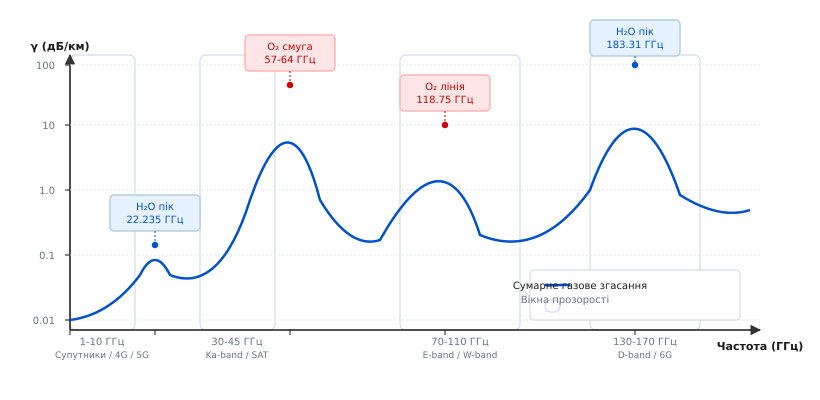
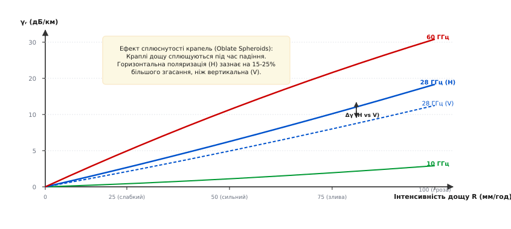
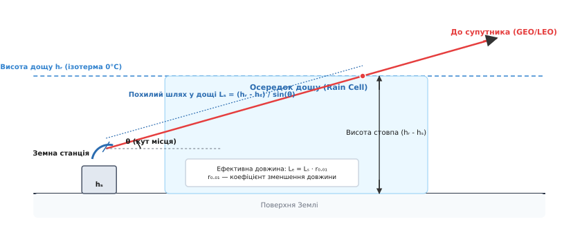

# Атмосферне поглинання: лінії H2O, O2 та дощове згасання

<preknowlist>
- [Згасання у просторі](book:communications/free-space-loss) — сферичне розходження електромагнітної хвилі та закон оберненого квадрата відстані.
- [Рівняння Фріїса](book:communications/friis-transmission) — енергетичний баланс радіолінії та залежність ефективної апертури від довжини хвилі.
- [Діапазони частот](book:communications/frequency-bands) — спектральний поділ від УВЧ (UHF) до терагерцових частот.
</preknowlist>

Радіорелейний міст 60 ГГц між двома міськими офісами передає дані зі швидкістю 10 Гбіт/с із нульовим рівнем помилок у сонячний день, але раптово втрачає зв'язок під час грози. У той самий час супутниковий термінал Ka-діапазону (30 ГГц), який бездоганно працює взимку, під час літнього зливового дощу зазнає падіння потужності на 30 дБ — сигнал слабшає у 1000 разів за лічені секунди. Причина цих явищ полягає у тому, що тропосфера Землі — це не порожній вакуум з постійним коефіцієнтом заломлення, а динамічне газове середовище з діелектричними втратами. Коли довжина електромагнітної хвилі скорочується до сантиметрів і міліметрів, атмосфера перестає бути прозорим вікном і перетворюється на складний спектральний фільтр із вузькими вікнами прозорості та смугами глухого поглинання.

Причина ослаблення радіохвиль в атмосфері розпадається на два фундаментально різних фізичних механізми: **молекулярне поглинання газами** (водяною парою `H2O` та киснем `O2`) і **розсіювання та поглинання гідрометеорами** (краплями дощу, туманом, мокрим снігом). Перший механічний процес є неперервним квантово-механічним поглинанням енергії квантів фотонів дипольними молекулами газів; другий — це класична макроскопічна взаємодія електромагнітного поля із діелектричними краплями води, розмір яких співмірний із довжиною радіохвилі.

Розберемо обидва механізми до дна: побачимо квантово-механічну природу резонансних ліній `H2O` та `O2`, з'ясуємо причинно-наслідковий зв'язок розширення ліній тиском, розберемо фізику розсіювання Мі на краплях дощу, порівняємо згасання для горизонтальної та вертикальної поляризації, а також оцінимо інженерні методи розрахунку та захисту радіоліній.

---

### Фізика квантових переходів у газах тропосфери

Коли електромагнітна хвиля поширюється крізь суміш газів тропосфери, її електричне та магнітне поля взаємодіють із внутрішніми ступенями вільності молекул. Якщо частота радіохвилі `f` збігається із різницею енергетичних рівнів молекули `ΔE` через квантове співвідношення `ΔE = h · f` (де `h` — стала Планка), відбувається **резонансне поглинання**: фотон радіовипромінювання знищується, а його енергія переходить у кінетичну енергію обертання або електронного спіну молекули.

В атмосфері Землі основними поглиначами мікрохвильового та міліметрового випромінювання є дві молекули: **водяна пара (`H2O`)** та **молекулярний кисень (`O2`)**. Інші гази (азот `N2`, вуглекислий газ `CO2`, озон `O3`, аргон `Ar`) або не мають необхідного дипольного моменту, або їх концентрація занадто мала, щоб дати відчутний внесок на частотах до 300 ГГц.

#### Електричний дипольний момент водяної пари H2O

Молекула водяної пари `H2O` має вигнуту асиметричну геометрію (кут між зв'язками `O-H` становить близько 104.5°). Через вищу електронегативність атома кислороду електронна хмара зсунута від атома водню, що створює великий постійний **електричний дипольний момент** (`μ ≈ 1.85` Дебая).

Оскільки молекула `H2O` є асиметричним возиком (asymmetric top), її обертальні рівні енергії визначаються трьома головними моментами інерції і позначаються квантовими числами `J_(K_a, K_c)`. Обертальні спектри водяної пари містять тисячі квантових переходів. У мікрохвильовому діапазоні найважливішими є два обертальні переходи:
- **Перший резонансний пік на частоті 22.235 ГГц:** Відповідає квантовому переходу між обертальними рівнями `6_-5` та `5_-1`. Це відносно слабкий резонанс із питомим згасанням близько `0.2` дБ/км при стандартній вологості 7.5 г/м³, проте він має вирішальне значення, оскільки розташований у зоні спектра, де будуються супутникові та радіорелейні лінії.
- **Другий потужний пік на частоті 183.31 ГГц:** Відповідає квантовому переходу `3_13 -> 2_20`. На цій частоті питоме згасання у вологій атмосфері сягає 30–60 дБ/км.

Розподіл молекул за енергетичними рівнями описується статистикою Больцмана. При підвищенні температури атмосфери населеність нижніх обертальних рівнів змінюється, що призводить до помітної температурної залежності інтенсивності ліній `S(T) ~ (300 / T)^2.5`.

#### Магнітний дипольний момент молекулярного кисню O2

На відміну від водяної пари, молекула кисню `O2` є симетричною і не має постійного електричного дипольного моменту. Здавалося б, вона не повинна взаємодіяти із електричним полем хвилі. Проте основний електронний стан молекули кисню є триплетним (`³Σ_g⁻`): два неспарені електрони з паралельними спінами створюють постійний **магнітний дипольний момент** (`μ_m = 2` магнетонів Бора).

Магнітне поле радіохвилі взаємодіє із цим електронним спіном, викликаючи зміни орієнтації спіну відносно вектора обертального моменту ядер молекули (спін-обертальна тонка структура). Це створює два унікальні спектральні явища:
- **Смуга поглинання кисню 57–64 ГГц (комплексна смуга 60 ГГц):** Складається із 33 щільно розташованих квантових ліній спін-обертального розщеплення (від переходів `N = 1` до `N = 25`). На рівні моря через взаємне перекриття ліній ця смуга утворює єдиний суцільний «бар'єр» згасання величиною від 15 до 20 дБ/км.
- **Поодинока резонансна лінія на частоті 118.75 ГГц:** Відповідає ізольованому квантовому переходу кисню `1_- -> 1_+` зі згасанням понад 10 дБ/км.

#### Розширення спектральних ліній тиском (Pressure Broadening)

Якби молекули газів перебували у порожнечі без зіткнень, спектральні лінії поглинання були б нескінченно вузькими голчастими піками шириною у кілька кілогерц. Проте у щільних шарах тропосфери при атмосферному тиску `1013.25` гПа молекула зазнає мільярдів зіткнень за секунду. Кожне зіткнення хаотично збиває фазу обертання молекули, скорочуючи середній час життя її квантового стану `Δt`.

Згідно із співвідношенням невизначеності Гейзенберга `ΔE · Δt ≥ ℏ / 2`, скорочення часу життя `Δt` призводить до розширення енергетичного рівня `ΔE` і, відповідно, до **розширення спектральної лінії тиском** (*pressure broadening*).

Фізичні наслідки розширення тиском є вирішальними:
1. **На рівні моря (висока щільність):** Зіткнення розмивають вузькі квантові лінії `O2` на частоті 60 ГГц у ширшу суцільну смугу шириною майже 10 ГГц.
2. **У стратосфері (на висоті 20–30 км):** Тиск повітря падає у десятки разів, кількість зіткнень зменшується, і суцільна смуга 60 ГГц розпадається на 33 окремі гострі спектральні голки.

Детальний математичний апарат квантового профілю Ван Влека-Вайскопфа та аналітичні вирази розширення ліній наведено у вставці [Математична модель Ван Влека-Вайскопфа та ITU-R](book:communications/atmospheric-absorption/math-van-vleck-weisskopf.md).

---

### Спектральні лінії поглинання та вікна прозорості

Якщо побудувати графік питомого газового згасання `γ_gas` (дБ/км) залежно від частоти радіохвилі від 1 ГГц до 350 ГГц для стандартних умов на рівні моря (тиск 1013.25 гПа, температура 15°C, вологість 7.5 г/м³), перед інженером постає чітка картина спектрального поділу атмосфери.


*Спектр питомого згасання в газах атмосфери (H₂O та O₂) на рівні моря. Чітко видно резонансні лінії 22.235 ГГц, 60 ГГц, 118.75 ГГц, 183.31 ГГц та проміжні вікна прозорості.*

Спектр поширення електромагнітної хвилі в атмосфері виразно ділиться на резонансні піки поглинання та **вікна прозорості** (atmospheric windows):

#### 1. Радіовікно прозорості (1–10 ГГц)

У цьому частотному діапазоні сумарне поглинання водяною парою та киснем не перевищує `0.01` дБ/км. Радіохвиля долає кілометрові відстані майже без втрат у газах. Саме тому діапазон 1–10 ГГц є найбільш цінним ресурсом радіоспектра: тут працюють системи мобільного зв'язку 4G LTE, 5G Sub-6GHz, Wi-Fi 2.4/5 ГГц, супутникова навігація GPS/GLONASS/Galileo та магістральний супутниковий зв'язок C-діапазону (4–6 ГГц).

#### 2. Вікно Ka-діапазону (20–45 ГГц)

Між першою лінією водяної пари (22.235 ГГц) та смугою кисню (60 ГГц) розташоване вікно із відносно низьким газовим згасанням (`0.05–0.2` дБ/км). Воно активне для супутникових систем Ku-діапазону (12–18 ГГц) та Ka-діапазону (26–40 ГГц), включаючи системи Starlink та OneWeb. Проте сам пік `H2O` на **22.235 ГГц** вимагає обережності: проектувальники уникають випромінювання безпосередньо на цій частоті, зміщуючи несучі частоти у зони 18 ГГц або 28 ГГц.

#### 3. Смуга глухого поглинання кисню 60 ГГц (57–64 ГГц)

У цій смузі згасання сягає `15–20` дБ/км. Сигнал потужністю 1 Вт (30 dBm) через 1 км дистанції втрачає 99.99% своєї енергії тільки через поглинання киснем.

Здавалося б, такий діапазон непридатний для зв'язку. Проте телекомунікаційна інженерія перетворила цей недолік на перевагу:
- **Просторове повторне використання частот (Frequency Reuse):** Оскільки сигнал згасає за межами кількох сотень метрів, сусідні Wi-Fi точки доступу або секторні станції діапазону 60 ГГц (стандарти IEEE 802.11ad / 802.11ay WiGig) можуть працювати на одній і тій самій частоті у сусідніх будівлях, не створюючи жодних взаємних завад.
- **Захищений зв'язок (Interception-proof links):** Радіолінію 60 ГГц неможливо перехопити з далекої відстані або з супутника розвідки, оскільки атмосфера надійно екранує випромінювання.

#### 4. Вікно E-band (71–76 ГГц та 81–86 ГГц)

Після виходу зі смуги кисню поглинання газами знову падає до `0.4–0.5` дБ/км. Смуга E-band дає величезну ширину каналу (до 10 ГГц), що дозволяє будувати міські радіорелейні мости зі швидкістю 10–20 Гбіт/с для з'єднання базових станцій 5G.

#### 5. Вікна W-band (92–95 ГГц) та D-band (130–175 ГГц)

Між резонансною лінією кисню 118.75 ГГц та потужним піком водяної пари 183.31 ГГц розташовані високочастотні вікна прозорості. Вони активно освоюються для автомобільних радарів адаптивного круїз-контролю (77–81 ГГц), міліметрових радарів безпеки аеропортів та майбутніх систем 6G.

Історію відкриття цих ліній під час Другої світової війни та еволюцію вимірювальних систем описано у вставці [Історія дослідження атмосферного поглинання](book:communications/atmospheric-absorption/hist-atmospheric-absorption.md).

---

### Дощове згасання та взаємодія з гідрометеорами

Яким би відчутним не було поглинання газами `H2O` та `O2`, воно є передбачуваним і відносно статичним. Справжнім ворогом високочастотних радіоліній (понад 10 ГГц) є **гідрометеори**: дощ, мокрий сніг, град та туман.

Крапля дощу — це не газоподібна молекула, а макроскопічний об'єкт із рідкої води радіусом від `0.5` мм (дрібна мжичка) до `3` мм (велика злива). Рідка вода володіє величезною діелектричною проникністю (`ε_r ≈ 80` на низьких частотах із великою уявною частиною втрат `ε"`).

#### Спектр розмірів крапель (Distribution of Drop Sizes)

У реальному дощі краплі мають не однаковий розмір, а описуються статистичним розподілом Маршалла-Палмера:

```
N(D) = N_0 · exp(-Λ · D)      [м⁻³ · мм⁻¹]
```

де `D` — еквівалентний діаметр краплі в мм, `N_0 = 8000`, а параметр `Λ` залежить від інтенсивності дощу `R` через вираз `Λ = 4.1 · R^(-0.21)`. Під час сильної грози кількість великих крапель `D > 2` мм зростає у десятки разів, що призводить до різкого стрибка згасання на мікрохвилях.

#### Фізика розсіювання: від Релея до Мі

Взаємодія електромагнітної хвилі з діелектричною сферою краплі визначається співвідношенням між діаметром краплі `d` та довжиною радіохвилі `λ`:

1. **Релеївське розсіювання (`d << λ`):** На частотах нижче 3 ГГц (довжина хвилі `λ > 10` см) розмір краплі у десятки разів менший за довжину хвилі. Інтенсивність розсіювання пропорційна `1 / λ⁴`. Втрати сигналу на таких частотах нехтовно малі (менше 0.001 дБ/км) навіть під час зливи.
2. **Розсіювання Мі (`d ~ λ`):** Коли частота сигналів росте до 10–30 ГГц, довжина хвилі скорочується до `10–1` мм і стає співмірною із розміром крапель дощу. Крапля перестає бути точковим диполем і перетворюється на об'ємний резонансний об'єкт. Всередині краплі виникають вихрові струми поляризації, які перетворюють енергію радіохвилі на тепло (поглинання), а також перевипромінюють хвилю в усіх просторових напрямках (розсіювання).

#### Поліноміальна модель ITU-R P.838

За стандартом ITU-R P.838 питоме згасання в дощі `γ_r` (дБ/км) описується емпіричним степеневим законом:

```
γ_r = k · R^α      [дБ/км]
```

де `R` — інтенсивність дощу у міліметрах на годину (мм/год), а `k` та `α` — емпіричні коефіцієнти, що залежать від частоти `f`, поляризації хвилі та кута місця антени.


*Питоме згасання в дощі залежно від інтенсивності R (мм/год) для різних частот. Горизонтальна поляризація (H) зазнає сильнішого згасання за вертикальну (V) через сплюснутість крапель.*

Аналіз залежностей розкриває важливі фізичні закономірності:
- **Залежність від інтенсивності дощу `R`:** Показник степеня `α` для більшості частот близький до 1 (`0.8–1.2`). Це означає, що при подвоєнні інтенсивності зливи згасання росте майже лінійно.
- **Залежність від частоти `f`:** Коефіцієнт `k` стрімко зростає при переході до вищих частот. На частоті 10 ГГц при зливі 50 мм/год згасання становить близько `1.5` дБ/км; на частоті 28 ГГц воно зростає до `9.8` дБ/км, а на частоті 60 ГГц сягає **25 дБ/км**.

#### Поляризаційна асиметрія: ефект сплюснутих крапель

Принципово важливим феноменом є різниця між горизонтальною (H) та вертикальною (V) поляризаціями.

У шкільних підручниках краплю дощу зображують у вигляді ідеальної сфери чи сльозинки. Проте у реальності, коли крапля падає крізь повітря, опір набігаючого потоку плющить її знизу. Крапля набуває форми **сплюснутого сфероїда** (*oblate spheroid*) — плоского бублика чи оладки з горизонтальною великою віссю.

Через це шар рідкої води у горизонтальній площині має більший ефективний переріз взаємодії з електромагнітним полем, ніж у вертикальній площині. Як наслідок:
- Горизонтально поляризована хвиля (вектор `E` паралельний землі) зазнає на **15–30% більшого згасання**, ніж вертикально поляризована хвиля.
- Для кругової поляризації (circular polarization) згасання займає середнє значення між H та V.

Це має прямолінійний інженерний наслідок: при проектуванні критично важливих мікрохвильових радіоліній Ka-діапазону завжди віддають перевагу **вертикальній поляризацій**, оскільки вона дає вищу стійкість під час дощу.

---

### Розрахунок похилого шляху супутникової траси (Slant Path) та шумової температури

Для супутникових систем зв'язку (Starlink, Eutelsat, SES) або космічного телебачення сигнал проходить крізь атмосферу під кутом підвищення `θ` (elevation angle). Розрахунок загального згасання на похилій трасі регулюється стандартом **ITU-R P.618**.


*Геометрія похилої радіолінії земля-супутник через товщу дощового осередку із позначенням ефективної довжини шляху.*

Геометрія похилого шляху містить такі елементи:

1. **Висота дощу `h_R` (Rain Height):** Визначена висотою ізотерми `0°C` (нульової ізотерми), вище якої краплі води перетворюються на лід та сухий сніг. Сухий сніг та лід мають низьку діелектричну проникність (`ε_r ≈ 3.1`), тому втрати у них у десятки разів менші, ніж у рідкому дощі. У помірних широтах `h_R` становить 3–4 км влітку та 1–2 км взимку.
2. **Чиста геометрична довжина шляху у дощі `L_S`:**

```
L_S = (h_R - h_s) / sin(θ)      [км]
```

де `h_s` — висота земної станції над рівнем моря, `θ` — кут місця антени. При малих кутах підвищення (наприклад, `θ = 10°`) геометричний шлях сигналу крізь дощову хмару може досягати 15–20 км.

3. **Неоднорідність дощового осередку та коефіцієнт скорочення `r_0.01`:** Сильна злива з інтенсивністю `R = 50` мм/год рідко накриває суцільну територію радіусом 20 км. Зазвичай висока інтенсивність дощу зосереджена у компактних фронтальних осередках (rain cells) розміром 2–5 км.

Тому стандарт ITU-R P.618 уводить коефіцієнти зменшення довжини траси `r_0.01` та `v_0.01`, які обчислюють **ефективну довжину шляху у дощі** `L_E = L_S · r_0.01 · v_0.01`. Розрахункове дощове згасання для 99.99% доступності становить:

```
A_0.01 = γ_r · L_E      [дБ]
```

#### Вплив на шумову температуру системи (Sky Noise Temperature)

Атмосферне та дощове згасання завдає супутниковому каналу подвійного удару: воно не лише зменшує потужність корисного сигналу `C`, а й **підвищує рівень шуму `N`** на вході приймача.

Згідно з законом теплового випромінювання Кірхгофа, будь-яке середовище, що поглинає електромагнітне випромінювання із згасанням `A` (у разах), випромінює власне теплове радіовипромінювання. Еквівалентна **шумова температура неба** `T_sky` на вхідних клемах антени дорівнює:

```
T_sky = T_phys · (1 - 10^(-A / 10))      [К]
```

де `T_phys` — фізична температура атмосфери та дощу (близько `275–290` К).

Якщо в суху погоду згасання `A = 0.2` дБ, то шумова температура неба становить лише `T_sky ≈ 13` К. Але під час грози при згасанні `A = 10` дБ шумова температура неба зростає до **260 К**! Приймач накриває хвиля теплового шуму, що призводить до різкого падіння співвідношення сигнал/шум (SNR) і зриву демодуляції.

#### Статистика доступності радіолінії (Availability & Fade Margin)

У радіозв'язку надійність каналу описують коефіцієнтом доступності за рік:
- **99.9% доступності (Three Nines):** Сумарний час простою каналу через дощ становить не більше `8.7` годин на рік.
- **99.99% доступності (Four Nines):** Сумарний простій не перевищує `52` хвилин на рік. Вимога для комерційних ISP та супутникового зв'язку.
- **99.999% доступності (Five Nines):** Простій не більше `5.2` хвилин на рік. Жорсткий стандарт для магістральних каналів зв'язку сотових веж та банківських транзакцій.

Перехід від 99.9% до 99.999% доступності у Ka-діапазоні вимагає збільшення запасу потужності на дощове завмирання (**rain fade margin**) з 8 дБ до 35 дБ. Забезпечити такий величезний запас енергії лише за рахунок збільшення потужності передавача або розміру антени часто неможливо з технічних або економічних причин.

---

### Інженерні методи боротьби із атмосферним та дощовим згасанням

Щоб забезпечити високу доступність радіоліній на частотах понад 10 ГГц без роздування розмірів антен та енергоспоживання, застосовують комплекс **динамічних методів компенсації згасання** (FMT — *Fade Mitigation Techniques*):

#### 1. Адаптивна модуляція та кодування (ACM — Adaptive Coding and Modulation)

У ясну суху погоду радіосигнал має високе співвідношення сигнал/шум (SNR). Радіомодем автоматично вмикає високочастотну модуляцію **256-QAM** або **1024-QAM**, забезпечуючи максимальну швидкість передачі даних.

Як тільки починається дощ і рівень сигналу падає, модем без розриву з'єднання послідовно знижує порядок модуляції: `256-QAM -> 64-QAM -> 16-QAM -> QPSK`. Для модуляції QPSK потрібне у сотні разів менше співвідношення сигнал/шум, ніж для 256-QAM. Ціною тимчасового зменшення швидкості передачі (наприклад, з 1 Гбіт/с до 100 Мбіт/с) лінія зв'язку залишається працездатною навіть під час найсильнішої грози.

#### 2. Динамічне управління потужністю передавача (TPC — Transmit Power Control)

У нормальних умовах передавач працює на зниженій потужності (наприклад, 10% від максимуму), щоб не створювати завад сусіднім станціям та економити ресурс підсилювача. Коли приймач фіксує початок згасання сигналу в дощі, він зворотною командою змушує передавач миттєво підняти потужність до 100% (додаючи 10–15 дБ до запасу лінка).

#### 3. Просторова рознесеність прийому (Site Diversity)

Оскільки грозові осередки сильного дощу мають обмежений діаметр (2–4 км), дві земні супутникові станції розташовують на відстані 10–20 км одна від одної та з'єднують високошвидкісною оптичною лінією. Ймовірність того, що сильна злива одночасно накриє обидва приймачі, прямує до нуля. Коли над першою станцією випадає дощ, трафік миттєво перенаправляється через другу станцію.

Практичну реалізацію розрахунку газового та дощового згасання для інженерного проектування трас мовами C та C++ наведено у вставці [Проект: Калькулятор атмосферного та дощового згасання](book:communications/atmospheric-absorption/proj-atmospheric-calculator.md).

---

### Підсумкова порівняльна таблиця частотних діапазонів

| Діапазон частот | Поглинання газами (O₂/H₂O) | Згасання у дощі (50 мм/год) | Головне застосування та особливості |
| :--- | :--- | :--- | :--- |
| **Sub-6 GHz (1–6 ГГц)** | Нехтовно мале (`< 0.01` дБ/км) | Практично відсутнє (`< 0.1` дБ/км) | 4G LTE, 5G Sub-6, Wi-Fi 2.4/5, C-band SAT. Висока пробивна здатність. |
| **Ku-band (12–18 ГГц)** | Дуже мале (`0.05–0.1` дБ/км) | Помірне (`2–4` дБ/км) | Супутникове ТВ, VSAT. Потребує помірного дощового запасу (3–6 дБ). |
| **22.235 ГГц (H₂O пік)** | Резонансний пік водяної пари (`~0.2` дБ/км) | Високе (`6–8` дБ/км) | Уникають для магістралей; використовують для метеозондування атмосфери. |
| **Ka-band (26–40 ГГц)** | Помірне (`0.1–0.4` дБ/км) | Сильне (`9–15` дБ/км) | Starlink, 5G mmWave. Вимагає обов'язкового застосування ACM та TPC. |
| **60 ГГц (O₂ смуга)** | Глухе поглинання O₂ (`15–20` дБ/км) | Дуже сильне (`~25` дБ/км) | IEEE 802.11ay WiGig, короткі безпечні мості до 500 м, frequency reuse. |
| **E-band (70/80 ГГц)** | Низьке газове (`~0.4` дБ/км) | Екстремальне (`> 30` дБ/км) | Міські магістральні радіорелейні лінії 10–20 Гбіт/с. Обмеження дальності 2–3 км. |

Знання фізики атмосферного поглинання та дощового розсіювання дозволяє інженерам не просто обирати оптимальні частоти для радіосистем, а й будувати надійні цифрові канали, здатні зберігати зв'язок за будь-якої погоди.
