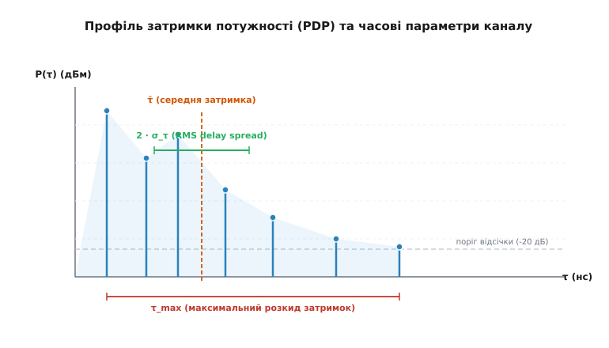
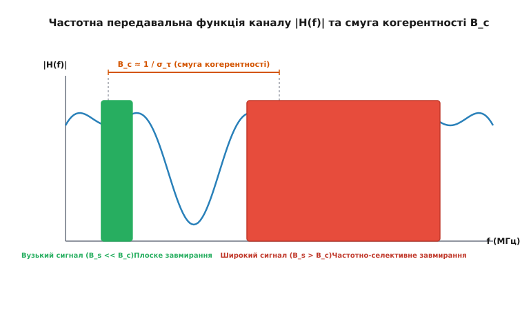
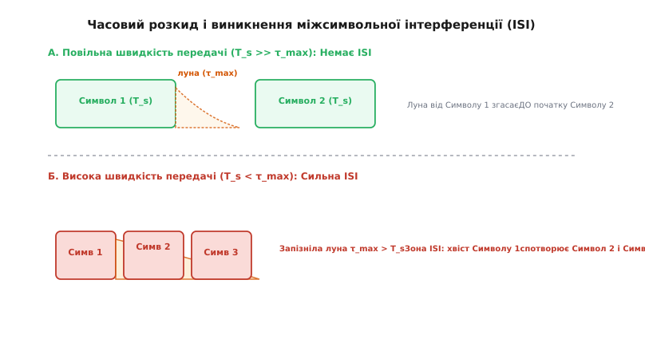
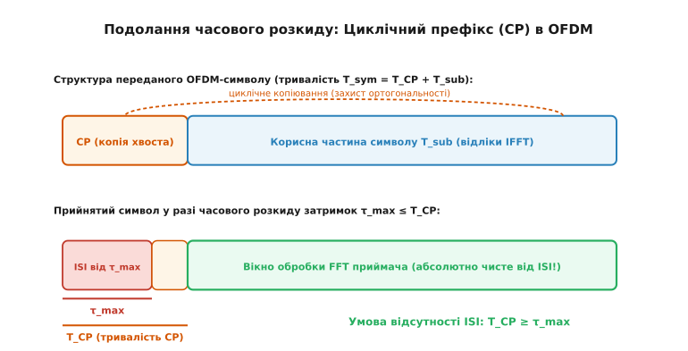

# Часовий розкид (delay spread) і частота когерентності

<preknowlist>
- [Багатопроменевість і завмирання](book:communications/multipath-fading) — поширення хвиль кількома шляхами, інтерференція копій та утворення завмирань.
- [Смуга і межа Шеннона](book:communications/bandwidth-capacity) — зв'язок між шириною частотної смуги та пропускною здатністю каналу.
- [FSK і PSK](book:communications/fsk-psk) — цифрова модуляція, тривалість символу та фазові сузір'я.
- [OFDM: мультиплексування з ортогональними піднесними](book:communications/ofdm) — захисний інтервал та поділ широкої смуги на ортогональні піднесучі.
</preknowlist>

Коли радіопередавач випромінює короткий імпульс, у реальному середовищі приймач отримує не один чистий відлік, а цілу серію запізнілих лун. Окремі копії хвилі відбиваються від стін будинків, пагорбів, залізобетонних перекриттів або машин, долаючи різний шлях і приходячи до антени з різними затримками. Передавальна функція середовища розтягує сигнал у часі.

Цей феномен розмивання сигналу в часовій області називають **часовим розкидом затримок** (*delay spread*). У частотній області йому відповідає двоїсте явище — **частота когерентності** (*coherence bandwidth*). Саме співвідношення між часовим розкидом затримок та швидкістю передачі символів визначає, чи працюватиме радіолінія спокійно, чи її продуктивність упертися в міжсимвольну інтерференцію (*ISI*), яку неможливо подолати простим збільшенням потужності передавача.

---

### Фізична природа часового розкиду та механізми розсіювання

Радіохвиля поширюється у вільному просторі зі швидкістю світла `c ≈ 3·10⁸ м/с`. Це означає, що кожен додатковий метр шляху, пройдений відбитим променем, додає затримку приблизно `3.33 наносекунди` (`нс`).

У реальних умовах радіосигнал доходить до приймача багатьма траєкторіями (*multipath propagation*):
- **Прямий промінь** (*Line-of-Sight, LOS*) долає найкоротшу відстань `d₀` і прибуває першим у момент часу `τ₀ = d₀ / c`.
- **Відбиті промені** (*Non-Line-of-Sight, NLOS*) долають відстані `dᵢ = d₀ + Δdᵢ` і прибувають із запізненням `τᵢ = dᵢ / c = τ₀ + Δτᵢ`.

```
Різниця ходу променів Δd = 30 м   →   Затримка луни Δτ = 100 нс
Різниця ходу променів Δd = 300 м  →   Затримка луни Δτ = 1000 нс (1 мкс)
Різниця ходу променів Δd = 3 км   →   Затримка луни Δτ = 10 мікросекунд (мкс)
```

У фізиці поширення радіохвиль виділяють два головні класи відбивань, які формують запізнілі копії:
1. **Дзеркальне відбиття** (*Specular Reflection*): Виникає при відбитті від великих гладких поверхонь (фасади будинків, шибки, металеві паркани, дзеркало води). Дзеркальний промінь зберігає високу потужність, чітку фазову структуру і формує поодинокі сильні піки на графіку затримок.
2. **Дифузне розсіювання** (*Diffuse Scattering*): Виникає при взаємодії з шорсткими поверхнями, кронами дерев, колонами або дрібними архітектурними елементами, розмір яких співмірний із довжиною хвилі `λ`. Дифузне розсіювання створює суцільний «хвіст» з безлічі слабких запізнілих променів із випадковими фазами.

У кімнаті чи офісі відбиття від стін і меблів створюють різницю ходу у кілька метрів, що дає розкид затримок у десятки наносекунд. На вулиці міста відбиття від хмарочосів дають розкид у мікросекунди, а в гірській місцевості віддалені скелі створюють луну із запізненням до десятків мікросекунд.

Якщо передавач надсилає одиночний вузький імпульс, у приймальну антену влітає не один спалах, а «пакет» імпульсів-копій. Спроба підняти швидкість цифрового зв'язку скорочує тривалість символу `T_s`. Коли період символу `T_s` стає співмірним із різницею затримок між променями, запізнілі копії попереднього символу наповзають на наступний символ, руйнуючи його демодуляцію.

---

### Профіль затримки потужності (PDP) та характеристики розкиду

Для кількісного опису розподілу енергії затриманих променів використовують **профіль затримки потужності** (*Power Delay Profile, PDP*). Він показує середню потужність прийнятого сигналу `P(τ)` як функцію затримки `τ`.


*Профіль затримки потужності (PDP): прямий промінь LOS та затримані відбиті копії. Позначено середню затримку τ̄, середньоквадратичний розкид σ_τ та максимальний розкид затримок τ_max.*

З профілю PDP виводять три ключові числові параметри каналу:

#### 1. Середня затримка (Mean Excess Delay, `τ̄`)
Перший початковий момент розподілу PDP. Враховує центр ваги прийнятої енергії сигналу за часом:

```
τ̄ = ∑ (Pᵢ · τᵢ) / ∑ Pᵢ
```

де `Pᵢ` — потужність `i`-го відбитого променя, а `τᵢ` — його затримка відносно першого прибулого променя.

#### 2. Середньоквадратичний розкид затримок (RMS Delay Spread, `σ_τ`)
Другий центральний момент PDP, що визначає ефективну часову «ширину» імпульсної відповіді каналу:

```
σ_τ = √[ ∑ Pᵢ · (τᵢ - τ̄)² / ∑ Pᵢ ]
```

Саме `σ_τ` слугує головною математичною метрикою багатопроменевого каналу. Простий максимальний інтервал між першим і останнім променем не враховує, де саме зосереджена основна енергія. Два канали з однаковою тривалістю луни можуть мати принципово різний розкид `σ_τ`, якщо в одного більшість енергії зосереджена на початку, а в іншого — рівномірно розподілена.

#### 3. Максимальний розкид затримок (Maximum Excess Delay, `τ_max`)
Часовий інтервал між першим прибулим променем та останнім відбитим променем, потужність якого ще перевищує поріг чутливості приймача або поріг відсічки фонового шуму (найчастіше беруть поріг `-20 дБ` відносно найпотужнішого піка). Параметр `τ_max` прямо визначає необхідну тривалість захисного інтервалу в системах із часовим розділенням.

Докладніше про формування статистичних моделей радіоканалів та внесок Філіпа Белло можна прочитати у вставці [історію дослідження багатопроменевого каналу та моделі Белло](book:communications/delay-spread/hist-delay-spread.md).

---

### Частота когерентності: двоїстість між часом і частотою

Багатопроменеве поширення можна аналізувати у двох еквівалентних областях: часовій та частотній. Вони пов'язані між собою через перетворення Фур'є.

Якщо в часовій області канал розмиває імпульси через розкид затримок `σ_τ`, то в частотній області йому відповідає виникнення **частотно-селективних завмирань**. Залежність амплітуди передавальної функції каналу `|H(f)|` від частоти стає звивистою: на одних частотах відбиті копії складаються у фазі (підсилення), а на інших — у протифазі (глибокий провал).


*Передавальна функція каналу в частотній області |H(f)|. Якщо смуга сигналу B_s куди менша за B_c, сигнал зазнає плоского завмирання; якщо ж B_s перевищує B_c, виникають глибокі селективні провали.*

**Частота когерентності** (*Coherence Bandwidth, `B_c`*) — це діапазон частот, у межах якого амплітудна характеристика каналу `|H(f)|` вважається відносно плоскою (константою), а фазовий зсув змінюється лінійно. Простіше кажучи, якщо дві спектральні складові сигналу віддалені одна від одної менше ніж на `B_c`, вони зазнають однаковості підсилення й однакового зсуву фази.

Оскільки часова імпульсна відповідь `h(τ)` та частотна передавальна функція `H(f)` є парою перетворення Фур'є, ширини цих функцій перебувають у суворо оберненій залежності:

```
B_c ≈ 1 / σ_τ
```

У практичній інженерії застосовують дві класичні формули обчислення `B_c`, залежно від вимог до суворості кореляції:

#### Визначення за порогом кореляції 50% (0.5)
Виристовують для загальної оцінки каналу в системах з еквалайзерами або завадостійким кодуванням:

```
B_c (50%) ≈ 1 / (5 · σ_τ)
```

#### Визначення за порогом кореляції 90% (0.9)
Застосовують у чутливих схемах модуляції (наприклад, узгоджена когерентна демодуляція без еквалайзера), де потрібна майже ідеальна пласкість характеристики:

```
B_c (90%) ≈ 1 / (50 · σ_τ)
```

Детальний математичний вивід частотної автокореляційної функції `ρ_H(Δf)` та доведення коефіцієнтів розраховано у вставці [математичне виведення моментів PDP та смуги когерентності](book:communications/delay-spread/math-pdp-moments.md).

---

### Два режими радіоканалу: Плоске проти частотно-селективного завмирання

Співвідношення між шириною спектра передаваного сигналу `B_s` та смугою когерентності каналу `B_c` ділить усі радіосистеми на дві фундаментальні категорії:

| Характеристика | Плоске завмирання (*Flat Fading*) | Частотно-селективне завмирання (*Frequency-Selective Fading*) |
| :--- | :--- | :--- |
| **Співвідношення смуг** | `B_s << B_c` | `B_s > B_c` |
| **Співвідношення часів** | `T_s >> σ_τ` | `T_s < σ_τ` |
| **Форма імпульсу** | Не спотворюється, зберігає прямокутність/піднятий косинус | Спотворюється, імпульс «розпливається» і наповзає на сусідів |
| **Ефект у частотній області** | Увесь спектр сигналу піднімається або опускається разом | Окремі частотні компоненти сигналу провалюються на 20–40 дБ |
| **Головна загроза** | Падіння загального рівня SNR (потрібен запас на завмирання) | Виникнення міжсимвольної інтерференції (*ISI*) |
| **Метод протидії** | Запас потужності, рознесені антени (*Diversity*) | Еквалайзери, адаптивне OFDM, захисні інтервали (*CP*) |

#### Плоске завмирання (Frequency-Flat Fading)
Виникає при передачі вузькосмугових сигналів. Оскільки спектр сигналу `B_s` вузький, увесь він вміщується всередину плаского плато `B_c`. Канал діє на сигнал просто як коефіціент підсилення `A(t)`, який повільно або швидко змінюється в часі. Окремі біти не плутаються між собою, а форма сигналу не викривляється — змінюється лише амплітуда прийнятого сузір'я.

#### Частотно-селективне завмирання (Frequency-Selective Fading)
Виникає при передачі широкосмугових сигналів. Спектр сигналу `B_s` перекриває кілька смуг когерентності `B_c`. Унаслідок цього одні частотні гармоніки сигналу проходять без перешкод, а інші потрапляють у глибокі нулі інтерференції й повністю зникають. Прийомне сузір'я розмивається, а в часовій області виникає руйнівна міжсимвольна інтерференція.

---

### Оцінка матриці каналу (CSI) та адаптація у Wi-Fi 6 і 5G

У сучасних цифрових системах зв'язку (Wi-Fi 6/6E, 4G LTE, 5G NR) передавач періодично вставляє у спектр відомі опорні пілотні відліки (Pilot Symbols / DM-RS / CSI-RS).
1. **Оцінка каналу (Channel Estimation):** Приймач порівнює прийняті амплітуди й фази пілотів із еталонними значеннями за допомогою методів найменших квадратів (LS) або MMSE та будує вимір комплексної передавальної функції `H[k]` для кожної піднесучої `k`.
2. **Формування матриці CSI (Channel State Information):** Сукупність векторів `H[k]` утворює матрицю CSI. За зміною `H[k]` між сусідніми піднесучими алгоритми оцінюють поточний RMS delay spread `σ_τ` радіоефіру.
3. **Адаптивна зміна тривалості захисного інтервалу:** У Wi-Fi 6 (802.11ax) стандартизовано три значення захисного інтервалу (Guard Interval, GI):
   - **Короткий GI (`0.8 мкс`):** Застосовується в малих кімнатах із коротким розкидом затримок (`σ_τ < 50 нс`), забезпечуючи максимальну швидкість.
   - **Звичайний GI (`1.6 мкс`):** Застосовується у стандартних офісних приміщеннях.
   - **Довгий GI (`3.2 мкс`):** Застосовується у вуличних мережах (Outdoor Wi-Fi) та великих стадіонах із суворим розкидом затримок (`σ_τ > 500 нс`), надійно захищаючи OFDM від ISI.

---

### Механізм міжсимвольної інтерференції (ISI)

Для інженера-програміста часовий розкид найочевидніше проявляється через **міжсимвольну інтерференцію** (*Intersymbol Interference, ISI*).


*Виникнення міжсимвольної інтерференції (ISI): при високій швидкості передачі (період символу T_s < τ_max) запізніла луна від попереднього символу наповзає на наступні символи, розмиваючи їх у приймачі.*

Нехай передавач надсилає послідовність символів із символьною швидкістю `R_s = 1 / T_s`.
- Якщо `T_s >> τ_max` (повільна передача), відбиті копії першого символу повністю згасають до того моменту, коли приймач починає стробувати другий символ. Вхідне вікно другого символу лишається чистим.
- Якщо `T_s < τ_max` (високошвидкісна передача), запізніла луна від Символу 1 продовжує звучати в антені в той самий момент, коли передавач випромінює Символ 2 та Символ 3. Енергія попередніх символів додається як завада до поточного.

#### Поріг помилок (BER Floor)
Головна небезпека ISI полягає в тому, що це **самоінтерференція сигналу**. На відміну від звичайного теплового шуму AWGN, енергія ISI пропорційна потужності передавача.

При збільшенні потужності передавача `P_tx` зростає як корисний сигнал, так і потужність запізнілої луни. У результаті відношення сигналу до ISI не покращується! На графіку залежності BER від SNR виникає горизонтальне плато (*BER floor*): скільки б кіловатної потужності ви не вкачували в антену, рівень помилок не впаде нижче певного порогу, поки не буде ліквідовано ISI.

---

### Вимірювання у реальних середовищах та числовий приклад

Значення RMS delay spread `σ_τ` суттєво відрізняються залежно від типів забудови та робочих частот:

| Середовище поширення | Типовий `σ_τ` | `B_c (50%)` | `B_c (90%)` | Максимальний `τ_max` |
| :--- | :--- | :--- | :--- | :--- |
| **Жила кімната / Офіс** | 10 – 50 нс | 4 – 20 МГц | 400 – 2000 кГц | < 150 нс |
| **Промисловий цех / Склад** | 100 – 300 нс | 660 кГц – 2 МГц | 66 – 200 кГц | 1 мкс |
| **Передмістя / Приміська траса** | 200 – 500 нс | 400 кГц – 1 МГц | 40 – 100 кГц | 2 мкс |
| **Міська забудова (Cellular Macro)** | 1 – 3 мкс | 66 – 200 кГц | 6.6 – 20 кГц | 10 мкс |
| **Гірська місцевість / Горби** | 5 – 10 мкс | 20 – 40 кГц | 2 – 4 кГц | 30 мкс |

> 🔧 **Навіщо це.** Рядок параметрів `σ_τ` та `B_c` прямо диктує вибір архітектури фізичного рівня (PHY). Наприклад, стандарт Wi-Fi (IEEE 802.11a/g/n/ac) розроблявся для кімнатних середовищ із `σ_τ ≈ 50 нс` (`B_c (50%) ≈ 4 МГц`). Розробники обрали ширину каналу 20 МГц і поділили її в OFDM на 64 піднесучі з інтервалом `312.5 кГц`. Оскільки `312.5 кГц << 4 МГц`, кожна окрема піднесуча працює у режимі ідеально плоского завмирання! Натомість для мобільного зв'язку 4G LTE, що працює в місті з `σ_τ ≈ 2 мкс` (`B_c ≈ 100 кГц`), інтервал між піднесучими довелося зменшити до `15 кГц`, щоб кожна піднесуча залишалася всередині своєї вузької смуги когерентності.

#### Розрахунок граничної швидкості без еквалайзера
Нехай пристрій працює в місті з виміряним `σ_τ = 1.5 мкс` (1500 нс). Обчислимо максимальну символьну швидкість `R_s`, яку можна передавати без застосування складних еквалайзерів.

Застосуємо умова відсутності ISI (`T_s ≥ 10 · σ_τ`):

```
T_s ≥ 10 · 1.5 мкс = 15 мікросекунд

R_s = 1 / T_s ≤ 1 / (15 · 10⁻⁶ с) ≈ 66.67 тисяч символів/сек (кСимв/с)
```

Якщо використати модуляцію QPSK (2 біти на символ), гранична швидкість становить лише `133.3 кбіт/с`. Спроба передати 10 Мбіт/с прямою одночастотною модуляцією в такому каналі повністю заблокується інтерференцією ISI.

Нижче наведено фрагмент коду, що моделює розрахунок параметрів каналу та визначає межі ISI:

:::tabs
```c
#include <stdio.h>
#include <math.h>
#include <stdbool.h>

/* Обчислення смуги когерентності та перевірка ризику ISI */
void analyze_channel(double rms_delay_spread_ns, double symbol_rate_ksps) {
    /* Переведення затримки у секунди */
    double sigma_sec = rms_delay_spread_ns * 1e-9;
    
    /* Смуга когерентності (50%) у кГц */
    double bc_50_khz = (1.0 / (5.0 * sigma_sec)) / 1000.0;
    
    /* Період символу у мікросекундах */
    double t_symbol_us = 1000.0 / symbol_rate_ksps;
    double rms_us = rms_delay_spread_ns / 1000.0;
    
    bool has_isi_risk = (t_symbol_us < 10.0 * rms_us);

    printf("RMS Delay Spread: %.1f нс\n", rms_delay_spread_ns);
    printf("Смуга когерентності B_c (50%%): %.1f кГц\n", bc_50_khz);
    printf("Період символу T_s: %.2f мкс (при %.1f кСимв/с)\n", t_symbol_us, symbol_rate_ksps);
    printf("Статус ISI: %s\n\n", has_isi_risk ? "НЕБЕЗПЕКА (потрібен еквалайзер/OFDM)" : "БЕЗПЕЧНО (плоске завмирання)");
}

int main(void) {
    /* Кімнатний Wi-Fi канал */
    analyze_channel(40.0, 1000.0);
    /* Міський стільниковий канал */
    analyze_channel(1500.0, 1000.0);
    return 0;
}
```
```cpp
#include <iostream>
#include <string_view>

struct ChannelAnalysis {
    double bc_50_khz{0.0};
    double t_symbol_us{0.0};
    bool has_isi_risk{false};
};

[[nodiscard]] constexpr ChannelAnalysis analyze_channel(double rms_delay_spread_ns, double symbol_rate_ksps) noexcept {
    const double sigma_sec = rms_delay_spread_ns * 1e-9;
    const double bc_50_khz = (1.0 / (5.0 * sigma_sec)) / 1000.0;
    const double t_symbol_us = 1000.0 / symbol_rate_ksps;
    const double rms_us = rms_delay_spread_ns / 1000.0;
    
    return ChannelAnalysis{
        .bc_50_khz = bc_50_khz,
        .t_symbol_us = t_symbol_us,
        .has_isi_risk = (t_symbol_us < 10.0 * rms_us)
    };
}

int main() {
    auto print_analysis = [](std::string_view name, double rms_ns, double ksps) {
        const auto res = analyze_channel(rms_ns, ksps);
        std::cout << "--- " << name << " ---\n"
                  << "RMS Delay Spread: " << rms_ns << " нс\n"
                  << "Смуга когерентності B_c (50%): " << res.bc_50_khz << " кГц\n"
                  << "Період символу T_s: " << res.t_symbol_us << " мкс\n"
                  << "Статус ISI: " << (res.has_isi_risk ? "НЕБЕЗПЕКА (потрібен еквалайзер/OFDM)" : "БЕЗПЕЧНО") << "\n\n";
    };

    print_analysis("Кімнатний Wi-Fi канал", 40.0, 1000.0);
    print_analysis("Міський стільниковий канал", 1500.0, 1000.0);
    return 0;
}
```
:::

Повний симулятор обчислення моментів PDP з використанням лінійних контейнерів доступний у вставці [практичний калькулятор PDP та визначення режиму завмирання](book:communications/delay-spread/proj-pdp-calculator.md).

---

### Інженерний арсенал підкорення часового розкиду

За десятиліття розвитку радіозв'язку інженери створили чотири фундаментальні технології, що дозволяють передавати дані на високих швидкостях навіть у середовищах із суворим часовим розкидом.

```
                  ┌─────────────────────────────────────────────────────────┐
                  │          Методи подолання часового розкиду             │
                  └────────────────────────────┬────────────────────────────┘
                                               │
       ┌──────────────────────┬────────────────┴───────────────┬──────────────────────┐
       ▼                      ▼                                ▼                      ▼
┌──────────────┐     ┌─────────────────┐             ┌──────────────────┐    ┌─────────────────┐
│ Часові       │     │ OFDM та         │             │ Розширений       │    │ Спрямовані      │
│ еквалайзери  │     │ Циклічний       │             │ спектр та        │    │ антени та       │
│ (Equalizer)  │     │ Префікс (CP)    │             │ RAKE-приймач     │    │ Beamforming     │
└──────────────┘     └─────────────────┘             └──────────────────┘    └─────────────────┘
```

#### 1. Часові еквалайзери (Equalization)
Принцип полягає в тому, щоб встановити у приймачі адаптивний цифровий фільтр (обратно-аналогічний характеристиці каналу `1 / H(f)`), який компенсує міжсимвольну інтерференцію.
- **Zero-Forcing (ZF):** Інвертує характеристику каналу. Недолік: підсилює шум у частотних провалах.
- **MMSE (Minimum Mean Square Error):** Шукає компроміс між придушенням ISI та підсиленням шуму.
- **DFE (Decision Feedback Equalizer):** Використовує вже демодульовані попередні біти для віднімання їхньої луни з поточного відліку.

Еквалайзери активно використовувалися у 2G GSM. Проте при підвищенні швидкостей обчислювальна складність еквалайзера зростає квадратично або кубічно від тривалості `σ_τ`, що робить їх непридатними для широких смуг 20–100 МГц.

#### 2. OFDM та циклічний префікс (Cyclic Prefix, CP)
Найелегантніший і найефективніший спосіб подолання розкиду затримок, покладений в основу Wi-Fi (802.11a/g/n/ac/ax), 4G LTE та 5G NR.

Широкий частотний канал розділяють за допомогою швидкого перетворення Фур'є (IFFT/FFT) на сотні або тисячі паралельних вузькосмугових піднесучих частот. Тривалість підсимволу `T_sub` збільшується в сотні разів, переводячи кожну піднесучу в режим плоского завмирання.


*Циклічний префікс (CP) тривалістю T_CP ≥ τ_max приймає на себе весь часовий розкид затримок. Приймач відтинає зіпсований CP, залишаючи корисне вікно FFT вільним від міжсимвольної інтерференції.*

На початку кожного OFDM-символу додають **захисний інтервал** у вигляді **циклічного префіксу** (*Cyclic Prefix, CP*). CP утворюється копіюванням кінцевого шматка корисного символу на його початок.
- Якщо тривалість циклічного префіксу перевищує максимальний розкид затримок (`T_CP ≥ τ_max`), увесь хвіст міжсимвольної інтерференції припадає на інтервал CP.
- У приймачі інтервал CP просто відтинається й відкидається. Вікно обробки FFT залишається абсолютно чистим від ISI!
- Циклічна природа копіювання перетворює лінійну згортку сигналу з каналом на циклічну, зберігаючи ортогональність піднесучих частот.

#### 3. Розширений спектр та RAKE-приймачі
Застосовувався в системах 3G CDMA та військовому зв'язку. Сигнал розширюють псевдовипадковою послідовністю (PN-кодом) з дуже високою чіповою швидкістю `R_c >> R_s`.

Якщо тривалість одного чіпа `T_c = 1 / R_c` менша за різницю затримок між променями (`T_c < Δτ`), промені стають ортогональними. **RAKE-приймач** використовує кілька паралельних корреляторів («пальців»), кожен із яких налаштовується на затримку свого променя `τᵢ`. Приймач вимірює амплітуду й фазу кожного променя та складає їх за методом максимального відношення (*Maximal Ratio Combining, MRC*). Багатопроменевість перетворюється з ворога на джерело енергетичного виграшу!

#### 4. Направлені антени та фазовані решітки (Beamforming)
Просторовий метод боротьби з часовим розкидом. Вузький промінь антени спрямовується строго на приймач (або на один конкретний відбитий промінь). Відбиті промені, що приходять із бокових напрямків, відсікаються просторовою діаграмою спрямованості антени. Відповідно, ефективний розкид затримок `σ_τ` на вході приймача скорочується в рази.

#### 5. Двічі-селективні канали (Doubly-Selective Channels)
У високомобільних сценаріях (наприклад, швидкісні поїзди TGV чи комунікація між безпілотниками) радіоканал стає **двічі-селективним**: він одночасно має часовий розкид затримок `σ_τ` (частотна селективність) та Доплерівський розкид частот `f_d` (часова селективність).

Для таких каналів у 5G NR запроваджено гнучку сітку піднесучих (Numerology):
- Для великих осередків із високим часовим розкидом `σ_τ` обирають малий інтервал `Δf = 15 кГц` (довгий символ `T_sub`, довгий префікс `T_CP`).
- Для високошвидкісного руху або мм-хвиль обирають розширений інтервал `Δf = 60` або `120 кГц`, що скорочує `T_sub` та захищає піднесучі від зсуву Доплера.

---

### Підсумок

Часовий розкид затримок `σ_τ` — це неминучий фізичний наслідок поширення електромагнітних хвиль у багатопроменевому середовищі. Він встановлює жорстку двоїстість:
1. У часовій області розкид затримок формує луну `τ_max`, яка при `T_s < τ_max` створює руйнівну міжсимвольну інтерференцію (ISI) і поріг помилок BER floor.
2. У частотній області йому відповідає обмежена смуга когерентності `B_c ≈ 1 / σ_τ`. Сигнал із смугою `B_s > B_c` зазнає частотно-селективних завмирань.

Сучасний високошвидкісний зв'язок підкорив часовий розкид завдяки технології OFDM та циклічному префіксу: замість того щоб боротися зі складними еквалайзерами проти звивистої характеристики каналу, сигнал розщеплюють на тисячі вузьких ортогональних смуг, для кожної з яких фізика радіоефіру залишається простою та пласкою.
