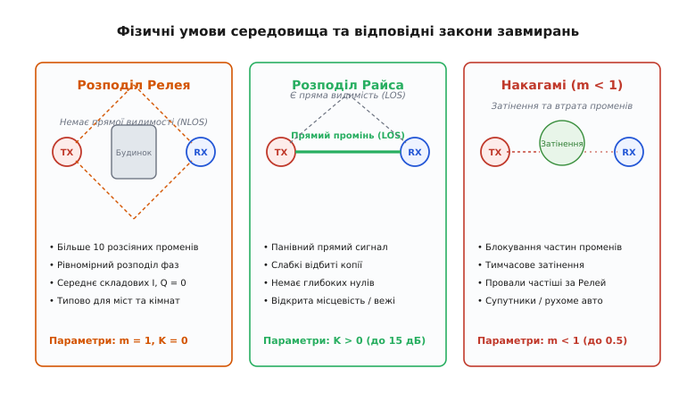
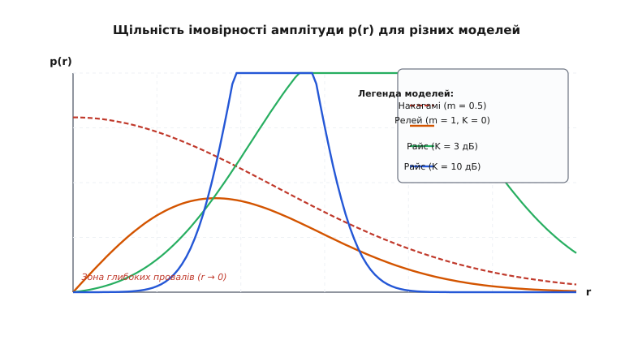
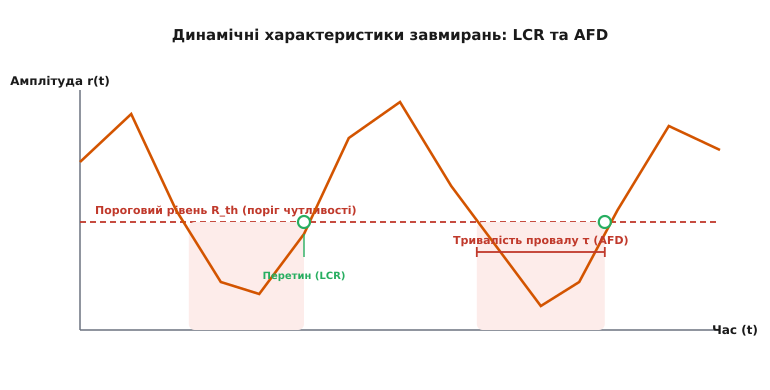

# Статистика завмирань: Рейлі, Райс та Накагамі-m

<preknowlist>
- [Багатопроменевість і завмирання](topic:communications/multipath-fading) — фізика складання інтерферуючих копій радіохвилі з випадковими фазами.
- [Бюджет лінії](root:embedded/link-budget) — розрахунок балансу потужності передавача та чутливості приймача.
- [Метрики якості сигналу](topic:communications/link-quality-metrics) — поняття SNR, RSSI та ймовірності бітової помилки (BER).
</preknowlist>

Уявіть, що ви вимірюєте рівень радіосигналу від Wi-Fi роутера або вежі мобільного зв'язку, рухаючись зі смартфоном по кімнаті чи міській вулиці. Сигнал слабшає з відстанню — це фундаментальне [вільне загасання](topic:communications/free-space-loss). Але на це плавне спадання накладається хаотична серія миттєвих підйомів і катастрофічних провалів: на відстані лише кількох сантиметрів рівень сигналу може впасти на 20, 30 або навіть 40 децибел. Спроба описати такий ефір детерміновано — через точне обчислення відбиття від кожного стільця, авто чи будинку — швидко виявляється безнадійною: найменший рух людини чи листка на дереві миттєво змінює геометрію середовища.

Там, де детермінований розрахунок безсилий, на допомогу приходить теорія ймовірностей. Замість вгадування точності провалу в конкретній точці інженери описують рівень сигналу як **випадкову величину** зі своїм математичним законом розподілу. Це дає змогу точно відповісти на головне практичне запитання: який запас потужності треба закласти в [бюджет лінії](root:embedded/link-budget), щоб зв'язок працював із надійністю 99.9%, незважаючи на примхи середовища?

Залежно від фізичних умов — наявності прямої видимості між антенними, щільності забудови чи затінення перешкодами — поведінка сигналу описується трьома основними статистичними моделями: **розподілом Релея** (Rayleigh), **розподілом Райса** (Rician) та **розподілом Накагамі-m** (Nakagami-m). Розуміння цих моделей перетворює хаос радіохвиль на чіткі інженерні розрахунки.

Про те, як лорд Релей у XIX столітті описував акустику, Стівен Райс у 1940-х роках розробляв теорію шумів у Bell Labs, а Мінору Накагамі у 1960 році узагальнив експерименти японського короткохвильового зв'язку, читайте у вставці [Історія статистики завмирань](topic:communications/fading-statistics/hist-fading-statistics.md).

---

## Три фізичні сценарії радіоканалу

Причина появи різних статистичних законів криється в геометрії поширення радіохвиль та характері перешкод між передавачем (TX) і приймачем (RX).


*Три головні фізичні сценарії: відсутність прямого променя NLOS (розподіл Релея), наявність прямого променя LOS (розподіл Райса) та додаткове затінення перешкодами (розподіл Накагамі при m < 1).*

Усі фізичні умови поширення хвиль можна розділити на три типові сценарії:

1. **Відсутність прямої видимості (NLOS, Non-Line-of-Sight):** Прямий шлях між антенними повністю перекритий домівками, стінами або рельєфом. До приймальної антени доходить лише жменя (десятки чи сотні) відбитих і розсіяних копій сигналу приблизно однакової амплітуди. Це класичне середовище для міських вулиць без прямої видимості або кімнат. Зазначений сценарій описується **розподілом Релея**.
2. **Наявність прямої видимості (LOS, Line-of-Sight):** Між передавачем і приймачем є прямий незатемнений шлях, яким проходить потужний панівний промінь, а паралельно до нього доходять слабші відбиті копії від підлоги, землі чи сусідніх об'єктів. Це типово для відкритих трас, зв'язку між висотними вежами або вишок мобільного зв'язку в передмісті. Цей сценарій описується **розподілом Райса**.
3. **Затінення та втрата частин променів (Shadowing & Severe Fading):** Окрім штовханини відбитих копій, сигнал зазнає часового затінення кронами дерев, важкою забудовою або транспортом, через що частина відбитих променів періодично блокується. Провали сигналу стають частішими й глибшими, ніж передбачає модель Релея. Таку поведінку описує **розподіл Накагамі-m** при малих значеннях параметра `m < 1`.

---

## Дворакурсні завмирання: великомасштабні проти дрібномасштабних

Для повноти картини важливо розрізняти два абсолютно різні фізичні рівні флуктуацій сигналу:

1. **Великомасштабні завмирання (Large-Scale Fading / Shadowing):** Виникають унаслідок затінення великими об'єктами (пагорбами, будівлями, елеваторами) при переміщенні приймача на десятки й сотні метрів. Середня потужність сигналу на таких відстанях описується **логарифмічно-нормальним розподілом** (Log-Normal distribution) із середньоквадратичним відхиленням `σ_dB` від 4 до 12 дБ.
2. **Дрібномасштабні завмирання (Small-Scale Fading / Multipath Fading):** Виникають через інтерференцію багатьох копій хвилі при переміщенні приймача на самісінькі сантиметри (на порядок довжини хвилі `λ`). Саме ці швидкі й глибокі провали сигналу описуються статистиками **Релея, Райса та Накагамі-m**.

У реальних мобільних мережах обидва процеси діють одночасно, утворюючи комбінований закон розподілу (наприклад, розподіл Сузукі або K-розподіл), де локальне середнє значення релеївського сигналу саме блукає за логарифмічно-нормальним законом.

---

## Розподіл Релея: ефір без прямого променя

Коли прямий промінь відсутній (сценарій NLOS), у приймальній антені додаються `N` відбитих хвильових копій. Зручно подати кожну копію у вигляді вектора на площині з амплітудою `Aₖ` та фазою `θₖ`. Результуючий сигнал є векторною сумою:

```
I = A₁·cos(θ₁) + A₂·cos(θ₂) + … + Aₙ·cos(θₙ)   [синфазна складова]
Q = A₁·sin(θ₁) + A₂·sin(θ₂) + … + Aₙ·sin(θₙ)   [квадратурна складова]
```

Оскільки відбивачі розкидані на відстані, що значно перевищують довжину хвилі `λ` (наприклад, 12.5 см для 2.4 ГГц), фази `θₖ` виявляються повністю випадковими й рівномірно розподіленими від `0` до `2π`. 

За **центральною граничною теоремою**, якщо доданків багато й жоден із них не панує, суми `I` та `Q` поводяться як незалежні **нормальні (гаусові) випадкові величини** з нульовим середнім значенням `E[I] = E[Q] = 0` та однаковою дисперсією `σ²`.

Амплітуда прийнятого сигналу `r` — це довжина підсумкового вектора в двовимірному декартовому просторі `(I, Q)`:

```
r = √( I² + Q² )
```

Знайшовши закон розподілу відстані від початку координат до точки `(I, Q)`, координати якої нормальні, ми отримуємо **щільність імовірності амплітуди Релея** (PDF, *Probability Density Function*):

```
p(r) = (r / σ²) · exp( -r² / (2σ²) ),   при r ≥ 0
```

де `σ²` — дисперсія синфазної або квадратурної складової. Загальна середня потужність прийнятого сигналу дорівнює:

```
P_avg = E[r²] = 2σ²
```

### Кумулятивна функція та імовірність глибоких провалів
Інтегруючи щільність імовірності від `0` до порогового значення амплітуди `R`, отримуємо **кумулятивну функцію розподілу** (CDF, *Cumulative Distribution Function*), яка визначає імовірність того, що амплітуда сигналу не перевищить `R`:

```
P(r ≤ R) = 1 - exp( -R² / (2σ²) ) = 1 - exp( -R² / P_avg )
```

Перейдемо від амплітуд до відношення потужностей. Позначимо через `γ` миттєве відношення сигнал/шум (SNR), а через `γ_avg` — його середнє значення. Тоді імовірність того, що миттєве SNR впаде нижче порогового значення `γ_th`, стає дуже простою експоненційною залежністю:

```
P(γ ≤ γ_th) = 1 - exp( -γ_th / γ_avg )
```

Для малих рівнів порогу (`γ_th << γ_avg`) можна застосувати наближення `1 - exp(-x) ≈ x`. Це дає золоте правило релеївського завмирання:

```
P(провал глибший за 10 дБ від середнього)  ≈ 1/10  = 10 %
P(провал глибший за 20 дБ від середнього)  ≈ 1/100 = 1 %
P(провал глибший за 30 дБ від середнього)  ≈ 1/1000 = 0.1 %
P(провал глибший за 40 дБ від середнього)  ≈ 1/10000 = 0.01 %
```

Ці числа кажуть: у середовищі Релея провал сигналу на 20 дБ спостерігається протягом 1% часу, на 30 дБ — протягом 0.1% часу, а на 40 дБ — протягом 0.01% часу. Це означає, що для забезпечення надійності зв'язку 99.9% у лінк-бюджет **необхідно додати щонайменше 30 дБ запасу на завмирання** (fading margin), а для надійності 99.99% — **40 дБ запасу**.

---

## Розподіл Райса: панівний прямий промінь

Якщо між передавачем і приймачем з'являється незатемнений прямий промінь амплітудою `s`, ситуація кардинально змінюється. Синфазна складова `I` тепер має постійний зсув, пропорційний амплітуді прямого променя: `E[I] = s`, а квадратурна складова лишається з нульовим середнім `E[Q] = 0`.

Амплітуда результуючого сигналу `r = √(I² + Q²)` тепер описується **розподілом Райса**:

```
p(r) = (r / σ²) · exp( -(r² + s²) / (2σ²) ) · I₀( s·r / σ² ),   при r ≥ 0
```

де `I₀(x)` — модифікована функція Бесселя першого роду нульового порядку.

### Фактор Райса K
Ключовим параметром моделі Райса є **фактор K** (*Rice K-factor*) — відношення потужності прямого променя (`P_LOS = s² / 2`) до сумарної потужності всіх відбитих розсіяних копій (`P_scattered = σ²`):

```
K = s² / (2σ²)
```

Зазвичай фактор `K` виражають у децибелах: `K_dB = 10 · log10(K)`.

```
K = 0 (0 дБ)       — прямий промінь відсутній (потужність LOS дорівнює потужності відбитків)
K = 4 (6 дБ)       — прямий промінь у 4 рази потужніший за суму всіх відбитків
K = 10 (10 дБ)     — прямий промінь у 10 разів потужніший за суму відбитків
K = 100 (20 дБ)    — прямий промінь повністю панує над середовищем
```

Граничні випадки розподілу Райса чітко пояснюють його фізичний зміст:
- **При K = 0 (s = 0):** Функція Бесселя `I₀(0) = 1`, і формула Райса перетворюється **точно на розподіл Релея**.
- **При K → ∞ (σ² → 0):** Розсіяні промені зникають, огинаюча `r` перетворюється на детерміновану величину `s`, а канал стає ідеальним каналом з аддитивним білим гаусовим шумом (**AWGN**).

Наявність навіть помірного прямого променя (`K = 6 дБ`) радикально зменшує ймовірність глибоких нулів. Графік щільності ймовірності зсувається праворуч і «стискається», віддаляючись від нульової амплітуди.

---

## Розподіл Накагамі-m: універсальна емпірична модель

Розподіли Релея та Райса виведені з теоретичних міркувань про нормальні складові `I` та `Q`. Проте під час вимірювань у реальних міських умовах та на супутникових трасах дослідники виявили, що флуктуації сигналу нерідко виходять за межі цих двох моделей.

Японський фізик Мінору Накагамі запропонував гнучкішу емпіричну модель, засновану на Гамма-розподілі для миттєвої потужності сигналу. Щільність імовірності амплітуди Накагамі-m має вигляд:

```
p(r) = (2 · mᵐ · r^(2m - 1) / (Γ(m) · Ωᵐ)) · exp( -m · r² / Ω ),   при r ≥ 0
```

де:
- `Ω = E[r²]` — середня потужність сигналу.
- `Γ(m)` — гамма-функція Ейлера.
- `m` — **параметр загасання Накагамі** (*Nakagami fading parameter*), який визначається через статистичні моменти:

```
m = (E[r²])² / Var[r²] = (E[r²])² / E[(r² - E[r²])²]
```

Параметр `m` вимірює суворість завмирань. Змінюючи `m` від `0.5` до `∞`, ми охоплюємо весь спектр радіофізичних умов:

```
m = 0.5           — гранично суворі завмирання (односторонній нормальний розподіл)
m = 1             — точний розподіл Релея
m > 1             — м'які завмирання, що відповідають розподілу Райса
m → ∞             — відсутність завмирань (ідеальний канал AWGN)
```

Математичний зв'язок між фактором Райса `K` та параметром Накагамі `m` виражається проста формулою:

```
m = (K + 1)² / (2K + 1)
```

> 🔧 **Навіщо це.** Завдяки відсутності складних функцій Бесселя модель Накагамі-m є улюбленим інструментом інженерів-теоретиків. Вона дає змогу виводити точні аналітичні формули для ймовірності бітової помилки (BER) у складних системах із багатьма антенами (MIMO) та рознесеним прийомом, охоплюючи як суворі, так і м'які умови зв'язку єдиним математичним виразом.

Усі точні математичні виведення, перетворення координат, знаходження кумулятивних функцій та моментів зведено у вставці [Математика законів розподілу завмирань](topic:communications/fading-statistics/math-fading-distributions.md).

---

## Порівняльна статистика моделей

Щоб наочно побачити відмінність між трьома законами розподілу, порівняємо графіки їхньої щільності ймовірності `p(r)`.


*Порівняння графіків щільності ймовірності p(r) для розподілу Релея (m=1, K=0), Райса (K=3 дБ та 10 дБ) та Накагамі (m=0.5). Зверніть увагу на поведінку кривих біля r → 0.*

Головні відмінності полягають у поведінці кривих біля нульової амплітуди (`r → 0`):
- **Накагамі (m = 0.5):** Крива прямує до нескінченності при `r → 0`. Це означає високу ймовірність катастрофічних провалів сигналу (зокрема через затінення).
- **Релей (m = 1, K = 0):** Крива виходить із нуля під лінійним кутом. Імовірність застати малу амплітуду помірна, але цілком відчутна.
- **Райс (K = 3 дБ та K = 10 дБ):** При зростанні `K` графік перетворюється на симетричний купол, відсунутий від нуля. При `K = 10 дБ` ймовірність потрапити в зону провалу практично дорівнює нулю.

---

## Гладенькі та селективні завмирання: смуга когерентності

Поряд із часовими коливаннями амплітуди існує фундаментальний зв'язок між затримкою відбитих променів та частотною характеристикою каналу.

Якщо розкид затримок між найпершим та найпізнішим променями дорівнює `σ_τ` (delay spread), то середовище має смугу когерентності (Coherence Bandwidth):

```
B_c ≈ 1 / (5 · σ_τ)
```

Залежно від співвідношення між шириною спектра сигналу `B_s` та смугою когерентності `B_c`, завмирання ділять на два типи:

1. **Гладенькі (плоскі) завмирання (Flat Fading):** Ширина спектра сигналу набагато менша за смугу когерентності (`B_s << B_c`). Усі частотні складові сигналу завмирають синхронно. Амплітуда всього сигналу підпорядковується розподілам Релея, Райса чи Накагамі-m, а спотворення форми імпульсу відсутні.
2. **Селективні за частотою завмирання (Frequency-Selective Fading):** Ширина спектра сигналу перевищує смугу когерентності (`B_s > B_c`). Різні частотні компоненти сигналу завмирають незалежно: одна частина спектра потрапляє в провал, а інша — залишається підсиленою.

Сучасні широкосмугові системи (Wi-Fi, 4G LTE, 5G NR) вирішують проблему частотно-селективних завмирань за допомогою **OFDM** (Orthogonal Frequency Division Multiplexing). OFDM розбиває один широкосмуговий канал на сотні вузьких піднесучих частот. Ширина кожної піднесучої стає набагато меншою за `B_c`, завдяки чому кожна окрема піднесуча зазнає **гладеньких завмирань**, які легко вирівнюються однотапним еквалайзером приймача.

---

## Динаміка завмирань у часі: LCR та AFD

Статичного розподілу ймовірностей замало для повноцінного проектування системи зв'язку. Інженеру важливо знати не лише *як часто* сигнал падає нижче порогу чутливості, а й **як часто відбуваються ці провали в часі** та **скільки часу триває кожен провал**.

Коли приймач або передавач рухається зі швидкістю `v`, виникає **ефект Доплера**. Максимальний зсув частоти Доплера дорівнює:

```
f_d = v / λ = (v · f) / c
```

де `λ` — довжина хвилі, `c` — швидкість світла.

Час когерентності каналу `T_c` (час, протягом якого амплітуда лишається статистично скорельованою) зворатно пропорційний частоті Доплера: `T_c ≈ 0.423 / f_d`.

Динаміку завмирань у часі характеризують дві головні метрики:
1. **Частота перетинів рівня (LCR, Level Crossing Rate, `N_R`):** Кількість перетинів порогового рівня `R_th` у напрямку знизу вгору за одну секунду.
2. **Середня тривалість провалу (AFD, Average Fade Duration, `τ_bar`):** Середній час, протягом якого сигнал залишається нижче порогового рівня `R_th`.


*Динамічні характеристики коливання сигналу в часі r(t): перетин порогового рівня R_th знизу вгору (LCR) та середня тривалість перебування сигналу під порогом (AFD).*

Для каналу Релея частота перетинів рівня `N_R` та середня тривалість провалу `τ_bar` обчислюються за формулами:

```
ρ = R_th / R_rms                  [нормований пороговий рівень]
N_R = √(2π) · f_d · ρ · exp( -ρ² )
τ_bar = (exp( ρ² ) - 1) / (ρ · f_d · √(2π))
```

### Практичний наслідок для пакетної передачі
Нехай автомобіль рухається зі швидкістю 108 км/год (30 м/с), а зв'язок працює на частоті 2.4 ГГц (`λ = 0.125 м`):

```
f_d = 30 / 0.125 = 240 Гц
```

При провалі на 10 дБ нижче середнього (`ρ = 0.316`), середня тривалість провалу становить:

```
τ_bar ≈ 0.316 / (240 · 2.506) ≈ 0.00052 с = 0.52 мс
```

Якщо тривалість одного пакета даних у протоколі Wi-Fi чи BLE становить 2 мс, то провал тривалістю 0.52 мс **надійно знищує декілька послідовних бітів пакета**, спричиняючи пакетну помилку. 

Розуміння тривалості провалів `τ_bar` дає змогу інженерам правильно вибирати довжину блоку кодування та інтервал перемежування бітів (*interleaving*), щоб розмазати пакетні помилки в часі.

---

## Інженерний арсенал боротьби із завмираннями

Для забезпечення надійного зв'язку в умовах випадкових завмирань застосовують три головні лінії захисту:

```
1. Запас на завмирання (Fading Margin)   — збільшення потужності передавача на 10–30 дБ
2. Рознесення прийому (Diversity)          — використання 2+ антен на відстані > λ/2 одна від одної
3. Адаптивна модуляція та кодування (AMC)  — швидка зміна швидкості залежно від поточної амплітуди
```

### Методи рознесення антен (Diversity Reception)
Найефективнішим способом подолання завмирань Релея є **рознесення антен** (*Space Diversity*). Якщо встановити `M` приймальних антен на відстані понад `λ/2` одна від одної, умови завмирань на них стають статистично незалежними.

В інженерній практиці застосовують три головні схеми об'єднання сигналів від `M` антен:

1. **Селективне об'єднання (Selection Combining, SC):** Приймач безперервно вимірює рівень сигналу на всіх `M` антенах і підключає демодулятор до тієї антени, яка має найбільше миттєве SNR `γ = max(γ₁, γ₂, …, γₘ)`. Імовірність виходу лінії з ладу зменшується до `P_out = (P_out, 1)ᵐ`.
2. **Об'єднання за рівною амплітудою (Equal Gain Combining, EGC):** Сигнали з усіх антен повертаються по фазі для синфазного додавання й просто сумуються.
3. **Максимальне об'єднання (Maximal Ratio Combining, MRC):** Сигнал з кожної антени множиться на свій ваговий коефіцієнт, пропорційний амплітуді сигналу на цій антені. MRC дає теоретично максимально можливе SNR `γ_mrc = γ₁ + γ₂ + … + γₘ`.

Імовірність того, що **дві** незалежні антени одночасно опиняться в глибокому провалі на рівні 20 дБ (де ймовірність провалу однієї антени `P = 0.01`), при селективному об'єднанні дорівнює:

```
P_сумарна = P₁ · P₂ = 0.01 · 0.01 = 0.0001 (0.01 %)
```

Завдяки використанню другої антени ймовірність втрати зв'язку зменшується у 100 разів!

### Кодування Аламоуті та просторово-часове рознесення (STBC)
Коли рознесення антен на приймачі неможливе (наприклад, малий корпус смартфона), застосовують рознесення на передавачі (Transmit Diversity). Революційним рішенням став **код Аламоуті** (Alamouti Space-Time Block Code, STBC, 1998 рік).

Дві передавальні антени надсилають у двох послідовних часових інтервалах пари символів `(s₁, s₂)` та `(-s₂*, s₁*)`. На приймачі за допомогою простих алгебраїчних операцій відновлюються обидва символи з повним порядком рознесення `M = 2`, не вимагаючи знання стану каналу (CSI) на передавачі.

### Завмирання та пропускна здатність у MIMO системах
У той час як для звичайної одноантенної системи (SISO) релеївські завмирання є важким випробуванням, багатоантенні системи **MIMO** (Multiple-Input Multiple-Output) перетворюють багаторазові відбитки на свою головну перевагу.

За формулою Телатара — Ґеббардта (Telatar-Foschini), пропускна здатність каналу MIMO з `N_tx` передавальними та `N_rx` приймальними антенами дорівнює:

```
C = log₂ det( I + (SNR / N_tx) · H · Hᴴ )
```

де `H` — матриця каналу розміром `N_rx × N_tx`. 

У середовищі з багатими відбиттями (релеївський канал) елементи матриці `H` є незалежними гаусовими величинами, завдяки чому матриця `H` має **повний ранг**. Це дає змогу передавати `min(N_tx, N_rx)` незалежних потоків даних паралельно на одній і тій самій частоті (**Spatial Multiplexing**), помножуючи швидкість зв'язку в рази.

### Стандартизовані моделі каналів у 5G та Wi-Fi (CDL та TDL)
У реальному стандартизованому проектуванні обладнання інженери не генерують завмирання ручним способом, а використовують канонічні моделі каналів консорціуму 3GPP (TR 38.901):

- **TDL (Tapped Delay Line):** Моделі з дискретними затримками для одноантенних та простих MIMO випробувань. Включають профілі TDL-A, TDL-B, TDL-C (для умов NLOS із завмираннями Релея) та TDL-D, TDL-E (для умов LOS із завмираннями Райса).
- **CDL (Clustered Delay Line):** 3D-моделі з урахуванням просторових кутів приходу та вильоту хвиль (AoA, AoD, ZoA, ZoD), призначені для тестування масивних антенних решіток Massive MIMO у діапазонах FR1 (до 6 ГГц) та FR2 (міліметрові хвилі).

### Адаптивна модуляція та кодування (AMC)
Замість тримання постійної швидкості, сучасні приймачі регулярно надсилають на передавач інформацію про стан каналу (CSI, Channel State Information). Залежно від поточного амплітудного рівня, передавач динамічно перемикає схеми модуляції та кодування:
- При глибокому провалі (низьке SNR) передавач переходить на завадостійкі схеми **BPSK 1/2** або **QPSK 1/2**.
- При підйомі амплітуди (високе SNR) передавач миттєво піднімає швидкість до **64QAM 3/4** або **256QAM 5/6**.

Проте у рухомому каналі виникає проблема затримки зворотного зв'язку (CSI Feedback Delay). Якщо затримка передачі CSI `τ_delay` перевищує час когерентності каналу `T_c`, передавач обирає схему модуляції на основі застарілих даних, що спричиняє обриви зв'язку.

Практичну реалізацію алгоритму генерації вибірок каналів Релея, Райса та Накагамі-m у C та C++ наведено у вставці [Симулятор каналів завмирань](topic:communications/fading-statistics/proj-fading-simulator.md).

---

## Обчислювальний приклад: Розрахунок надійності лінії

Нехай розробляється бездротовий модуль для міських умов (канал Релея, NLOS). Середнє відношення сигнал/шум у точці прийому становить `γ_avg = 25 дБ` (або `316.2` у разах). Поріг демодуляції сигналу при радіоприйомі становить `γ_th = 10 дБ` (або `10.0` у разах). Обчислимо ймовірність виходу лінії з ладу та необхідний додатковий запас потужності для забезпечення надійності 99.9%.

:::tabs
```cpp
#include <iostream>
#include <cmath>
#include <iomanip>

// Обчислення ймовірності виходу з ладу (Outage Probability) у каналі Релея
double rayleigh_outage_probability(double snr_avg_db, double snr_th_db) {
    double gamma_avg = std::pow(10.0, snr_avg_db / 10.0);
    double gamma_th  = std::pow(10.0, snr_th_db / 10.0);
    // P(SNR <= SNR_th) = 1 - exp(-gamma_th / gamma_avg)
    return 1.0 - std::exp(-gamma_th / gamma_avg);
}

// Обчислення необхідного запасу на завмирання (дБ) для заданої надійності (наприклад, 0.999)
double required_fading_margin_db(double reliability) {
    double outage_target = 1.0 - reliability;
    // P_out = 1 - exp(-1 / Margin_linear) => Margin_linear = -1 / ln(1 - P_out)
    double margin_linear = -1.0 / std::log(1.0 - outage_target);
    return 10.0 * std::log10(margin_linear);
}

int main() {
    double snr_avg_db = 25.0; // Середнє SNR = 25 дБ
    double snr_th_db  = 10.0; // Поріг SNR = 10 дБ

    double p_out = rayleigh_outage_probability(snr_avg_db, snr_th_db);
    double margin_999 = required_fading_margin_db(0.999);

    std::cout << std::fixed << std::setprecision(4);
    std::cout << "Середнє SNR: " << snr_avg_db << " дБ, Поріг SNR: " << snr_th_db << " дБ\n";
    std::cout << "Поточна імовірність виходу з ладу (Outage Probability): " 
              << p_out * 100.0 << " %\n";
    std::cout << "Необхідний запас на завмирання для надійності 99.9%: " 
              << margin_999 << " дБ\n";

    return 0;
}
```
```c
#include <stdio.h>
#include <math.h>

/* Обчислення ймовірності виходу з ладу (Outage Probability) у каналі Релея */
double rayleigh_outage_probability(double snr_avg_db, double snr_th_db) {
    double gamma_avg = pow(10.0, snr_avg_db / 10.0);
    double gamma_th  = pow(10.0, snr_th_db / 10.0);
    return 1.0 - exp(-gamma_th / gamma_avg);
}

/* Обчислення необхідного запасу на завмирання (дБ) для заданої надійності */
double required_fading_margin_db(double reliability) {
    double outage_target = 1.0 - reliability;
    double margin_linear = -1.0 / log(1.0 - outage_target);
    return 10.0 * log10(margin_linear);
}

int main(void) {
    double snr_avg_db = 25.0;
    double snr_th_db  = 10.0;

    double p_out = rayleigh_outage_probability(snr_avg_db, snr_th_db);
    double margin_999 = required_fading_margin_db(0.999);

    printf("Середнє SNR: %.1f дБ, Поріг SNR: %.1f дБ\n", snr_avg_db, snr_th_db);
    printf("Поточна імовірність виходу з ладу: %.4f %%\n", p_out * 100.0);
    printf("Необхідний запас на завмирання для надійності 99.9%%: %.2f дБ\n", margin_999);

    return 0;
}
```
```py
import math

def rayleigh_outage_probability(snr_avg_db, snr_th_db):
    gamma_avg = 10.0 ** (snr_avg_db / 10.0)
    gamma_th  = 10.0 ** (snr_th_db / 10.0)
    return 1.0 - math.exp(-gamma_th / gamma_avg)

def required_fading_margin_db(reliability):
    outage_target = 1.0 - reliability
    margin_linear = -1.0 / math.log(1.0 - outage_target)
    return 10.0 * math.log10(margin_linear)

snr_avg_db = 25.0
snr_th_db = 10.0

p_out = rayleigh_outage_probability(snr_avg_db, snr_th_db)
margin_999 = required_fading_margin_db(0.999)

print(f"Середнє SNR: {snr_avg_db:.1f} дБ, Поріг SNR: {snr_th_db:.1f} дБ")
print(f"Поточна імовірність виходу з ладу: {p_out * 100.0:.4f} %")
print(f"Необхідний запас на завмирання для надійності 99.9%: {margin_999:.2f} дБ")
```
:::

### Висновок з розрахунку
- При середньому SNR 25 дБ та порозі 10 дБ запас бюджету лінії становить `25 - 10 = 15 дБ`. Ймовірність виходу лінії з ладу дорівнює `P_out = 3.11%`. Тобто понад 3% часу зв'язок перериватиметься.
- Щоб забезпечити надійність `99.9%` (`P_out = 0.1%`), необхідний запас на завмирання становить `30.00 дБ`. 
- Це означає, що при порозі чутливості `10 дБ` середня потужність сигналу повинна мати рівень `10 + 30 = 40 дБ`. Саме статистика завмирань дає інженеру обґрунтоване число для запасу потужності передавача.
