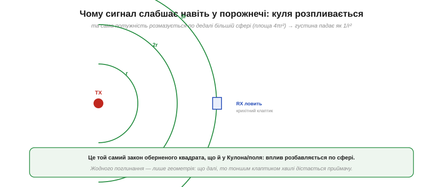
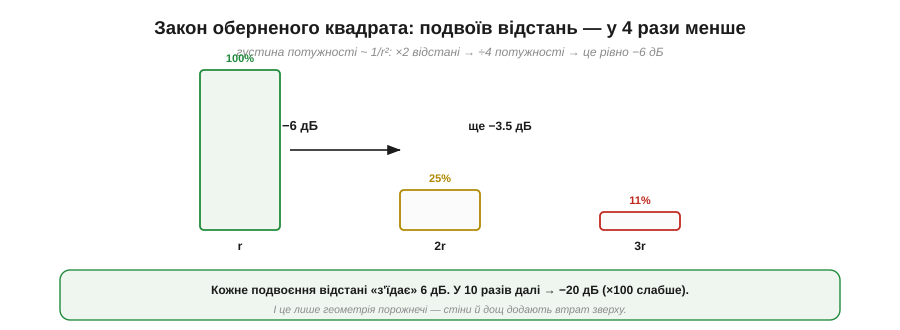
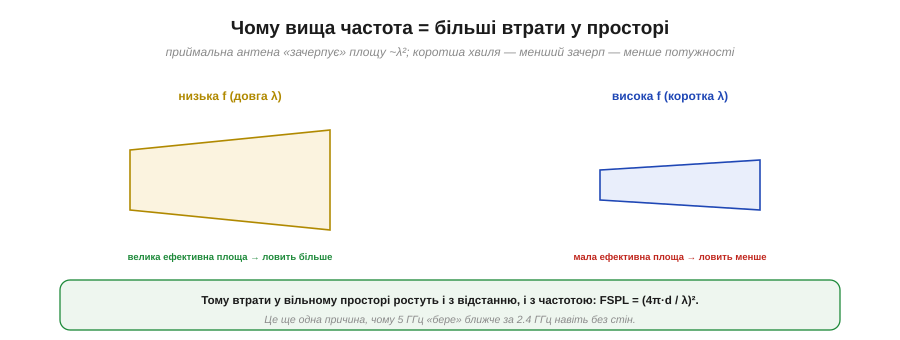
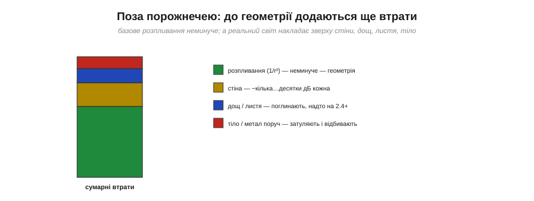
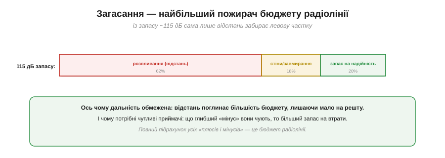

# Загасання у просторі

<preknowlist>
- [Електромагнітна хвиля](book:physics/em-wave) — що хвиля переносить енергію крізь порожнечу й летить зі швидкістю світла.
- [Потужність і децибели](book:communications/power-decibels) — логарифмічна шкала потужності: +3 дБ ≈ ×2, −10 дБ = ÷10, dBm як абсолютний рівень.
</preknowlist>

Радіосигнал слабшає з відстанню — це знає кожен, у кого «падав» Wi-Fi у дальній кімнаті. Дивина починається, коли спитати **чому**. [Електромагнітна хвиля](book:physics/em-wave) летить крізь порожній простір сама, без опору; у вакуумі немає ані молекули, що поглинула б енергію. То куди ж вона дівається, чому далекий приймач чує тихіше? Відповідь не в поглинанні, а в **геометрії**: та сама енергія просто розмазується по дедалі більшій поверхні. І розмазується не абияк, а за жорстким законом оберненого квадрата — тим самим, що керує [силою Кулона](book:physics/coulomb-law) між зарядами. Цей закон і задає **стелю дальності** будь-якого радіо. Розберімо його до дна: виведемо точну формулу втрат, побачимо, чому вища частота карає сильніше, як сюди входять антени, і чому саме ця величина з'їдає більшу частину бюджету радіолінії.

### Куля, що розпливається

Уяви передавач, який випромінює **навсібіч** — однаково в усі боки (такий ідеальний випромінювач звуть *ізотропним*, від грецького *isos* — рівний і *tropos* — напрям). Енергія розходиться, наче надувається світна куля. Ключове спостереження: **загальна потужність на поверхні кулі лишається тією самою** — енергія нікуди не зникає. Але куля **росте**, і та сама потужність розподіляється по щораз більшій площі.


*Ізотропний передавач розсіює потужність по всій сфері. Площа сфери — 4πr², тож густина потужності (Вт на квадратний метр) падає як 1/r². Приймальна антена ловить лише крихітний клаптик цієї сфери — і що далі, то тоншим клаптиком дістається хвиля. Жодного поглинання, тільки геометрія.*

Площа сфери радіуса r дорівнює 4πr². Якщо передавач віддає потужність Pₜ, то на кожен квадратний метр сфери припадає густина потужності:

```
S(r) = Pₜ / (4·π·r²)      [Вт/м²]
```

Ось звідки береться закон оберненого квадрата. Подвоїмо відстань — радіус кулі вдвічі більший, площа вчетверо більша (бо площа росте як квадрат радіуса), і та сама потужність розбавляється вчетверо. Це не властивість радіо, а властивість **будь-чого, що випромінюється з точки навсібіч**: так само слабшає [електричне поле](book:physics/electric-field) заряду й спадає яскравість далекої зорі. Енергія збереглася повністю — вона лише розтеклася по більшій поверхні.


*Удвічі далі → сфера вчетверо більша → густина потужності вчетверо менша. У децибелах ÷4 — це рівно −6 дБ. Кожне подвоєння відстані «з'їдає» 6 дБ, кожне десятикратне віддалення — 20 дБ.*

Переклад у [децибели](book:communications/power-decibels) робить закон робочим правилом, яке тримають у голові:

```
×2 відстані → ÷4 потужності   → −6 дБ
×4 відстані → ÷16             → −12 дБ
×10 відстані → ÷100           → −20 дБ
```

**Кожне подвоєння відстані коштує 6 дБ, кожне десятикратне віддалення — 20 дБ.** Це підлога втрат ідеальної порожнечі, від якої нікуди не дітися, — і поки що ми навіть не згадали ані стін, ані частоти.

### Скільки хвилі ловить антена

Густина S(r) — це ще не те, що отримає приймач. Антена не збирає всю сферу; вона «зачерпує» потужність лише зі своєї **ефективної площі** — апертури (від латинського *apertura* — отвір). Прийнята потужність — це густина, помножена на цю ефективну площу:

```
Pприйн = S(r) · Aₑ
```

І тут ховається друга, зовсім не очевидна причина втрат. Скільки ж становить ефективна апертура? Для ізотропної антени теорія антен дає напрочуд просту відповідь:

```
Aₑ = λ² / (4·π)
```

Це результат не з геометрії розмірів залізяки, а з хвильової природи приймання; він настільки центральний, що йому присвячено окрему статтю — [ефективна апертура антени](book:communications/effective-aperture), і тут ми беремо його як даність. Але суть уловити легко: апертура пропорційна **квадрату довжини хвилі** λ². Коротша хвиля — менша ефективна площа — менший «зачерп».


*Ефективна апертура приймальної антени пропорційна λ². На вищій частоті хвиля коротша, λ² менше, антена вловлює меншу частку хвилі. Тому втрати у вільному просторі ростуть не лише з відстанню, а й із частотою.*

> 🔧 **Навіщо це.** Саме через λ²-апертуру діапазон 5 ГГц «бере» ближче за 2.4 ГГц навіть у чистому полі, без жодної стіни. Це окрема причина, не пов'язана з проникністю крізь перешкоди: коротша хвиля програє вже на голій геометрії приймання. Коли обираєш робочу [частоту](book:communications/frequency-bands) для дальнього лінка, нижча частота дає фору двічі — і меншими втратами у просторі, і кращим проходженням крізь стіни.

### Формула втрат вільного простору

Тепер маємо обидва множники — розпливання по сфері й λ²-апертуру приймача. Підставимо апертуру в прийняту потужність:

```
Pприйн = S(r) · Aₑ = Pₜ/(4·π·r²) · λ²/(4·π) = Pₜ · ( λ / (4·π·r) )²
```

Відношення того, що випромінили, до того, що прийняли, і є **втрати вільного простору** (*free-space path loss*, FSPL) — коефіцієнт, на який ослабла потужність між двома ізотропними антенами:

```
FSPL = Pₜ / Pприйн = ( 4·π·r / λ )²
```

Оскільки λ = c/f (довжина хвилі дорівнює швидкості світла, поділеній на частоту), формулу можна записати через частоту: FSPL = (4π·r·f / c)². Звідси видно обидві залежності одразу — втрати ростуть **і з відстанню r, і з частотою f**. Повне алгебраїчне виведення разом із точним децибельним коефіцієнтом винесено в окрему вкладку: [звідки береться (4π·d/λ)²](book:communications/free-space-loss/math-fspl-derivation.md) — там крок за кроком показано перехід від густини потужності до знайомої інженерної формули в децибелах.

У логарифмічному вигляді добуток розпадається на суму — це й робить FSPL таким зручним у бюджеті лінка:

```
FSPL(дБ) = 20·log₁₀(d) + 20·log₁₀(f) − 147.55      (d у метрах, f у герцах)
```

Останнє число — це стала 20·log₁₀(4π/c). Її незручно тримати в голові, тож на практиці одиниці вибирають так, щоб ця стала вийшла круглішою. Дві найвживаніші форми:

```
FSPL(дБ) = 20·log₁₀(d_км) + 20·log₁₀(f_МГц) + 32.44
FSPL(дБ) = 20·log₁₀(d_км) + 20·log₁₀(f_ГГц) + 92.45
```

Множник 20 (а не 10) перед логарифмами — прямий наслідок квадрата: піднесення до квадрата в лінійній шкалі стає подвоєнням у децибельній. Тому й правило «−6 дБ за подвоєння відстані»: 20·log₁₀(2) ≈ 6.02.

### Числа: втрати на 2.4 ГГц

Підставмо реальні числа, щоб відчути масштаб.


*На 2.4 ГГц у чистому полі: 1 м → ≈40 дБ, 10 м → ≈60 дБ, 100 м → ≈80 дБ, 1 км → ≈100 дБ. Кожне десятикратне віддалення додає рівно 20 дБ. Навіть без єдиної перешкоди відстань з'їдає десятки децибел.*

**Приклад (FSPL на 2.4 ГГц).** Візьмімо форму «метри + ГГц» (стала теж 32.45, бо перехід км→м і МГц→ГГц взаємно скорочується) і порахуймо для 100 метрів:

```
FSPL = 20·log₁₀(100) + 20·log₁₀(2.4) + 32.45
     = 20·2      + 20·0.380     + 32.45
     = 40        + 7.6          + 32.45
     ≈ 80 дБ
```

Вісімдесят децибел — це ослаблення у сто мільйонів разів (10⁸), і це **на рівному місці, у чистому полі, без жодної стіни**. Кожне наступне десятикратне віддалення додає рівні 20 дБ: 1 км дає вже ≈100 дБ. Ось чому навіть потужне радіо має скінченну дальність — обернений квадрат невблаганний, і потужність падає лавиною.

### Рівняння Фріїса: коли антени не ізотропні

Досі ми рахували для ізотропних антен з обох боків — таких, що світять однаково навсібіч. Реальні антени так не роблять: вони **фокусують** енергію у вибраний бік, як рефлектор ліхтарика збирає світло лампочки у промінь. Цю здатність вимірюють **підсиленням** антени G, а виражають у dBi — децибелах відносно ізотропної (літера i — від *isotropic*). Спрямована антена на +10 dBi дає в потрібний бік у десять разів більшу густину, ніж ізотропна за тієї ж потужності передавача.

Підсилення входить множником з обох кінців лінка — передавальна антена концентрує випромінене, приймальна ефективніше збирає. Додавши обидва до нашого виразу для прийнятої потужності, отримуємо **рівняння передачі Фріїса** (за іменем дансько-американського інженера Гаральда Фріїса, який вивів його 1946 року):

```
Pприйн = Pₜ · Gₜ · Gᵣ · ( λ / (4·π·r) )²
```

У децибелах воно стає простою арифметикою «плюсів і мінусів» — саме тому радіоінженери мислять у дБ:

```
Pприйн(dBm) = Pₜ(dBm) + Gₜ(dBi) + Gᵣ(dBi) − FSPL(дБ)
```

Ось де стає видно роль загасання: **FSPL — це той великий від'ємний доданок**, який підсилення антен і потужність передавача мусять перекрити. Повний розбір рівняння з усіма тонкощами — в окремій статті [рівняння Фріїса](book:communications/friis-transmission); тут важливо одне — втрати вільного простору стоять усередині нього найбільшим мінусом, а [підсилення антени](book:communications/antenna-gain) — головний важіль, яким його компенсують, не додаючи ватів.

### Скільки взагалі можна почути

Формула Фріїса каже, **скільки** потужності долетить до приймача. Але чи цього досить? Приймач розбере сигнал лише тоді, коли той височить над його власним **шумовим тлом**. Це тло має фізичну межу: теплове ворушіння електронів у будь-якому опорі створює шум потужністю kTB (стала Больцмана · температура · смуга). За кімнатної температури це виходить на **−174 dBm на кожен герц смуги** — фундаментальна підлога, нижче якої не чує жоден приймач.

Складімо ланцюжок, який задає **чутливість** приймача (найтихіший сигнал, який він ще розбере):

```
Шумове тло  = −174 dBm/Гц + 10·log₁₀(смуга)     напр. −114 dBm за 1 МГц
+ коефіцієнт шуму приймача                        напр. +6 дБ → −108 dBm
+ потрібне відношення сигнал/шум для демодуляції  напр. +8 дБ → −100 dBm
```

Отже, приймач з чутливістю близько −100 dBm ще почує сигнал такого рівня, а тихіший — уже потоне в шумі. Різниця між тим, що долетіло (Фріїс), і цією межею — і є **запас лінка**. Розбір, звідки береться −174 dBm і як [коефіцієнт шуму](book:electronics/noise-figure) псує підлогу, — окрема тема; тут досить бачити, що загасання у просторі й чутливість приймача — це дві протилежні стінки одного бюджету: одна забирає децибели, друга каже, скільки ще лишилося.

### Поза порожнечею

Усе пораховане досі — це **базові** втрати ідеального вакууму, чиста геометрія. Реальний світ накладає зверху ще й **додаткові**.


*На геометричну підлогу (1/r²) накладаються: стіни (від кількох до десятків дБ кожна), дощ і листя (поглинають, надто на 2.4 ГГц і вище), тіло чи метал поруч з антеною (затуляють і відбивають). Усі ці втрати — поверх геометричної бази, ніколи замість неї.*

Повні втрати — це **сума**: неминуче геометричне розпливання плюс усе, що трапилося на шляху. Бетонна стіна може забрати десяток-другий децибел, мокре листя на 2.4 ГГц — теж відчутно, а рука, що затулила антену телефона, легко з'їдає кілька децибел. До цього додаються **завмирання** від [багатопроменевості](book:communications/multipath-fading), коли відбиті копії хвилі гасять одна одну. Геометрія лишається підлогою, нижче якої втрати не бувають; реальний світ тільки надбудовує над нею.

### Чому загасання домінує в бюджеті

Тепер зберімо все докупи й спитаймо: чому ця тема така важлива? Бо серед усіх «мінусів» радіолінка загасання у просторі — **найбільший окремий доданок**.


*Із типового запасу ~115 дБ сама лише відстань (розпливання) забирає левову частку — десятки децибел; стіни й завмирання беруть ще; на запас надійності лишається мало. Тому дальність обмежена, а приймачі мусять бути чутливими.*

Звідси два глибокі практичні висновки. Перший: **дальність обмежена** саме тому, що відстань поглинає більшість бюджету — на решту (стіни, надійність) лишається дрібка. Уже на 100 метрах у чистому полі FSPL з'їдає ≈80 дБ із приблизно 115 доступних. Другий: **чутливість приймача критична** — що глибший «мінус» у dBm він здатен почути, то більший запас на втрати й то далі дістає зв'язок. У повному підрахунку всіх плюсів і мінусів лінка — [бюджеті радіолінії](root:embedded/link-budget) — загасання у просторі стоїть найбільшим від'ємним числом, і саме навколо нього крутиться вся боротьба за дальність.

### Як подолати загасання

Раз дальність — це арифметика децибел (рівняння Фріїса мінус чутливість), то й розширити її можна лише **піднявши бюджет**: додавши плюсів або прибравши мінусів. Важелів рівно чотири, і кожен видно прямо у формулі.


*Чотири важелі: більше потужності TX (+дБ, але обмежено законом і батареєю); кращі антени (+dBi з обох боків — спрямованість); нижча частота (менше FSPL і краща проникність, ціна — менше даних і більша антена); нижча швидкість (краща чутливість RX — повільніше, зате далі).*

> 🔧 **Навіщо це.** Це повний набір важелів для будь-якого радіопроєкту, де бракує дальності. **Потужність передавача** Pₜ — найпряміший, але закон обмежує дозволені ватти, та й батарея сідає. **Підсилення антен** Gₜ, Gᵣ — часто найдешевший: спрямована антена додає dBi з обох кінців, не витрачаючи енергії, лише фокусуючи те, що є. **Нижча частота** б'є одразу по FSPL (менше 20·log₁₀f) і краще проходить крізь стіни — ціна лише в тому, що на нижчій частоті вміщається менше даних, а антена стає більшою. А найтонший важіль — **нижча швидкість передачі**: повільніший сигнал приймач розбирає з глибшого мінуса, бо на біт припадає більше енергії й вужча смуга шуму — отже, чутливість падає (стає кращою). Саме на цьому стоїть [LoRa](book:communications/lora): жертвуючи швидкістю, вона дістає на кілометри там, де швидке Wi-Fi глухне за стіною.

Ці чотири важелі не рівноцінні, але всі працюють в одній валюті — децибелах бюджету. І за кожним стоїть той самий закон оберненого квадрата: він задає, скільки децибел треба відіграти, а обмін «повільніше = далі» показує, чим за них платять. Зрозуміти FSPL — означає бачити цю ціну наперед, ще до того, як зв'язку «не вистачить трохи».
