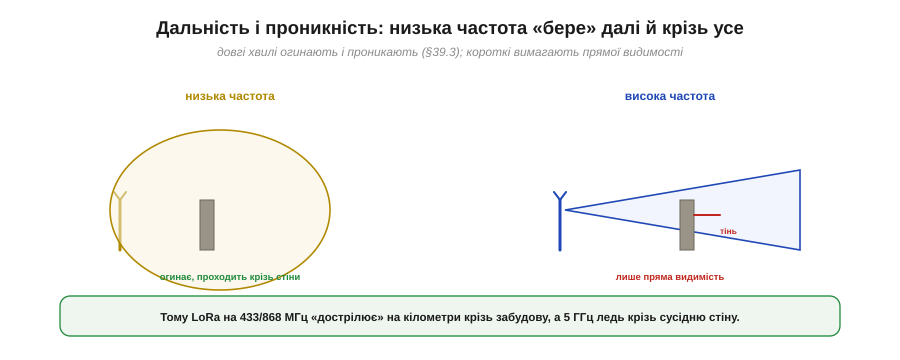
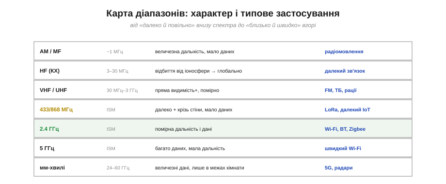

# Діапазони: чому різні частоти поводяться по-різному

Це одна з найпрактичніших тем усього радіозв'язку. Фізично всі радіохвилі однакові — це та сама електромагнітна хвиля. Та варто змінити **частоту**, і змінюється геть усе: як далеко сигнал бере, чи проходить крізь стіни, якого розміру потрібна антена і скільки даних можна передати. Зрозуміти цей **компроміс частоти** — означає вміти обрати правильний діапазон під задачу, а не діяти навмання. Складімо всі ці залежності в одну струнку картину.

### Головний компроміс частоти

Уся суть — в одному компромісі, який жорстко зв'язує чотири властивості.


*Рис. Та сама хвиля, але рухаючись від низьких частот до високих, ти одночасно: втрачаєш **дальність** і **проникність крізь стіни**, зате виграєш **малу антену** і **високу швидкість даних**. Немає «найкращої» частоти — є компроміс «далеко й крізь усе» ПРОТИ «швидко й компактно».*

Запам'ятай цю четвірку: **дальність, проникність, розмір антени, швидкість**. Низька частота дає перші дві ціною останніх двох; висока — навпаки. І це не випадкова інженерна примха, а прямий наслідок фізики: довша хвиля [краще огинає й проникає](book:communications/propagation-polarization), але потребує [більшої антени](book:physics/frequency-wavelength). Розгляньмо кожен бік компромісу.

### Дальність і проникність

Низькі частоти **дострілюють далі** й **проходять крізь перешкоди** краще. Це прямий наслідок того, що [довгі хвилі сильніше дифрагують](book:communications/propagation-polarization) (огинають кути) і легше проникають крізь стіни.


*Рис. Низька частота дає широке «розпливчасте» покриття: хвиля огинає перешкоди й проходить крізь стіни. Висока частота працює майже як ліхтарик — лише по прямій видимості, а за перешкодою лишає чітку тінь.*

Звідси разючі практичні відмінності. Технологія [**LoRa**](book:communications/lora) на 433 чи 868 МГц «дострілює» на **кілометри** крізь міську забудову — саме тому її люблять для далеких давачів. А Wi-Fi на 5 ГГц ледь пробивається крізь сусідню стіну. Та сама потужність, та сама антена — але нижча частота фізично «бере» далі й крізь більше. Чому ж тоді взагалі використовують високі частоти? Через **дані**.

### Швидкість даних

Високі частоти дають **більше швидкості** — і ось чому. Швидкість залежить від **ширини смуги** (скільки спектра займає сигнал), а на високих частотах смуги фізично **більше**.


*Рис. Одна й та сама частка спектра у відсотках дає різну абсолютну смугу: 1% від 100 МГц — це лише 1 МГц, а 1% від 5 ГГц — аж 50 МГц. На високій частоті фізично більше місця під широкі канали — отже, більше даних.*

**Приклад (чому високо = швидше).** Порівняймо доступну смугу:

```
1% спектра біля 100 МГц  = 1 МГц   → вузький канал, мало даних
1% спектра біля 5 ГГц    = 50 МГц  → широкий канал, у 50 разів більше
```

Низькі частоти просто **тісні**: там фізично мало місця під широкі канали, тож і швидкість обмежена. Високі частоти **просторі** — там можна виділити широкі смуги під швидкі потоки (фундаментальний [зв'язок смуги й швидкості](book:communications/bandwidth-capacity) задає межа Шеннона). Ось чому відео й швидкий Wi-Fi тягнуться вгору за частотою, а далекий IoT — униз. Компроміс «далеко проти швидко» — не випадковість, а фізика.

### Розмір антени

Третій бік компромісу — найнаочніший. [Розмір антени](book:physics/frequency-wavelength) задає довжина хвилі: антена має бути сумірна з нею.


*Рис. 433 МГц → антена ≈17 см; 868 МГц → ≈9 см; 2.4 ГГц → ≈3 см; 5 ГГц → ≈1.5 см. Що вища частота, то менша антена — і тим легше сховати її в компактний пристрій.*

Це теж тисне в бік високих частот для **малих** пристроїв: на 5 ГГц антена менша за сантиметр і ховається в чіпі, а на 433 МГц це вже сантиметрів сімнадцять — помітний «вус». Тому крихітні носимі гаджети майже завжди працюють на високих частотах: інакше антена просто не вмістилася б.

### Карта діапазонів

Зведімо все в карту реальних діапазонів — від низів спектра до верхів.


*Рис. Знизу вгору: **AM/MF** (~1 МГц) — величезна дальність, крихта даних (радіомовлення). **HF/КХ** (3–30 МГц) — відбивається від іоносфери, тож дістає глобально. **VHF/UHF** (FM, ТБ, рації) — помірно. **433/868 МГц** — далеко й крізь стіни, мало даних (LoRa). **2.4 ГГц** — помірна дальність і дані (Wi-Fi, BT). **5 ГГц** — багато даних, мала дальність. **мм-хвилі** (24–60 ГГц) — величезні дані лише в межах кімнати (5G, радари).*

Прочитай цю карту як **єдину закономірність**: рухаючись угору за частотою, скрізь та сама історія — менше дальності, більше даних, менша антена. AM-радіо на низах дістає за горизонт, але везе лише звук; мм-хвилі на верхах гонять гігабіти, та ледь долають кімнату. Наші Wi-Fi і Bluetooth (2.4–5 ГГц) сидять посередині — розумний компроміс дальності, швидкості й розміру для домашніх пристроїв. А цікавий виняток — **HF**: ці хвилі **відбиваються від іоносфери** Землі, мов від дзеркала, і тому дістають через півпланети, попри помірну частоту.

### Обирай частоту за потребою

Звідси — простий алгоритм вибору. Не питай «яку частоту взяти», а спершу визнач **потребу** — і частота випливе сама.


*Рис. Далеко + мало даних (давач у полі) → 433/868 МГц (LoRa). Крізь стіни в домі з помірними даними → 2.4 ГГц (Wi-Fi/BT). Багато даних, пристрій поруч → 5 ГГц. Глобальна дальність без інфраструктури → HF чи супутник.*

> 🔧 **Навіщо це.** Це готовий чек-лист проєктування бездротового пристрою. Потрібен **далекий** давач на полі чи в лісі, що шле кілька байтів на годину? — бери **433/868 МГц** (LoRa): дальність кілометри, антена терпима, даних і не треба. Пристрій у **домі**, крізь стіни, з помірним обміном? — **2.4 ГГц** (Wi-Fi/BT): універсальний компроміс. Треба гнати **багато даних** на пристрій **поруч** (відео, швидка передача)? — **5 ГГц**. Не намагайся «вичавити дальність» із 5 ГГц чи «швидкість» із 433 МГц — фізика не дозволить. Обирай діапазон під головну потребу, і він даватиме своє найкраще.

### Єдиний континуум

Зведімо всю тему в одну вісь.


*Рис. Усе радіо — це рух по одній осі частоти. Лівий край (низька f): далеко, повільно, велика антена, крізь стіни. Правий край (висока f): близько, швидко, крихітна антена, лише пряма видимість. Кожен крок угору міняє всі чотири властивості разом.*

> 🔧 **Навіщо це.** Завчи цю вісь як єдину «лінійку радіо» — і про **будь-яку** незнайому частоту ти одразу знатимеш її характер. Побачив «169 МГц» — це низько: далеко, крізь стіни, велика антена, повільно. «24 ГГц» — це високо: близько, пряма видимість, мікроскопічна антена, дуже швидко. Тобі не треба пам'ятати кожен діапазон окремо — досить розуміти **один компроміс**, і вся карта радіо стає передбачуваною.

Отже, частота сама по собі задає характер сигналу: один компроміс визначає дальність, проникність, розмір антени й швидкість одразу. Коли ж заходить мова про те, наскільки сигнал слабшає на шляху — «втрата −20 дБ», «менше потужності», — у гру вступають [децибели](book:communications/power-decibels): логарифмічна шкала, у якій радіоінженери міряють потужність, підсилення й затухання, бо саме вона робить бюджет радіолінії та чутливість приймача зручними для розрахунку.

---
