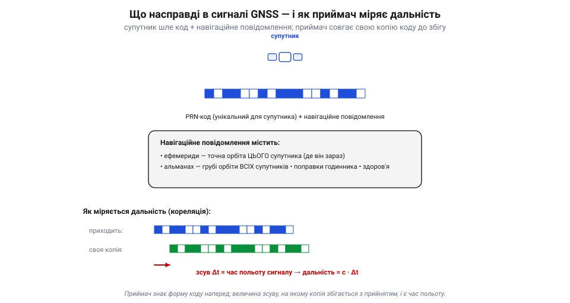
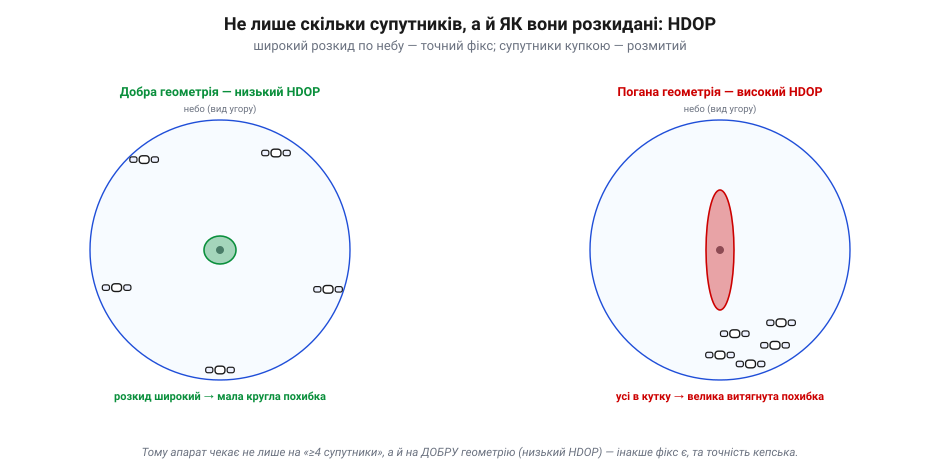

# Супутникова навігація (GNSS): як працює

**GNSS** (*Global Navigation Satellite System* — глобальна супутникова навігація; GPS, GLONASS, Galileo, BeiDou) тримається на простій ідеї: якщо знати **точний час** польоту сигналу від кількох супутників, чиї орбіти відомі, можна обчислити власне положення. Розберімо інженерну частину: що **насправді** летить у сигналі, як приймач із нього дістає координати, чому перший фікс не миттєвий, від чого залежить точність і як її піднімають до сантиметрів. Це перетворює «чарівну коробку» на зрозумілий компонент.

### Що насправді в сигналі: код і навігаційне повідомлення

Почнімо з того, що супутник **передає**. У його сигналі дві речі: **PRN-код** (*pseudo-random noise* — псевдовипадкова послідовність, унікальна для кожного супутника) і **навігаційне повідомлення** з даними.


*Рис. Що в сигналі й як міряється дальність. Супутник безперервно шле свій унікальний PRN-код разом із навігаційним повідомленням (ефемериди — точна орбіта саме цього супутника; альманах — грубі орбіти всіх; поправки годинника; здоров'я). Приймач має **свою копію** коду й «совгає» її в часі, поки вона не збіжиться з прийнятим сигналом. Величина зсуву — це час польоту, а помножена на швидкість світла — дальність.*

Тут ховається елегантний трюк. У межах одного сигналу (скажімо, цивільного **L1 C/A**) усі супутники GPS передають на **спільній** частоті — а приймач розрізняє їх саме за **різними кодами** (це називають кодовим розділенням, *CDMA*). Сам GPS має кілька частот (**L1, L2, L5**) і різні сигнали, але всередині кожного супутники однаково розділяють кодом. Знаючи форму коду кожного супутника наперед, приймач корелює (зіставляє) прийнятий шум зі своїми копіями — і та копія, що «впізналася», каже, який це супутник і з якою затримкою прийшов його сигнал. Так з одної антени приймач одночасно «чує» десяток супутників.

Є тут і ще одне диво. Сигнал від супутника за 20 000 км доходить **слабшим за шум** — приймач «чує» його нижче рівня власних теплових шумів. Як же він узагалі його ловить? Завдяки тій самій кореляції: коли довгий псевдовипадковий код збігається сам із собою, його енергія складається в гострий пік, а шум — ні. Цей виграш від [згортки](book:math/convolution) (*processing gain*) витягує корисний сигнал з-під шуму. Тому GNSS працює з мікроскопічними потужностями — але тому ж він і **вразливий**.

А чому час треба міряти аж так точно? Бо світло швидке до неможливого:

```
відстань до супутника:   ~20 200 км
час польоту сигналу:     20 200 / 300 000 ≈ 67 мс
світло за 1 наносекунду: ~30 см
→ похибка часу 1 нс  =  похибка дальності 30 см
```

Один наносекундний промах годинника — і дальність бреше на 30 см. Ось чому на супутниках стоять **атомні** годинники, ось чому в них закладено релятивістську поправку (на висоті орбіти час іде трохи інакше), і ось чому час — серце всієї системи.

> 🔧 **Навіщо це.** Слова «PRN», «ефемериди», «альманах» ти зустрінеш у будь-якому GNSS-модулі й у його логах. **Ефемериди** — свіжа точна орбіта (швидко застаріває); **альманах** — груба орбіта всіх супутників (живе довго, потрібен, щоб знати, де кого шукати). Розрізняти їх — ключ до розуміння, чому приймач інколи «думає» довго, перш ніж видати координати.

### Псевдодальність: чому потрібен саме четвертий супутник

Для фікса потрібно **щонайменше чотири** супутники — і ось точна причина. Виміряна приймачем відстань — це не справжня дальність, а **псевдодальність**: вона завищена на похибку **власного** годинника приймача (дешевого, не атомного).


*Рис. Чому супутників саме чотири. Кожна виміряна дальність ρᵢ — це справжня відстань до супутника плюс однакова для всіх добавка c·Δt, де Δt — невідома похибка годинника приймача. Маємо чотири невідомі (x, y, z і Δt) — отже, потрібні чотири рівняння, тобто чотири супутники. Третій дав би x, y, z, якби годинник був ідеальний; четвертий «оплачує» його неідеальність.*

У цьому — геніальність системи: вона **не вимагає** від приймача дорогого атомного годинника. Замість цього вона робить похибку годинника ще однією невідомою й **сама її обчислює**, додавши один супутник. Дешевий кварцовий резонатор у приймачі — і та сама точність. (Як приємний побічний ефект, GPS заодно віддає й **дуже точний час** — тому ним синхронізують мережі й біржі.)

> 🔧 **Навіщо це.** «Псевдо» в назві — не дрібниця: воно нагадує, що сире вимірювання GPS системно зміщене, поки не розв'язано похибку годинника. Тому й кажуть «потрібно 4 супутники для 3D-фікса»; із трьома буде лише 2D (якщо висоту взяти звідкись іще). Побачивши в логах «3D fix: 6 sats» — тепер знаєш, що це означає.

### Чому перший фікс не миттєвий: холодний, теплий, гарячий старт

Кожен, хто вмикав навігатор чи дрон, помічав: свіжовключений приймач «думає» — інколи довго. Причина в тому, **скільки** йому ще треба дізнатися, перш ніж порахувати позицію:


*Рис. Час до першого фікса (TTFF) залежить від наявних знань. **Холодний старт** (нічого не знає) — мусить знайти супутники й завантажити ефемериди, а як немає альманаху — то й його (а він передається аж 12.5 хв!); тому буває від ~30 секунд до хвилин. **Теплий старт** (є альманах і груба позиція) — лише підвантажити свіжі ефемериди, ~30–45 с. **Гарячий старт** (усе свіже) — лічені секунди.*

Ключ — у тривкості даних: **ефемериди** точні, їх оновлюють приблизно раз на **2 години** (а чинні вони зазвичай до ~4 годин), тоді як **альманах** грубий, зате лишається придатним тижнями. Тому приймач, що нещодавно працював, стартує швидко (його ефемериди ще свіжі), а той, що пролежав вимкненим тиждень, мусить усе завантажувати наново — і тому «думає» довше. Передові модулі прискорюють це, підкачуючи ефемериди з інтернету (так званий *A-GPS*), якщо він є.

> 🔧 **Навіщо це.** Ось чому апарат після довгого простою чи перельоту в інший регіон ловить супутники довше — і чому не варто квапити зліт, поки фікс не стабілізувався. Якщо GNSS «не ловить» там, де раніше ловив швидко, причина часто проста: холодний старт після тривалого вимкнення, а не поломка.

### Геометрія важить: HDOP і кількість супутників

Чотири супутники — мінімум, але не запорука точності. Величезну роль грає, **як саме** супутники розкидані по небу:


*Рис. Геометрія вирішує. Коли супутники широко розкидані по небосхилу (ліворуч), перетин дальностей «гострий» — похибка мала й кругла; кажуть, низький **HDOP** (горизонтальне «розмиття точності»). Коли ж усі збилися в одному кутку неба (праворуч), перетин «пологий» — похибка велика й витягнута, високий HDOP. Та сама кількість супутників, та інша точність.*

Тому добрий приймач (і автопілот) дивиться не лише на **кількість** супутників, а й на **HDOP**: чим він менший, тим надійніший фікс. Автопілоти зазвичай не дають зброїтися для автономного польоту, поки HDOP не впаде нижче порога й супутників не набереться з запасом. Багато супутників із різних сузір'їв (GPS + GLONASS + Galileo + BeiDou) тут якраз і виручають: більше видимих супутників — майже завжди краща геометрія.

> 🔧 **Навіщо це.** «Кількість супутників» — лише півправди про якість фікса; друга половина — HDOP. У місті серед висоток чи в каньйоні супутників може бути багато, але всі у вузькій смузі неба — і точність кепська. Дивлячись у телеметрію, читай **обидва** числа.

### Звідки похибки й як їх бити

Чому ж навіть із гарною геометрією звичайний GPS дає метри, а не сантиметри? Через низку похибок, що домішуються до кожної дальності:


*Рис. Похибки й способи їх побороти. Найбільша — **затримка в атмосфері** (іоносфера й тропосфера гальмують сигнал); далі **багатопроменевість** (сигнал відбивається від будівель і землі), дрібні похибки орбіти й годинника супутника, шум приймача. Праворуч — драбина точності: звичайний GNSS ~3–5 м; із доповненням **SBAS** (WAAS/EGNOS) ~1–2 м (інколи субметрово); із **RTK** (база поряд + вимір фази несучої) ~1–3 см.*

Способи покращення — це по суті способи **прибрати** ці похибки. **SBAS** (супутники доповнення WAAS у США, EGNOS у Європі) розсилає поправки на атмосферу й орбіти. **RTK** (*real-time kinematic*) використовує нерухому базову станцію поряд і вимір **фази несучої** хвилі, даючи сантиметри — саме його ставлять на дрони для точного картографування й посадки. А ще сам приймач можна зробити точнішим: **багатосмуговий** (L1/L5) майже усуває іоносферну похибку, а багатосузір'яний бачить більше супутників.

> 🔧 **Навіщо це.** Коли в описі модуля бачиш «RTK», «SBAS», «multi-band L1/L5» — це прямо про точність, і тепер ясно, що кожне з них прибирає. Для звичайного апарата вистачає метрів; для точної посадки чи аерознімання беруть RTK — але він потребує базової станції чи мережі поправок, а не лише кращого приймача.

А звідки RTK бере ті сантиметри? Він міряє відстань не за кодом, а за **фазою несучої** хвилі — а її довжина близько 19 см, тож «лінійка» стає в сотні разів тоншою за кодову. Уся хитрість — порахувати, скільки **цілих** хвиль умістилося в дальності (цю «неоднозначність» і розв'язують спільно нерухома база та рухомий приймач). Тому RTK дає сантиметри — але лише з поправками від близької бази; самотній приймач, хоч який добрий, такого не вміє.

Чимало залежить і від самої **антени**. Багатопроменевість б'є найдужче саме знизу й збоку, тому GNSS-антену ставлять угорі апарата на невеликій металевій «тарілці» — **площині землі** (*ground plane*), що екранує відбиття від корпусу. Дешева антена без площини землі в місті «збирає» відбиття від стін і дає стрибки на метри. Діє те саме правило, що й для будь-якого [бортового давача](book:electronics/onboard-sensors): добрий давач, погано поставлений, — це поганий давач.

#### Слабке місце: глушіння й підміна

Те, що сигнал такий кволий, має зворотний бік, про який мовчати не можна. **Глушилка** (*jammer*) потужністю в кілька ватів здатна «засліпити» GNSS на сотні метрів навколо, просто заливши діапазон шумом, — і дешеві автомобільні глушилки вже не раз клали навігацію цілих районів. Гірше — **підміна** (*spoofing*): передавач, що імітує справжні супутники, може непомітно «повести» приймач у хибне місце, і той рапортуватиме координати з повною впевненістю. Для апарата висновок прямий: на GNSS **не можна сліпо покладатися**. Тому добра система перевіряє, чи правдоподібний фікс (чи згоден він з IMU й барометром), і має [failsafe](book:programming/failsafe) на раптову втрату або стрибок GNSS — це частина загальної логіки надійності й [резервування](book:programming/redundancy) апарата.

### Що GNSS дає апарату

Підсумуймо, що ж приймач **віддає** в оцінювач стану. По-перше, **положення** (широта, довгота, висота) — той абсолютний якір, якого не дасть жоден інший бортовий давач. По-друге, **час** — надточний. І, по-третє, що часто недооцінюють, — **швидкість**, причому хорошої якості: її рахують не з різниці положень, а з **доплерівського зсуву** несучої (як швидко міняється дальність до кожного супутника). Це той самий ефект Доплера, за яким колись вистежували перші супутники по зміні тону сигналу, — тільки тепер він дає апарату вектор руху.

Варто знати й **формат**: положення GNSS віддає в геодезичних координатах — широта, довгота й висота над опорним еліпсоїдом (математичною моделлю форми Землі; її точність — заслуга в тому числі геодезичних моделей математикині Ґледіс Вест). [Автопілот](book:programming/flight-controller) переводить їх у зручний локальний кадр «північ-схід-вниз» відносно точки зльоту — саме в ньому й живе бортова навігація.

Розплата — у двох речах: GNSS **повільний** (оновлення кілька разів на секунду) і потребує **видимості неба**. До речі, гнатися за «10 Гц GPS» заради точності марно: приймач хоч і рахує на 10 Гц справжні нові рішення (із безперервного стеження за супутниками), **абсолютної** точності вища частота не додає — джерела похибок ті самі. Справжню гладкість між рідкими абсолютними фіксами дає не швидший приймач, а [поєднання з IMU](book:algorithms/sensor-fusion). Тому в архітектурі автопілота GNSS ніколи не керує сам: він — повільний абсолютний якір, який поєднують зі швидким [IMU](book:electronics/imu-barometer). GNSS каже «де ти насправді» раз на секунду; IMU заповнює проміжки й згладжує — разом вони й дають гладку, точну, незношувану оцінку положення.

### Підсумок теми

GNSS працює так: супутники шлють унікальні коди й свої точні орбіти; приймач кореляцією міряє час польоту до кожного, дістаючи **псевдодальності**, і з чотирьох супутників розв'язує і своє положення (x, y, z), і похибку власного дешевого годинника (Δt). Перший фікс не миттєвий, бо приймачу треба завантажити ефемериди (а часом і альманах); точність залежить від **геометрії** (HDOP) і обмежена похибками атмосфери й відбиттів — їх прибирають доповненнями (SBAS, RTK) аж до сантиметрів. На виході апарат має абсолютне положення, точний час і доплерівську швидкість — повільні, залежні від неба, але незамінні як якір для поєднання. Тримай у голові цей образ: GNSS — не «де я» з абсолютною певністю, а кволий, повільний, та чесно прив'язаний до Землі голос, який лише в команді з рештою давачів стає надійним відчуттям місця.
