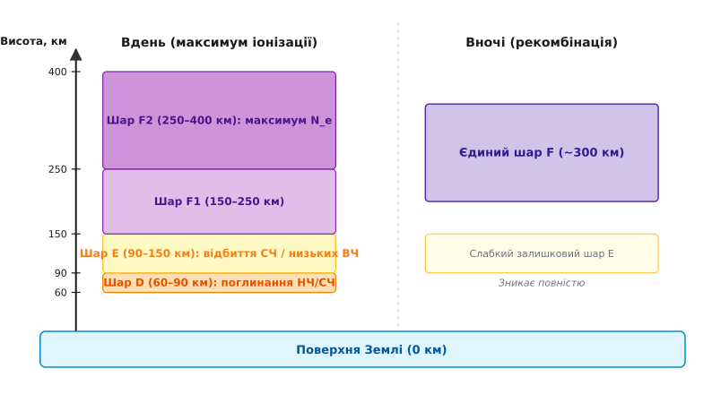
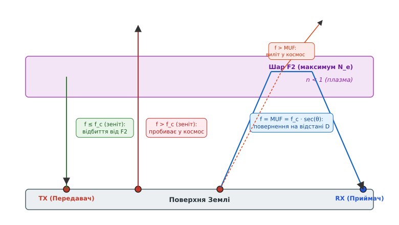
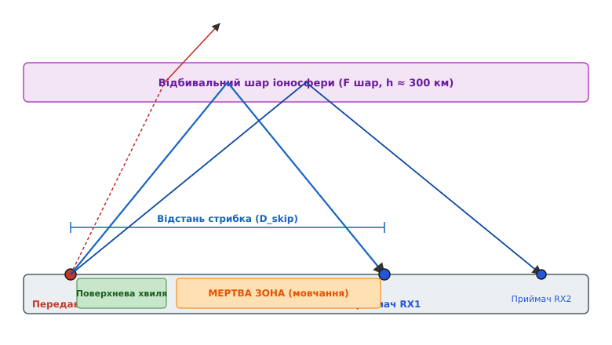

# Іоносферне поширення: шари D, E, F1, F2 та критична частота

<preknowlist>
- [Електромагнітна хвиля](book:physics/em-wave) — хвиля переносить енергію крізь середовище зі швидкістю світла й взаємодіє із зарядженими частинками.
- [Діапазони частот](book:communications/frequency-bands) — радіохвилі поділяються на НЧ, СЧ, ВЧ та УВЧ, що визначає їхні розповсюджувальні властивості.
- [Магнітне поле Землі](book:physics/earth-magnetic-field) — дипольна магнітосфера формує силові лінії, які впливають на рух іонізованої плазми.
</preknowlist>

У грудні 1901 року радіотехнічний експеримент Гульєльмо Марконі з передачі радіосигналу через Атлантичний океан від англійського мису Полдг'ю до ньюфаундлендського пагорба Сигнал-Гілл поставив фундаментальну фізику у глухий кут. Відстань між кореспондентами становила 3500 кілометрів, а випуклість земної кулі створювала між ними суцільний кам'яний і водний бар'єр заввишки понад 200 кілометрів. За класичною електродинамікою Максвелла прямолінійні радіопромені мали вилетіти у відкритий космос, а математична дифракція навколо кулі Землі слабшала настільки сильно, що приймати сигнал на такій відстані було неможливо. Пояснення з'явилося лише тоді, коли дослідники зрозуміли: верхні шари атмосфери не є порожнечею — вони насичені вільними електронами та іонами, утворюючи природний плазмовий щит, який здатний плавно вигинати й повертати радіохвилі назад до поверхні Землі.

### Фізика плазми: як вільні електрони звертають радіохвилю

Радіохвиля, що піднімається від передавача у верхні шари атмосфери, потрапляє у середовище іонізованого газу — плазму. Під дією змінного електричного поля хвилі вільні електрони починають здійснювати вимушені коливання. Оскільки маса електрона `m_e` надзвичайно мала (у 1836 разів менша за масу найлегшого іона водороду), електрони набувають високих прискорень і випромінюють вторинну електромагнітну хвилю з фазовим зсувом.

Зсув фази між первинною хвилею передавача та вторинними хвилями коливальних електронів змінює швидкість поширення фазового фронту. Фазова швидкість хвилі в плазмі стає більшою за швидкість світла у вакуумі (`v_ph > c`), а відносна діелектрична проникність плазми `ε_r` падає нижче одиниці:

```
ε_r = 1 - (N_e · e²) / (ε₀ · m_e · ω²)
```

Коефіцієнт заломлення плазми `n = √(ε_r)` виражається через власну **плазмову частоту** електронного газу `f_p`:

```
f_p = (1 / (2·π)) · √((N_e · e²) / (ε₀ · m_e)) ≈ 8.98 · √(N_e)     [Гц, де N_e у ел/м³]

n = √(1 - (f_p / f)²) = √(1 - 80.62 · N_e / f²)
```

Тут `N_e` — концентрація вільних електронів у кубічному метрі, `e` — заряд електрона, `ε₀` — електрична стала, а `f` — частота випромінюваної радіохвилі. Детальний математичний вивід цих співвідношень винесено у [математику плазмової частоти та заломлення](book:communications/ionospheric-propagation/math-plasma-frequency.md).

З цієї формули випливає вирішальне фізичне спостереження: **для будь-якої радіохвилі в іоносфері коефіцієнт заломлення менший за одиницю (`n < 1`)**. 

У звичайній оптиці промінь світла, входячи зі скла (`n ≈ 1.5`) у повітря (`n ≈ 1.0`), заломлюється геть від нормалі. В іоносфері відбувається зворотне: густина атмосфери падає з висотою, але концентрація вільних електронів `N_e` зростає, досягаючи максимуму на висотах 250–350 км. Унаслідок цього коефіцієнт заломлення `n` монотонно зменшується у міру підйому хвилі. Згідно із законом Снеліуса (`n₁ · sin(θ₁) = n₂ · sin(θ₂)`), промінь, що входить під кутом до іоносфери, дедалі сильніше відхиляється від вертикалі до горизонталі. 

У вершині траєкторії кут заломлення досягає 90 градусів, і промінь розвертається вниз, повертаючись до поверхні Землі. Це не миттєве дзеркальне відбиття від твердої межі, а **плавний неперервний процес заломлення** у градієнтному середовищі.


*Вертикальна структура іоносфери. Вдень жорстке сонячне випромінювання створює низький шар D (поглинач), шар E та два шари F1 і F2. Вночі шар D зникає за лічені хвилини через високу густину повітря та швидку рекомбінацію, а шари F1 і F2 зливаються у єдиний шар F.*

### Анатомія іоносферних шарів: D, E, F1 та F2

Іоносфера не є однорідною: вона розшаровується на декілька висотних областей з різною електронною густиною. Структура шарів задається балансом між двома процесами: фотоіонізацією нейтральних молекул атмосфери сонячним ультрафіолетом/рентгеном та зворотною рекомбінацією електронів з іонами.

#### Шар D (висота 60–90 км)

Шар D — це найнижча область іоносфери, утворена жорстким рекомбінаційним рентгенівським випромінюванням та лінією Лайман-альфа сонячного спектра. Максимум електронної густини тут відносно невеликий (`N_e ≈ 10⁹–10¹⁰ ел/м³`), проте шар D відіграє критичну роль у радіозв'язку через **високу густину атмосферного газу**.

На висотах 60–90 км частота зіткнень електронів із нейтральними молекулами азоту й кисню надзвичайно висока (`ν ≈ 10⁷ зіткнень за секунду`). Коли радіохвиля розганяє електрон, він не встигає перевипромінити накопичену енергію: при зіткненні з важкою молекулою кінетична енергія електрона безповоротно перетворюється на теплову енергію газу. 

Питоме поглинання потужності в шарі D обернено пропорційне квадрату частоти:

```
A_dB ∝ (N_e · ν) / (f² + ν²)
```

Низькі та середні частоти (до 3–7 МГц) у денний час майже повністю поглинаються в шарі D, не доходячи до вищих відбивальних шарів. 

З настанням темряви сонячне випромінювання зникає, а через високу густину газу вільні електрони за 10–20 хвилин рекомбінують із нейтральними молекулами. **Уночі шар D повністю зникає**. Саме тому середньохвильові AM-радіостанції (530–1600 кГц) удень чутно лише на 50–100 км (поверхневою хвилею), а вночі їхні сигнали поширюються на тисячі кілометрів завдяки відсутності поглинання у зниклому шарі D.

#### Шар E (висота 90–150 км)

Шар E (історичний шар Келлі-Хевісайда) формується м'яким рекомбінаційним рентгенівським випромінюванням, яке іонізує молекули кисню `O₂`. Електронна густина вдень досягає `N_e ≈ 10¹¹ ел/м³`, що відповідає критичній частоті `f_c ≈ 3–4 МГц`.

Густина газу в шарі E істотно нижча, ніж у шарі D, тому зіткнення трапляються рідше, а поглинання хвилі значно менше. Удень шар E відбиває хвилі середньохвильового та низькочастотного короткохвильового діапазонів (1.8–3.5 МГц). Уночі шар E суттєво послаблюється (електронна густина падає в 10–20 разів), але не зникає повністю.

*Спорадичний шар E (`E_s`):* Періодично на висотах 100–120 км виникають тонкі (1–3 км завтовшки), але надзвичайно щільні хмари іонізації із концентрацією електронів до `10¹² ел/м³`. Спорадичний шар `E_s` формується зсувами нейтральних вітрів у верхній атмосфері та накопиченням металевих іонах від згоряння метеорів (Fe⁺, Mg⁺). Шар `E_s` здатний відбивати радіохвилі частотою від 30 до 100+ МГц, викликаючи аномальне наддалеке проходження діапазону УВЧ (VHF) на відстані 1000–2200 км.

#### Шари F1 та F2 (висота 150–400+ км)

Область F — це головна «дзеркальна поверхня» іоносфери, відповідальна за міжконтинентальний короткохвильовий зв'язок. Вона формується далеким сонячним ультрафіолетом (EUV), що іонізує атомарний кисень `O`.

- **Шар F1 (150–250 км):** існує лише у денний час у теплі пори року з критичною частотою `f_c ≈ 4–6 МГц`. Він виступає як проміжний шар і часом створює додаткове загасання для променів, що прямують до вищого шару F2.
- **Шар F2 (250–400+ км):** шар із найвищою концентрацією електронів в іоносфері (`N_max ≈ 10¹² ел/м³` вдень). Саме шар F2 визначає верхню межу частот, що відбиваються від іоносфери (критичні частоти від 5 до 15 МГц).

На висоті 300 км тиск повітря настільки мізерний, що вільний електрон може пролетіти сотні метрів без жодного зіткнення з іоном. Унаслідок надзвичайно повільної рекомбінації висока електронна густина в шарі F2 зберігається упродовж усієї ночі. 

Увечері, коли шар F1 зникає, шари F1 та F2 зливаються у **єдиний шар F** на висоті близько 300 км. Більш детальний опис перших експериментів із виявлення цих режимів наведено у статті [відкриття шарів іоносфери](book:communications/ionospheric-propagation/hist-heaviside-kennelly.md).

---

### Критична частота, Закон секанса та MUF

Здатність іоносфери повернути промінь на Землю залежить від двох параметрів: частоти сигналу `f` та кута падіння променя `θ_i` на іоносферний шар.

#### Зенітне падіння та критична частота (`f_c`)

Якщо передавач спрямовує промінь строго вертикально вгору (у зеніт, кут падіння `θ_i = 0°`), умовою повного відбиття є повернення коефіцієнта заломлення в нуль у точці максимуму електронної густини: `n = 0`.

З формули `n = √(1 - (f_p / f)²) = 0` випливає, що радіохвиля відбиється від зеніту лише тоді, коли її частота не перевищує плазмову частоту шару `f ≤ f_p`.

**Критична частота (`f_c`)** — це найвища частота радіохвилі, яка відбивається від іоносферного шару при вертикальному (зенітному) зондуванні:

```
f_c = f_p(max) ≈ 8.98 · √(N_max)     [Гц]
```

Якщо частота випромінювання перевищує критичну (`f > f_c`), навіть у точці найбільшої електронної густини `N_max` коефіцієнт заломлення залишається більшим за нуль (`n > 0`). Такий промінь лише трохи відхиляється від вертикалі і **пробиває іоносферу наскрізь, вилітаючи у відкритий космос**.


*Динаміка променів різної частоти. При зенітному випромінюванні хвиля з частотою f ≤ f_c відбиється назад, а хвиля f > f_c іде у космос. При похилому випромінюванні під кутом θ промінь повертається на Землю аж до частоти MUF = f_c · sec(θ).*

#### Похиле падіння та Закон секанса

Коли радіопромінь випромінюється під кутом `θ_i` до нормалі (похиле зондування), променю не потрібно, щоб коефіцієнт заломлення `n` падав до нуля. Для повернення на Землю достатньо, щоб у вершині траєкторії кут заломлення досяг `90°` (`sin(90°) = 1`).

За законом Снеліуса для похилого променя умова відбиття має вигляд:

```
n(z_top) = sin(θ_i)
```

Підставивши вираз для `n(z)`, отримуємо точний **Закон секанса**:

```
√(1 - (f_c / f)²) = sin(θ_i)  ⇒  (f_c / f)² = 1 - sin²(θ_i) = cos²(θ_i)  ⇒  f = f_c / cos(θ_i)
```

Звідси визначається **Максимум придатної частоти** (Maximum Usable Frequency, **MUF**) для траси з кутом падіння `θ_i`:

```
MUF = f_c · sec(θ_i)
```

Оскільки секанс кута завжди більший за одиницю (`sec(θ_i) > 1`), **для похилих трас максимальна робоча частота завжди вища за критичну частоту зенітного зондування**. 

Чим пологіше промінь входить в іоносферу (більший кут `θ_i`, менший кут випромінювання до горизонту), тим вищий множник `sec(θ_i)` (його називають `MUF-фактором`) і тим вищу частоту можна відбити від того самого шару. Для одноразового стрибка через шар F2 на граничну відстань 4000 км `MUF-фактор` досягає значень `3.0–3.5`. Це означає, що при критичній частоті зеніту `f_c = 8 МГц` зв'язок на похилій трасі можливий на частотах аж до `24–28 МГц`.

---

### Мертва зона, відстань стрибка та вікно зв'язку OWF

Поширення радіохвиль за допомогою іоносферних відбиттів створює на поверхні Землі характерні зони покриття та мовчання.


*Геометрична структура радіотраси. Поверхнева хвиля згасає на близькій відстані. Промені, випромінені занадто круто, пробивають іоносферу. Найкрутіший промінь, що відбивається, повертається на відстані D_skip. Проміжок між межею поверхневої хвилі та D_skip утворює мертву зону.*

#### Відстань стрибка (`D_skip`) та мертва зона

Розглянемо передавач, який випромінює фіксовану частоту `f`, вищу за критичну (`f > f_c`).

- **Круті промені:** Промені, спрямовані під кутами, близькими до зеніту (малий кут `θ_i`), мають `sec(θ_i) < f / f_c`. Вони не виконують умову закону секанса і пробивають іоносферу.
- **Граничний промінь:** Перший промінь, який здатний відбитися, відповідає граничному куту `θ_crit`, для якого `sec(θ_crit) = f / f_c`. Цей промінь повертається на Землю на найкоротшій можливій відстані, яка називається **відстанню стрибка (`D_skip`)**.
- **Пологі промені:** Усі промені, випромінені під ще пологішими кутами (`θ_i > θ_crit`), також відбиваються й повертаються до Землі на відстанях, більших за `D_skip`.

На поверхні Землі утворюється три зони:
1. **Зона поверхневої хвилі:** Поблизу передавача приймач ловить прямий сигнал, що йде вздовж ґрунту. Через [згасання у вільному просторі](book:communications/free-space-loss) та поглинання ґрунтом ця хвиля згасає на відстані 50–100 км.
2. **Мертва зона (Silent Zone / Skip Zone):** Простір між межею впевненого приймання поверхневої хвилі та точкою першого повернення іоносферного променя `D_skip`. У цій зоні приймач **не чує передавача взагалі**: поверхнева хвиля вже загасла, а відбита іоносферна хвиля ще не приземлилася.
3. **Зона іоносферної (просторової) хвилі:** Область на відстані `D ≥ D_skip`, де приймаються відбиті від іоносфери сигнали.

Для обчислення відстані стрибка, кутів випромінювання та параметрів траси використовують спеціалізовані алгоритми, описані у [калькуляторі MUF та мертвої зони](book:communications/ionospheric-propagation/proj-ionosphere-muf-calculator.md).

#### Мінімум придатної частоти (LUF) та оптимальна робоча частота (OWF)

При виборі робочої частоти радіолінії інженер обмежений двома межами — верхньою та нижньою:

```
LUF  <  f_робоча  <  MUF
```

- **Верхня межа (MUF):** Задається критичною частотою та геометрією траси (`MUF = f_c · sec(θ_i)`). Якщо обрати `f > MUF`, промінь пробить іоносферу й вилетить у космос.
- **Нижня межа (LUF):** **Найнижча придатна частота** (Lowest Usable Frequency, **LUF**) визначається поглинанням у шарі D. Якщо частота занадто низька (`f < LUF`), сигнал повністю занепаде в шарі D і не дійде до приймача.

Оскільки електронна густина іоносфери безперервно флуктує під дією сонячного вітру та турбулентності, робота безпосередньо на граничній частоті `f = MUF` є нестійкою: найменше падіння іонізації призведе до негайного зриву зв'язку.

Тому в практичній радіозв'язку застосовують **Оптимальну робочу частоту** (Optimum Working Frequency, або **OWF / FOT** — *Fréquence Optimale de Travail*):

```
OWF = 0.85 · MUF
```

Запас у 15% нижче від `MUF` гарантує надійне відбиття хвилі навіть при короткочасних просіданнях електронної густини іоносфери, зберігаючи при цьому мінімально можливе поглинання у шарі D.

---

### Варіації іоносфери: сонячні цикли, доба та погодні явища

Іоносфера є динамічним середовищем, параметри якого змінюються під дією трьох основних циклів.

#### Добові варіації

- **Удень:** Сонячне випромінювання максимальне. Працюють усі шари: D, E, F1 та F2. Шар D сильно поглинає низькі частоти (1.8–7 МГц). Високі частоти (14–28 МГц) легко проходять крізь шар D і відбиваються від щільного шару F2 (`f_c ≈ 8–12 МГц`), забезпечуючи зв'язок на тисячі кілометрів.
- **Уночі:** Шари D та F1 зникають, шар E сильно слабшає. Поглинання низьких частот падає майже до нуля. Критична частота шару F2 знижується до `f_c ≈ 3–6 МГц`. Високі частоти (21–28 МГц) пробивають вечерню іоносферу й вилітають у космос («діапазони закриваються»), проте низькі частоти (1.8–7 МГц) відкриваються для міжконтинентальних трас із мінімальними втратами.

#### 11-річний цикл сонячної активності

Кількість вільних електронів в іоносфері прямо залежить від потоку ультрафіолетового та рентгенівського випромінювання Сонця, який змінюється із періодом близько 11 років (цикл сонячних плям, що вимірюється числом Вольфа `R_z`).

- **Максимум сонячного циклу (High Sunspot Activity):** Жорсткий потік сонячного випромінювання зростає у десятки разів. Концентрація електронів у шарі F2 досягає максимуму (`N_max > 2·10¹² ел/м³`), а критична частота `f_c` зростає до 14–16 МГц. Значення `MUF` для дальніх трас перевищує 35–45 МГц. Для короткохвильовиків відкриваються високочастотні діапазони 28 МГц (10 метрів) та 50 МГц (6 метрів), дозволяючи встановлювати зв'язок навколо Землі при потужності передавача всього у декілька ват.
- **Мінімум сонячного циклу (Low Sunspot Activity):** Потік рентгенівського випромінювання падає. Критична частота F2 вдень не перевищує 5–6 МГц, а `MUF` рідко піднімається вище 14–18 МГц. Діапазони 21–28 МГц залишаються «мертвими» роками.

#### Сонячні спалахи та геомагнітні бурі

- **Раптове іоносферне збурення (SID / Fadeout):** Під час потужного сонячного спалаху потік рентгенівського випромінювання досягає Землі за 8 хвилин. Він миттєво іонізує шар D на денній стороні планети. Електронна густина в шарі D зростає в сотні разів, викликаючи **раптове повне зникнення короткохвильового зв'язку** (Blackout) на всьому денному півкулі тривалістю від 30 хвилин до кількох годин.
- **Геомагнітна буря (CME):** Викид корональної маси Сонця (хмара високоенергетичних протонів та електронів) досягає магнітосфери Землі через 24–48 годин. Заряджені частинки уловлюються [магнітним полем Землі](book:physics/earth-magnetic-field) та випадають у полярних областях, спричиняючи полярні сяйва та турбулентність іоносфери. В іоносфері виникають Переміщувані іоносферні збурення (TID), шар F2 рекомбінує («руйнується»), а `MUF` катастрофічно падає.

---

### Анізотропія, завмирання та поляризація в реальному ефірі

Реальна іоносфера не є ізотропною речовиною: вона пронизана постійним [магнітним полем Землі](book:physics/earth-magnetic-field) (`B₀ ≈ 30–60 мкТл`).

#### Магнітоактивне розщеплення (Теорія Епплтона-Гартрі)

Під дією постійного магнітного поля Землі електрон, розганяючись електричним полем радиохвилі, відчуває додаткову силу Лоренца `F = -e · (v × B₀)`. Це змушує його обертатися по спіралі навколо силових ліній магнітного поля з гіромагнітною частотою:

```
f_H = (e · B₀) / (2 · π · m_e) ≈ 1.4 МГц
```

Унаслідок цього іоносфера стає **анізотропним подвійно заломлювальним середовищем**. Падаюча радіохвиля розщеплюється на дві самостійні хвилі з різними коефіцієнтами заломлення та еліптичною поляризацією:

1. **Звичайна хвиля (O-wave / Ordinary):** Електричне поле коливається переважно уздовж магнітного поля Землі. Вона поводиться так, ніби магнітного поля немає, і відбивається при критичній частоті `f_cO = f_p`.
2. **Незвичайна хвиля (X-wave / Extraordinary):** Вектор електричного поля обертається проти напрямку векторного добутку. Незвичайна хвиля відчуває сильний вплив магнітного поля, і її критична частота вища:
   ```
   f_cX ≈ √(f_cO² + f_cO · f_H) ≈ f_cO + f_H / 2
   ```

Оскільки `f_cX > f_cO` (зазвичай на 0.7 МГц вище), іонограма завжди показує два паралельних треки відбиття: звичайну та незвичайну компоненти.

#### Ефект Фарадея та поляризаційні завмирання

Під час поширення крізь магнітоактивну плазму звичайна та незвичайна хвилі рухаються з різними фазовими швидкостями. При їхньому додаванні вектор поляризації сумарної хвилі безперервно обертається навколо напрямку поширення — це явище називається **обертанням Фарадея**.

Кут обертання площини поляризації `Ω` пропорційний повному електронному вмісту траси (TEC) та обернено пропорційний квадрату частоти (`Ω ∝ TEC / f²`).

Коли радіохвиля досягає приймальної антени, вектор її поляризації безперервно повертається через зміни в іоносфері. Якщо приймальна антена має лінійну поляризацію (наприклад, горизонтальний диполь), то в моменти, коли вектор поляризації хвилі стає перпендикулярним до антени, прийнятий сигнал падає до нуля. Це викликає **поляризаційні завмирання (fading)**. 

Більш детальний аналіз статистичних моделей таких завмирань наведено у статтях [багатопроменеве завмирання](book:communications/multipath-fading) та [статистика завмирань](book:communications/fading-statistics).

---

### Практичні методи моніторингу та супутникові траси

Для забезпечення надійного радіозв'язку та навігації стан іоносфери вимірюють у реальному часі за допомогою декількох технологій.

#### Вимірювання іонозондами

**Іонозонд** — це спеціалізований короткохвильовий локатор вертикального зондування. Він випромінює короткачасні радіоімпульси, плавно перебираючи частоту від 1 до 20 МГц, та вимірює затримку відлуння `Δt`.

Результатом вимірювання є **іонограма** — графік залежності діючої (віртуальної) висоти відбиття `h'` від частоти `f`. З іонограми автоматично зчитуються ключові параметри шар за шаром:
- `foF2` — критична частота звичайного променя шару F2;
- `fxF2` — критична частота незвичайного променя шару F2;
- `foE` — критична частота шару E;
- `h'F2` — мінімальна діюча висота шару F2.

Мережа з сотень глобальних іонозондів (наприклад, автоматичні станції *Digisonde*) передає дані у міжнародні центри космічної погоди (NOAA SWPC) для побудови глобальних карт `MUF` та прогнозування проходження.

#### Трансіоносферне поширення (GPS, супутники та УВЧ)

Коли частота радіохвилі значно перевищує граничний `MUF` (наприклад, сигнали супутникової навігації GPS/Galileo на частотах `1.2–1.6 ГГц` або зв'язок Starlink на `11–14 ГГц`), хвиля вільно проходить крізь іоносферу наскрізь. 

Проте іоносфера продовжує впливати на супутникові сигнали:
1. **Іоносферна затримка сигналів GPS:** Заломлення уповільнює групову швидкість хвилі. Додаткова часова затримка сигналу пропорційна Повному електронному вмісту атмосфери (**TEC** — Total Electron Content, кількість електронів у стовпі перетином 1 м²):
   ```
   Δt_delay = (40.3 · TEC) / (c · f²)
   ```
   Ця затримка створює хибу вимірювання відстані супутниковим навігатором від декількох метрів до 30–50 метрів. Для її компенсації двочастотні GPS-приймачі порівнюють затримки на частотах `L1 (1575.42 МГц)` та `L2 (1227.60 МГц)`.
2. **Іоносферні мерехтіння (Scintillations):** Неоднорідності електронної густини у полярних та екваторіальних областях діють як дифракційна ґратка, викликаючи швидкі флуктуації амплітуди та фази супутникового сигналу (амплітудне й фазове мерехтіння), що може спричинити втрату захоплення треку GPS-приймачем.

> 🔧 **Навіщо це.** Знання іоносферного поширення є критичним не лише для аматорського та військового короткохвильового зв'язку за відсутності супутників, а й для коригування точності GNSS/GPS навігації, роботи загоризонтних радарів (OTH Radar), що виявляють цілі за 3000 км, та забезпечення стабільності каналів супутникового зв'язку УВЧ-діапазону під час геомагнітних бур.
