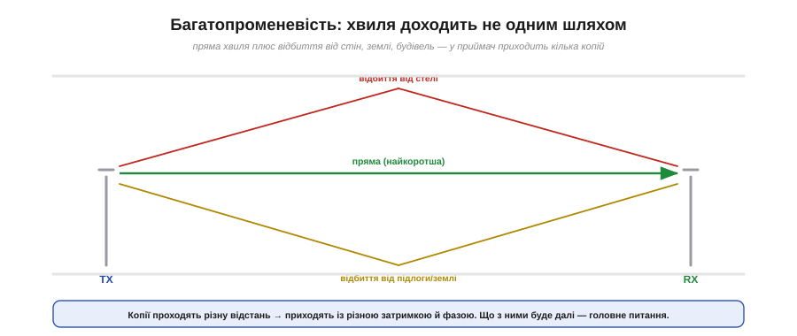
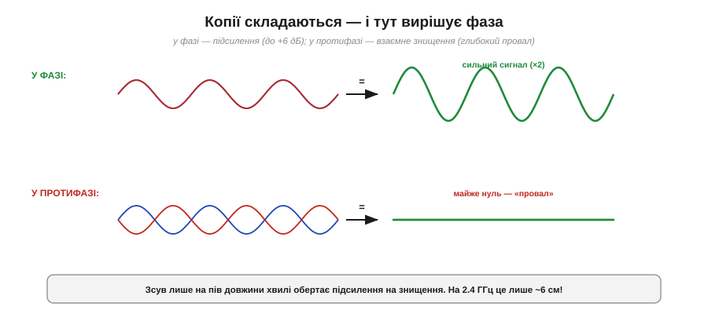
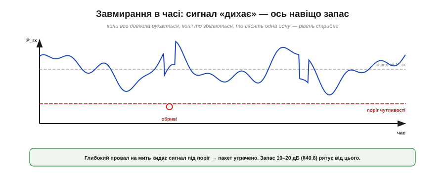
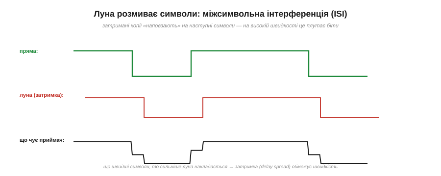

# Багатопроменевість і завмирання

[Бюджет лінії](book:communications/link-budget) малює спокійну картину: сигнал виходить, рівно слабшає з відстанню, приходить — і якщо запас додатний, усе працює. Але хто користувався Wi-Fi чи дивився, як стрибає рівень сигналу телефона, знає: реальність куди примхливіша. Сигнал **дихає** — то злітає, то провалюється; ступив крок убік — і зв'язок ожив або помер. Причина — у красивому й важливому явищі: **багатопроменевість** (*multipath*) і породжене нею **завмирання** (*fading*). Зрозумівши його, видно і навіщо потрібен запас бюджету лінії, і навіщо дві антени на роутері, і як сучасний Wi-Fi обернув цю біду собі на користь.

### Хвиля приходить багатьма шляхами

Уся справа в тому, що радіохвиля, на відміну від променя в нашій уяві, доходить до приймача **не одним** шляхом.


*Рис. До приймача приходять кілька копій однієї хвилі: пряма (найкоротша) і відбиті — від стелі, підлоги, стін, меблів, сусідніх будівель. Кожна копія долає **різну** відстань, тож приходить із різною затримкою й, головне, з різною **фазою**.*

У відкритому полі ще сяк-так буває «один промінь», але в кімнаті, на вулиці міста, у лісі хвиля **відбивається** від усього — стін, підлоги, металу, машин — точно як світло від дзеркал, як і за будь-якого [поширення радіохвиль](book:communications/propagation-polarization). Тому в приймальну антену прилітає не одна хвиля, а **жменя копій** тієї самої, кожна своїм маршрутом. А раз маршрути різної довжини, то й приходять копії **не одночасно** й, що найважливіше, з різними фазами. Далі вони складаються — і ось тут починається найцікавіше.

### Копії складаються — вирішує фаза

Що буде, коли кілька копій однієї хвилі зійдуться на антені? Вони **додаються** — але результат залежить від їхньої взаємної **фази**, і він буває діаметрально протилежним.


*Рис. Якщо копії приходять **у фазі** (гребінь до гребеня), вони підсилюють одна одну — сигнал міцнішає (дві рівні копії дають +6 дБ). Якщо **у протифазі** (гребінь до западини) — гасять одна одну, аж до майже повного нуля. Те саме явище, що й інтерференція хвиль на воді.*

**Приклад (як близько пік до провалу).** Фаза залежить від різниці пройдених шляхів, виміряної в довжинах хвилі. Зсув на **пів хвилі** обертає підсилення на знищення. А яка це відстань на практиці? Візьмімо [λ = c/f](book:physics/frequency-wavelength) для 2.4 ГГц:

```
λ      = 3×10⁸ / 2.4×10⁹ = 0.125 м = 12.5 см
λ / 2  = 6.25 см
```

Тобто **лише 6 сантиметрів** різниці ходу — і ти переходиш від яскравого піка до глибокого провалу! Дві рівні копії у фазі дають удвічі більшу амплітуду — це вчетверо більша потужність, тобто **+6 дБ**; ті самі копії в протифазі — майже **нуль**, «мертву зону». Ось чому радіо таке примхливе: усе вирішують сантиметри.

### Завмирання у просторі: піки й мертві зони поруч

Наслідок інтерференції копій — у тому, що сила сигналу **залежить від положення** приймача, і то надзвичайно різко.


*Рис. Якщо рухати приймач, сила сигналу не спадає плавно, а **мерехтить**: яскраві піки чергуються з глибокими «мертвими зонами» що кілька сантиметрів. Між сусіднім піком і нулем — близько λ/2 (на 2.4 ГГц ~6 см).*

Простір довкола передавача — це не рівне поле, що тихо слабшає з відстанню, а строката **карта** з пагорбами-піками й ямами-провалами, розкиданими що кілька сантиметрів. У піку зв'язок чудовий, у сусідній ямі — нема зовсім. Ось чому, коли телефон «не ловить», часом досить **посунути** його на долоню, повернути чи переступити крок — і зв'язок повертається: ти просто вийшов із мертвої зони. Те саме з роутером удома: пересунув на півметра — і кутова кімната ожила.

### Завмирання в часі: сигнал дихає

Якщо завмирання залежить від положення, то варто чомусь у кімнаті **рухатися** — і картина «попливе» вже **в часі**.


*Рис. Коли рухається передавач, приймач або будь-що між ними (люди, машини, двері), малюнок інтерференції безперервно змінюється — і рівень прийнятого сигналу стрибає в часі. Інколи глибокий провал на мить кидає його **під поріг** чутливості — пакет губиться.*

Світ навколо радіо рідко стоїть на місці: ходять люди, їдуть авто, ти сам рухаєш телефон. Кожен рух пересуває «карту» завмирань — і рівень сигналу починає **коливатися в часі**, інколи на десятки децибел. Здебільшого це непомітно, але час від часу глибокий провал кидає сигнал **нижче порогу чутливості** — і пакет на ту мить губиться. Ось де нарешті проясняється сенс **запасу на завмирання**, який закладають у [бюджет лінії](book:communications/link-budget): ті 10–20 дБ резерву існують саме для того, щоб звичайний провал **не** дотягувався до порогу й зв'язок переживав «дихання» сигналу без обривів.

### Луна розмиває символи

У багатопроменевості є й окрема, підступніша вада, що шкодить саме **швидким** цифровим лініям, — **міжсимвольна інтерференція**.


*Рис. Затримані копії (луна) приходять із запізненням і «наповзають» на наступні символи, розмиваючи їх. На повільному потоці це дрібниця, а на швидкому луна від попереднього символу спотворює наступний — приймач плутає біти.*

Відбиті копії приходять **із затримкою**. Якщо [символи модуляції](book:communications/fsk-psk) йдуть повільно, запізніла луна встигає згаснути до наступного символу — байдуже. Та коли символи летять **швидко**, луна від попереднього ще звучить, коли вже почався наступний, — і вони **накладаються**, плутаючи приймач. Це **міжсимвольна інтерференція** (*intersymbol interference*, ISI). Розкид затримок між копіями (*delay spread*) тим самим ставить **стелю швидкості**: хочеш швидше — мусиш якось упоратися з луною. Це ще одна, окрема від [межі Шеннона](book:communications/bandwidth-capacity), причина, чому дальність і швидкість так важко поєднати.

### Арсенал проти завмирань

На щастя, з багатопроменевістю інженери навчилися давати раду — і то кількома взаємодоповняльними способами.


*Рис. Чотири головні прийоми: **рознесені антени** (одна в провалі — друга ні); **OFDM** (багато вузьких піднесучих, кожна завмирає рівно й легко вирівнюється); **розширений спектр** (не всі частоти завмирають разом); **завадостійке кодування з повтором**, що латає поодинокі втрати.*

Кожен прийом б'є по слабкому місці завмирань. **Рознесення** (*diversity*): постав дві антени за кілька сантиметрів — якщо одна потрапила в мертву зону, інша майже напевно ні (бо провали — що 6 см); приймач бере кращу. **OFDM** (*orthogonal frequency-division multiplexing*): розбий швидкий потік на безліч **повільних** вузьких піднесучих — кожна бачить рівне («пласке») завмирання, яке легко вирівняти, а повільні символи не страждають від ISI; на цьому стоять Wi-Fi і LTE. [Розширений спектр](book:communications/spread-spectrum): стрибки й коди розкидають сигнал так, що не всі частоти провалюються одночасно. І нарешті **кодування з перевідправленням**: втрачені під час провалу біти відновлюють надлишковим кодом або просто [просять надіслати ще раз](book:communications/reliable-link).

> 🔧 **Навіщо це.** Тепер у тебе складається повна, чесна картина реального радіоканалу — без ілюзій «рівного променя». Коли твій пристрій час від часу «гойдає» зв'язок, ти знаєш: це не обов'язково слабка антена чи поломка — це **завмирання**, нормальна фізика багатопроменевості. І знаєш, що з цим робити: закласти запас у [бюджеті лінії](book:communications/link-budget), поставити рознесені антени, не гнатися за максимальною швидкістю там, де важлива надійність, увімкнути перевідправлення. А головне — більше не дивуватися, чому «два кроки вбік» інколи лагодять зв'язок краще за будь-яке налаштування.

### Несподіваний фінал: ворог стає другом

І наостанок — найкрасивіший поворот усієї історії. Багатопроменевість десятиліттями вважали **ворогом** зв'язку. А сучасні системи навчилися робити з неї… **джерело швидкості**.


*Рис. MIMO ставить кілька антен на обох кінцях. Різні відбиті шляхи між ними утворюють кілька **незалежних** каналів — і по них одночасно женуть кілька **різних** потоків даних. Те, що псувало один сигнал, тепер у кілька разів **збільшує** ємність.*

Ідея зветься **MIMO** (*multiple-input multiple-output*) і звучить як парадокс. Постав кілька антен на передавачі й кілька на приймачі. Багатопроменевість робить шлях від кожної TX-антени до кожної RX-антени **трохи іншим** — і ці відмінності дають змогу математично **розділити** кілька потоків даних, що летять **одночасно на одній частоті**. Чим **багатша** багатопроменевість, тим краще MIMO розрізняє потоки — отже, колишній ворог став **другом**, що множить швидкість. Саме MIMO дало сучасному Wi-Fi і 5G їхні високі швидкості. Гарний урок інженерної винахідливості: явище, з яким півстоліття боролися, зрештою обернули на перевагу.
