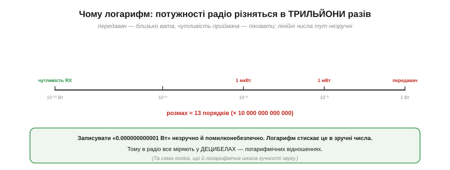
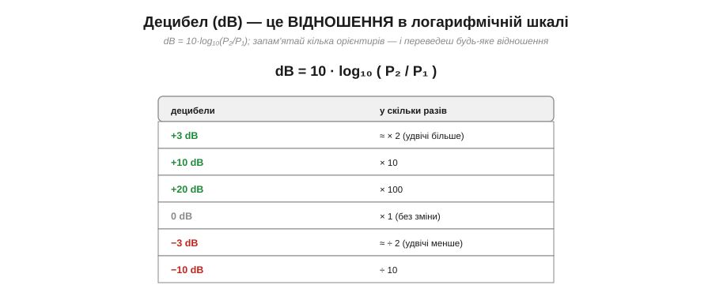
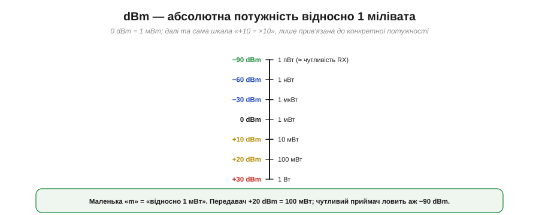

# Потужність і децибели

Тут ми зробимо коротку, але необхідну зупинку на **математичному інструменті**, без якого радіо не обговорюють: на **децибелах**. Спершу вони здаються зайвим ускладненням — навіщо якісь логарифми, коли є звичайні вати? Та виявиться, що для радіо децибели — не ускладнення, а **спрощення**: вони перетворюють незручні числа з десятком нулів на охайні величини, а складне множення підсилень і втрат — на просте додавання. Опанувавши їх тут, ти легко читатимеш будь-яку радіоспецифікацію й рахуватимеш бюджет лінії.

### Чому логарифм: величезний діапазон

Проблема, яку розв'язують децибели, — у **масштабі**. Потужності в радіо різняться неймовірно: передавач випромінює близько вата, а чутливий приймач ловить сигнали в **піковати** — мільйонні частки мільйонної частки вата.


*Рис. Від потужності передавача (≈1 Вт) до чутливості приймача (≈10⁻¹³ Вт) — розмах близько **13 порядків**, тобто у десять трильйонів разів. Записувати такі числа лінійно (0.000000000001 Вт) незручно й помилконебезпечно. Логарифм стискає цей розмах у зручні величини.*

Уяви, що треба весь час оперувати числами від 1 до 0.0000000000001. Лінійна шкала тут безпорадна: на ній і передавач, і приймач злилися б у двох точках на різних кінцях нескінченної лінії. **Логарифм** же стискає кожні «×10» в однаковий крок — і весь цей шалений діапазон уміщається в зручні двозначні числа. Це та сама ідея, що й логарифмічна шкала гучності звуку: вухо теж сприймає величезний діапазон, і його зручно міряти логарифмом. У радіо цю логарифмічну одиницю звуть **децибелом**.

### Децибел = логарифмічне відношення

Головне, що треба засвоїти про децибел: це **відношення**, а не абсолютна величина. Він каже, у скільки разів одна потужність більша за іншу — але в логарифмічній шкалі.


*Рис. dB = 10·log₁₀(P₂/P₁). Орієнтири, які варто завчити: +3 dB ≈ ×2 (удвічі більше), +10 dB = ×10, +20 dB = ×100; 0 dB = ×1 (без зміни); −3 dB ≈ ÷2, −10 dB = ÷10. Знаючи їх, переведеш будь-яке відношення.*

```
dB = 10 · log₁₀(P₂ / P₁)

орієнтири:
  0 dB  = × 1      +3 dB ≈ × 2      +10 dB = × 10
                   −3 dB ≈ ÷ 2      −10 dB = ÷ 10
```

Запам'ятай ці кілька орієнтирів — і децибели перестануть бути загадкою. **+3 дБ — це приблизно вдвічі більше потужності**, +10 дБ — рівно в десять разів, +20 дБ — у сто. Знак мінус — навпаки: −3 дБ удвічі менше, −10 дБ удесятеро. Зверни увагу: дБ сам по собі нічого не каже про **абсолютну** потужність — лише про **відношення**. «Антена дає +6 дБ» означає «у чотири рази більше, ніж було», а не якесь конкретне число ват.

### Множення стає додаванням

А тепер — головна **зручність**, заради якої радіотехніка взагалі полюбила децибели. У логарифмі множення перетворюється на **додавання**.


*Рис. У разах довелося б множити: ×10 (підсилювач) · ÷2 (кабель) · ×4 (антена) = ×20. У децибелах ті самі ланки просто **додаються**: +10 dB − 3 dB + 6 dB = +13 dB. І +13 dB — це якраз ×20. Додавати в умі набагато простіше, ніж множити.*

Ось у чому магія. Радіолінія — це **ланцюг** підсилень і втрат: підсилювач множить потужність, кабель ділить, антена множить, відстань ділить. У разах їх довелося б **перемножувати** — морока. А в децибелах підсилення — це просто **плюс**, втрати — **мінус**, і весь ланцюг зводиться до **суми**: +10 − 3 + 6 = +13 дБ. Жодного множення — звичайне додавання, яке легко зробити в умі. Саме тому весь [бюджет радіолінії](book:communications/link-budget) рахують у децибелах: це проста арифметика «плюсів і мінусів».

### dBm: абсолютна потужність

Децибел — це відношення, але часто треба назвати **абсолютну** потужність. Для цього беруть дБ **відносно конкретної точки відліку** — 1 мілівата — і позначають **dBm** (маленька «m» = «відносно 1 мВт»).


*Рис. 0 dBm = 1 мВт (точка відліку). Далі та сама шкала: +10 dBm = 10 мВт, +20 dBm = 100 мВт, +30 dBm = 1 Вт. У мінус: −30 dBm = 1 мкВт, −60 dBm = 1 нВт, −90 dBm = 1 пВт (приблизно чутливість приймача).*

Тепер числа стають зрозумілими. Передавач Wi-Fi на **+20 dBm** — це 100 мВт. Потужний передавач на **+30 dBm** — цілий ват. А чутливість приймача **−90 dBm** означає, що він розрізняє сигнал потужністю лише 1 піковат. Уся та страшна лінійна «трильйонократність» від вата до піковата тепер укладається в охайний діапазон приблизно від +30 до −110 dBm. Зверни увагу: **від'ємні** dBm — це потужності **менші** за 1 мВт, тобто слабкі сигнали; чим «глибше в мінус», тим слабший.

### Правило трійок і десяток

Щоб переводити дБ у рази **в умі**, досить двох цеглинок: **+3 ≈ ×2** і **+10 = ×10**. З них складається будь-яке відношення.


*Рис. Дві цеглинки: +3 dB = ×2, +10 dB = ×10. Складаючи їх: +13 dB = +10 +3 = ×10 ×2 = ×20; +23 dB = +10 +10 +3 = ×200; −7 dB = −10 +3 = ÷10 ×2 = ÷5.*

**Приклад (переклад у думці).** Скільки разів це?

```
+13 dB = +10 +3   →  ×10 × 2   = × 20
+23 dB = +10+10+3 →  ×10×10×2  = × 200
−7 dB  = −10 +3   →  ÷10 × 2   = ÷ 5  (тобто ×0.2)
```

Розклавши дБ на десятки й трійки, ти миттєво прикинеш відношення без жодного калькулятора. Це неоціненно для оцінок «на серветці»: побачив «+16 дБ» — це +10+3+3 = ×10×2×2 = ×40. Кілька хвилин практики — і переклад дБ↔рази стає автоматичним.

### Децибели скрізь

Раз дБ — це відношення, ним зручно міряти **все**, що в радіо є відношенням, а таких величин більшість.


*Рис. **Підсилення** (+дБ): підсилювач додає потужності. **Втрати** (−дБ): кабель, стіна, відстань віднімають. **SNR** (дБ): відношення сигналу до шуму. **Виграш антени** (dBi): наскільки антена спрямованіша за ідеальну всебічну. Усе це — відношення, тож усе зручно в дБ.*

Підсилення підсилювача, втрати в кабелі чи на відстані, відношення сигналу до шуму (SNR), [виграш антени](book:communications/antenna-gain) (його позначають dBi — дБ відносно ідеальної всебічної антени) — усе це відношення, і всі вони говорять однією мовою децибел. Завдяки цьому **весь** шлях сигналу — від передавача через кабель, антену, простір, ще антену й кабель до приймача — описують єдиною шкалою й просто **складають**. Це й робить дБ незамінним інструментом радіоінженера.

### Практика: читаємо радіоспецифікацію

Зведімо все в найкорисніший навик — читання реальної специфікації.


*Рис. Передавач «+20 dBm» (=100 мВт) і чутливість приймача «−95 dBm». Їхня **різниця** — запас на всі втрати по дорозі: +20 − (−95) = **115 дБ**. Стільки децибел можна «втратити» (на відстань, стіни, кабель), поки зв'язок ще живий.*

**Приклад (запас лінії).** Передавач +20 dBm, чутливість приймача −95 dBm:

```
запас на втрати = потужність TX − чутливість RX
                = (+20) − (−95)
                = 115 дБ
```

Ці 115 дБ — і є той «бюджет», який можна розтринькати на втрати по дорозі (відстань, стіни, неузгодженість антен), і поки сумарні втрати менші за нього, зв'язок працює. Тільки-но втрати перевищать запас — приймач уже не «чує» сигнал.

> 🔧 **Навіщо це.** Уміти читати dBm і дБ — обов'язкова навичка радіопроєкту. У будь-якому даташиті радіомодуля шукай два числа: **потужність передавача** (у dBm — скільки випромінює) і **чутливість приймача** (у dBm — найслабший сигнал, який він ще розбирає). Їхня різниця — твій **бюджет** у децибелах. Більше потужності TX чи кращу (глибше в мінус) чутливість RX — більший бюджет — більша дальність. Усе проєктування радіо зрештою зводиться до арифметики цих децибел, зведеної в повний [бюджет лінії](book:communications/link-budget).

Саме децибели роблять кількісною головну біду радіо — те, що сигнал неминуче **слабшає** з відстанню. Навіть у чистому просторі, без жодних стін, потужність падає, і то дуже швидко; скільки децибел «з'їдає» сама лише відстань, показує [загасання у вільному просторі](book:communications/free-space-loss).

---
