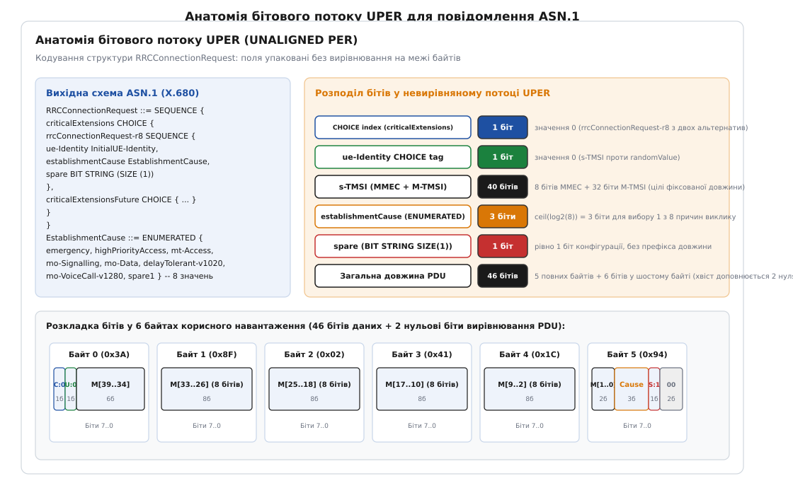
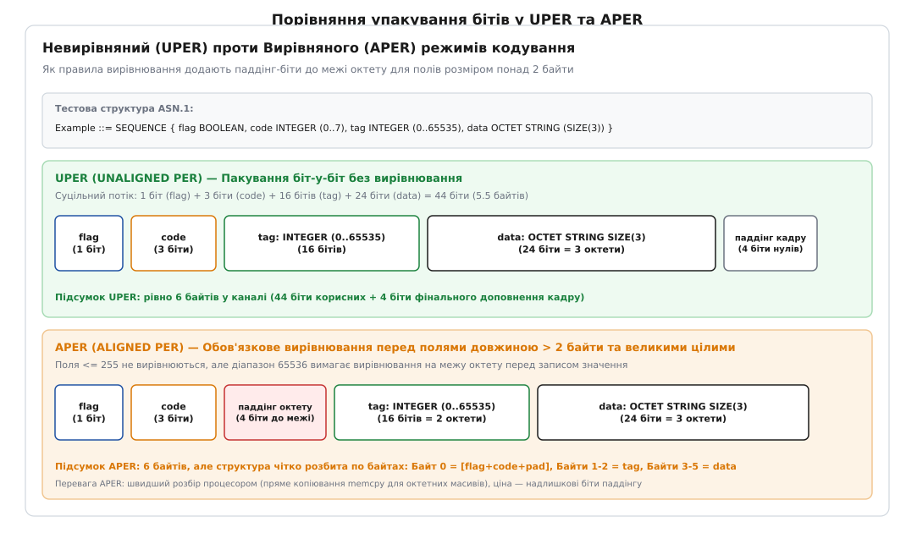
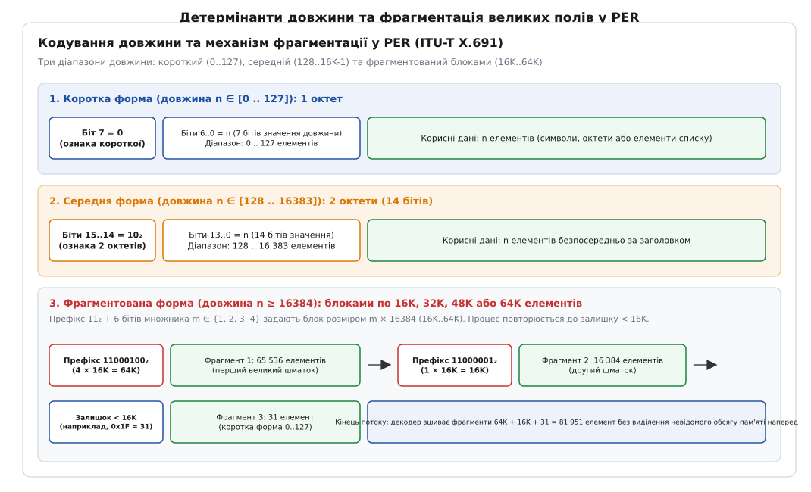

# ASN.1 і правила кодування PER

<preknowlist>
* [Проєктування пакета: поля, вирівнювання та ефективність](topic:communications/packet-design)
* [Ентропія Шеннона та межі стиснення інформації](topic:communications/shannon-entropy)
* [Контрольні суми та виявлення помилок у каналах зв'язку](topic:communications/crc)
* [H.323: телефонна сигналізація ITU-T](topic:communications/h323)
</preknowlist>

У бездротових каналах зв'язку та мобільних мережах кожен біт радіочастотного спектра має вимірювану фізичну й фінансову вартість. У мережах стільникового зв'язку 3GPP LTE та 5G NR головний блок системної інформації (Master Information Block, MIB), що транслюється базовою станцією eNodeB/gNodeB по фізичному каналу мовлення PBCH кожні 40 мілісекунд, має жорстке апаратне обмеження корисного навантаження: рівно 24 біти. Якщо службове повідомлення перевищить цей ліміт хоча б на один біт, воно не поміститься у виділені ресурсні елементи радіокадру, що унеможливить синхронізацію мобільних терміналів із мережею. Схожа ситуація спостерігається в авіаційних лінках VDL Mode 2 (VHF Digital Link) та системі цифрового зв'язку диспетчер–пілот CPDLC, де швидкість передачі у радіоефірі обмежена значенням 31.5 кбіт/с на всю зону аеропорту.

Класичні текстові формати серіалізації (JSON, XML) або стандартні бінарні протоколи з побайтовим вирівнюванням полів (як-от BER, Protobuf чи CBOR) у таких умовах виявляються надто марнотратними. Вони витрачають від 50% до 90% трафіку на передачу тегів, імен ключів, лічильників довжини та нульових байтів вирівнювання (padding). Для вирішення цієї проблеми Міжнародний союз електрозв'язку (ITU-T) розробив стандарт пакування даних **PER** (Packed Encoding Rules, ITU-T X.691), що спирається на мову абстрактного синтаксису **ASN.1** (Abstract Syntax Notation One, ITU-T X.680).

### Концепція ASN.1: повне відокремлення схеми від подання

Мова ASN.1 будується на фундаментальному принципі: **формальна специфікація структури даних повністю відокремлена від правил її двійкового кодування**. Розробник протоколу один раз описує сутності за допомогою суворо типізованої схеми, після чого компілятор ASN.1 може транслювати її у бінарний потік за будь-яким вибраним стандартом:
* **BER (Basic Encoding Rules):** Класичний самоописовий триплетний формат TLV (Tag-Length-Value), де кожен елемент містить явний ідентифікатор типу та лічильник довжини.
* **DER (Distinguished Encoding Rules):** Канонічна підмножина BER із однозначним кодуванням, що застосовується у криптографічних сертифікатах X.509.
* **OER (Octet Encoding Rules):** Спрощений вирівняний бінарний формат із мінімальним використанням тегів для швидкої десеріалізації на процесорах загального призначення.
* **PER (Packed Encoding Rules):** Гранично компактне пакування, де поля стискаються до бітового рівня з повним усуненням тегів і назв.

Головна відмінність кодування PER від класичних форматів сімейства TLV полягає в **симетричному неявному контракті**. Передавач і приймач володіють абсолютно ідентичною схемою ASN.1, скомпільованою у вихідний двійковий код ще на етапі створення прошивки. Тому передавати в ефір ідентифікатори типів (теги) чи назви полів немає жодної потреби: декодер заздалегідь знає, яке саме поле, з яким математичним діапазоном і в якій послідовності слідує у бітовому потоці.

Порівняння архітектурних властивостей PER із класичними схемами серіалізації наведено в окремому матеріалі [Порівняння правил кодування ASN.1 та сучасних серіалізаторів](topic:communications/asn1-per/comp-encoding-rules.md).

### Механіка пакування цілих чисел з обмеженим діапазоном

Основою максимальної компактності PER є математичний алгоритм пакування цілих чисел з обмеженим діапазоном (Constrained Whole Number).

У мові ASN.1 цілі числа рідко бувають нескінченними — майже завжди інженер вказує допустимі межі значень. Розглянемо поле, що визначає номер фізичної комірки базової станції (Physical Cell Identity, PCI):

```asn1
PhysCellId ::= INTEGER (0..503)
```

Традиційний бінарний серіалізатор виділив би для числа 503 два байти (16 бітів uint16_t). Правила PER підходять до цього строго математично:
1. Визначається потужність множини допустимих значень (розмір діапазону):
   ```
   R = upper_bound - lower_bound + 1
   R = 503 - 0 + 1 = 504
   ```
2. Обчислюється мінімальна кількість бітів `b`, необхідна для однозначної адресації `R` різних станів:
   ```
   b = ceil(log2(504)) = 9 бітів
   ```
3. Значення нормалізується шляхом віднімання нижньої межі (bias offset):
   ```
   V_encoded = V - lower_bound
   ```
4. Число `V_encoded` записується в результуючий потік рівно 9 бітами.

Якщо діапазон становить, наприклад, `INTEGER (1000..1003)`, розмір діапазону дорівнює `R = 1003 - 1000 + 1 = 4`. Таке поле займає рівно `ceil(log2(4)) = 2` біти: значення 1000 кодується як `00₂`, 1001 як `01₂`, 1002 як `10₂`, а 1003 як `11₂`.

Якщо ж поле має лише одне фіксоване значення (`INTEGER (5..5)`), розмір діапазону дорівнює `R = 1`, а кількість виділених бітів становить `ceil(log2(1)) = 0` бітів. Це значення не передається по мережі взагалі — декодер автоматично підставляє константу 5 на основі схеми.

Стандарт X.691 виділяє чотири класи цілих чисел:
1. **Повністю обмежені (Constrained Whole Number):** Відомі обидві межі `(lb..ub)`. Кодуються зміщенням `V - lb` у `ceil(log2(ub - lb + 1))` бітів.
2. **Напівобмежені знизу (Semi-constrained Whole Number):** Відома лише нижня межа `INTEGER (lb..MAX)`. Число нормалізується (`V - lb`) і кодується як беззнакове ціле змінної довжини з детермінантом довжини в байтах.
3. **Необмежені (Unconstrained Integer):** Межі не вказані `INTEGER`. Кодуються у форматі доповнення до двох (Two's Complement) із префіксом кількості октетних байтів.
4. **Константні (Fixed Value):** `INTEGER (N..N)`. Займають 0 бітів.

Математичне виведення ентропійних меж, алгоритми пакування символьних рядків та розрахунок розсіювання бітів детально розібрано в статті [Математичні засади бітового пакування та ентропійні межі](topic:communications/asn1-per/math-integer-packing.md).

### Пакування складних структур і базових типів

Кожен базовий тип ASN.1 перетворюється у бітовий потік UPER за строго формалізованими правилами:

1. **Тип BOOLEAN:**
   Займає рівно 1 біт: `1` представляє логічну істину (`TRUE`), `0` представляє хибність (`FALSE`).

2. **Тип ENUMERATED:**
   Усі елементи перелічуваного типу нумеруються цілими числами `0, 1, ..., N-1` згідно з порядком їхнього оголошення в схемі. Якщо перелік містить `N` елементів, кожне значення записується рівно `ceil(log2(N))` бітами. Якщо перелік містить маркер розширення `...`, першим бітом записується прапорець розширення (1 біт). Якщо вибрано стан із базового переліку, записується біт `0` і `ceil(log2(N))` бітів індексу; якщо вибрано розширений стан — біт `1` і число Normally Small Non-Negative Integer.

3. **Тип CHOICE:**
   Представляє вибір одного з кількох можливих типів даних (варіантне об'єднання / tagged union). Кодується індексом обраної альтернативи (від 0 до `K-1`, де `K` — кількість варіантів у базовому корені) довжиною `ceil(log2(K))` бітів, після якого безпосередньо слідують біти закодованого значення обраного типу.

4. **Тип SEQUENCE:**
   Колекція іменованих полів різного типу. Якщо структура містить опціональні поля (`OPTIONAL` або `DEFAULT`), на початку послідовності формується компактна бітова маска присутності (Presence Preamble). Довжина маски дорівнює кількості опціональних полів у базовому корені. Біт `1` означає, що поле присутнє в повідомленні, біт `0` — що воно пропущене. Якщо значення поля `DEFAULT` збігається зі значенням за замовчуванням, енкодер може пропустити передачу цього поля (виставивши біт `0` у преамбулі), заощаджуючи біти.

5. **Тип SEQUENCE OF (Динамічний або статичний масив):**
   Якщо розмір масиву обмежений діапазоном `SIZE(min..max)`, спочатку записується префікс кількості елементів довжиною `ceil(log2(max - min + 1))` бітів, після чого послідовно серіалізуються всі елементи без жодних проміжків. Якщо розмір зафіксовано константою `SIZE(N)`, префікс довжини не записується взагалі (0 бітів).

6. **Рядки з обмеженим алфавітом (Permitted Alphabet):**
   Якщо схема обмежує допустимий набір символів рядка конструкцією `FROM ("0".."9" | "A".."F")` (16 символів), кожен символ кодується не 8-бітовим ASCII-кодом, а 4-бітовим індексом у таблиці дозволеного алфавіту (`ceil(log2(16)) = 4`). Це скорочує розмір рядкових ідентифікаторів рівно на 50%.

### Анатомія невирівняного бітового потоку (UPER)

У невирівняному режимі (UPER — Unaligned PER) біти пакуються в потік абсолютно неперервно (MSB-first: від старшого біта октету до молодшого), перетинаючи межі байтів без жодних порожнеч.


*Структура невирівняного бітового потоку UPER: поля CHOICE, ENUMERATED, обмежені цілі та бітові рядки пакуються без прив'язки до меж октетних байтів.*

Розглянемо структуру кадру, зображеного на схемі:
* **Селектор CHOICE (1 біт):** Вибір між двома гілками (`0` = базова структура, `1` = розширення).
* **Селектор ідентифікатора UE (1 біт):** Вибір між тимчасовим ідентифікатором s-TMSI (`0`) та випадковим 40-бітовим числом (`1`).
* **Поле MMEC (8 бітів):** Обмежене ціле число `INTEGER (0..255)`, що ідентифікує центр мобільної комутації MME.
* **Поле M-TMSI (32 біти):** Обмежене ціле число `INTEGER (0..4294967295)`.
* **Причина дзвінка establishmentCause (3 біти):** Перелік із 8 можливих станів `ENUMERATED (0..7)`.
* **Резервний біт spare (1 біт):** Службовий бітовий рядок `BIT STRING (SIZE(1))`.

Усі 46 бітів корисного навантаження вкладаються в 6 байтів пам'яті (46 бітів даних + 2 біти кінцевого нульового паддінгу для закриття фінального октету).

Практична реалізація бітового потоку на C та C++ з покроковим розбором кодування повідомлення 3GPP LTE RRCConnectionRequest представлена у вставці [Практична реалізація бітового потоку UPER на C та C++](topic:communications/asn1-per/proj-per-bitstream.md).

### Повний розбір реального кадру: 3GPP LTE MasterInformationBlock

Щоб побачити, як теоретичні правила PER працюють в реальному обладнанні мобільного зв'язку, розглянемо повну ASN.1 специфікацію повідомлення `MasterInformationBlock` зі стандарту 3GPP TS 36.331:

```asn1
MasterInformationBlock ::= SEQUENCE {
    dl-Bandwidth        ENUMERATED { n6, n15, n25, n50, n75, n100 },
    phich-Config        PHICH-Config,
    systemFrameNumber   BIT STRING (SIZE (8)),
    spare               BIT STRING (SIZE (10))
}

PHICH-Config ::= SEQUENCE {
    phich-Duration      ENUMERATED { normal, extended },
    phich-Resource      ENUMERATED { oneSixth, half, one, two }
}
```

Розрахуємо бітовий бюджет кожного поля:
1. `dl-Bandwidth`: Перелічуваний тип із 6 значень. Діапазон індексів від 0 до 5 (`R = 6`). Кількість бітів: `ceil(log2(6)) = 3` біти.
2. `phich-Config.phich-Duration`: Перелік із 2 значень (`R = 2`). Кількість бітів: `ceil(log2(2)) = 1` біт.
3. `phich-Config.phich-Resource`: Перелік із 4 значень (`R = 4`). Кількість бітів: `ceil(log2(4)) = 2` біти.
4. `systemFrameNumber`: Бітовий рядок фіксованого розміру 8 бітів. Префікс довжини відсутній. Кількість бітів: 8 бітів (старші 8 бітів 10-бітового номера системного кадру SFN).
5. `spare`: Резервний бітовий рядок фіксованого розміру 10 бітів (використовується для майбутніх розширень eMTC/NB-IoT). Кількість бітів: 10 бітів.

Підсумуємо загальну кількість бітів повідомлення MIB:
```
3 (dl-Bandwidth) + 1 (phich-Duration) + 2 (phich-Resource) + 8 (SFN) + 10 (spare) = 24 біти
```

24 біти складають рівно **3 октетні байти**. Цей бінарний блок передається у фізичному радіоканалі PBCH кожні 40 мс без жодного зайвого біта паддінгу. Якщо значення ширини каналу `n50` (індекс 3 = `011₂`), тривалість PHICH `normal` (індекс 0 = `0₂`), ресурс PHICH `one` (індекс 2 = `10₂`), номер кадру SFN `0x5A = 01011010₂`, а резервні біти заповнені нулями, результуючий потік формує байти:
```
Біти:  011 0 10 01011010 0000000000
Байт 0: 01101001 (0x69)
Байт 1: 01101000 (0x68)
Байт 2: 00000000 (0x00)
```
Повідомлення MIB займає рівно 3 байти: `0x69 0x68 0x00`.

### Цифровий авіаційний зв'язок: VDL Mode 2 та CPDLC

В авіаційному зв'язку стандарти ICAO Doc 9705 та EUROCAE ED-110B регламентують протокол прямого зв'язку диспетчер–пілот (Controller-Pilot Data Link Communications, CPDLC). Коли літак виконує трансатлантичний переліт або перебуває в зоні щільного термінального контролю аеропорту, голосовий радіообмін VHF (118–137 МГц) стає головним «вузьким місцем» безпеки польотів через взаємні блокування радіопередавачів.

Службові повідомлення CPDLC транслюються поверх мережі ATN (Aeronautical Telecommunications Network) з використанням правил PER. Розглянемо приклад диспетчерської вказівки щодо набору висоти:

```asn1
ATCMessage ::= SEQUENCE {
    header          ATCMessageHeader,
    messageData     ATCUplinkMessageData
}

ATCMessageHeader ::= SEQUENCE {
    msgNumber       INTEGER (0..63),                -- 6 бітів
    msgResponseAttr ENUMERATED { no, yes, urgent }, -- 3 значення -> 2 біти
    timestamp       Time OPTIONAL                   -- преамбула: 1 біт
}

ATCUplinkMessageData ::= CHOICE {
    climbToLevel    Level,                          -- селектор команди (до 128 команд -> 7 бітів)
    descendToLevel  Level,
    directToFix     FixName,
    ...
}

Level ::= CHOICE {
    flightLevel     INTEGER (30..600),              -- Ешелон польоту FL30..FL600 -> R=571 -> 10 бітів
    altitude        INTEGER (0..50000)              -- Висота у футах -> R=50001 -> 16 бітів
}
```

Розрахуємо бітовий розмір команди «Набрати ешелон FL350» (`msgNumber = 5`, `msgResponseAttr = yes`, без позначки часу):
* `header.timestamp`: опціональне поле, присутній прапорець преамбули = 1 біт (`0` — відсутній).
* `header.msgNumber`: значення 5 в діапазоні 0..63 = 6 бітів (`000101₂`).
* `header.msgResponseAttr`: стан `yes` (індекс 1 з 3) = 2 біти (`01₂`).
* `messageData`: селектор команди `climbToLevel` (індекс 0 з 128) = 7 бітів (`0000000₂`).
* `Level`: селектор `flightLevel` (індекс 0 з 2) = 1 біт (`0`).
* `flightLevel`: значення `350 - 30 = 320` в діапазоні 0..570 = 10 бітів (`0101000000₂`).

Загальний обсяг навігаційного розпорядження становить:
```
1 + 6 + 2 + 7 + 1 + 10 = 27 бітів (менше 4 байтів!)
```
Завдяки PER авіаційний модем VDL Mode 2 передає повну інструкцію зміни ешелону менш ніж за 1 мілісекунду, що дозволяє обслуговувати сотні літаків у зоні одного радіомаяка без ризику затримки або колізії пакетів.

### Автомобільні стандарти C-V2X та SAE J2735

У системах автономного водіння та взаємодії автомобілів між собою (Vehicle-to-Vehicle, V2V) та з інфраструктурою (Vehicle-to-Infrastructure, V2I) критичною вимогою є наднизька затримка доставки (до 10–20 мс). Транспортні засоби, що рухаються на швидкості 130 км/год, кожні 100 мс транслюють в ефір базові повідомлення безпеки (Basic Safety Message, BSM за стандартом SAE J2735 або Cooperative Awareness Message, CAM за стандартом ETSI ITS).

Схема BSM описує високоточну просторову телеметрію автомобіля:

```asn1
BSMcoreData ::= SEQUENCE {
    msgCnt          MsgCount,                       -- INTEGER (0..127) -> 7 бітів
    id              TemporaryID,                    -- OCTET STRING (SIZE(4)) -> 32 біти
    secMark         DSecond,                        -- INTEGER (0..65535) -> 16 бітів
    lat             Latitude,                       -- INTEGER (-900000000..900000001) -> 31 біт
    long            Longitude,                      -- INTEGER (-1800000000..1800000001) -> 32 біти
    elev            Elevation,                      -- INTEGER (-4096..61439) -> 16 бітів
    accuracy        PositionalAccuracy,             -- 4 октети -> 32 біти
    speed           Speed,                          -- INTEGER (0..8191) -> 13 бітів
    heading         Heading,                        -- INTEGER (0..28800) -> 15 бітів
    brakes          BrakeSystemStatus,              -- BIT STRING (SIZE(16)) -> 16 бітів
    size            VehicleSize                     -- SEQUENCE (2 поля по 7 бітів) -> 14 бітів
}
```

Усі навігаційні координати передаються з дискретністю `10⁻⁷` градуса (точність до 1.1 сантиметра на поверхні Землі). Упаковка UPER стискає повний вектор кінематики автомобіля (координати, висоту, швидкість із точністю 0.02 м/с, курс із точністю 0.0125°, статус гальмівної системи ABS/ESP та габарити машини) у всього **29 байтів**. У радіоканалі C-V2X PC5 (частота 5.9 ГГц) такий мініатюрний пакет гарантовано передається за один тайм-слот без дроблення на фрагменти.

### Супутникові мережі NTN та стандарти 6G

У стандартах 3GPP Release 17 та Release 18 для прямого підключення звичайних смартфонів до супутників на низьких навколоземних орбітах LEO (Non-Terrestrial Networks, NTN) використання UPER стало критичним фактором успіху. Через колосальну відстань до супутника (від 500 до 36 000 км) і згасання сигналу в атмосфері відношення сигнал/шум (SNR) на приймачі падає до граничних значень від -5 до -15 дБ.

У таких умовах кожен додатковий переданий байт збільшує тривалість передачі кадру та експоненційно підвищує ймовірність блокової помилки (Block Error Rate, BLER), вимагаючи додаткових циклів повторного надсилання HARQ. Завдяки граничній бітовій щільності UPER повідомлення встановлення з'єднання `RRCSetupRequest` супутникового NB-IoT вкладається у мінімальні транспортні блоки розміром 88 бітів, забезпечуючи надійне доставлення телеметрії навіть через супутникові лінки з екстремальними затримками (RTT понад 500 мс).

У перспективних мережах 6G діапазону терагерцових частот (THz) та інтегрованого зв'язку й зондування (ISAC — Integrated Sensing and Communications) принципи пакування ASN.1 PER зберігають ключову роль, поєднуючись із механізмами квантового шифрування та апаратно-орієнтованими схемами нейромережевого стиснення семантичної інформації.

### Вирівняне (APER) проти невирівняного (UPER) кодування

Стандарт ITU-T X.691 визначає два взаємовиключних варіанти правил пакування:
1. **UPER (Unaligned PER):** Жодне поле не вирівнюється на межу байта (окрім спеціально обумовлених блоків довжиною від 64K). Забезпечує абсолютний мінімум бітового обсягу. Використовується в радіоінтерфейсах стільникових мереж 3GPP LTE / 5G NR (протокол RRC на інтерфейсі LTE-Uu) та авіації.
2. **APER (Aligned PER):** Перед записом певних типів даних (бітових полів довжиною від 2 октетів, текстових рядків, відкритих типів та довжин понад 127) енкодер вставляє нульові біти паддінгу (від 0 до 7 бітів), щоб зсунути поточний покажчик на найближчу межу 8-бітового октету.


*Порівняння невирівняного (UPER) та вирівняного (APER) кодування: у APER поля розміром понад 2 октети та рядки вирівнюються на межу байта за рахунок додавання нульових бітів паддінгу.*

Чому існує APER, якщо він менш компактний за UPER?
Причина полягає в продуктивності апаратних процесорів:
* Декодування UPER вимагає безперервного побітового зсуву регістрів і маскування пам'яті (Barrel Shifter operations), що створює значне навантаження на центральний процесор при великих обсягах даних.
* В APER, щойно потік вирівняно на межу байта, масивні дані (наприклад, сертифікати безпеки, контейнери NAS або користувацькі пакети) можна копіювати прямою апаратною інструкцією `memcpy` без жодних побітових перетворень.

Саме тому в наземних інтерфейсах мереж стільникового зв'язку (де передача йде по оптоволокну чи гігабітному Ethernet між базовою станцією та ядром мережі) стандарт 3GPP обрав **APER**: протоколи S1AP (LTE eNodeB до MME), NGAP (5G gNodeB до AMF) та X2AP/XnAP (між сусідніми базовими станціями) використовують вирівняні правила APER поверх протоколу SCTP (Stream Control Transmission Protocol).

### Детермінанти довжини та блокова фрагментація

Коли поле має змінну довжину або необмежений розмір (наприклад, динамічний масив `SEQUENCE OF` або відкритий `OCTET STRING`), PER записує перед вмістом спеціальне поле — детермінант довжини (Length Determinant).

Стандарт ITU-T X.691 визначає три взаємопов'язані форми запису довжини залежно від кількості елементів або октетних байтів `n`:


*Кодування детермінанта довжини у PER: однобайтовий короткий формат (0..127), двобайтовий середній формат (128..16383) та блокова фрагментація великих блоків частинами по 16K, 32K, 48K або 64K.*

1. **Коротка форма (`0 <= n <= 127`):**
   Довжина записується як 1 байт зі старшим бітом `0`:
   ```
   0xxxxxxx₂ (де xxxxxxx є двійковим числом від 0 до 127)
   ```
2. **Двобайтова форма (`128 <= n <= 16383`):**
   Довжина записується двома байтами зі старшими бітами `10₂`:
   ```
   10xxxxxx xxxxxxxx₂ (14 бітів корисного діапазону для чисел 128..16383)
   ```
3. **Фрагментована блокова форма (`n >= 16384`):**
   Якщо розмір поля перевищує 16K (16384 елементи), дані не можна передати одним безперервним фрагментом, оскільки це вимагало б гігантських буферів пам'яті в приймачах. PER розбиває масив на блоки кратні 16K (`1 <= m <= 4`, тобто 16K, 32K, 48K або 64K):
   * Префікс `11000001₂` (`0xC1`) означає передачу блоку 16384 елементи.
   * Префікс `11000010₂` (`0xC2`) означає блок 32768 елементів.
   * Префікс `11000011₂` (`0xC3`) означає блок 49152 елементи.
   * Префікс `11000100₂` (`0xC4`) означає блок 65536 елементів.

Після кожного фрагмента слідує детермінант довжини залишку даних. Процес повторюється, доки залишок не стане меншим за 16K, після чого записується фінальна коротка або двобайтова форма довжини. Якщо залишок становить рівно 0, записується фінальний октет завершення `0x00`.

### Еволюція схем і маркер розширення (`...`)

Протоколи стільникового зв'язку та авіації експлуатуються десятиліттями, змінюючи покоління релізів кожні 1–2 роки (від 3GPP Release 8 до Release 18). Як забезпечити пряму та зворотну сумісність у протоколі, де немає тегів і назв полів?

Для цього ASN.1 використовує **маркер розширення** — три крапки `...` всередині типів `SEQUENCE`, `CHOICE` та `ENUMERATED`:

```asn1
RadioBearerConfig ::= SEQUENCE {
    srb-ToAddModList    SRB-ToAddModList OPTIONAL,
    drb-ToAddModList    DRB-ToAddModList OPTIONAL,
    ... ,
    -- Розширення Release 15 (5G)
    securityConfig-r15  SecurityConfig-r15 OPTIONAL
}
```

Правила PER обробляють маркер розширення за чітким алгоритмом:
1. **Прапорець розширення (Extension Bit):** На самому початку структури записується рівно 1 біт. Якщо передавач використовує лише базові поля, він виставляє біт `0`. Якщо хоча б одне поле з-поза меж `...` заповнене — передавач записує біт `1`.
2. **Маска полів розширення:** Якщо виставлено біт `1`, записується лічильник кількості доданих полів у розширенні (як Normally Small Non-Negative Integer) та бітова маска їхньої наявності.
3. **Відкритий тип (Open Type Container):** Кожне додане поле серіалізується в ізольований бітовий контейнер, перед яким записується його точна довжина у байтах.

Якщо старий термінал LTE Release 8 отримує пакет від базової станції 5G Release 16, декодер бачить біт розширення `1`, зчитує довжину невідомого блоку і безпечно перестрибує через нього, не втрачаючи синхронізації бітового потоку.

### Канонічний режим CPER для цифрових підписів

У криптографічних застосунках (наприклад, формуванні електронних цифрових підписів або взаємній автентифікації) бінарне кодування повідомлення має бути суворо однозначним. Якщо одну й ту саму логічну структуру даних можна закодувати двома різними послідовностями байтів (наприклад, через різний порядок елементів або необов'язковий паддінг), їхні криптографічні хеші (SHA-256) відрізнятимуться, і перевірка підпису зазнає невдачі.

Для забезпечення детермінізму стандарт ITU-T X.691 визначає канонічні правила пакування **CPER** (Canonical PER):
1. **Нормалізація полів за замовчуванням (DEFAULT):** Якщо значення поля збігається зі значенням `DEFAULT`, воно **зобов'язане** бути пропущеним (біт `0` у преамбулі). Явне кодування значення за замовчуванням у CPER суворо заборонено.
2. **Лексикографічне сортування `SET OF`:** Елементи множини `SET OF` перед кодуванням обов'язково сортуються за зростанням бінарного значення їхніх закодованих представлень.
3. **Очищення невикористаних бітів:** Усі невикористані біти паддінгу в кінці PDU та вільні біти всередині `BIT STRING` обов'язково заповнюються нульовими бітами (`0`).

### Безпека парсерів та аналіз вразливостей

Оскільки бітовий декодер PER безпосередньо розбирає сирі двійкові дані з відкритого радіоефіру ще до проходження повної автентифікації термінала в мережі, він є критичною ціллю для атак відмови в обслуговуванні (DoS) та віддаленого виконання коду (RCE).

Історично у реалізаціях ASN.1 парсерів виявляли кілька типових класів дефектів:
1. **Переповнення буфера через некоректні детермінанти довжини:** Якщо енкодер передає довжину фрагмента, що перевищує виділений буфер у пам'яті модема, наївний парсер міг здійснити вихід за межі масиву (Out-of-Bounds Write).
2. **Нескінченна рекурсія при вкладених типах:** Зловмисник може згенерувати глибоко вкладену послідовність контейнерів `CHOICE` або `Open Type`, що вичерпує розмір стека викликів ядра ОС базової станції (Stack Overflow Panic).
3. **Використання неініціалізованої пам'яті через збій преамбули:** Якщо в масці опціональних полів прочитано біт `0`, але десеріалізатор спробував звернутися до покажчика пропущеної структури, виникає розіменування нульового покажчика (Null Pointer Dereference).

Для запобігання цим загрозам у критичних системах впроваджують жорстке обмеження глибини рекурсії (не більше 16–32 рівнів вкладеності), повністю відмовляються від динамічного виділення пам'яті на купі (`malloc`) на користь статичних пулів фіксованого розміру та піддають парсери безперервному фазингу в інструментах `libFuzzer` та `AFL++`.

### Інструментарій та компіляція схем

Розробка та валідація систем на базі ASN.1 PER спирається на використання спеціалізованих компіляторів та тестових платформ:
* **`asn1c` (Open Source):** Найпопулярніший відкритий компілятор (автор Лев Валкін), що транслює схеми ASN.1 у чистий C99. Активно використовується у відкритих стеках OpenAirInterface та srsRAN.
* **OSS Nokalva та Marben ASN.1:** Промислові оптимізуючі компілятори, що генерують прямий асемблерний код або швидкі C++ класи без використання динамічних таблиць типів.
* **Wireshark ASN.1 Dissectors:** Wireshark містить вбудований генератор дисекторів `asn2wrs`, який компілює офіційні специфікації 3GPP безпосередньо у плагіни аналізу протоколів `packet-lte-rrc.c` та `packet-ngap.c`.
* **Фреймворки TTCN-3 (Testing and Test Control Notation version 3):** Стандартизована мова тестування ETSI, де схеми ASN.1 PER імпортуються безпосередньо в тестові сценарії для сертифікації мобільних терміналів на відповідність вимогам 3GPP. Автоматизовані тестові середовища генерують мільйони валідних і навмисно пошкоджених PDU для комплексної перевірки стійкості протокольних стеків.

> 🔧 **Навіщо це.**
> 1. **Вибір формату для вбудованих радіосистем:** Якщо ви розробляєте власний протокол телеметрії для дронів чи супутників CubeSat із жорстким дефіцитом смуги (до 100 кбіт/с), UPER забезпечує на 40–60% щільнішу упаковку, ніж Protobuf чи CBOR, повністю усуваючи накладні витрати на передачу схеми в ефір.
> 2. **Діагностика телеком-трафіку:** При розборі дампів Wireshark для мереж LTE/5G враховуйте різницю між UPER та APER. Сигналізація RRC на радіоінтерфейсі завжди парситься як UPER (побітове дерево), тоді як протоколи базових станцій (S1AP, NGAP) на рівні SCTP парсяться як APER. Якщо помилково вибрати неправильний дисектор, розбір перетвориться на суцільне зміщення бітових масок (Malformation Error).
> 3. **Безпека парсерів:** Кожен декодер PER, що працює з відкритим радіоефіром, повинен мати захист від некоректних детермінантів довжини та обов'язково тестуватися за допомогою фазерів (`libFuzzer` або `AFL++`) на стійкість до фрагментованих пакетів-пасток.
