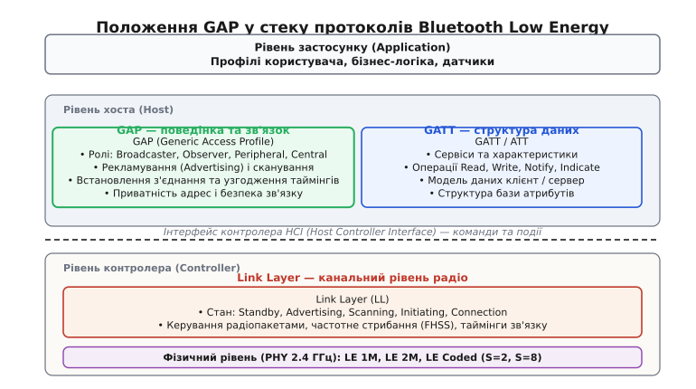
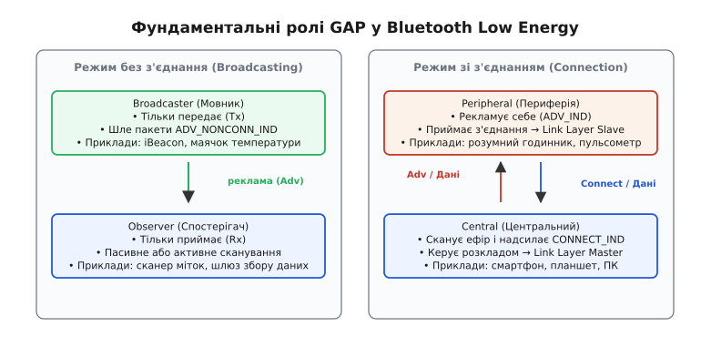
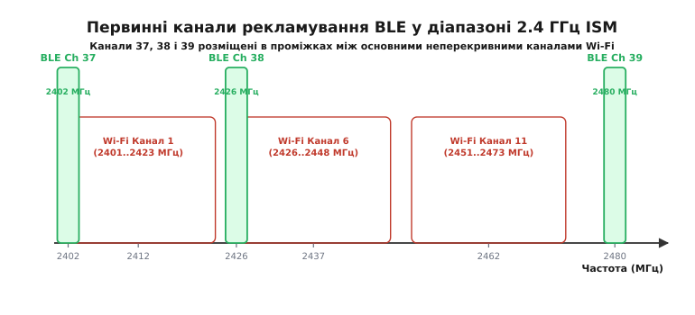
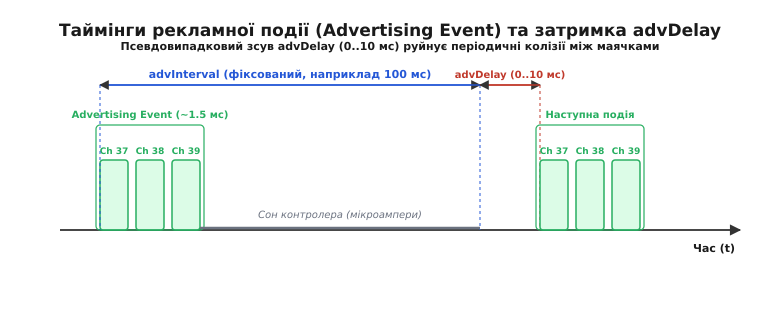
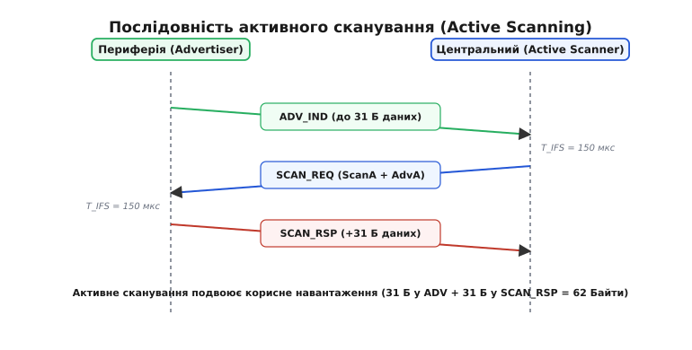
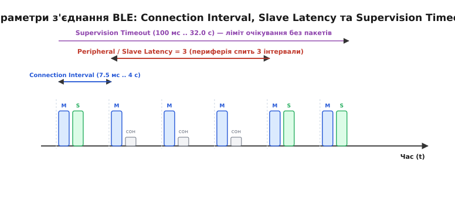
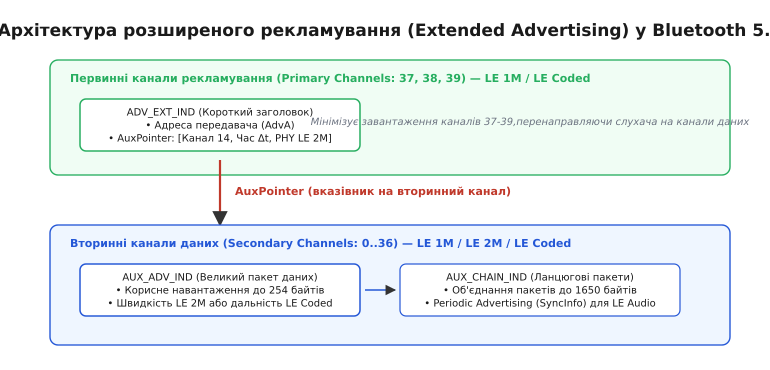

# BLE GAP: рекламування, ролі та встановлення зв'язку

<preknowlist>
- [BLE GATT](topic:communications/ble-gatt) — модель сервісів і характеристик для обміну структурованими даними.
- [Дизайн пакетів](topic:communications/packet-design) — канальні блоки PDU, заголовки, корисне навантаження та контроль цілісності CRC.
</preknowlist>

Коли два автономні бездротові вузли опиняються в радіусі дії радіозв'язку, вони не мають спільної тактової частоти, не знають розкладу сну сусіда і не можуть тримати радіотракт постійно увімкненим: типовий літієвий дисковий елемент CR2032 ємністю 220 мА·год при безперервному прийомі зі струмом 12 мА розрядиться менш ніж за 19 годин. Щоб пристрої знаходили один одного за частки секунди, передавали телеметрію без встановлення сесії або узгоджували захищений двосторонній зв'язок зі споживанням у кілька мікроамперів, протокол радіообміну повинен мати суворий механізм асинхронного сповіщення, стандартизовані ролі та математично узгоджені часові інтервали.

У стеку Bluetooth Low Energy (від давньоскандинавського *Blátǫnn* — епонім короля Гаральда, та англ. *Low Energy* — низька енергія) за цю координацію відповідає рівень **GAP** (англ. *Generic Access Profile*, «профіль загального доступу»). Він розташований у верхній частині рівня хоста (Host) і визначає базову поведінку радіоінтерфейсу: як вузол транслює свою присутність в ефірі, як сканує оточення, як забезпечує конфіденційність MAC-адрес, як ініціює з'єднання та які часові компроміси між швидкістю реакції й енергоспоживанням обирає для радіоканалу.


*Положення GAP у стеку BLE: профіль керує режимами виявлення, ролями пристроїв та параметрами зв'язку на рівні хоста, безпосередньо взаємодіючи з канальним рівнем Link Layer через інтерфейс HCI, тоді як структурою прикладних даних опікується GATT.*

GAP працює паралельно з профілем атрибутів [GATT](topic:communications/ble-gatt), але розв'язує кардинально іншу задачу. Якщо GATT відповідає за внутрішню структуру даних (сервіси, характеристики, дескриптори, операції читання та запису у пам'ять), то GAP контролює зовнішній світ радіоефіру: чи дозволено пристрою бути виявленим, хто має право підключитися, як часто випромінювати радіоімпульси та коли переводити радіотракт у режим глибокого сну.

---

### Фундаментальні ролі GAP: мовлення та топологія зв'язку

Архітектура GAP розділяє всі пристрої на чотири фундаментальні ролі, згруповані за двома парадигмами роботи: без встановлення з'єднання (широкомовний обмін) та зі встановленням двостороннього зв'язку (точкова топологія).


*Чотири ролі GAP: Broadcaster транслює дані без очікування відповіді для Observer; Peripheral рекламує можливість зв'язку, очікуючи на підключення від Central для двостороннього обміну.*

#### Режим без з'єднання (Broadcasting)

1. **Broadcaster (Мовник)** — вузол, який виключно випромінює рекламні пакети в ефір і ніколи не вмикає приймач для очікування відповіді. Радіомодуль прокидається на частку мілісекунди, надсилає порцію даних і негайно повертається в режим енергозбереження зі струмом менше 1 мкА. Мовник транслює непідключувані пакети `ADV_NONCONN_IND`. Цю роль використовують маячки присутності (iBeacon, Eddystone), автономні метеостанції та складські мітки.
2. **Observer (Спостерігач)** — вузол, який слухає рекламні канали та фіксує повідомлення від мовників, але сам ніколи не передає радіосигналів і не ініціює з'єднання. Спостерігачами зазвичай є мережеві шлюзи збору телеметрії, інформаційні табло або картографічні сканери.

#### Режим зі встановленням з'єднання (Connection-Oriented)

3. **Peripheral (Периферійний пристрій)** — вузол із суворими обмеженнями за живленням та обчислювальними ресурсами (розумний годинник, пульсометр, бездротовий датчик тиску). Периферія періодично випромінює підключувані рекламні пакети (`ADV_IND` або `ADV_DIRECT_IND`), заявляючи про доступні можливості, і очікує запиту на з'єднання. Після підключення периферійний пристрій переходить на канальному рівні (Link Layer) у стан **Slave** (ведений).
4. **Central (Центральний пристрій)** — вузол із достатнім запасом енергії та процесорної потужності (смартфон, планшет, комп'ютер, бортовий контролер). Central сканує ефір, знаходить потрібну периферію і надсилає команду ініціалізації з'єднання `CONNECT_IND`. У момент створення з'єднання центральний вузол стає **Master** (ведучим) канального рівня: саме він визначає сітку частотного стрибання та синхронізує розклад усіх сеансів зв'язку.

> 🔧 **Ортогональність ролей GAP та GATT.** Ролі GAP (хто рекламує, а хто підключається) ніяк не пов'язані з ролями GATT (хто зберігає дані як Server, а хто їх запитує як Client). Периферійний пристрій у 90% випадків виступає GATT-сервером (пульсометр віддає значення пульсу), проте смартфон у ролі Central може одночасно бути GATT-сервером точного часу (Current Time Service), з якого годинник-периферія зчитує час після підключення.

---

### Приватність та типи адрес пристроїв у GAP

Оскільки радіоефір є загальнодоступним середовищем, постійна трансляція фіксованої апаратної MAC-адреси дозволила б стороннім спостерігачам відстежувати фізичне переміщення користувача (наприклад, за сигналами розумного годинника чи навушників). Для вирішення цієї проблеми специфікація GAP визначає дворівневу систему адресації:

```
                              Типи адрес у BLE GAP
                                       │
            ┌──────────────────────────┴──────────────────────────┐
            ▼                                                     ▼
  Публічна адреса (Public)                      Випадкова адреса (Random)
  • Видається IEEE (24-бітний OUI)                                │
  • Фіксована на заводі                  ┌────────────────────────┴────────────────────────┐
                                         ▼                                                 ▼
                               Статична (Static Random)                          Приватна (Private)
                               • Старші біти: 11b                                          │
                               • Фіксується на цикл живлення             ┌─────────────────┴─────────────────┐
                                                                         ▼                                   ▼
                                                          Незворотна (Non-resolvable)         Зворотна (Resolvable Private)
                                                          • Старші біти: 00b                  • Старші біти: 01b
                                                          • Змінюється раз на 15 хв           • Шифрується ключем IRK (AES-128)
```

#### 1. Публічна адреса (Public Device Address)
Стандартна 48-бітна адреса, зареєстрована в комітеті IEEE. Перші 24 біти складають унікальний ідентифікатор виробника (OUI, *Organizationally Unique Identifier*), а останні 24 біти призначаються під час виробництва мікросхеми. Ця адреса ніколи не змінюється і є глобально унікальною, проте не забезпечує жодного захисту від відстеження.

#### 2. Статична випадкова адреса (Static Random Address)
Генерується мікроконтролером програмно під час першого запуску або під час кожного циклу подачі живлення. Два старші біти адреси обов'язково встановлюються в одиниці (`11b`), а решта 46 бітів заповнюються апаратним генератором випадкових чисел (TRNG). Адреса залишається незмінною протягом усього сеансу роботи пристрою. Це позбавляє виробника необхідності купувати платні діапазони адрес IEEE для недорогих пристроїв.

#### 3. Незворотна приватна адреса (Non-resolvable Private Address)
Адреса, у якій два старші біти дорівнюють нулю (`00b`), а решта 46 бітів регулярно оновлюються генератором випадкових чисел (типово кожні 15 хвилин). Вона використовується для тимчасових маячків, де потрібно унеможливити як відстеження, так і відновлення особи відправника будь-яким зовнішнім пристроєм.

#### 4. Зворотна приватна адреса (Resolvable Private Address, RPA)
Найдосконаліший механізм приватності GAP, що використовується в сучасних смартфонах та смарт-годинниках. Адреса формується з двох частин: 24-бітного випадкового числа `prand` (старші два біти дорівнюють `01b`) та 24-бітного криптографічного хешу `hash`:

```
RPA = prand (24 біти) | hash (24 біти)
де hash = ah(IRK, prand)
```

Функція `ah` обчислюється за допомогою блочного шифрування AES-128 з використанням секретного 128-бітного ключа розпізнавання особистості (**IRK**, *Identity Resolving Key*). Коли два пристрої спарюються, вони обмінюються ключами IRK через захищений канал. 

У подальшому, коли периферія змінює свою RPA кожні 15 хвилин, сторонній сканер бачить лише новий випадковий набір байтів і не може пов'язати його з попередніми пакетами. Проте спарений смартфон, знаючи збережений IRK, витягує `prand` з адреси, обчислює власний `ah(IRK, prand)` і порівнює його з отриманим `hash`. Якщо значення збігаються, смартфон миттєво ідентифікує свій годинник без загрози конфіденційності в ефірі.

---

### Механіка рекламування: первинні канали та захист від колізій

Увесь процес знаходження пристроїв у BLE базується на процедурі рекламування (англ. *advertising*). Замість сканування всього радіочастотного спектра стандарт виділяє три фіксовані смуги.

Діапазон 2.4 ГГц ISM (від англ. *Industrial, Scientific, Medical* — 2400.0..2483.5 МГц) у BLE розділений на 40 частотних каналів із кроком 2 МГц. Канали з 0 по 36 призначені виключно для передачі даних усередині встановленого з'єднання, тоді як канали **37 (2402 МГц)**, **38 (2426 МГц)** та **39 (2480 МГц)** виділені під первинне рекламування (*Primary Advertising Channels*).


*Розміщення первинних каналів рекламування BLE (37, 38, 39) у радіоспектрі 2.4 ГГц: частоти вибрані так, щоб потрапляти в захисні проміжки між основними неперекривними каналами Wi-Fi (1, 6, 11).*

Такий вибір частот первинних каналів обумовлений електромагнітною сумісністю. У діапазоні 2.4 ГГц найпотужнішим джерелом радіозавад є бездротові мережі Wi-Fi стандарту IEEE 802.11 b/g/n, кожен канал яких має смугу випромінювання шириною 20..22 МГц. Три стандартні неперекривні канали Wi-Fi мають центральні частоти 2412 МГц (канал 1), 2437 МГц (канал 6) та 2462 МГц (канал 11). Канал 37 BLE розташований нижче першого каналу Wi-Fi, канал 38 потрапляє в проміжок між 1-м і 6-м каналами, а канал 39 розміщений вище 11-го каналу. Навіть коли радіоефір повністю заблокований активним Wi-Fi трафіком, принаймні один із трьох каналів рекламування BLE залишається в зоні мінімальних завад.

#### Подія рекламування (Advertising Event) та затримка `advDelay`

Рекламування відбувається дискретними пачками — подіями рекламування (*Advertising Events*). Під час однієї події передавач вмикається і послідовно транслює однаковий рекламний пакет на каналі 37, потім на 38 і на 39. Повний цикл передачі на трьох частотах триває від 1.5 до 2.5 мс залежно від довжини пакета.


*Таймінги рекламної події: сума фіксованого інтервалу advInterval та псевдовипадкового зсуву advDelay (0..10 мс) гарантує усунення фазового синхронізму між кількома маячками в одній радіозоні.*

Період повторення подій рекламування складається з двох компонентів:

```
T_adv_event = advInterval + advDelay
```

1. **`advInterval`** — базовий інтервал, що налаштовується розробником із дискретністю 0.625 мс у діапазоні від 20 мс до 10 240 мс (10.24 с). Для непідключуваного мовлення мінімальний інтервал за стандартом обмежений значенням 100 мс для запобігання засміченню ефіру.
2. **`advDelay`** — обов'язкова апаратна псевдовипадкова добавка в діапазоні від 0 до 10 мс, що генерується контролером Link Layer для кожної нової події.

> 🔧 **Чому рандомізація `advDelay` критично важлива.** Уявімо два автономні маячки в одній кімнаті з фіксованим інтервалом передачі рівно 100 мс. Якщо в певний момент часу їхні пакети накладуться один на один і зіпсуються колізією, за відсутності `advDelay` вони продовжуватимуть стикатися через кожні 100 мс нескінченно довго. Додавання випадкової затримки 0..10 мс руйнує фазовий резонанс: наступна колізія станеться не раніше ніж через сотні циклів, забезпечуючи надійну доставку даних слухачам.

---

### Типи класичних рекламних пакетів (Legacy PDU)

На канальному рівні Link Layer заголовок кожного пакета первинного рекламування містить 4-бітне поле типу PDU (*Protocol Data Unit*). Стандарт визначає чотири базові типи класичних кадрів:

1. **`ADV_IND`** (*Connectable Undirected Advertising*) — універсальний підключуваний ненаправлений пакет. Пристрій заявляє про свою наявність усім навколишнім вузлам. Після передачі кадру передавач короткочасно перемикається в режим прийому на тому ж каналі, дозволяючи прийняти запит на додаткові дані (`SCAN_REQ`) від сканера або команду встановлення зв'язку (`CONNECT_IND`) від центрального вузла.
2. **`ADV_DIRECT_IND`** (*Connectable Directed Advertising*) — спрямований підключуваний пакет, призначений для швидкого відновлення зв'язку з конкретним хостом (наприклад, підключення бездротових навушників до раніше спарованого телефона). Пакет містить лише адресу відправника `AdvA` та цільову адресу ініціатора `InitA`, без прикладних даних. У режимі *High Duty Cycle* пакети транслюються кожні 3.75 мс протягом не більше 1.28 с, забезпечуючи підключення за лічені мілісекунди ціною підвищеного струму. У режимі *Low Duty Cycle* інтервал обирається довільно до 10.24 с.
3. **`ADV_NONCONN_IND`** (*Non-connectable Undirected Advertising*) — односпрямований непідключуваний пакет. Приймач після відправки не вмикається. Вузол ігнорує будь-які зовнішні сигнали. Це стандартний режим для автономних телеметричних маячків.
4. **`ADV_SCAN_IND`** (*Scannable Undirected Advertising*) — сканований пакет, який дозволяє запитувати додаткову інформацію через механізм `SCAN_REQ` / `SCAN_RSP`, але забороняє встановлення зв'язку через `CONNECT_IND`. Застосовується для інформаційних терміналів, де обсяг переданих даних перевищує місткість одного кадру, проте ресурсів мікроконтролера недостатньо для обслуговування з'єднань.

Повну двійкову розмітку полів заголовка Link Layer, бітів адресації `TxAdd`/`RxAdd` та шістнадцяткових кодів PDU винесено в довідник [Структури Advertising Data (AD Data) та PDU пакетів BLE GAP](topic:communications/ble-gap/api-ad-structures.md).

---

### Структура корисного навантаження: контейнери AD Data

Класичний рекламний пакет має жорстке апаратне обмеження: корисне навантаження `AdvData` не може перевищувати **31 байт** (без урахування 6 байтів MAC-адреси відправника). Усі дані всередині цього масиву упаковуються у форматі **TLV** (англ. *Type-Length-Value* — «довжина, тип, значення»):

```
+---------------+---------------+---------------------------------------+
| Довжина       | Тип структури | Корисні дані                          |
| (Length, 1 Б) | (AD Type, 1 Б)| (AD Data, Length - 1 байтів)          |
+---------------+---------------+---------------------------------------+
```

Байт `Length` вказує загальну кількість байтів, що слідують за цим полем у межах поточного блоку. Оскільки першим після довжини завжди йде 1 байт `AD Type`, розмір корисних даних складає `Length - 1`. Якщо довжина дорівнює нулю (`0x00`), це означає кінець корисного навантаження та початок невикористаного залишку буфера (Zero Padding).

#### Ключові типи структур AD Type

- **`0x01` — Flags (Прапорці режиму):** обов'язковий блок для підключуваних пристроїв. Містить бітову маску:
  - Біт 0 (`0x01`): *LE Limited Discoverable Mode* — обмежений режим виявлення (пристрій рекламується тимчасово, зазвичай до 30 секунд після натискання кнопки);
  - Біт 1 (`0x02`): *LE General Discoverable Mode* — постійний загальний режим виявлення;
  - Біт 2 (`0x04`): *BR/EDR Not Supported* — пристрій працює виключно в режимі BLE і не підтримує класичний Bluetooth Classic (наявність цього біта обов'язкова для монорежимних контролерів).
- **`0x08` та `0x09` — Local Name (Ім'я пристрою):** текстовий рядок в кодуванні UTF-8. Тип `0x08` позначає скорочену назву (*Shortened Local Name*), якщо повне ім'я не вміщується у 31 байт, а `0x09` — повне ім'я (*Complete Local Name*).
- **`0x02`..`0x07` — Service UUIDs (Ідентифікатори сервісів):** перелік підтримуваних GATT-сервісів для фільтрації сканерами без встановлення зв'язку. Бувають неповними (*Incomplete*) або повними (*Complete*) для 16-бітних, 32-бітних та 128-бітних UUID. Байти UUID завжди записуються у форматі **Little-Endian** (молодшим байтом уперед).
- **`0xFF` — Manufacturer Specific Data (Дані виробника):** універсальний контейнер для кастомної телеметрії. Перші 2 байти займає унікальний ідентифікатор компанії (*Company Identifier*, наприклад `0x004C` для Apple, `0x0006` для Microsoft, `0x02E5` для Espressif Systems), після якого слідує довільний байтовий масив сенсорних даних.
- **`0x0A` — Tx Power Level:** рівень потужності випромінювання передавача у дБм (1 байт зі знаком `int8_t`), що використовується сканерами разом із виміряним RSSI для розрахунку фізичної відстані до маячка.
- **`0x16` — Service Data (16-bit UUID):** дозволяє передавати дані, прив'язані до конкретного стандартного сервісу (наприклад, показники температури для сервісу Environmental Sensing `0x181A`) безпосередньо в рекламі.

Повний алгоритм потокового розбору структур TLV, правила санітизації рядків UTF-8 та техніку захисту від виходу за межі пам'яті на мікроконтролерах ARM Cortex-M реалізовано у вставці [Розбір рекламних пакетів та налаштування GAP у коді](topic:communications/ble-gap/proj-adv-parser.md).

---

### Сканування: пасивний прийом та активний запит (Active Scanning)

Сканування — це процедура прослуховування первинних рекламних каналів пристроями в ролях Central або Observer. Стандарт визначає два фундаментальні режими сканування:

1. **Пасивне сканування (Passive Scanning)** — радіоприймач вузла по черзі налаштовується на канали 37, 38, 39 і фіксує всі прийняті пакети. Приймач ніколи не перемикається в режим передавача. Цей метод забезпечує повну невидимість сканера в радіоефірі та зберігає заряд батареї.
2. **Активне сканування (Active Scanning)** — двокроковий протокол, що дозволяє подвоїти обсяг отриманих даних без встановлення зв'язку.


*Діаграма послідовності активного сканування: прийом ADV_IND ініціює відправку SCAN_REQ через паузу T_IFS (150 мкс), у відповідь на що периферія повертає додаткові 31 байт даних у пакеті SCAN_RSP.*

Механіка активного сканування розгортається наступним чином:
1. Сканер приймає пакет `ADV_IND` або `ADV_SCAN_IND` від периферії на одному з первинних каналів.
2. Контролер сканера чекає міжкадровий інтервал **`T_IFS`** (англ. *Inter-Frame Space* = **150 мкс**) і на тому ж самому частотному каналі надсилає короткий запит **`SCAN_REQ`** (12 байтів: 6 байтів MAC-адреси сканера `ScanA` + 6 байтів адреси периферії `AdvA`).
3. Периферійний пристрій, отримавши `SCAN_REQ` зі своєю адресою, через наступні 150 мкс надсилає відповідь **`SCAN_RSP`** (*Scan Response*).
4. Пакет `SCAN_RSP` містить ще до 31 байта структур `AdvData`.

Таким чином, активне сканування дозволяє видобути сумарно **62 байти** корисної інформації (31 байт у `ADV_IND` + 31 байт у `SCAN_RSP`) — наприклад, розмістити в первинному пакеті скорочені прапорці та 128-бітний UUID сервісу, а у відповіді сканування передати повне текстове ім'я пристрою та розширені дані виробника.

#### Параметри розкладу сканування

Слухач не може приймати всі три канали одночасно без трьох незалежних радіотрактів. Тому контролер перемикає один радіоприймач між каналами 37, 38 і 39 за заданим розкладом:

```
+------------------------------------+------------------------------------+
|  Scan Window (Канал 37) |   Сон    |  Scan Window (Канал 38) |   Сон    |
+------------------------------------+------------------------------------+
|<------------ Scan Interval ------->|<------------ Scan Interval ------->|
```

- **`Scan Interval`** — період перемикання між радіоканалами (від 2.5 мс до 10.24 с, крок 0.625 мс).
- **`Scan Window`** — тривалість активного прослуховування одного каналу протягом кожного інтервалу (`Scan Window` ≤ `Scan Interval`).

Коефіцієнт робочого навантаження сканера визначається як:

```
Duty_Cycle = Scan_Window / Scan_Interval
```

Якщо `Scan Window` дорівнює `Scan Interval` (*Duty Cycle = 100%*), приймач працює безперервно, миттєво перемикаючись між частотами (37 → 38 → 39). Це гарантує максимальну швидкість виявлення пакетів, проте викликає постійне споживання струму 8..15 мА, що неприпустимо для батарейних вузлів. Для енергоефективних автономних сканерів `Scan Window` встановлюють на рівні 10..20% від `Scan Interval` (наприклад, вікно 20 мс при інтервалі 200 мс).

---

### Встановлення з'єднання та параметри зв'язку

Коли центральний вузол (Central) у режимі ініціатора (*Initiator*) вирішує підключитися до периферії, він ловить підключуваний пакет (`ADV_IND` або `ADV_DIRECT_IND`) і рівно через паузу `T_IFS` (150 мкс) надсилає пакет **`CONNECT_IND`**.

Пакет `CONNECT_IND` не потребує підтвердження. Він містить критичні дані для конфігурації фізичного та канального рівнів:
- **Access Address** — нове псевдовипадкове 32-бітне число, що ідентифікуватиме всі пакети всередині цієї сесії на каналах даних 0..36 (на відміну від константи `0x8E89BED6` первинних каналів);
- **CRC Init** — 24-бітне початкове значення контрольної суми;
- **Channel Map** — 37-бітна маска дозволених каналів даних (виключає канали з сильними завадами);
- **Hop Increment** — крок стрибання частоти для алгоритму псевдовипадкового перемикання каналів (*Frequency Hopping*);
- **Таймінги з'єднання** — три фундаментальні параметри зв'язку.


*Параметри з'єднання BLE: Connection Interval задає періодичність зустрічей ведучого та веденого; Peripheral / Slave Latency дозволяє периферії спати кілька інтервалів за відсутності даних; Supervision Timeout фіксує розрив сесії при втраті пакетів.*

#### Тріада параметрів з'єднання

Після отримання `CONNECT_IND` обидва пристрої переходять у стан з'єднання (*Connection State*). Зв'язок відбувається дискретними подіями з'єднання (*Connection Events*). Під час кожної події Master надсилає пакет, а Slave зобов'язаний відповісти.

1. **Connection Interval (Інтервал з'єднання):**
   - Час між початком двох послідовних подій з'єднання.
   - Діапазон: від **7.5 мс** до **4000 мс** (4.0 с) з дискретністю 1.25 мс.
   - Малий інтервал (7.5–20 мс) забезпечує високу пропускну здатність (до 1.4 Мбіт/с у режимі 2M PHY) та мінімальну затримку реакції (наприклад, для бездротової миші чи геймпада), але збільшує споживання енергії. Великий інтервал (500–2000 мс) мінімізує енергоспоживання для датчиків телеметрії.

2. **Peripheral Latency / Slave Latency (Затримка периферії):**
   - Кількість послідовних подій з'єднання, які периферійний пристрій має право пропустити (не прокидатися і не відповідати на опитування Master), якщо у нього немає нових даних для передачі.
   - Діапазон: від **0** до **499** подій.
   - Якщо `Slave Latency = 0`, периферія зобов'язана прокидатися на кожну подію. Якщо `Connection Interval = 20 мс`, а `Slave Latency = 49`, периферія може прокидатися раз на `20 мс × (1 + 49) = 1000 мс` (1 секунду), споживаючи мікроампери. Проте, щойно в периферії з'являються свіжі дані (наприклад, користувач натиснув кнопку), вона надсилає пакет на найближчій події з'єднання без очікування, миттєво повертаючись до відгуку 20 мс.

3. **Supervision Timeout (Таймаут нагляду):**
   - Максимальний інтервал часу від моменту останнього успішно прийнятого валідного кадру до моменту, коли контролер констатує аварійний розрив зв'язку (*Link Loss*).
   - Діапазон: від **100 мс** до **32 000 мс** (32.0 с) з кроком 10 мс.

#### Математичне обмеження узгодженості параметрів

Параметри не можуть обиратися довільно. Стандарт Bluetooth вимагає суворого дотримання нерівності:

```
Supervision_Timeout > (1 + Peripheral_Latency) × 2 × Connection_Interval
```

Множник 2 враховує, що навіть за максимального використання дозволеного пропуску подій (`Peripheral_Latency`) протокол повинен надати периферії принаймні дві спроби зв'язку для відновлення синхронізації у разі випадкової втрати пакета через перешкоди перед тим, як лінія буде визнана розірваною. Якщо ця умова порушується, випадковий пропуск одного інтервалу призведе до помилкового розриву з'єднання таймером нагляду.

#### Процедура оновлення параметрів (Connection Parameter Update)

Оскільки розклад зв'язку формується виключно ведучим (Master / Central), периферія не може самостійно змінити `Connection Interval` чи `Slave Latency`. Якщо периферія потребує зміни режиму (наприклад, перехід від передачі прошивки з інтервалом 15 мс до фонового моніторингу з інтервалом 1000 мс), вона ініціює процедуру оновлення:
- На рівні L2CAP надсилається кадр `L2CAP_CONN_PARAM_UPD_REQ` із бажаними діапазонами `[Min_Interval, Max_Interval, Latency, Timeout]`.
- Центральний вузол оцінює власні ресурси (наявність інших активних підключень, роботу Wi-Fi модуля) і або приймає запит, або відхиляє його.
- При згоді Master надсилає команду канального рівня `LL_CONNECTION_UPDATE_IND`, яка задає точний номер майбутньої події з'єднання (*Instant*), починаючи з якої обидва вузли синхронно переходять на нову часову сітку.

#### Завершення з'єднання та коди розриву (HCI Disconnection Reasons)

З'єднання може бути розірване як штатно за ініціативою однієї зі сторін, так і аварійно внаслідок збою радіоканалу. Для цього хост відправляє команду канального рівня `LL_TERMINATE_IND`. Після розриву контролер надсилає хосту подію `HCI_Disconnection_Complete_Event` зі стандартизованим кодом причини:
- **`0x13` (Remote User Terminated Connection):** штатне відключення користувачем (наприклад, вимкнення Bluetooth у меню смартфона або вихід із застосунку);
- **`0x16` (Connection Terminated by Local Host):** локальний мікроконтролер сам ініціював закриття сесії;
- **`0x08` (Connection Timeout / Link Supervision Timeout Expired):** фізичний розрив зв'язку — пристрій віддалився на велику відстань або батарея раптово розрядилася;
- **`0x3D` (MIC Failure):** помилка контролю цілісності шифрованого пакета Message Integrity Check — свідчить про спробу атаки підміни пакетів в ефірі;
- **`0x28` (Instant Passed):** фатальна помилка синхронізації оновлення параметрів каналу через перешкоди.

Нижче наведено алгоритм математичної валідації та розрахунку параметрів зв'язку для прошивки мікроконтролера:

:::tabs
```c
#include <stdint.h>
#include <stdbool.h>

typedef struct {
    uint16_t interval_min;    /* Крок 1.25 мс (наприклад, 6 = 7.5 мс, 800 = 1000 мс) */
    uint16_t interval_max;    /* Крок 1.25 мс */
    uint16_t latency;         /* Кількість подій (0 .. 499) */
    uint16_t timeout;         /* Крок 10 мс (наприклад, 100 = 1000 мс, 600 = 6000 мс) */
} ble_gap_conn_params_t;

/* Перевірка валідності параметрів згідно зі специфікацією Bluetooth Core v5.x */
bool ble_gap_validate_conn_params(const ble_gap_conn_params_t *p) {
    if (!p) return false;

    /* Межі інтервалу: від 7.5 мс (0x0006) до 4000 мс (0x0C80) */
    if (p->interval_min < 6 || p->interval_min > 3200) return false;
    if (p->interval_max < p->interval_min || p->interval_max > 3200) return false;

    /* Межі затримки Slave Latency */
    if (p->latency > 499) return false;

    /* Межі таймауту нагляду: від 100 мс (0x000A) до 32000 мс (0x0C80) */
    if (p->timeout < 10 || p->timeout > 3200) return false;

    /* Математична перевірка узгодженості:
       Timeout (мс) > (1 + Latency) * 2 * Max_Interval (мс)
       Враховуємо одиниці: Timeout * 10 мс > (1 + Latency) * 2 * (Max_Interval * 1.25 мс)
       Спрощення: Timeout * 10 > (1 + Latency) * 2.5 * Max_Interval
       У цілих числах: Timeout * 20 > (1 + Latency) * 5 * Max_Interval -> Timeout * 4 > (1 + Latency) * Max_Interval */
    uint32_t max_effective_interval_units = (uint32_t)(1 + p->latency) * p->interval_max;
    uint32_t timeout_scaled = (uint32_t)p->timeout * 4;

    return (timeout_scaled > max_effective_interval_units);
}
```
```cpp
#include <cstdint>
#include <optional>

struct GapConnParams {
    uint16_t interval_min{24};  // 30.0 мс (24 * 1.25)
    uint16_t interval_max{40};  // 50.0 мс (40 * 1.25)
    uint16_t latency{4};        // Пропуск 4 подій
    uint16_t timeout{300};      // 3000 мс (300 * 10)

    [[nodiscard]] constexpr bool is_valid() const noexcept {
        if (interval_min < 6 || interval_min > 3200) return false;
        if (interval_max < interval_min || interval_max > 3200) return false;
        if (latency > 499) return false;
        if (timeout < 10 || timeout > 3200) return false;

        // Supervision_Timeout * 10 мс > (1 + Latency) * 2 * (Interval_Max * 1.25 мс)
        // Timeout * 4 > (1 + Latency) * Interval_Max
        const auto effective_units = static_cast<uint32_t>(1 + latency) * interval_max;
        const auto timeout_scaled  = static_cast<uint32_t>(timeout) * 4;

        return timeout_scaled > effective_units;
    }

    [[nodiscard]] constexpr double effective_max_latency_ms() const noexcept {
        return (1 + latency) * (interval_max * 1.25);
    }
};
```
:::

---

### Extended Advertising у Bluetooth 5.0

Класичне рекламування BLE 4.x мало дві критичні проблеми: ліміт 31 байт був надто малим для сучасних криптографічних ключів чи URL-посилань, а постійний ріст кількості пристроїв призвів до зашумлення каналів 37, 38 і 39. Специфікація Bluetooth 5.0 вирішила цю проблему впровадженням механізму розширеного рекламування (**Extended Advertising**).


*Архітектура Extended Advertising: компактний заголовок ADV_EXT_IND на первинних каналах вказує через AuxPointer на вторинний канал даних, де транслюється пакет AUX_ADV_IND розміром до 254 байтів.*

#### Дворівнева структура мовлення

Замість передачі важких даних на первинних каналах, Extended Advertising розділяє процес на два етапи:
1. **Первинний канал (37, 38, 39):** передається виключно мінімальний службовий пакет **`ADV_EXT_IND`**. Він містить MAC-адресу мовника та спеціальне поле покажчика **`AuxPointer`**.
2. `AuxPointer` вказує:
   - номер вторинного каналу даних (будь-який із діапазону 0..36);
   - точне часове зміщення (*Offset*, від 30 мкс до кількох мілісекунд), через яке відбудеться передача;
   - тип фізичного модулятора (LE 1M, LE 2M для подвоєння швидкості або далекобійний LE Coded).
3. **Вторинний канал (0..36):** сканер перемикає частоту за вказівником і приймає пакет **`AUX_ADV_IND`**, розмір корисного навантаження якого збільшено з 31 до **254 байтів**.

#### Ланцюгові пакети (Chained Packets) та Periodic Advertising

Якщо обсяг даних перевищує 254 байти, Bluetooth 5.0 дозволяє зв'язувати пакети в ланцюжки за допомогою кадрів **`AUX_CHAIN_IND`**. Кожен наступний пакет містить покажчик на наступний вторинний канал і часове зміщення, що дозволяє передавати єдині широкомовні повідомлення розміром до **1650 байтів**.

Додатково впроваджено режим періодичного рекламування (**Periodic Advertising**):
- Мовник транслює розширений пакет, що містить блок `SyncInfo`.
- `SyncInfo` описує суворий детермінований розклад передачі майбутніх пакетів `AUX_SYNC_IND` на каналах даних без випадкової затримки `advDelay`.
- Сканер синхронізується з розкладом один раз і надалі прокидається строго в моменти передачі даних.
- Саме на Periodic Advertising базується технологія **Auracast** та передача багатоканального синхронного аудіопотоку стандарту **LE Audio**.

---

### Практичний розрахунок енергоспоживання GAP

Профіль GAP безпосередньо формує профіль споживання струму мікроконтролером. Розглянемо розрахунок середнього струму автономного маячка з елементом живлення CR2032 (220 мА·год, 3.0 В).

#### Вихідні дані:
- Струм мікроконтролера в режимі сну (*Deep Sleep* з увімкненим RTC): `I_sleep = 2.0 мкА` = `0.002 мА`;
- Струм радіотракту під час передачі (+0 дБм): `I_tx = 7.5 мА`;
- Тривалість рекламної події на 3 каналах: `t_event = 2.5 мс` = `0.0025 с`;
- Базовий інтервал рекламування: `advInterval = 1000 мс` (1 секунда). Середня тривалість із урахуванням `advDelay` становить `T = 1.005 с`.

Покроковий розрахунок середнього струму:

```
Q_event = I_tx · t_event
= 7.5 мА · 0.0025 с      [заряд на одну подію передачі]
= 0.01875 мА·с

I_adv_avg = Q_event / T
= 0.01875 мА·с / 1.005 с [середній струм рекламування]
≈ 0.01866 мА = 18.66 мкА

I_total = I_adv_avg + I_sleep
= 18.66 мкА + 2.0 мкА    [сумарний середній струм системи]
= 20.66 мкА = 0.02066 мА

Час автономної роботи:
T_life = Емність / I_total
= 220 мА·год / 0.02066 мА [теоретичний ресурс батареї]
≈ 10 648 годин ≈ 443 дні ≈ 1.21 року
```

Якщо збільшити `advInterval` до 2000 мс, середній струм впаде до 11.3 мкА, а термін життя зросте до 2.2 років. Навпаки, вибір `advInterval = 100 мс` (для швидкого виявлення) підніме середній струм до 188 мкА, розрядивши батарейку за 48 днів.

> 🔧 **Навіщо це.** Конфігурація GAP — це завжди інженерний вибір між швидкістю виявлення, пропускною здатністю каналу та енергонезалежністю. Для носимих пульсометрів оптимальним є адаптивний GAP: інтервал рекламування 50 мс протягом перших 30 секунд після увімкнення (швидке спарювання зі смартфоном) із наступним переходом на 500 мс у разі відсутності зв'язку. Після підключення слід узгоджувати `Connection Interval = 50 мс` разом із `Slave Latency = 19`, що дозволить сенсору надсилати дані раз на секунду при струмі менше 15 мкА, зберігаючи здатність миттєво передати тривожний сигнал аритмії за 50 мс.
