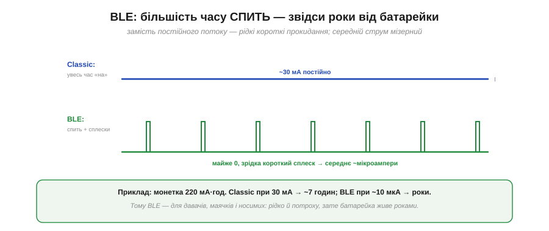
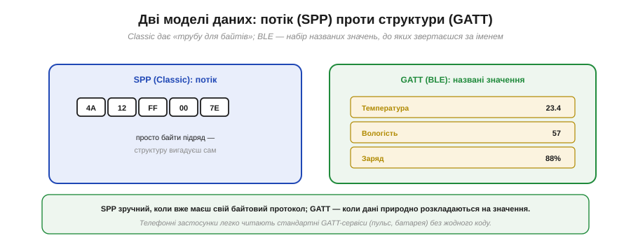
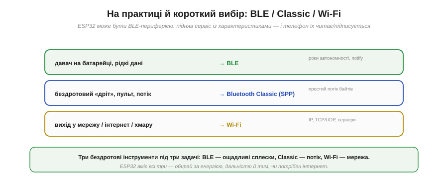

# BLE: реклама, характеристики, GATT

**BLE** (*Bluetooth Low Energy*) — не «полегшений Classic», а зовсім інший звір, побудований навколо однієї нав'язливої ідеї: **жити роками від крихітної батарейки**. Заради цього в ньому інакше геть усе — і як пристрої знаходять одне одного, і як організовані дані. Якщо Classic — це «бездротовий дріт» із потоком байтів, то BLE — це «бездротова дошка оголошень» із названими значеннями. Розібратися в його моделі важливо, бо саме на BLE працює переважна більшість сучасних давачів, маячків і носимих гаджетів, а ESP32 легко стає таким пристроєм.

### Філософія BLE: спить, прокидається на мить

Уся суть BLE — у режимі роботи радіо. Замість тримати з'єднання ввімкненим (як Classic), BLE-пристрій **більшість часу спить**, прокидаючись лише на коротку мить, щоб надіслати чи прийняти крихітну порцію даних.


*Рис. Classic тримає радіо ввімкненим увесь час (~десятки міліампер постійно). BLE натомість майже весь час спить біля нуля, зрідка даючи короткий сплеск струму на прокидання. Через це **середній** струм мізерний — мікроампери, — і батарейка живе роками.*

**Приклад (наскільки довше живе батарейка).** Порівняймо від однієї монетної батарейки на 220 мА·год:

```
Classic, ~30 мА постійно : 220 мА·год / 30 мА ≈ 7 годин
BLE, середній ~10 мкА     : 220 мА·год / 0.01 мА ≈ 22 000 годин ≈ 2.5 року
```

Різниця в тисячі разів — ось чому BLE й вигадали. Той самий копійчаний елемент живить пульсометр чи давач **роками** замість годин. Але така ощадливість можлива лише тому, що BLE **відмовився** від постійного потоку на користь рідких коротких обмінів — а це вимагає й іншого способу знаходити пристрої, і іншої моделі даних.

### Реклама: сповіщати без з'єднання

Перша несподіванка BLE: пристрої вміють обмінюватися даними **взагалі без з'єднання**. Периферія час від часу **рекламує** себе — шле короткі пакети-сповіщення (*advertising*), а той, хто слухає, їх ловить.


*Рис. BLE-периферія (давач) періодично шле короткі пакети-сповіщення «я тут, ось моє ім'я/дані», а центральний (телефон) сканує ефір і їх чує. Так працюють **маячки** (beacons): вони мовлять дані широкомовно, ні до кого не під'єднуючись. А коли треба двосторонній обмін — центральний за рекламою знаходить периферію й під'єднується.*

Це дає два режими. **Без з'єднання** (маячки): пристрій просто розкидає свої дані в ефір, і будь-хто поруч може їх прочитати — ідеально для «я тут» чи «температура така-то», коли відповідь не потрібна. **Зі з'єднанням**: центральний, почувши рекламу, під'єднується до периферії для повноцінного двостороннього обміну. Реклама — це і спосіб бути знайденим, і водночас найдешевший спосіб щось повідомити.

### Дві ролі: периферія і центральний

У BLE чіткі ролі, які варто не плутати з master/slave: **периферія** (*peripheral*) і **центральний** (*central*).


*Рис. **Периферія** рекламує себе й тримає дані (вона — сервер); зазвичай це давач чи гаджет. **Центральний** сканує, під'єднується й читає/пише дані (він — клієнт); зазвичай це телефон чи ПК. ESP32 може бути будь-ким: периферією-давачем або центральним-збирачем.*

Зверніть увагу: на відміну від Classic із його потоком, тут стосунки — це **сервер даних** (периферія) і **клієнт** (центральний). Периферія не «ллє потік», а **зберігає** набір значень, які центральний може запитати. А як саме ці значення організовані — найважливіша частина BLE, його модель **GATT**.

### GATT: дані як дерево сервісів і характеристик

**GATT** (*Generic Attribute Profile*) — це спосіб, у який BLE-периферія розкладає свої дані. Замість безликого потоку байтів дані організовані в **дерево** іменованих значень.


*Рис. Сервер (периферія) містить **сервіси** — групи пов'язаних даних (наприклад, «Оточення»), у кожного свій UUID. Усередині сервісу — **характеристики**: окремі значення (Температура, Вологість, Поріг), кожна теж із UUID, поточним значенням і **властивостями** (читати / писати / сповіщати).*

Розберімо ієрархію. **Сервіс** (*service*) — це група пов'язаних даних: «Сервіс пульсу», «Сервіс батареї», «Сервіс оточення». **Характеристика** (*characteristic*) — конкретне значення всередині сервісу: власне пульс, відсоток заряду, температура. Кожна характеристика має **UUID** (унікальний ідентифікатор, за яким до неї звертаються), поточне **значення** і набір **властивостей** — що з нею можна робити. Тобто центральний не «читає потік», а звертається до **конкретної** характеристики за її UUID — як до названої комірки.

### Три операції: read, write, notify

Що ж можна робити з характеристикою? Три речі — і третя з них і є головний секрет ощадливості BLE.


*Рис. **READ** — центральний тягне значення, коли захоче. **WRITE** — центральний штовхає значення (наприклад, поріг чи команду). **NOTIFY** — периферія **сама** штовхає нове значення, щойно воно змінилось, без запиту. Notify економить енергію.*

**Read** і **write** очевидні: центральний читає характеристику або записує в неї. А ось **notify** — це справжній рятівник батарейки. Замість того щоб центральний **постійно опитував** периферію («а зараз? а зараз?» — тримаючи радіо ввімкненим), він один раз **підписується** на характеристику, і далі периферія **сама** надсилає нове значення лише тоді, коли воно змінилось. Радіо прокидається тільки за новиною. Саме так працює пульсометр: телефон підписався на характеристику пульсу — і отримує оновлення, поки давач більшість часу спить.

> 🔧 **Навіщо це.** Запам'ятай **notify** як ключ до енергоефективного BLE. Якщо твій пристрій має періодично віддавати дані (давач, лічильник), **не змушуй** центральний опитувати його — натомість зроби характеристику з властивістю notify, і хай периферія штовхає оновлення сама. Опитування (постійний read) тримало б радіо ввімкненим і вбило б усю перевагу BLE; notify дозволяє йому спати між подіями. Це різниця між «батарейка на тиждень» і «батарейка на роки».

### Потік (SPP) проти структури (GATT)

Варто чітко відчути різницю між двома моделями Bluetooth.


*Рис. **SPP (Classic)** — це «труба для байтів»: просто потік 4A 12 FF…, а структуру (де що) вигадуєш сам. **GATT (BLE)** — набір **названих** значень: Температура = 23.4, Вологість = 57, Заряд = 88%, до кожного звертаєшся за іменем (UUID).*

Це дві різні філософії. **SPP** зручний, коли в тебе вже є [власний байтовий протокол](book:communications/packet-design) — ти просто переносиш його в радіо. **GATT** зручний, коли дані природно розкладаються на окремі значення — тоді не треба вигадувати формат, а ще краще: телефонні застосунки **вже вміють** читати стандартні GATT-сервіси (пульс, батарея, оточення) без жодного рядка коду з твого боку. Структура коштує трохи більше зусиль при налаштуванні, але дає сумісність зі світом готових застосунків.

### На практиці й короткий вибір

Зведімо все докупи — і заразом окреслимо вибір між трьома бездротовими інструментами ESP32.


*Рис. **Давач на батарейці з рідкими даними → BLE** (роки автономності, notify). **Бездротовий «дріт», пульт, потік → Bluetooth Classic / SPP** (простий потік байтів). **Вихід у мережу, інтернет, хмару → Wi-Fi** (IP, TCP/UDP, сервери). ESP32 вміє всі три.*

На практиці зробити ESP32 BLE-периферією нескладно: піднімаєш **сервіс** із кількома **характеристиками**, задаєш їм значення й властивості (read/notify) — і телефон уже може їх читати чи підписатися. А короткий підсумок вибору такий:

- **BLE** — коли пристрій має жити довго від маленької батарейки й віддавати дані **рідко й потроху** (давачі, маячки, носимі).
- [**Bluetooth Classic (SPP)**](book:communications/bluetooth-spp) — коли треба простий **потік** між двома пристроями поряд, а енергія не критична (пульт, бездротовий «дріт», налагодження).
- [**Wi-Fi**](book:communications/wifi) — коли потрібен вихід у **мережу** чи інтернет (хмара, веб, віддалене керування).

> 🔧 **Навіщо це.** Це фінальна карта бездротового вибору. Питай себе по черзі: чи потрібен **інтернет**? — тоді Wi-Fi. Чи потрібна **довга автономність** і дані йдуть рідко? — тоді BLE. Чи треба просто **замінити дріт** потоком між двома пристроями? — тоді Classic/SPP. ESP32 уміє всі три, тож обмеження — не залізо, а правильний добір під енергію, дальність і потребу в мережі. Сплутати їх — типова помилка: робити давач-«довгожитель» на Wi-Fi (з'їсть батарею за дні) або тягти потік відео по BLE (він на це не розрахований).

Три бездротові технології — Wi-Fi, Bluetooth Classic і BLE — попри всі відмінності мають одну спільну рису: **радіо ненадійне**. Зручні обгортки ховають це, але не скасовують — зв'язок може ослабнути, перерватися, зникнути зовсім. Тому за вибором технології завжди стоїть практичніше й важливіше питання: **як спроєктувати обмін так, щоб пристрій лишався безпечним і передбачуваним, коли зв'язок таки зникне?** Це вже царина [надійного обміну й failsafe](book:communications/reliable-link).

---
