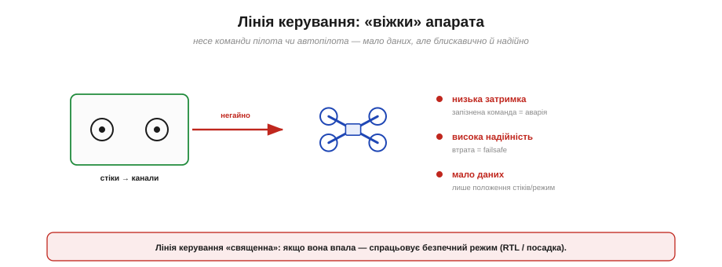
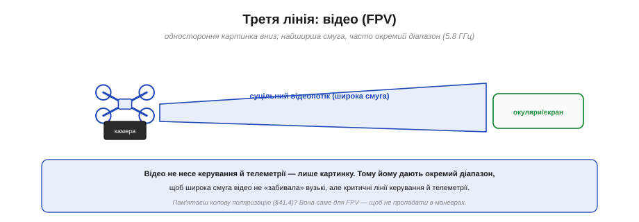
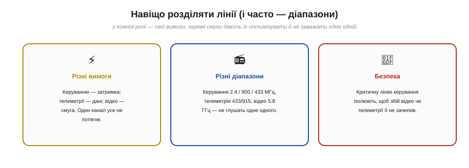

# Канали керування й телеметрії (дві ролі)

Почнімо з картини цілого. Коли кажуть «дрон на радіокеруванні», легко уявити **одну** радіолінію — мовляв, пульт зв'язується з апаратом, і все. Насправді в реальній системі працює **кілька** радіоліній з **різними ролями**, і плутати їх — типова помилка новачка. Розкласти ці ролі по поличках — найкращий спосіб зрозуміти весь радіозв'язок системи.

### Дві (а часто три) радіолінії

Подивімося на повну картину радіозв'язку типового апарата.

*Рис. Угору йде **керування** — команди пілота чи автопілота (потребує низької затримки). Униз — **телеметрія**: стан апарата (висота, GPS, батарея), плюс налаштування йдуть угору. Часто є й третя лінія — **відео** (FPV) для картинки з камери. Кожна лінія має свої вимоги, тому їх зазвичай розділяють.*

Ролей, по суті, дві головні (плюс одна допоміжна). **Керування** (*control*) — команди йдуть **угору**, від пілота до апарата: куди летіти, який режим. **Телеметрія** (*telemetry*) — дані йдуть переважно **вниз**, від апарата до землі: висота, координати, заряд, попередження (а налаштування й команди — угору). І часто є третя — **відео** (FPV): картинка з бортової камери вниз. Кожна з цих ліній — наче окрема розмова з власними правилами, і саме тому їх зазвичай **розділяють**. Особлива з-поміж них — лінія **телеметрії**, бо саме нею «розмовляє» MAVLink; розберімо всі три, щоб не плутати їхні ролі.

### Лінія керування: «віжки» апарата

Перша роль — **керування**. Це найкритичніша лінія, бо від неї залежить, чи слухається апарат узагалі.

*Рис. Лінія керування несе команди — положення стіків пульта (розкладені на «канали») чи команди автопілота. Вимоги: **низька затримка** (запізнена команда = аварія), **висока надійність** (втрата = безпечний режим), **мало даних** (лише положення стіків і режим). Якщо ця лінія падає — спрацьовує failsafe.*

Думай про лінію керування як про **віжки**. Вона несе **мало** даних — по суті, лише положення стіків пульта (розкладені на окремі **канали**: газ, крен, тангаж, нишпорення, перемикачі режимів) або команди автопілота. Але ці крихти даних мусять долітати **блискавично** й **безвідмовно**: запізнена на півсекунди команда «вирівнятися» — і апарат уже впав; загублена команда — і він не послухався. Тому головні вимоги тут — **мінімальна затримка** (десятки мілісекунд) і **максимальна надійність**, навіть ціною низької швидкості даних. І ще: лінія керування **«священна»** — якщо вона зникає (вийшов за межу дальності, заглушили, сіла батарея пульта), вмикається **failsafe**: апарат сам повертається додому (RTL) чи сідає. Як саме [пульт прив'язується до приймача й кодує команди](book:communications/rc-link) — окрема велика тема.

### Лінія телеметрії: «панель приладів» і розмова

Друга роль — **телеметрія**. Це вже не «віжки», а радше **панель приладів** плюс двостороння розмова.

*Рис. Униз ідуть дані стану: висота, кути, GPS, заряд батареї, режим польоту. Угору — налаштування, завантаження місії, окремі команди. Це двостороння розмова з багатьма даними, що терпить сотні мілісекунд затримки. Саме тут живе **MAVLink** — спільна мова цієї розмови (часто через QGroundControl).*

Лінія телеметрії несе **багато** різнорідних даних, але вже **не в реальному часі керування**. Униз тече **стан** апарата — висота, кути нахилу, координати GPS, заряд батареї, режим, попередження; це наповнює «панель приладів» наземної станції (карту, індикатори). Угору йдуть **налаштування** — завантаження маршруту-місії, зміна параметрів, окремі команди. Ключова відмінність від керування: телеметрія **терпить затримку** в сотні мілісекунд, бо це інформація й конфігурація, а не миттєві «віжки». Загубився пакет телеметрії — нічого страшного, прийде наступний. І саме на цій лінії живе **MAVLink** — стандартна мова, якою борт і станція (наприклад, QGroundControl) ведуть цю розмову. Те, [що саме й як часто борт шле вниз цим потоком телеметрії](book:communications/telemetry-stream), — серцевина всієї подальшої розповіді.

### Третя лінія: відео (FPV)

Часто до цих двох додається третя — **відео**.

*Рис. Відеолінія шле **одну** річ — картинку з бортової камери вниз, на екран чи окуляри пілота. Це **найширша смуга** з усіх, тому відео майже завжди дають **окремий діапазон** (часто 5.8 ГГц), щоб воно не «забивало» вузькі, але критичні лінії керування й телеметрії.*

Відеолінія (*FPV — first-person view*) має одну задачу — передати **картинку** з бортової камери вниз, пілотові на екран чи в окуляри. Вона **одностороння** й **найненажерливіша до смуги** (відео — це багато даних щосекунди). Саме тому її майже завжди виносять в **окремий діапазон** — найчастіше 5.8 ГГц, — щоб широкий відеопотік не заважав вузьким, але життєво важливим лініям керування й телеметрії. Тут стає у пригоді [колова поляризація антени](book:communications/antenna-polarization) — її застосовують саме для FPV-відео, щоб картинка не пропадала, коли апарат перекидається в маневрах. Відео заслуговує на власну розмову, але знати про цю третю роль корисно вже зараз.

### Навіщо розділяти ролі

Чому ж не звести все в одну лінію — простіше було б? Бо вимоги ролей **майже протилежні**.

*Рис. Три причини. **Різні вимоги:** керуванню потрібна затримка, телеметрії — обсяг даних, відео — смуга; один канал усе не потягне оптимально. **Різні діапазони:** керування на 2.4/900/433 МГц, телеметрія на 433/915, відео на 5.8 ГГц — не глушать одне одного. **Безпека:** критичну лінію керування ізолюють, щоб збій відео чи телеметрії її не зачепив.*

Причин розділяти три. **Перша — несумісні вимоги:** одна лінія не може бути водночас і наднизьколатентною (керування), і ємною за даними (телеметрія), і широкосмуговою (відео); компроміс задовольнив би всіх погано. **Друга — різні діапазони:** розвівши ролі по різних частотах (керування часто 2.4 ГГц чи 868/915/433 МГц, телеметрія — 433/915 МГц, відео — 5.8 ГГц), ми уникаємо взаємних завад, та ще й обираємо для кожної оптимальний діапазон за дальністю й проникністю, як того вимагає [поведінка різних частотних діапазонів](book:communications/frequency-bands). **Третя — безпека:** ізолювавши критичну лінію керування, ми гарантуємо, що збій у відео чи телеметрії її **не зачепить** — апарат лишиться керованим. Розділення ролей — це не ускладнення, а інженерна мудрість.

### Три ролі — три набори вимог

Зведімо відмінності в одну таблицю — щоб контраст став очевидним.

*Рис. Керування: затримка критична, надійність найвища, даних мало, напрям — угору. Телеметрія: затримку терпить, даних середньо, у два боки. Відео: затримка помірна, даних багато, вниз. Вимоги настільки різні, що зливати їх в одне — неоптимально.*

Поглянь на таблицю — і причина розділення стає наочною. По **затримці** керування на іншому полюсі від телеметрії (мілісекунди проти сотень мілісекунд). По **обсягу даних** усе навпаки: керування — крихти, відео — потоки. **Напрям** теж різний: керування переважно вгору, відео вниз, телеметрія — у два боки. Ці протилежні профілі й пояснюють, чому в серйозній системі радіоліній **кілька**, а не одна. А заодно це підказує, **на що звертати увагу**, проєктуючи зв'язок: для керування борися за [затримку й надійність лінії](book:communications/latency-reliability), для телеметрії — за обсяг і двосторонність, для відео — за смугу.

### Сучасний поворот: ролі зливаються в лінку, але не в суті

Чесності заради додамо: сучасні технології частково **зливають** лінії — і це варто знати, щоб не заплутатися.

*Рис. Класично керування й телеметрія йшли **окремими** радіомодулями. Сучасні системи (ExpressLRS, TBS Crossfire) шлють телеметрію назад **тим самим** лінком керування — одне радіо, двосторонній обмін. Технології зливаються, але дві **ролі** — «віжки» й «панель приладів» — лишаються концептуально різними.*

Раніше керування й телеметрія майже завжди були **окремими** радіомодулями з окремими антенами. Нові ж системи радіокерування (як-от **ExpressLRS** чи **TBS Crossfire**) уміють слати телеметрію назад **тим самим** лінком, що несе керування, — одне радіо, двосторонній обмін, ще й MAVLink може йти прямо там. Це зручно й економить вагу. Але важливо не сплутати **технологію** з **роллю**: навіть коли керування й телеметрія фізично йдуть одним радіо, це досі **дві різні розмови** з різними вимогами — миттєві «віжки» й неспішна «панель приладів». Поділ на ролі — концептуальний, і він лишається, хоч би скільки ліній фізично було.

Так радіозв'язок системи розкладається на три ролі: керування, телеметрія, відео. Найкритичніша з них — [лінія керування](book:communications/rc-link), що тримає апарат у покорі: пульт перетворює рух стіків на канали, прив'язується (binding) до приймача, а за цим стоять протоколи на кшталт PPM, SBUS чи ELRS. Серцем телеметричної лінії, своєю чергою, є [MAVLink](book:communications/mavlink-packet) — мова, якою борт і наземна станція ведуть свою неспішну розмову.

---
