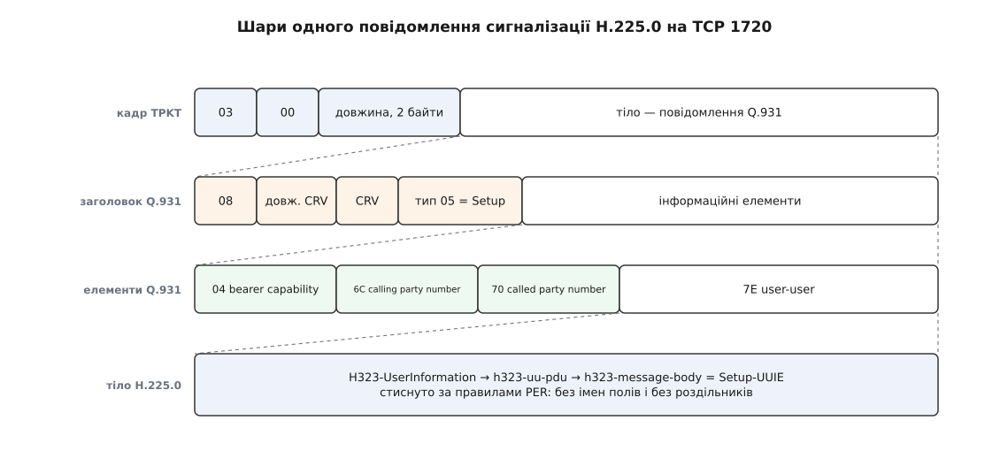

# 📋 Повідомлення H.323: RAS, H.225.0, H.245

Це сторінка-контракт: усе, чим три канали одного виклику H.323 обмінюються між собою — порти, назви повідомлень, напрямок, ключові поля й коди відмов — зведено в таблиці, щоб тримати під рукою при читанні дампа чи написанні обробника. Назви полів наведено так, як вони записані в схемах ASN.1 рекомендацій ITU-T H.225.0 і H.245, бо саме ці рядки покаже аналізатор пакетів.

<preknowlist>
- [Q.931 у мережі ISDN](topic:communications/isdn-q931) — набір повідомлень, якими телефонна мережа будує й розриває виклик, і формат заголовка з інформаційними елементами.
- [Кодування ASN.1 за правилами PER](topic:communications/asn1-per) — схема відома обом сторонам заздалегідь, тож у потік ідуть самі значення, стиснуті до біта, без імен полів.
- [RTP і RTCP](topic:communications/rtp-rtcp) — медіа їде окремими датаграмами, керування потоком — сусіднім портом.
- [TCP проти UDP](topic:communications/tcp-vs-udp) — чим з'єднання з гарантіями відрізняється від датаграм, які треба повторювати самому.
</preknowlist>

## Порти й транспорт

| Порт | Транспорт | Що там їде |
|---|---|---|
| 1718 | UDP, багатоадресно на `224.0.1.41` | пошук воротаря: `GRQ` летить у групу, відповідь `GCF` приходить одноадресно |
| 1719 | UDP | канал RAS: усі решта повідомлень до воротаря й від нього |
| 1720 | TCP | сигналізація виклику H.225.0 — повідомлення Q.931 |
| 1300 | TCP | те саме під TLS (захист за H.235) |
| домовлений | TCP | канал керування H.245; адресу передають полем `h245Address` |
| домовлені пари | UDP | RTP і RTCP кожного логічного каналу |
| 2517 | UDP | сигналізація виклику за Додатком E, без TCP-з'єднання |
| 2099 | TCP і UDP | Додаток G — обмін між адміністративними доменами |

У реєстрі IANA ці порти записані як `h323gatedisc`, `h323gatestat`, `h323hostcall`, `h323hostcallsc`, `call-sig-trans` і `h2250-annex-g`.

## Один пакет сигналізації, шар за шаром


*Кадр TPKT дає межу повідомлення в потоці TCP: версія `03`, нуль і два байти повної довжини разом із цими чотирма. Далі — заголовок Q.931: дискримінатор протоколу `08`, номер виклику, код типу. Далі інформаційні елементи, обов'язково за зростанням коду. Усе специфічно H.323-івське лежить в елементі `7E` (user-user) і стиснуте за правилами PER.*

## RAS: канал до воротаря

Кожен запит несе `requestSeqNum`; відповідь повертає той самий номер. Транспорт — UDP, тож повтор після тайм-ауту робить сам відправник. Якщо воротар не встигає (шукає адресата в сусідній зоні), він шле `RIP` — «запит у роботі, лічильник повторів обнули».

**Виявлення й реєстрація**

| Повідомлення | Хто → кому | Що каже |
|---|---|---|
| `GRQ` `gatekeeperRequest` | термінал → група `224.0.1.41` | «хто тут мій воротар?» |
| `GCF` `gatekeeperConfirm` | воротар → термінал | «я; ось моя RAS-адреса» |
| `GRJ` `gatekeeperReject` | воротар → термінал | `resourceUnavailable`, `terminalExcluded`, `invalidRevision` |
| `RRQ` `registrationRequest` | термінал → воротар | `callSignalAddress`, `rasAddress`, `terminalAlias`, `terminalType`, `timeToLive`, `keepAlive` |
| `RCF` `registrationConfirm` | воротар → термінал | `endpointIdentifier` і фактичний `timeToLive` |
| `RRJ` `registrationReject` | воротар → термінал | `duplicateAlias`, `invalidTerminalAliases`, `discoveryRequired`, `securityDenial` |
| `URQ` `unregistrationRequest` | у **обидва** боки | термінал іде з мережі — або воротар його виганяє |
| `UCF` / `URJ` | у відповідь | згода / відмова |

Реєстрацію треба поновлювати: коли спливає близько 90 % узгодженого `timeToLive`, термінал шле полегшений `RRQ` із `keepAlive = TRUE` — без повного набору полів.

**Дозвіл, смуга, завершення, пошук**

| Повідомлення | Хто → кому | Що каже |
|---|---|---|
| `ARQ` `admissionRequest` | термінал → воротар | `destinationInfo`, `bandWidth`, `callIdentifier`, `answerCall`, `callType`, `srcInfo` |
| `ACF` `admissionConfirm` | воротар → термінал | `destCallSignalAddress` — куди слати `Setup`; дозволена `bandWidth`; `callModel`; `irrFrequency` |
| `ARJ` `admissionReject` | воротар → термінал | `reason` — див. останню таблицю |
| `BRQ` / `BCF` / `BRJ` | термінал ↔ воротар | попросити іншу смугу посеред розмови |
| `DRQ` `disengageRequest` | у **обидва** боки | `terminationCause`, `callIdentifier`, `answeredCall`; причина `normalDrop` — поклали слухавку, `forcedDrop` — воротар обірвав |
| `DCF` / `DRJ` | у відповідь | згода / відмова |
| `IRQ` `infoRequest` | воротар → термінал | «перелічи свої живі виклики» |
| `IRR` `infoRequestResponse` | термінал → воротар | перелік; той самий `IRR` термінал шле сам за таймером `irrFrequency` з `ACF` — це ознака життя виклику |
| `LRQ` `locationRequest` | воротар → воротар | «у кого зареєстрований цей псевдонім?» |
| `LCF` / `LRJ` | воротар → воротар | адреса сигналізації знайденого / відмова |
| `RAI` / `RAC` | шлюз ↔ воротар | «мої канали в телефонну мережу майже скінчились» / «прийняв» |
| `RIP` `requestInProgress` | воротар → термінал | «ще думаю, не повторюй» |
| `SCI` / `SCR` | воротар ↔ термінал | службові вказівки: залишок кредиту на розмову, адреса підказки |

`ARQ` шлють **обидві** сторони: той, хто дзвонить, — перед `Setup`; той, кому дзвонять, — отримавши `Setup`, з `answerCall = TRUE` і тим самим `callIdentifier`. Смугу в `bandWidth` рахують одиницями по 100 біт/с і на обидва напрямки разом.

## H.225.0: повідомлення самого виклику

| Повідомлення | Тип Q.931 | Тіло в `7E` | Ключові поля тіла |
|---|---|---|---|
| `Setup` | `05` | `Setup-UUIE` | `protocolIdentifier`, `sourceAddress`, `destinationAddress`, `destCallSignalAddress`, `sourceCallSignalAddress`, `callIdentifier`, `conferenceID`, `callType`, `fastStart`, `mediaWaitForConnect`, `canOverlapSend` |
| `Call Proceeding` | `02` | `CallProceeding-UUIE` | `destinationInfo`, `h245Address`, `callIdentifier` |
| `Alerting` | `01` | `Alerting-UUIE` | те саме плюс `alertingAddress`, `fastStart` |
| `Connect` | `07` | `Connect-UUIE` | `h245Address`, `conferenceID`, `callIdentifier`, `fastStart`, `connectedAddress` |
| `Facility` | `62` | `Facility-UUIE` | `reason`, `alternativeAddress`, `alternativeAliasAddress`, `h245Address` |
| `Release Complete` | `5A` | `ReleaseComplete-UUIE` | `reason`, `callIdentifier`, `busyAddress` |
| `Progress` · `Information` · `Notify` · `Status` · `Status Enquiry` | `03` · `7B` · `6E` · `7D` · `75` | відповідні UUIE | звук із мережі до відповіді, доцифрування номера, зміна стану, звірка станів |

Обгортка спільна для всіх: `H323-UU-PDU` містить `h323-message-body` (котре саме з наведених), прапорець `h245Tunnelling` — згоду возити керування всередині сигналізації — і `h245Control`, де той тунельований вміст лежить.

`callIdentifier` — глобально унікальні 16 байтів, якими виклик упізнають і в RAS, і в сигналізації. Номер виклику з заголовка Q.931 (call reference value) на це не годиться: він живе лише в межах одного з'єднання й на кожній ділянці свій.

`Facility` варто виділити окремо. Його `reason` перетворює одне повідомлення на кілька різних дій: `routeCallToGatekeeper` — «шли `Setup` не напряму, а мені», `callForwarded` — перенаправлення, `startH245` — «ось адреса каналу керування, відкривай», `noH245` — «каналу не буде».

> 🔧 **Навіщо це.** Порт H.245 ніде не записаний наперед: він приїжджає полем `h245Address` усередині PER-стисненого тіла `Connect` або `Facility`. Проміжний вузол, який не вміє декодувати ASN.1, цього поля просто не бачить — і виклик доходить до `Connect`, а далі мовчить. Те саме з адресами RTP у `openLogicalChannelAck`. Звідси окремі модулі розбору H.323 у мережевому обладнанні й [морока з трансляцією адрес](topic:communications/nat-traversal), а тунелювання H.245 усередину Q.931 — саме обхідний шлях: одне з'єднання на 1720 — це рівно один отвір у правилах.

## H.245: домовитися й відкрити канали

Кожне повідомлення — одна з чотирьох гілок `MultimediaSystemControlMessage`: `request` (чекає відповіді), `response`, `command` (виконуй, відповіді немає), `indication` (до відома).

| Процедура | Повідомлення | Клас | Що робить |
|---|---|---|---|
| Можливості | `terminalCapabilitySet` → `terminalCapabilitySetAck` / `…Reject`; `…Release` | request → response, indication | `capabilityTable` — що термінал уміє приймати й надсилати; `capabilityDescriptors` — які з цього він може **одночасно** |
| Старшинство | `masterSlaveDetermination` → `…Ack` / `…Reject` | request → response | `terminalType` 0–255 і `statusDeterminationNumber` 0–16777215; більший тип виграє, при рівних типах — більше число; `…Reject` з `identicalNumbers` означає «тягнемо жереб знову» |
| Відкрити канал | `openLogicalChannel` → `openLogicalChannelAck` / `…Reject`; `openLogicalChannelConfirm` | request → response, indication | `forwardLogicalChannelNumber`, `dataType` — кодек; у параметрах H.225.0 — `sessionID`, `mediaChannel`, `mediaControlChannel`: саме тут з'являються адреси RTP і RTCP |
| Закрити канал | `closeLogicalChannel` → `closeLogicalChannelAck` | request → response | закриває той, хто **надсилає**; `reason`: `unknown`, `reopen`, `reservationFailure` |
| Попросити закрити | `requestChannelClose` → `…Ack` / `…Reject` | request → response | прохання до того, хто надсилає, бо самому чужий канал не закрити |
| Час обігу | `roundTripDelayRequest` → `roundTripDelayResponse` | request → response | `sequenceNumber` 0–255; заразом ознака життя каналу керування |
| Кінець сеансу | `endSessionCommand` | command | відповіді немає; після нього канал керування закривають |
| Решта | `requestMode`, `flowControlCommand`, `miscellaneousCommand`, `userInput` | request · command · indication | попросити інший режим, обмежити швидкість, замовити ключовий кадр, передати цифру DTMF |

Числа `terminalType`, якими й вирішується старшинство: термінал без функції керування конференцією — 50, шлюз без неї — 60, конференц-сервер з усіма процесорами обробки — 190, активний керівник конференції — 240.

## Найкоротший повний виклик

```
A → воротар   UDP 1719   ARQ   destinationInfo=+380..., bandWidth=1280, answerCall=FALSE
воротар → A   UDP 1719   ACF   destCallSignalAddress = адреса B, bandWidth=1280
A → B         TCP 1720   Setup            callIdentifier=…, fastStart=[описи каналів]
B → воротар   UDP 1719   ARQ   answerCall=TRUE, той самий callIdentifier
воротар → B   UDP 1719   ACF
B → A         TCP 1720   Call Proceeding
B → A         TCP 1720   Alerting
B → A         TCP 1720   Connect          fastStart=[вибрані канали]
A ↔ B         UDP        RTP і RTCP за адресами з fastStart
                         …розмова…
A → B         TCP 1720   Release Complete reason=undefinedReason
A → воротар   UDP 1719   DRQ   terminationCause=normalDrop      воротар → A   DCF
B → воротар   UDP 1719   DRQ   terminationCause=normalDrop      воротар → B   DCF
```

Без `fastStart` між `Connect` і першим пакетом RTP стоїть іще ціле з'єднання H.245: `terminalCapabilitySet` в обидва боки, `masterSlaveDetermination` і по `openLogicalChannel` на кожен напрямок.

## Коди відмов, які варто впізнавати

| Де | Значення | Що сталося |
|---|---|---|
| `ARJ.reason` | `calledPartyNotRegistered` | адресат у зоні не зареєстрований |
| | `requestDenied` | смуга вичерпана — класичний наслідок незакритих `DRQ` |
| | `invalidPermission` | політика воротаря забороняє такий виклик |
| | `routeCallToGatekeeper` | «не дзвони напряму, шли `Setup` мені» |
| | `exceedsCallCapacity` | ліміт одночасних викликів у зоні |
| | `noRouteToDestination` | маршруту до зони адресата немає |
| `ReleaseComplete.reason` | `noBandwidth` | смуги немає |
| | `unreachableDestination` | адресата не дістати |
| | `destinationRejection` | адресат відмовився брати виклик |
| | `gatekeeperResources` | ресурси самого воротаря |
| | `invalidRevision` | несумісні версії протоколу |
| | `securityDenied` | не пройшла перевірка за H.235 |
| | `hopCountExceeded` | виклик закільцювався між воротарями |

Це не вся правда про причину. У тому самому `Release Complete` окремим інформаційним елементом Q.931 (код `08`, cause) їде звичайна телефонна причина: 16 — «нормальне завершення», 17 — «абонент зайнятий», 34 — «немає вільного каналу». Шлюз у телефонну мережу дивиться саме на неї, бо саме її він понесе далі; а тіло `ReleaseComplete-UUIE` розповідає, що про виклик думала пакетна половина світу. Коли ці два поля суперечать одне одному, правда зазвичай на боці того, хто ближче до місця обриву.
