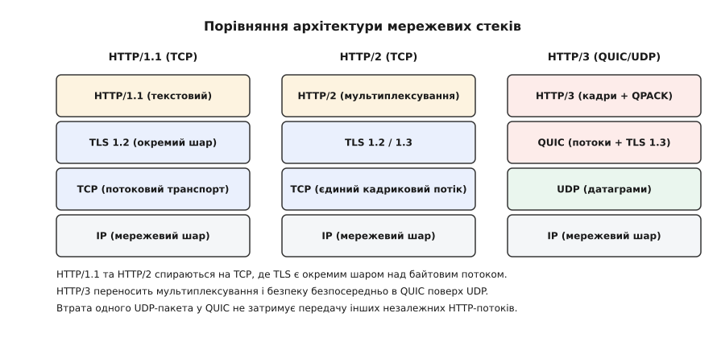
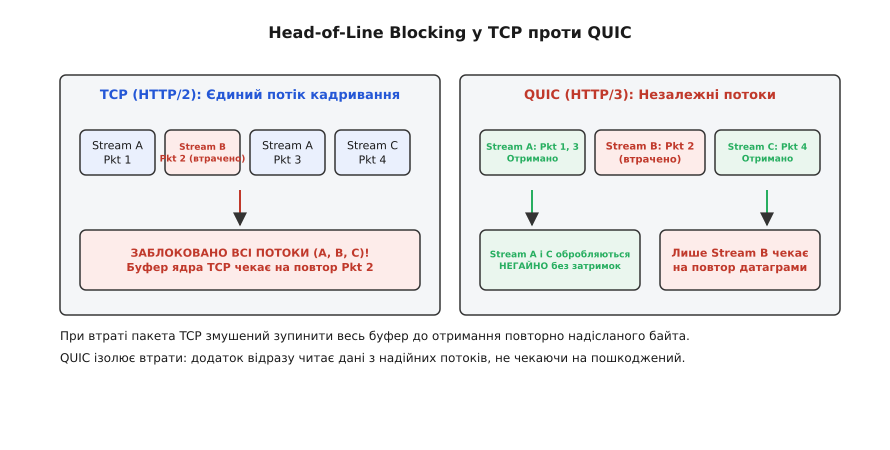
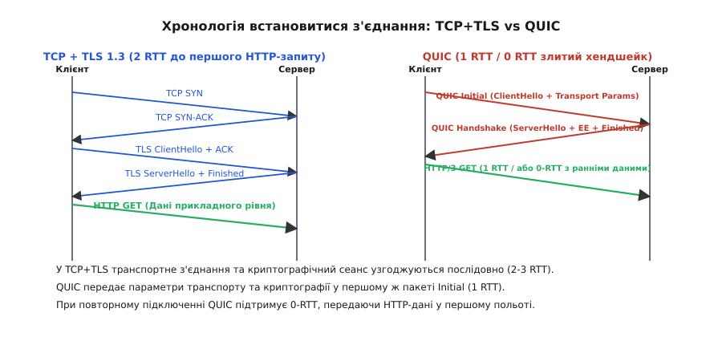
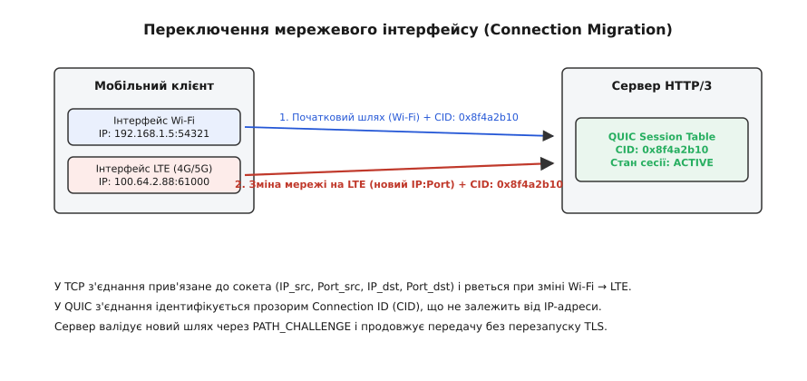
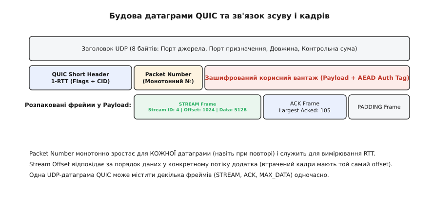

# HTTP/3 та QUIC: переосмислення мережевого стеку веб

<preknowlist>
- [TCP проти UDP](topic:communications/tcp-vs-udp) — різниця між надійним потоком із встановленням з'єднання та беззв'язковими датаграмами.
- [Керування потоком](topic:communications/flow-control) — концепція ковзного вікна, обмеження передачі та узгодження лімітів прийому.
- [Контрольні суми](topic:communications/checksums) — виявлення пошкоджень байтів у мережевих кадрах.
- [Інтернет-контрольна сума (IP/TCP/UDP)](topic:communications/internet-checksum) — підрахунок 16-бітових доповнень заголовків транспортного рівня.
</preknowlist>

Спроба прискорити веб через мультиплексування декількох паралельних запитів усередині єдиного TCP-з'єднання в протоколі HTTP/2 уперлася у фундаментальне обмеження транспортного рівня моделі OSI. Коли мобільний пристрій передає вебсторінку через бездротовий канал Wi-Fi або LTE, втрата бодай одного IP-пакета призводить до того, що ядро операційної системи повністю зупиняє просування всього байтового потоку TCP. У результаті десятки незалежних ресурсів — зображення, стилі, скрипти та API-відповіді — застрягають у системному буфері очікування, чекаючи на повторну доставку єдиного втраченого байта.

Протокол QUIC (Quick UDP Internet Connections), закріплений у стандартах RFC 9000 та RFC 9001, у поєднанні з HTTP/3 (RFC 9114) демонує класичний заскорублий стек TCP/TLS. Переносячи транспортну логіку з ядра операційної системи у простір користувача поверх беззв'язкових датаграм UDP, HTTP/3 усуває блокування початку черги (Head-of-Line Blocking), інтегрує шифрування TLS 1.3 безпосередньо у транспортне рукостискання, вводить не залежні від IP-адрес ідентифікатори з'єднань (Connection ID) та забезпечує безшовну мобільність сесій між мережевими інтерфейсами.


*Порівняльне зіставлення мережевих стеків HTTP/1.1, HTTP/2 та HTTP/3: перенесення мультиплексування й безпеки безпосередньо у шари QUIC та UDP.*

## Проблема Head-of-Line Blocking у TCP/TLS

Специфікація HTTP/1.1 намагалася розв'язати проблему затримок за допомогою конвеєризації запитів (HTTP Pipelining), проте сервери були зобов'язані повертати відповіді суворо у порядку надходження запитів. Якщо перший запит вимагав тривалої генерації на сервері, всі наступні відповіді заблоковувалися у черзі.

HTTP/2 ліквідував проблему конвеєризації прикладного рівня шляхом введення кадрирування. Вебзапити та відповіді розбивалися на дрібні кадри `DATA` та `HEADERS` з унікальними ідентифікаторами `Stream ID` і передавалися впереміш через одне TCP-з'єднання. Проте на транспортному рівні TCP залишався монолітним байтовим потоком з єдиним лічильником послідовних номерів (`Sequence Number`).

```
Загальний потік TCP:  [Stream A, Pkt 1] [Stream B, Pkt 2] [Stream C, Pkt 3]
                                              |
                                      (Пакет 2 втрачено)
                                              v
Буфер ядра TCP:       [Stream A, Pkt 1] [ЗАБЛОКОВАНО...] [Stream C, Pkt 3]
```

Глибинна причина цього блокування криється у внутрішній реалізації стеку TCP ядра Linux (підсистема `net/ipv4/tcp_input.c`). Коли з мережевої карти надходить IP-пакет, ядро аналізує його `Sequence Number`. Якщо пакет містить байти з зсувом, більшим за поточну позицію читання `rcv_nxt`, ядро не може передати ці байти сокету. Воно розміщує структуру `sk_buff` у чергу неупорядкованих пакетів `out_of_order_queue`.

Сокетний системний виклик `read()` або `recv()` блокується в функції `sk_wait_data`, чекаючи на заповнення дірки. Навіть якщо пакети, що відповідають кадрам `Stream A` та `Stream C`, вже знаходяться в пам'яті ядра та пройшли перевірку контрольних сум, ядро Linux відмовляється віддати їх користувацькому процесу. Гарантія впорядкованого байтового потоку POSIX-сокетів TCP стає пасткою: один втрачений IP-пакет у бездротовому каналі блокує обробку всіх паралельних HTTP/2-потоків.


*Аналіз Head-of-Line Blocking: у TCP втрата одного пакета зупиняє обробку всіх потоків, тоді як у QUIC дані з незалежних потоків A та C читаються негайно.*

У мережах із високим рівнем втрат пакетів (наприклад, мобільний зв'язок на межі покриття станції або насичені Wi-Fi точки з коефіцієнтом втрат 2–5%) мультиплексований стек HTTP/2 працює повільніше за кілька паралельних з'єднань HTTP/1.1. QUIC розв'язує цю проблему принципово: UDP-датаграми не містять загального транспортного послідовного номера, а кожен кадр `STREAM` усередині QUIC має власне незалежне зміщення (`Offset`).

## Зсув рівнів: TLS 1.3 усередині QUIC

У класичному мережевому стеку протоколи TCP та TLS функціонують як суворо ізольовані шари. Спочатку ядро Linux виконує трибічне рукостискання TCP (SYN, SYN-ACK, ACK), витрачаючи 1 RTT. Лише після переходу сокета у стан `ESTABLISHED` користувацька бібліотека OpenSSL надсилає кадр `ClientHello` для узгодження параметрів TLS 1.2 або TLS 1.3, витрачаючи ще 1–2 RTT.

```
Класичний стек (TCP + TLS 1.2):
Клієнт  --- TCP SYN -------------------------> Сервер  (0.5 RTT)
Клієнт  <-- TCP SYN-ACK ---------------------- Сервер  (1.0 RTT)
Клієнт  --- TLS ClientHello -----------------> Сервер  (1.5 RTT)
Клієнт  <-- TLS ServerHello, Certificate ---- Сервер  (2.0 RTT)
Клієнт  --- TLS Finished --------------------> Сервер  (2.5 RTT)
Клієнт  <-- HTTP 200 OK ---------------------- Сервер  (3.0 RTT)
```

QUIC ліквідує цю дубльовану послідовність. Криптографічний протокол TLS 1.3 більше не є "верхньою обгорткою" над транспортом — його криптографічний автомат інтегровано безпосередньо в середовище QUIC. Повідомлення рукостискання TLS 1.3 інкапсулюються в кадри `CRYPTO` транспортних пакетів `Initial` та `Handshake`.


*Хронологічний порівняльний аналіз рукостискання: затримка встановлення сесії знижується з 2–3 RTT у TCP+TLS до 1 RTT (або 0-RTT) у QUIC.*

### Математика виведення ключів (HKDF в RFC 9001)

Виведення сесійних ключів у QUIC відбувається за допомогою криптографічної функції HKDF (HMAC-based Key Derivation Function) на основі хеш-алгоритму SHA-256. Під час обробки першого пакета `Initial` обидва вузли обчислюють початкові ключі `Initial Keys` на основі публічного солі (Salt `0x38762cf7f55934b34d179ae6a4c80cadccbb7f0a` для QUIC v1) та ідентифікатора `Destination Connection ID`:

```
initial_secret = HKDF-Extract(salt, destination_connection_id)
client_initial_secret = HKDF-Expand-Label(initial_secret, "client in", "", 32)
server_initial_secret = HKDF-Expand-Label(initial_secret, "server in", "", 32)

quic_key = HKDF-Expand-Label(client_initial_secret, "quic key", "", 16)
quic_iv  = HKDF-Expand-Label(client_initial_secret, "quic iv", "", 12)
quic_hp  = HKDF-Expand-Label(client_initial_secret, "quic hp", "", 16)
```

Секрет `quic_hp` (Header Protection Key) використовується для маскування прапорів та номерів пакетів, а `quic_key` та `quic_iv` — для шифрування корисного вантажу в режимі AEAD AES-128-GCM або ChaCha20-Poly1305.

Під час надсилання першої UDP-датаграми `Initial` клієнт передає як транспортні параметри QUIC (`initial_max_data`, `initial_max_streams`), так і криптографічний вектор `ClientHello` TLS 1.3 з ключами ECDH. Сервер у відповідному пакеті `Handshake` повертає `ServerHello`, свій сертифікат та підпис. Уже після 1 RTT обидві сторони обчислюють симетричні сесійні ключі 1-RTT і можуть обмінюватися HTTP/3-даними.

При повторному підключенні до сервера, з яким клієнт вже спілкувався раніше, QUIC підтримує режим **0-RTT (Zero Round-Trip Time)**. Клієнт використовує збережений сесійний квиток (PST — Pre-Shared Key) для зашифрування перших кадрів `DATA` у пакеті `0-RTT` і надсилає їх у першій же UDP-датаграмі.

Історію еволюції від експериментального протоколу Google до стандартизованого пакету RFC висвітлено у вставці [Від gQUIC у Chrome до стандарту RFC 9000](topic:communications/http3-quic/hist-quic-gquic-to-rfc9000.md).

## Мультиплексування незалежних потоків (Independent Streams)

Усередині одного QUIC-з'єднання може існувати до кількох тисяч паралельних потоків (Streams). Потік — це абстракція однонаправленої або двонаправленої послідовності байтів із гарантованою доставкою та збереженням порядку *лише в межах даного конкретного потоку*.

Ідентифікатор потоку (`Stream ID`) описується цілим числом Varint, де два наймолодші біти визначають статус:
- `0x00`: Двонаправлений потік клієнта (Client-Initiated, Bidirectional).
- `0x01`: Двонаправлений потік сервера (Server-Initiated, Bidirectional).
- `0x02`: Однонаправлений потік клієнта (Client-Initiated, Unidirectional).
- `0x03`: Однонаправлений потік сервера (Server-Initiated, Unidirectional).

Двонаправлені потоки клієнта використовуються для стандартної схеми "запит–відповідь" HTTP/3: клієнт надсилає кадр `HEADERS` з параметрами GET/POST у потік з `Stream ID = 0`, і сервер повертає відповідь у цей же потік. Однонаправлені потоки застосовуються для службових завдань: керувального потоку HTTP/3 (Control Stream), потоків оновлення QPACK (Encoder/Decoder streams) та каналів підкачування (Server Push).

Специфікацію двійкових форматів пакетів та кадрів детально розібрано у вставці [Формати пакетів QUIC та фреймів HTTP/3](topic:communications/http3-quic/api-quic-frame-spec.md).

### Двовентильне керування потоком (Two-Tier Flow Control)

Щоб запобігти переповненню буферів прийому, QUIC реалізує двовентильний механізм керування потоком (Flow Control), який діє незалежно на двох рівнях:

1. **Stream-Level Flow Control**: Кожен окремий потік має свій ліміт прийому `MAX_STREAM_DATA`. Якщо додаток повільно читає дані з конкретного потоку, приймач не збільшує цей ліміт, призупиняючи передачу лише для даного `Stream ID`.
2. **Connection-Level Flow Control**: Сумарний обсяг байтів усіх потоків усередині з'єднання обмежено спільним вікном `MAX_DATA`. Це захищає загальну пам'ять процесу від атак виснаження ресурсів.

Коли прикладна програма вичитує байти з буфера, вона надсилає кадри `MAX_STREAM_DATA` або `MAX_DATA`, розсуваючи межі дозволеного зсуву для відправника.

## Ідентифікатори з'єднань (Connection ID) та мобільність

У протоколах TCP та UDP з'єднання традиційно ідентифікується кортежем з чотирьох елементів (4-tuple): `(Source IP, Source Port, Destination IP, Destination Port)`. Коли користувач мобільного пристрою переходить із зони покриття домашнього Wi-Fi на мобільну мережу 4G/5G, операційна система змінює локальну IP-адресу та виділений порт сокета.

З точки зору ядра Linux або серверного фаєрвола, надходження TCP-пакета з нового IP означає невідоме з'єднання. Сервер надсилає у відповідь `TCP RST`, перериваючи всі активні TLS-сесії, завантаження файлів та відеопотоки. Для відновлення обміну додаток змушений заново запускати процедуру DNS-розв'язання, сокетне підключення та рукостискання TLS.


*Переключення мережевого інтерфейсу (Connection Migration): прив'язка сесії до Connection ID уможливлює безшовний перехід між Wi-Fi та LTE без переривання TLS.*

QUIC повністю розриває зв'язок між мережевим шляхом та ідентифікатором сесії. З'єднання ідентифікується прозорим масивом байтів — **Connection ID (CID)**, який генерується кінцевими вузлами незалежно для кожного напрямку.

### Процедура переходу на новий шлях (Path Validation)

Коли мобільний клієнт змінює IP-адресу, він надсилає наступну UDP-датаграму з нової адреси, зберігаючи попередній `Destination Connection ID`. Сервер, виявивши зміну 4-tuple, запускає процедуру валідації нового шляху:

```
Клієнт (LTE: 100.64.2.88) --- Short Header (CID: 0x8f4a2b10) ---> Сервер
Сервер                       --- PATH_CHALLENGE (Data: 64-bit) ---> Клієнт (LTE)
Клієнт (LTE)                 --- PATH_RESPONSE  (Data: 64-bit) ---> Сервер
```

1. Сервер надсилає на нову IP-адресу клієнта кадр `PATH_CHALLENGE`, який містить 64-бітове криптографічне випадкове число.
2. Клієнт повертає цей же 64-бітовий відбиток у кадрі `PATH_RESPONSE`.
3. Отримавши підтвердження, сервер переключає активний маршрут доставки на нову IP-адресу без перезапуску сесійних ключів TLS 1.3.

Для запобігання стеженню за мобільним користувачем у мережі (Tracking/Privacy attack) через константний ідентифікатор CID у заголовках пакетів, QUIC впроваджує ротацію ідентифікаторів. Сервер надсилає клієнту пул нових криптографічно непов'язаних ідентифікаторів у кадрах `NEW_CONNECTION_ID`. При кожній зміні мережевого інтерфейсу клієнт вибирає новий CID з пулу, унеможливлюючи кореляцію трафіку пасивними спостерігачами.

## Нова математика втрат та оцінки RTT

У протоколі TCP виявлення втрат пакетів ускладнювалося проблемою невизначеності повторного надсилання (Retransmission Ambiguity). Якщо відправник надсилав сегмент із посліводним номером `Seq = 1000`, не отримав `ACK`, надіслав його повторно і згодом отримав підтвердження `ACK 1001`, він не міг визначити, на який саме з двох пакетів відповідав приймач. Помилкова оцінка затримки викривляла вирахування гладкого RTT (SRTT) та призводила до деградації алгоритмів керування перевантаженням (CUBIC, Reno).

QUIC запроваджує чітке розділення між номерами пакетів та зсувом даних прикладного рівня:


*Будова датаграми QUIC: номер пакета Packet Number строго зростає при кожному надсиланні, а зсув Stream Offset відповідає за позицію даних у потіку.*

1. **Packet Number (Номер пакета)**: Суворо зростає на одиницю з кожною надісланою UDP-датаграмою в межах одного простору ключів. Навіть якщо датаграма містить повторно передані кадри `STREAM`, вона отримує *новий, більший* номер пакета. Це повністю усуває Retransmission Ambiguity.
2. **Stream Offset (Зсув потоку)**: Поле усередині кадру `STREAM`, яке визначає абсолютну позицію байтів у прикладному потіку. При повторній передачі втрачених даних змінюється номер пакета, але зсув кадру залишається незмінним.

### Формули вирахування гладкого RTT та таймауту PTO

Згідно зі специфікацією RFC 9002, оцінка мережевої затримки спирається на три змінні: `SRTT` (Smoothed RTT), `RTTVAR` (RTT Variation) та `PTO` (Probe Timeout). При отриманні кадру `ACK` обчислюється точна мережева затримка:

```text
Sample_RTT = Time_ACK_received - Time_packet_sent - ACK_Delay
```

Після цього виконується експоненціальне згладжування:

```text
SRTT   = (7/8) * SRTT + (1/8) * Sample_RTT
RTTVAR = (3/4) * RTTVAR + (1/4) * |SRTT - Sample_RTT|
PTO    = SRTT + max(4 * RTTVAR, kGranularity) + max_ack_delay
```

де `kGranularity = 1 ms`, а `max_ack_delay` узгоджується під час хендшейку (за замовчуванням 25 ms). Вирахування чисто мережевого RTT без затримок у користувацькому буфері приймача запобігає хибним спрацьовуванням таймерів та розхитуванню вікна перевантаження.

Практичну реалізацію дефрагментатора неупорядкованих кадрів та збирача потоків наведено у вставці [Реалізація мультиплексора потоків QUIC та QPACK-декодера](topic:communications/http3-quic/proj-quic-stream-multiplexer.md).

## Виявлення втрат та керування перевантаженням (RFC 9002)

Механізми виявлення втрат у QUIC спираються на два ключові коефіцієнти: поріг за часом (Time Threshold) та поріг за кількістю пакетів (Packet Threshold).

Пакет вважається втраченим, якщо виконується хоча б одна з двох умов:
1. **Packet Threshold**: Отримано підтвердження `ACK` для пакета з номером `PN`, який випереджає даний пакет щонайменше на `kPacketThreshold = 3` номери.
2. **Time Threshold**: Отримано `ACK` для пізнішого пакета, і з моменту надсилання даного пакета минув інтервал затримки:
```text
Time_Since_Sent >= max(kTimeThreshold * SRTT, kGranularity)
```
де `kTimeThreshold = 1.125` (або `9/8`), а `kGranularity = 1 ms`.

### Алгоритми керування перевантаженням (Congestion Control)

QUIC виносить керування перевантаженням у модуль прикладного рівня, дозволяючи запікати найсучасніші алгоритми прямо у користувацький процес без оновлення ядра Linux. Сучасні реалізації спираються на два підходи:

- **BBRv2 (Bottleneck Bandwidth and RTT)**: Алгоритм від Google, який моделює фізичну смугу каналу та мінімальний RTT без штучного заповнення мережевих буферів (Bufferbloat). BBR вимірює максимальний рівень вихідного потоку і підтримує розмір вікна перевантаження `cwnd` поблизу об'єму BDP (Bandwidth-Delay Product). Захисна темпоризація (Pacing) розраховується як `pacing_rate = cwnd / SRTT`.
- **NewReno / CUBIC**: Класичні алгоритми, які адаптовано під фрейми `ACK` у QUIC. Вони реалізують фазу повільного старту (Slow Start) та кубічне зростання вікна при відсутності скидання пакетів.

Крім того, QUIC підтримує явне повідомлення про перевантаження **ECN (Explicit Congestion Notification)**. Якщо мережевий маршрутизатор позначає біти `CE` (Congestion Encountered) в заголовку IP, приймач відображає ці лічильники у відповідних полях кадру `ACK` (`ECT0 Count`, `ECT1 Count`, `ECN-CE Count`), змушуючи відправника зменшувати вікно перевантаження ще до фізичного скидання UDP-датаграм.

## Визначення розрахункового розміру PMTU та об'єднання пакетів (Datagram Coalescing)

Для запобігання фрагментації IP-датаграм на проміжних маршрутизаторах (що призводить до масових втрат пакетів), QUIC реалізує динамічний механізм розрахунку максимально допустимого розміру датаграми **Path MTU Discovery (DPLPMTU, RFC 8899)**.

Під час початкового обміну клієнт та сервер надсилають контрольні пакети `PADDING` для перевірки здатності каналу пропускати датаграми розміром 1200, 1350 або 1472 байти без розділення. Усі пакети QUIC надсилаються з встановленим бітом `Don't Fragment` (IP DF) у заголовку IPv4 або IPv6.

Крім того, специфікація QUIC дозволяє об'єднувати декілька окремих пакетів QUIC (наприклад, `Initial` + `Handshake` + `1-RTT`) усередині **єдиної UDP-датаграми** (Datagram Coalescing). Це дозволяє зменшити накладні витрати на заголовки IP та UDP під час початкового польоту даних.

## Захист заголовків та криптографічні фази (Header Protection & Key Phases)

Криптографічний захист QUIC застосовує подвійне шифрування: спочатку шифрується корисний вантаж за допомогою режиму AEAD (AES-128-GCM, AES-256-GCM або ChaCha20-Poly1305), після чого окрема маска шифрування застосовується до заголовку пакета (**Header Protection**).

```
Вхідний UDP-пакет: [Flags (1B)] [Destination CID (8B)] [Encrypted PN (4B)] [Encrypted Payload]
                        |                                       ^
                        +--- AES-ECB (Payload Sample) ----------+  (Маскування PN та бітів)
```

Маска шифрування заголовку обчислюється шляхом взяття 16 байтів розшифрованого корисного вантажу в якості зразка (`Sample`) і пропущення його через шифр AES-ECB або ChaCha20 з окремим ключем `Header Key`. Результат маскує старші біти прапорів та зашифроване поле `Packet Number`. Це унеможливлює аналіз послідовних номерів пакетів проміжними DPI-системами та захищає від атак кореляції трафіку.

### Фази оновлення ключів (Key Update Procedure)

Під час довготривалого обміну даними (наприклад, завантаження файлів обсягом у сотні гігабайтів) обмеження лічильника вектору ініціалізації (IV) в AEAD вимагає періодичної ротації симетричних ключів. У QUIC для цього використовується біт `Key Phase` у Short Header. Коли відправник вирішує оновити ключі, він змінює значення біта `Key Phase` на протилежне (`0 -> 1` або `1 -> 0`) та обчислює новий комплект ключів за допомогою функції HKDF-Expand.

## Захист від DDoS та атак підсилення (Security & Amplification Protection)

При використанні незахищеного протоколу UDP зловмисники можуть підробити IP-адресу жертви у заголовоку `Source IP` і надіслати короткий запит на сервер. Якщо сервер відповість великим обсягом даних, виникне атака підсилення (Amplification Attack).

QUIC впроваджує сувору антиампліфікаційну політику (Anti-Amplification Rule):
1. **Обмеження 3x**: До тих пір, поки сервер не підтвердить володіння віддаленого вузла його IP-адресою (шляхом отримання `ACK` на пакет `Initial` або через `PATH_RESPONSE`), серверу заборонено надсилати більше ніж у **три рази** більше байтів, ніж він отримав від клієнта.
2. **Токени перевірки та кадри Retry**: Якщо сервер перебуває під високим навантаженням, він надсилає короткий незашифрований пакет `Retry`, що містить криптографічний токен `Retry Token`. Клієнт зобов'язаний повторити запит `Initial`, включивши цей токен, що надійно доводить володіння IP-адресою.

## HTTP/3 поверх QUIC: QPACK та фрейми HTTP/3

З переходом на незаморожений UDP-транспорт традиційний алгоритм стиснення заголовків **HPACK** (RFC 7541), який використовувався в HTTP/2, виявився непридатним. HPACK спирався на спільну динамічну таблицю рядків, стан якої синхронізувався між клієнтом і сервером у суворому порядку надходження кадрів. Якщо в HTTP/3 один UDP-пакет з оновленням динамічної таблиці затримувався в мережі, обробка всіх наступних заголовків у паралельних потоках блокувалася б, що знову повернуло б Head-of-Line Blocking.

Для HTTP/3 було розроблено новий алгоритм **QPACK** (RFC 9204). QPACK розділяє обмін заголовками на три незалежні канали:

- **Request/Response Streams**: Двонаправлені потоки даних, де передаються кадри `HEADERS` та `DATA`.
- **Encoder Stream**: Однонаправлений потік від кодувальника до декодувальника, який передає команди оновлення та доповнення динамічної таблиці.
- **Decoder Stream**: Однонаправлений потік зворотного зв'язку, через який декодувальник підтверджує успішну обробку індексів динамічної таблиці.

```
Клієнт (Encoder)  --- Encoder Stream (Insert "user-agent") ---> Сервер (Dynamic Table)
Клієнт (Stream 0) --- HEADERS (Literal with Name Ref: 95) ----> Сервер (Decodes Stream 0)
Сервер (Decoder)  <-- Decoder Stream (Section Ack: Stream 0) -- Клієнт
```

Завдяки такій архітектурі QPACK дозволяє кодувати більшість популярних заголовків через статичну таблицу з 99 записів без жодних мережевих затримок. Якщо ж заголовок спирається на непідтверджений індекс динамічної таблиці, декодувальник блокує розбір *лише того конкретного запиту*, який залежить від даного індексу, дозволяючи решті потоків оброблятися негайно.

## Мережева діагностика та простеження (Tracing & Inspection)

Оскільки трафік QUIC є повністю зашифрованим поверх UDP, класичні інструменти мережевої діагностики (`tcpdump`, `netstat`) більше не можуть аналізувати прапори з'єднань або номери послідовностей. Для простеження та налагодження QUIC застосовуються спеціалізовані підходи:

1. **Експорт сесійних ключів через `SSLKEYLOGFILE`**: Веббраузери та мережеві бібліотеки (Chrome, Firefox, curl) підтримують запис секретів у змінну середовища `SSLKEYLOGFILE`. Аналізатор Wireshark використовує цей файл для розшифрування кадрів 1-RTT у реальному часі.
2. **Системні метрики сокетів Linux**: Статистика UDP-сокетів простежується через команди `ss -uh --events` та файли списку `/proc/net/udp`. Лічильники `drops` та `rx_queue` вказують на переповнення системних буферів ядерного прийому при пікових сплесках трафіку.
3. **eBPF та Tracepoints**: За допомогою утиліт eBPF (`bpftrace`) інженери відстежують виклики системних функцій `udp_sendmsg` та `udp_recvmsg`, обчислюючи точний час проходження датаграм крізь мережевий стек ядра Linux.

## Конфігурація високопродуктивних серверів HTTP/3 у Linux

Для розгортання виробничих серверів HTTP/3 (наприклад, NGINX з модулем `ngx_http_v3_module` або Envoy Proxy) недостатньо просто увімкнути слухач UDP на порту 443. Ядро Linux за замовчуванням обмежує розміри системних буферів сокетів значеннями 210 Кбайт, що викликає масове скидання UDP-пакетів на 10-гігабітних каналах зв'язку при пікових сплесках мережевого трафіку.

Оптимальна конфігурація операційної системи вимагає підтягування системних параметрів ядра у конфігураційному файлі `/etc/sysctl.conf`:

```ini
# Збільшення максимального розміру системних буферів прийому та відправки UDP
net.core.rmem_max = 16777216
net.core.wmem_max = 16777216
net.core.rmem_default = 8388608
net.core.wmem_default = 8388608

# Збільшення максимальної довжини черги прийому мережевої карти
net.core.netdev_max_backlog = 100000
```

У конфігурації NGINX слухач HTTP/3 налаштовується з сокетними прапорцями `reuseport` та `quic`:

```nginx
server {
    listen 443 quic reuseport;
    listen 443 ssl;
    server_name example.com;

    ssl_certificate     /etc/ssl/certs/example.crt;
    ssl_certificate_key /etc/ssl/private/example.key;
    ssl_protocols       TLSv1.3;

    # Оголошення клієнтам про доступність HTTP/3 на порту 443
    add_header Alt-Svc 'h3=":443"; ma=86400';

    location / {
        root /var/www/html;
        index index.html;
    }
}
```

Використання прапорця `reuseport` змушує ядро Linux створювати окрему сокетну чергу для кожного робочого воркера NGINX, а прив'язка Connection ID (CID) через eBPF забезпечує розподіл навантаження між ядрами процесора без додаткових затримок міжпроцесного обміну. Додатково налаштовуються параметри сокетів `SO_RCVBUF` та `SO_SNDBUF` для досягнення максимальної пропускної здатності на гігабітних каналах.

## Емпіричний порівняльний аналіз у реальних мережах

Емпіричні дослідження продуктивності HTTP/3 на глобальних CDN-мережах (Cloudflare, Fastly, Google) виявили чітку залежність між станом каналу зв'язку та перевагами QUIC:

- **Ідеальні оптичні канали (Loss = 0%, RTT < 20 ms)**: HTTP/2 та HTTP/3 демонструють майже однакову швидкість завантаження статичних ресурсів. Невелике перевищення споживання ЦП у QUIC компенсується апаратним розвантаженням UDP GSO/GRO.
- **Мобільні мережі з втратами пакетів (Loss = 2..5%, RTT = 80..150 ms)**: HTTP/3 демонструє прискорення завантаження складних вебсторінок у 2–3 рази. Відсутність Head-of-Line Blocking уможливлює паралельне відображення критичних блоків HTML/CSS без замирання.
- **Часта зміна мережевих веж (Мобільний транзит)**: Завдяки Connection Migration мобільні користувачі не помічають короткочасних розривів зв'язку при переході між Wi-Fi та стільниковими вежами, тоді як з'єднання HTTP/2 вимагають 2–3 секунди на повний перезапуск TCP-рукостискання.

## Розширені застосування QUIC поза межами HTTP/3

Універсальність транспортного протоколу QUIC (RFC 9000) дозволяє використовувати його не лише для вебсторінок, а й для широкого спектру мережевих застосувань:

- **WebTransport**: Сучасний стандарт, що замінює WebSockets у браузерах. WebTransport дозволяє передавати як надійні потоки даних, так і неорієнтовані несигнальні UDP-датаграми з низькою затримкою для ігор та AR/VR.
- **DNS over QUIC (DoQ, RFC 9250)**: Протокол захисту DNS-запитів, який усуває затримку TLS-хендшейку та забезпечує повну приватність відповідей порівняно з DoT (DNS over TLS) та DoH (DNS over HTTPS).
- **MASQUE (Multiplexed Application Substrate over QUIC Encryption)**: Стандарт тунелювання IP-трафіку поверх QUIC, який спирається на кадри `DATAGRAM` для створення нових високопродуктивних VPN-сервісів та проксі.

## Аналіз ціни та межі застосування

Попри очевидні архітектурні переваги, впровадження HTTP/3 та QUIC пов'язане з вагомими інженерними компромісами та підвищенням обчислювальної складності:

### 1. Навантаження на ЦП та виклики ядра (CPU Overhead)

Традиційний стек TCP оптимизувався на рівні кремнію та ядра операційної системи протягом 40 років. Сучасні мережеві карти (NIC) підтримують апаратний розвантажувач TCP Large Send Offload (TSO) та TCP Checksum Offload, дозволяючи ядру передавати 64-кілобайтні блоки даних у мережевий адаптер за один виклик.

Оскільки QUIC функціонує в user-space поверх UDP, кожна датаграма вимагає обчислення AEAD-шифрування (AES-GCM / ChaCha20) та розбору заголовків у користувацькому додатку. На ранніх етапах розгортання сервери HTTP/3 споживали у 2–3 рази більше ресурсів ЦП порівняно з NGINX на TCP/HTTP2. Для подолання цього бар'єра сучасні операційні системи впровадили механізми **UDP Generic Segmentation Offload (UDP GSO)** та **Generic Receive Offload (GRO)**, які дозволяють передавати пачки UDP-датаграм між ядром та user-space за один системний виклик `sendmmsg()` / `recvmmsg()`.

### 2. Проходження через Middleboxes та Fallback на HTTP/2

У багатьох корпоративних мережах та готельних Wi-Fi доступ до UDP-порту 443 заблоковано фаєрволами для запобігання атакам або проходу тунелів. Для забезпечення 100% надійності веббраузери реалізують механізм відкату (Fallback):

- Клієнт виконує паралельну спробу підключення: намагається встановити QUIC/UDP з'єднання та одночасно відправляє TCP SYN на порт 443.
- Сервер оголошує про підтримку HTTP/3 за допомогою заголовка відповіді `Alt-Svc: h3=":443"; ma=86400` або системних DNS-записів `HTTPS` (SVCB).
- Якщо UDP-пакети блокуються провайдером, браузер прозоро переключається на резервне з'єднання HTTP/2 поверх TCP.

> 🔧 **Навіщо це у реальній розробці.**
> Розуміння внутрішнього устрою QUIC та HTTP/3 є критичним при проєктуванні високонавантажених вебсервісів, потокового відео (WebTransport) та мобільних застосунків. Використання Connection ID дозволяє мобільним клієнтам зберігати онлайн-сесії при переході між Wi-Fi та стільниковими вежами без перезапуску авторизації. Правильне налаштування системних параметрів ядра Linux (`sysctl net.core.rmem_max`, UDP GSO/GRO) є обов'язковим для того, щоб сервери HTTP/3 не втрачали продуктивність порівняно з класичним TCP-стеком.

HTTP/3 та QUIC є не просто черговою ітерацією вебпротоколу, а фундаментальною реформою мережевого транспорту. Поєднуючи ізольовані потоки, вбудовану криптографію TLS 1.3, мобільність за Connection ID та нову математику оцінки RTT, QUIC формує універсальну основу для вебу наступного десятиліття.
