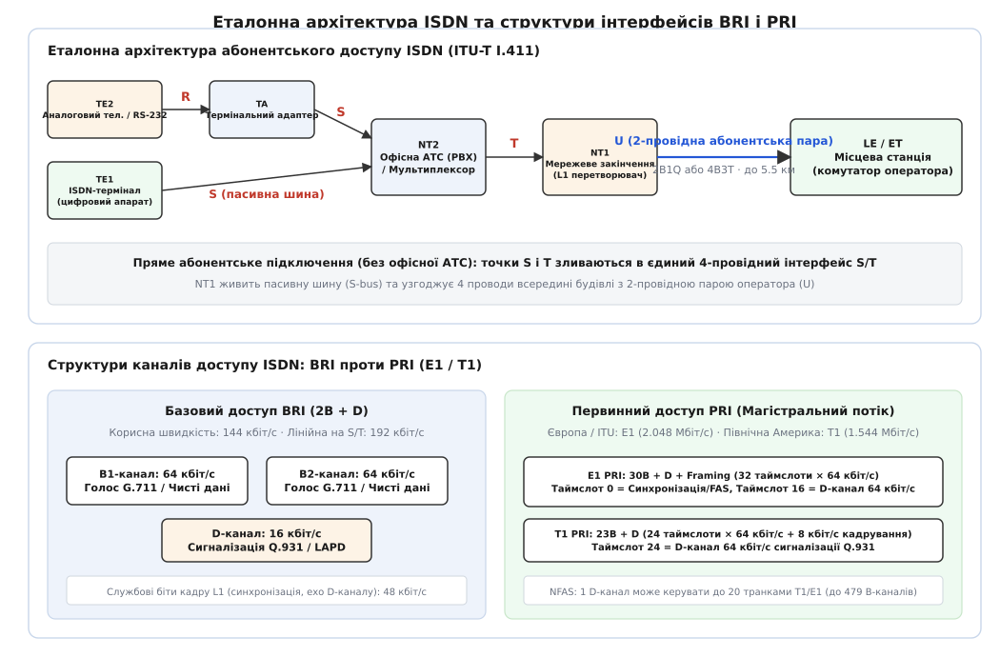
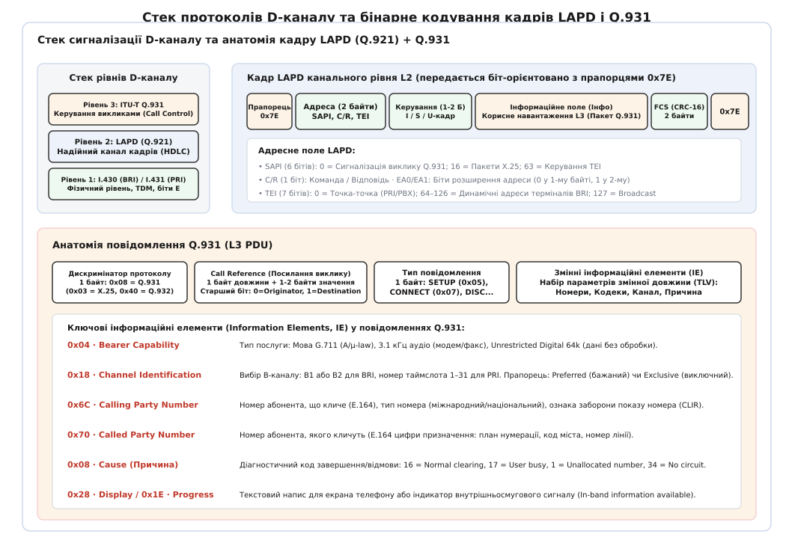
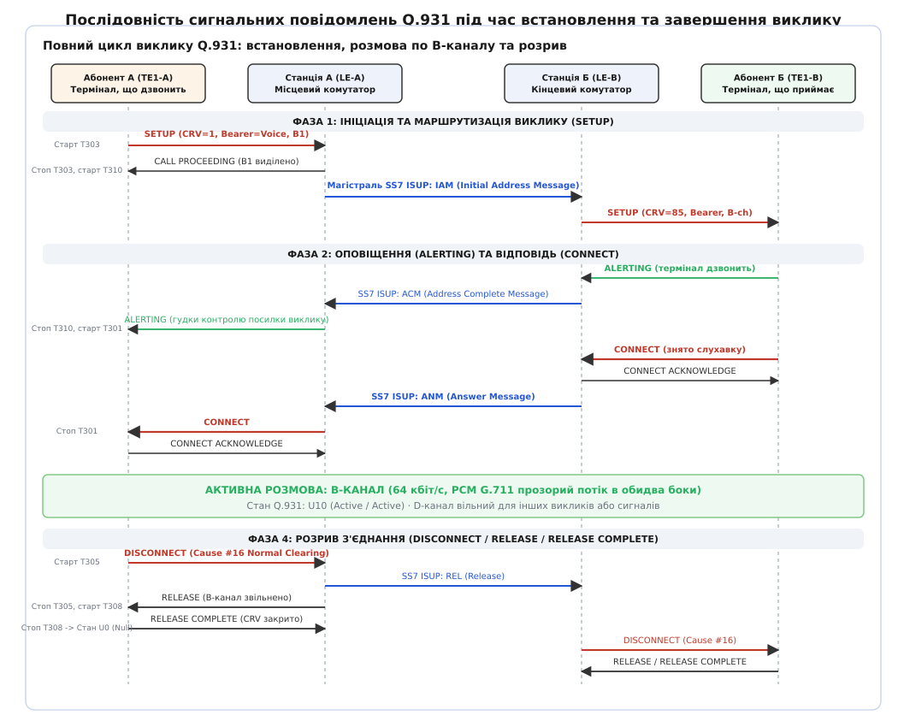

# ISDN і сигналізація Q.931: цифрова архітектура та розділення сигналізації

<preknowlist>
- [Комутація каналів проти комутації пакетів](book:communications/circuit-vs-packet-switching) — відмінність між виділенням фіксованої смуги з'єднання та незалежним передаванням датаграм.
- [Телефонна мережа й нумерація E.164](book:communications/pstn-e164) — ієрархія телефонних номерів та адресація в мережах загального користування.
- [Контроль циклічним надлишковим кодом (CRC)](book:communications/crc) — перевірка цілісності бітових кадрів на канальному рівні.
- [H.323: телефонна сигналізація ITU-T поверх пакетних мереж](book:communications/h323) — адаптація телефонних процедур комутації для передавання голосу поверх IP.
- [Протокол SIP: встановлення сеансів у IP-мережах](book:communications/sip) — текстова сигналізація встановлення мультимедійних сеансів.
</preknowlist>

1980 рік, міська телефонна мережа. Щоб з'єднати двох абонентів, станція передає команди керування прямо всередині тієї самої фізичної смуги частот від 300 до 3400 Гц, якою згодом потече людська мова. Набір номера передається або розривом струмової петлі (імпульсний набір), або тональними сигналами DTMF, а службові команди між станціями пересилаються спеціальними частотами — наприклад, сигналом 2600 Гц для захоплення міжміського транку. Таке поєднання сигналізації та голосу в одному каналі породило дві проблеми, які неможливо було усунути в межах аналогової моделі: вразливість перед стороннім втручанням (генерація тону 2600 Гц дозволяла повністю перехопити керування транком) та повільне встановлення з'єднання, яке тривало по 10–15 секунд на кожне міжміське плече. До того ж аналогова лінія не дозволяла передати жодного службового повідомлення під час активної розмови, не перервавши голос тріском або тональним писком, а швидкість передавання комп'ютерних даних через аналогові модеми впиралася в теоретичну межу Шеннона для смуги 3.1 кГц (не вище 33.6–56 кбіт/с).

Рішенням став перехід до повністю цифрової мережі інтегрального обслуговування — **ISDN** (англ. *Integrated Services Digital Network*, рекомендації ITU-T серій I та Q). Її головний архітектурний принцип полягає у **відокремленні сигналізації від даних**: фізична абонентська лінія розщеплюється на незалежні цифрові потоки, де голос чи двійкові дані передаються прозорими каналами типу **B** (англ. *Bearer* — «носій»), а всі службові команди встановлення, перемикання та розриву зв'язку транслюються окремим спільним каналом типу **D** (англ. *Data / Delta*). Протокол мережевого рівня, який керує цим процесом на D-каналі, отримав назву **ITU-T Q.931** (або I.451), і саме він заклав стандарти телефонної та мультимедійної сигналізації на наступні десятиліття.

---

### Архітектурна модель ISDN: точки прив'язки та поділ пристроїв

Абонентський доступ ISDN проєктувався як універсальний інтерфейс, здатний підключити до однієї мідної крученої пари як звичайний цифровий телефон, так і комп'ютерний термінал, факс або цілу офісну АТС. Щоб описати взаємодію обладнання різного походження, Міжнародний союз електрозв'язку (ITU-T) у рекомендації I.411 увів еталонну модель, що розділяє систему на **функціональні блоки** та **точки прив'язки** (еталонні точки, інтерфейси).


*Еталонна модель ISDN (ITU-T I.411) розмежовує пристрої користувача (TE1, TE2 через TA), внутрішню комутацію (NT2) та фізичне закінчення лінії (NT1). Інтерфейс BRI об'єднує два B-канали та один D-канал, тоді як первинний доступ PRI надає 30 B-каналів (E1) або 23 B-канали (T1).*

Обладнання на боці користувача поділяється на такі класи:
* **TE1 (Terminal Equipment type 1)** — цифровий термінал, спочатку розроблений під стандарти ISDN (цифровий системний телефон, ISDN-модем або комп'ютерна плата з підтримкою інтерфейсу S/T). Він безпосередньо підтримує протоколи рівнів L1 (I.430), L2 (LAPD Q.921) та L3 (Q.931).
* **TE2 (Terminal Equipment type 2)** — будь-яке застаріле або не-ISDN обладнання (звичайний аналоговий телефон POTS, факсимільний апарат, послідовний термінал RS-232 чи V.35).
* **TA (Terminal Adapter)** — адаптер термінала, що перетворює електричні та сигнальні параметри інтерфейсу TE2 на стандартний цифровий інтерфейс ISDN.
* **NT2 (Network Termination 2)** — інтелектуальний комутаційний пристрій приміщення користувача (офісна АТС PBX, локальний комутатор або маршрутизатор). Він виконує функції рівнів 1–3 моделі OSI: комутує внутрішні виклики між терміналами та мультиплексує зовнішні канали.
* **NT1 (Network Termination 1)** — фізичний мережевий закінчувач лінії (в європейській термінології — блок NTBA). Працює виключно на фізичному рівні (L1): перетворює 4-провідну внутрішню шину приміщення (інтерфейс S/T) у 2-провідну абонентську кручену пару оператора (інтерфейс U), забезпечує синхронізацію, живлення кінцевих апаратів і діагностичні шлейфи.

Точки спряження між цими блоками позначаються літерами латинського алфавіту:
* **Точка R (Reference)** — інтерфейс між нестандартним обладнанням TE2 і адаптером TA (наприклад, аналогова пара RJ-11 або послідовний порт RS-232).
* **Точка S (System)** — 4-провідний інтерфейс між цифровим терміналом (TE1 або TA) та офісним комутатором NT2. Інтерфейс S є пасивною шиною: до однієї 4-провідної лінії довжиною до 150–200 метрів можна паралельно під'єднати до 8 терміналів TE1.
* **Точка T (Terminal)** — 4-провідний інтерфейс між офісною АТС (NT2) та мережевим закінчувачем NT1.
* **Точка S/T** — коли офісна АТС відсутня (пряме підключення квартири чи малого офісу до станції), точки S і T функціонально зливаються в єдиний 4-провідний інтерфейс S/T.
* **Точка U (User)** — 2-провідна абонентська кручена пара між блоком NT1 і місцевою станцією оператора (Local Exchange, LE). Оскільки на двох проводах потрібно одночасно передавати 160 кбіт/с у повнодуплексному режимі на відстань до 5.5 км, у точці U застосовують адаптивне лунокомпенсування та спеціальне лінійне кодування: чотирирівневий код **2B1Q** (у Північній Америці: 2 біти на 1 символ кватернарного сигналу, рівні напруги +3V, +1V, -1V, -3V при частоті модуляції 80 кБод) або трирівневий **4B3T** (у Європі: 4 двійкові біти кодуються трьома трирівневими імпульсами). Із загального потоку 160 кбіт/с рівно 144 кбіт/с становить корисне навантаження користувача (2B+D), 12 кбіт/с — кадрова синхронізація, а 4 кбіт/с — службовий канал експлуатації та моніторингу лінії (M-channel).
* **Точка V** — внутрішній інтерфейс між станційним закінчувачем лінії (Line Termination, LT) та комутаційним полем станції (Exchange Termination, ET).

---

### Структури інтерфейсів: BRI проти PRI

ISDN стандартизує два базові рівні доступу, які відрізняються кількістю та пропускною здатністю каналів: базовий доступ для кінцевих абонентів (BRI) та первинний доступ для підключення офісних АТС і корпоративних вузлів (PRI).

#### Базовий доступ: BRI (Basic Rate Interface)

Інтерфейс BRI (позначається як **2B+D**) надає абоненту два незалежні B-канали зі швидкістю 64 кбіт/с кожен та один D-канал сигналізації зі швидкістю 16 кбіт/с. Загальна корисна швидкість становить:

```
корисна швидкість BRI = 2 · 64 кбіт/с (B-канали) + 16 кбіт/с (D-канал)
                      = 128 кбіт/с + 16 кбіт/с
                      = 144 кбіт/с
```

Кожен B-канал є повністю прозорим цифровим трактом: він передає 8000 восьмибітних відліків за секунду, що відповідає оцифрованому голосовому сигналу за стандартом PCM G.711 (8 кГц × 8 біт = 64 кбіт/с), або довільні цифрові дані. Два B-канали функціонують абсолютно незалежно: одним каналом можна вести телефонну розмову, а іншим — тримати підключення до інтернету, або ж об'єднати обидва канали за протоколом Multilink PPP для отримання суцільного інтернет-каналу 128 кбіт/с.

На фізичному 4-провідному інтерфейсі S/T (рекомендація ITU-T I.430) кадри передаються зі швидкістю 192 кбіт/с. Фізичний кадр містить 48 бітів і передається кожні 250 мікросекунд (рівно 4000 кадрів за секунду):

```
загальна лінійна швидкість S/T = 48 бітів / 0.000250 с
                               = 192000 біт/с = 192 кбіт/с
```

Різниця між 192 та 144 кбіт/с (рівно 48 кбіт/с) віддана під службові потреби: біти кадрової синхронізації (F-біт), біти балансування постійної складової (L-біти), біти активації (A-біт) та спеціальні біти відлуння D-каналу (Echo bits, біти E).

Біти E відіграють вирішальну роль у роботі пасивної шини S: оскільки до однієї лінії підключено до 8 терміналів, вони використовують доступ **CSMA/CR (Carrier Sense Multiple Access with Contention Resolution)**. Коли термінал хоче передати сигнальний кадр у D-каналі, він спочатку слухає лінію. За відсутності активності лінія перебуває в пасивному стані «1» (відсутність напруги). Термінал відраховує поспіль задану кількість одиничних бітів: для сигнальних повідомлень високого пріоритету (Q.931) лічильник дорівнює 8, а для низькопріоритетних пакетів даних (X.25) — 10.

Коли лічильник досягає порогу, термінал починає передавати біти свого кадру. Блок NT1, приймаючи кожен біт D-каналу від терміналів, миттєво ретранслює його назад у шину як біт відлуння E. Оскільки логічний «0» формується активним імпульсом напруги (мажоритарний стан), будь-який нуль перекриває одиницю. Якщо термінал передав біт 1, а отримав біт E = 0, він розуміє, що інший апарат одночасно передає пріоритетніший кадр. Термінал, що програв змагання, негайно замовкає на наступному біті, не спотворюючи чужий кадр, скидає свій лічильник і чекає звільнення лінії. Щоб уникнути монополізації лінії одним терміналом, після кожного успішно переданого кадру пристрій тимчасово збільшує свій поріг очікування на одиницю (з 8 до 9), надаючи іншим терміналам гарантований пріоритет на наступну транзакцію.

#### Первинний доступ: PRI (Primary Rate Interface)

Первинний доступ PRI розрахований на підключення корпоративних АТС до телефонної станції оператора за допомогою цифрових магістральних ліній E1 або T1:
* **E1 PRI (Європейський та міжнародний стандарт ITU-T I.431)**: потік 2.048 Мбіт/с, розділений методом часового мультиплексування (TDM) на 32 таймслоти по 64 кбіт/с. Структура інтерфейсу має вигляд **30B+D**: таймслот 0 виділено під кадрову синхронізацію (FAS) та контроль цілісності CRC-4, таймслот 16 є повношвидкісним D-каналом сигналізації 64 кбіт/с, а таймслоти 1–15 та 17–31 надають 30 B-каналів під розмови або дані.
* **T1 PRI (Північноамериканський стандарт ANSI / Bellcore)**: потік 1.544 Мбіт/с зі структурою **23B+D**. Кадр містить 24 таймслоти по 64 кбіт/с плюс 1 біт синхронізації на кожні 193 біти кадру (8 кбіт/с службових). Таймслот 24 виділено під D-канал 64 кбіт/с, а таймслоти 1–23 є B-каналами.

Для великих корпоративних вузлів з десятками потоків PRI застосовують механізм **NFAS (Non-Facility Associated Signaling)**: один сигнальний D-канал на первинному транку контролює B-канали на кількох сусідніх лініях T1/E1 (наприклад, 1 D-канал керує 479 B-каналами на 20 транках T1 з одним резервним D-каналом Backup для відмовостійкості).

---

### Стек сигналізації D-каналу: взаємодія LAPD та Q.931

Керування всіма викликами на інтерфейсі ISDN здійснюється виключно через D-канал. Цей канал має трирівневу ієрархію протоколів моделі OSI.


*Стек протоколів D-каналу: фізичний рівень I.430/I.431 передає кадри LAPD (Q.921), всередині яких міститься заголовок Q.931 (Protocol Discriminator 0x08, посилання виклику CRV, тип повідомлення) та набір інформаційних елементів TLV.*

#### Рівень 2: Протокол LAPD (ITU-T Q.920 / Q.921)

Канальний рівень на D-каналі обслуговується протоколом **LAPD** (англ. *Link Access Procedure on the D-channel*), що є розвитком сімейства HDLC. LAPD забезпечує гарантовану доставку сигнальних повідомлень із захистом від спотворень, втрат і дублювання за допомогою контрольної суми CRC-16 та ковзного вікна нумерації кадрів.

Кадр LAPD обмежується байтами-прапорцями `0x7E` (`01111110`) та має двобайтове поле адреси, що містить два ключові ідентифікатори:
1. **SAPI (Service Access Point Identifier, 6 бітів)** — визначає тип вищого протоколу, якому належить корисне навантаження кадру:
   * `SAPI = 0` — сигналізація керування викликами (пакети Q.931);
   * `SAPI = 16` — передавання пакетних даних користувача (X.25 через D-канал);
   * `SAPI = 63` — процедури керування термінальними ідентифікаторами TEI.
2. **TEI (Terminal Endpoint Identifier, 7 бітів)** — унікальна адреса кінцевого пристрою на пасивній шині:
   * `TEI = 0` — фіксована адреса для з'єднань «точка-точка» (завжди використовується на лініях PRI та PBX);
   * `TEI = 64`..`126` — динамічні адреси, які станція автоматично виділяє терміналам BRI під час підключення до шини за допомогою спеціальних повідомлень `Identity Request` та `Identity Assigned` на `SAPI = 63`;
   * `TEI = 127` — широкомовна адреса (Broadcast) для надсилання повідомлення всім пристроям на шині одночасно (наприклад, вхідний виклик `SETUP`).

Кадри LAPD поділяються на три типи:
* **I-кадри (Information frames)**: переносять корисне навантаження L3 (пакети Q.931) із двома порядковими номерами: `N(S)` (номер надісланого кадру) та `N(R)` (номер очікуваного кадру від співрозмовника, що одночасно слугує підтвердженням прийому). Для ліній BRI розмір ковзного вікна зазвичай встановлюється в `k = 1` (режим Stop-and-Wait), а для високошвидкісних ліній PRI — `k = 7`.
* **S-кадри (Supervisory frames)**: керують потоком та підтвердженнями без передавання даних: `RR` (Receive Ready — квитування прийому та готовність до нових даних), `RNR` (Receive Not Ready — тимчасове призупинення потоку через переповнення буферів), `REJ` (Reject — запит повторного передавання кадрів, починаючи з номера `N(R)`).
* **U-кадри (Unnumbered frames)**: використовуються для встановлення та скидання логічного канального з'єднання: `SABME` (Set Asynchronous Balanced Mode Extended — запит переходу в режим нумерованих I-кадрів), `UA` (Unnumbered Acknowledgment — позитивна відповідь), `DISC` (Disconnect — розрив логічного каналу), `DM` (Disconnected Mode — відповідь на спробу передавання даних у відключеному стані).

---

### Структура повідомлень Q.931 та інформаційні елементи (IE)

Повідомлення третього рівня Q.931 розташовується всередині інформаційного поля I-кадру LAPD. Його структура складається з трьох обов'язкових полів заголовка та списку інформаційних елементів змінної довжини:

1. **Protocol Discriminator (1 байт)**: для сигналізації керування викликами ISDN має фіксоване значення `0x08` (`0000 1000`). Якщо термінал отримує відмітник `0x03`, пакет спрямовується до стека X.25, а діапазон `0x40`–`0x4F` обробляється стеком додаткових послуг Q.932.
2. **Call Reference (від 1 до 3 байтів)**: локальний ідентифікатор виклику. Перший байт задає довжину (для BRI — 1 байт, для PRI — 2 байти). Наступні байти містять значення посилання виклику (Call Reference Value, CRV), причому найстарший біт першого октету є прапорцем напрямку (Flag): `0` — повідомлення надіслане ініціатором виклику (Originator), `1` — повідомлення надіслане у відповідь ініціатору (Destination). Значення CRV існує лише протягом тривалості виклику й вивільняється після завершення. Довжина `0x00` позначає фіктивне посилання виклику (Dummy CRV) для системних сповіщень на рівні лінії.
3. **Message Type (1 байт)**: визначає команду протоколу (наприклад, `0x05` для `SETUP`, `0x07` для `CONNECT`, `0x45` для `DISCONNECT`). Найстарший біт завжди зарезервований як `0`.
4. **Information Elements (IE)**: параметри виклику, організовані за принципом TLV (Type-Length-Value).

#### Ключові інформаційні елементи (IE)

Кожен інформаційний елемент передає окремий параметр з'єднання. Повний синтаксис та бітові маски всіх елементів зафіксовано в окремому документі — [довідник повідомлень, інформаційних елементів та кодів Cause сигналізації Q.931](book:communications/protocols/isdn-q931/api-q931-messages.md), тоді як нижче розібрано їхній системний зміст:

* **Bearer Capability (IE `0x04`)**: фундаментальний елемент, що визначає тип послуги. Він вказує станції, чи виклик є голосовим телефонним дзвінком (**Speech** або **3.1 kHz Audio** — станція має право вмикати лунопригнічувачі й застосовувати голосові кодеки), чи передаванням двійкових даних (**Unrestricted Digital Information, 64 kbit/s** — мережі суворо заборонено модифікувати біти, а будь-яка цифрова обробка відключається). Відсутність цього елемента в `SETUP` призводить до негайного відхилення виклику з кодом Cause 96 (`Mandatory information element is missing`).
* **Channel Identification (IE `0x18`)**: визначає, який саме B-канал запитується або виділяється. Прапорець **Preferred / Exclusive** визначає поведінку комутатора: якщо встановлено Preferred, станція може призначити інший вільний канал у разі зайнятості запитаного; якщо встановлено Exclusive — виклик буде відхилено з Cause 34 (`No circuit/channel available`), якщо запитаний канал недоступний.
* **Calling Party Number (IE `0x6C`) та Called Party Number (IE `0x70`)**: передають телефонні номери у форматі ITU-T E.164. Елемент містить біти типу номера (Type of Number, TON — міжнародний, національний, місцевий), план нумерації (NPI — ISDN E.164) та біти дозволу показу номера (Presentation Indicator — послуги визначника номера CLIP та антивизначника CLIR).
* **Cause (IE `0x08`)**: стандартизований за рекомендацією ITU-T Q.850 діагностичний код, що пояснює причину завершення виклику або відмови (наприклад, Cause 16 — нормальне завершення розмови, Cause 17 — абонент зайнятий, Cause 34 — немає вільних B-каналів).
* **Progress Indicator (IE `0x1E`)**: вказує на перехід виклику в не-ISDN середовище або наявність внутрішньосмугового сигналу (наприклад, голосового повідомлення автовідповідача чи станційного інформування про аварію).

---

### Програмний розбір бінарних кадрів Q.931

Для обробки сигналізації на мікроконтролері шлюзу або в драйвері плати телефонії необхідно безпечно декодувати сирий бінарний буфер D-каналу без виходу за межі пам'яті. Нижче наведено ідіоматичні реалізації розбирача структури Q.931 мовами C та C++.

:::tabs
```c
#include <stdint.h>
#include <stdbool.h>
#include <stddef.h>

#define Q931_PROTO_DISC_CALL_CONTROL 0x08

typedef struct {
    uint8_t  ie_id;
    uint8_t  length;
    const uint8_t *data;
} q931_ie_t;

typedef struct {
    uint8_t  protocol_discriminator;
    uint16_t call_reference_value;
    bool     call_ref_flag_destination;
    uint8_t  message_type;
    size_t   payload_offset;
} q931_header_t;

/* Безпечний розбір заголовка Q.931 з перевіркою меж буфера */
bool q931_parse_header(const uint8_t *buf, size_t len, q931_header_t *hdr) {
    if (!buf || len < 3 || !hdr) {
        return false;
    }

    hdr->protocol_discriminator = buf[0];
    if (hdr->protocol_discriminator != Q931_PROTO_DISC_CALL_CONTROL) {
        return false;
    }

    uint8_t cr_len = buf[1] & 0x0F;
    if (cr_len == 0) {
        /* Фіктивне посилання виклику (Dummy CRV) */
        hdr->call_reference_value = 0;
        hdr->call_ref_flag_destination = false;
        if (len < 3) return false;
        hdr->message_type = buf[2];
        hdr->payload_offset = 3;
        return true;
    } else if (cr_len == 1) {
        if (len < 4) return false;
        hdr->call_ref_flag_destination = (buf[2] & 0x80) != 0;
        hdr->call_reference_value = buf[2] & 0x7F;
        hdr->message_type = buf[3];
        hdr->payload_offset = 4;
        return true;
    } else if (cr_len == 2) {
        if (len < 5) return false;
        hdr->call_ref_flag_destination = (buf[2] & 0x80) != 0;
        hdr->call_reference_value = ((uint16_t)(buf[2] & 0x7F) << 8) | buf[3];
        hdr->message_type = buf[4];
        hdr->payload_offset = 5;
        return true;
    }

    return false; /* Непідтримувана довжина CRV */
}

/* Ітератор інформаційних елементів (IE) TLV */
bool q931_next_ie(const uint8_t *buf, size_t len, size_t *offset, q931_ie_t *ie) {
    if (!buf || !offset || !ie || *offset >= len) {
        return false;
    }

    uint8_t first = buf[*offset];
    if (first & 0x80) {
        /* Однобайтовий IE (Single-octet IE) */
        ie->ie_id = first & 0xF0;
        ie->length = 1;
        ie->data = &buf[*offset];
        *offset += 1;
        return true;
    }

    /* Багатобайтовий IE змінної довжини (TLV) */
    if (*offset + 2 > len) {
        return false; /* Пошкоджений пакет */
    }

    ie->ie_id = first;
    ie->length = buf[*offset + 1];
    *offset += 2;

    if (*offset + ie->length > len) {
        return false; /* Довжина виходить за межі буфера */
    }

    ie->data = &buf[*offset];
    *offset += ie->length;
    return true;
}
```
```cpp
#include <cstdint>
#include <cstddef>
#include <span>
#include <optional>
#include <string_view>

namespace isdn {

inline constexpr uint8_t ProtocolDiscriminatorQ931 = 0x08;

struct InformationElement {
    uint8_t ie_id{0};
    bool single_octet{false};
    std::span<const uint8_t> payload{};
};

struct Q931Header {
    uint8_t protocol_discriminator{0};
    uint16_t call_reference{0};
    bool flag_destination{false};
    uint8_t message_type{0};
    std::span<const uint8_t> ie_block{};
};

/* Ідіоматичний нуль-копійний розбір повідомлення Q.931 */
[[nodiscard]] constexpr std::optional<Q931Header> parse_header(std::span<const uint8_t> frame) noexcept {
    if (frame.size() < 3) return std::nullopt;

    if (frame[0] != ProtocolDiscriminatorQ931) {
        return std::nullopt;
    }

    const uint8_t cr_len = frame[1] & 0x0F;
    Q931Header hdr{};
    hdr.protocol_discriminator = frame[0];

    if (cr_len == 0) {
        hdr.call_reference = 0;
        hdr.flag_destination = false;
        hdr.message_type = frame[2];
        hdr.ie_block = frame.subspan(3);
        return hdr;
    }

    if (cr_len == 1) {
        if (frame.size() < 4) return std::nullopt;
        hdr.flag_destination = (frame[2] & 0x80) != 0;
        hdr.call_reference = frame[2] & 0x7F;
        hdr.message_type = frame[3];
        hdr.ie_block = frame.subspan(4);
        return hdr;
    }

    if (cr_len == 2) {
        if (frame.size() < 5) return std::nullopt;
        hdr.flag_destination = (frame[2] & 0x80) != 0;
        hdr.call_reference = (static_cast<uint16_t>(frame[2] & 0x7F) << 8) | frame[3];
        hdr.message_type = frame[4];
        hdr.ie_block = frame.subspan(5);
        return hdr;
    }

    return std::nullopt;
}

/* Генератор-ітератор інформаційних елементів */
class IEParser {
public:
    explicit constexpr IEParser(std::span<const uint8_t> data) noexcept : remaining_(data) {}

    [[nodiscard]] std::optional<InformationElement> next() noexcept {
        if (remaining_.empty()) return std::nullopt;

        const uint8_t first = remaining_[0];
        if (first & 0x80) {
            InformationElement ie{
                .ie_id = static_cast<uint8_t>(first & 0xF0),
                .single_octet = true,
                .payload = remaining_.subspan(0, 1)
            };
            remaining_ = remaining_.subspan(1);
            return ie;
        }

        if (remaining_.size() < 2) return std::nullopt;

        const uint8_t len = remaining_[1];
        if (remaining_.size() < 2U + len) return std::nullopt;

        InformationElement ie{
            .ie_id = first,
            .single_octet = false,
            .payload = remaining_.subspan(2, len)
        };
        remaining_ = remaining_.subspan(2U + len);
        return ie;
    }

private:
    std::span<const uint8_t> remaining_;
};

} // namespace isdn
```
:::

---

### Життєвий цикл виклику: діаграма обміну, крайові випадки та таймери

Встановлення, підтримка та розрив телефонного з'єднання виконуються як строго визначена послідовність переходів станового автомата. Кожна сторона (термінал користувача — стан `U`, комутатор мережі — стан `N`) підтримує власну станову машину.


*Повний цикл виклику Q.931: обмін повідомленнями SETUP, CALL PROCEEDING, ALERTING, CONNECT переводить B-канал у режим передавання даних (стан U10), а послідовність DISCONNECT, RELEASE, RELEASE COMPLETE коректно звільняє B-канал і закриває посилання виклику.*

#### Покроковий процес встановлення виклику

1. **Ініціація виклику (`SETUP`)**:
   Термінал абонента А генерує унікальне посилання виклику (наприклад, `CRV = 1`, Flag = `0`) і надсилає повідомлення `SETUP` у D-каналі до місцевої станції LE-A. У повідомленні передаються тип послуги (Bearer Capability: голос G.711), бажаний B-канал (Channel ID: B1 Preferred) та номер адресата (Called Party Number). Одночасно термінал запускає захисний таймер **T303** (4 секунди).
2. **Підтвердження та виділення B-каналу (`CALL PROCEEDING`)**:
   Станція LE-A перевіряє права абонента, призначає конкретний фізичний B-канал і надсилає назад повідомлення `CALL PROCEEDING`. Термінал зупиняє таймер T303 і запускає таймер маршрутизації **T310** (10–40 с). Стан виклику переходить у `U3` (Out-going Call Proceeding).
3. **Магістральна маршрутизація (SS7 ISUP)**:
   Станція LE-A транслює параметри виклику в магістральну мережу загального користування за допомогою протоколу SS7 ISUP у вигляді повідомлення `IAM` (Initial Address Message). Магістраль знаходить кінцеву станцію LE-B, яка надсилає повідомлення `SETUP` через D-канал викликаного термінала Б (зі значенням `CRV = 85`, Flag = `0`).
4. **Оповіщення про виклик (`ALERTING`)**:
   Термінал Б починає генерацію дзвінка та повертає повідомлення `ALERTING`. Станція LE-B надсилає в магістраль повідомлення ISUP `ACM` (Address Complete Message), а станція LE-A надсилає `ALERTING` ініціатору А. Термінал А зупиняє таймер T310, переходить у стан `U4` (Call Delivered) і запускає таймер очікування відповіді **T301** (180 секунд), підключаючи свій динамік до тону контролю посилки виклику.
5. **Відповідь абонента (`CONNECT` та `CONNECT ACKNOWLEDGE`)**:
   Користувач Б знімає слухавку. Термінал Б надсилає повідомлення `CONNECT`. Станція LE-B відповідає повідомленням `CONNECT ACKNOWLEDGE` і шле в магістраль ISUP `ANM` (Answer Message). Станція LE-A надсилає `CONNECT` терміналу А, який квитує його повідомленням `CONNECT ACKNOWLEDGE`.
6. **Активна фаза розмови (Стан `U10 / N10 Active`)**:
   Обидва термінали комутують свої аудіокодеки безпосередньо на призначений B-канал (64 кбіт/с неперервного PCM-потоку). D-канал повністю вивільняється і залишається вільним для сигналізації наступних викликів або передавання службових сповіщень.

#### Процедура розриву з'єднання (Teardown)

1. Абонент А кладе слухавку. Термінал А надсилає повідомлення `DISCONNECT` із кодом причини Cause 16 (`Normal call clearing`), негайно відключає аудіо від B-каналу та запускає таймер **T305** (4 секунди).
2. Станція LE-A звільняє комутаційне поле, посилає в магістраль ISUP `REL` (Release) і повертає терміналу А повідомлення `RELEASE`.
3. Термінал А зупиняє таймер T305, надсилає фінальне підтвердження `RELEASE COMPLETE` і переводить свій становий автомат у початковий стан `U0` (Null), вивільняючи номер `CRV = 1`.
4. Станція LE-A отримує `RELEASE COMPLETE`, вивільняє значення CRV та остаточно повертає призначений B-канал у пул вільних каналів.
5. На протилежному боці станція LE-B надсилає `DISCONNECT` терміналу Б, який відповідає повідомленням `RELEASE` і після отримання `RELEASE COMPLETE` також скидає стан у `U0`.

---

### Крайові випадки та механізми захисту станового автомата

У реальній мережі виникають нештатні ситуації, для обробки яких у Q.931 закладено спеціальні алгоритми:

#### 1. Зіткнення викликів (Glare / Dual Seizure)

Ситуація «Glare» виникає, коли термінал користувача і станція одночасно надсилають повідомлення `SETUP` назустріч одне одному, намагаючись зайняти один і той самий B-канал. Для вирішення цього конфлікту Q.931 встановлює чітку асиметрію: **мережа завжди має безумовний пріоритет**. Якщо в обох `SETUP` B-канал запитано в режимі Exclusive, термінал зобов'язаний відмовитися від власної спроби виклику, звільнити свій внутрішній стан і відповісти на вхідний виклик станції. Якщо ж термінал запитував канал у режимі Preferred, станція призначає йому інший B-канал у відповіді `CALL PROCEEDING`, дозволяючи успішно встановити обидва виклики паралельно.

#### 2. Поцифровий набір (Overlap Sending) проти блочного набору (En-bloc)

При звичайному блочному наборі (En-bloc) термінал накопичує всі цифри номера у власному буфері та відправляє їх в одному повідомленні `SETUP` разом із прапорцем `Sending Complete` (IE `0xA1`). При поцифровому наборі (Overlap) термінал надсилає `SETUP` лише з першими набраними цифрами. Станція відповідає повідомленням `SETUP ACKNOWLEDGE` і запускає таймер міжцифрового інтервалу **T302** (15 секунд). Користувач продовжує набирати цифри, і термінал передає кожну наступну цифру в окремому повідомленні `INFORMATION`. Щойно станція отримує достатню кількість цифр для однозначної маршрутизації за таблицею номерних префіксів, вона надсилає `CALL PROCEEDING`, перериваючи стан Overlap.

#### 3. Багатоабонентська лінія (MSN) та прямий набір (DID/DDI)

На пасивній шині BRI до однієї лінії підключають до 8 терміналів, яким оператор призначає кілька різних міських номерів (послуга **MSN — Multiple Subscriber Number**). Коли на станцію надходить вхідний дзвінок, вона формує широкомовний кадр LAPD (`TEI = 127`) із повідомленням `SETUP`, де в полі `Called Party Number` вказано конкретний номер MSN. Усі 8 терміналів на шині одночасно приймають цей пакет і порівнюють номер із власними налаштуваннями: відповідний термінал надсилає `ALERTING`, а решта 7 апаратів просто ігнорують пакет.

У первинному доступі PRI аналогічну функцію виконує послуга **DID (Direct Inward Dialing)** / **DDI**: оператор транслює останні 3–4 цифри номера безпосередньо в офісну АТС (NT2), яка самостійно комутує виклик на потрібний внутрішній номер співробітника без участі оператора-секретаря.

#### 4. Внутрішньосмугові тони та аварійне відновлення за таймерами

Якщо під час виклику виникає помилка в магістралі (наприклад, номер змінено або лінія перевантажена), станція може підключити абонента до внутрішньосмугового голосового інформатора. Для цього станція надсилає повідомлення `PROGRESS` або `DISCONNECT` з інформаційним елементом **Progress Indicator (IE `0x1E`)**, що містить значення `0x08` (*In-band information available*). Побачивши цей прапорець, термінал не розриває з'єднання миттєво, а негайно підключає свій динамік до B-каналу, даючи абоненту змогу прослухати голосове повідомлення оператора або стандартні короткі гудки «зайнято».

Якщо зв'язок на канальному рівні L2 раптово падає під час активної розмови (стан U10), термінал не скидає дзвінок негайно, а запускає таймер **T309** (60–90 секунд). Якщо протягом цього інтервалу вдається відновити LAPD-лінк за допомогою обміну кадрами `SABME`/`UA`, телефонна розмова на B-каналі продовжується без переривання.

---

### Спадщина Q.931 у сучасних мережах зв'язку

Хоча фізичні лінії ISDN BRI поступово витісняються широкосмуговим доступом Ethernet та оптичними лініями, протокол Q.931 залишив фундаментальний слід у телекомунікаційній індустрії. Архітектурні концепції та бінарні структури Q.931 були безпосередньо перенесені у сучасні протоколи:

```
ISDN Q.931 (L3 D-канал)  ──>  H.323 H.225.0 (TCP 1720)  ──>  SIP (RFC 3261)
───────────────────────        ────────────────────────       ───────────────
SETUP                          SETUP                          INVITE
CALL PROCEEDING                CALL PROCEEDING                100 Trying
ALERTING                       ALERTING                       180 Ringing
CONNECT                        CONNECT                        200 OK
CONNECT ACKNOWLEDGE            CONNECT ACKNOWLEDGE            ACK
DISCONNECT                     RELEASE COMPLETE               BYE / CANCEL
Cause Codes (Q.850)     ──>    Q.850 в ASN.1 PER        ──>  SIP Status Codes
                                                             (4xx / 5xx / 6xx)
```

1. **H.323 (Рекомендація ITU-T H.225.0)**: перший загальноприйнятий стандарт передавання голосу поверх IP (VoIP) безпосередньо скопіював станову машину та повідомлення Q.931. Канал сигналізації виклику H.225.0 встановлює надійне TCP-з'єднання на порт 1720 і передає ті самі пакети `SETUP`, `CALL PROCEEDING`, `ALERTING` та `CONNECT`, закодовані двійковими правилами ASN.1 PER.
2. **Магістральна сигналізація SS7 ISUP**: протокол підсистеми користувача ISDN (ISUP), що керує комутацією телефонних станцій усього світу, спроєктований для прямого взаємного відображення 1:1 з повідомленнями Q.931 (`SETUP` ↔ `IAM`, `ALERTING` ↔ `ACM`, `CONNECT` ↔ `ANM`, `DISCONNECT` ↔ `REL`).
3. **Протокол SIP (Session Initiation Protocol)**: хоча IETF обрав для SIP текстовий формат у стилі HTTP, логіка сеансів повністю успадкувала модель ISDN. Кожен VoIP-шлюз або прикордонний контролер сесій (SBC), який зв'язує сучасні хмарні IP-АТС із цифровими транками PRI, виконує трансляцію кодів завершення Q.931/Q.850 у числові відповіді SIP (наприклад, Q.931 Cause 17 `User Busy` транслюється у `486 Busy Here`, Cause 1 `Unallocated Number` — у `404 Not Found`, а Cause 34 `No Circuit Available` — у `503 Service Unavailable`), передаючи оригінальний код ISDN у заголовку `Reason: Q.850;cause=16`.
