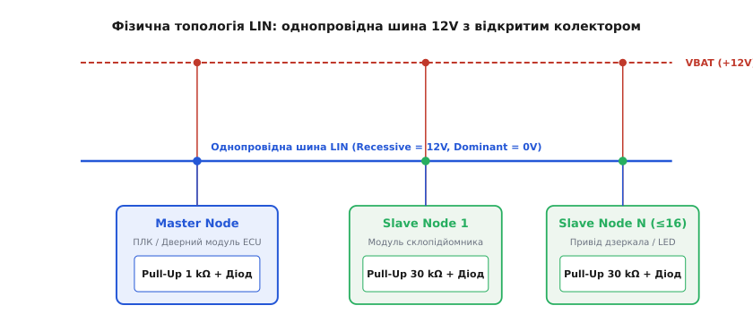
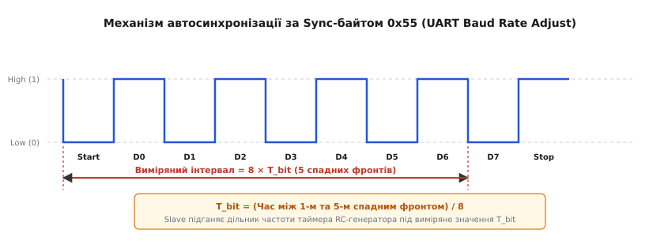
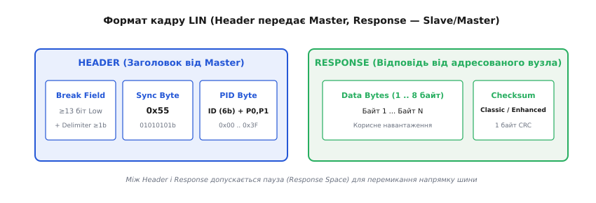
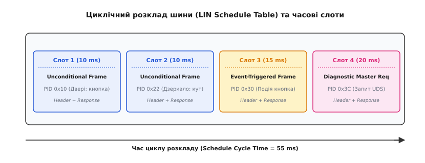

# LIN Bus: локальна мережа автомобільних підсистем

<preknowlist>
- [Кадр UART](topic:communications/uart-frame) — формат послідовного кадру: стартовий біт, 8 біт даних, паритет і стоповий біт.
- [Арбітраж CAN](topic:communications/can-arbitration) — автомобільна шина вищого рівня з довільним доступом та пріоритезацією.
- [Відкритий колектор](topic:electronics/open-collector) — каскад виходу для об'єднання сигналів на спільній лінії.
</preknowlist>

Сучасні двері автомобіля містять цілу мережу електронних компонентів: мікроконтролер склопідйомника з захистом від защемлення, електроприводи та підігрів бічного дзеркала, повторювач повороту, механізм центрального замка, кнопки вибору положення та стрічку атмосферного LED-освітлення. Підключення кожного з цих периферійних вузлів безпосередньо до центральної шини CAN створює неприйнятні економічні та технологічні витрати: кожен вузол вимагав би дорогого двопровідного трансивера диференційного сигналу, окремого апаратного контролера протоколу та високоточного кварцового резонатора. Крім того, прокладання джгутів з десятків витих пар збільшує масу автомобіля та ускладнює монтаж на конвеєрі. Протокол LIN (Local Interconnect Network) вирішує цю проблему шляхом створення однопровідної локальної підмережі під керуванням одного Master-вузла, де до 16 дешевих Slave-пристроїв працюють на базі звичайних внутрішніх RC-генераторів без кварцових резонаторів.

---

## Фізичний рівень та електрична топологія

Електричний шар LIN розроблено з розрахунком на граничне спрощення апаратної частини вузлів та забезпечення високої стійкості до жорстких умов автомобільного бортового живлення (номінально 12 V, із робочим діапазоном від 8 V до 18 V).


*Фізичний рівень LIN: один дріт 12V з відкритим колектором та резисторами підтяжки (1 kΩ Master, 30 kΩ Slave).*

Усі вузли мережі підключаються паралельно до єдиного провідника шини LIN. Вихідний каскад кожного трансивера побудовано за схемою з відкритим колектором (або відкритим стоком) з інверсією сигналу та захисним діодом.

### Сигнальні рівні та стани шини

На відміну від диференційного сигналу CAN, шина LIN використовує однопровідну передачу з опорним потенціалом відносно спільної маси (GND) автомобіля:
1. **Рецесивний стан (Recessive / Логічна 1):** Транзистор вихідного каскаду закритий. Напруга на шині підтягується до напруги акумулятора `VBAT` через внутрішні резистори підтяжки. Рівень напруги на шині становить понад 85 % від `VBAT` (типово 12 V).
2. **Домінантний стан (Dominant / Логічний 0):** Транзистор вихідного каскаду відкритий і підтягує шину до потенціалу маси (GND). Рівень напруги на шині не перевищує 15 % від `VBAT` (типово 0 V .. 1.5 V).

Оскільки будь-який вузол, відкриваючи свій транзистор, примусово переводить всю шину в домінантний стан, на шині реалізується логічна функція **«Монтажне І» (Wired-AND)** для інверсних сигналів. Домінантний стан завжди превалює над рецесивним.

### Схемотехніка підтяжки та захисні діоди

Для забезпечення коректної роботи без зовнішніх термінаторів резистори підтяжки вбудовано безпосередньо в трансивери вузлів:
- **Master-вузол:** Містить резистор підтяжки опором `1 kΩ`, підключений послідовно з захисним діодом до шини живлення `VBAT`.
- **Slave-вузол:** Містить резистор підтяжки опором `30 kΩ`, також підключений послідовно з діодом до `VBAT`.

Паралельне підключення одного Master-вузла (`1 kΩ`) та, наприклад, восьми Slave-вузлів (`30 kΩ` кожен) формує сумарний еквівалентний опір підтяжки шини близько `750 Ω`. Це забезпечує швидкий фронт наростання сигналу при переході з домінантного стану в рецесивний.

Послідовний діод у колі підтяжки відіграє критичну роль у безпеці автомобільної електроніки: у разі втрати локального контакту з масою (GND) окремим Slave-модулем діод блокує зворотний струм від шини LIN через внутрішні кола мікроконтролера до бортової мережі, запобігаючи вигоранню суміжних компонентів.

Крім того, трансивери LIN проектуються з розрахунком на стійкість до зсуву потенціалів маси між різними блоками кузова (Ground Shift Tolerance). Допустимий зсув потенціалу GND між Master та Slave-вузлами становить до ±11.5 % від напруги живлення `VBAT`, що гарантує надійний прийом сигналів при проходженні великих струмів через металевий кузов автомобіля.

### Обмеження швидкості та контроль швидкості наростання (Slew Rate)

Максимальна швидкість передачі даних у шині LIN обмежена значенням **20 кбіт/с** (найчастіше застосовуються стандартні швидкості 19.2 кбіт/с та 9.6 кбіт/с). Це обмеження не є недоліком апаратури, а є свідомим інженерним рішенням.

Оскільки шина LIN використовує однопровідну неекрановану лінію великої довжини (до 40 метрів), круті прямокутні фронти цифрового сигналу викликали б високий рівень електромагнітного випромінювання (EMC) та наводки на сусідні аудіо- та радіочастотні джгути. Завдяки обмеженню швидкості до 20 кбіт/с трансивери LIN застосовують спеціальні внутрішні формувачі крутизни фронтів (Slew Rate Control), які згладжують переходи між `0` та `1` у трапецеїдальну форму з часом наростання від 1 до 5 мікросекунд. Це дозволяє повністю відповідати суворим автомобільним стандартам електромагнітної сумісності (CISPR-25) без використання витих пар та екранування.

---

## Автосинхронізація Slave-вузлів без кварцових резонаторів

Найбільший внесок стандарту LIN у здешевлення периферійних модулів полягає у відмові від високоточних кварцових або керамічних резонаторів на боці Slave-вузлів. Застосування вбудованих у мікроконтролер RC-генераторів зменшує вартість компонентів і площу друкованої плати, але викликає проблему термодрейфу та розкиду частоти тактування до ±14 %.


*Схемотехніка автосинхронізації: вимірювання 8-бітового інтервалу між 5 спадними фронтами байта 0x55.*

Для подолання дрейфу частоти LIN використовує механізм динамічної автосинхронізації під час кожного кадру.

### Алгоритм автосинхронізації Sync Byte `0x55`

Кожен кадр, що надсилається Master-вузлом, обов'язково містить поле синхронізації (Sync Byte) зі значенням `0x55`. У стандартному форматі кадру UART (1 стартовий біт, 8 біт даних LSB first, 1 стоповий біт) двійкове значення `0x55` (`01010101b`) формує сувору послідовність меандру:

```
Початковий стан: HIGH (Рецесивний)
- Start Bit: LOW  (1-й спадний фронт)
- Bit 0 (1): HIGH
- Bit 1 (0): LOW  (2-й спадний фронт)
- Bit 2 (1): HIGH
- Bit 3 (0): LOW  (3-й спадний фронт)
- Bit 4 (1): HIGH
- Bit 5 (0): LOW  (4-й спадний фронт)
- Bit 6 (1): HIGH
- Bit 7 (0): LOW  (5-й спадний фронт)
- Stop Bit : HIGH
```

Slave-вузол використовує апаратний модуль таймера-захоплення (Input Capture) для вимірювання часу між першим та п'ятим спадним фронтом сигналу. Цей інтервал охоплює рівно 8 бітових періодів (`8 × T_bit`).

Отримавши виміряну кількість тактових імпульсів власного RC-генератора `N_ticks`, Slave-мікроконтролер обчислює точну тривалість одного біта для даного кадру:

```
T_bit = N_ticks / 8
```

На основі обчисленого значення `T_bit` мікроконтролер Slave негайно коригує коефіцієнт ділення регістру Baud Rate Generator свого UART-периферійного модуля перед прийомом наступних байтів PID та Data.

### Бюджет часових допусків

Завдяки процедурі автосинхронізації вимоги до тактових генераторів розділяються на два рівні:
- **Master-вузол:** Забов'язаний мати точність тактування не гірше **±0.5 %**, що вимагає використання кварцового резонатора.
- **Slave-вузол:** Може мати початкову відхиленість тактування RC-генератора до **±14.0 %** (враховуючи технологічний розкид та температуру від -40 °C до +125 °C). Після прийому байта `0x55` залишкова помилка синхронізації Slave не перевищує **±1.5 %**, що гарантує надійний прийом решти 8-10 байтів кадру без зсуву стробування.

---

## Анатомія кадру LIN та захищений ідентифікатор

Кожна транзакція на шині LIN називається кадром (Frame). Кадр чітко розділено на дві функціональні частини: **Заголовок (Header)** та **Відповідь (Response)**.


*Структура кадру LIN: Header (Break, Sync 0x55, PID) від Master та Response (Data, Checksum) від відповідального вузла.*

Заголовок завжди генерує та передає в шину тільки Master-вузол. Відповідь передається або одним із Slave-вузлів, або самим Master-вузлом (якщо Master передає уставку керування).

Детальні математичні матриці обчислення паритету та контрольних сум наведено у вставці [📋 Специфікація полів кадру LIN та розрахунок PID і Checksum](topic:communications/lin-bus/api-lin-frame-spec.md).

### 1. Поле перерви (Break Field)

Поле Break використовується для сповіщення всіх вузлів шини про початок нового кадру та скидання їхніх програмних автоматів у початковий стан.

Оскільки стандартний приймач UART очікує стоповий біт `HIGH` після кожних 8 біт даних, Master-вузол навмисно генерує домінантний імпульс тривалістю **щонайменше 13 бітових інтервалів** (типово 13-26 біт `LOW`). Стандартний апаратний UART сприймає таку довгу відсутність стопового біта як помилку кадрування (**Framing Error**). Для контролера LIN ця помилка є розпізнавальним маркером сигналу Break.

Після поля Break слідує **Break Delimiter** — рецесивний інтервал тривалістю щонайменше 1 біт `HIGH`, який готує UART до прийому стартового біта наступного байта.

### 2. Байт синхронізації (Sync Byte)

Завжди дорівнює `0x55`. Слугує для перезапуску та калібрування таймерів прийому Slave-вузлів, як описано в попередньому розділі.

### 3. Захищений ідентифікатор (Protected Identifier, PID)

Байт PID визначає зміст кадру, його призначення, довжину даних та адресує відповідальний вузол. Він складається з 6 бітів ідентифікатора (`ID0 .. ID5`) та 2 бітів захисного паритету (`P0`, `P1`).

Шість бітів ідентифікатора дозволяють кодувати **64 унікальних значення** (від `0x00` до `0x3F`). На відміну від CAN, де ID визначає пріоритет у відкритому арбітражі, у LIN значення ID визначає **тип переданих даних та адресата у розкладі Master-вузла**.

Біти паритету розраховуються за формулами:
- `P0 = ID0 ⊕ ID1 ⊕ ID2 ⊕ ID4` (парний паритет)
- `P1 = ¬(ID1 ⊕ ID3 ⊕ ID4 ⊕ ID5)` (непарний паритет)

Якщо при прийнятті PID Slave-вузол виявляє розбіжність бітів `P0` або `P1`, кадр вважається спотвореним завадою і повністю ігнорується, запобігаючи виконанню помилкових команд.

### 4. Байтовий масив даних (Data Bytes)

Поле даних містить від 1 до 8 байтів корисного навантаження. Молодший байт даних (Data 0) передається першим. Довжина поля даних не передається в самому кадрі у явному вигляді, а жорстко прив'язана до значення PID або конфігурації мережевого файлу LDF (LIN Description File).

Між полем Header та Response, а також між окремими байтами даних, допускається наявність паузи (Response Space / Inter-Byte Space). Це дає можливість повільним мікроконтролерам обробити переривання та підготувати дані для відправки у вихідний буфер UART.

### 5. Контрольна сума (Checksum)

Завершальний байт кадру слугує для перевірки цілісності переданих даних. У стандарту LIN існує два варіанти контрольної суми:
- **Classic Checksum (LIN 1.x):** Обчислюється як інвертована сума з переносом (modulo-255 sum) виключно над байтами даних (`Data 0 .. Data N`).
- **Enhanced Checksum (LIN 2.x / ISO 17987):** Обчислюється над байтом PID та всіма байтами даних (`PID + Data 0 .. Data N`).

Введення Enhanced Checksum у версії LIN 2.0 вирішило критичну проблему безпеки: якщо завада на шині спотворювала байт PID, але залишала недоторканими дані та Classic Checksum, чужий Slave-вузол міг прийняти кадр і виставити хибне значення на виходах. Включення PID до контрольної суми повністю усуває цю можливість.

> ⚠️ **Виняток:** Діагностичні кадри з PID `0x3C` та `0x3D` завжди використовують Classic Checksum для забезпечення зворотної сумісності з діагностичними сканерами попередніх поколінь.

---

## Детермінований розклад шини та типи кадрів

Шина LIN є суворо детермінованою мережею із централізованим керуванням. Оскільки лише Master-вузол має право ініціювати передачу заголовка кадру (Header), колізії на шині під час звичайної роботи **повністю виключені**.


*Розклад шини LIN: розбиття часу на детерміновані слоти для неумовних, подієвих та діагностичних кадрів.*

Робота шини організується за допомогою **таблиці розкладу (Schedule Table)**, яка зберігається в пам'яті Master-вузла. Подробиці виникнення консорціуму та еволюції розкладів описано в історичній вставці [📜 Історія виникнення та еволюція стандарту LIN](topic:communications/lin-bus/hist-lin-consortium.md).

### Часові слоти розкладу (Frame Slots)

Таблиця розкладу ділить час роботи шини на послідовні часові слоти фіксованої тривалості (наприклад, 10 ms, 15 ms, 20 ms). Тривалість кожного слота розраховується при проектуванні мережі так, щоб повністю вмістити максимальний час передачі Header, максимальний час Response та паузи допусків.

Master-вузол циклічно обходить таблицю розкладу: на початку кожного слота він передає Header з відповідним PID. Залежно від PID, відповідний Slave-вузол розпізнає свій виклик і передає Response.

### Класифікація кадрів LIN

Для забезпечення гнучкості специфікація ISO 17987 визначає чотири основні типи кадрів:

1. **Неумовні кадри (Unconditional Frames):** Звичайні кадри передачі даних (PID `0x00 .. 0x3B`). Передаються у свій строго призначений слот розкладу незалежно від того, чи змінилися дані у Slave-вузлі.
2. **Кадри за подією (Event-Triggered Frames):** Використовуються для опитування рідкісних подій від кількох Slave-вузлів у межах одного часового слота (наприклад, чотири кнопки дверних вимикачів на одному PID `0x30`).
   - Якщо жодна кнопка не натиснута, Slave-вузли не відповідають, і слот залишається порожнім.
   - Якщо натиснуто одну кнопку, відповідний Slave надсилає Response (де перший байт даних містить його власний унікальний ID для ідентифікації).
   - Якщо одночасно натиснуто дві кнопки, обидва Slave-вузли починають передачу одночасно, що викликає **колізію на шині**. Master-вузол виявляє помилку контрольної суми (Checksum Error), тимчасово призупиняє основний розклад і перемикається на **колізійний розклад (Collision Resolving Schedule)**, послідовно опитуючи кожен з цих вузлів окремими неумовними кадрами.
3. **Спорадичні кадри (Sporadic Frames):** Передаються Master-вузлом у призначений слот лише за умови, що самі дані в Master-вузлі оновилися. Якщо дані не змінилися, слот залишається вільним для інших завдань.
4. **Діагностичні кадри (Diagnostic Frames):** Використовуються для передачі діагностичних запитів та відповідей за протоколом UDS (Unified Diagnostic Services / ISO 14229):
   - **`0x3C` (Master Request):** Master надсилає запит діагностики до конкретного Slave (використовує адресне поле NAD — Node Address).
   - **`0x3D` (Slave Response):** Master дає можливість адресованому Slave відповісти на раніше отриманий запит.

---

## Управління живленням та процедура пробудження

Оскільки більшість вузлів LIN підключено до бортової мережі автомобіля постійно (навіть при вимкненому запалюванні), мінімізація струму споживання у режимі простою є вирішальною для запобігання розряджанню акумулятора.

### Сплячий режим (Sleep Mode)

Перехід мережі LIN у сплячий режим відбувається в двох випадках:
1. **Примусовий сплячий режим:** Master-вузол надсилає в шину спеціальний діагностичний кадр Master Request (`PID 0x3C`), у якому перший байт даних дорівнює `0x00` (Sleep Command), а решта байтів — `0xFF`.
2. **Автоматичний сплячий режим:** Якщо на шині спостерігається повна відсутність активності (постійний рецесивний рівень `HIGH`) протягом **25 000 бітових інтервалів** (приблизно 1.3 секунди на швидкості 19.2 кбіт/с), усі Slave-вузли автоматично вимикають свої внутрішні генератори та переходять у режим глибокого енергозбереження.

У сплячому режимі струм споживання кожного трансивера LIN не перевищує **10 мікроампер (10 µA)**.

### Процедура пробудження (Wake-Up)

Будь-який вузол мережі (як Master, так і будь-який Slave) має право ініціювати пробудження всієї шини при виникненні локальної події (наприклад, натискання ручки дверей водія або спрацювання датчика замка).

```
Вузол ініціатор -> Примусове утримання шини в домінантному стані (LOW) 
                   протягом 250 µs .. 5 ms (Wake-Up Pulse)
                       |
                       v
Усі трансивери виявляють спадний фронт -> Генерація переривання мікроконтролера
                       |
                       v
Увімкнення тактових генераторів та живильних аналогових кіл (до 100 ms)
                       |
                       v
Master-вузол відновлює циклічну передачу кадрів за розкладом
```

Якщо після відправки Wake-Up імпульсу Master-вузол не відновив передачу розкладу протягом 150 мілісекунд, Slave має право повторити імпульс пробудження. Після трьох невдалих спроб витримується пауза у 1.5 секунди для захисту шини від зациклення при апаратному замиканні лінії на масу.

Програмну реалізацію обробки кадрів та алгоритмів контролю цілісності наведено у практичній вставці [⚙️ Реалізація парсера кадру LIN та обчислення контрольної суми](topic:communications/lin-bus/proj-lin-frame-parser.md).

---

> 🔧 **Навіщо це.**
> Застосування LIN Bus замість прямого точкового з'єднання дротами або витих пар CAN дозволяє скоротити загальну довжину автомобільних джгутів у кузовних модулях на 30–50 %, зменшуючи масу автомобіля на 2–5 кг та знижуючи собівартість периферійного вузла (дзеркала, кнопки, датчика) на 60–80 %. Розуміння специфіки LIN — таймінгів Break, автосинхронізації `0x55` та типів контрольних сум — є критичним при розробці автомобільних блоків керування, створенні розширень SocketCAN під Linux та діагностиці периферійних систем за допомогою логічних аналізаторів.
