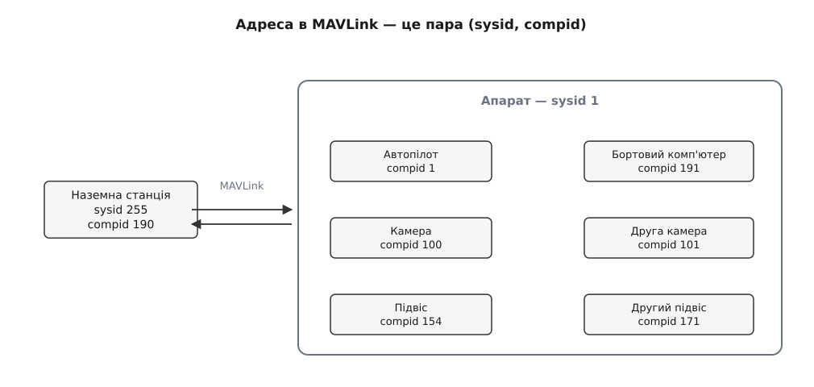
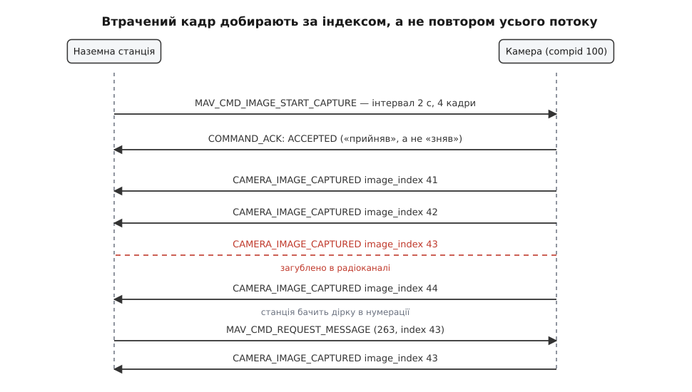
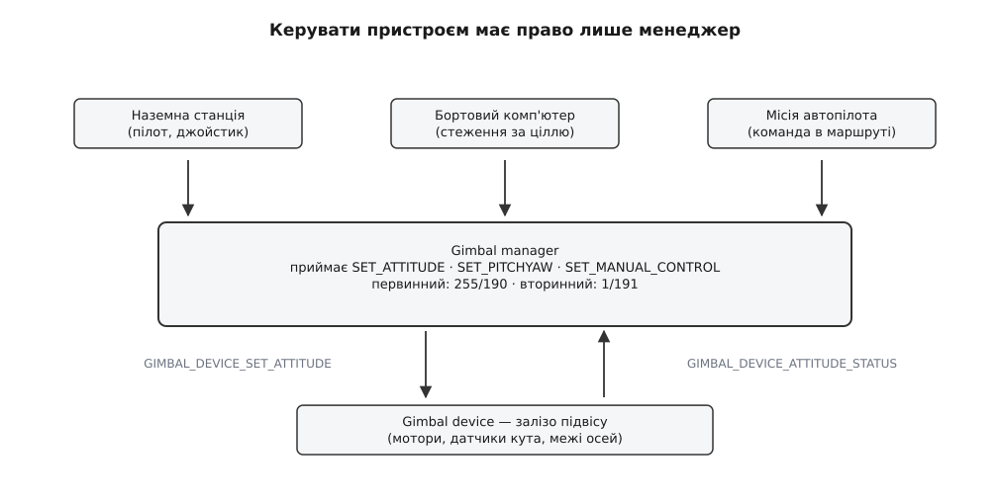
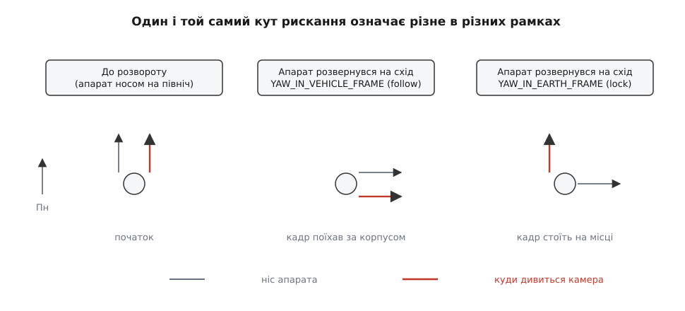

# Протоколи камери й підвісу MAVLink

<preknowlist>
- [Пакет MAVLink](book:communications/mavlink-packet) — будова кадру, поля відправника й ідентифікатор типу повідомлення.
- [Команди MAVLink](book:communications/mavlink-commands) — `COMMAND_LONG`, `COMMAND_ACK` і чому разову дію треба підтверджувати.
- [Кути Ейлера](book:math/euler-angles) — крен, тангаж і рискання як три кути повороту твердого тіла.
- [Кватерніони](book:math/quaternions) — компактний спосіб задати довільний поворот.
</preknowlist>

На дроні висить камера, а камера — на рухомій підвісці. Пілот тисне кнопку, і за кілометр звідси спрацьовує затвор; веде пальцем по екрану — об'єктив повертається. Здається, будувати тут нема чого: додай у протокол повідомлення «зніми кадр» і «поверни на такий кут» — і готово.

Тепер спробуй написати наземну станцію, яка має так само працювати з **будь-якою** камерою будь-якого виробника, зокрема з такою, якої в день написання станції ще не існувало. І яку одночасно смикатимуть пілот джойстиком, бортовий комп'ютер із розпізнаванням цілі й сам автопілот, що виконує зняту заздалегідь місію. Одразу з'являються два питання, на які «зніми кадр» відповіді не дає: **звідки станція знає, що вміє ця конкретна залізяка**, і **кого слухати, коли охочих керувати троє**. Протоколи камери й підвісу MAVLink — це два розгорнуті, і навмисно різні, способи відповісти саме на ці питання.

### Апарат — це не один співрозмовник

Перше, що доводиться змінити в уявленні про дрон: він не є єдиним пристроєм на лінії. Усередині одного апарата живе кілька **компонентів** (лат. *componens* — «складова»), і кожен з них — самостійний учасник обміну зі своєю адресою.

Адреса в MAVLink складається з двох чисел: `sysid` каже, **який апарат**, а `compid` — **який вузол усередині нього**. Автопілот традиційно займає `compid 1`, бортовий комп'ютер — 191, наземна станція — 190. Камери отримали власний діапазон: `MAV_COMP_ID_CAMERA` — це 100, а далі 101…105 для другої, третьої й наступних камер. Підвісам віддали 154, а потім, коли одного номера забракло, дописали 171…175.


*Адреса — це пара чисел: перше вибирає апарат, друге — вузол усередині нього. Камери, підвіси й бортові комп'ютери мають власні діапазони номерів, тож станція звертається до кожного окремо, а не «до дрона».*

Наслідок цієї дрібниці більший, ніж здається. Камера — **не периферія автопілота**, а рівноправний співрозмовник: станція шле команди прямо їй, а автопілот у цьому обміні є щонайбільше маршрутизатором, який перекладає байти з однієї лінії в іншу. Саме тому чужу камеру можна причепити до апарата, не переписавши в прошивці автопілота жодного рядка: він про неї нічого не знає й знати не мусить.

Щоб станція взагалі помітила новий вузол, кожен компонент шле власне [серцебиття](book:communications/mavlink-heartbeat) — коротке періодичне повідомлення «я тут, і ось хто я». Камера оголошує в ньому свій тип, і поява такого серцебиття з нової адреси й є тим моментом, коли станція розуміє: на лінії з'явилася камера. Ця схема адресації однакова для всіх служб MAVLink і описана окремо — [компоненти й адресація вузлів](book:communications/mavlink-component-id).

### Камера сама розповідає, що вміє

Отже, камера знайдена. Що станція може їй запропонувати намалювати на екрані? Кнопку затвора? А якщо ця камера знімає лише відео? Повзунок зума? А якщо об'єктив фіксований?

Вгадувати не можна, а «спробувати й подивитися» — надто пізно: інтерфейс потрібно намалювати **до** першого натиску, інакше пілот тицятиме в кнопки, які нічого не роблять. Тому камера мусить уміти **розповісти про себе наперед**.

Робить вона це повідомленням `CAMERA_INFORMATION`. Станція не чекає його з ефіру — вона його **просить** командою `MAV_CMD_REQUEST_MESSAGE`, універсальним «надішли мені повідомлення з таким номером». Логіка проста: дані про камеру статичні, вони не змінюються в польоті, тож гнати їх потоком вузьким радіоканалом було б марнотратством — досить попросити один раз.

Усередині `CAMERA_INFORMATION` є назва виробника й моделі, фокусна відстань, розмір матриці, а найважливіше — **бітова маска можливостей** `CAMERA_CAP_FLAGS`. Кожен біт означає окрему вміння: знімати фото, писати відео, віддавати відеопотік, змінювати зум, наводити фокус, стежити за об'єктом, працювати в тепловому діапазоні. Станція читає маску й будує рівно ті органи керування, що мають сенс.

Тут маска впирається у власну межу. Вона описує **класи дій**, а не налаштування: біт «уміє знімати фото» нічого не каже про те, які в цієї камери витримки, які значення чутливості, які режими балансу білого й скільки роздільностей вона підтримує. А саме це пілотові й треба крутити. Перелічити всі можливі налаштування всіх камер світу в протоколі неможливо — щороку з'являються нові, і кожна нова означала б нову версію протоколу для всіх.

### Опис виносять із протоколу в дані

Розв'язок гарний своєю асиметрією: протокол не описує налаштування взагалі, натомість камера віддає станції **файл із власним описом**. Поле `cam_definition_uri` в `CAMERA_INFORMATION` містить адресу XML-файла: або зовнішнє посилання, або шлях у бортовій файловій системі — тоді станція забирає його [бортовим файловим протоколом MAVFTP](book:communications/mavlink-ftp) прямо з камери, часто ще й у стиснутому вигляді, бо місця в такій пам'яті мало.

У файлі перелічені параметри камери: назва, тип, діапазон або список іменованих варіантів, підказки для перекладу інтерфейсу різними мовами, а ще правила взаємозв'язку — які пункти зникають, коли ввімкнено інший режим. Значення цих параметрів станція читає й записує [розширеним протоколом параметрів](book:communications/mavlink-parameters), який, на відміну від звичайного, вміє передавати не тільки числа, а й рядки.

> Будову цього файла й обмін значеннями розібрано окремо: [файл визначення камери](book:communications/mavlink-camera-gimbal/api-camera-definition.md) — які секції в ньому є, як описують перелік варіантів і взаємні виключення, які повідомлення читають і пишуть значення й що робити, коли камера й станція розійшлися у версії опису.

Виграш тут не в зручності, а в напрямку росту складності. Станція **не знає**, що таке «HDR» чи «профіль журналу» — вона знає лише, як показати список і як записати вибране. Нова камера приносить свою складність із собою, у власному файлі, а протокол лишається того самого розміру.

> 🔧 **Навіщо це.** Коли твоя програма зустрічає незнайому камеру, правильний порядок дій такий: дочекатися серцебиття з її адреси, попросити `CAMERA_INFORMATION`, прочитати маску можливостей і **тільки потім** вирішувати, що вмикати. Програма, яка одразу шле команду знімати, отримає у відповідь відмову «не підтримується» — і це в найкращому разі, бо частина камер на невідому команду просто мовчить, і чекання підтвердження перетвориться на глухий кут.

### Знімок — не команда, а подія

Тепер найтонше місце протоколу камери. Знімати наказує команда `MAV_CMD_IMAGE_START_CAPTURE`: скільки кадрів зняти, з яким проміжком і під яким номером послідовності. У відповідь приходить `COMMAND_ACK` — і ось тут звична логіка команд ламається.

Підтвердження команди означає **«наказ прийнято»**, а не «кадр існує». Між ними лежить час: камера може довести автофокус, дописати попередній файл, зачекати проміжок серії. А головне — команда «зняти чотири кадри з проміжком дві секунди» породжує **чотири різні події**, розтягнуті в часі. Одне підтвердження їх описати не може.

Тому кожен зроблений кадр камера оголошує окремим повідомленням `CAMERA_IMAGE_CAPTURED`. У ньому — час зйомки, широта, довгота й висота точки, кватерніон орієнтації камери в цю мить, ознака успіху й наскрізний номер `image_index`. Координати й орієнтація тут не прикраса: без них кадр — просто картинка, а з ними його можна покласти на карту, а з набору кадрів скласти ортофотоплан. Це і є [геоприв'язка аерознімка](book:algorithms/image-georeferencing): пікселі перетворюються на точки місцевості лише тоді, коли відомо, звідки й куди дивилася камера.


*Підтвердження команди означає лише те, що наказ прийнято. Кожен кадр приходить окремою подією з наскрізним номером. Загублену подію видно з розриву в нумерації, і станція добирає саме її, а не переслухує всю серію.*

Тепер зрозуміло, як тут ловлять втрати. Номер `image_index` зростає монотонно, тож розрив у нумерації — це прямий доказ, що подія загубилася в радіоканалі. Станція просто просить її ще раз тією ж командою `MAV_CMD_REQUEST_MESSAGE`, додавши другим параметром потрібний номер. Камера тримає ці записи в себе й віддає будь-який на вимогу.

Прийом заслуговує окремої уваги. Замість того щоб натягувати на кожну подію повноцінне [підтвердження з повторами](book:communications/reliable-link), камера веде **нумерований журнал із довільним доступом**, а станція звіряє нумерацію й добирає дірки. Це дешевше вдвічі: у прямому напрямку не треба слати підтвердження на кожен кадр, а в зворотному повторюють рівно те, що втрачено. Такий обмін надійності на трафік — типове рішення для [вузького й ненадійного каналу](book:communications/latency-reliability).

Поруч живуть два потокові повідомлення, які показують стан, а не події: `CAMERA_CAPTURE_STATUS` каже, чи зйомка триває, з яким проміжком і скільки лишилося місця, а `STORAGE_INFORMATION` описує сам носій. Розділення строге: подія розповідає, що **сталося**, стан — що **є зараз**, і плутати їх не можна, бо стан ніхто не добирає за номером.

### Підвіс: чому одного шару не вистачає

З підвісом наївне рішення напрошується ще сильніше: шли кут — залізо повернеться. Ламається воно одразу з двох боків.

Перший бік — **господарів багато**. Пілот тягне об'єктив пальцем по екрану. Бортовий комп'ютер, що впізнав ціль, крутить його автоматично. Місія, вписана в маршрут, наказує тримати камеру на заданій точці. Якщо всі троє пишуть у ту саму залізяку, вона смикатиметься між суперечливими наказами. Хтось мусить судити.

Другий бік — **залізо різне**. Один підвіс має три осі, другий два, третій узагалі не вміє повертатися вбік, і потрібне рискання доводиться відпрацьовувати розворотом самого апарата. Джерело команд не має цього знати: воно хоче сказати «дивись отуди», а не розписувати, яку вісь на скільки крутити.

Обидві потреби — про **посередника**, і MAVLink робить його явним, розділяючи підвіс на два шари. Нижній — **gimbal device**, власне залізо: мотори, датчики кутів, межі осей. Верхній — **gimbal manager**, розпорядник, і він єдиний, кому дозволено писати команди в пристрій. Живе він зазвичай в автопілоті або в бортовому комп'ютері.


*Джерела керування ніколи не звертаються до заліза напряму. Менеджер приймає їхні побажання, вирішує, чиє зараз важить, і перекладає його в команди пристрою; пристрій безперервно звітує про справжній кут.*

Кожен шар має власний набір повідомлень, і вони дзеркальні. Пристрій оголошує себе через `GIMBAL_DEVICE_INFORMATION` (які осі є, які в них межі), приймає `GIMBAL_DEVICE_SET_ATTITUDE` і десять разів на секунду звітує `GIMBAL_DEVICE_ATTITUDE_STATUS` — де він насправді. Менеджер оголошує себе через `GIMBAL_MANAGER_INFORMATION`, звітує рідше — `GIMBAL_MANAGER_STATUS` — і приймає три різні способи сказати, куди дивитися: `GIMBAL_MANAGER_SET_ATTITUDE` (кватерніон і кутові швидкості, для програм), `GIMBAL_MANAGER_SET_PITCHYAW` (просто два кути, для більшості випадків) і `GIMBAL_MANAGER_SET_MANUAL_CONTROL` (безрозмірне відхилення від −1 до 1, для джойстика).

Арбітраж вирішує команда `MAV_CMD_DO_GIMBAL_MANAGER_CONFIGURE`. Вона призначає **первинного** й **вторинного** розпорядника, і кожен задається парою чисел: адресою системи й адресою компонента. Це навмисно **не** замок: первинного можна відібрати новою командою, а хто зараз головний — видно всім із `GIMBAL_MANAGER_STATUS`. Так уникають класичної біди блокувань: якщо власник замка впав або пропав зі зв'язку, підвіс не лишається замкненим назавжди.

### Кут — це завжди «відносно чогось»

Лишилося головне питання, і воно тонше за все попереднє. Підвіс висить на апараті, який сам безперервно крутиться. Тому число «рискання −20°» саме собою не означає нічого, доки не сказано, **від чого його відлічують**.

Можливостей рівно дві, і обидві потрібні. Або кут відлічують **від корпусу апарата** — тоді камера повертається разом із дроном, і це те, що треба, коли знімаєш «уперед по курсу». Або кут відлічують **від землі**, від напрямку на північ — тоді камера тримає свій напрямок, хоч би як крутився носій, і це те, що треба, коли стежиш за нерухомою ціллю. Перший режим називають *follow* («слідувати»), другий — *lock* («утримувати»).


*Апарат розвертається праворуч на дев'яносто градусів. У режимі follow кут відлічують від корпусу, тож камера їде разом із ним. У режимі lock кут відлічують від півночі, тож підвіс відпрацьовує розворот назустріч і кадр лишається на місці.*

Обраний режим передають бітовими прапорцями `GIMBAL_DEVICE_FLAGS`, і їхня історія сама собою повчальна. Спершу було три прапорці блокування осей: `ROLL_LOCK` (4), `PITCH_LOCK` (8), `YAW_LOCK` (16) — «утримувати цю вісь відносно землі». Але для рискання цього виявилося замало: `YAW_LOCK` мовчки означав ще й те, що *задане* число теж відлічують від півночі, а от його відсутність двозначно тлумачили різні виробники. Тому додали явні прапорці `YAW_IN_VEHICLE_FRAME` (32) і `YAW_IN_EARTH_FRAME` (64), а щоб станція знала, чи розуміє їх ця конкретна залізяка, — ще й `ACCEPTS_YAW_IN_EARTH_FRAME` (128). Окремі прапорці описують складання підвісу в транспортне положення (`RETRACT`, 1) і повернення в нейтраль (`NEUTRAL`, 2), а `RC_EXCLUSIVE` (256) і `RC_MIXED` (512) кажуть, як домішувати ручку пульта.

Порахуймо, чому в режимі lock підвіс упирається там, де в режимі follow усе гаразд.

**Апарат із курсом 40° розвертається праворуч на 90°; підвіс має межу рискання ±90°, а камера дивиться на азимут 20°:**

```
Курс апарата:            40°  →  130°
Кут підвісу в рамці апарата (follow): −20°

follow — напрямок камери = курс + кут підвісу
  до    :   40 + (−20)  =   20°
  після :  130 + (−20)  =  110°     ← кадр поїхав разом із корпусом

lock — напрямок камери задано від півночі й має лишитися 20°
  потрібний кут у рамці апарата = 20 − курс
  до    :   20 −  40  =  −20°       ← у межах ±90°
  після :  20 − 130  = −110°        ← за межею осі
```

Отже, в режимі *lock* після розвороту підвісу треба було б відхилитися на 110° від корпусу, а він фізично може лише на 90°. Камера впреться в упор і кадр однаково поїде — попри правильно виставлений прапорець. Саме тому `GIMBAL_DEVICE_INFORMATION` віддає межі кожної осі: програма, яка їх не читає, рано чи пізно наказує неможливе й не розуміє, чому підвіс «не слухається».

Дві пастки на цьому ж місці. Перша: **одиниці різні за призначенням повідомлення**. Повідомлення `GIMBAL_MANAGER_SET_*` тримаються загальної домовленості MAVLink про одиниці СІ — кути в радіанах, швидкості в радіанах за секунду. А команди `MAV_CMD_DO_GIMBAL_MANAGER_PITCHYAW`, як і всі команди в цьому протоколі, беруть **градуси** й градуси за секунду. Друга: у полях кутів і швидкостей значення `NaN` — не помилка, а зміст: «цю величину я не задаю, тримай як є». Так одним повідомленням задають або кут, або швидкість, або кут по одній осі й швидкість по іншій.

> Робочий приклад із кодом розібрано окремо: [навести підвіс і зняти кадр](book:communications/mavlink-camera-gimbal/proj-gimbal-point-and-shoot.md) — узяти керування, порахувати кут на задану точку з урахуванням меж осей, віддати команду, дочекатися підтвердження й звірити знятий кадр за номером.

Ця конструкція з двох шарів з'явилася не одразу: перший підхід MAVLink до підвісу був однорівневим і без арбітражу, а перебудували його аж тоді, коли стало ясно, що інакше не виходить. [Як народився двошаровий протокол підвісу](book:communications/mavlink-camera-gimbal/hist-mount-to-gimbal-v2.md) — про те, чому команду керування підвісом довелося оголосити застарілою й що саме в старій схемі не працювало.

### Відео йде повз MAVLink

Одна річ у протоколі камери навмисно зроблена «не до кінця». Повідомлення `VIDEO_STREAM_INFORMATION` описує наявні потоки: номер потоку, назву, кодек, роздільність, частоту кадрів, бітрейт — і адресу, за якою потік брати. Самих кадрів у MAVLink немає й не буде.

Причина в різній природі даних. Телеметрія й команди — це рідкі короткі повідомлення, яким потрібна цілісність кожного; відео — це щільний потік, де втрачений пакет краще пропустити, ніж чекати повтору й зірвати картинку. Тягнути обидва через один транспорт означало б зіпсувати обидва. Тому MAVLink лишає собі **керування**, а кадри йдуть [своїм транспортом поверх UDP](book:communications/rtp-rtcp), сеанс якого відкривають [окремим протоколом керування потоком](book:communications/rtsp-sdp).

### Стеження замикає петлю на борту

Останній шар протоколу камери — стеження за об'єктом. Станція каже `MAV_CMD_CAMERA_TRACK_POINT` (стеж за цією точкою кадру) або `MAV_CMD_CAMERA_TRACK_RECTANGLE` (стеж за цим прямокутником), а камера далі сама шле `CAMERA_TRACKING_IMAGE_STATUS` — де ціль зараз у кадрі — і `CAMERA_TRACKING_GEO_STATUS`, якщо здатна оцінити її координати на місцевості.

Суть тут не в командах, а в тому, **де замикається петля**. [Алгоритм стеження](book:algorithms/tracking) працює на борту, поруч із матрицею, і крутить підвіс через місцевого менеджера. Якби кожен крок петлі йшов через радіоканал на землю й назад, затримка в сотні мілісекунд зробила б стеження нестійким: ціль виходила б із кадру швидше, ніж петля встигала реагувати. Станція в цій схемі лише **ставить задачу** і дивиться на результат.

---

Два протоколи в одній сім'ї розв'язують ту саму задачу — керувати річчю, про яку протокол нічого не знає, — і роблять це різними прийомами. Камера виносить свою неповторність **у дані**: усе, чим вона відрізняється від сусідки, лежить у файлі опису, а протокол лишається сталим. Підвіс виносить свій конфлікт **в окремий шар**: суперечку джерел розсуджує менеджер, а залізо бачить лише один узгоджений наказ. Перший прийом дає розширюваність без росту протоколу, другий — арбітраж без блокувань. Будь-яке нове навантаження, яке колись прикрутять до MAVLink, урешті вибиратиме між цими двома.
