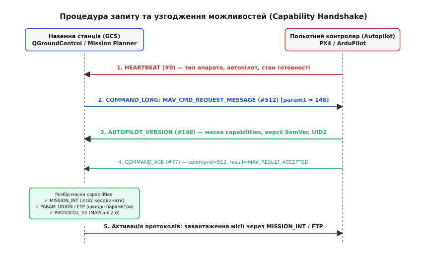
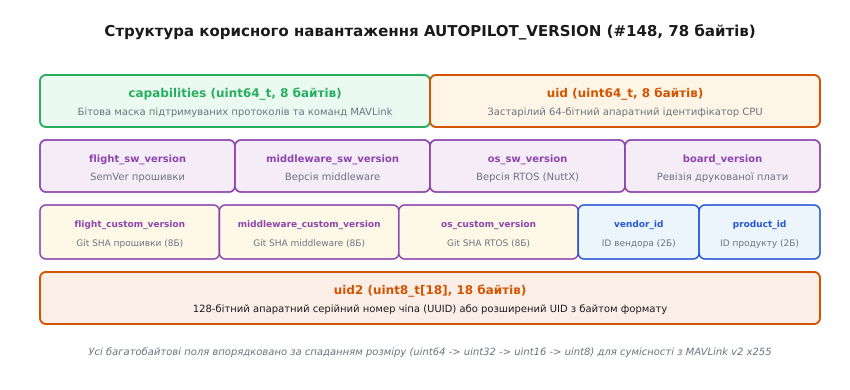
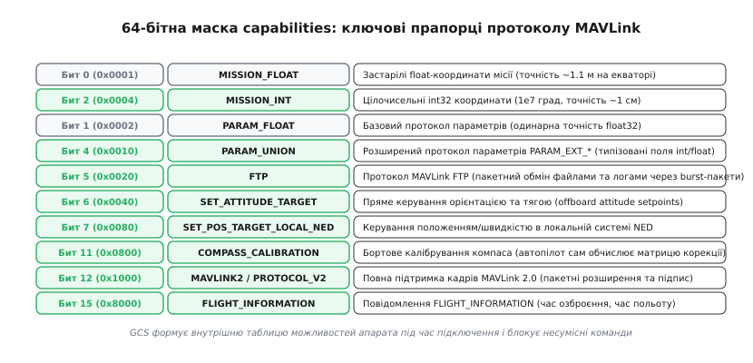
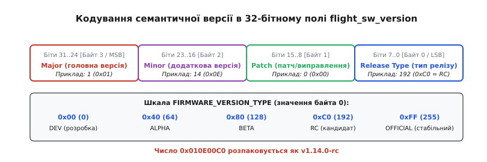

# Можливості апарата: бітова маска AUTOPILOT_VERSION

<preknowlist>
- [Пакет MAVLink](topic:communications/mavlink-packet) — структура двійкового кадру, службовий заголовок і контрольна сума CRC_EXTRA.
- [Команди MAVLink](topic:communications/mavlink-commands) — повідомлення COMMAND_LONG та протокол підтвердження COMMAND_ACK.
- [Параметри MAVLink](topic:communications/mavlink-parameters) — протокол конфігурації, передача значень PARAM_VALUE та адресація.
- [Протокол місій MAVLink](topic:communications/mavlink-mission-protocol) — завантаження шляхових точок і відмінність float від int32.
- [MAVLink FTP](topic:communications/mavlink-ftp) — пакетний протокол обміну файлами конфігурації та польотними логами.
</preknowlist>

Коли наземна станція керування (QGroundControl або Mission Planner) встановлює радіозв'язок із безпілотним апаратом, першим сигналом на лінії є короткий циклічний пакет `HEARTBEAT` (ID 0). Він транслюється раз на секунду і містить лише загальний тип платформи (наприклад, квадрокоптер) та сімейство прошивки (PX4 чи ArduPilot). Якщо станція одразу зробить припущення, що борт підтримує найновіші розширення протоколу — наприклад, передачу географічних координат із міліметровою точністю через цілочисельні повідомлення `MISSION_ITEM_INT`, передачу параметрів як 128-бітних структур або швидкісний обмін файлами журналів через MAVLink FTP — старий польотний контролер (як-от APM 2.8 чи спрощений мікротрекер) скине пакети через невідомий ідентифікатор повідомлення або невідповідність контрольної суми `CRC_EXTRA`. Якщо ж станція з переляку перейде на застарілий формат чисел із рухомою комою `MISSION_ITEM`, похибка заокруглення мантиси `float32` спотворить координати шляхових точок на 1–2 метри ще до старту двигунів.

Щоб усунути взаємні здогадки та узгодити набір функцій ще до початку польотних операцій, у протоколі MAVLink застосовують процедуру динамічного виявлення можливостей — **Autopilot Version & Capabilities Protocol**. Центральним елементом цієї процедури є повідомлення `AUTOPILOT_VERSION` (ID 148), яке містить 64-бітну маску функціональних прапорців `capabilities`, точні семантичні версії програмного стека (SemVer), апаратну ревізію друкованої плати та унікальний 128-бітний кремнієвий номер процесора (`uid2`).

---

### Рукостискання при першому підключенні (Handshake)

Процедура узгодження починається асинхронно відразу після виявлення нового відправника на радіолінії. Польотний контролер не транслює `AUTOPILOT_VERSION` постійно у загальному потоці телеметрії: надсилання 78-байтного пакета щосекунди марно забивало б вузький радіоканал із пропускною здатністю 57600 бод. За стандартної швидкості 57600 бод фізична пропускна здатність каналу становить близько 5.7 кілобайта на секунду. Передача 78-байтного корисного навантаження (разом із 12 службовими байтами заголовка MAVLink v2 та контрольної суми — 90 байтів) щосекунди марно спалювала б понад 1.5% усього доступного бюджету радіоефіру. Замість цього застосовується механізм «запит — відповідь» (англ. *request-response*).


*Послідовність повідомлень під час першого підключення: HEARTBEAT виявляє апарат, GCS надсилає команду MAV_CMD_REQUEST_MESSAGE, автопілот відповідає пакетом AUTOPILOT_VERSION та підтвердженням COMMAND_ACK, після чого станція адаптує рушії місій, параметрів та кадрування.*

Процес проходить у п'ять чітких кроків:

1. **Виявлення борту:** Автопілот шле `HEARTBEAT`. Наземна станція фіксує номер системи `SYSID` (наприклад, 1) та номер компонента `COMPID` (зазвичай `MAV_COMP_ID_AUTOPILOT1` = 1).
2. **Запит версії:** Станція формує повідомлення `COMMAND_LONG` (ID 76), де поле `command` дорівнює універсальній команді `MAV_CMD_REQUEST_MESSAGE` (номер 512). Перший параметр команди `param1` вказує номер запитуваного повідомлення — `148.0f` (`AUTOPILOT_VERSION`). Поле `param7` налаштовується на значення `1.0f` для прямої адресної відповіді запитувачу.
3. **Двійкова відповідь:** Польотний контролер формує та надсилає один екземпляр повідомлення `AUTOPILOT_VERSION` (ID 148), у якому запаковано маску можливостей, версії прошивки та UID чіпа.
4. **Підтвердження транзакції:** Відразу після передачі версії автопілот надсилає повідомлення `COMMAND_ACK` (ID 77) із кодом `command = 512` та результатом `result = MAV_RESULT_ACCEPTED` (0). Це сигналізує станції, що запит успішно виконано і повторних спроб робити не потрібно.
5. **Адаптація інтерфейсу:** Отримавши бітову маску `capabilities`, наземна станція перебудовує конфігурацію клієнтських підсистем: перемикає рушій завантаження місій на формат `MISSION_ITEM_INT`, запускає швидкісну сесію MAVLink FTP для параметрів та активує розширене кадрування MAVLink 2.0.

Історію того, як протокол пройшов шлях від жорстких таблиць сумісності до динамічного рукостискання, докладно описано у вставці [📜 Еволюція узгодження можливостей у MAVLink: від жорстких припущень до динамічного рукостискання](topic:communications/mavlink-capabilities/hist-capabilities-negotiation.md).

---

### Обробка кодів підтвердження транзакції COMMAND_ACK

У процесі запиту повідомлення через `MAV_CMD_REQUEST_MESSAGE` автопілот повертає один із стандартизованих кодів результату в полі `result` структури `COMMAND_ACK` (ID 77). Наземна станція використовує детерміновану логіку реагування для кожного коду:

1. `MAV_RESULT_ACCEPTED (0)`: Команду успішно прийнято та виконано. Пакет `AUTOPILOT_VERSION` уже відправлено в буфер передавача або він надійде наступним кадром.
2. `MAV_RESULT_TEMPORARILY_REJECTED (1)`: Автопілот тимчасово перевантажений (наприклад, виконує інтенсивний запис логу на SD-карту або очікує завершення ініціалізації датчиків IMU). Станція не збільшує лічильник фатальних помилок, а повторює запит з експоненційною затримкою (backoff) через 500, 1000 та 2000 мс.
3. `MAV_RESULT_DENIED (2)`: Доступ до інформації про версію відхилено політикою безпеки (наприклад, під час активного автономного польоту в режимі радіомовчання). Станція переходить у режим пасивного моніторингу.
4. `MAV_RESULT_UNSUPPORTED (3)`: Команда `MAV_CMD_REQUEST_MESSAGE (#512)` не підтримується прошивкою (характерно для релізів до 2017 року). Станція робить останню спробу узгодження через застаріле повідомлення `AUTOPILOT_VERSION_REQUEST (#183)`. Якщо і воно не підтримується, станція переходить у режим консервативної деградації.
5. `MAV_RESULT_FAILED (4)`: Внутрішній збій обробника повідомлень. Станція планує повторне опитування після короткої паузи.
6. `MAV_RESULT_IN_PROGRESS (5)`: Автопілот збирає дані з кремнієвих регістрів CPU та шини uORB. Станція скидає таймер очікування відповіді, уникаючи передчасного дублювання запитів.

---

### Трасування двійкового обміну на фізичному рівні UART

Щоб зрозуміти, як саме виглядає запит та відповідь на фізичній лінії зв'язку, простежимо послідовність шістнадцяткових байтів, які проходять через послідовний порт.

#### 1. Кадр запиту COMMAND_LONG від наземної станції
Станція надсилає кадрування MAVLink v2 зі стартовим байтом `0xFD`:

```
FD 21 00 00 2A FF 01 4C 00 00 [33 байти корисних даних COMMAND_LONG] XX XX
 │  │  │  │  │  │  │  │  │  │                                         └── CRC (2 байти)
 │  │  │  │  │  │  │  │  └──┴── MSG ID = 0x00004C (ID 76: COMMAND_LONG)
 │  │  │  │  │  │  └────────── COMP ID = 0x01 (GCS component)
 │  │  │  │  │  └───────────── SYS ID  = 0xFF (255 - наземна станція)
 │  │  │  │  └──────────────── SEQ     = 0x2A (номер пакета 42)
 │  │  │  └─────────────────── INCOMP  = 0x00 (прапорці несумісності)
 │  │  └────────────────────── COMPAT  = 0x00 (прапорці сумісності)
 │  └───────────────────────── LEN     = 0x21 (33 байти payload)
 └──────────────────────────── STX     = 0xFD (MAVLink v2 маркер)
```

Усередині корисного навантаження команди розміщуються поля:
* `param1 = 148.0f` (двійкове представлення IEEE 754: `0x00 0x00 0x14 0x43`);
* `param2..param6 = 0.0f` (по 4 нульові байти);
* `command = 512` (`uint16_t`: `0x00 0x02`);
* `target_system = 1`, `target_component = 1`, `confirmation = 0`.

Контрольна сума CRC розраховується з домішуванням екстра-байта `CRC_EXTRA = 152` для повідомлення `COMMAND_LONG`.

#### 2. Кадр відповіді AUTOPILOT_VERSION від автопілота
Польотний контролер генерує у відповідь кадр із `MSG ID = 0x000094` (номер 148):

```
FD 4E 00 00 81 01 01 94 00 00 [78 байтів корисних даних AUTOPILOT_VERSION] YY YY
```
Для повідомлення 148 використовується значення `CRC_EXTRA = 178`. Якщо обидві сторони зібрані з однієї версії схеми XML, контрольна сума зійдеться, і пакет буде передано в обробник без втрат.

---

### Багатоканальна маршрутизація та незалежність фізичних портів

Сучасні польотні контролери одночасно обслуговують кілька фізичних портів телеметрії через логічні канали зв'язку MAVLink:
* `MAVLINK_COMM_0` — порт прямого підключення USB (CDC-ACM) з пропускною здатністю до 12 Мбіт/с;
* `MAVLINK_COMM_1` — основний радіомодем телеметрії дальнього радіуса (TELEM1, 57600 бод);
* `MAVLINK_COMM_2` — швидкісний порт для зв'язку з бортовим комп'ютером (TELEM2, 921600 бод);
* `MAVLINK_COMM_3` — інтерфейс Ethernet (100Base-TX) для промислових дронів та автопілотів класу Pixhawk 6X.

Оскільки кожен фізичний порт має власні характеристики пропускної здатності та затримки, обробник MAVLink ізолює стан транзакцій:
1. Запит `AUTOPILOT_VERSION`, надісланий через швидкісний порт Ethernet або USB, дозволяє наземній станції миттєво активувати протокол MAVLink FTP із розміром блоків до 239 байтів на максимальній швидкості.
2. Якщо та сама станція паралельно підключена через повільний радіоканал 57600 бод, обробник адаптує частоту трансляцій і не перевантажує радіоефір важкими дампами пам'яті.

---

### Анатомія пакета AUTOPILOT_VERSION (#148)

У протоколі MAVLink v2 корисне навантаження повідомлення `AUTOPILOT_VERSION` має базовий розмір 78 байтів. За правилами серіалізації схеми MAVLink усі поля всередині структури впорядковано за спаданням розміру типів: від 8-байтних цілих чисел до однобайтних масивів. Це гарантує природне вирівнювання пам'яті на 32-бітних і 64-бітних архітектурах без утворення прихованих байтів заповнення (англ. *padding bytes*).


*Розподіл полів корисного навантаження AUTOPILOT_VERSION (78 байтів): 64-бітна маска capabilities, застарілий 64-бітний UID, чотири 32-бітні поля версій, 8-байтні хеші Git, ідентифікатори вендора та продукту, і 18-байтний апаратний UID2.*

Структура полів поділяється на чотири логічні блоки:

1. **Блок можливостей та ідентифікації (байти 0..15):**
   * `capabilities` (`uint64_t`, 8 байтів) — 64-бітна маска підтримуваних функцій та розширень MAVLink (`MAV_PROTOCOL_CAPABILITY`).
   * `uid` (`uint64_t`, 8 байтів) — застарілий 64-бітний апаратний номер мікроконтролера.
2. **Блок системних версій (байти 16..31):**
   * `flight_sw_version` (`uint32_t`, 4 байти) — семантична версія польотної прошивки.
   * `middleware_sw_version` (`uint32_t`, 4 байти) — версія проміжного шару (MAVLink, uORB, ROS-bridge).
   * `os_sw_version` (`uint32_t`, 4 байти) — версія операційної системи реального часу (RTOS, наприклад NuttX або FreeRTOS).
   * `board_version` (`uint32_t`, 4 байти) — апаратна ревізія друкованої плати контролера.
3. **Блок збірки та виробника (байти 32..59):**
   * `flight_custom_version` (`uint8_t[8]`) — перші 8 байтів хешу коміту Git прошивки.
   * `middleware_custom_version` (`uint8_t[8]`) — хеш коміту Git шару middleware.
   * `os_custom_version` (`uint8_t[8]`) — хеш коміту Git операційної системи.
   * `vendor_id` (`uint16_t`, 2 байти) — ідентифікатор виробника обладнання за класифікацією USB-IF / Dronecode.
   * `product_id` (`uint16_t`, 2 байти) — числовий ідентифікатор конкретної моделі плати.
4. **Блок криптографічного UID процесора (байти 60..77):**
   * `uid2` (`uint8_t[18]`) — розширений 128-бітний унікальний серійний номер чіпа з байтом формату на початку.

Важливою оптимізацією MAVLink v2 є відтинання нульових байтів наприкінці корисного навантаження (англ. *zero-byte payload truncation*). Якщо кінцеві байти поля `uid2` містять нулі (наприклад, коли мікроконтролер надає 12-байтний серійний номер STM32 UID, а решта 6 байтів залишаються нульовими), передавач відрізає їх, зменшуючи реальний розмір кадру на дроті з 78 до 72 байтів. Приймач автоматично заповнює відсутні байти нулями перед передачею структури у прикладну програму.

Вичерпні двійкові зміщення полів, таблиці констант і структури серіалізації зібрано у вставці [📋 Специфікація повідомлення AUTOPILOT_VERSION та бітова маска можливостей MAVLink](topic:communications/mavlink-capabilities/api-autopilot-version.md).

---

### 64-бітна маска capabilities: як станція адаптує протоколи

Поле `capabilities` є 64-бітним цілим числом без знаку (`uint64_t`), кожен встановлений біт якого свідчить про повну готовність автопілота підтримувати певний підпротокол або групу повідомлень.


*Ключові бітові прапорці маски capabilities: зелені блоки позначають сучасні високоточні та швидкісні розширення (MISSION_INT, FTP, MAVLink 2.0), сірі — базові застарілі механізми сумісності.*

Розгляньмо всі ключові прапорці та їхній фізичний вплив на роботу системи:

#### 1. Протокол місій: MISSION_FLOAT (біт 0, 0x01) проти MISSION_INT (біт 2, 0x04)
Ця пара визначає формат передачі географічних координат шляхових точок:
* **Обмеження Float:** У класичному повідомленні `MISSION_ITEM` (ID 39) координати передаються числами `float32`. Одинарна точність IEEE 754 має 24 біти двійкової мантиси, що еквівалентно 7.22 десятковим цифрам. Для координати `50.4501234°` (9 цифр) формату float32 бракує розрядності. Втрата молодших бітів призводить до похибки округлення від 7 сантиметрів у середніх широтах до 1.11 метра на екваторі. Під час виконання автоматичної посадки на зарядну платформу така похибка є критичною.
* **Рішення Int:** Повідомлення `MISSION_ITEM_INT` (ID 73) передає координати як 32-бітні цілі числа `int32_t`, помножені на коефіцієнт `1e7` (десять мільйонів). Одиниця молодшого розряду відповідає `0.0000001°`, що забезпечує стабільну роздільну здатність `1.11 см` у будь-якій точці планети.
* **Логіка GCS:** Якщо встановлено біт `MISSION_INT` (0x04), станція формує місії виключно через цілочисельні пакети. Якщо доступний лише `MISSION_FLOAT` (0x01), станція перемикається у режим сумісності та попереджає оператора про знижену точність навігації.

#### 2. Протокол параметрів: PARAM_FLOAT (біт 1, 0x02), PARAM_UNION (біт 4, 0x10), FTP (біт 5, 0x20)
Ця група прапорців визначає механізм конфігурації борту:
* **PARAM_FLOAT:** Застарілий протокол `PARAM_VALUE` (ID 22), де всі значення упаковуються у 32-бітний float. Якщо параметр є бітовою маскою (наприклад, конфігурація каналів CAN `0x7FC00001`), апаратний співпроцесор FPU може інтерпретувати його як нечислове значення NaN і спотворити на `0x7FC00000`, скидаючи налаштування сенсорів.
* **PARAM_UNION:** Розширений протокол `PARAM_EXT_VALUE` (ID 322), де значення передаються у сирому масиві `char[128]` разом із полем типу (`uint8`, `int32`, `float64`), захищаючи цілі числа від модифікації блоком FPU.
* **FTP:** Високошвидкісний протокол MAVLink FTP (повідомлення `FILE_TRANSFER_PROTOCOL`, ID 110). Замість відправки 1500 окремих транзакцій `PARAM_REQUEST_READ` через повільний радіоканал (що забирає до 40 секунд), станція завантажує стиснений бінарний файл конфігурації за 2–3 секунди через пакетні сесії.

#### 3. Розрахунок бюджету часу: PARAM_VALUE проти MAVLink FTP
Порівняємо математичний розрахунок завантаження 1500 параметрів через типовий радіомодем телеметрії SiK (57600 бод):
* **Класичний PARAM_VALUE:** Кожен параметр передається пакетом довжиною 37 байтів (25 байтів payload + 12 байтів заголовка). Загальний обсяг: `1500 · 37 = 55 500 байтів`. Теоретичний час завантаження за швидкості 5760 байт/с становить 9.6 секунди. Проте радіомодем працює у напівдуплексному режимі TDD (Time-Division Duplexing) із перемиканням прийом/передача кожні 20 мс. Будь-яка втрата пакета вимагає таймауту та повторного запиту через `PARAM_REQUEST_READ`. У результаті повна синхронізація займає від **35 до 45 секунд**.
* **Сесія MAVLink FTP:** Усі 1500 параметрів на борту пакуються у стиснений бінарний файл `parameters.json.xz` розміром близько 8 кілобайтів. Через FTP файл передається у burst-режимі блоками по 239 байтів (разом 34 пакети). Загальний час завантаження становить лише **2.1 секунди**, що скорочує час підготовки до старту у 15–20 разів.

#### 4. Зовнішнє керування: SET_ATTITUDE_TARGET (біт 6, 0x40), SET_POSITION_TARGET_LOCAL_NED (біт 7, 0x80), SET_POSITION_TARGET_GLOBAL_INT (біт 8, 0x100)
Ці прапорці є обов'язковими для систем комп'ютерного зору та комп'ютерів-компаньйонів (Raspberry Pi, Nvidia Jetson). Вони дозволяють зовнішнім програмам транслювати локальні вектори швидкості у системі координат NED (North-East-Down), просторові кватерніони кутової орієнтації або глобальні координати цілі без небезпечного перехоплення каналів пульта керування через `RC_CHANNELS_OVERRIDE`.

#### 5. Обмін картами рельєфу: TERRAIN (біт 9, 0x200)
Сигналізує про підтримку протоколу огинання рельєфу (повідомлення `TERRAIN_REQUEST`, `TERRAIN_DATA`). Автопілот під час польоту на надмалій висоті запитує у наземної станції матриці висот місцевості SRTM, що дозволяє апарату автоматично підтримувати постійну висоту над схилами гір.

#### 6. Бортове калібрування компаса: COMPASS_CALIBRATION (біт 11, 0x800)
Вказує, що 32-бітний процесор автопілота здатен самостійно обчислювати матрицю корекції спотворень магнітного поля методом найменших квадратів на борту. Станція лише ініціює команду старту і показує відсотки завершення, усуваючи необхідність передавати тисячі сирих точок магнітометра на ноутбук через радіоефір.

#### 7. Кадрування MAVLink 2.0: MAVLINK2 / PROTOCOL_V2 (біт 12, 0x1000)
Критичний прапорець транспортного рівня. Сигналізує про підтримку стартового маркера `0xFD`, 24-бітних номерів повідомлень, нульового стискання та криптографічного підпису пакетів. Отримавши цей біт, станція негайно перемикає лінк на MAVLink v2.

#### 8. Геозони та точки посадки: MISSION_FENCE (біт 13, 0x2000) та MISSION_RALLY (біт 14, 0x4000)
Дозволяють завантажувати просторові бар'єри (Geo-fence) та резервні точки аварійної посадки (Rally Points) через єдиний уніфікований протокол польотних місій.

#### 9. Статистика нальоту: FLIGHT_INFORMATION (біт 15, 0x8000)
Підтримка періодичного повідомлення `FLIGHT_INFORMATION` (ID 264), яке передає загальний час нальоту двигунів, час із моменту останнього зведення (arm time) та номер польотної сесії для ведення бортового журналу технічного обслуговування.

---

### Семантичне версіонування прошивки та системного стека

Поле `flight_sw_version` упаковує номер версії польотної прошивки згідно зі стандартом семантичного версіонування (англ. *Semantic Versioning*, SemVer) у єдине 32-бітне ціле без знаку:


*32-бітне поле flight_sw_version розкладається на чотири 8-бітні байти: Major (головна версія), Minor (додаткова версія), Patch (номер патчу) та Type (тип релізу).*

Розподіл бітових полів:
* **Байт 3 (біти 31..24):** Головний номер версії (Major). Збільшується при внесенні несумісних змін в інтерфейси керування чи архітектуру.
* **Байт 2 (біти 23..16):** Додатковий номер версії (Minor). Збільшується при додаванні нових можливостей зі збереженням зворотної сумісності.
* **Байт 1 (біти 15..8):** Номер виправлення (Patch). Збільшується при виправленні багів без зміни поведінки.
* **Байт 0 (біти 7..0):** Тип релізу (Release Type), закодований константами переліку `FIRMWARE_VERSION_TYPE`:
  * `0x00` (0) — `FIRMWARE_VERSION_TYPE_DEV`: гілка активної розробки;
  * `0x40` (64) — `FIRMWARE_VERSION_TYPE_ALPHA`: рання альфа-версія;
  * `0x80` (128) — `FIRMWARE_VERSION_TYPE_BETA`: публічна бета-версія;
  * `0xC0` (192) — `FIRMWARE_VERSION_TYPE_RC`: кандидат на фінальний реліз (Release Candidate);
  * `0xFF` (255) — `FIRMWARE_VERSION_TYPE_OFFICIAL`: стабільний офіційний реліз.

> 💡 **Приклад розпакування SemVer:** Якщо автопілот передав `flight_sw_version = 0x010E00C0`:
> * Байт 3 = `0x01` = `1` (Major);
> * Байт 2 = `0x0E` = `14` (Minor);
> * Байт 1 = `0x00` = `0` (Patch);
> * Байт 0 = `0xC0` = `192` (RC).
> Рядкове представлення: `v1.14.0-rc`.

Аналогічний формат кодування застосовується для поля `middleware_sw_version` (шар зв'язку та шини повідомлень) та `os_sw_version` (версія RTOS NuttX або Linux). Це дозволяє наземній станції точно діагностувати системні проблеми: наприклад, блокувати запуск моніторингу CAN-шини, якщо виявлено застаріле ядро RTOS із відомими помилками драйвера.

Поле `board_version` кодує апаратну ревізію плати польотного контролера. В екосистемі PX4 це поле відповідає стандартизованим поколінням FMU (Flight Management Unit):
* `board_version = 2` — FMUv2 (Pixhawk 1, STM32F427);
* `board_version = 3` — FMUv3 (Pixhawk 2.1 Cube Black);
* `board_version = 4` — FMUv4 (Pixracer, STM32F427);
* `board_version = 5` — FMUv5 (Pixhawk 4, STM32F765);
* `board_version = 6` — FMUv6X / FMUv6C (Pixhawk 6X / Holybro H7, STM32H743/H753).

Поля `flight_custom_version`, `middleware_custom_version` та `os_custom_version` містять по 8 байтів сирого бінарного хешу Git SHA. Станція форматує їх у 16-символьний шістнадцятковий рядок (наприклад, `618f4cd2`), однозначно ідентифікуючи конкретний коміт вихідного коду, з якого було зібрано прошивку. Це дозволяє розробникам миттєво визначати, чи встановлено на борту кастомну тестову збірку.

---

### Апаратна ідентифікація: вендори, чіпи та 128-бітний UID2

Для однозначного розпізнавання фізичної плати польотного контролера повідомлення несе три ключові поля:

1. **vendor_id (`uint16_t`):** Ідентифікатор виробника апаратної плати за стандартом USB-IF або Dronecode Foundation (наприклад, `0x26AC` для сімейства Pixhawk/Cube).
2. **product_id (`uint16_t`):** Ідентифікатор конкретної моделі друкованої плати (наприклад, `0x0011` для Pixhawk 6X або `0x0032` для Cube Orange).
3. **uid2 (`uint8_t[18]`):** Розширений унікальний апаратний серійний номер чіпа процесора.

Історично автопілоти використовували 64-бітне числове поле `uid` (`uint64_t`). Проте сучасні 32-бітні мікроконтролери ARM Cortex-M4/M7/H7 (як-от STM32F765 чи STM32H743) містять 96-бітний унікальний заводський номер (Unique Device ID), записаний у захищених системних регістрах за адресою `0x1FFF7A10`. Спроба втиснути 96-бітний номер у 64-бітне число призводила до обрізання розрядів та ризику виникнення дублікатів у великих флотах дронів.

Крім того, стандарти дистанційної ідентифікації безпілотників (FAA Remote ID у США та EASA в Європейському Союзі) вимагають обов'язкової наявності 128-бітного серійного номера стандарту ANSI/CTA-2063-A або UUIDv4.

Масив `uid2` вирішує цю проблему:
* Перший байт `uid2[0]` зберігає формат або кількість значущих байтів ідентифікатора (зазвичай `12` для 96-бітних STM32 UID або `16` для 128-бітних UUID);
* Наступні байти містять сирі байти серійного номера мікросхеми.

Завдяки наявності `uid2` наземна станція формує наскрізну базу даних апаратів: калібрувальні матриці компасів, налаштування PID-регуляторів та польотні журнали надійно прив'язуються до фізичного кремнієвого чіпа навіть у разі повного перепрошивання чи скидання параметрів пам'яті EEPROM.

---

### Робота в багатоапаратних мережах та з комп'ютерами-компаньйонами

У сучасних безпілотних комплексах телеметрійний канал рідко буває простою лінією між одним дроном та одним пультом. На практиці виникають два типові сценарії, де процедура узгодження відіграє ключову роль:

#### 1. Ройові структури та багатоапаратні мережі (Drone Swarm)
Коли в єдиному радіопросторі працює група з кількох десятків апаратів, кожен дрон має свій власний номер системи `SYSID`. Якщо наземна станція надішле широкомовний запит версії (`target_system = 0`), усі апарати одночасно спробують відповісти 78-байтними пакетами `AUTOPILOT_VERSION`. Це призведе до миттєвого колапсу радіоефіру через пакетні колізії (англ. *packet collisions*).

Щоб уникнути цього, GCS суворо ізолює сесії узгодження:
* Запит надсилається адресно конкретному `SYSID` із параметром `param7 = 1.0f` (Unicast Response).
* Для кожного апарата створюється незалежний екземпляр контексту можливостей.
* Отриманий `uid2` реєструється в таблиці маршрутизації станції. Якщо під час польоту зв'язок втрачено, а потім з'являється новий пакет із тим самим `SYSID`, станція звіряє `uid2`. Якщо апаратний номер не збігається (наприклад, увімкнули інший дрон із випадково продубльованим номером системи), станція попереджає оператора про адресний конфлікт.

#### 2. Інтеграція з бортовими комп'ютерами (ROS / ROS2 / MAVROS)
Комп'ютер-компаньйон, підключений до автопілота через високошвидкісний порт UART (921600 бод), виконує власне рукостискання відразу після завантаження. Отримавши `AUTOPILOT_VERSION`, драйвер MAVROS або шлюз micro-XRCE-DDS визначає:
* Чи підтримує автопілот команду `MAV_CMD_SET_MESSAGE_INTERVAL (#511)` для індивідуального налаштування частоти топіків одометрії та кутової орієнтації (замість застарілого групового опитування `REQUEST_DATA_STREAM`).
* Чи активні прапорці `SET_POSITION_TARGET_LOCAL_NED` та `SET_ATTITUDE_TARGET` для активації публікаторів цільових траєкторій.

#### 3. Компонентні метадані (Component Information Protocol #395)
Після отримання повідомлення `AUTOPILOT_VERSION` сучасна наземна станція перевіряє підтримку MAVLink FTP та надсилає запит `COMPONENT_INFORMATION` (ID 395). У відповідь автопілот повертає хеш CRC32 та посилання на файл `parameters.json.xz` у внутрішній файловій системі Flash-пам'яті. Станція завантажує цей файл через FTP, отримуючи повну базу описів параметрів, одиниць вимірювання та діапазонів налаштувань безпосередньо з борту.

---

### Практичний розбір пакета у C та C++

Нижче наведено ідіоматичні приклади декодування повідомлення `AUTOPILOT_VERSION` для вбудованих комп'ютерів-компаньйонів та наземних станцій керування:

:::tabs
```c
#include <stdint.h>
#include <stdbool.h>
#include <stdio.h>

#define CAP_MISSION_INT  (1ULL << 2)
#define CAP_PARAM_UNION  (1ULL << 4)
#define CAP_FTP          (1ULL << 5)
#define CAP_MAVLINK2     (1ULL << 12)

typedef struct {
    uint8_t major;
    uint8_t minor;
    uint8_t patch;
    uint8_t release_type;
    char    version_str[32];
    bool    use_int_waypoints;
    bool    use_ftp_params;
    bool    use_mavlink2;
} parsed_autopilot_info_t;

// Декодування сирих полів AUTOPILOT_VERSION
void parse_autopilot_version(uint64_t capabilities,
                             uint32_t flight_sw_version,
                             parsed_autopilot_info_t* out_info) {
    // 1. Розпакування SemVer
    out_info->major        = (uint8_t)((flight_sw_version >> 24) & 0xFF);
    out_info->minor        = (uint8_t)((flight_sw_version >> 16) & 0xFF);
    out_info->patch        = (uint8_t)((flight_sw_version >> 8)  & 0xFF);
    out_info->release_type = (uint8_t)(flight_sw_version & 0xFF);

    const char* suffix = "";
    if (out_info->release_type == 0)        suffix = "-dev";
    else if (out_info->release_type == 64)  suffix = "-alpha";
    else if (out_info->release_type == 128) suffix = "-beta";
    else if (out_info->release_type == 192) suffix = "-rc";

    snprintf(out_info->version_str, sizeof(out_info->version_str),
             "v%u.%u.%u%s", out_info->major, out_info->minor,
             out_info->patch, suffix);

    // 2. Аналіз маски capabilities
    out_info->use_int_waypoints = (capabilities & CAP_MISSION_INT) != 0;
    out_info->use_ftp_params    = (capabilities & CAP_FTP) != 0;
    out_info->use_mavlink2       = (capabilities & CAP_MAVLINK2) != 0;
}
```
```cpp
#include <cstdint>
#include <string>
#include <string_view>
#include <format>
#include <span>

enum class FirmwareType : uint8_t {
    Dev      = 0,
    Alpha    = 64,
    Beta     = 128,
    Rc       = 192,
    Official = 255
};

struct AutopilotCapabilitiesView {
    uint64_t mask{0};

    [[nodiscard]] constexpr bool supports_mission_int() const noexcept {
        return (mask & (1ULL << 2)) != 0;
    }
    [[nodiscard]] constexpr bool supports_param_union() const noexcept {
        return (mask & (1ULL << 4)) != 0;
    }
    [[nodiscard]] constexpr bool supports_ftp() const noexcept {
        return (mask & (1ULL << 5)) != 0;
    }
    [[nodiscard]] constexpr bool supports_mavlink2() const noexcept {
        return (mask & (1ULL << 12)) != 0;
    }
};

struct SemVerView {
    uint8_t major{0};
    uint8_t minor{0};
    uint8_t patch{0};
    FirmwareType type{FirmwareType::Dev};

    [[nodiscard]] static constexpr SemVerView from_raw(uint32_t raw) noexcept {
        return {
            .major = static_cast<uint8_t>((raw >> 24) & 0xFF),
            .minor = static_cast<uint8_t>((raw >> 16) & 0xFF),
            .patch = static_cast<uint8_t>((raw >> 8) & 0xFF),
            .type  = static_cast<FirmwareType>(raw & 0xFF)
        };
    }

    [[nodiscard]] std::string to_string() const {
        std::string_view suffix;
        switch (type) {
            case FirmwareType::Dev:      suffix = "-dev"; break;
            case FirmwareType::Alpha:    suffix = "-alpha"; break;
            case FirmwareType::Beta:     suffix = "-beta"; break;
            case FirmwareType::Rc:       suffix = "-rc"; break;
            case FirmwareType::Official: suffix = ""; break;
        }
        return std::format("v{}.{}.{}{}", major, minor, patch, suffix);
    }
};
```
:::

Повну архітектуру кінцевого автомата узгодження, обробку повторних спроб та інтеграцію із симулятором SITL наведено у вставці [⚙️ Практичний парсер версій та аналізатор можливостей польотного контролера](topic:communications/mavlink-capabilities/proj-capability-parser.md).

---

### Відмовостійкість та стратегія аварійної деградації

У польових умовах надійність телеметрії постійно піддається випробуванням через радіоперешкоди, обриви зв'язку та підключення нестандартних саморобних пристроїв. Якщо наземна станція надсилає команду `MAV_CMD_REQUEST_MESSAGE(148)`, але не отримує пакет `AUTOPILOT_VERSION` протягом 1000 мс, запускається таймер повторної спроби.

Якщо після трьох спроб відповіді немає, станція не розриває з'єднання аварійно, а переходить у стан **консервативної деградації (Fallback Mode)**:
1. **Місії:** Забороняються цілочисельні повідомлення `MISSION_ITEM_INT`. Станція завантажує польотні плани виключно застарілим протоколом `MISSION_ITEM` із float-координатами.
2. **Параметри:** Вимикається пакетний протокол MAVLink FTP. Завантаження конфігурації переводиться на класичне поодиноке вичитування через `PARAM_REQUEST_LIST`.
3. **Кадрування:** Станція не примушує лінк до MAVLink 2.0, продовжуючи приймати пакети як у форматі v1 (`0xFE`), так і у v2 (`0xFD`).
4. **Автономні режими:** Блокуються інтерфейси просторових векторів швидкості у локальній системі координат NED, щоб запобігти зльоту за відсутності підтримки бортових ПІД-регуляторів швидкості.

Крім того, станція відстежує стан гарячого перезавантаження автопілота: якщо лічильник пакетів `SEQ` обнуляється, а статус у `HEARTBEAT` переходить у `MAV_STATE_BOOT`, сесія узгодження автоматично скидається в початковий стан `IDLE` для повторного опитування після завершення перезапуску.

---

### Діагностика типових неполадок у польових умовах

Нижче наведено практичну матрицю типових інженерних проблем під час узгодження можливостей:

| Симптом неполадки | Причина на рівні протоколу | Інженерне рішення |
| :--- | :--- | :--- |
| **Зависання завантаження параметрів на 0%** | Станція чекає на пакети `PARAM_VALUE`, а прошивка виставила прапорець `FTP` і чекає відкриття файлової сесії | Оновити наземну станцію або вимкнути параметр `SYS_PARAM_FTP` на боці автопілота |
| **Помилка `MAV_MISSION_UNSUPPORTED` під час запису місії** | Станція надіслала `MISSION_ITEM_INT`, тоді як застарілий автопілот підтримує лише `MISSION_FLOAT` | Перевірити статус біта `MISSION_INT` у масці `capabilities` та примусово увімкнути режим сумісності |
| **Блокування перемикання у режим Offboard** | Станція виявила відсутність прапорця `SET_POSITION_TARGET_LOCAL_NED` у масці можливостей | Перевірити прошивку автопілота: увімкнути модуль локальної навігації EKF2 у конфігурації ядра |
| **Конфлікт телеметрії двох дронів на спільній частоті** | Обидва апарати мають однаковий `SYSID = 1`, але різні `uid2` | Наземна станція сигналізує про колізію `uid2` і пропонує оператору змінити параметр `SYSID_THISMAV` для другого дрона |

> 🔧 **Навіщо це.** Автоматичне узгодження можливостей позбавляє пілота необхідності вручну вказувати в налаштуваннях наземної станції тип автопілота, версію протоколу та параметри радіоканалу. Один двійковий пакет `AUTOPILOT_VERSION` усуває сантиметрові похибки навігації, прискорює завантаження параметрів у 10 разів через FTP і захищає бортову електроніку від несумісних команд керування.
