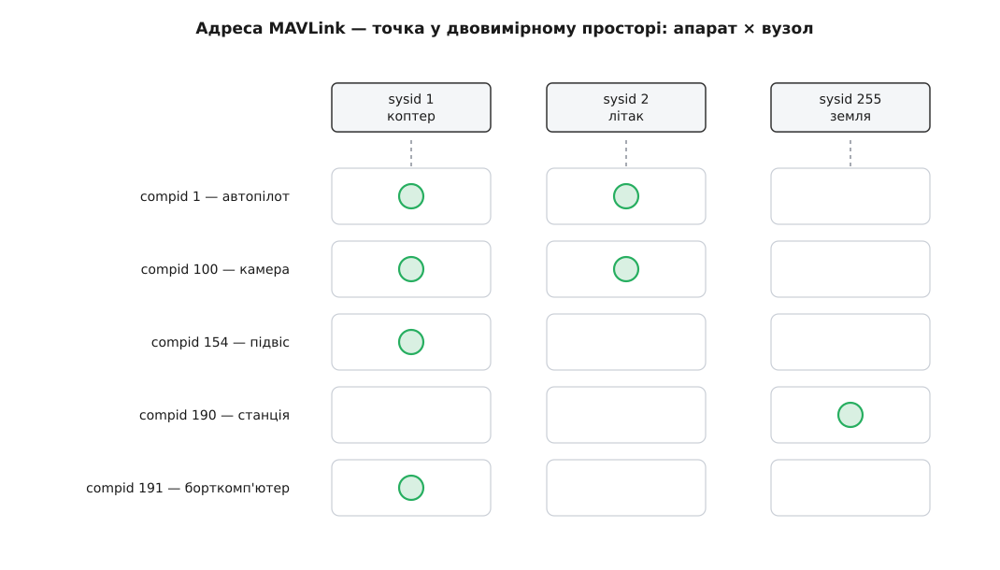
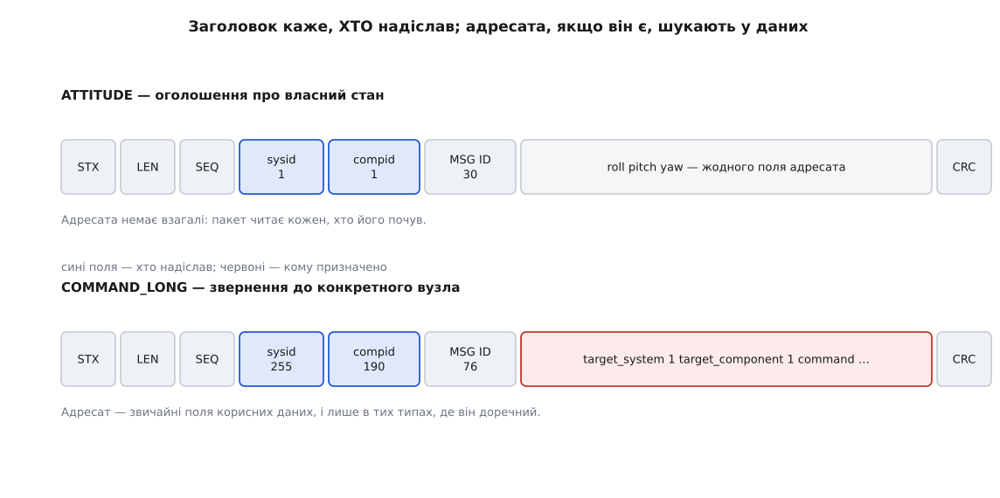
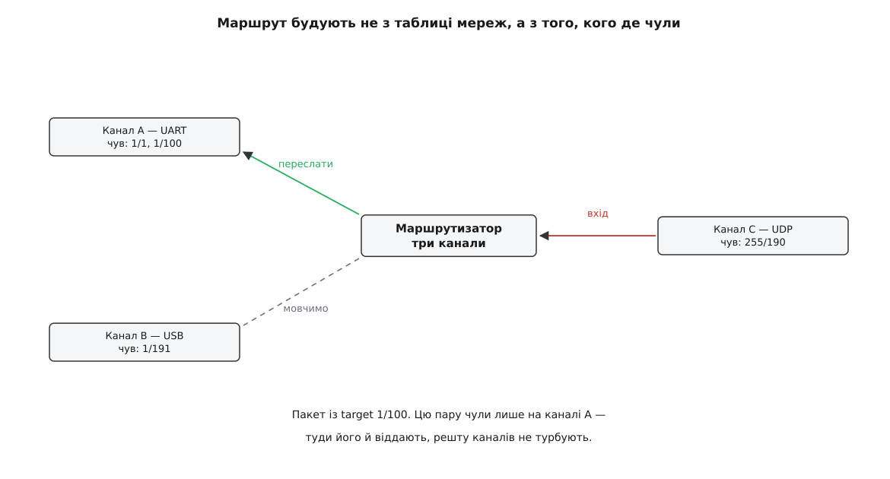

# Компоненти MAVLink: sysid, compid і адресація вузлів

<preknowlist>
- [Пакет MAVLink](topic:communications/mavlink-packet) — будова кадру: стартовий байт, поля заголовка, корисні дані, контрольна сума.
- [Команди MAVLink](topic:communications/mavlink-commands) — `COMMAND_LONG` і `COMMAND_ACK`: разова дія та її підтвердження.
- [Генерація коду з XML-опису MAVLink](topic:communications/mavlink-xml-codegen) — поля кожного повідомлення описані в XML, звідки автоматично роблять кодеки.
</preknowlist>

На столі лежить автопілот. До нього припаяно телеметричне радіо, зверху причеплено камеру на рухомому підвісі, збоку — малий комп'ютер, що дивиться в цю камеру й шукає ціль. Усе це висить на спільній лінії: байти від усіх чотирьох пристроїв злипаються в один потік і йдуть в ефір одним радіоканалом.

Тепер із цього потоку приходить повідомлення «кут крену — три градуси». Чий це крен? Апарат нахилений на три градуси — чи це підвіс відхилив камеру? Обидва мають крен, обидва мають право про нього доповідати, і байти в них однакові. А зустрічний потік несе команду «поверни на курс 90°». Кому вона: автопілоту, щоб розвернувся дрон, чи підвісу, щоб повернувся об'єктив?

Обидва питання не мають відповіді, поки в пакеті не з'явиться поле «хто це». І щойно ми беремося таке поле додати, виявляється, що одного числа замало.

### Чому чисел два

Спробуймо обійтися одним байтом на пристрій: автопілот — 1, камера — 2, підвіс — 3, борткомп'ютер — 4. Поки апарат один, усе працює. Ставимо в поле поруч другий дрон із такою самою начинкою — і номери треба видавати наново: 5, 6, 7, 8. Наземна станція вже не може сказати «покажи мені телеметрію апарата номер два» — вона мусить тримати табличку, які саме чотири числа з плаского списку належать цьому апарату. А коли до рою під'єднається третій дрон, табличку доведеться переписати на всіх станціях.

Корінь проблеми в тому, що ми відповідаємо одним числом на **два незалежні питання**: *який апарат* і *який вузол усередині нього*. Питання незалежні буквально: камери є на всіх апаратах, і поява нового апарата не мусить нічого змінювати в нумерації камер.

Тож MAVLink і не змішує їх. Адреса складається з двох байтів. **`sysid`** (англ. *system identifier*, «визначник системи») відповідає на перше питання: який апарат. **`compid`** (англ. *component identifier*, «визначник складника») — на друге: який вузол усередині цього апарата. Обидва числа лежать у діапазоні 1…255, і разом вони дають адресу — точку в двовимірному просторі, а не в одному ряду.


*Той самий `compid 1` існує на кожному апараті — і це різні автопілоти. Однозначно вузол називає лише пара чисел; окремо взяте друге число не значить нічого.*

Наслідок видно на малюнку: `compid 100` сам собою не адреса, бо камер із таким номером у мережі стільки, скільки апаратів. Адресою є **пара**, і саме парою оперує все подальше — і приймання, і пересилання, і відповідь.

Аналогія тут пряма: номер установи плюс внутрішній номер кабінету. Ламається вона в одному, зате важливому місці — телефонні номери роздає оператор, а в MAVLink роздавача немає взагалі. Хто які числа отримує, розберемо нижче, коли стане ясно, чого від них вимагає протокол.

### У заголовку стоїть відправник, а не адресат

Пара чисел лежить у заголовку кожного кадру — двома сусідніми байтами, одразу після лічильника послідовності. І тут ховається річ, повз яку легко проскочити: **обидва ці числа описують відправника**. Поля «кому» в заголовку MAVLink немає взагалі.

Це не недогляд. Подивімося, з чого складається основна маса трафіку: висота, положення, крен, напруга батареї, стан супутників — усе це потік стану, який цікавить одночасно кількох. Наземна станція малює це на екрані, бортовий комп'ютер бере в свій контур керування, реєстратор пише в лог, а телеметричне радіо просто тягне далі. Якби кожне таке повідомлення довелося комусь адресувати, автопілот мусив би або слати три копії замість однієї, або вести список передплатників і оновлювати його на кожне під'єднання. І те, і те — розкіш для [вузького радіоканалу телеметрії](topic:communications/telemetry-stream).

Тому пакет MAVLink за замовчуванням — це **вигук у спільне середовище з підписом**. Хто почув — той і скористався; підпис каже, від кого це прийшло, і цього досить, щоб віднести крен саме підвісу, а не апарату.

> 🔧 **Навіщо це.** Перше, що варто зробити, розбираючись у чужій зв'язці «дрон — станція», — увімкнути в аналізаторі трафіку групування за парою `sysid/compid`. Потік одразу розпадається на кілька рівних струмків, і видно, скільки насправді вузлів на лінії. Дуже часто там знаходиться зайвий — забутий симулятор, друга копія станції, залишений у мережі борткомп'ютер, — і саме він виявляється причиною «дивної поведінки».

### Тоді як звернутися до одного вузла

Але команду «злітай» вигукувати всім не можна. Отже, десь адресат усе-таки має бути — і він є, тільки не в заголовку, а **всередині корисних даних**, як звичайні поля повідомлення: `target_system` і `target_component`.


*Заголовок в обох кадрах однаковий і несе лише відправника. Адресат — не частина кадру, а частина конкретного типу повідомлення, і є він далеко не в кожному.*

Різниця принципова. Заголовок однаковий у всіх повідомлень; поля `target_*` — це властивість **окремого типу**, записана в його [XML-описі](topic:communications/mavlink-xml-codegen). У `COMMAND_LONG`, `PARAM_REQUEST_READ`, `MISSION_COUNT`, `SET_MODE` вони є. У `ATTITUDE`, `HEARTBEAT`, `GLOBAL_POSITION_INT` — немає й бути не може.

Так трафік MAVLink розпадається на два роди, і поділ цей не косметичний: **оголошення** (стан, який тече сам собою й нікому не адресований) і **звернення** (дія чи запит, що мають конкретного одержувача).

З того, що адресат сидить у даних, випливає незручний наслідок. Щоб дізнатися, кому призначено пакет, треба **знати тип цього пакета** — де саме в його даних лежать потрібні два байти. Вузол, який зустрів незнайомий номер повідомлення, адресата з нього не дістане; для нього це просто набір байтів. Через це проміжні вузли, що перекладають трафік між лініями, мусять носити з собою таблицю типів свого [діалекту](topic:communications/mavlink-dialect), а незнайомий тип чесно вважати оголошенням для всіх — інакше вони мовчки з'їдали б повідомлення, яких не розуміють.

### Нуль означає «всі»

Значення 0 в полях адресата зарезервоване під розсилання. `target_system = 0` — це «всім системам мережі», `target_component = 0` — «усім вузлам названої системи». З двох полів і цього правила складається повне правило приймання, і воно коротке. Вузол обробляє пакет у себе, якщо справджується будь-що з трьох:

```
target_system  = 0                                  → мережеве розсилання
target_system  = мій sysid  та  target_component = 0 → розсилання по апарату
target_system  = мій sysid  та  target_component = мій compid
```

У переліку `MAV_COMPONENT` нуль так і зветься — `MAV_COMP_ID_ALL`. Ним і користуються там, де дія стосується апарата цілком, а не котрогось вузла: команду «армувати» шлють на `target_component = 0`, щоб її почули всі, кому вона важлива. Колись під такі загальносистемні звернення тримали окремий номер, `MAV_COMP_ID_SYSTEM_CONTROL` (250), але його визнали зайвим і оголосили застарілим — розсилання по апарату вже давало те саме, до того ж не вимагаючи, щоб на цьому номері хтось сидів.

І звідси одразу випливає заборона: **нуль ніколи не буває адресою відправника**. Пакет, підписаний парою `0/0`, не можна ні віднести до конкретного вузла, ні відповісти на нього — а відповідь, як побачимо, адресують саме за підписом запиту. Помилка ця цілком реальна: наземні станції не раз ловили на тому, що вони підписують власні пакети нулями, і повернути їм відповідь було нікуди.

Повне правило приймання зручно записати один раз і потім усюди викликати. Мова тут задана намертво: код живе в прошивці поруч із розбором кадру, працює на кожному прийнятому пакеті й не має права на алокації — це C.

```c
#include <mavlink.h>

/* Кому адресовано пакет. Зсуви полів target_* беремо з таблиці,
   яку генератор зібрав із XML-опису: там же позначено, чи є вони взагалі. */
static void packet_target(const mavlink_message_t *msg,
                          uint8_t *tsys, uint8_t *tcomp)
{
    const mavlink_msg_entry_t *e = mavlink_get_msg_entry(msg->msgid);

    *tsys = *tcomp = 0;            /* нуль = «усім»: типове значення і для */
    if (!e) return;                /* незнайомого типу, і для оголошень    */

    if (e->flags & MAV_MSG_ENTRY_FLAG_HAVE_TARGET_SYSTEM)
        *tsys  = (uint8_t)_MAV_PAYLOAD(msg)[e->target_system_ofs];
    if (e->flags & MAV_MSG_ENTRY_FLAG_HAVE_TARGET_COMPONENT)
        *tcomp = (uint8_t)_MAV_PAYLOAD(msg)[e->target_component_ofs];
}

/* Чи обробляти пакет у себе. */
bool for_me(const mavlink_message_t *msg, uint8_t my_sys, uint8_t my_comp)
{
    uint8_t tsys, tcomp;
    packet_target(msg, &tsys, &tcomp);

    if (tsys == 0)      return true;    /* розсилання на всю мережу     */
    if (tsys != my_sys) return false;   /* чужий апарат — не наша справа */
    if (tcomp == 0)     return true;    /* усім вузлам мого апарата     */
    return tcomp == my_comp;            /* точно мені                   */
}
```

Зверни увагу на два рядки з нулями на початку `packet_target`. Вони роблять «оголошення» і «незнайомий тип» одним і тим самим випадком — і саме завдяки цьому вузол ніколи не втрачає повідомлення через те, що не знає його номера.

### Пересилати чи ні: маршрут із почутого

Дотепер ішлося про один вузол на одній лінії. Реальна ж збірка виглядає інакше: у автопілота кілька телеметричних портів, до борткомп'ютера приходить USB від автопілота й Wi-Fi від станції, а між ними сидить програма-міст, яка перекладає пакети з лінії в лінію. У неї є те саме питання, тільки друге: не «чи мені це», а «**чи в цей бік це віддавати**».

Відповіді нізвідки взяти. Ніхто не роздає адрес, немає ні протоколу оголошення маршрутів, ні центрального реєстру — [маршрутизація в IP-мережах](topic:communications/ip-routing) з її таблицями й префіксами тут не має на що спертися, бо `sysid` нічого не каже про топологію: сусідні числа можуть бути на протилежних кінцях мережі.

Залишається єдине джерело знань — **власні спостереження**. Міст запам'ятовує, чий підпис він бачив на кожному каналі, і будує з цього таблицю «пара `sysid/compid` → канал». Далі рішення просте:

- пакет-оголошення (`target_system = 0` або полів адресата немає) — віддати в **усі** канали, крім того, звідки він прийшов;
- адресований пакет — віддати **лише** в ті канали, де цю пару вже чули;
- пари ніде не чули — не робити нічого.


*Таблиця в мості — не список мереж, а журнал почутого. Порожній рядок означає не «недосяжно», а «ще не озивався».*

Ідея та сама, що й у комутатора Ethernet, який учить, за яким портом живе яка [апаратна адреса](topic:communications/mac-ip-arp), спостерігаючи за відправниками. Але наслідок для MAVLink гостріший, ніж для дротяної мережі. **Мовчазний вузол недосяжний.** Поки компонент не сказав жодного слова, жоден міст не знає, куди йому пересилати — і команда до нього просто нікуди не піде.

Ось звідки береться справжня, а не декларативна причина, чому кожен компонент MAVLink зобов'язаний періодично слати [HEARTBEAT](topic:communications/mavlink-heartbeat). Прийнято думати, що серцебиття — це про «я живий». Насправді воно робить дві роботи одразу: сповіщає про життя і **прописує вузол у маршрутах** усіх мостів на шляху. Тому камера, яка мовчить, доки її не спитають, ніколи й не буде спитана.

Написати такий міст — вправа приземлена й повчальна: таблиця почутого зі старінням записів, рішення про пересилання, захист від закільцювання пакетів між двома мостами. Розібрано в окремому проєкті — [маршрутизатор MAVLink на три канали](topic:communications/mavlink-component-id/proj-mavlink-router.md).

### Хто які номери отримує

Тепер, коли ясно, чого від адрес вимагає протокол, видно й вимоги до їх роздавання. Вимога рівно одна на кожен рівень, і обидві — про неповторність.

**`sysid` неповторний у межах мережі.** Заведено, що автопілоти беруть номери від 1 угору, а наземні станції та інструменти розробника — від 255 униз. Це домовленість, а не правило протоколу: вона просто розводить два табори по різних кінцях діапазону, щоб у звичайній збірці «один апарат плюс станція» зіткнення не сталося саме собою. Задають цей номер параметром автопілота — `SYSID_THISMAV` в ArduPilot, `MAV_SYS_ID` у PX4.

**`compid` неповторний у межах свого апарата.** Тут теж є домовленість — перелік `MAV_COMPONENT`, де за класами пристроїв закріплено діапазони: 1 — автопілот, 100…105 — камери, 110…112 — радіомодулі, 140…153 — сервоприводи, 154 і 171…175 — підвіси, 190 — наземна станція, 191…194 — бортові комп'ютери, 220…221 — приймачі супутникової навігації, а 25…99 віддано під власні потреби мережі. Номери, діапазони й перелік повідомлень, що несуть поля адресата, зібрано окремою довідкою — [номери компонентів і поля адресації](topic:communications/mavlink-component-id/api-component-ids.md).

І тут — найважливіше застереження всієї теми. **З номера не можна робити висновок про тип пристрою.** Номери з переліку — це заводські значення за замовчуванням, які інтегратор має право змінити: другу камеру доведеться зсунути на 101, а самозроблений вузол цілком законно сяде на 45. Станція, яка малює значок камери просто тому, що побачила `compid 100`, збреше першого ж дня, коли хтось перенумерує обладнання. Тип пристрою належить питати там, де він оголошений явно, — у полі `MAV_TYPE` серцебиття. Номер відповідає на питання «куди слати», і тільки на нього.

### Що ламається на збігу номерів

Вимога неповторності здається формальністю рівно доти, доки її не порушено. Порушення дає симптоми, які майже неможливо пов'язати з причиною.

Два апарати з `sysid 1` на спільній радіолінії станція зіллє в один. На екрані буде **один** дрон, чиї показники смикаються між двома наборами: висота стрибає, курс перекидається, положення на карті блимає між двома точками. Виглядає як хворе радіо або збитий компас. Гірше з керуванням: команда, адресована «системі 1», доходить до обох, і обидва її виконують; а на запит станція візьме ту відповідь, яка прийшла першою, і вважатиме її відповіддю того апарата, про який питала.

Збіг `compid` усередині одного апарата дає тихішу, але не менш підступну поведінку: два вузли з однаковим номером обидва вважають своїми ті самі звернення, обидва відповідають — і сторона, що чекала одне підтвердження, отримує два, ще й, можливо, з різними результатами.

Через це MAVLink рекомендує компонентам не вигадувати `sysid` самим, а переймати його: на старті вузол кілька секунд слухає ефір і, якщо почув серцебиття рівно **одного** автопілота, бере його номер собі. Почув двох — залишає свій, бо вгадувати нема з чого. Це саме рекомендація специфікації, і реалізації її дотримуються по-різному; надійним джерелом правди лишається свідомо виставлений інтегратором номер.

### Відповідь адресують назад

Остання ланка замикає коло. Коли вузол відповідає на звернення — надсилає `COMMAND_ACK` на команду чи значення на запит параметра, — він бере адресата не з налаштувань, а **з підпису запиту**: `target_system` відповіді дорівнює `sysid` того, хто питав, `target_component` — його `compid`.

Через це підпис із нулями не просто некоректний — він робить обмін одностороннім. І через це ж пара `sysid/compid` мусить бути стабільною: вузол, що змінив свій номер між запитом і відповіддю, відповіді не отримає, бо чекатиме її на стару адресу, а прийде вона на нову. З тієї ж причини дві наземні станції на одній лінії не плутають підтверджень: кожна ставить у команду власний підпис, і кожна отримує назад рівно своє — за умови, що їхні номери різні. Механіку самого обміну «команда — підтвердження» розібрано в [командах MAVLink](topic:communications/mavlink-commands).

Три правила — приймання, пересилання й зворотної адреси — стають однією механікою, якщо провести крізь них один запит.

**Умова.** Наземна станція (`sysid 255`, `compid 190`) просить камеру (`sysid 1`, `compid 100`) зняти кадр. Станція під'єднана по UDP до бортового комп'ютера (`sysid 1`, `compid 191`), камера висить на UART автопілота, а борткомп'ютер працює мостом між цими двома каналами.

```
1. Станція → канал UDP
   заголовок: sysid 255  compid 190          ← підпис відправника
   дані:      target_system 1  target_component 100
              MAV_CMD_IMAGE_START_CAPTURE

2. Міст (я 1/191), пакет прийшов з UDP
   приймання:  tsys 1 = мій, але tcomp 100 ≠ 191  → не мені
   маршрут:    пару 1/100 чув на UART             → віддати туди, і лише туди

3. Камера (я 1/100), пакет прийшов з UART
   приймання:  tsys 1 = мій, tcomp 100 = мій      → виконати, зняти кадр

4. Камера → канал UART (підтвердження)
   заголовок: sysid 1    compid 100               ← підпис виконавця
   дані:      target_system 255  target_component 190
              ← обидва числа взято з підпису запиту

5. Міст, пакет прийшов з UART
   приймання:  tsys 255 ≠ 1                       → не мені
   маршрут:    пару 255/190 чув на UDP            → віддати туди
```

**Висновок.** На жодному з п'яти кроків ніхто не знав будови мережі й не мав таблиці маршрутів. Кожне рішення склалося з двох дешевих дій: порівняти пару чисел зі своєю та зазирнути в журнал почутого.

Виходить, що пара чисел, яка на перший погляд є просто міткою в заголовку, робить три роботи одночасно: називає джерело даних, служить ключем маршрутизації й задає зворотну адресу. Саме тому зміна `sysid` на працюючому апараті так дорого коштує: одним рухом ти водночас перейменовуєш джерело всієї телеметрії, стираєш себе з маршрутних таблиць усіх мостів і від'єднуєш себе від усіх відповідей, які вже в дорозі.
