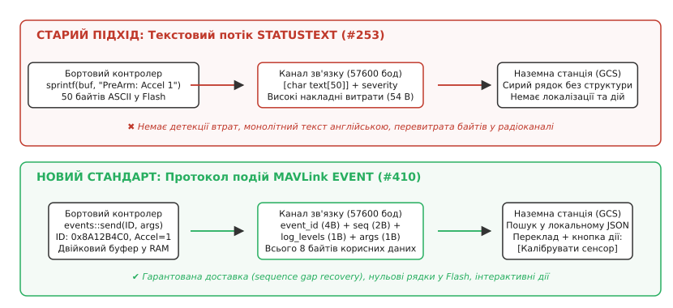
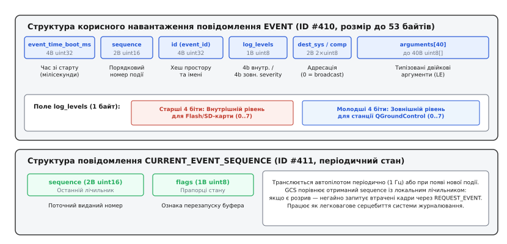
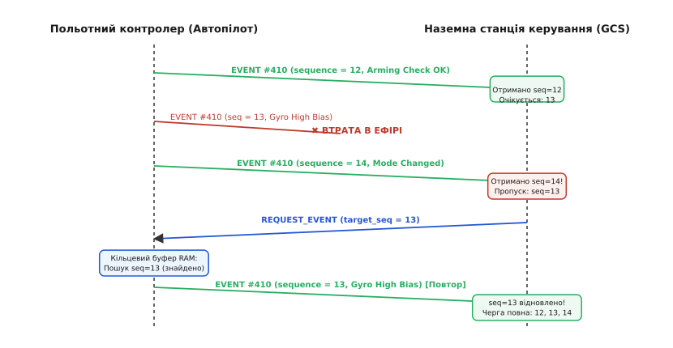
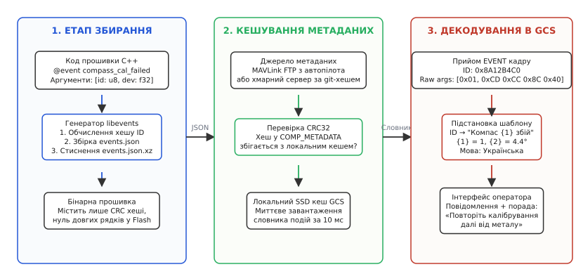

# Протокол подій MAVLink: подія як ідентифікатор

<preknowlist>
- [Пакет MAVLink](topic:communications/mavlink-packet) — структура двійкового кадру MAVLink v2, заголовок, ідентифікатор повідомлення та контроль цілісності.
- [Параметри MAVLink](topic:communications/mavlink-parameters) — протокол конфігурації та Component Information Protocol для завантаження метаданих.
- [ARQ: автоматичний повтор запиту](topic:communications/arq-protocol) — принципи виявлення пропусків у послідовності та механізми відновлення втрачених пакетів.
</preknowlist>

Під час передпольотної підготовки розвідувального або вантажного безпілотного апарата польотний контролер (PX4 або ArduPilot) виконує понад сорок апаратних та алгоритмічних перевірок перед наданням дозволу на запуск моторів (Pre-Arm checks). Якщо на стартовому майданчику перший інерційний сенсор фіксує неприпустиме зміщення нуля гіроскопа у 5.2 град/с або калібрування магнітометра зазнає збою через наявність арматури в бетоні злітної зони, наземна станція керування (QGroundControl) зобов'язана негайно, без спотворень та без жодних втрат повідомити оператору точну причину відмови та надати зрозумілу покрокову інструкцію для усунення несправності.

Проте понад десять років для трансляції системних сповіщень у стандарті MAVLink використовувалося єдине повідомлення `STATUSTEXT` (#253), яке передавало сирий неструктурований рядок символів ASCII фіксованою довжиною до 50 байтів. При корисній пропускній здатності типового радіоканалу телеметрії 57600 бод (близько 4–5 кілобайтів за секунду) передача кожного текстового сповіщення блокувала потік високочастотних навігаційних даних. Якщо ж через радіозавади або просторове згасання пакет `STATUSTEXT` губився в ефірі, наземна станція взагалі не фіксувала повідомлення, а оператор залишався перед заблокованим дроном без будь-якого розуміння причин зупинки місії.

Для подолання цих системних недоліків було розроблено протокол подій MAVLink (**Events Protocol**, від англійського *event* — подія, явище, що виникає в системі). Цей стандарт повністю замінює передачу неструктурованого тексту на трансляцію компактних 32-бітних числових ідентифікаторів `event_id` та серіалізованих двійкових аргументів, відокремлюючи опис, правила форматування та мовні переклади повідомлень у зовнішній шар метаданих.

---

### Анатомія та фундаментальні обмеження повідомлення STATUSTEXT

Щоб зрозуміти інженерні причини появи нового протоколу, детально проаналізуймо будову класичного повідомлення `STATUSTEXT` (#253). Корисне навантаження кадру складається з 1-байтового рівня важливості `severity` та масиву з 50 символів `text[50]`:

```
Структура корисного навантаження STATUSTEXT (#253, 51 байт):
┌───────────┬────────────────────────────────────────────────────────┐
│ severity  │ text[50] (ASCII-рядок символів із '\0'-термінатором)   │
│ (1 байт)  │ "PreArm: Gyro 1 inconsistent: 5.2 deg/s vs 0.1 deg/s"  │
└───────────┴────────────────────────────────────────────────────────┘
```

Така організація породила сім системних проблем, які стали критичним бар'єром для надійності безпілотних комплексів:

1. **Нераціональне використання пропускної здатності:** Навіть для короткого повідомлення на кшталт `Disarmed` у радіоефір передавалося повне корисне навантаження кадру (у версії кадру MAVLink v1 це завжди 51 байт, а разом із заголовком кадру та контрольною сумою — 59 байтів). За секунду трансляції кількох статусних повідомлень витрачалося до 25% усієї смуги радіомодема.
2. **Жорстке обмеження довжини рядка 50 символами:** Складні діагностичні повідомлення (наприклад, стан сузір'їв супутників GPS або помилки фільтра стану EKF) фізично не вміщувалися в один буфер. Розробникам доводилося або безжально скорочувати текст до незрозумілих абревіатур (`EKF2: Yaw inconsistent: mag0`), або впроваджувати нестандартні механізми фрагментації рядка (Chunking), які часто давали збій при втраті одного з фрагментів.
3. **Марнування пам'яті програм Flash на мікроконтролері:** Усі текстові шаблони помилок, назви сенсорів та підсистем прописувалися безпосередньо у вихідному коді прошивки і зберігалися у секції незмінних даних `.rodata` Flash-пам'яті мікроконтролера (STM32F7 / STM32H7). У великих прошивках ArduPilot та PX4 текстові рядки повідомлень займали від 120 до 300 кілобайтів дорогоцінної Flash-пам'яті.
4. **Повна відсутність машинної структури даних:** Наземна станція отримувала сирий текст англійською мовою. Програмне забезпечення не могло автоматично вилучити номер сенсора (`1`), виміряне значення кутової швидкості (`5.2`) чи поріг спрацьовування (`0.1`) без використання нестабільних регулярних виразів (RegEx). Будь-яка зміна коми або пробілу в прошивці автопілота ламала розбір на боці станції.
5. **Неможливість локалізації та перекладу:** Оскільки весь текст генерувався на борту польотного контролера, повідомлення транслювалися виключно мовою розробника прошивки (англійською). Оператори, які не володіли технічною англійською, не могли отримати переклад інтерфейсу своєю рідною мовою безпосередньо в полі.
6. **Відсутність інтерактивності (Actionability):** Повідомлення констатувало факт збою, але не містило підказки щодо шляхів його виправлення. Оператор бачив помилку `PreArm: Mag 0 uncalibrated`, але не отримував інформації, як саме усунути проблему або запустити майстер калібрування.
7. **Ненадійність доставки без контролю послідовності:** `STATUSTEXT` надсилався як звичайний ненадійний потік UDP/UART без окремого лічильника подій. Якщо через електромагнітну заваду пакет було втрачено в ефірі, станція керування не мала жодного способу дізнатися, що подія взагалі відбулася.


*Порівняння старого та нового підходів сповіщення: STATUSTEXT транслює монолітний ASCII-рядок, що перевантажує радіоканал і не має контролю втрат, тоді як Events Protocol передає компактний 32-бітний хеш із числовими аргументами та використовує шар локалізованих метаданих на наземній станції.*

---

### Архітектурна парадигма: Подія як ідентифікатор

Протокол подій базується на концепції **семантичного відокремлення транспорту від метаданих**. Замість того, щоб формувати текстовий рядок на борту польотного контролера, автопілот розглядає подію як двійковий кортеж із трьох складових:

1. **Ідентифікатор події (`event_id`):** 32-бітне беззнакове ціле число `uint32_t`, що однозначно визначає природу події у глобальному просторі імен.
2. **Часова мітка та порядковий номер (`sequence`):** монотонний лічильник для детекції прогалин у потоці.
3. **Двійкові аргументи (`arguments`):** компактний масив сирих числових значень (індекс відмовленого датчика, виміряна напруга, координати WGS84) без будь-яких символів форматування.

Усі символьні назви, шаблони повідомлень, розширені технічні описи, покрокові інструкції дій для пілота та файли перекладів зберігаються на наземній станції у вигляді зовнішнього JSON-файлу метаданих (`events.json`).

#### Математичне формування `event_id`

Ідентифікатор події обчислюється автоматично на етапі компіляції прошивки. Джерелом для хешування є рядок, складений із простору імен (Namespace) та символьної назви події (Event Name), розділених двокрапкою:

```
Формування вхідного рядка:   "default:compass_cal_failed"
Алгоритм хешування:          32-бітний поліноміальний хеш CRC32 / FNV-1a
Результат (event_id):        0x8A12B4C0 (десяткове 2 316 482 752)
```

Завдяки 32-бітній розрядності простір можливих ідентифікаторів становить `2³² ≈ 4.29 · 10⁹` унікальних значень. Відповідно до теорії ймовірностей та парадоксу днів народження (Birthday Paradox), для системи, що містить `N = 10 000` різних подій, імовірність колізії (випадкового збігу двох однакових хешів для різних назв) оцінюється формулою:

```
P(колізії) ≈ N² / (2 · 2³²) = (10 000)² / (2 · 4 294 967 296) ≈ 0.0000116 (0.001%)
```

Крім того, система збирання прошивки виконує обов'язкову статичну перевірку всієї бази подій перед фінальним лінкуванням двійкового файлу. Якщо генератор знаходить колізію двох хешів, процес компіляції негайно зупиняється з помилкою збирання.

Ідентифікатор події залишається абсолютно стабільним між різними релізами прошивки, якщо назва та простір імен події не змінювалися. Це забезпечує повну сумісність збережених логів польотів: наземна станція або сервер аналізу телеметрії може розшифрувати журнал 5-річної давнини, використовуючи актуальний словник метаданих.

---

### Двійковий транспортний протокол: Кадри EVENT та CURRENT_EVENT_SEQUENCE

Протокол подій реалізовано за допомогою двох повідомлень MAVLink v2: `EVENT` (#410) та `CURRENT_EVENT_SEQUENCE` (#411).


*Двійкова структура корисного навантаження повідомлення EVENT (ID #410) та кадру стану CURRENT_EVENT_SEQUENCE (ID #411). Поле log_levels містить 4 біти внутрішнього рівня логування та 4 біти зовнішньої серйозності, а масив arguments несе до 40 байтів щільно упакованих двійкових даних.*

#### Повідомлення EVENT (#410)

Повідомлення `EVENT` генерується бортовим вузлом у момент виникнення події і містить повний набір даних для її реєстрації та відображення.

```
Структура полів повідомлення EVENT (ID 410, розмір до 53 байтів):
┌────────────────────┬──────────┬────────────────────────────────────────────────────────┐
│ Поле               │ Тип      │ Призначення та діапазон                                │
├────────────────────┼──────────┼────────────────────────────────────────────────────────┤
│ event_time_boot_ms │ uint32_t │ Час від старту контролера в мілісекундах               │
│ sequence           │ uint16_t │ Монотонний порядковий номер події (0..65535)           │
│ id                 │ uint32_t │ 32-бітний хеш події (event_id)                         │
│ log_levels         │ uint8_t  │ Бітове поле: 4b внутрішній лог / 4b зовнішній рівень    │
│ destination_comp   │ uint8_t  │ Цільовий компонент (0 = широкомовне повідомлення)      │
│ destination_sys    │ uint8_t  │ Цільова система (0 = широкомовне повідомлення)         │
│ arguments[40]      │ uint8_t  │ Двійковий масив упакованих аргументів                  │
└────────────────────┴──────────┴────────────────────────────────────────────────────────┘
```

Повний технічний опис структури кадру, форматів полів та схем розміщення наведено у [специфікації протоколу подій MAVLink та форматів libevents](topic:communications/mavlink-events-protocol/api-events-protocol.md).

#### Механізм стиснення корисного навантаження (Zero-Byte Truncation)

У стандарті MAVLink v2 реалізовано алгоритм обрізання кінцевих нульових байтів: якщо в кінці корисного навантаження розташовані нульові байти, вони відсікаються на рівні формування кадру, а поле заголовка `LEN` зменшується відповідно.

Якщо подія не містить аргументів (наприклад, сповіщення про зміну польотного режиму `Mode changed to Hold`), увесь 40-байтовий масив `arguments` заповнюється нулями. На фізичному рівні довжина переданого корисного навантаження скорочується з 53 байтів до 13 байтів. Разом із 12-байтовим заголовком MAVLink v2 та 2-байтовою контрольною сумою повний кадр у радіоефірі займає лише 27 байтів замість 64 байтів для `STATUSTEXT`.

#### Повідомлення CURRENT_EVENT_SEQUENCE (#411)

Повідомлення `CURRENT_EVENT_SEQUENCE` транслюється автопілотом періодично (з базовою частотою 1 Гц) або надсилається негайно після серії нових подій. Воно містить:
* `sequence` (`uint16_t`) — останній виданий порядковий номер події для цього компонента.
* `flags` (`uint8_t`) — бітові прапорці стану буфера подій (скидання лічильника або переповнення кільцевого буфера).

Завдяки цьому повідомленню наземна станція дізнається про факт виникнення нових подій навіть тоді, коли самі кадри `EVENT` були повністю втрачені через інтерференцію в радіоканалі.

---

### Рівні серйозності (Severity) та подвійна модель журналювання

Протокол подій успадковує вісім стандартних рівнів серйозності комп'ютерних систем, визначених у специфікації Syslog RFC 5424 (від латинського *severitas* — суворість, важливість ситуації):

```
Рівні серйозності MAV_SEVERITY (0..7):
0: EMERGENCY  — Катастрофічний стан: система непридатна до польоту, відмова живлення.
1: ALERT      — Негайна дія: критичний розряд батареї, термінова посадка.
2: CRITICAL   — Критична відмова: втрата первинного сенсора, перехід на резерв.
3: ERROR      — Помилка: збій перевірки перед стартом, відхилення команди.
4: WARNING    — Попередження: сильний вітер, погіршення зв'язку, наближення до геозони.
5: NOTICE     — Важлива зміна стану: старт місії, зміна польотного режиму.
6: INFO       — Інформаційне повідомлення: калібрування завершено, точка досягнута.
7: DEBUG      — Налагодження: зміна внутрішніх станів, технічні метрики.
```

#### Розділення внутрішнього та зовнішнього рівнів логування

Ключовим нововведенням протоколу подій є байт `log_levels`, у якому 8 бітів розділені на дві 4-бітні половини (Nibbles): рівно 4 біти під внутрішній рівень логування та 4 біти під зовнішній рівень серйозності:

```
Поле log_levels (1 байт = 8 бітів):
┌───────────────────────────────────────┬───────────────────────────────────────┐
│        Старші 4 біти [7..4]           │         Молодші 4 біти [3..0]         │
│     Внутрішній рівень (Internal)      │      Зовнішній рівень (External)      │
│  Рівень запису в ULog на SD-карту     │  Рівень відображення пілоту на GCS    │
└───────────────────────────────────────┴───────────────────────────────────────┘
```

Це розділення розв'язує фундаментальну суперечність між потребами розробника прошивки та пілота безпілотника:

1. **Внутрішній рівень (Internal Log Level, 4 біти):** Визначає деталізацію запису у високошвидкісний бортовий лог на карті пам'яті microSD (формат ULog у PX4 або DataFlash у ArduPilot). Тут зберігаються детальні технічні події (рівні `DEBUG` або `INFO`), необхідні інженерам для пост-польотного аналізу збоїв заліза.
2. **Зовнішній рівень (External Severity, 4 біти):** Визначає пріоритет відображення сповіщення у графічному інтерфейсі та голосовому інформаторі наземної станції QGroundControl.

Наприклад, якщо час відгуку шини I2C магнітометра тимчасово зріс на 15 мілісекунд, подія отримує внутрішній рівень `DEBUG` (буде зафіксована в лозі на SD-карті для інженерів) та зовнішній рівень `NONE` / придушений (не транслюватиметься оператору, щоб не відволікати пілота під час посадки). І навпаки, відмова мотора отримує рівень `EMERGENCY` в обох полях.

---

### Двійкове пакування та типізація аргументів (`arguments[40]`)

Корисні параметри події передаються у двійковому масиві, який містить до 40 байтів двійкових даних `arguments[40]`. Усі числові змінні серіалізуються безпосередньо у пам'ять масиву у форматі little-endian без використання розділових байтів чи символьних позначень.

#### Підтримувані базові типи
* `uint8_t` / `int8_t` (1 байт): індекси сенсорів, лічильники спроб, бітові переліки.
* `uint16_t` / `int16_t` (2 байти): напруга в мілівольтах, частота обертання двигунів (RPM).
* `uint32_t` / `int32_t` (4 байти): географічні координати WGS84 у форматі `градуси · 10⁷` (наприклад, `504501000` для `50.4501000°`), системні часові інтервали.
* `float` (4 байти, стандарт IEEE 754): кути відхилення у градусах, лінійні швидкості в м/с, температура в °C.
* `uint64_t` / `int64_t` (8 байтів): унікальні 64-бітні серійні номери апаратних чипів або абсолютні мітки часу UNIX.

#### Безпека двійкового доступу та усунення апаратних пасток

Оскільки аргументи упаковуються щільно (Packed layout), 32-бітний `float` або `uint32_t` може починатися з непарного зміщення байтів (наприклад, після 1-байтового `uint8_t` зміщення наступного аргументу дорівнює `1`). На процесорах з архітектурою ARM Cortex-M0/M3 або при роботі з суворими прапорцями компілятора спроба виконати пряме приведення типу `*(float*)&arguments[1]` призводить до апаратного переривання пам'яті (Unaligned Memory Access Fault).

Специфікація вимагає використовувати побайтове копіювання `memcpy` у мові C або стандартизоване побітове відображення `std::bit_cast` у мові C++:

:::tabs
```c
#include <stdint.h>
#include <string.h>

// Безпечне пакування аргументів події: uint8_t (сенсор) + float (відхилення)
void pack_event_args(uint8_t *dest_buf, uint8_t sensor_id, float deviation) {
    // Зсув 0: запис 1 байта
    dest_buf[0] = sensor_id;
    // Зсув 1: копіювання 4 байтів float у форматі little-endian
    memcpy(&dest_buf[1], &deviation, sizeof(float));
}

// Безпечне розпакування аргументів із сирого буфера
void unpack_event_args(const uint8_t *src_buf, uint8_t *out_sensor_id, float *out_deviation) {
    *out_sensor_id = src_buf[0];
    memcpy(out_deviation, &src_buf[1], sizeof(float));
}
```
```cpp
#include <cstdint>
#include <cstring>
#include <span>
#include <bit>

// Безпечне пакування аргументів події в буфер за допомогою std::span (C++20)
void pack_event_args(std::span<uint8_t> dest_buf, uint8_t sensor_id, float deviation) noexcept {
    if (dest_buf.size() >= sizeof(uint8_t) + sizeof(float)) {
        dest_buf[0] = sensor_id;
        std::memcpy(dest_buf.data() + 1, &deviation, sizeof(float));
    }
}

// Безпечне розпакування аргументів із двійкового буфера
struct CompassCalArgs {
    uint8_t sensor_id{0};
    float   deviation{0.0f};
};

CompassCalArgs unpack_event_args(std::span<const uint8_t> src_buf) noexcept {
    CompassCalArgs args{};
    if (src_buf.size() >= sizeof(uint8_t) + sizeof(float)) {
        args.sensor_id = src_buf[0];
        std::memcpy(&args.deviation, src_buf.data() + 1, sizeof(float));
    }
    return args;
}
```
:::

---

### Виявлення втрат, нумерація послідовності та відновлення подій

Радіоканал телеметрії безпілотника працює в умовах значного рівня електромагнітних завад від силових двигунів, що призводить до втрати від 5% до 25% окремих пакетів. Якщо критичне сповіщення про відмову навігації загубиться, наземна станція може відображати хибний стан апарата.

Протокол подій реалізує надійну модель доставки на основі ковзного лічильника послідовності (Sequence Tracking) та вибіркового запиту повторної передачі (Selective ARQ).


*Послідовність виявлення та відновлення втрачених подій: при втраті кадру seq=13 станція фіксує пропуск при отриманні seq=14, надсилає точковий запит REQUEST_EVENT і відновлює пропущену подію з кільцевого буфера автопілота.*

#### Алгоритм роботи автомата виявлення прогалин (Gap Recovery):

1. **Ведення локального лічильника:** Наземна станція підтримує внутрішню змінну `expected_sequence` для кожного активного компонента апарата.
2. **Перевірка неперервності:** При отриманні чергового кадру `EVENT` або періодичного `CURRENT_EVENT_SEQUENCE` станція аналізує номер `received_seq`:
   * Якщо `received_seq == expected_sequence`: подія передається на обробку, а очікуваний номер збільшується: `expected_sequence = (expected_sequence + 1) & 0xFFFF`.
   * Якщо `received_seq > expected_sequence`: станція фіксує наявність прогалини у діапазоні номерів `[expected_sequence .. received_seq - 1]`.
3. **Формування адресного запиту:** Станція надсилає команду `REQUEST_EVENT` (або `MAV_CMD_REQUEST_MESSAGE`), вказуючи початковий номер втраченої події та кількість відсутніх кадрів.
4. **Вибірка з кільцевого буфера RAM:** Польотний контролер утримує у своїй оперативній пам'яті кільцевий буфер фіксованого розміру (зазвичай від 32 до 64 останніх подій). Отримавши запит, автопілот знаходить пропущені події в пам'яті і повторно надсилає їх у радіоканал.
5. **Обробка переповнення (Buffer Overrun):** Якщо зв'язок був відсутній надто довго і кільцевий буфер автопілота переповнився (нові події перетерли старі), автопілот виставляє прапорець `OVERFLOW` у повідомленні `CURRENT_EVENT_SEQUENCE`. Станція інформує оператора про втрату частини історії діагностики і переводить лічильник `expected_sequence` на найстарший доступний номер.

Детальну алгоритмічну структуру, логіку обробки тайм-аутів та повний робочий код автомата стану наведено у [реалізації клієнтського декодера подій та автомата відновлення пропусків](topic:communications/mavlink-events-protocol/proj-event-decoder.md).

---

### Метадані подій: Схема JSON, Component Information Protocol та локалізація

Оскільки на фізичному рівні передаються виключно 32-бітні ідентифікатори та сирі байти аргументів, завдання перетворення чисел у зрозумілий інтерфейс оператора покладається на систему метаданих.


*Повний ланцюг метаданих: генерація стисненого JSON на етапі компіляції прошивки, завантаження через MAVLink FTP або хмарний сервер за хешем CRC32, локальне кешування та динамічна підстановка аргументів у шаблони інтерфейсу.*

#### Структура файлу метаданих `events.json`

Файл метаданих являє собою структурований JSON-документ, стиснений алгоритмом XZ (`events.json.xz`). Кожна подія описується повним набором полів:

```json
{
  "version": 1,
  "scope": "px4",
  "components": {
    "1": {
      "namespace": "default",
      "event_groups": {
        "sensors": {
          "events": {
            "2316482752": {
              "name": "compass_cal_failed",
              "type": "calibration",
              "message": "Збій калібрування компаса №{1} (відхилення: {2:.1f}°)",
              "description": "Перевірка консистентності магнітного поля завершилася помилкою. Виміряний вектор відхиляється від очікуваної геомагнітної моделі WMM для поточних координат.",
              "action": "Переконайтеся, що апарат знаходиться на відстані не менше 15 метрів від автомобілів, залізобетону та силових ліній електропередач. Повторіть калібрування.",
              "arguments": [
                {
                  "name": "sensor_id",
                  "type": "uint8_t",
                  "description": "Номер екземпляра магнітометра"
                },
                {
                  "name": "deviation_deg",
                  "type": "float",
                  "unit": "deg",
                  "decimal_places": 1,
                  "description": "Кут магнітного відхилення"
                }
              ]
            }
          }
        }
      }
    }
  }
}
```

#### Механізм поширення та інвалідації кешу

Наземна станція використовує протокол **Component Information Protocol** для отримання метаданих:

1. **Запит дескриптора:** Станція надсилає автопілоту команду `COMP_METADATA_REQUEST`.
2. **Звірка контрольної суми:** Автопілот відповідає повідомленням `COMPONENT_INFORMATION_BASIC`, яке містить 32-бітний хеш CRC32 файлу метаданих та URI для його завантаження.
3. **Миттєвий старт з локального кешу:** Якщо на диску станції вже збережено файл `events.json.xz` із відповідним CRC32 (наприклад, від попереднього польоту), завантаження по радіоканалу повністю пропускається. Словник подій підтягується з локального накопичувача за 5–10 мілісекунд.
4. **Завантаження оновлень:** Якщо прошивку польотного контролера було оновлено і контрольний хеш змінився, станція автоматично завантажує новий файл через швидкісний протокол [MAVLink FTP](topic:communications/mavlink-ftp) або з хмарного репозиторію за номером версії прошивки.

#### Багатомовна локалізація без зміни прошивки

Розділення логіки та тексту дозволяє легко створювати локалізовані версії метаданих (`events_uk_UA.json`, `events_de_DE.json`). Наземна станція завантажує файл потрібної мови відповідно до системних налаштувань операційної системи оператора. Автопілот продовжує надсилати той самий числовий код `0x8A12B4C0`, але український оператор бачить повідомлення `Збій калібрування компаса №1`, а німецький — `Kompass 1 Kalibrierung fehlgeschlagen`.

---

### Внутрішній конвеєр польотного контролера та екосистема libevents

Щоб зрозуміти, як подія проходить шлях від виявлення апаратного збою сенсора до появи на радіомодемі, простежимо внутрішній конвеєр прошивки (на прикладі архітектури PX4 Autopilot та операційної системи реального часу NuttX).

1. **Генерація в драйвері сенсора:** Драйвер магнітометра `ist8310` у високочастотному циклі опитування виявляє аномальний стрибок вектора індукції. Драйвер викликає внутрішню функцію `events::send<uint8_t, float>()`.
2. **Публікація у внутрішню шину uORB:** Бібліотека `libevents` пакує аргументи у внутрішню структуру `event_s` та публікує її у топік шини повідомлень uORB `event`.
3. **Обробка мережевим модулем MAVLink:** Фоновий потік `mavlink_events` підписаний на топік `event`. Отримавши нове повідомлення, він:
   * Присвоює події черговий порядковий номер `sequence`.
   * Зберігає повний кадр у кільцевому буфері RAM для підтримки ARQ.
   * Кодує кадр `EVENT` (#410) у вихідний кільцевий буфер DMA інтерфейсу UART телеметрії.
4. **Контроль завад та пріоритезація:** Якщо радіолінія перевантажена навігаційними пакетами `ATTITUDE` та `GLOBAL_POSITION_INT`, модуль `mavlink` надає повідомленням `EVENT` із серйозністю `CRITICAL` та `ERROR` найвищий пріоритет черги відправлення (High Priority Queue).

```cpp
#include <libevents/events.h>

// Типобезпечна публікація події у вихідному коді модуля автопілота
void CompassChecker::checkConsistency(uint8_t instance, float currentDeviation) {
    if (currentDeviation > MaxAllowedDeviationDeg) {
        events::send<uint8_t, float>(
            events::ID("sensors_compass_cal_failed"),
            events::Log::Error,
            instance,
            currentDeviation
        );
    }
}
```

Під час збирання проєкту генератор на базі Python аналізує макроси `events::send` у вихідному коді прошивки, верифікує типи аргументів, генерує бінарні константи хешів `event_id` та компілює стиснений файл `events.json.xz`.

#### Зворотна сумісність (Backward Compatibility Shims)

Для роботи зі застарілими наземними пультами або скриптами телеметрії, які не підтримують новий протокол подій, у сучасних прошивках реалізовано проміжний транслятор: якщо підключена станція не декларує підтримку `EVENT` у бітовій масці можливостей `AUTOPILOT_VERSION`, бортовий модуль MAVLink автоматично генерує старе текстове повідомлення `STATUSTEXT` на основі внутрішнього шаблону, забезпечуючи плавну міграцію без втрати сумісності з парком наявного обладнання.

---

### Діагностика, налагодження та простеження потоку подій

Під час розробки прошивок або інтеграції нових датчиків інженери використовують системну консоль польотного контролера (NuttX Shell / MAVLink Console) для безпосереднього моніторингу черги подій.

#### Консольні команди діагностики в PX4
* `uorb top event` — виводить частоту генерації подій, кількість підписників та обсяг пам'яті, що використовується чергою подій у реальному часі.
* `listener event` — перехоплює та роздруковує в термінал сирий вміст структури `event_s` (ідентифікатор `id`, часову мітку `timestamp`, рівні `log_levels` та байти аргументів).
* `mavlink status` — показує стан каналів телеметрії, кількість надісланих повідомлень `EVENT` (#410) та обсяг повторно надісланих пакетів через запити `REQUEST_EVENT`.

#### Логування у формат ULog та аналіз у Flight Review

Кожна згенерована подія паралельно записується модулем `logger` у двійковий файл польотного журналу `.ulg` на карту microSD. У лог записується компактний 32-бітний `event_id` та масив аргументів.

При завантаженні журналу на аналітичний сервер (наприклад, Flight Review) сервер підтягує відповідний файл `events.json` для даного хешу збірки прошивки і будує часову шкалу подій. Інженер бачить точний момент виникнення збою, повний текст повідомлення, графіки супутніх параметрів та зафіксовані помилки з мікросекундною точністю без необхідності розшифровувати неструктуровані текстові рядки.

---

### Специфіка просторових та навігаційних подій (WGS84 та часова синхронізація)

Події, пов'язані з геопросторовими обмеженнями (порушення геозони Geofence, зміна точки повернення Home Position або втрата фіксації супутників GNSS), передають географічні координати у високоточному форматі.

#### Кодування координат WGS84
Широта (Latitude) та довгота (Longitude) передаються як 32-бітні знакові цілі числа `int32_t`, масштабовані на множник `10⁷` (`1e-7` градуса):

```
Фактична координата:       50.4501000° пн. ш.
Масштабування:             50.4501000 · 10 000 000
Значення в arguments[4]:   504501000 (0x1E0BFB08, int32_t)
Дискретність позиції:      ~1.1 сантиметра на екваторі
```

Такий підхід забезпечує точність позиціювання до 1 сантиметра без використання 64-бітних дробових чисел `double`, що суттєво економить корисний простір 40-байтового масиву `arguments`.

#### Часова прив'язка
Поле `event_time_boot_ms` містить час від моменту запуску процесора. Наземна станція перетворює цей час в абсолютний час доби UTC, використовуючи відоме співвідношення між часом завантаження та глобальним часом супутників GPS, отриманим із повідомлення `SYSTEM_TIME`. Це гарантує точну синхронізацію подій між різними літальними апаратами у складі рою.

---

### Worked-приклад: Від виникнення збою до кнопки в інтерфейсі

Простежмо повний життєвий шлях події на конкретному польотному прикладі:

**Умова:** Під час перевірки перед стартом автопілот (`SYS 1`, `COMP 1`) виявляє перегрів другого силового регулятора швидкості (ESC №2): температура досягла 88.5 °C при порозі 80.0 °C.

```
1. Виникнення події на борту (Час t = 14250 мс від старту):
   - Модуль моніторингу ESC генерує подію "esc_overtemperature".
   - Обчислений event_id: 0x4F19A201.
   - Порядковий номер sequence: 42.
   - Рівні важливості: Внутрішній = Error (3), Зовнішній = Warning (4).
   - log_levels = (3 << 4) | 4 = 0x34 (десяткове 52).
   - Аргументи: arg 0 (uint8_t) = 2 (номер ESC), arg 1 (float) = 88.5f (температура).

2. Двійковий кадр EVENT на дроті (корисне навантаження):
   - event_time_boot_ms: 14250 (0x000037AA)  → [ AA 37 00 00 ]
   - sequence:           42    (0x002A)      → [ 2A 00 ]
   - id:                 0x4F19A201          → [ 01 A2 19 4F ]
   - log_levels:         0x34                → [ 34 ]
   - dest_sys / comp:    0, 0                → [ 00 00 ]
   - arguments:          esc=2, temp=88.5f   → [ 02 00 00 B1 42 ] (5 байтів)
   - Хвіст із 35 нульових байтів обрізається MAVLink v2 (Zero-Byte Truncation).

3. Передача в радіоефір:
   - Розмір корисного навантаження: 18 байтів замість 51 байта у STATUSTEXT (економія 65% трафіку!).

4. Обробка на наземній станції QGroundControl:
   - Парсер приймає кадр EVENT із sequence = 42 (розривів у черзі немає).
   - За хешем 0x4F19A201 станція знаходить подію у кешованому JSON:
     Шаблон message: "Перегрів ESC №{1}: поточна температура {2:.1f}°C"
     Поле action:    "Зачекайте 3 хвилини для охолодження силових ключів."
   - Станція підставляє значення 2 та 88.5 у шаблон:
     "Перегрів ESC №2: поточна температура 88.5°C"
   - Інтерфейс підсвічує іконку ESC жовтим кольором (Warning) та показує пілоту інструкцію з охолодження.
```

---

### Порівняльний аналіз протоколів сповіщень у робототехніці

Порівняння MAVLink Events із загальноприйнятими стандартами обміну діагностичними даними показує його оптимізацію для вузькосмугових та ненадійних каналів зв'язку:

| Характеристика | MAVLink STATUSTEXT | MAVLink Events Protocol | ROS 2 Diagnostics | CANopen EMCY |
| :--- | :--- | :--- | :--- | :--- |
| **Формат передачі** | ASCII-рядок (50 B) | 32-бітний ID + двійкові аргументи | Текстові пари ключ-значення | 16-бітний код помилки + 5 байтів даних |
| **Накладні витрати** | Високі (51–59 байтів) | Мінімальні (14–27 байтів) | Дуже високі (сотні байтів) | Мінімальні (8 байтів) |
| **Гарантія доставки** | Немає (Fire-and-forget) | Selective ARQ (Sequence Tracking) | Залежить від QoS профілю DDS | Підтвердження відсутнє |
| **Локалізація мов** | Неможлива (вшита в код) | Повна (через зовнішній JSON) | Ручна в коді вузла | Тільки за числовим кодом |
| **Інструкції для оператора** | Відсутні | Присутні (поле `action`) | Відсутні | Відсутні |

---

### Архітектурні пастки та крайові випадки

1. **Переповнення 16-бітного лічильника послідовності (Sequence Wrap-Around):** Поле `sequence` має розрядність 16 бітів (`0..65535`). При досягненні значення `65535` наступна подія отримує номер `0`. Логіка порівняння станції зобов'язана використовувати модульну арифметику `(uint16_t)(received_seq - expected_seq) < 32768`. Пряме порівняння `received_seq > expected_seq` призведе до помилкової фіксації гігантського пропуску на 65535 подій при переході через нуль.
2. **Втрата актуальності локального кешу метаданих (Stale Metadata):** Якщо розробник перепрошив автопілот новою тестовою збіркою, але не оновив файл метаданих на наземній станції або якщо контрольна сума CRC32 не перевіряється, станція отримає невідомий `event_id`. У цьому разі інтерфейс QGroundControl зобов'язаний вивести резервне сповіщення: `Невідома подія [0x4F19A201] (оновіть метадані автопілота)`.
3. **Хвильове перевантаження при каскадних відмовах (Event Storm):** При катастрофічних подіях (наприклад, повне знеструмлення силової шини 5 В) десятки підсистем одночасно генерують сповіщення про помилки (акселерометр, гіроскоп, компас, GPS, радіоприймач). Щоб черга подій не переповнила буфери FIFO апаратного UART і не витіснила кадри стабілізації [потоку телеметрії](topic:communications/telemetry-stream), бортова бібліотека `libevents` реалізує внутрішнє обмеження швидкості (Rate Limiting) та об'єднання однотипних подій.
4. **Некоректний порядок байтів (Endianness Mismatch):** Усі аргументи масиву `arguments` повинні упаковуватися строго у форматі little-endian. Якщо розробник супутнього комп'ютера компілює код для процесора з архітектурою big-endian і забуває виконати конвертацію порядку байтів, станція розпарсить цілочисельні індекси та дробові числа у випадкові невірні значення.

> 🔧 **Навіщо це.** Протокол подій MAVLink — це сучасний стандарт діагностики та сповіщення для професійних безпілотних комплексів. Без нього неможливо створити надійну багатомовну станцію керування, забезпечити автоматизоване розслідування льотних пригод на основі структурованих логів або гарантувати доставку критичних попереджень пілоту через зашумлені радіоканали зв'язку.
