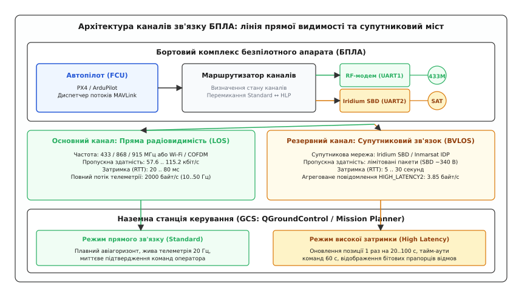
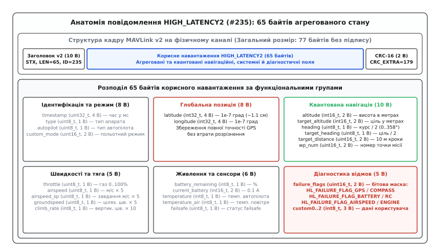
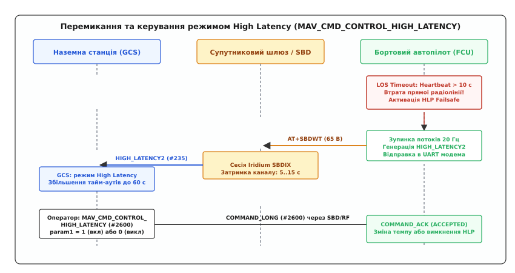
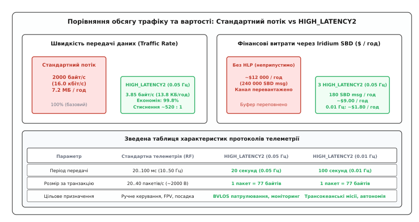

# Протокол великої затримки MAVLink: зв'язок через супутник і вузькі канали

<preknowlist>
- [Пакет MAVLink](topic:communications/mavlink-packet) — будова кадру v1/v2, поля заголовка, контрольні суми CRC та ідентифікатори повідомлень.
- [Потік телеметрії](topic:communications/telemetry-stream) — принципи періодичної трансляції польотного стану та розподіл смуги пропускання.
- [Команди MAVLink](topic:communications/mavlink-commands) — протокол передачі наказів COMMAND_LONG і транзакції підтвердження.
- [Смуга і межа Шеннона](topic:communications/bandwidth-capacity) — теоретичні межі передачі даних та ціна спектральної ефективності у завадових каналах.
- [Протокол ARQ](topic:communications/arq-protocol) — методи підтвердження доставки та поведінка ліній зв'язку з великим часом кругового обігу.
</preknowlist>

Коли безпілотний літак далекого радіуса дії під час морського патрулювання чи моніторингу трубопроводів віддаляється від наземного пункту керування на відстань понад 50–70 кілометрів, стандартний ультракороткохвильовий радіоканал діапазону 433, 868 або 915 МГц неминуче згасає через кривизну земної поверхні та рельєфні перешкоди. Бортовий автопілот повністю втрачає пряму радіовидимість (LOS, англ. *Line of Sight*) із базовою станцією. Єдиним фізичним способом зберегти контроль над апаратом у польоті поза прямою радіовидимістю (BVLOS, англ. *Beyond Visual Line of Sight*) залишається перехід на глобальні супутникові системи зв'язку (Iridium SBD, Inmarsat IsatData Pro) або стільникові мережі для інтернету речей стандарту NB-IoT. Проте супутниковий канал кардинально відрізняється від радіомодема: корисна смуга пропускання вимірюється не десятками кілобітів, а лімітованими транзакціями по кілька десятків байтів, час кругового обігу сигналу (RTT, англ. *Round-Trip Time*) становить від 5 до 30 секунд, а кожен переданий байт тарифікується комерційним провайдером за високою ціною.

### Чому класична телеметрія руйнує супутниковий канал

У прямому радіоканалі польотний контролер безперервно транслює в ефір широкий набір незалежних повідомлень [потоку телеметрії](topic:communications/telemetry-stream). Кожна підсистема автопілота випромінює власні пакети з різною періодичністю:
* Кутові координати орієнтації `ATTITUDE` транслюються з частотою 20–50 Гц для плавного відображення штучного авіагоризонту;
* Глобальні координати `GLOBAL_POSITION_INT` та вектор швидкостей надходять із частотою 5–10 Гц;
* Параметри приладової швидкості, висоти та курсу `VFR_HUD` транслюються з частотою 2–5 Гц;
* Стан акумуляторної батареї та струм `SYS_STATUS` і `BATTERY_STATUS` оновлюються з частотою 1–2 Гц;
* Навігаційні помилки траєкторії `NAV_CONTROLLER_OUTPUT` надсилаються на 5 Гц;
* Періодичні сигнали присутності `HEARTBEAT` генеруються щосекунди.

Кожен такий пакет запаковується у стандартний [двійковий кадр MAVLink](topic:communications/mavlink-packet), який містить 10 байтів заголовка v2 та 2 байти контрольної суми CRC-16. Сумарний трафік цього потоку генерує від 1500 до 2500 байтів корисних даних щосекунди (середнє значення близько 2000 байт/с або 16 кбіт/с).

```
Стандартний потік MAVLink (пряма радіолінія LOS):
┌──────────────┬──────────────┬──────────────┬──────────────┬──────────────┐
│ ATTITUDE     │ GLOBAL_POS   │ VFR_HUD      │ SYS_STATUS   │ NAV_OUTPUT   │ ...
│ (20 Гц, 40B) │ (10 Гц, 40B) │ (5 Гц, 32B)  │ (2 Гц, 43B)  │ (5 Гц, 38B)  │
└──────────────┴──────────────┴──────────────┴──────────────┴──────────────┘
  Трафік: ~2000 байт/с (7.3 МБ/год) · Затримка: 20..50 мс · Пряме ручне керування
```

Спроба спрямувати цей 2-кілобайтний секундний потік у супутниковий модем (наприклад, Iridium 9603 SBD) призводить до трьох незворотних інженерних катастроф:
1. **Переповнення апаратного буфера модема:** внутрішній вхідний буфер супутникового пристрою розрахований на прийом одного блоку даних розміром до 340 байтів для поточної супутникової сесії. Потік у 2000 байт/с переповнює пам'ять модема за 150 мілісекунд, спричиняючи втрату 99.5% усіх каскадних пакетів.
2. **Економічна неприйнятність місії:** передача коротких пакетів через сузір'я Iridium тарифікується блоками або одиничними кредитами (близько $0.05–$0.12 за кожні 30–50 байтів). Постійна трансляція 2000 байт/с вимагатиме понад 140 000 супутникових транзакцій на годину, що генерує рахунок у понад $10 000 за одну годину польоту.
3. **Руйнування контурів керування:** через фізичну затримку ретрансляції через супутникові орбіти (RTT 5–20 с) наземна станція не може інтерполювати високочастотні кути орієнтації, а механізм автоматичних запитів втрачених пакетів [протоколу ARQ](topic:communications/arq-protocol) викликає колапс буферів повторної передачі.

Історичний шлях розвитку далекої безпілотної телеметрії — від першого трансатлантичного перельоту дрона Aerosonde у 1998 році до створення спеціалізованих супутникових протоколів — висвітлено в [історії розвитку супутникової телеметрії БПЛА](topic:communications/mavlink-high-latency/hist-satellite-telemetry.md).

### Архітектура дворівневого зв'язку: пряма радіолінія та супутниковий міст

Для вирішення цього протиріччя в сучасних безпілотних комплексах застосовується гібридна дворівнева архітектура каналів передачі даних.


*Дворівнева архітектура зв'язку БПЛА: у зоні прямої видимості автопілот транслює повний потік телеметрії через RF-модем (2000 байт/с); при виході за радіогоризонт маршрутизатор перемикається на супутниковий міст Iridium SBD, надсилаючи компактне повідомлення HIGH_LATENCY2 (3.85 байт/с).*

Бортовий автопілот (PX4 Autopilot або ArduPilot) оснащується двома незалежними фізичними інтерфейсами зв'язку:
* **Основний канал прямої видимості (Primary LOS Link):** підключається до порту `TELEM1` (UART, 57600–115200 бод) і веде до цифрового радіомодема 433/868/915 МГц або направленого Wi-Fi/COFDM каналу. Цей лінк забезпечує повний потік даних (2000 байт/с) із мінімальною затримкою (20–50 мс) під час зльоту, посадки та пілотування в радіусі до 50 км.
* **Резервний супутниковий міст (Secondary BVLOS Link):** підключається до порту `TELEM2` (UART, 19200 бод) і веде до супутникового трансивера Iridium SBD (модулі RockBLOCK 9603 або NAL 9602). Цей канал активується виключно в режимі великої затримки.
* **Динаміка орбітального перемикання (Satellite Handover):** Супутники низької навколоземної орбіти рухаються зі швидкістю близько 7.5 км/с, тому кожен окремий космічний апарат перебуває в зоні прямої видимості літака лише протягом 7–11 хвилин. Модем автоматично виконує міжсупутниковий хендовер (перемикання на наступний супутник сузір'я) без розриву логічного з'єднання автопілота.

Коли безпілотник виходить із зони дії наземної антени, бортовий маршрутизатор фіксує тайм-аут пакетів підтвердження від станції керування (Heartbeat Loss Failsafe), повністю блокує високочастотні потоки MAVLink на супутниковому інтерфейсі та активує протокол великої затримки (High Latency Protocol, HLP). Завдяки міжсупутниковим лазерним та радіорелейним лінкам (ISL, Inter-Satellite Links) угруповання Iridium передає пакет `HIGH_LATENCY2` від одного космічного апарата до іншого по орбіті, скидаючи його на найближчу наземну станцію сполучення (Gateway Earth Station) у будь-якій географічній точці земної кулі, включаючи Північний та Південний полюси.

### Анатомія агрегованого повідомлення HIGH_LATENCY2 (#235)

Фундаментальна ідея протоколу великої затримки полягає в заміні кількох десятків роздільних повідомлень **одним єдиним компактним агрегованим кадром**.

Замість надсилання окремих структур `ATTITUDE`, `GLOBAL_POSITION_INT`, `VFR_HUD`, `BATTERY_STATUS`, `NAV_CONTROLLER_OUTPUT`, `SYS_STATUS` та `GPS_RAW_INT` автопілот формує повідомлення `HIGH_LATENCY2` (числовий ідентифікатор `MSG ID 235`, контрольний байт сумісності `CRC_EXTRA = 179`).


*Структура кадру HIGH_LATENCY2 (#235): 65 байтів корисного навантаження вміщують координати, параметри руху, стан акумулятора, активну точку місії та 16-бітну маску відмов, зменшуючи розмір кадру на дроті до 77 байтів.*

Повний розмір кадру на фізичному каналі становить:
```
Size_frame = 10 (Заголовок v2) + 65 (Payload) + 2 (CRC-16) = 77 байтів
```

Корисне навантаження повідомлення `HIGH_LATENCY2` займає рівно 65 байтів і містить вичерпний зріз поточного навігаційного, системного та аварійного стану безпілотника:

1. **Ідентифікація та режим польоту (8 байтів):**
   * `timestamp` (`uint32_t`, 4 байти) — системний час автопілота в мілісекундах від запуску або час UTC.
   * `type` (`uint8_t`, 1 байт) — тип повітряного судна з переліку `MAV_TYPE` (літак із фіксованим крилом, мультиротор, СВВП/VTOL тощо).
   * `autopilot` (`uint8_t`, 1 байт) — тип польотного стеку (`MAV_AUTOPILOT_PX4` або `MAV_AUTOPILOT_ARDUPILOTMEGA`).
   * `custom_mode` (`uint16_t`, 2 байти) — внутрішній польотний режим автопілота (наприклад, `AUTO.MISSION`, `AUTO.RTL`, `POSCTL`).

2. **Високоточні глобальні координати (8 байтів):**
   * `latitude` (`int32_t`, 4 байти) — географічна широта у форматі WGS-84 у масштабі `1e-7` градусів.
   * `longitude` (`int32_t`, 4 байти) — географічна довгота у форматі WGS-84 у масштабі `1e-7` градусів.
   Збереження 32-бітних цілих чисел для координат є критично важливим: масштаб `1e-7` забезпечує лінійну просторову роздільну здатність близько 1.1 сантиметра на екваторі, що повністю виключає деградацію навігаційної точності GPS на супутниковому каналі.

3. **Квантовані параметри просторового положення та навігації (10 байтів):**
   * `altitude` (`int16_t`, 2 байти) — абсолютна висота над рівнем моря (AMSL) у цілих метрах (діапазон від -32 768 до +32 767 м замість міліметрів у класичному повідомленні).
   * `target_altitude` (`int16_t`, 2 байти) — задана польотним завданням цільова висота в метрах.
   * `heading` (`uint8_t`, 1 байт) — поточний магнітний/істинний курс польоту в одиницях по 2 градуси (діапазон 0..358°).
   * `target_heading` (`uint8_t`, 1 байт) — цільовий курс до наступної поворотної точки в одиницях по 2 градуси.
   * `target_distance` (`uint16_t`, 2 байти) — відстань до активної маршрутної точки в декаметрах (одиниці по 10 метрів, діапазон охоплення до 655.35 км).
   * `wp_num` (`uint16_t`, 2 байти) — порядковий номер активної точки завантаженої польотної місії.

4. **Параметри динаміки польоту та тяги (5 байтів):**
   * `throttle` (`uint8_t`, 1 байт) — поточний відсоток газу силової установки (0..100%).
   * `airspeed` (`uint8_t`, 1 байт) — приладова повітряна швидкість (IAS), масштабована з коефіцієнтом 5 (1 одиниця = 0.2 м/с).
   * `airspeed_sp` (`uint8_t`, 1 байт) — задана автопілотом приладова швидкість (1 одиниця = 0.2 м/с).
   * `groundspeed` (`uint8_t`, 1 байт) — шляхова швидкість відносно землі за GPS (1 одиниця = 0.2 м/с).
   * `climb_rate` (`int8_t`, 1 байт) — вертикальна швидкість варіометра в дециметрах за секунду (1 одиниця = 0.1 м/с, діапазон від -12.8 до +12.7 м/с).

5. **Стан живлення, сенсорів та атмосфери (8 байтів):**
   * `battery` (`int8_t`, 1 байт) — залишковий заряд тягової батареї у відсотках (0..100%, значення `-1` означає відсутність даних).
   * `current_battery` (`int16_t`, 2 байти) — миттєвий струм розряду батареї в десятих долях Ампера (0.1 А або 100 мА).
   * `temperature` (`int8_t`, 1 байт) — температура процесорної плати польотного контролера в цілих градусах Цельсія (-128..+127 °C).
   * `temperature_air` (`int8_t`, 1 байт) — температура навколишнього повітря за бортом (°C).
   * `windspeed` (`uint8_t`, 1 байт) — розрахункова швидкість вітру (1 одиниця = 0.2 м/с).
   * `wind_heading` (`uint8_t`, 1 байт) — напрямок, звідки дме вітер (одиниці по 2 градуси).
   * `eph` / `epv` (`uint8_t`, 2 байти) — горизонтальна та вертикальна оцінка похибки GPS (HDOP/VDOP) у десятих долях метра (0.1 м).

6. **Діагностика відмов та дані користувача (6 байтів):**
   * `failure_flags` (`uint16_t`, 2 байти) — бітова маска критичних несправностей бортових систем (`HL_FAILURE_FLAG`).
   * `failsafe` (`uint8_t`, 1 байт) — бітовий статус спрацьовування захисних автоматів повернення додому.
   * `custom0`, `custom1`, `custom2` (`int8_t`, 3 байти) — користувацькі поля телеметрії корисного навантаження (наприклад, лічильник знятих фотокадрів, стан реле скидання вантажу чи температура сенсора корисного навантаження).

Повний перелік числових зсувів, граничних значень та розпакувальних формул наведено у [довідці інтерфейсу High Latency](topic:communications/mavlink-high-latency/api-high-latency-protocol.md).

### Принципи бітової компресії та квантування полів

Щоб упакувати весь спектр аналогових фізичних величин літака в 65 байтів без втрати функціональної значущості для оператора, протокол `HIGH_LATENCY2` використовує спеціальні методи нелінійного квантування та масштабування.

Розглянемо фізичний зміст та похибки квантування основних типів величин:

#### 1. Квантування навігаційного курсу (Heading Compression)
Повний кут курсу охоплює діапазон від `0.0°` до `360.0°`. У стандартному протоколі цей параметр передається 32-бітним числом з плаваючою комою `float` (4 байти, мікрорадіани) або `uint16_t` (2 байти, соті долі градуса).
У протоколі High Latency курс ділиться на 2 і стискається в один байт `uint8_t`:
```
B = (uint8_t)(round(Heading_deg / 2.0)) % 180
```
* **Роздільна здатність:** `Δθ = 2.0°`.
* **Максимальна похибка квантування:** `ε_max = ±1.0°`.
* **Економія пам'яті:** скорочення розміру поля на **75%** (з 4 байтів до 1 байта).
Для літака, що летить транзитним маршрутом між точками на відстані сотень кілометрів, похибка курсу в 1° на екрані карти є абсолютно невідчутною. Бортовий алгоритм L1-навігації (L1 Non-Linear Guidance Logic) веде літак не за миттєвим кутом рискання (Yaw), а за розрахунковою боковою лінійною похибкою відносно відрізка маршруту (Cross-Track Error), яка обчислюється безпосередньо за неквантованими координатами GPS високої точності.

#### 2. Масштабування швидкостей (Airspeed / Groundspeed)
Швидкість безпілотних апаратів тактичного та цивільного класу рідко перевищує 180 км/год (50 м/с). Замість передачі 4-байтового `float` значення швидкості множиться на 5:
```
B_speed = (uint8_t)(fminf(Speed_mps · 5.0, 255.0))
```
* **Крок квантування:** `1 / 5 = 0.2 м/с` (0.72 км/год).
* **Максимальна вимірювана швидкість:** `255 / 5 = 51.0 м/с` (183.6 км/год).
* **Економія пам'яті:** **75%** скорочення обсягу на кожному полі швидкості.

#### 3. Масштабування висоти AMSL (Altitude)
Стандартне повідомлення `GLOBAL_POSITION_INT` передає абсолютну висоту в міліметрах (`int32_t`, 4 байти). У супутниковому режимі висота округлюється до цілих метрів і записується як 16-бітне знакове число `int16_t` (2 байти):
* **Діапазон:** від `-32 768 метрів` (мертві западини) до `+32 767 метрів` (стратосфера).
* **Похибка:** `±0.5 метра`.
* **Економія:** **50%** розміру поля. Точність у 1 метр повністю відповідає висотомірним стандартам ешелонування цивільної авіації (ICAO).

Детальний аналітичний розрахунок теореми відліків, спектральних меж та теорії компресії наведено у [математичному розрахунку затримки та пропускної здатності](topic:communications/mavlink-high-latency/math-latency-bandwidth.md).

### Діагностика безпеки польоту: бітова маска HL_FAILURE_FLAG

У супутниковому режимі оператор позбавлений можливості відкрити графік вібрацій сенсорів чи детальний монітор напруги окремих банок акумулятора. Тому протокол `HIGH_LATENCY2` реалізує концепцію інтелектуальної бортової діагностики через 16-бітне поле `failure_flags`.

Якщо бортовий фільтр стану EKF (Extended Kalman Filter) або менеджер живлення виявляє збій, автопілот автоматично встановлює відповідні біти в масці:

```
Біти діагностичної маски HL_FAILURE_FLAG (16 бітів / uint16_t):
┌───┬───┬───┬───┬───┬───┬───┬───┬───┬───┬───┬───┬───┬───┬───┬───┐
│15 │14 │13 │12 │11 │10 │ 9 │ 8 │ 7 │ 6 │ 5 │ 4 │ 3 │ 2 │ 1 │ 0 │
└───┴───┴───┴───┴───┴───┴───┴───┴───┴───┴───┴───┴───┴───┴───┴───┘
  │   │   │   │   │   │   │   │   │   │   │   │   │   │   │   └─ Біт 0: GPS Failure
  │   │   │   │   │   │   │   │   │   │   │   │   │   │   └─── Біт 1: Airspeed (Pitot) Bad
  │   │   │   │   │   │   │   │   │   │   │   │   │   └─────── Біт 2: Barometer Bad
  │   │   │   │   │   │   │   │   │   │   │   │   └─────────── Біт 3: Accel IMU Bad
  │   │   │   │   │   │   │   │   │   │   │   └─────────────── Біт 4: Gyro IMU Bad
  │   │   │   │   │   │   │   │   │   │   └─────────────────── Біт 5: Compass / Mag Bad
  │   │   │   │   │   │   │   │   │   └─────────────────────── Біт 6: Terrain DB Loss
  │   │   │   │   │   │   │   │   └─────────────────────────── Біт 7: Battery Critical
  │   │   │   │   │   │   │   └─────────────────────────────── Біт 8: RC Signal Lost
  │   │   │   │   │   │   └─────────────────────────────────── Біт 9: Offboard Link Lost
  │   │   │   │   │   └─────────────────────────────────────── Біт 10: Engine / ESC Failure
  │   │   │   │   └─────────────────────────────────────────── Біт 11: Geofence Breach
  │   │   │   └─────────────────────────────────────────────── Біт 12: EKF Estimator Diverged
  │   │   └─────────────────────────────────────────────────── Біт 13: Mission Error
  └───┴─────────────────────────────────────────────────────── Біти 14..15: Резерв
```

При отриманні пакета `HIGH_LATENCY2` наземна станція керування (QGroundControl) миттєво підсвічує відповідні індикатори на панелі приладів червоним кольором (наприклад: `[COMPASS FAIL]`, `[AIRSPEED FAIL]`, `[LOW BATTERY]`), що дає оператору повне розуміння критичної ситуації навіть за відсутності живого потоку телеметрії.

### Керування протоколом: MAV_CMD_CONTROL_HIGH_LATENCY (#2600)

Перехід між стандартним високочастотним потоком та супутниковим режимом `HIGH_LATENCY2` здійснюється як автоматично (за тайм-аутом зв'язку), так і вручну оператором за допомогою спеціалізованої [команди MAVLink](topic:communications/mavlink-commands) `MAV_CMD_CONTROL_HIGH_LATENCY` (`#2600`).


*Конвеєр перемикання режимів зв'язку: при втраті радіолінії автопілот зупиняє високочастотні потоки телеметрії, активує HLP Failsafe та транслює повідомлення HIGH_LATENCY2 через супутниковий модем.*

Команда передається в стандартному кадрі `COMMAND_LONG` (`MSG ID 76`):

:::tabs
```c
#include <mavlink.h>

void send_control_high_latency_command(uint8_t target_sys, uint8_t target_comp, bool enable) {
    mavlink_message_t msg;
    mavlink_command_long_t cmd = {0};

    cmd.target_system    = target_sys;
    cmd.target_component = target_comp;
    cmd.command          = MAV_CMD_CONTROL_HIGH_LATENCY; // Команда #2600
    cmd.confirmation     = 0;
    cmd.param1           = enable ? 1.0f : 0.0f;        // 1.0 = Увімкнути HLP, 0.0 = Вимкнути
    cmd.param2           = 0.0f;                         // Резерв
    cmd.param3           = 0.0f;
    cmd.param4           = 0.0f;
    cmd.param5           = 0.0f;
    cmd.param6           = 0.0f;
    cmd.param7           = 0.0f;

    mavlink_msg_command_long_encode(255, 190, &msg, &cmd);
    // Відправка пакета в активний канал зв'язку
}
```
```cpp
#include <mavlink.h>
#include <array>
#include <span>
#include <cstdint>

class HighLatencyController {
public:
    static mavlink_message_t createControlCommand(uint8_t target_sys, uint8_t target_comp, bool enable) noexcept {
        mavlink_message_t msg{};
        mavlink_command_long_t cmd{};

        cmd.target_system    = target_sys;
        cmd.target_component = target_comp;
        cmd.command          = MAV_CMD_CONTROL_HIGH_LATENCY;
        cmd.confirmation     = 0;
        cmd.param1           = enable ? 1.0f : 0.0f;

        mavlink_msg_command_long_encode(255, 190, &msg, &cmd);
        return msg;
    }
};
```
:::

Автопілот, отримавши команду з `param1 = 1.0f`:
1. Вимикає генерацію всіх періодичних структур `ATTITUDE`, `GLOBAL_POSITION_INT`, `VFR_HUD`, `SYS_STATUS` на вказаному каналі.
2. Вмикає таймер генерації повідомлення `HIGH_LATENCY2` із заданим періодом (наприклад, 1 раз на 20 секунд).
3. Повертає підтвердження `COMMAND_ACK` із результатом `MAV_RESULT_ACCEPTED`.

Архітектуру драйвера супутникового модема, алгоритм обробки AT-команд `AT+SBDIX` та керування чергами UART наведено у [практичній реалізації супутникового мосту](topic:communications/mavlink-high-latency/proj-satellite-bridge.md).

### Налаштування темпу відправки та порівняльний аналіз трафіку

Період відправки повідомлення `HIGH_LATENCY2` налаштовується в системних параметрах автопілота (наприклад, у параметрі PX4 `NAV_DLL_ACT` або ArduPilot `SCHED_LOOP_RATE` для каналів великої затримки).

Типовий діапазон частоти становить від **0.1 Гц до 0.01 Гц** (один пакет кожні 10..100 секунд).


*Порівняння характеристик каналів: перехід на HIGH_LATENCY2 при темпі 0.05 Гц (1 пакет / 20 с) зменшує навантаження на канал у 520 разів (з 2000 до 3.85 байт/с), знижуючи вартість години супутникового моніторингу до ~$9.00.*

Порівняємо ключові метрики трьох режимів зв'язку:

| Параметр каналу | Стандартна телеметрія (RF) | HIGH_LATENCY2 (0.05 Гц) | HIGH_LATENCY2 (0.01 Гц) |
|---|---|---|---|
| **Фізичне середовище** | Радіомодем 433/915 МГц | Супутник Iridium SBD | Супутник / NB-IoT |
| **Період трансляції** | 20..100 мс (10..50 Гц) | 20 секунд (0.05 Гц) | 100 секунд (0.01 Гц) |
| **Розмір корисного кадру** | 20..40 повідомлень/с | 1 кадр = 77 байтів | 1 кадр = 77 байтів |
| **Середня швидкість даних**| ~2000 байт/с (16 кбіт/с) | **3.85 байт/с** (31 біт/с) | **0.77 байт/с** (6.2 біт/с) |
| **Годинний обсяг трафіку** | 7.2 Мегабайта / год | **13.8 Кілобайта / год**| **2.77 Кілобайта / год**|
| **Кількість SBD-транзакцій**| Неприпустимо (переповнення) | 180 повідомлень / год | 36 повідомлень / год |
| **Орієнтовна вартість** | Безкоштовно (радіоефір) | **~$9.00 / год** | **~$1.80 / год** |
| **Цільове призначення** | Ручне пілотування, FPV | BVLOS-патрулювання | Трансокеанські місії |

Коефіцієнт стиснення трафіку для базового супутникового темпу (0.05 Гц) становить:
```
K_comp = 2000 / 3.85 ≈ 519.5 : 1
```

Скорочення навантаження на лінію на **99.81%** дозволяє безперервно контролювати дальні місії протягом десятків годин польоту без ризику фінансового виснаження проекту.

### Розрахунковий приклад: кодування та верифікація кадру HIGH_LATENCY2

Розглянемо повний цикл: бортовий модуль формує структуру `HIGH_LATENCY2`, кодує її у вихідний буфер MAVLink v2 та передає через інтерфейс супутникового моста.

:::tabs
```c
#include <mavlink.h>
#include <stdio.h>
#include <math.h>

void generate_and_send_high_latency(uint8_t system_id, uint8_t component_id) {
    mavlink_message_t msg;
    mavlink_high_latency2_t hl = {0};

    // 1. Заповнення системних полів
    hl.timestamp = 3600000; // 1 година польоту (мс)
    hl.type = MAV_TYPE_FIXED_WING;
    hl.autopilot = MAV_AUTOPILOT_PX4;
    hl.custom_mode = 3; // AUTO.MISSION

    // 2. Глобальні координати (Одеса: 46.482526° N, 30.723309° E)
    hl.latitude = (int32_t)round(46.482526 * 1e7);
    hl.longitude = (int32_t)round(30.723309 * 1e7);

    // 3. Навігаційні параметри
    hl.altitude = 450;        // 450 метрів AMSL
    hl.target_altitude = 500; // Ціль: 500 метрів
    hl.heading = (uint8_t)(round(124.0 / 2.0)); // Курс 124° -> значення 62
    hl.target_heading = (uint8_t)(round(130.0 / 2.0));
    hl.target_distance = (uint16_t)round(2450.0 / 10.0); // 2450 м -> 245 декаметрів
    hl.wp_num = 14;

    // 4. Швидкості та тяга
    hl.throttle = 65; // 65% газу
    hl.airspeed = (uint8_t)round(22.4 * 5.0);    // 22.4 м/с -> 112
    hl.airspeed_sp = (uint8_t)round(22.0 * 5.0); // 22.0 м/с -> 110
    hl.groundspeed = (uint8_t)round(24.8 * 5.0); // 24.8 м/с -> 124
    hl.climb_rate = (int8_t)round(1.2 * 10.0);   // +1.2 м/с -> 12 дм/с

    // 5. Живлення та сенсори
    hl.battery = 78; // 78% заряду
    hl.current_battery = (int16_t)round(18.5 * 10.0); // 18.5 А -> 185
    hl.temperature = 42;     // 42 °C всередині фюзеляжу
    hl.temperature_air = 14; // 14 °C за бортом

    // 6. Діагностична маска (все справно, GPS 3D Fix)
    hl.failure_flags = 0; // Немає відмов
    hl.failsafe = 0;

    // Кодування кадру MSG ID 235
    mavlink_msg_high_latency2_encode(system_id, component_id, &msg, &hl);

    // Пакування у двійковий масив для відправки в UART супутникового модема
    uint8_t send_buf[MAVLINK_MAX_PACKET_LEN];
    uint16_t bytes_to_send = mavlink_msg_to_send_buffer(send_buf, &msg);

    // bytes_to_send = 10 (Header) + 65 (Payload) + 2 (CRC) = 77 байтів
    printf("Сформовано кадр HIGH_LATENCY2. Розмір: %u байтів\n", bytes_to_send);
}
```
```cpp
#include <mavlink.h>
#include <iostream>
#include <vector>
#include <cmath>
#include <array>

class HighLatencyTelemetryProvider {
public:
    static std::vector<uint8_t> buildPacket(uint8_t sys_id, uint8_t comp_id) {
        mavlink_message_t msg{};
        mavlink_high_latency2_t hl{};

        hl.timestamp = 3600000;
        hl.type = MAV_TYPE_FIXED_WING;
        hl.autopilot = MAV_AUTOPILOT_PX4;
        hl.custom_mode = 3;

        hl.latitude = static_cast<int32_t>(std::round(46.482526 * 1e7));
        hl.longitude = static_cast<int32_t>(std::round(30.723309 * 1e7));

        hl.altitude = 450;
        hl.target_altitude = 500;
        hl.heading = static_cast<uint8_t>(std::round(124.0 / 2.0));
        hl.target_heading = static_cast<uint8_t>(std::round(130.0 / 2.0));
        hl.target_distance = static_cast<uint16_t>(std::round(2450.0 / 10.0));
        hl.wp_num = 14;

        hl.throttle = 65;
        hl.airspeed = static_cast<uint8_t>(std::round(22.4 * 5.0));
        hl.airspeed_sp = static_cast<uint8_t>(std::round(22.0 * 5.0));
        hl.groundspeed = static_cast<uint8_t>(std::round(24.8 * 5.0));
        hl.climb_rate = static_cast<int8_t>(std::round(1.2 * 10.0));

        hl.battery = 78;
        hl.current_battery = static_cast<int16_t>(std::round(18.5 * 10.0));
        hl.temperature = 42;
        hl.temperature_air = 14;
        hl.failure_flags = 0;
        hl.failsafe = 0;

        mavlink_msg_high_latency2_encode(sys_id, comp_id, &msg, &hl);

        std::vector<uint8_t> buffer(MAVLINK_MAX_PACKET_LEN);
        const uint16_t len = mavlink_msg_to_send_buffer(buffer.data(), &msg);
        buffer.resize(len);

        return buffer;
    }
};
```
:::

### Внутрішня архітектура польотного стеку: механізм агрегації uORB у PX4

Для формування повідомлення `HIGH_LATENCY2` бортовий комп'ютер автопілота не опитує фізичні датчики напряму. У сучасних польотних стеках на базі операційної системи реального часу NuttX (PX4 Autopilot) функціонує асинхронна шина публікації та підписки на мікроповідомлення uORB (micro Object Request Broker).

Модуль потокової передачі MAVLink (`mavlink_messages.cpp`) містить виділений обробник `MavlinkStreamHighLatency2`. Цей обробник підписується на вісім незалежних внутрішніх топіків автопілота:

```
Потоки даних uORB у конвеєрі формування HIGH_LATENCY2 (PX4):
┌───────────────────────────────┐
│ vehicle_global_position       ├─────► Широта, довгота, висота AMSL
├───────────────────────────────┤
│ vehicle_attitude              ├─────► Поточний курс (Yaw)
├───────────────────────────────┤
│ vehicle_status                ├─────► Режим польоту, статус Arming, тип судна
├───────────────────────────────┤
│ battery_status                ├─────► Відсоток заряду, струм розряду, температура
├───────────────────────────────┤
│ airspeed_validated            ├─────► Приладова повітряна швидкість (IAS)
├───────────────────────────────┤  ┌─────────────────────────────────┐
│ wind                          ├─►│  MavlinkStreamHighLatency2      │
├───────────────────────────────┤  │  (mavlink_messages.cpp)        │
│ position_setpoint_triplet     ├─►│  • Квантування величин          ├──► Кадр MAVLink v2
├───────────────────────────────┤  │  • Перевірка прапорців відмов   │    (MSG ID 235, 77 B)
│ estimator_status_flags        ├─►│  • Генерація 1 раз на 20 секунд │
└───────────────────────────────┘  └─────────────────────────────────┘
```

Робота конвеєра збирання кадру відбувається за такими кроками:
1. **Зняття снапшоту польотного стану:** При спрацьовуванні таймера періоду (наприклад, кожні 20 000 мс) потік MAVLink виконує блокуюче зчитування найсвіжіших структур з усіх восьми топіків uORB через виклики `orb_copy()`.
2. **Агрегація діагностичних прапорців:** Модуль аналізує бітові маски з топіка `estimator_status_flags`. Якщо фільтр EKF фіксує перевищення інноваційних нев'язок за даними магнітометра (`cs_mag_fault == true`), автоматично встановлюється біт `HL_FAILURE_FLAG_3D_MAG`. Якщо напруга батареї опускається нижче порогу аварійного попередження, активується `HL_FAILURE_FLAG_BATTERY`.
3. **Квантування та пакування:** Фізичні значення з плаваючою комою приводяться до цілих чисел відповідного масштабу за допомогою функцій `roundf()` та обмежувачів діапазону `math::constrain()`.
4. **Видача в UART:** Сформована структура записується у вихідний буфер кільцевого чергування порту послідовного зв'язку, підключеного до супутникового трансивера.

### Діагностика та трасування HLP через консоль NuttX NSH

Інженери з інтеграції та оператори БПЛА мають можливість простежити роботу конвеєра великої затримки в реальному часі через системну консоль автопілота NuttX Shell (NSH).

Для перевірки генерації повідомлення та вмісту агрегованих полів виконується команда моніторингу топіків:

```bash
# Перегляд публікації топіка high_latency2 в консолі NSH
nsh> uorb top high_latency2

# Виведення детального вмісту останнього сформованого кадру
nsh> listener high_latency2

TOPIC: high_latency2
 high_latency2_s
    timestamp: 3600124500 (0.0200s ago)
    latitude: 464825246 (46.4825246 deg)
    longitude: 307233021 (30.7233021 deg)
    custom_mode: 3 (AUTO_MISSION)
    altitude: 450 m
    target_altitude: 500 m
    target_distance: 245 (2450 m)
    wp_num: 14
    failure_flags: 0 (0x0000 - ALL OK)
    heading: 62 (124 deg)
    target_heading: 65 (130 deg)
    throttle: 65 %
    airspeed: 112 (22.4 m/s)
    groundspeed: 124 (24.8 m/s)
    battery: 78 %
    current_battery: 185 (18.5 A)
    temperature: 42 deg C
```

Для примусового тестування супутникового каналу на землі без відключення основного радіомодема можна надіслати команду керування безпосередньо з командного рядка:

```bash
# Увімкнення режиму High Latency на інтерфейсі TELEM2 (/dev/ttyS2)
nsh> mavlink stream -d /dev/ttyS2 -s HIGH_LATENCY2 -r 0.05
```

### Конфігурація параметрів у польотних стеках PX4 та ArduPilot

Для коректної автоматичної активації протоколу великої затримки польотний контролер потребує попереднього налаштування системних параметрів:

#### 1. Параметри польотного стеку PX4 Autopilot:
* `COM_HL_EN` (High Latency Enable): бінарний прапорець (0 = вимкнено, 1 = увімкнено). Дозволяє автоматичну генерацію кадру `HIGH_LATENCY2` при втраті зв'язку на основному порту.
* `NAV_DLL_ACT` (Data Link Loss Action): алгоритм поведінки літака при втраті радіолінії прямої видимості. Значення `0` (Disabled) дозволяє безпілотнику продовжувати автономне виконання місії за точками маршруту, одночасно активуючи передачу супутникової телеметрії на наземну станцію замість аварійного негайного повернення додому.
* `MAV_2_CONFIG` / `MAV_2_MODE`: конфігурація порту `TELEM2` у режим роботи з супутниковим модемом (значення `High Latency / Iridium`).
* `MAV_2_RATE`: обмеження максимальної швидкості передачі байтів на каналі `TELEM2` (встановлюється значення `20 B/s`).

#### 2. Параметри польотного стеку ArduPilot (Plane / Copter):
* `HIGH_LATENCY_EN`: вмикає підтримку обробника `HIGH_LATENCY2` у планувальнику польотних завдань.
* `FS_GCS_ENABL`: встановлюється в значення `2` (Continue with Mission in Auto Mode), що дозволяє літаку не переривати політ за маршрутом при втраті сигналу прямого радіоканалу.
* `SERIAL2_PROTOCOL`: виставляється в значення `2` (MAVLink 2) зі швидкістю `SERIAL2_BAUD = 19` (19200 бод).

### Експлуатаційні процедури та протокол дій оператора BVLOS

Керування безпілотним літаком в умовах затримки сигналу 10–30 секунд вимагає суворого дотримання спеціальних правил льотної експлуатації:

1. **Передпольотний чек-лист супутникового каналу (Pre-Flight Link Check):**
   * Перевірка рівня сигналу супутникового угруповання через команду `AT+CSQ` (рівень повинен бути не менше 3 із 5 поділок);
   * Відправка тестового повідомлення `HIGH_LATENCY2` на стоянці та верифікація його відображення на центральному сервері диспетчеризації польотів;
   * Перевірка балансу активних кредитів на рахунку супутникового оператора (запас має покривати не менше 150% розрахункової тривалості польоту).
2. **Заборона ручного пілотування в режимі High Latency:**
   * Категорично забороняється передача команд прямого керування кермами висоти, елеронами чи тягою (Manual Stick Control). Через затримку в 15 секунд спроба ручного виправлення крену призводить до виникнення прогресуючих коливань апарата та неминучої авіакатастрофи.
3. **Керування через високорівневі навігаційні накази:**
   * Усі маневри в супутниковому режимі виконуються виключно через завантаження нових маршрутних точок або вибір режимів автопілота: зміна ешелону (`MAV_CMD_DO_REPOSITION`), зміна активної точки місії (`MAV_CMD_DO_SET_MISSION_CURRENT`) або наказ повернення на базу (`MAV_CMD_NAV_RETURN_TO_LAUNCH`).
4. **Дії при отриманні діагностичних прапорців відмови:**
   * При появі прапорця `HL_FAILURE_FLAG_GPS` оператор негайно віддає команду примусової активації парашутної системи або переводу в режим стабілізованого планерування за даними барометра та компаса.
   * При піднятті прапорця `HL_FAILURE_FLAG_BATTERY` оператор обирає найближчий запасний аеродром зі списку заздалегідь запрограмованих точок аварійної посадки.

### Особливості адаптації наземної станції QGroundControl

Прийом повідомлення `HIGH_LATENCY2` вимагає кардинальної перебудови логіки роботи наземної станції керування (GCS).

У звичайному режимі QGroundControl постійно надсилає запити на оновлення параметрів (`PARAM_REQUEST_LIST`), перевіряє стан місії та очікує відповіді на команди протягом 1000 мілісекунд (1 с). Якщо станція спробує виконувати ці дії через супутниковий канал, лінія миттєво заблокується чергами запитів.

При отриманні першого ж пакета `HIGH_LATENCY2` станція автоматично вмикає **High Latency View**:
1. **Збільшення тайм-аутів команд (Command Timeouts):** граничний час очікування підтвердження на наказ `COMMAND_LONG` (наприклад, зміна висоти або перемикання режиму `RTL`) збільшується з 1 секунди до **60 секунд**.
2. **Блокування фонових опитувань:** повністю відключаються запити списку параметрів, завантаження журналів польоту через [MAVLink FTP](topic:communications/mavlink-ftp) та високочастотні запити стану точок місії.
3. **Адаптивна візуалізація карти:** плавна анімація авіагоризонту вимикається (щоб не вводити оператора в оману застарілими даними), а положення літака на мапі оновлюється дискретними кроками з відображенням радіуса просторової невизначеності навколо останньої відомої точки GPS.
4. **Відображення статусу діагностики:** стан апарата відображається у вигляді компактної панелі системних прапорців на основі розпакованої маски `failure_flags`.

### Інтеграція з хмарними системами контролю повітряного простору (UTM / U-Space)

У сучасній безпілотній авіації дані `HIGH_LATENCY2` використовуються не лише оператором на пульті керування, а й передаються до глобальних систем моніторингу повітряного трафіку (Unmanned Traffic Management, UTM).

Супутниковий шлюз наземної станції після прийому SBD-пакета транслює геопросторові координати, висоту, швидкість та вектор руху літака за стандартом ASTM F3411 (Remote ID and Tracking) до диспетчерського центру повітряного руху цивільної авіації. Це дозволяє органам контролю повітряного простору (Air Traffic Control, ATC) здійснювати тактичне розведення безпілотника з пілотованою авіацією у повітряному просторі класів G та E навіть тоді, коли дрон знаходиться посеред океану поза зоною дії наземних радіолокаційних радарів (Secondary Surveillance Radar).

### Механізм відновлення прямого зв'язку (LOS Link Restoration)

Коли безпілотний літак повертається з дальнього маршруту та наближається до базового аеродрому на відстань 40–50 км, запускається процедура безшовного відновлення високошвидкісного зв'язку:

1. **Виявлення радіосигналу:** Наземна станція вловлює сигнал радіомодема прямої видимості та відновлює трансляцію пакетів присутності `HEARTBEAT` на частоті 1 Гц.
2. **Команда деактивації HLP:** Після отримання трьох послідовних підтверджень по основному радіоканалу наземна станція надсилає автопілоту команду `MAV_CMD_CONTROL_HIGH_LATENCY` з параметром `param1 = 0.0f` (Вимкнути High Latency).
3. **Відновлення високочастотних потоків:** Польотний контролер зупиняє періодичну трансляцію `HIGH_LATENCY2` на супутниковому інтерфейсі та відновлює трансляцію повного потоку телеметрії (2000 байт/с) через радіомодем.
4. **Синхронізація наземної станції:** Інтерфейс QGroundControl автоматично повертається зі спрощеного вигляду *High Latency View* до штатного режиму з високою частотою оновлення авіагоризонту, плавними графіками сенсорів та повною картою параметрів.

Завдяки протоколу `HIGH_LATENCY2` безпілотні комплекси отримують надійний, енергоефективний та економічно виправданий канал глобального супутникового телеметричного зв'язку, що дозволяє безпечно виконувати стратегічні місії на відстанях у тисячі кілометрів від бази.
