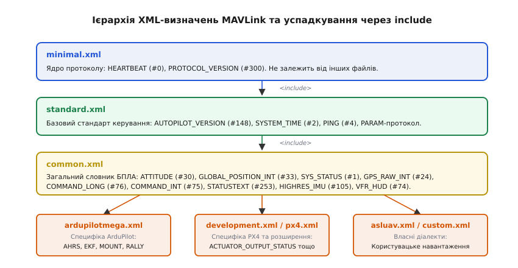
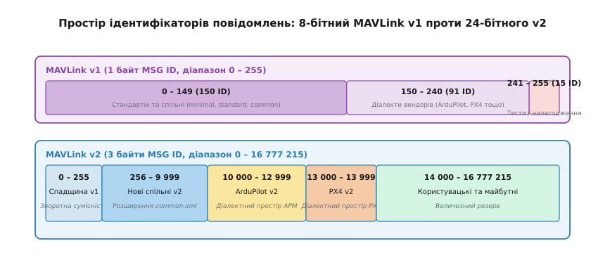
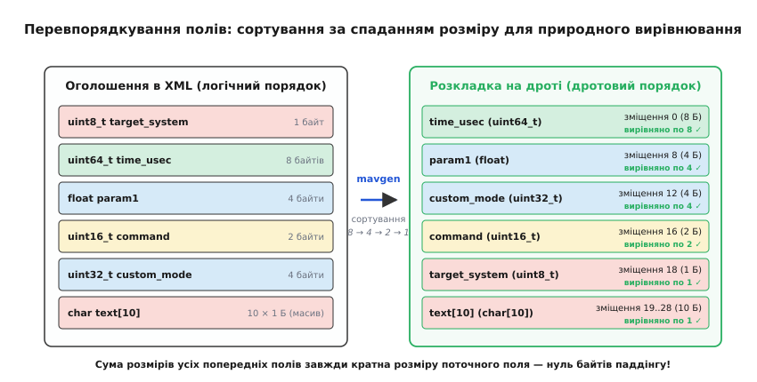
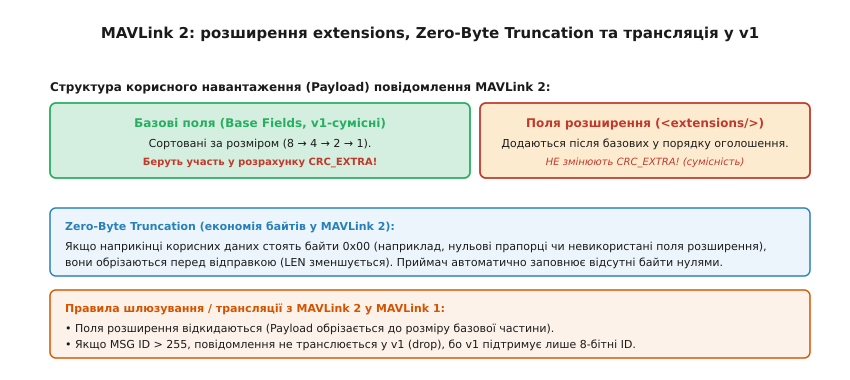

# Словник MAVLink: архітектура, XML-дефініції та серіалізація

<preknowlist>
- [Пакет MAVLink](topic:communications/mavlink-packet) — будова бінарного кадру: стартовий байт, заголовок, визначник повідомлення та контрольна сума.
- [Генерація коду з XML-опису MAVLink](topic:communications/mavlink-xml-codegen) — трансляція XML-схем інструментом mavgen та обчислення CRC_EXTRA.
- [Пакування бінарного протоколу](topic:programming/wire-format-packing) — розміщення полів у пам'яті, природне вирівнювання типів та відсутність паддінгу.
- [Порядок байтів](topic:programming/endianness) — прямий порядок байтів (little-endian) для багатобайтових чисел на дроті.
- [Координати й одиниці](topic:communications/coordinate-frames-units) — географічні системи WGS84, локальні системи відліку NED та масштабування одиниць.
</preknowlist>

Бортовий польотний контролер безпілотного апарата та наземна станція керування обмінюються телеметрією через послідовний радіомодем зі швидкістю 57600 бод. За одну секунду автопілот має передати просторову орієнтацію з частотою 20 Гц, координати GNSS з частотою 5 Гц, напругу та струм батареї з частотою 2 Гц, показники вібрацій сенсорів з частотою 50 Гц, а також приймати команди навігації та оновлення місії. Фізична пропускна здатність такого каналу становить лише близько 5.7 кілобайта на секунду. Якби система передавала текстові формати на кшталт JSON чи XML, де кожне значення супроводжується назвою поля, канал зв'язку захлинувся б службовими метаданими вже на першій секунді польоту.

Щоб передавати десятки потоків телеметрії вузьким радіоканалом, протокол MAVLink (англ. *Micro Air Vehicle Link*, «зв'язок із мікроповітряними апаратами») повністю вилучає текстові описи з ефіру. Замість самоописних пакетів використовується скомпільований наперед **словник повідомлень** (англ. *message dictionary*, від лат. *dictionarium*, «зібрання слів»). У двійковому потоці передається лише числовий ідентифікатор типу повідомлення, за яким одразу йде щільно упаковане бінарне корисне навантаження.

Проте відмова від самоописності створює жорстку інженерну залежність: обидві сторони комунікації зобов'язані мати абсолютно однакове уявлення про внутрішню структуру кожного повідомлення. Будь-яка розбіжність — зміщення байта, невідповідність порядку полів, різниця в одиницях вимірювання або додавання невідомого поля — призводить до того, що приймач зчитує шум замість координат і висоти. Архітектура словника MAVLink розв'язує цю задачу через ієрархічні XML-дефініції, математично вивірене сортування полів для вирівнювання пам'яті без заповнювачів та механізм безпечної еволюції повідомлень у MAVLink 2.

---

### Ієрархія та організація XML-дефініцій

Словник повідомлень MAVLink не зберігається як статична таблиця в коді: єдиним джерелом істини (англ. *single source of truth*) є набір декларативних файлів у форматі XML. Кожен файл описує множину числових переліків (enum) та структур повідомлень із типами полів, одиницями вимірювання та діапазонами значень.

Щоб протокол масштабувався від найпростіших мікроконтролерів до складних безпілотних комплексів із десятками сенсорів і камер, дефініції організовано у багаторівневу ієрархію включень за допомогою тегу `<include>`.


*Багаторівневе успадкування схем MAVLink: від мінімального ядра minimal.xml через загальний стандарт common.xml до спеціалізованих діалектів вендорів.*

В основі дерева дефініцій лежить файл `minimal.xml`. Він містить абсолютний мінімум, необхідний для виявлення системи на лінії зв'язку: повідомлення `HEARTBEAT` (#0) та `PROTOCOL_VERSION` (#300). Цей файл є повністю автономним, не містить тегів `<include>` і використовується в завантажувачах (bootloader), простих маяках або прошивках з обмеженим обсягом пам'яті.

Наступним рівнем є `standard.xml`, який підключає `minimal.xml` і додає фундаментальні протоколи керування: синхронізацію часу `SYSTEM_TIME` (#2), ехо-запити `PING` (#4), запит версії автопілота `AUTOPILOT_VERSION` (#148) та базовий протокол читання й запису параметрів.

Найбільшим і найчастіше використовуваним є файл `common.xml`. Він включає `standard.xml` і визначає загальноприйнятий словник безпілотної авіації: просторову орієнтацію, координати GPS, показники інерційних датчиків IMU, параметри польотного дисплея, місії та універсальні команди. Усі стандартні наземні станції (QGroundControl, Mission Planner) та автопілоти (PX4, ArduPilot) підтримують `common.xml` як базовий стандарт взаємодії.

Поверх `common.xml` будуються специфічні **діалекти** (англ. *dialects*, від грец. *dialektos*, «говірка») конкретних виробників та прошивок:
* `ardupilotmega.xml` — розширює стандартний словник повідомленнями для прошивок ArduPilot: звітами розширеного фільтра калманів (`EKF_STATUS_REPORT`), керуванням підвісами камер, специфічними режимами ралі-точок (`RALLYPOINT`) та калібруванням компасів.
* `development.xml` / `px4.xml` — містить експериментальні повідомлення стеку PX4 Autopilot та нові чорнові стандарти робочої групи MAVLink, які проходять польову верифікацію перед включенням до `common.xml`.
* `asluav.xml`, `matrixpilot.xml`, `storm32.xml` — діалекти спеціалізованих дослідницьких платформ та контролерів підвісів.

Механізм включень `<include>` гарантує, що будь-який автопілот, зібраний із діалектом `ardupilotmega.xml`, автоматично розуміє всі стандартні повідомлення `common.xml` і `minimal.xml`. Водночас це запобігає дублюванню коду: спільні повідомлення оновлюються в одному місці, а специфіка вендора ізолюється у власному файлі.

Кожен XML-файл складається з двох основних секцій: переліків (`<enums>`) та повідомлень (`<messages>`). Секція переліків задає числові константи, бітові маски та коди результатів виконання команд (наприклад, `MAV_AUTOPILOT`, `MAV_TYPE`, `MAV_CMD`, `MAV_RESULT`). Секція повідомлень містить елементи `<message>`, усередині яких за допомогою тегів `<field>` описуються окремі поля. Для кожного поля вказується базовий тип (`type="uint32_t"`), машинне ім'я (`name="custom_mode"`), необов'язкове посилання на відповідний перелік (`enum="MAV_MODE_FLAG"`) та текстовий опис призначення поля для автоматичної генерації коментарів і документації.

---

### Простір ідентифікаторів повідомлень: від 8 до 24 бітів

Кожне повідомлення у словнику позначається унікальним числовим ідентифікатором — **Message ID** (MSG ID). Формат і діапазон цього поля зазнали кардинальних змін під час переходу від першої до другої версії протоколу.


*Порівняння адресного простору ідентифікаторів повідомлень: обмежений 8-бітний діапазон MAVLink v1 та 24-бітний розширений простір MAVLink v2.*

У першій версії протоколу (MAVLink v1) під ідентифікатор повідомлення було виділено рівно один байт у заголовку кадру. Це обмежувало загальну кількість можливих типів повідомлень числом 256 (діапазон від 0 до 255). Цей адресний простір було адміністративно розділено на три зони:
1. `0 .. 149` (150 ідентифікаторів) — стандартні та загальні повідомлення ядра (`minimal.xml`, `standard.xml`, `common.xml`).
2. `150 .. 240` (91 ідентифікатор) — простір, виділений для діалектів виробників (ArduPilot, AutoQuad, MatrixPilot).
3. `241 .. 255` (15 ідентифікаторів) — зона для тестування, експериментів та тимчасових повідомлень розробників.

Зі швидким розвитком безпілотних технологій (появою лідарів, тепловізорів, систем уникнення перешкод, ретрансляторів та супутникових модемів) 256 номерів виявилося катастрофічно замало. Виробники почали стикатися з конфліктами ідентифікаторів: різні вендори призначали один і той самий номер власним, абсолютно несумісним повідомленням.

У MAVLink v2 розмір поля Message ID було збільшено до **24 бітів** (3 байти в заголовку), що розширило адресний простір до **16 777 216** унікальних ідентифікаторів (діапазон від 0 до 16777215).

Адресний простір MAVLink v2 організовано з урахуванням зворотної сумісності:
* `0 .. 255`: Повна спадщина MAVLink v1. Усі класичні повідомлення зберегли свої історичні номери (наприклад, `HEARTBEAT` має ID 0, `ATTITUDE` — ID 30, `COMMAND_LONG` — ID 76).
* `256 .. 9999`: Нові загальні та стандартні повідомлення ядра MAVLink v2 (наприклад, протоколи керування камерами, розширені статуси акумуляторів, тунелювання трафіку).
* `10000 .. 12999`: Офіційний діалектний діапазон ArduPilot v2.
* `13000 .. 13999`: Офіційний діалектний діапазон PX4 Autopilot v2.
* `14000 .. 16777215`: Вільний діапазон для користувацьких діалектів, пропрієтарного корисного навантаження та майбутніх стандартизованих підсистем.

Завдяки збереженню діапазону `0..255` будь-який пристрій MAVLink v2 може прозоро взаємодіяти зі старими пристроями MAVLink v1, якщо використовуються базові повідомлення.

---

### Ключові телеметричні та службові повідомлення

Словник MAVLink містить сотні типів повідомлень, проте ядро телеметрії та керування формує група фундаментальних пакетів, присутніх практично в кожній системі.

#### 1. Моніторинг здоров'я та життєвого циклу

Повідомлення `HEARTBEAT` (#0) інформує про присутність системи, тип апарата (`type`), стан прошивки (`autopilot`), фазу готовності (`system_status`) та бітові прапорці армінгу двигунів (`base_mode`). Зникнення серцебиття понад встановлений інтервал часу однозначно інтерпретується як аварійний обрив лінії зв'язку.

Повідомлення `SYS_STATUS` (#1) передає статус бортової електроніки. Воно містить три 32-бітні бітові маски: `onboard_control_sensors_present` (які сенсори фізично підключені), `onboard_control_sensors_enabled` (які сенсори активовані) та `onboard_control_sensors_health` (які сенсори працюють коректно). Якщо сенсор активний, але прапорець здоров'я знято, система фіксує апаратну несправність. Також повідомлення передає напругу батареї в мілівольтах, споживаний струм у десятках міліампер, залишковий заряд у відсотках та статистику втрати пакетів у каналі зв'язку (`drop_rate_comm`).

Для синхронізації бортового годинника з глобальним часом використовується повідомлення `SYSTEM_TIME` (#2), яке містить час за шкалою Unix у мікросекундах (`time_unix_usec`) та монотонний час роботи мікроконтролера від запуску (`time_boot_ms`). Діагностика затримок у каналі зв'язку виконується повідомленням `PING` (#4), за допомогою якого станція обчислює круговий час поширення сигналу (Round-Trip Time).

Для текстового інформування пілота призначене повідомлення `STATUSTEXT` (#253). Воно містить рівень критичності за шкалою Unix syslog (`severity` від `EMERGENCY = 0` до `DEBUG = 7`) та текстовий рядок `text` довжиною до 50 байтів. Саме через `STATUSTEXT` автопілот повідомляє оператору точну причину відмови в армінгу: «PreArm: Compass not calibrated» або «PreArm: Battery voltage low».

#### 2. Просторова орієнтація та первинні виміри

Повідомлення `ATTITUDE` (#30) транслює оцінку кутів орієнтації літального апарата в просторі: крен (`roll`, нахил крил), тангаж (`pitch`, ніс угору/вниз) та рискання (`yaw`, магнітний або істинний курс відносно півночі), виражені в радіанах, а також кутові швидкості навколо відповідних осей (`rollspeed`, `pitchspeed`, `yawspeed` у рад/с).

Якщо наземній станції або бортовому комп'ютеру потрібні первинні високочастотні дані сенсорів до їхньої фільтрації, використовується повідомлення `HIGHRES_IMU` (#105). Воно містить калібровані показники триосьового акселерометра (`xacc`, `yacc`, `zacc` у м/с²), гіроскопа (`xgyro`, `ygyro`, `zgyro` у рад/с), магнітометра (`xmag`, `ymag`, `zmag` у Гаусах), абсолютний атмосферний тиск від барометра (`abs_pressure` у гПа), диференційний тиск від трубки Піто (`diff_pressure`) та температуру кристала датчика.

#### 3. Навігація та координати

Для глобального позиціонування у словнику передбачено два взаємодоповнюючі повідомлення:
* `GPS_RAW_INT` (#24) — первинний звіт безпосередньо від супутникового приймача GNSS. Містить тип захоплення (`fix_type`: 3D Fix, DGPS, RTK Float, RTK Fixed), кількість видимих супутників (`satellites_visible`), коефіцієнти зниження точності HDOP/VDOP (`eph`, `epv`), швидкість над землею та курс руху.
* `GLOBAL_POSITION_INT` (#33) — відфільтрована й згладжена бортовим фільтром EKF позиція судна.

Особливістю `GLOBAL_POSITION_INT` є цілочисельне представлення географічних координат: широта `lat` та довгота `lon` помножені на коефіцієнт 10⁷ і передаються як 32-розрядні знакові цілі числа `int32_t` (10⁻⁷ градуса). Таке масштабування забезпечує лінійну роздільну здатність близько 1.1 сантиметра на екваторі без використання важких 64-бітних чисел з рухомою комою. Висоти (абсолютна над рівнем моря `alt` та відносна над точкою старту `relative_alt`) передаються в міліметрах, швидкості за осями північ-схід-вниз (`vx`, `vy`, `vz`) — у см/с, а курс носа `hdg` — у сотих частках градуса (cdeg).

Для польотів у закритих приміщеннях або точного зависання біля споруд використовується повідомлення `LOCAL_POSITION_NED` (#32), де координати `x`, `y`, `z` та швидкості виражені в метрах і метрах на секунду відносно локальної стартової точки в системі відліку North-East-Down (північ-схід-вниз).

Зведені пілотажні дані для виводу на лобове скло пілота передаються повідомленням `VFR_HUD` (#74), яке поєднує приладову та шляхову швидкості (`airspeed`, `groundspeed`), барометричну висоту, вертикальну швидкість набору висоти (`climb`), магнітний курс та відсоток газу двигунів (`throttle`).

Повний опис усіх полів, бітових масок, одиниць вимірювання та бінарних зміщень для кожного повідомлення винесено в окремий довідник: [Довідник структури ключових повідомлень MAVLink](topic:communications/mavlink-message-dictionary/api-common-messages.md).

---

### Універсальний командний транспорт: COMMAND_LONG та COMMAND_INT

У протоколах зв'язку часто виникає спокуса створити окреме повідомлення під кожну можливу дію: `SET_HOME`, `ARM_MOTORS`, `START_TAKEOFF`, `TRIGGER_CAMERA`, `REBOOT_AUTOPILOT`. У MAVLink такий підхід категорично відкинуто, оскільки він призвів би до швидкого вичерпання адресного простору ідентифікаторів та роздування згенерованого коду розбирачів на мікроконтролерах.

Замість цього MAVLink реалізує поліморфний командний патерн через універсальні повідомлення-контейнери: `COMMAND_LONG` (#76) та `COMMAND_INT` (#75).

```xml
<!-- Спрощений вигляд дефініції COMMAND_LONG у common.xml -->
<message id="76" name="COMMAND_LONG">
  <field type="uint8_t" name="target_system">Системний ID адресата.</field>
  <field type="uint8_t" name="target_component">Компонентний ID адресата.</field>
  <field type="uint16_t" name="command" enum="MAV_CMD">Числовий код команди.</field>
  <field type="uint8_t" name="confirmation">Лічильник передачі (0 = перша спроба).</field>
  <field type="float" name="param1">Параметр 1.</field>
  <field type="float" name="param2">Параметр 2.</field>
  <field type="float" name="param3">Параметр 3.</field>
  <field type="float" name="param4">Параметр 4.</field>
  <field type="float" name="param5">Параметр 5.</field>
  <field type="float" name="param6">Параметр 6.</field>
  <field type="float" name="param7">Параметр 7.</field>
</message>
```

Повідомлення `COMMAND_LONG` містить 16-бітний код команди `command` із загального переліку `MAV_CMD` та сім універсальних параметрів типу `float` (`param1`..`param7`). Інтерпретація цих семи чисел залежить виключно від коду команди. Наприклад:
* Для команди `MAV_CMD_COMPONENT_ARM_DISARM` (#400) параметр `param1 = 1.0` означає команду армінгу (вмикання моторів), а `param1 = 0.0` — дизармінг; решта параметрів ігноруються.
* Для команди `MAV_CMD_NAV_TAKEOFF` (#22) параметр `param1` задає мінімальний кут тангажу, `param4` — кут рискання під час зльоту, а `param7` — цільову висоту в метрах.
* Для команди `MAV_CMD_PREFLIGHT_REBOOT_SHUTDOWN` (#246) параметр `param1 = 1.0` перезавантажує автопілот, `param1 = 3.0` перезавантажує бортовий комп'ютер, а `param2 = 1.0` переводить мікроконтролер у режим прошивки через bootloader.

Проте використання 32-розрядних чисел одинарної точності `float` у `COMMAND_LONG` має критичне обмеження при передачі навігаційних команд. Стандарт IEEE 754 виділяє на мантису 24 біти, що забезпечує лише 6–7 значущих десяткових цифр. Якщо координата широти становить 50.4501234°, число з рухомою комою втрачає молодші розряди, що створює похибку позиціонування на місцевості до кількох метрів.

Щоб усунути цю проблему, було створено повідомлення `COMMAND_INT` (#75). У ньому параметри `param5` та `param6` замінено на 32-розрядні знакові цілі числа `x` та `y` (10⁻⁷ градуса для широти й довготи або міліметри для локальних координат), а також додано поле `frame` (`MAV_FRAME`), яке явно вказує систему відліку координат (абсолютна висота над морем, відносна висота над точкою старту чи висота над рельєфом AGL).

Будь-яка команда, надіслана через `COMMAND_LONG` або `COMMAND_INT`, вимагає обов'язкового двостороннього квитування: одержувач зобов'язаний надіслати відповідь `COMMAND_ACK` (#77). Поле `result` повідомлення `COMMAND_ACK` містить статус виконання з переліку `MAV_RESULT`:
* `MAV_RESULT_ACCEPTED` (0) — команда прийнята й виконана.
* `MAV_RESULT_TEMPORARILY_REJECTED` (1) — тимчасова відмова (наприклад, автопілот ще калібрує датчики).
* `MAV_RESULT_DENIED` (2) — команда відхилена через порушення правил безпеки.
* `MAV_RESULT_UNSUPPORTED` (3) — команда не підтримується прошивкою.
* `MAV_RESULT_FAILED` (4) — помилка під час спроби виконання.
* `MAV_RESULT_IN_PROGRESS` (5) — довготривала дія прийнята та виконується.

---

### Серіалізація та пакування полів: природне вирівнювання пам'яті

Найважливішою інженерною особливістю MAVLink є спосіб перетворення логічного опису полів у бінарний потік байтів на дроті.

У більшості протоколів прикладного рівня поля пакуються в тій самій послідовності, у якій вони записані в схемі. Проте на мікроконтролерах із 32-розрядною або 64-розрядною архітектурою (наприклад, ARM Cortex-M4, Cortex-M7 або RISC-V) процесор вимагає, щоб змінні в пам'яті були **вирівняні** (англ. *memory alignment*, від лат. *linea*, «пряма лінія») за адресами, кратними їхньому розміру: 4-байтові числа мають лежати за адресами, кратними 4, а 8-байтові — за адресами, кратними 8.

Якщо розмістити поля наївно (наприклад, `uint8_t`, потім `uint64_t`), 8-байтове число опиниться на зміщенні 1. На архітектурах зі суворим контролем вирівнювання пряме звернення за такою адресою викличе апаратне переривання помилки шини (Hard Fault / Alignment Fault). Щоб уникнути помилки, компілятор змушений або вставляти приховані байти-заповнювачі (**паддінг**, англ. *padding*, 7 сміттєвих байтів після `uint8_t`), що марно роздуває розмір пакета в радіоканалі, або зчитувати 64-бітне число по одному байту зі зсувами, що сповільнює роботу процесора.

Творці MAVLink вирішили цю дилему елегантним математичним правилом: **усі поля повідомлення перед генерацією бінарної структури автоматично сортуються за спаданням розміру типу даних**.


*Автоматичне перевпорядкування полів генератором mavgen: сортування 8 → 4 → 2 → 1 гарантує природне вирівнювання кожного поля без жодного байта паддінгу.*

Порядок сортування типів даних:
1. **8-байтові типи**: `uint64_t`, `int64_t`, `double`.
2. **4-байтові типи**: `uint32_t`, `int32_t`, `float`.
3. **2-байтові типи**: `uint16_t`, `int16_t`.
4. **1-байтові типи**: `uint8_t`, `int8_t`, `char`.

Для масивів сортування виконується за розміром **одиничного елемента**, а не за загальною довжиною масиву. Наприклад, масив `char text[50]` має загальну довжину 50 байтів, але розмір одного елемента становить 1 байт, тому весь масив розміщується наприкінці буфера, у секції 1-байтових полів.

Математичне обґрунтування природного вирівнювання є бездоганним:
Розміри всіх базових типів MAVLink є степенями двійки (2³ = 8, 2² = 4, 2¹ = 2, 2⁰ = 1). Зміщення будь-якого поля в буфері дорівнює сумі розмірів усіх полів, розташованих перед ним. Оскільки поля йдуть за незростанням розміру, кожен доданок у цій сумі є числом, кратним розміру поточного поля. Сума чисел, кожне з яких ділиться на 2ᵏ, завжди ділиться на 2ᵏ.

```
offset(field_k)
= size(field_0) + size(field_1) + ... + size(field_{k-1})
= N_8 · 8 + N_4 · 4 + N_2 · 2   [де кожен коефіцієнт N_m ділиться на size(field_k)]
≡ 0 (mod size(field_k))         [гарантоване природне вирівнювання]
```

Для полів однакового розміру сортування є **стійким** (англ. *stable sort*): вони зберігають той відносний порядок, у якому були оголошені в XML-дефініції.

Усі багатобайтові поля записуються в буфер у прямому порядку байтів (**little-endian**, молодшим байтом уперед). Якщо апаратна платформа відправника чи одержувача використовує зворотний порядок (big-endian), згенеровані кодеки MAVLink автоматично виконують реверс байтів під час пакування та розпакування.

> 🔧 **Навіщо це.** Якщо розробник намагається розібрати пакет MAVLink вручну, орієнтуючись на таблицю полів у веб-документації чи XML-файлі, він гарантовано отримає спотворені дані. У документації поля часто відображаються в логічному порядку, тоді як у двійковому потоці вони перевпорядковані за спаданням розміру. Завжди слід використовувати зміщення зі згенерованих C/C++ структур або бібліотеки `pymavlink`.

---

### Еволюція повідомлень та поля розширення MAVLink 2 (Extension Fields)

У першій версії протоколу будь-яка спроба розширити наявне повідомлення новими полями призводила до порушення зв'язку між пристроями.

Причина полягала в механізмі контролю цілісності `CRC_EXTRA` (однобайтовому «відбитку» структури повідомлення, який додається до розрахунку контрольної суми CRC кадру). Щойно в XML-дефініцію додавалося нове поле, змінювалися і довжина корисних даних, і значення `CRC_EXTRA`. Старий автопілот і нова наземна станція отримували різні значення CRC для одного й того самого пакета, і всі кадри мовчки відкидалися як пошкоджені.

Для забезпечення безшовної еволюції протоколу в MAVLink v2 було впроваджено механізм **полів розширення** (англ. *extension fields*), які позначаються в XML тегом `<extensions/>`.


*Анатомія корисного навантаження MAVLink 2: базова частина, захищена CRC_EXTRA, поля розширення та механізм Zero-Byte Truncation.*

```xml
<!-- Приклад повідомлення з полями розширення в common.xml -->
<message id="24" name="GPS_RAW_INT">
  <!-- Базові поля MAVLink 1: беруть участь у сортуванні та формують CRC_EXTRA -->
  <field type="uint64_t" name="time_usec">Мітка часу.</field>
  <field type="uint8_t"  name="fix_type">Тип захоплення.</field>
  <field type="int32_t"  name="lat">Широта.</field>
  <field type="int32_t"  name="lon">Довгота.</field>
  <field type="int32_t"  name="alt">Висота.</field>
  <field type="uint16_t" name="eph">HDOP.</field>
  <field type="uint16_t" name="epv">VDOP.</field>
  <field type="uint16_t" name="vel">Швидкість.</field>
  <field type="uint16_t" name="cog">Курс руху.</field>
  <field type="uint8_t"  name="satellites_visible">Кількість супутників.</field>
  
  <extensions/>
  <!-- Поля розширення MAVLink 2: НЕ сортуються і НЕ входять до CRC_EXTRA -->
  <field type="int32_t"  name="alt_ellipsoid">Висота над еліпсоїдом.</field>
  <field type="uint32_t" name="h_acc">Горизонтальна точність.</field>
  <field type="uint32_t" name="v_acc">Вертикальна точність.</field>
  <field type="uint32_t" name="vel_acc">Точність швидкості.</field>
  <field type="uint32_t" name="hdg_acc">Точність курсу.</field>
  <field type="uint16_t" name="yaw">Курс двоелементної антени.</field>
</message>
```

Для полів розширення діють три суворі правила:
1. **Позиція в буфері**: Усі поля, оголошені після тегу `<extensions/>`, додаються в кінець корисного навантаження після всіх базових полів.
2. **Відмова від сортування**: Поля розширення **не беруть участі в сортуванні за спаданням розміру**. Вони розміщуються строго в тому порядку, у якому записані в XML.
3. **Ізоляція CRC_EXTRA**: Поля розширення **не включаються в розрахунок `CRC_EXTRA`**.

Завдяки цим правилам значення `CRC_EXTRA` для повідомлення залишається ідентичним у старій та новій версіях дефініцій. Якщо новий автопілот надсилає пакет `GPS_RAW_INT` довжиною 52 байти (з розширеннями RTK-точності), стара наземна станція, яка знає лише базовий 30-байтовий формат, успішно перевіряє CRC за першими 30 байтами і зчитує базові координати, просто ігноруючи додаткові 22 хвостові байти.

#### Механізм обрізання нульових байтів (Zero-Byte Truncation)

У MAVLink v2 додано алгоритм оптимізації радіоефіру: **Zero-Byte Truncation** (обрізання кінцевих нулів).

Якщо наприкінці корисного навантаження розташовані байти зі значенням `0x00` (наприклад, невикористані поля розширення, нульові символи в масивах `char[50]` або нульові прапорці), відправник не передає їх в ефір, відповідно зменшуючи значення поля довжини `LEN` у заголовку кадру.

Приймач MAVLink v2, отримавши пакет із довжиною `LEN`, меншою за повний розмір структури, автоматично заповнює відсутні кінцеві байти нулями перед розпакуванням. Це суттєво економить пропускну здатність каналу зв'язку без жодних втрат корисної інформації.

#### Правила трансляції між MAVLink v2 та v1

Коли бортовий маршрутизатор або радіошлюз транслює пакет із мережі MAVLink v2 у сегмент MAVLink v1, застосовуються такі правила:
* Якщо Message ID перевищує 255, пакет **не може бути трансльований у v1 і відкидається**, оскільки 8-бітний заголовок v1 не здатний адресувати такі типи повідомлень.
* Якщо Message ID лежить у діапазоні `0..255`, шлюз відкидає всі поля розширення (обрізає payload до довжини базової частини), перераховує контрольну суму кадру під формат v1 і передає пакет далі.

---

### Генерація коду та практична інтеграція

Ручне кодування структур розбору протоколу суворо заборонено через високий ризик помилок вирівнювання та розбіжностей у зміщеннях. Для всіх підсистем використовується генератор `mavgen` (частина пакета `pymavlink`), який читає XML-дефініції та генерує типобезпечні бібліотеки для мов C, C++, Python, C# та Java.

Розглянемо практичний приклад формування та розбору пакета `GLOBAL_POSITION_INT` мовами C++ та Python.

:::tabs
```cpp
#include <iostream>
#include <array>
#include <span>
#include <cstdint>
#include <cstring>

// Підключення згенерованих заголовків MAVLink v2 для діалекту common
#include <common/mavlink.h>

// Приклад ідіоматичного пакування та відправки телеметрії навігації
void send_navigation_telemetry(uint8_t sys_id, uint8_t comp_id) {
    mavlink_message_t msg{};
    std::array<uint8_t, MAVLINK_MAX_PACKET_LEN> buffer{};

    // Заповнення структури повідомлення GLOBAL_POSITION_INT (#33)
    mavlink_global_position_int_t pos{};
    pos.time_boot_ms = 125400;          // 125.4 секунди від старту
    pos.lat = 504501000;                // 50.4501000 градусів широти (x 1e7)
    pos.lon = 305234000;                // 30.5234000 градусів довготи (x 1e7)
    pos.alt = 185200;                   // 185.2 м над рівнем моря (в мм)
    pos.relative_alt = 45500;           // 45.5 м над точкою зльоту (в мм)
    pos.vx = 450;                       // 4.5 м/с на північ (у см/с)
    pos.vy = -120;                      // 1.2 м/с на захід (у см/с)
    pos.vz = -50;                       // 0.5 м/с набір висоти (Down = -50 см/с)
    pos.hdg = 18050;                    // Курс 180.50 градусів (cdeg)

    // Пакування повідомлення в канонічний кадр MAVLink v2
    const uint16_t len = mavlink_msg_global_position_int_encode(
        sys_id, comp_id, &msg, &pos
    );

    // Серіалізація кадру в двійковий буфер для передачі через UART/Socket
    const uint16_t bytes_to_send = mavlink_msg_to_send_buffer(buffer.data(), &msg);

    std::span<const uint8_t> wire_bytes{buffer.data(), bytes_to_send};
    std::cout << "[C++] Згенеровано кадр MAVLink ID=" << static_cast<int>(msg.msgid)
              << ", довжина на дроті=" << wire_bytes.size() << " байтів.\n";
}

// Приклад розбору вхідного байтового потоку
void parse_incoming_byte(uint8_t byte) {
    mavlink_message_t msg{};
    mavlink_status_t status{};

    // Потоковий парсер MAVLink з автоматичною перевіркою CRC та CRC_EXTRA
    if (mavlink_parse_char(MAVLINK_COMM_0, byte, &msg, &status) == MAVLINK_FRAMING_OK) {
        if (msg.msgid == MAVLINK_MSG_ID_GLOBAL_POSITION_INT) {
            mavlink_global_position_int_t decoded_pos{};
            mavlink_msg_global_position_int_decode(&msg, &decoded_pos);

            const double lat_deg = static_cast<double>(decoded_pos.lat) / 1e7;
            const double lon_deg = static_cast<double>(decoded_pos.lon) / 1e7;
            const double alt_m = static_cast<double>(decoded_pos.relative_alt) / 1000.0;

            std::cout << "[C++] Отримано координати: широта=" << lat_deg
                      << "°, довгота=" << lon_deg << "°, висота=" << alt_m << " м.\n";
        }
    }
}
```
```python
from pymavlink import mavutil
import io

def send_and_decode_telemetry():
    # Створення віртуального потоку в пам'яті для емуляції послідовного порту
    stream = io.BytesIO()
    
    # Створення екземпляра кодека MAVLink v2 (SYS ID = 1, COMP ID = 1)
    mav = mavutil.mavlink.MAVLink(stream, srcSystem=1, srcComponent=1)
    mav.set_proto_version(2)

    # 1. Формування та відправка повідомлення GLOBAL_POSITION_INT (#33)
    time_boot_ms = 125400
    lat = int(50.4501000 * 1e7)      # 504501000
    lon = int(30.5234000 * 1e7)      # 305234000
    alt = 185200                     # 185.2 м над рівнем моря в мм
    relative_alt = 45500            # 45.5 м над точкою зльоту в мм
    vx = 450                         # 4.5 м/с
    vy = -120                        # -1.2 м/с
    vz = -50                         # підйом 0.5 м/с
    hdg = 18050                      # 180.50 градусів (cdeg)

    mav.global_position_int_send(
        time_boot_ms, lat, lon, alt, relative_alt, vx, vy, vz, hdg
    )

    wire_data = stream.getvalue()
    print(f"[Python] Згенеровано кадр довжиною {len(wire_data)} байтів.")

    # 2. Розбір отриманого бінарного потоку на стороні приймача
    rx_stream = io.BytesIO(wire_data)
    rx_mav = mavutil.mavlink.MAVLink(rx_stream)

    while True:
        byte = rx_stream.read(1)
        if not byte:
            break
        msg = rx_mav.parse_char(byte)
        if msg is not None:
            if msg.get_type() == 'GLOBAL_POSITION_INT':
                lat_deg = msg.lat / 1e7
                lon_deg = msg.lon / 1e7
                alt_m = msg.relative_alt / 1000.0
                print(f"[Python] Отримано: широта={lat_deg:.7f}°, довгота={lon_deg:.7f}°, висота={alt_m:.1f} м.")

if __name__ == "__main__":
    send_and_decode_telemetry()
```
:::

---

### Синтез

Словник повідомлень MAVLink поєднує три ключові інженерні принципи:
1. **Висока інформаційна щільність**: Вилучення назв полів із двійкового кадру та заміна їх скомпільованими зміщеннями дозволяє передавати повноцінну навігаційну телеметрію через низькошвидкісні радіолінії з пропускною здатністю лише кілька кілобайтів на секунду.
2. **Апаратна ефективність без паддінгу**: Автоматичне впорядкування полів за правилом спадання розміру типу даних (8 → 4 → 2 → 1) забезпечує природне вирівнювання пам'яті на 32-розрядних і 64-розрядних процесорах без жодного додаткового байта вирівнювання.
3. **Безпечна еволюція та сумісність**: Використання полів розширення `<extensions/>`, ізольованих від розрахунку `CRC_EXTRA`, та алгоритму відкидання нулів `Zero-Byte Truncation` у MAVLink v2 дозволяє додавати нові сенсори та функціонал без порушення сумісності з пристроями попередніх поколінь.