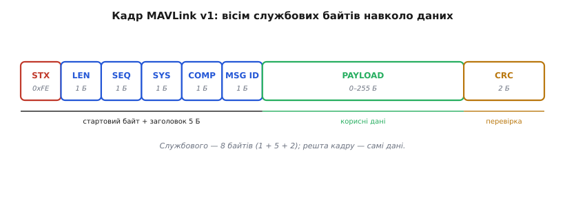
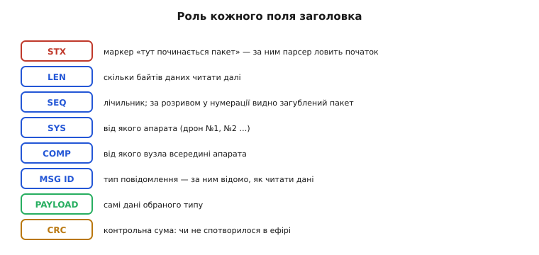
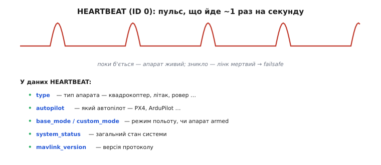
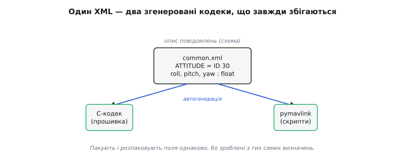
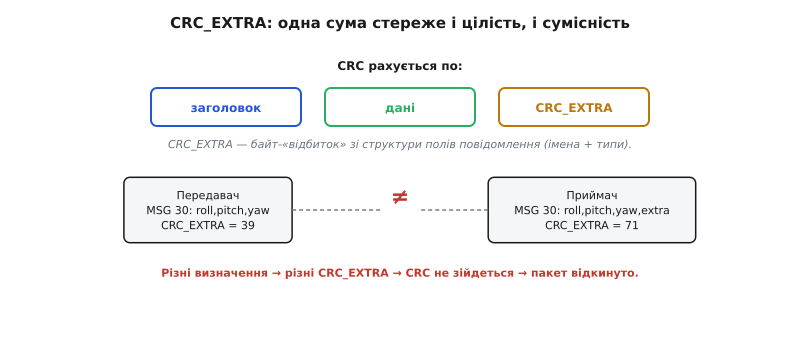
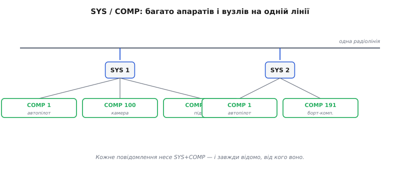
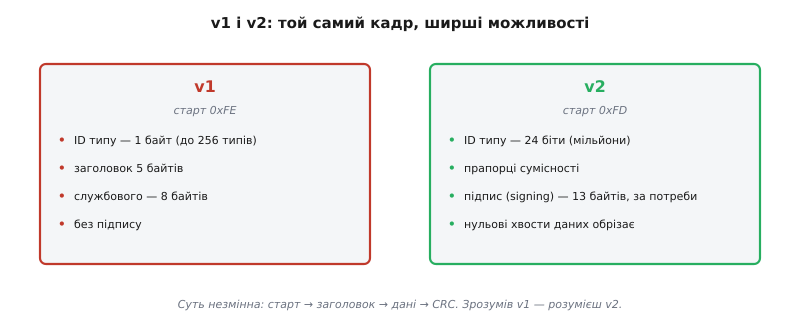

# Пакет MAVLink

Дрон у небі й ноутбук на землі обмінюються не словами, а короткими двійковими згустками — пакетами. Кожен такий згусток зроблено за протоколом **MAVLink** (англ. *Micro Air Vehicle Link*, «зв'язок з мікроповітряним апаратом»), і тут на тебе чекає приємна несподіванка: жодної нової складної ідеї всередині немає. MAVLink — це відшліфований до стандарту нащадок того самого пакета, що його будують навколо [UART](topic:communications/uart-frame): старт, довжина, дані, контрольна сума. Розклавши цей пакет на байти, видно і те, як «розмовляють» апарати, і те, як прості цеглинки складаються у світовий стандарт.

### Кадр: вісім службових байтів навколо даних

Подивімося на повний кадр MAVLink версії 1 — вона простіша й наочніша, а суть у неї та сама, що й у новішої.


*Стрічка байтів кадру: STX (стартовий байт) — LEN (довжина даних) — SEQ (лічильник) — SYS (який апарат) — COMP (який вузол) — MSG ID (тип повідомлення) — PAYLOAD (самі дані) — CRC (контрольна сума). Службового — рівно вісім байтів; решта кадру — корисні дані.*

Будова чітка й щільна. Усе починається зі **стартового байта STX** (від англ. *start of text*, «початок тексту») зі значенням `0xFE` — це маркер «тут починається пакет». За ним іде короткий **заголовок** із п'яти однобайтових полів: довжина даних, лічильник, дві адреси й тип повідомлення. Далі — **корисні дані** (англ. *payload*, «корисне навантаження») довжиною від нуля до 255 байтів, формат яких залежить від типу повідомлення. І наприкінці — **CRC** (англ. *cyclic redundancy check*, «циклічна надлишкова перевірка»), двобайтова контрольна сума.

Порахуймо службовий обсяг: один байт STX, п'ять байтів заголовка, два байти CRC — разом вісім байтів на кожен пакет, хоч скільки в ньому даних. Усе двійкове й щільне, без жодного зайвого тексту, бо пакет спроєктовано під вузький [радіоканал телеметрії](topic:communications/telemetry-stream) з [тісною пропускною здатністю](topic:communications/latency-reliability). Це буквально та сама [конструкція пакета](topic:communications/packet-design): старт-маркер, поле довжини, корисне навантаження, контрольна сума — лише доведена до стандарту.

### Що робить кожне поле

У кожного поля заголовка — своя точна роль, і разом вони дають приймачеві все, щоб правильно прочитати пакет.


*Призначення семи полів кадру — від маркера початку до контрольної суми.*

**STX** — стартовий маркер, із якого [потоковий розбірник](topic:programming/stream-parser) ловить початок пакета в суцільному потоці байтів. **LEN** — довжина корисних даних, щоб приймач знав, скільки байтів читати. **SEQ** (від англ. *sequence*, «послідовність») — лічильник, що зростає з кожним пакетом: за пропуском у нумерації приймач помічає загублений пакет. Помічає, але для потокових даних не перепитує — такий свідомий [компроміс надійності телеметрії](topic:communications/latency-reliability). **SYS** і **COMP** — адреса відправника, про неї окремо нижче. **MSG ID** (від англ. *message identifier*, «визначник повідомлення») — найважливіше поле: тип повідомлення, за яким приймач знає, як саме читати корисні дані. **PAYLOAD** — самі дані. **CRC** — [контрольна сума](topic:communications/crc), що ловить спотворення від радіошуму.

### Найголовніше повідомлення: HEARTBEAT

Серед сотень типів повідомлень є одне особливе, з якого варто почати знайомство, — **HEARTBEAT** (англ. «серцебиття») з номером `ID 0`.


*HEARTBEAT іде приблизно раз на секунду; поки він б'ється — апарат живий, зник — лінк мертвий. У його даних: тип апарата, автопілот, режим, стан і версія протоколу.*

HEARTBEAT — це обов'язкове «я живий», яке кожна система MAVLink шле приблизно раз на секунду. Дані прості, але важливі: який це **тип** апарата (квадрокоптер, літак, ровер), який **автопілот** ним керує (PX4, ArduPilot), у якому **режимі** він зараз, чи він **армований** (тобто з увімкненими моторами), яка **версія** протоколу. Завдяки HEARTBEAT наземна станція виявляє апарат: з'явилося серцебиття — отже, на лінії новий апарат, видно його тип і режим. І так само станція ловить втрату зв'язку: серцебиття зникло — лінк мертвий, спрацьовує захист (англ. *failsafe*, «безпечний відмов»). Уся ця логіка стоїть на [контролі надійності зв'язку](topic:communications/latency-reliability). Аналогія пряма — пульс пацієнта: поки б'ється, людина жива; зник — тривога. Ламається вона лише в одному: пульс міряють ззовні, а HEARTBEAT апарат шле сам, тож його відсутність може означати і смерть апарата, і всього лише обрив радіо.

### Звідки беруться типи: визначення в XML

А звідки взагалі береться ця сотня типів повідомлень із їхніми полями? Усі вони формально описані в окремих файлах — і саме це робить MAVLink **схемою**, а не просто форматом байтів.


*З одного XML-опису повідомлень автоматично генерують кодеки для різних мов; обидві сторони пакують і розпаковують поля однаково, бо зроблені з тих самих визначень.*

Кожне повідомлення MAVLink описане в XML-файлі: його числовий **ID**, людська **назва** й перелік **полів** із типами. Скажімо, повідомлення `ATTITUDE` (англ. «орієнтація») має `ID 30` і поля `roll`, `pitch`, `yaw` типу float. Ці описи групують у **діалекти** (англ. *dialect*): `common.xml` — спільні для всіх, `ardupilotmega.xml` — специфічні для ArduPilot. А далі — найрозумніше: з XML автоматично генерують готовий код для багатьох мов — C для прошивок, Python через бібліотеку [pymavlink](root:embedded/pymavlink) для скриптів. Тобто розбір пакетів руками ніхто не пише: кодек (англ. *codec*, від *coder-decoder*, «кодувальник-розкодувальник») уже згенеровано, і він гарантовано однаковий на всіх кінцях, бо зроблений із тих самих XML. По суті, MAVLink — це спільна схема плюс автоматичні перекладачі до неї.

### CRC, що ловить ще й неузгодженість версій

Тепер найдотепніша інженерна деталь — **CRC_EXTRA**. Контрольна сума MAVLink перевіряє не лише цілість даних, а й сумісність двох сторін.


*CRC рахується по заголовку, даних і CRC_EXTRA — байту-«відбитку» структури полів. Різні визначення повідомлення дають різні CRC_EXTRA, сума не зійдеться, і пакет відкидають.*

Звичайний [CRC](topic:communications/crc) ловить спотворення від радіошуму. Але творці MAVLink додали хитрість: у контрольну суму домішують ще й **CRC_EXTRA** — один байт, обчислений зі **структури полів** самого повідомлення, тобто з імен полів і їхніх типів. Наслідок виходить елегантний. Уяви, що дві сторони мають різні визначення повідомлення №30: хтось оновив XML і додав туди поле, а хтось ні. Тоді їхні CRC_EXTRA різні, а отже, і підсумкова CRC не збігається — і пакет відкидають, наче він пошкоджений. Одна-єдина перевірка ловить одразу дві біди: і пошкодження в ефірі, і «розмову різними діалектами» — несумісні версії визначень. Просто й влучно, як і має бути в доброму інженерному рішенні.

> 🔧 **Навіщо це.** Коли станція раптом «не бачить» апарата чи мовчки відкидає пакети, причину шукають саме тут. Пакети відкидаються — найчастіше не зійшлася CRC: або шум у каналі, або несумісні версії визначень, тобто розбіжний CRC_EXTRA. Оновив XML лише на одному боці — отримав цей симптом на рівному місці.

### Адресація: хто кому

Поля **SYS** і **COMP** заслуговують окремого слова — це **адресація**, завдяки якій на одній лінії вживаються багато учасників.


*SYS визначає апарат, COMP — вузол усередині нього; так на спільній радіолінії співіснують кілька апаратів і багато пристроїв, і кожне повідомлення знає, від кого воно.*

Кожне повідомлення несе адресу відправника. **SYS** (англ. *system ID*, «визначник системи») каже, який апарат його надіслав: у рої дронів їх багато — №1, №2 і далі. **COMP** (англ. *component ID*, «визначник складника») каже, який вузол усередині апарата: автопілот, підвіс камери, сама камера, бортовий комп'ютер. Завдяки цій парі на одній радіолінії співіснують кілька апаратів і багато пристроїв, і кожне повідомлення чітко знає, від кого воно й, за потреби, кому призначене. Це точнісінько та сама ідея, що й [адресація на шині I2C](topic:communications/i2c-addressing): багато учасників, один спільний канал, кожному — своя адреса.

### Кадр байт за байтом: worked-приклад

Складімо тепер усе докупи й розберімо конкретний кадр HEARTBEAT від автопілота — байт за байтом, спершу у v1, потім у v2, щоб побачити різницю на тих самих даних.

**Умова.** Автопілот (`SYS 1`, `COMP 1`) шле HEARTBEAT (`MSG ID 0`). Корисні дані HEARTBEAT займають 9 байтів. Лічильник цього пакета — `SEQ 42`. Зберемо повний кадр MAVLink v1 і порахуємо його довжину; той самий код розбере його на приймачі.

:::tabs
```cpp
// Кадр MAVLink v1 на дроті (значення байтів, шістнадцятково):
// FE  09  2A  01  01  00  [9 байтів даних HEARTBEAT]  XX XX
//  │   │   │   │   │   └── MSG ID = 0x00  (HEARTBEAT)
//  │   │   │   │   └────── COMP   = 0x01  (автопілот)
//  │   │   │   └────────── SYS    = 0x01  (апарат №1)
//  │   │   └────────────── SEQ    = 0x2A  (= 42)
//  │   └────────────────── LEN    = 0x09  (9 байтів даних)
//  └────────────────────── STX    = 0xFE  (старт v1)
//                                  CRC = 2 байти (XX XX)

// Довжина кадру: 1 (STX) + 5 (заголовок) + 9 (дані) + 2 (CRC) = 17 байтів.
size_t v1_len = 1 + 5 + payload_len + 2;   // = 17 для HEARTBEAT
```
```python
# Кадр MAVLink v1 на дроті (значення байтів, шістнадцятково):
# FE  09  2A  01  01  00  [9 байтів даних HEARTBEAT]  XX XX
#  │   │   │   │   │   └── MSG ID = 0x00  (HEARTBEAT)
#  │   │   │   │   └────── COMP   = 0x01  (автопілот)
#  │   │   │   └────────── SYS    = 0x01  (апарат №1)
#  │   │   └────────────── SEQ    = 0x2A  (= 42)
#  │   └────────────────── LEN    = 0x09  (9 байтів даних)
#  └────────────────────── STX    = 0xFE  (старт v1)
#                                  CRC = 2 байти (XX XX)

# Довжина кадру: 1 (STX) + 5 (заголовок) + 9 (дані) + 2 (CRC) = 17 байтів.
v1_len = 1 + 5 + payload_len + 2   # = 17 для HEARTBEAT
```
:::

:::tabs
```cpp
// Розбір на приймачі — без зайвих абстракцій, по полях кадру:
uint8_t  stx    = buf[0];   // очікуємо 0xFE
uint8_t  len    = buf[1];   // довжина даних
uint8_t  seq    = buf[2];
uint8_t  sysid  = buf[3];
uint8_t  compid = buf[4];
uint8_t  msgid  = buf[5];   // у v1 — рівно 1 байт
uint8_t *payload = &buf[6];            // дані починаються одразу за заголовком
uint16_t crc     = buf[6 + len] | (buf[7 + len] << 8);  // 2 байти, little-endian
```
```python
# Розбір на приймачі — без зайвих абстракцій, по полях кадру:
stx    = buf[0]    # очікуємо 0xFE
length = buf[1]    # довжина даних
seq    = buf[2]
sysid  = buf[3]
compid = buf[4]
msgid  = buf[5]    # у v1 — рівно 1 байт
payload = buf[6:6 + length]              # дані починаються одразу за заголовком
crc     = buf[6 + length] | (buf[7 + length] << 8)  # 2 байти, little-endian
```
:::

Тепер той самий HEARTBEAT у MAVLink v2. Стартовий байт інший — `0xFD`, заголовок довший на два прапорцеві байти, а `MSG ID` займає вже три байти замість одного:

:::tabs
```cpp
// Кадр MAVLink v2 на дроті:
// FD  09  00  00  2A  01  01  00 00 00  [дані]  XX XX  [+13 байтів підпису, якщо є]
//  │   │   │   │   │   │   │   └──────── MSG ID = 24 біти (3 байти)
//  │   │   │   │   │   │   └──────────── COMP
//  │   │   │   │   │   └──────────────── SYS
//  │   │   │   │   └──────────────────── SEQ
//  │   │   │   └──────────────────────── COMPAT_FLAGS   (прапорці сумісності)
//  │   │   └──────────────────────────── INCOMPAT_FLAGS (несумісні прапорці; біт підпису — тут)
//  │   └──────────────────────────────── LEN
//  └──────────────────────────────────── STX = 0xFD  (старт v2)

// Службового у v2: 1 (STX) + 9 (заголовок) + 2 (CRC) = 12 байтів,
// або 25, якщо ввімкнено підпис (+13 байтів signature).
size_t v2_len = 1 + 9 + payload_len + 2 + (is_signed ? 13 : 0);
```
```python
# Кадр MAVLink v2 на дроті:
# FD  09  00  00  2A  01  01  00 00 00  [дані]  XX XX  [+13 байтів підпису, якщо є]
#  │   │   │   │   │   │   │   └──────── MSG ID = 24 біти (3 байти)
#  │   │   │   │   │   │   └──────────── COMP
#  │   │   │   │   │   └──────────────── SYS
#  │   │   │   │   └──────────────────── SEQ
#  │   │   │   └──────────────────────── COMPAT_FLAGS   (прапорці сумісності)
#  │   │   └──────────────────────────── INCOMPAT_FLAGS (несумісні прапорці; біт підпису — тут)
#  │   └──────────────────────────────── LEN
#  └──────────────────────────────────── STX = 0xFD  (старт v2)

# Службового у v2: 1 (STX) + 9 (заголовок) + 2 (CRC) = 12 байтів,
# або 25, якщо ввімкнено підпис (+13 байтів signature).
v2_len = 1 + 9 + payload_len + 2 + (13 if is_signed else 0)
```
:::

Контрольну суму в обох версіях рахують тим самим алгоритмом — **CRC-16/MCRF4XX** — по всіх байтах кадру від `LEN` до кінця корисних даних, а наприкінці домішують байт `CRC_EXTRA` цього повідомлення. Тому одна перевірка й стереже цілість, і відсіює несумісні визначення.

### MAVLink v1 і v2

Наостанок — про дві версії в одному погляді, бо в реальних апаратах зустрічаються обидві.


*Дві версії кадру поряд: v1 простіша й коротша, v2 ширша за можливостями; суть кадру в обох однакова.*

Сучасний стандарт — **v2** зі стартовим байтом `0xFD`. Порівняно з **v1** (`0xFE`) він додав три корисні речі. Перша — більший простір типів: `MSG ID` став 24-бітним, тобто типів може бути мільйони замість 256, і протоколу є куди рости. Друга — безпека: з'явився **підпис** (англ. *signing*, «підписування») — криптографічна перевірка, що команду надіслав справді той, хто має на це право, а не зловмисник, який перехопив керування; підпис додає до кадру ще 13 байтів. Третя — економія: нульові хвости корисних даних у v2 обрізають, тож пакет коротшає й менше байтів іде в ефір. Але суть незмінна: той самий кадр зі стартом, заголовком, даними й CRC — v2 лише розсуває межі.

> 🔧 **Навіщо це.** У логах і в аналізаторі трафіку версію кадру впізнають з першого байта: `0xFE` — це v1, `0xFD` — v2. Далі за `MSG ID` читають тип повідомлення, за `SYS`/`COMP` — від кого воно. А коли пишеш власний код, байти руками не парсиш: береш [pymavlink](root:embedded/pymavlink), згенерований із тих самих XML, і працюєш одразу з полями `msg.roll`, `msg.lat`. Знати ж будову «під капотом» усе одно корисно — саме вона рятує, коли щось іде не так.

Так пакет MAVLink розкладається на атоми: кадр, поля, HEARTBEAT, ID, CRC, адреси. Це фундамент, на якому стоїть усе живе спілкування з апаратом — як [прочитати потік телеметрії й надіслати команду](root:embedded/mavlink-from-ground) і побачити, що апарат послухався. Хто бачить будову пакета «під капотом», той розуміє кожен байт цього обміну.

---
