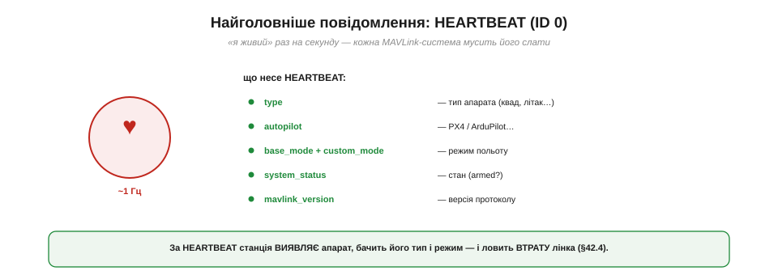
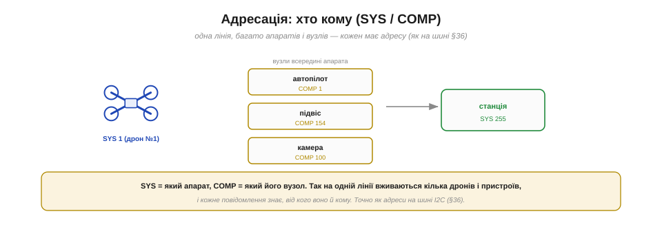

# MAVLink: структура пакета (heartbeat; повідомлення; ID; CRC)

У серці протоколу — сама **мова** MAVLink. І тут на тебе чекає приємна несподіванка: жодної нової складної ідеї немає. MAVLink — це **зрілий, відшліфований нащадок** того самого пакета, що його проєктують для [UART](book:communications/uart-frame): старт, довжина, дані, контрольна сума. Розібравши його структуру, ти не лише зрозумієш, як «розмовляють» дрони, а й побачиш, як базові цеглинки складаються в реальний світовий стандарт.

### Кадр MAVLink: з чого складається пакет

Подивімося на повний кадр MAVLink (версії 1 — простішої й наочнішої для початку).

*Рис. Пакет: **STX** (стартовий байт 0xFE) → **LEN** (довжина даних) → **SEQ** (лічильник) → **SYS** (який апарат) → **COMP** (який вузол) → **MSG ID** (тип повідомлення) → **PAYLOAD** (самі дані, 0–255 байтів) → **CRC** (2 байти контрольної суми). Заголовок 6 байтів + дані + CRC.*

Структура чітка й компактна. Усе починається з **стартового байта STX** (0xFE у v1) — маркера «тут починається пакет». Далі — короткий **заголовок** із 6 байтів: довжина даних, лічильник, адреси й тип. Потім — **корисні дані** (payload) до 255 байтів, формат яких залежить від типу повідомлення. І наприкінці — **CRC**, двобайтова контрольна сума. Усе **двійкове** й щільне — жодного зайвого тексту, бо пакет спроєктовано під вузький [радіоканал телеметрії](book:communications/telemetry-stream) з [обмеженою пропускною здатністю](book:communications/latency-reliability). Це буквально та сама [конструкція пакета](book:communications/packet-design): старт-маркер, поле довжини, корисне навантаження, контрольна сума. MAVLink — це той самий принцип, доведений до стандарту.

### Що робить кожне поле

Розберімо ролі полів заголовка — кожне має свій сенс.

*Рис. **STX** — «тут пакет». **LEN** — скільки даних далі. **SEQ** — лічильник: за розривами видно загублені пакети. **SYS/COMP** — адреса: який апарат і який його вузол. **MSG ID** — тип повідомлення. **PAYLOAD** — самі дані. **CRC** — перевірка цілісності.*

Пройдімося. **STX** — стартовий маркер, із якого [потоковий парсер](book:programming/stream-parser) ловить початок пакета. **LEN** — довжина payload, щоб приймач знав, скільки байтів читати. **SEQ** — лічильник, що зростає з кожним пакетом: за **пропусками** в нумерації приймач помічає **загублені** пакети (помічає, але не перепитує для потокових даних — такий [компроміс надійності телеметрії](book:communications/latency-reliability)). **SYS** і **COMP** — **адреса** відправника (про неї окремо нижче). **MSG ID** — найважливіше: **тип** повідомлення (heartbeat? attitude? gps?), за яким приймач знає, **як читати** payload. **PAYLOAD** — самі дані. **CRC** — [контрольна сума](book:communications/crc), що ловить спотворення. Сім полів — і кожне на своєму місці.

### Найголовніше повідомлення: HEARTBEAT

Серед сотень типів є одне особливе, з якого варто почати, — **HEARTBEAT** (повідомлення з **ID 0**).

*Рис. HEARTBEAT — «серцебиття», що йде ~1 раз на секунду. Його payload несе: **type** (тип апарата — квадрокоптер, літак…), **autopilot** (PX4/ArduPilot…), **base_mode/custom_mode** (режим польоту), **system_status** (стан, чи armed), **mavlink_version**. Кожна MAVLink-система мусить його слати.*

**HEARTBEAT** — це обов'язкове «я живий», яке **кожна** MAVLink-система шле раз на секунду. Його дані прості, але важливі: який це **тип** апарата (квадрокоптер, літак, ровер…), який **автопілот** (PX4, ArduPilot…), у якому **режимі** він зараз, чи **армований**, яка версія протоколу. Завдяки HEARTBEAT наземна станція **виявляє** апарат (з'явилося серцебиття → є новий апарат на лінії), бачить його тип і режим, і **ловить втрату лінка** (серцебиття зникло → лінк мертвий → failsafe) — саме на цьому будується [контроль надійності зв'язку](book:communications/latency-reliability). Це наче пульс пацієнта: поки б'ється — живий, зник — тривога. З розбору саме HEARTBEAT зазвичай і починають знайомство з MAVLink.

### Звідки беруться типи: визначення в XML

А звідки взагалі береться ця сотня типів повідомлень із їхніми полями? Вони **описані** в спеціальних файлах — і це робить MAVLink насправді **схемою**, а не просто форматом.

*Рис. Кожне повідомлення описане в **XML**: його ID, ім'я й типізовані поля (наприклад, ATTITUDE = ID 30 з полями roll, pitch, yaw типу float). З цих XML **автоматично генерують** код для C, Python (pymavlink) та інших мов — кодеки, що пакують і розпаковують поля. Обидві сторони працюють із тих самих визначень.*

Кожне повідомлення MAVLink **формально описане** в XML-файлі: його числовий **ID**, людська **назва** й перелік **полів** із типами (наприклад, повідомлення `ATTITUDE` має ID 30 і поля `roll`, `pitch`, `yaw` типу float). Ці описи групують у **діалекти** (*dialects*) — `common.xml` (спільні для всіх), `ardupilotmega.xml` (специфічні для ArduPilot) тощо. А далі — найрозумніше: з XML **автоматично генерують** готовий код для багатьох мов — C для прошивок, **Python** (бібліотека [pymavlink](book:programming/pymavlink)) для скриптів. Тобто ти **не пишеш розбір пакетів руками** — кодек уже згенеровано, і він гарантовано однаковий на всіх кінцях, бо зроблений із тих самих XML. MAVLink — це, по суті, **спільна схема + автоматичні перекладачі**.

### CRC, що ловить ще й неузгодженість версій

Тепер найдотепніша інженерна деталь — **CRC_EXTRA**. Контрольна сума MAVLink перевіряє не лише цілість, а й **сумісність**.

*Рис. CRC рахується не лише по заголовку й даних, а й по **CRC_EXTRA** — байту-«відбитку», похідному від структури полів цього повідомлення. Тож якщо у двох сторін різні визначення повідомлення (різні версії XML), CRC **не зійдеться** — і пакет відкинуть. Одна перевірка стереже і цілісність, і сумісність.*

Звичайний [CRC](book:communications/crc) ловить **спотворення** від радіошуму. Але творці MAVLink додали хитрість: у контрольну суму домішують ще й **CRC_EXTRA** — байт, обчислений із **структури полів** самого повідомлення (його імен і типів). Наслідок геніальний: якщо передавач і приймач мають **різні визначення** повідомлення №30 (скажімо, хтось оновив XML, додавши поле, а хтось ні), то їхні CRC_EXTRA **різні** — і CRC **не зійдеться**, пакет відкинуть. Тобто одна-єдина перевірка ловить **одразу дві** біди: і пошкодження в ефірі, і «розмову різними діалектами» (несумісні версії). Просто й елегантно — типова ознака доброго інженерного рішення.

### Адресація: хто кому

Поля **SYS** і **COMP** заслуговують окремого слова — це **адресація**, що дає багатьом учасникам ужитися на одній лінії.

*Рис. **SYS** (system ID) — який апарат (дрон №1, №2…); **COMP** (component ID) — який його вузол (автопілот, підвіс камери, сама камера, бортовий комп'ютер). Так на одній лінії вживаються кілька апаратів і пристроїв, і кожне повідомлення знає, від кого воно. Точно як адреси на шині I2C.*

Кожне повідомлення несе **адресу відправника**: **SYS** (*system ID*) каже, **який апарат** його надіслав (дрон №1, дрон №2 — у рої їх багато), а **COMP** (*component ID*) — **який вузол** усередині апарата (автопілот, підвіс камери, сама камера, бортовий комп'ютер). Завдяки цьому на **одній** радіолінії можуть співіснувати кілька апаратів і багато пристроїв, і кожне повідомлення чітко знає, **від кого** воно й (за потреби) **кому** призначене. Це точнісінько та сама ідея **адресації на спільній шині**, що й [адресація на I2C](book:communications/i2c-addressing): багато учасників, один канал, кожному — своя адреса. Базові поняття вкотре спрацьовують у дорослій техніці.

> 🔧 **Навіщо це.** Розуміння структури пакета — це твій ключ до **читання й налагодження** MAVLink. Бачиш у логах чи аналізаторі байт **0xFE** (чи 0xFD для v2) — це початок пакета; далі за **MSG ID** упізнаєш тип, за **SYS/COMP** — від кого. Якщо станція «не бачить» апарата — перевір, чи йде **HEARTBEAT** (немає його — немає й виявлення). Якщо пакети **відкидаються** — можливо, не зійшовся **CRC**: або шум у каналі, або **несумісні версії** визначень (CRC_EXTRA!). А коли писатимеш власний код, ти не парситимеш байти руками — візьмеш [pymavlink](book:programming/pymavlink), згенерований із тих самих XML, і працюватимеш одразу з полями `msg.roll`, `msg.lat`. Знати структуру «під капотом» однаково корисно — щоб розуміти, що відбувається, коли щось іде не так.

### MAVLink v1 і v2

Наостанок коротко — про дві версії, бо їх зустрінеш обидві.

*Рис. **v1** (старт 0xFE): ID типу — 1 байт (до 256 типів), простий заголовок, без автентифікації. **v2** (старт 0xFD): ID типу — 24 біти (мільйони типів!), прапорці сумісності, **підпис** (signing — захист від підробки команд), обрізання нульових хвостів payload (коротше в ефірі). Ідея незмінна, можливості — ширші.*

Сучасний стандарт — **v2** (стартовий байт **0xFD**). Порівняно з **v1** (0xFE) він додав три корисні речі. **Більший простір типів:** ID повідомлення став 24-бітним (мільйони типів замість 256) — є куди рости. **Безпека:** з'явився **підпис** (*signing*) — криптографічна перевірка, що команду надіслав справді той, хто має право (захист від підробки й перехоплення керування). **Економія:** нульові хвости payload **обрізають**, тож пакет коротшає — менше байтів в ефірі. Але **суть незмінна**: той самий кадр зі стартом, ID, даними й CRC; v2 лише розширює можливості. Тому, зрозумівши v1, ти розумієш і v2.

Так мова MAVLink розкладається на атоми: кадр, поля, HEARTBEAT, ID, CRC, адреси. Це теорія «як влаштовано» — фундамент, на якому стоїть усе живе спілкування з апаратом: під'єднатися, [прочитати потік телеметрії й надіслати команду](book:communications/mavlink-from-ground) і побачити, як він послухається. Знаючи структуру пакета «під капотом», ти розумітимеш кожен байт у цьому обміні — і те, що відбувається, коли щось іде не так.

---
