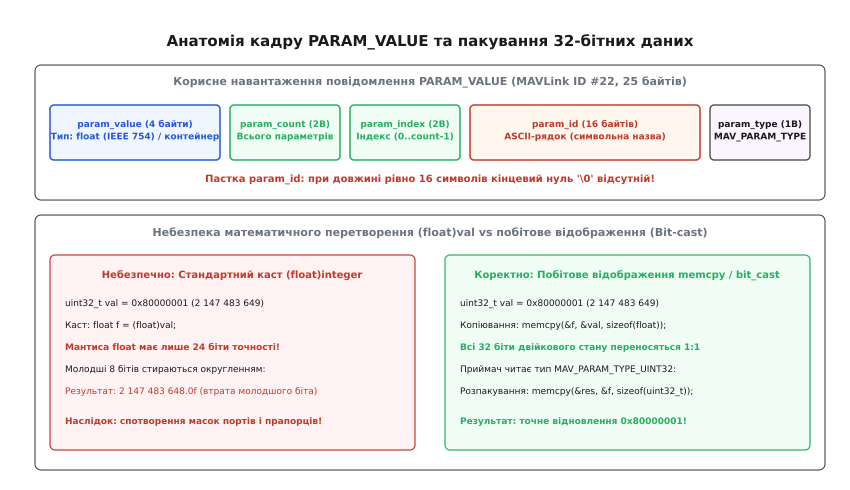
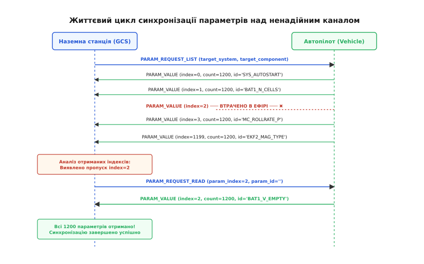
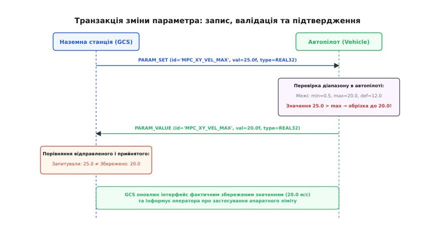
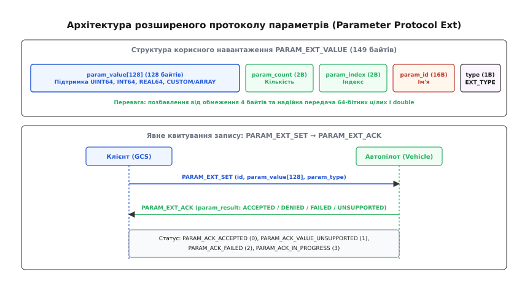

# Параметри MAVLink

<preknowlist>
- [Пакет MAVLink](topic:communications/mavlink-packet) — структура двійкового кадру MAVLink, службовий заголовок, ідентифікатор повідомлення та контроль цілісності.
- [Команди MAVLink](topic:communications/mavlink-commands) — протокол надійного надсилання наказів автопілоту через COMMAND_LONG та квитування COMMAND_ACK.
- [ARQ: автоматичний повтор запиту](topic:communications/arq-protocol) — механізми виявлення втрат і повторної передачі пакетів над ненадійним каналом.
</preknowlist>

Перед кожним стартом безпілотного літального апарата наземна станція керування (QGroundControl або Mission Planner) повинна отримати повну й абсолютно точну цифрову копію всієї конфігурації автопілота: від коефіцієнтів PID-регуляторів кутових швидкостей та матриць калібрування інерційних сенсорів до порогів спрацьовування аварійного повернення додому та налаштувань радіоканалу. Сучасний польотний контролер на базі прошивок ArduPilot або PX4 утримує в пам'яті від 1200 до 2500 незалежних конфігураційних змінних. Якщо через пошкодження або спотворення пакетів зв'язку станція відобразить оператору застарілий коефіцієнт підсилення або пропустить критичний поріг напруги батареї, автономний політ завершиться аварією в перші ж секунди після відриву від землі.

Зв'язок між літальним апаратом і наземним пультом зазвичай здійснюється через напівдуплексний телеметрійний радіоканал на швидкості 57600 бод. Реальна корисна пропускна здатність такої радіолінії з урахуванням службових заголовків становить близько 4–5 кілобайтів за секунду, а рівень фізичних втрат пакетів через електромагнітні завади від силових моторів та просторове згасання сягає від 10% до 30%. Спроба передати всю таблицю конфігурації суцільним двійковим дампом пам'яті миттєво переповнює буфери FIFO апаратного UART, блокує передачу критично важливої польотної телеметрії і при першій же втраті байта вимагає повторення всієї передачі з самого початку.

Для розв'язання цього протиріччя створено протокол параметрів MAVLink (**Parameter Protocol**, від англійського *parameter* — числова характеристика системи). Він перетворює внутрішню таблицю конфігурації автопілота на стійкий до завад, асинхронний двійковий потік, у якому кожен елемент ідентифікується символьною назвою та числовим порядковим номером, а втрати окремих кадрів виявляються та адресно виправляються клієнтським автоматом стану без перезапуску всієї сесії.

> 🔧 **Навіщо це.** Протокол параметрів є фундаментальним механізмом конфігурації будь-якого безпілотного комплексу. Без нього неможливо виконати калібрування компаса та акселерометра, налаштувати геозони, змінити чутливість джойстиків або забезпечити надійну інтеграцію бортового супутнього комп'ютера (Companion Computer) з автопілотом через ROS 2 чи MAVSDK.

---

### Анатомія параметра: ідентифікатор, типи та бітове пакування

Конфігураційна змінна в MAVLink складається з трьох ключових компонентів: символьного імені (`param_id`), числового типу з переліку `MAV_PARAM_TYPE` та двійкового значення, упакованого в універсальний 4-байтовий контейнер `param_value`.

Ідентифікатор параметра `param_id` має строго фіксовану довжину рівно 16 байтів і передається у вигляді масиву символів ASCII. Фіксована довжина створює системну пастку пам'яті. Якщо назва параметра має довжину від 1 до 15 символів (наприклад, `SYS_AUTOSTART`), рядок обов'язково завершується нульовим термінатором `\0`, а всі наступні байти заповнюються нулями. Однак, якщо ім'я параметра містить рівно 16 символів (наприклад, `EKF2_ABIAS_P_NOI` або `PILOT_THR_FILT_R`), нульовий термінатор усередині 16-байтового масиву **повністю відсутній**.

```
Масив param_id[16] для короткої назви 'SYS_AUTOSTART':
[ 'S' | 'Y' | 'S' | '_' | 'A' | 'U' | 'T' | 'O' | 'S' | 'T' | 'A' | 'R' | 'T' | '\0' | '\0' | '\0' ]

Масив param_id[16] для назви рівно з 16 символів 'PILOT_THR_FILT_R':
[ 'P' | 'I' | 'L' | 'O' | 'T' | '_' | 'T' | 'H' | 'R' | '_' | 'F' | 'I' | 'L' | 'T' | '_' | 'R' ]  ← Немає '\0'!
```

При передачі вказівника на сирий масив `param_id` у стандартні рядкові функції `strlen()`, `strcpy()` або `printf("%s")` процесор продовжує читати пам'ять за межами масиву до першого випадкового нульового байта в RAM, що призводить до спотворення тексту або аварійного падіння програми (Segmentation Fault). Приймач зобов'язаний виділяти локальний буфер розміром щонайменше 17 байтів, копіювати туди до 16 байтів та явно виставляти термінатор: `buffer[16] = '\0'`.

Типізація змінних регламентується переліком `MAV_PARAM_TYPE`. Протокол підтримує цілі числа різної розрядності зі знаком та без знака (`UINT8`, `INT8`, `UINT16`, `INT16`, `UINT32`, `INT32`), а також числа з рухомою комою одинарної точності (`REAL32`).


*Корисне навантаження кадру PARAM_VALUE містить 4-байтний контейнер param_value, лічильники param_count та param_index для виявлення пропусків, 16-байтне поле імені param_id та байт типу param_type. При роботі з цілими числами застосовується побітове відображення (bit-cast) замість числового касту (float)val, що захищає мантису від втрати точності.*

У кадрах класичного протоколу (`PARAM_VALUE` та `PARAM_SET`) корисне значення передається в універсальному полі `param_value`, яке в оригінальній схемі MAVLink оголошене як `float` (стандарт IEEE 754). Коли параметр є дробовим коефіцієнтом (наприклад, пропорційний коефіцієнт регулятора `0.15f`), значення передається напряму. Проте, коли параметр зберігає 32-бітне ціле число або бітову маску конфігурації портів `uint32_t`, виникає фундаментальна небезпека спотворення даних.

Формат одинарної точності IEEE 754 містить 1 знаковий біт, 8 бітів експоненти та лише 23 фізичні біти мантиси, що разом із неявним провідним бітом забезпечує 24 біти двійкової точності. Якщо 32-бітне ціле число, значення якого перевищує `16777216` (`2²⁴`), перетворити у `float` стандартним математичним приведенням типу `(float)val`, молодші 8 бітів числа будуть безповоротно стерті через округлення мантиси:

```
Значення бітової маски:        uint32_t val = 0x80000001 (десяткове 2 147 483 649)
Мантиса числа:                 потребує 32 біти точності
Математичний каст (float)val:  округлення до найближчого 24-бітного представлення
Результат після касту:         2 147 483 648.0f (молодший біт 0x01 втрачено!)
```

З цієї причини специфікація протоколу вимагає використання побітового відображення (**Bit-casting**): 4 байти цілочисельного значення записуються в пам'ять поля `param_value` байт-у-байт через двійкове копіювання пам'яті без будь-яких математичних обчислень. Для менших типів (`uint8_t`, `int16_t`) корисні байти вирівнюються за молодшим краєм, а старші заповнюються нулями (із збереженням знака для від'ємних чисел). Повний технічний опис розміщення полів та числових кодів типів наведено у [специфікації повідомлень та типів даних протоколу параметрів](topic:communications/mavlink-parameters/api-param-protocol.md).

**Безпечне пакування та вилучення значення параметра:**

:::tabs
```c
#include <stdint.h>
#include <string.h>
#include <stdbool.h>

// Безпечне пакування uint32_t у 4-байтове поле float через побітове копіювання
float pack_param_uint32(uint32_t val) {
    float container;
    memcpy(&container, &val, sizeof(float));
    return container;
}

// Вилучення uint32_t із контейнера float без втрати молодших бітів
uint32_t unpack_param_uint32(float container) {
    uint32_t val;
    memcpy(&val, &container, sizeof(uint32_t));
    return val;
}

// Безпечне копіювання імені параметра з гарантованим нульовим термінатором
void safe_get_param_id(const char wire_id[16], char out_buf[17]) {
    memcpy(out_buf, wire_id, 16);
    out_buf[16] = '\0';
}
```
```cpp
#include <cstdint>
#include <cstring>
#include <string_view>
#include <array>
#include <bit>

// Безпечне пакування uint32_t у float через std::bit_cast (C++20)
constexpr float pack_param_uint32(uint32_t val) noexcept {
    return std::bit_cast<float>(val);
}

// Вилучення uint32_t із контейнера float без втрати бітів
constexpr uint32_t unpack_param_uint32(float container) noexcept {
    return std::bit_cast<uint32_t>(container);
}

// Безпечне отримання string_view для 16-байтового масиву без виходу за межі
std::string_view safe_get_param_id(const std::array<char, 16>& wire_id) noexcept {
    const size_t len = strnlen(wire_id.data(), wire_id.size());
    return std::string_view(wire_id.data(), len);
}
```
:::

---

### Внутрішній життєвий цикл параметра в архітектурі автопілота

Щоб зрозуміти, як параметри впливають на поведінку апарата, простежимо шлях змінної від її оголошення у вихідному коді прошивки до зміни поведінки моторів.

У прошивці **ArduPilot** параметри організовані у вигляді статичного ієрархічного дерева `AP_Param`. Кожен програмний модуль (наприклад, система стабілізації `AP_Motors` або модуль навігації `AP_AHRS`) оголошує таблицю конфігураційних змінних. Для економії оперативної пам'яті мікроконтролера імена параметрів формуються шляхом конкатенації префікса модуля та імені змінної (наприклад, префікс `ATC_` + змінна `RAT_RLL_P` = `ATC_RAT_RLL_P`). При компіляції прошивки кожному параметру присвоюється числовий ключ, за яким він адресується у внутрішньому сховищі EEPROM або емульованій флеш-пам'яті.

У прошивці **PX4** параметри генеруються автоматично на етапі збирання з метаданих YAML/JSON. Усі зміни параметрів транслюються через внутрішню шину повідомлень `uORB`. Коли мережевий модуль MAVLink отримує команду зміни параметра:
1. Модуль знаходить змінну за символьним ідентифікатором у пам'яті через функцію `param_find()`.
2. Виконується валідація значення за діапазоном `min..max`.
3. Значення оновлюється в оперативній пам'яті через `param_set()`.
4. Демон параметрів публікує повідомлення в топік uORB `parameter_update`.
5. Потоки керування навігацією та стабілізацією (наприклад, `mc_pos_control` та `mc_att_control`), підписані на цей топік, миттєво перечитують оновлені коефіцієнти і застосовують їх у наступному циклі обчислень матриць стану з частотою 400–1000 Гц без будь-якої затримки чи перезапуску системи.

---

### Двійкова розкладка та контроль цілісності кадру на фізичному рівні

Для розуміння накладних витрат каналу зв'язку розгляньмо повну структуру двійкового кадру MAVLink v2 під час передачі одного параметра `PARAM_VALUE`:

```
Повна анатомія кадру MAVLink v2 для PARAM_VALUE (37 байтів на дроті):
┌─────┬─────┬──────────┬────────┬─────┬─────┬──────┬────────────────┬───────────────────────────┬────────┐
│ STX │ LEN │ INCOMPAT │ COMPAT │ SEQ │ SYS │ COMP │ MSG ID (3 B)   │ PAYLOAD (25 B)            │ CRC16  │
│ 0xFD│ 25  │ 0x00     │ 0x00   │ 142 │  1  │  1   │ 0x16 0x00 0x00 │ [param_value..param_type] │ 2 байти│
└─────┴─────┴──────────┴────────┴─────┴─────┴──────┴────────────────┴───────────────────────────┴────────┘
```

Кадр починається зі стартового маркера `0xFD`. Поле `LEN` містить довжину корисного навантаження (`25` байтів для `PARAM_VALUE`). Далі йдуть системні прапорці несумісності та сумісності, послідовний номер кадру `SEQ`, ідентифікатори системи `SYSID` та компонента `COMPID`, і 24-бітний ідентифікатор типу повідомлення `MSG ID` (`22` = `0x000016`).

Наприкінці кадру розташована 16-бітна контрольна сума, що обчислюється алгоритмом CRC16-MCRF4XX. Для захисту від несумісності діалектів до контрольної суми додається так званий байт `CRC_EXTRA` (для `PARAM_VALUE` він дорівнює `220`). Якщо структура полів повідомлення в прошивці дрона відрізняється від очікуваної на станції керування, контрольна сума не зійдеться, і пошкоджений пакет буде відкинуто на рівні парсера [пакета MAVLink](topic:communications/mavlink-packet).

---

### Повне вичитування конфігурації: пакети, втрати та відновлення

Ініціалізація зв'язку між наземною станцією та літальним апаратом починається з процедури вичитування повної таблиці параметрів.

Станція надсилає автопілоту повідомлення `PARAM_REQUEST_LIST`, вказуючи `target_system` (ідентифікатор дрона, зазвичай `1`) та `target_component` (ідентифікатор вузла, зазвичай `MAV_COMP_ID_AUTOPILOT1` = `1`). Отримавши цей запит, автопілот переходить у режим потокової передачі та починає послідовно надсилати повідомлення `PARAM_VALUE` для кожної змінної у своїй внутрішній таблиці.

Кожне повідомлення `PARAM_VALUE` несе два критично важливих лічильники:
* `param_count` — загальна кількість доступних параметрів у системі (наприклад, `1200`);
* `param_index` — порядковий числовий номер поточного параметра в діапазоні від `0` до `param_count - 1`.


*Послідовність повної синхронізації: станція надсилає PARAM_REQUEST_LIST, автопілот відповідає потоком PARAM_VALUE. При втраті пакетів (наприклад, index=2) станція фіксує пропуск у бітовій масці і після затишшя потоку надсилає точковий запит PARAM_REQUEST_READ для відновлення пропущеного параметра.*

Оскільки передача відбувається через ненадійний радіоканал без гарантії доставки на транспортному рівні (MAVLink працює поверх сирого UART або UDP), частина повідомлень втрачається через завади. Якби клієнт використовував класичний механізм повного перезапиту [ARQ](topic:communications/arq-protocol), йому довелося б перезапитувати всі 1200 параметрів заново при кожній втраті, що в умовах 15% втрат пакетів унеможливлює завершення передачі.

Замість цього клієнтський протокол реалізує механізм заповнення прогалин:
1. **Фіксація вхідного потоку:** під час отримання повідомлень клієнт зберігає значення та позначає відповідний `param_index` у локальній бітовій масці (Bitset).
2. **Виявлення закінчення потоку:** автопілот надсилає пакети з невеликим інтервалом (5–15 мс). Якщо протягом 500 мс нові повідомлення `PARAM_VALUE` не надходять, клієнт вважає пакетний потік завершеним.
3. **Аналіз пропусків:** клієнт сканує бітову маску від `0` до `param_count - 1` та виявляє всі індекси, для яких біт залишився нульовим.
4. **Адресне дозавантаження:** для кожної виявленої прогалини станція надсилає точковий запит `PARAM_REQUEST_READ`, де поле `param_index` містить номер відсутнього параметра, а `param_id` заповнено нулями.
5. **Тайм-аут і повтор:** якщо на точковий запит відповідь не надійшла протягом 800 мс, запит повторюється (до 5 разів). Як тільки всі нулі в бітовій масці закрито, синхронізація вважається успішно завершеною.

Повну архітектуру та алгоритмічну реалізацію автомата усунення прогалин наведено у вставці [реалізація клієнтського рушія синхронізації параметрів](topic:communications/mavlink-parameters/proj-param-sync.md).

---

### Точкове читання та модифікація параметрів: гарантія узгодженості

Крім завантаження повної конфігурації, протокол забезпечує точкове опитування окремих змінних та запис нових значень під час виконання місії.

#### Точкове читання (PARAM_REQUEST_READ)

Повідомлення `PARAM_REQUEST_READ` підтримує два взаємовиключні режими адресації:
1. **Запит за числовим індексом:** поле `param_index` містить дійсний номер параметра (`0..N-1`), а в поле `param_id` записується порожній рядок (`param_id[0] = '\0'`). Цей режим використовується виключно автоматом усунення прогалин, оскільки пошук за числовим індексом у пам'яті автопілота виконується миттєво за час O(1).
2. **Запит за символьною назвою:** поле `param_index` встановлюється у значення `-1`, а поле `param_id` містить точний ASCII-рядок імені параметра. Автопілот виконує пошук за назвою у своїй внутрішній таблиці та повертає повідомлення `PARAM_VALUE`.

#### Зміна параметра (PARAM_SET) та підтвердження

Коли оператор або скрипт змінює конфігурацію, клієнт надсилає повідомлення `PARAM_SET`, яке містить адресу цільової системи, ім'я `param_id`, тип `param_type` та нове запаковане значення `param_value`.

У класичному протоколі MAVLink немає окремого службового повідомлення квитування на кшталт `PARAM_SET_ACK`. Роль підтвердження виконує широкомовне повідомлення `PARAM_VALUE`, яке автопілот зобов'язаний транслювати після кожної успішної або скоригованої зміни параметра.


*Транзакція зміни параметра: станція шле PARAM_SET. Автопілот перевіряє межі допустимого діапазону. Якщо запропоноване значення перевищує максимум, воно обрізається до апаратної межі, і станції повертається фактично збережене значення у повідомленні PARAM_VALUE.*

Цей механізм реалізує дві критичні функції безпеки:

1. **Верифікація апаратних та програмних меж (Range Clamping):** якщо оператор намагається встановити максимальну швидкість польоту `MPC_XY_VEL_MAX` у 25.0 м/с, а прошивка має жорстке внутрішнє обмеження 20.0 м/с, автопілот не відхиляє команду мовчки, а автоматично обмежує значення до 20.0 м/с і повертає `PARAM_VALUE` зі значенням `20.0f`. Станція керування, отримавши відповідь, негайно оновлює свій графічний інтерфейс і показує оператору фактично застосоване число.
2. **Синхронізація кількох пультів (Multi-GCS Consistency):** якщо до одного літального апарата одночасно підключено пульт пілота та робочу станцію оператора корисного навантаження, трансляція `PARAM_VALUE` усім учасникам радіомережі гарантує, що зміна налаштувань на одному пристрої миттєво відобразиться на всіх інших станціях без необхідності повторного опитування.

Якщо після надсилання `PARAM_SET` клієнт не отримує відповідного `PARAM_VALUE` протягом 1000 мс, транзакція вважається втраченою в радіоканалі, і клієнт повторює відправлення `PARAM_SET` (до трьох спроб).

**Формування та надсилання транзакції зміни параметра:**

:::tabs
```c
#include <stdint.h>
#include <string.h>

// Макет структури повідомлення PARAM_SET для демонстрації
typedef struct {
    float   param_value;
    uint8_t target_system;
    uint8_t target_component;
    char    param_id[16];
    uint8_t param_type;
} mav_param_set_msg_t;

// Складання повідомлення PARAM_SET для встановлення максимальної швидкості
mav_param_set_msg_t create_param_set_float(uint8_t sys_id,
                                           uint8_t comp_id,
                                           const char *name,
                                           float val) {
    mav_param_set_msg_t msg;
    memset(&msg, 0, sizeof(msg));

    msg.target_system = sys_id;
    msg.target_component = comp_id;
    msg.param_type = 9; // MAV_PARAM_TYPE_REAL32

    // Побітове копіювання float у поле значення
    memcpy(&msg.param_value, &val, sizeof(float));

    // Безпечне копіювання імені з обмеженням 16 байтів
    strncpy(msg.param_id, name, 16);

    return msg;
}
```
```cpp
#include <cstdint>
#include <cstring>
#include <string_view>
#include <array>
#include <bit>

struct ParamSetMessage {
    float    param_value{0.0f};
    uint8_t  target_system{1};
    uint8_t  target_component{1};
    std::array<char, 16> param_id{};
    uint8_t  param_type{9}; // MAV_PARAM_TYPE_REAL32
};

// Складання типізованого повідомлення PARAM_SET
ParamSetMessage create_param_set_float(uint8_t sys_id,
                                       uint8_t comp_id,
                                       std::string_view name,
                                       float val) noexcept {
    ParamSetMessage msg{};
    msg.target_system = sys_id;
    msg.target_component = comp_id;
    msg.param_type = 9;
    msg.param_value = val;

    const size_t copy_len = std::min(name.size(), msg.param_id.size());
    std::memcpy(msg.param_id.data(), name.data(), copy_len);

    return msg;
}
```
:::

---

### Кешування конфігурації: Param Hash, CRC та Component Information

Повне завантаження понад 2000 параметрів через радіоканал 57600 бод навіть без втрат пакетів займає від 15 до 25 секунд. У бойових або термінових рятувальних операціях така затримка перед стартом є неприпустимою.

Для вирішення цієї проблеми розроблено протокол кешування параметрів на основі контрольних сум (**Param Hash / CRC**).

```
Схема обчислення Param Hash на боці автопілота:
1. Всі параметри сортуються за алфавітом param_id:
   "ATC_ACCEL_P_MAX" → "BAT1_CAPACITY" → ... → "SYS_AUTOSTART"
2. Послідовно обчислюється поліноміальний CRC32 / FNV-1a над потоком:
   CRC = UpdateCRC(CRC, param_id[16] + param_type + raw_bytes[4])
3. Підсумковий 32-бітний хеш передається в прапорцях AUTOPILOT_VERSION або PARAM_MAP_RC
```

Коли наземна станція вперше підключається до автопілота, вона вичитує всі параметри і зберігає їх на локальний диск разом із отриманим `Param Hash`. Під час усіх наступних підключень до цього ж апарата станція порівнює поточний хеш конфігурації з локально збереженим:
* **Хеш збігається:** станція миттєво підтягує всю таблицю параметрів із локального файлового кешу за 10–20 мілісекунд, повністю пропускаючи передачу списку по радіоефіру.
* **Хеш змінився (відбулося калібрування сенсорів або оновлення прошивки):** локальний кеш інвалідується, і станція запускає стандартну процедуру вичитування `PARAM_REQUEST_LIST`.

#### Відокремлення метаданих та міграція схем (Component Information Protocol)

Двійкові повідомлення MAVLink передають виключно сирі ідентифікатори та числові значення (`MPC_XY_VEL_MAX` = `12.0f`). Вони не містять описів, фізичних одиниць вимірювання, мінімальних і максимальних меж, кроку регулювання та прапорців обов'язкового перезавантаження.

Раніше ці описи «зашивалися» в код кожної окремої наземної станції, через що оновлення прошивки автопілота вимагало обов'язкового оновлення програми QGroundControl на комп'ютері оператора. Сучасний стандарт вирішує це за допомогою протоколу метаданих **Component Information Protocol**:
1. Автопілот зберігає повний словник описів параметрів у вигляді стисненого JSON/XML файлу у своїй постійній пам'яті (Flash/microSD).
2. Станція запитує URI та CRC цього файлу через повідомлення `COMP_METADATA`.
3. Завантаження файлу метаданих виконується один раз через високошвидкісний протокол [MAVLink FTP](topic:communications/mavlink-ftp) або завантажується з кешу за контрольним хешем.
4. Якщо розробники прошивки перейменували старий параметр (наприклад, застарілий `EKF2_MAG_TYPE` замінено на `EKF2_MAG_CHECK`), файл метаданих містить таблицю міграції (Schema Migration Rules), що дозволяє станції автоматично конвертувати збережені файли конфігурацій користувача без втрати налаштувань.

---

### Розширений протокол параметрів (Parameter Protocol Ext)

Незважаючи на ефективність, класичний протокол параметрів має два критичні архітектурні обмеження:
1. **Жорсткий ліміт розміру 4 байти:** поле `param_value` фізично не здатне передати 64-бітні цілі числа (`uint64_t` / `int64_t`, наприклад, мікросекундні часові мітки або системні UUID), числа з рухомою комою подвійної точності (`double` / `REAL64` для точних координат GPS), а також довільні масиви даних (рядкові ключі доступу, паролі WPA2).
2. **Відсутність явного квитування помилок:** повідомлення `PARAM_SET` підтверджується лише успішною широкомовною трансляцією `PARAM_VALUE`. Якщо зміну параметра було відхилено через блокування системи захисту (наприклад, спроба калібрування гіроскопа в повітрі), станція не отримує явної причини відхилення, а лише фіксує тайм-аут.

Для усунення цих недоліків створено розширений протокол параметрів (**Parameter Protocol Ext**).


*Архітектура Parameter Protocol Ext: поле значення розширено до 128 байтів (масив param_value[128]), що дозволяє передавати 64-бітні типи та рядки. Для операції запису впроваджено повідомлення PARAM_EXT_ACK із явним числовим статусом результату (ACCEPTED, VALUE_UNSUPPORTED, FAILED, IN_PROGRESS).*

Розширений протокол використовує спеціалізований набір повідомлень:
* `PARAM_EXT_REQUEST_LIST` (ID 321) та `PARAM_EXT_REQUEST_READ` (ID 320);
* `PARAM_EXT_VALUE` (ID 322) — містить 128-байтний двійковий буфер `param_value[128]` та підтримує типи з переліку `MAV_PARAM_EXT_TYPE` (`UINT64`, `INT64`, `REAL64`, `CUSTOM`);
* `PARAM_EXT_SET` (ID 323) — надсилає нове довільне значення до 128 байтів;
* `PARAM_EXT_ACK` (ID 324) — забезпечує обов'язкове квитування транзакції запису з явним кодом результату з переліку `PARAM_ACK`:
  * `PARAM_ACK_ACCEPTED` (0) — параметр успішно збережено;
  * `PARAM_ACK_VALUE_UNSUPPORTED` (1) — значення виходить за допустимі межі;
  * `PARAM_ACK_FAILED` (2) — операцію відхилено (наприклад, доступ заблоковано в польоті);
  * `PARAM_ACK_IN_PROGRESS` (3) — запис виконується у фоновому режимі (триває стирання секторів флеш-пам'яті).

---

### Маршрутизація та мультиплексування в складних безпілотних комплексах

У сучасних багатокомпонентних апаратах протокол параметрів працює не як простий зв'язок «точка-точка», а як розподілена шина.

Коли безпілотний комплекс містить головний польотний контролер, стабілізований підвіс оптичної камери, тепловізор та бортовий комп'ютер комп'ютерного зору, кожен із цих пристроїв має власний унікальний `Component ID` згідно з правилами [ідентифікації компонентів MAVLink](topic:communications/mavlink-component-id).

Бортовий маршрутизатор пакетів (наприклад, `mavlink-router` або апаратний комутатор Ethernet/UART) виконує адресну фільтрацію:
* Повідомлення `PARAM_REQUEST_LIST` із `target_component = 154` направляється виключно в порт підвісу камери.
* Підвіс відповідає власним потоком `PARAM_VALUE`, де нумерація `param_index` починається з `0` і закінчується кількістю параметрів підвісу (наприклад, `85`), не перетинаючись із таблицею автопілота на 1500 параметрів.
* Якщо на каналі зв'язку одночасно працюють дві наземні станції, вони застосовують пасивне прослуховування (Snooping): коли перша станція ініціює вичитування списку, друга станція перехоплює широкомовні кадри `PARAM_VALUE` і заповнює власну базу без надсилання повторного `PARAM_REQUEST_LIST`, що запобігає колапсу пропускної здатності радіоканалу.

Під час передачі великих масивів даних особливу роль відіграє апаратний контроль потоку [Flow Control](topic:communications/flow-control) (лінії CTS/RTS інтерфейсу UART). Якщо радіомодем перевантажений ефірними повторами, він виставляє рівень логічної одиниці на лінії CTS, змушуючи апаратний DMA польотного контролера призупинити передачу наступного кадру `PARAM_VALUE`. Без активного контролю потоку черга модема переповнюється за лічені мілісекунди, що призводить до каскадної втрати десятків пакетів конфігурації.

---

### Інтеграція з екосистемою ROS 2 та бортовими комп'ютерами

При побудові автономних дронів із супутнім комп'ютером (Companion Computer на базі NVIDIA Jetson чи Raspberry Pi) протокол параметрів MAVLink інтегрується з проміжним шаром робототехніки ROS 2 за допомогою шлюзу `mavros` або бібліотеки `MAVSDK`.

Вузол `mavros_param` транслює параметри автопілота у нативну систему конфігурації ROS 2:
* При запуску вузол викликає `param_sync_engine`, вичитує всі параметри польотного контролера і реєструє їх як системні параметри `rclcpp::Parameter`.
* Зовнішні ноди комп'ютерного зору або планування траєкторій можуть зчитувати та змінювати коефіцієнти через стандартні ROS 2 сервіси `/mavros/param/get` та `/mavros/param/set`.
* Якщо алгоритм візуальної одометрії (VIO) виявляє погіршення освітлення або втрату візуальних орієнтирів, він динамічно змінює ваги злиття сенсорів в EKF автопілота (наприклад, параметр `EKF2_EV_NOISE_MD`), надсилаючи повідомлення `PARAM_SET` безпосередньо через локальний порт UART/Ethernet.

#### Модель остаточної узгодженості (Eventual Consistency) та гонки станів

Коли до автопілота одночасно підключені наземна станція через радіомодем і бортовий комп'ютер через швидкісний UART, виникає потенційний конфлікт одночасного запису (Race Condition):
* Бортовий комп'ютер надсилає `PARAM_SET` зі значенням `10.0f` для швидкості польоту.
* Оператор з пульта в ту саму мілісекунду надсилає `PARAM_SET` зі значенням `15.0f`.

MAVLink вирішує цей конфлікт за моделлю **остаточної узгодженості**: автопілот послідовно обробляє транзакції у порядку їх надходження в апаратну чергу переривань UART. Останнє оброблене значення записується в пам'ять і транслюється широкомовним кадром `PARAM_VALUE` усім підключеним клієнтам. Бортовий комп'ютер і наземна станція, отримавши цей фінальний кадр `PARAM_VALUE`, перезаписують свої локальні копії конфігурації, завдяки чому вся розподілена система гарантовано приходить до єдиного синхронізованого стану.

---

### Архітектурні пастки, збереження та безпека польотів

Під час розробки та конфігурації безпілотних систем інженери повинні враховувати специфіку збереження даних та безпеку стану автопілота:

#### 1. Оперативна пам'ять (RAM) проти постійної пам'яті (Flash/EEPROM)

Коли станція змінює параметр через `PARAM_SET`, нове значення негайно набуває чинності в оперативній пам'яті (RAM) польотного контролера. Однак, якщо в цей момент відбудеться раптове знеструмлення апарата, незбережені налаштування будуть втрачені.

Сучасні автопілоти реалізують відкладене фонове збереження (через 1–3 секунди після останньої модифікації). Для гарантованого примусового запису конфігурації у постійну пам'ять клієнт може надіслати команду `MAV_CMD_PREFLIGHT_STORAGE` із параметром `param1 = 1` (запис у Flash). Якщо ж необхідно скинути всю конфігурацію до заводських налаштувань за замовчуванням, надсилається `MAV_CMD_PREFLIGHT_STORAGE` з `param1 = 2`.

#### 2. Блокування критичних змін під час польоту (Armed State Protection)

Зміна деяких конфігураційних параметрів під час активного обертання моторів або виконання польоту (`ARMED`) є смертельно небезпечною. До таких параметрів належать: тип планера (`SYS_AUTOSTART`), перепризначення виходів PWM на мотори, орієнтація польотного контролера в просторі та запуск процедур калібрування сенсорів.

Прошивка автопілота містить внутрішню таблицю атрибутів безпеки. У разі спроби модифікації заблокованого параметра під час польоту класичний протокол ігнорує команду і повертає старе збережене значення у відповіді `PARAM_VALUE`, а розширений протокол повертає статус `PARAM_ACK_FAILED` у кадрі `PARAM_EXT_ACK`.

#### 3. Налаштування зв'язаних параметрів аварійного захисту (Failsafe Coordinates)

Окрему небезпеку становить нескоординована зміна взаємозалежних параметрів аварійного захисту:
* `FS_GCS_ENABLE` — дія при втраті зв'язку з пультом (0 = вимкнено, 1 = повернення додому RTL, 2 = посадка на місці Land);
* `FS_THR_ENABLE` — поріг втрати сигналу приймача радіокерування;
* `RTL_ALT` — безпечна висота польоту до точки старту над перешкодами.

Зміна цих параметрів повинна виконуватися строго транзакційно: операторське програмне забезпечення повинно послідовно надіслати кожен `PARAM_SET`, перевірити отримання підтвердження `PARAM_VALUE` для кожного з них, і лише після повної верифікації дозволяти зліт апарата.

#### 4. Обробка граничних значень IEEE 754 (NaN та нескінченність)

У протоколі MAVLink передача спеціальних значень не-числа (`NaN`), додатної та від'ємної нескінченностей (`+Inf`, `-Inf`) у полі `param_value` суворо заборонена, за винятком випадків, коли це прямо передбачено специфікацією конкретного параметра (наприклад, позначення автоматичного вибору сенсора). Якщо наземна станція надсилає `NaN` у параметрі коефіцієнта підсилення, обчислювальний контур автопілота може отримати невизначений результат ділення на нуль, що викличе аварійне спрацьовування апаратного захисту процесора (HardFault) або миттєве скидання інтегральної складової регулятора стабілізації.

---

### Підсумковий синтез

Протокол параметрів MAVLink перетворює складне завдання синхронізації тисяч конфігураційних змінних над нестабільним, зашумленим радіоканалом на стійку детерміновану інженерну систему. Завдяки гібридній моделі «пакетний потік першого проходу плюс адресне заповнення прогалин» система досягає 100% цілісності конфігурації навіть при 30% втрат пакетів в ефірі. Використання побітового відображення (bit-cast) гарантує повну збереженість цілочисельних бітових масок, а кешування за контрольними сумами Param Hash зводить час передпольотної ініціалізації станції керування до лічених мілісекунд.
