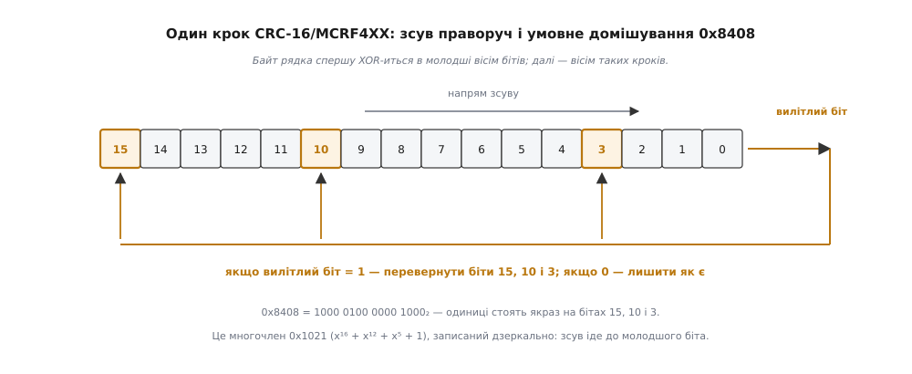

# ⚙️ Рахуємо `CRC_EXTRA` самотужки: від XML до одного байта

Щоб дізнатися, чи однакові описи повідомлення в наземної станції й у прошивки, досить звірити один байт — `CRC_EXTRA`; ось код, який виводить цей байт просто з XML-опису, без жодної залежності, і перевірка його на опублікованих значеннях, яким можна довіряти.

## Навіщо мати свою реалізацію

Уявімо звичайну ситуацію. Апарат літає, телеметрія йде, але одне-єдине повідомлення зникло з ефіру. На борту — прошивка, зібрана торік, і в ній згенерована таблиця відбитків. На столі — свіжий XML діалекту. Питання, на яке треба відповісти, одне: чи збігається байт, що випливає з опису, з байтом, який зашитий у прошивку.

Найочевидніший шлях — поставити генератор, перегенерувати бібліотеку й порівняти. Але цей шлях складається з ланок, кожна з яких може збрехати: не той діалект підхопився, не та гілка сховища, не та версія дротового протоколу в ключах. Сотня рядків коду, які читають XML і друкують байт, таких ланок не має: що написано в описі, те й лягло в суму.

Друга причина — гачок для складання. Правило «повідомлення, яке вже випущене, не сміє змінити свій `CRC_EXTRA`» перевіряється одним скриптом і одним файлом еталонних значень поруч. Це звичайний [модульний тест](book:programming/unit-testing) — маленька перевірка, що біжить швидко, ізольовано й порівнює результат з еталоном, який лежить у сховищі; просто одиницею тут виступає не функція, а опис протоколу. Правку опису, що тихо розриває зв'язок із флотом, такий тест ловить до того, як вона потрапить у гілку.

Робота розкладається на три частини, і кожну можна перевірити окремо: функція контрольної суми, рядок, який їй згодовують, і згортання двобайтового результату до одного байта.

## Контрольна сума: один многочлен, три способи

[Контрольна сума CRC](book:communications/crc) — це залишок від ділення повідомлення, узятого як довгий двійковий многочлен, на наперед обраний твірний многочлен. Ділення йде за модулем два, тобто без переносів, тож уся арифметика зводиться до зсувів і XOR. Варіант, який вживає MAVLink, зветься CRC-16/MCRF4XX: твірний многочлен x¹⁶ + x¹² + x⁵ + 1, початкове значення регістра 0xFFFF, підсумок нічим не перевертають і ні з чим не складають наприкінці.

Одна деталь у цьому переліку переписує саму формулу, і на ній спотикаються найчастіше: біти байта заходять у регістр молодшим уперед. Многочлен, який у прямому записі має вигляд 0x1021, у дзеркальному стає 0x8408 — і крок алгоритму перевертається дзеркально теж. Замість зсуву ліворуч із перевіркою старшого біта — зсув праворуч із перевіркою молодшого; замість того, щоб байт заходив у старшу половину регістра, він накладається XOR-ом на молодшу.


*Один крок: регістр з'їжджає на біт праворуч, а вилітлий біт вирішує, чи домішувати 0x8408. Одиниці цієї константи стоять якраз на бітах 15, 10 і 3 — це дзеркально записаний многочлен 0x1021.*

Прямо з цього опису пишеться найпростіша реалізація. Вісім кроків на байт, жодної таблиці, жодної магії — саме такий вигляд алгоритм має в підручнику.

:::tabs
```python
POLY = 0x8408          # дзеркальне подання твірного многочлена 0x1021
INIT = 0xFFFF

def crc16_bitwise(data, crc=INIT):
    """CRC-16/MCRF4XX побітно: вісім кроків на кожен байт."""
    for byte in data:
        crc ^= byte                       # байт заходить у молодші вісім бітів
        for _ in range(8):
            if crc & 1:                   # вилітлий біт = 1 → домішуємо многочлен
                crc = (crc >> 1) ^ POLY
            else:
                crc >>= 1
    return crc
```
```c
#include <stdint.h>
#include <stddef.h>

#define CRC_POLY 0x8408u   /* дзеркальне подання твірного многочлена 0x1021 */
#define CRC_INIT 0xFFFFu

/* CRC-16/MCRF4XX побітно: вісім кроків на кожен байт. */
uint16_t crc16_bitwise(const uint8_t *data, size_t len, uint16_t crc)
{
    for (size_t i = 0; i < len; i++) {
        crc ^= data[i];                        /* байт — у молодші вісім бітів */
        for (int bit = 0; bit < 8; bit++) {
            if (crc & 1u)                      /* вилітлий біт = 1 */
                crc = (uint16_t)((crc >> 1) ^ CRC_POLY);
            else
                crc = (uint16_t)(crc >> 1);
        }
    }
    return crc;
}
```
:::

У самій бібліотеці MAVLink цієї петлі немає. Там стоїть чотирирядкова функція без жодного циклу — і це не інший алгоритм, а той самий, тільки згорнутий алгебраїчно. Ключ ось у чому: усе, що вісім кроків роблять із регістром, залежить лише від молодшого байта регістра, складеного за модулем два з байтом даних; старша половина просто з'їжджає вниз на вісім позицій. Отже, вісім умовних зсувів можна порахувати наперед як функцію одного байта — а для конкретного многочлена 0x8408 ця функція виявляється настільки простою, що записується трьома зсувами.

```c
/* Той самий CRC, згорнутий у чотири рядки — так він виглядає в checksum.h
   бібліотеки MAVLink. Ні циклу, ні таблиці: нуль байтів пам'яті. */
static inline void crc_accumulate(uint8_t data, uint16_t *crc_accum)
{
    uint8_t tmp = data ^ (uint8_t)(*crc_accum & 0xFF);
    tmp ^= (uint8_t)(tmp << 4);
    *crc_accum = (uint16_t)((*crc_accum >> 8) ^ (tmp << 8) ^ (tmp << 3) ^ (tmp >> 4));
}
```

Третій спосіб — [таблиця замін](book:programming/lookup-table): наперед пораховані результати замість обчислення на місці, класичний обмін пам'яті на час. Для CRC таблиця має 256 записів по два байти — по одному на кожне можливе значення байта, що входить, — і крок стає одним індексуванням та одним XOR.

```python
def build_table():
    """256 записів — результат тих самих восьми кроків для кожного байта."""
    table = []
    for byte in range(256):
        c = byte
        for _ in range(8):
            c = (c >> 1) ^ POLY if c & 1 else c >> 1
        table.append(c)
    return table

CRC_TABLE = build_table()

def crc16_table(data, crc=INIT):
    for byte in data:
        crc = (crc >> 8) ^ CRC_TABLE[(crc ^ byte) & 0xFF]
    return crc
```

Варто помітити, що таблицю будує та сама побітова петля. Джерело правди лишається одне: якщо колись знадобиться інший многочлен, правити треба один рядок, а не 256 констант, переписаних із чужої статті.

Який спосіб брати? Для нашої задачі — байдуже: рядок, який ми хешуємо, має від тридцяти до чотирьохсот байтів, і будь-яка з трьох реалізацій відпрацює швидше, ніж ми встигнемо це помітити. Різниця з'являється в прошивці, де CRC рахують для кожного кадру, і там вибір цілком конкретний: таблиця коштує 512 байтів флеша, чотирирядкова версія — нуль. На дрібному мікроконтролері з десятками кілобайтів пам'яті друге зазвичай вигідніше, тому в MAVLink і стоїть саме воно.

Три реалізації мають давати те саме число, і це перше, що слід перевірити:

```
CRC-16/MCRF4XX("123456789") = 0x6F91      ← опублікована контрольна точка

побітова == чотирирядкова == таблична     на 2000 випадкових рядків
```

## Рядок, який ми хешуємо

Тепер друга частина — з чого саме береться той потік байтів. Рецепт короткий, але кожен його пункт має гострий край:

1. назва повідомлення й **пробіл**;
2. далі для кожного **базового** поля, у **дротовому** порядку: назва типу й пробіл, потім назва поля й пробіл;
3. якщо поле — масив, після цього ще **один сирий байт** із кількістю елементів.

Дротовий порядок означає ось що: базові поля впорядковують за розміром **одного елемента** типу, від більших до менших, а поля з однаковим розміром лишаються в тому порядку, у якому написані в XML. Друга половина цього речення — вимога стійкості сортування: рівні за ключем елементи не сміють мінятися місцями. У `HEARTBEAT` це не видно, бо чотирибайтове поле там одне, зате в `ATTITUDE` шість полів `float` і одне `uint32_t` мають однаковий розмір, і будь-яка їхня перестановка дасть інший байт. Про те, які алгоритми цю властивість зберігають, а які ні, — [стійкість сортування](book:algorithms/sorting-stability): стандартний `sorted` у Python стійкий за визначенням мови, а `qsort` у C — ні, і це вже пастка, до якої ми повернемося.

Базові поля — це ті, що стоять **до** тега `<extensions/>`. Різати треба саме до сортування: поля після тега не входять ні у відбиток, ні в перевпорядкування.

І дві дрібні нормалізації, без яких число не зійдеться. Псевдотип `uint8_t_mavlink_version` у рядок іде під іменем `uint8_t` — на дроті це звичайний байт, просто заповнює його генератор. А в поля-масиві типом вважають базовий тип без дужок: з `char[50]` у рядок потрапляє `char`, а число 50 додається окремим байтом **після** назви поля — байтом, не текстом. Курйозний наслідок: 50 — це код символу `'2'`, тож рядок для `STATUSTEXT` буквально читається як `STATUSTEXT uint8_t severity char text 2`.

Розбір XML робимо стандартним `ElementTree` — тут вистачить простого обходу дерева елементів з атрибутами, без просторів імен і схем ([XML: дерево елементів](book:programming/xml-markup)).

```python
# -*- coding: utf-8 -*-
"""CRC_EXTRA з опису MAVLink. Лише стандартна бібліотека."""
import sys
import xml.etree.ElementTree as ET

# розмір ОДНОГО елемента типу — саме він є ключем сортування
ELEM_SIZE = {
    'char': 1, 'int8_t': 1, 'uint8_t': 1,
    'int16_t': 2, 'uint16_t': 2,
    'int32_t': 4, 'uint32_t': 4, 'float': 4,
    'int64_t': 8, 'uint64_t': 8, 'double': 8,
}

class Field:
    def __init__(self, type_attr, name):
        t, self.count = type_attr, 0
        if t == 'uint8_t_mavlink_version':     # псевдотип: на дроті це просто байт
            t = 'uint8_t'
        i = t.find('[')
        if i != -1:                            # масив: char[50] → char + count 50
            self.count = int(t[i + 1:-1])
            t = t[:i]
            if t == 'array':                   # застарілий псевдотип зі старих описів
                t = 'int8_t'
        self.type, self.name = t, name
        self.elem = ELEM_SIZE[t]

def read_message(msg_el):
    """Базові поля повідомлення — усе до тега <extensions/>."""
    base, after_tag = [], False
    for el in msg_el:
        if el.tag == 'extensions':
            after_tag = True
        elif el.tag == 'field' and not after_tag:
            base.append(Field(el.get('type'), el.get('name')))
    return base

def wire_order(fields):
    """Більші типи вперед; рівні лишаються в порядку XML — sorted стійкий."""
    return sorted(fields, key=lambda f: f.elem, reverse=True)

def signature(name, base):
    """Той самий рядок, який хешує генератор. Пробіл — після КОЖНОГО слова."""
    buf = bytearray((name + ' ').encode('ascii'))
    for f in wire_order(base):
        buf += (f.type + ' ').encode('ascii')
        buf += (f.name + ' ').encode('ascii')
        if f.count:
            buf.append(f.count)                # сирий байт, не десятковий запис
    return buf

def crc_extra(name, base):
    crc = crc16_bitwise(signature(name, base))
    return (crc & 0xFF) ^ (crc >> 8)           # згортання двох байтів в один

def scan(path):
    root = ET.parse(path).getroot()
    return {m.get('name'): (int(m.get('id')), crc_extra(m.get('name'), read_message(m)))
            for m in root.iter('message')}

if __name__ == '__main__':
    for name, (mid, extra) in sorted(scan(sys.argv[1]).items(), key=lambda kv: kv[1][0]):
        print('%-14s id=%-5d CRC_EXTRA=%d' % (name, mid, extra))
```

Згортання в останньому рядку `crc_extra` — це третя частина задачі, і вона в один вираз: два байти шістнадцятибітної суми складають за модулем два, `(crc & 0xFF) ^ (crc >> 8)`. Обидва байти рівноправно впливають на результат, тож правка опису, яка зачепила лише старший байт суми, однаково змінить відбиток.

## Перевірка на відомих значеннях

Тепер найважливіше: код, який рахує відбиток, нічого не вартий, поки не відтворив числа, надруковані в чужих згенерованих бібліотеках. Запускаємо на описі з чотирма повідомленнями — трьома звичайними й одним із масивом:

```
HEARTBEAT      id=0     CRC_EXTRA=50
SYS_STATUS     id=1     CRC_EXTRA=124
ATTITUDE       id=30    CRC_EXTRA=39
STATUSTEXT     id=253   CRC_EXTRA=83
```

Усі чотири збігаються з тим, що стоїть у заголовках офіційної бібліотеки C: у `mavlink_msg_statustext.h`, наприклад, є рядок `#define MAVLINK_MSG_ID_STATUSTEXT_CRC 83`. Останній випадок цінний саме тим, що містить масив — він перевіряє одразу дві тонкощі, які інакше лишилися б неперевіреними:

**Умова.** Простежмо `STATUSTEXT` до останнього байта.

```
базові поля (до тега <extensions/>):
    uint8_t severity        елемент 1 байт
    char[50] text           елемент 1 байт  ← сортується як 1, не як 50!

дротовий порядок: обидва мають елемент 1 байт → лишаються в порядку XML

рядок (39 байтів):
    "STATUSTEXT " "uint8_t " "severity " "char " "text " + байт 50

CRC-16/MCRF4XX, початкове 0xFFFF   →  0x396A
згортання:  (0x396A & 0xFF) ^ (0x396A >> 8)
         =   0x6A          ^  0x39
         =   0x53          =  83                    ✓ збігається
```

Друге поле займає на дроті 50 байтів, а в сортуванні важить один. Якби ключем сортування був розмір поля, а не розмір елемента, `text` пішов би поперед `severity`, рядок вийшов би інший — і замість 83 ми отримали б випадкове число, яке жодна прошивка не впізнає.

Для тих, хто хоче звірити решту чисел, ось повний ланцюг ще для двох повідомлень:

```
ATTITUDE:    "ATTITUDE uint32_t time_boot_ms float roll float pitch float yaw "
             "float rollspeed float pitchspeed float yawspeed "        (112 байтів)
             CRC-16 = 0x9FB8 → 0xB8 ^ 0x9F = 0x27 = 39

SYS_STATUS:  358 байтів, три uint32_t попереду, дев'ять двобайтових, int8_t у хвості
             CRC-16 = 0x522E → 0x2E ^ 0x52 = 0x7C = 124
```

> 🔧 **Навіщо це.** Коли ці чотири числа зійшлися, ви маєте не «схожу» реалізацію, а точну: збіг на чотирьох незалежних входах, серед яких є масив, псевдотип версії й повідомлення з тегом розширень, випадковим бути не може. Відтепер програмі можна довіряти на будь-якому власному повідомленні діалекту, для якого ніяких опублікованих значень не існує — а саме заради них усе й затівалося.

## Що показує тег розширень

Найкорисніша демонстрація — не порахувати відбиток, а показати, як він реагує на правку опису. Візьмімо `ATTITUDE` і додаймо до нього одне поле `float extra` — двічі, у двох різних місцях.

```
опис як є (7 базових полів)                     CRC_EXTRA = 39
+ float extra ДО   <extensions/>                CRC_EXTRA = 183
+ float extra ПІСЛЯ <extensions/>               CRC_EXTRA = 39
```

Перший рядок — те, що зашито в кожній прошивці, яка сьогодні літає. Другий — катастрофа: 183 ≠ 39, і кожен кадр `ATTITUDE` від нового відправника старий приймач відкине як пошкоджений, мовчки, без жодного повідомлення про помилку. Третій — та сама нова інформація на дроті, але відбиток не зрушив, бо `read_message` обриває збирання полів на тезі, і поле `extra` до рядка просто не потрапляє.

Різниця між другим і третім рядком — це три слова в XML, переставлені місцями. Вона й є всім механізмом сумісності: чотири рядки коду в `read_message` вирішують, чи розлетиться флот.

## Той самий байт у прошивці

На борту ця сама сума працює з іншого боку: не рахує відбиток, а споживає його. [Кадр MAVLink 2](book:communications/mavlink-packet) складається з початкового байта 0xFD, дев'ятибайтового заголовка з довжиною, лічильником, адресами й тризначним визначником повідомлення, корисних даних і двобайтової контрольної суми в хвості. У суму входить усе, крім самого 0xFD, — і останнім у неї домішується `CRC_EXTRA`.

```c
#include <stdbool.h>

#define MAVLINK_STX_V2   0xFDu
#define MAVLINK_V2_HDR   10u   /* 0xFD + дев'ять байтів заголовка */

/* Чи цілий отриманий кадр. crc_extra беруть із згенерованої таблиці за визначником. */
bool frame_ok(const uint8_t *frame, uint8_t payload_len, uint8_t crc_extra)
{
    uint16_t crc = CRC_INIT;

    /* усе, крім початкового байта: заголовок і корисні дані */
    for (size_t i = 1; i < MAVLINK_V2_HDR + (size_t)payload_len; i++)
        crc_accumulate(frame[i], &crc);

    crc_accumulate(crc_extra, &crc);       /* ← відбиток опису домішується останнім */

    const uint8_t *tail = frame + MAVLINK_V2_HDR + payload_len;
    uint16_t received = (uint16_t)tail[0] | (uint16_t)((uint16_t)tail[1] << 8);
    return received == crc;
}
```

Байт відбитка в ефір не летить — його лише домішують у підрахунок з обох боків. Тому одна-єдина перевірка ловить дві різні біди: спотворений у радіоканалі байт і сторону з іншим описом. І тому ж діагностика така проста: якщо `frame_ok` повертає хибу на кожному кадрі одного типу повідомлення й на жодному іншому, справа не в ефірі, а в `crc_extra`.

## Пастки

**Нестійке сортування в C.** Стандартний `qsort` не зобов'язаний зберігати порядок рівних елементів, і на різних бібліотеках дасть різний результат — тобто ваша програма рахуватиме різний `CRC_EXTRA` на різних машинах, зрідка й невідтворювано. Ліки: додати початковий індекс у критерій порівняння як тайбрейкер.

```c
/* Порівняння для qsort: більший елемент — уперед; рівні — за порядком в XML. */
static int by_wire_order(const void *a, const void *b)
{
    const field_t *x = a, *y = b;
    if (x->elem != y->elem)
        return (int)y->elem - (int)x->elem;   /* спадання за розміром елемента */
    return (int)x->index - (int)y->index;     /* стійкість — руками */
}
```

**Ключ сортування — розмір елемента, а не розмір поля.** Повторюю окремо, бо помилка тиха: `char[50]` важить у сортуванні один байт. Код, що сортує за довжиною поля на дроті, дасть правильні числа для всіх повідомлень без масивів — тобто пройде поверхневу перевірку — і зламається рівно там, де це найважче помітити.

**Пробіл після кожного слова, зокрема останнього.** У рядку немає роздільників між частинами й немає завершального маркера: пробіли — це все, що є. Забутий пробіл після назви повідомлення чи після назви останнього поля дає інше число, і жодного натяку на причину.

**Кількість елементів масиву — байт, а не текст.** Записати `"50"` замість байта 0x32 — типова помилка «на автоматі», і вона дає інший результат навіть для `char[50]`, де байт випадково збігається з символом `'2'`: два символи замість одного.

**Обрізання на тезі — до сортування, а не після.** Якщо відсортувати всі поля разом, а вже потім відкинути розширення, у базовій частині може опинитися не той набір: велике поле-розширення пролізе вперед і виштовхне назад справжнє базове.

**Повідомлення живе не в тому файлі, який ви розбираєте.** Діалекти складають дерево через `<include>`, і `HEARTBEAT` у `ardupilotmega.xml` ви не знайдете — він у `minimal.xml` глибоко внизу ланцюга ([діалекти MAVLink](book:communications/mavlink-dialect) — про те, як опис ділиться на файли й хто кого підключає). Скрипт має або пройти дерево включень, або чесно повідомити, що заданого повідомлення в цьому файлі немає, — але не мовчати.

**Назви — тільки ASCII.** `encode('ascii')` тут навмисно замість `encode('utf-8')`: якщо в опис якимось чином потрапив не-ASCII символ, краще негайний виняток, ніж число, що залежить від кодування файлу.

**Один байт — це один байт.** Два несумісні описи з ймовірністю приблизно 1/256 дадуть однаковий відбиток і не помітять розходження. Так проєктували свідомо: за надійніший відбиток довелося б платити зайвими байтами в кожному кадрі. Відповідно, збіг `CRC_EXTRA` — сильний, але не абсолютний доказ, що описи однакові.

**Складність.** Побітова петля робить вісім зсувів на байт при рядку в кілька сотень байтів — обчислення лінійне й миттєве; уся вартість тут не в арифметиці, а в тому, що XML доводиться розібрати. Таблиця пришвидшує сталу в вісім разів ціною 512 байтів — вибір, який має сенс у гарячому шляху розбирача кадрів і не має жодного в скрипті, що біжить раз на складання.
