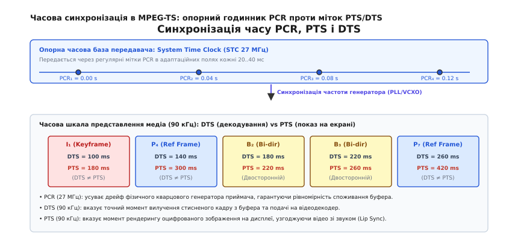

# 🧮 Математична модель синхронізації PCR та аналіз джитера

Ця вставка містить строгий математичний аналіз системи відновлення опорної часової бази STC (System Time Clock 27 МГц) за дискретними вибірками PCR (Program Clock Reference), повне виведення передавальної функції цифрової фазової автопідстройки частоти (PLL), аналіз стійкості контуру за критерієм Джурі, математичні методи вимірювання джитера за стандартом ETSI TR 101 290, модель фазового шуму й девіації Аллана, а також розрахунок деджитер-буфера для IP-мереж і супутникових каналів LEO з урахуванням ефекту Доплера.

---

### 1. Дворівнева структура системного часу та зв'язок частот 27 МГц і 90 кГц

У стандарті MPEG-TS часова шкала побудована на опорному генераторі передавача з номінальною частотою `27` МГц (`f_sys = 27 000 000` Гц). Для зменшення бітових витрат у заголовках пакетів і збереження зворотної сумісності зі стандартом MPEG-1, мітка часу PCR розбивається на дві частини:
1. **`PCR_Base`** (33 біти) — рахує періоди допоміжної тактової сітки `90` кГц (`f_base = 90 000` Гц). Застосовується для міток часу представлення медіаданих (PTS/DTS).
2. **`PCR_Extension`** (9 бітів) — лічильник залишку з модулем переповнення `300` (діапазон значень від `0` до `299`), що працює на повній частоті `27` МГц.

Коефіцієнт поділу `300` випливає з точного відношення частот:

```
M = f_sys / f_base
  = 27 000 000 / 90 000      [пряме ділення]
  = 300                      [цілочисельний коефіцієнт зв'язку]
```

Повне значення лічильника системного часу передавача в момент випромінювання пакета виражається в абсолютних відліках 27 МГц:

```
PCR_Total = PCR_Base · 300 + PCR_Extension    [загальне значення в тактах 27 МГц]
```

Максимальний діапазон 33-бітного лічильника `PCR_Base` становить `2³³ = 8 589 934 592` відліків сітки 90 кГц. Період повного переповнення шкали часу розраховується як:

```
T_wrap = 2³³ / f_base
       = 8 589 934 592 / 90 000   [розрахунок у секундах]
       = 95 443.717... с          [переведення в години: ділимо на 3600]
       ≈ 26.512 годин             [понад одну добу безперервного мовлення]
```

При переповненні лічильника різниця між поточною міткою `PCR[n]` та попередньою `PCR[n-1]` обчислюється за правилом модулярної арифметики:

```
ΔPCR = (PCR_Total[n] - PCR_Total[n-1]) mod (2³³ · 300)
```

Це дозволяє системі фазового автопідстроювання безперервно супроводжувати потік крізь межу переповнення шкали без зриву синхронізації.

---

### 2. Модель дрейфу локального генератора та фазової похибки

На приймальній стороні (у демодуляторі DVB, тюнері телевізора або відеоплеєрі) встановлено власний кварцовий генератор, реальна частота якого `f_rx(t)` відхиляється від номінальних `27` МГц через виробничу похибку, старіння кристала та температурний дрейф:

```
f_rx(t) = f_sys · (1 + ε(t) + ξ(t))
```
де `ε(t)` — повільний детермінований дрейф частоти, а `ξ(t)` — випадковий фазовий шум генератора.

Для стандартних побутових кварцових резонаторів похибка `ε` зазвичай лежить у межах `±30 ppm` (тобто `±30 × 10⁻⁶`), що еквівалентно відхиленню частоти до `±810` Гц на опорній частоті `27` МГц.

Якщо приймач не буде синхронізувати свій годинник із передавачем, різниця між відліками наростатиме лінійно в часі. За інтервал між двома мітками `Δt` накопичена часова похибка `ΔT_drift` складе:

```
ΔT_drift = ε · Δt
```

При відхиленні `ε = +30 ppm` за 1 секунду розбіжність годинників досягне `30` мікросекунд (`810` тактів 27 МГц), що вже за декілька хвилин призведе до повного вичерпання або переповнення буфера відеодекодера (Buffer Underflow / Overflow).

---

### 3. Неперервна модель контуру PLL у s-просторі

Для підтримки повної синхронності приймач використовує систему фазового автопідстроювання частоти (англ. *Phase-Locked Loop*, **PLL**), яка керує керованим напругою кварцовим генератором (VCXO) або програмним числовим синтезатором частоти (NCO).


*Опорні мітки PCR дисциплінують системний генератор приймача STC (27 МГц), а мітки PTS та DTS (90 кГц) керують вилученням та відображенням кадрів відеодекодером.*

#### Неперервна модель у s-просторі (2-й порядок)
Контур складається з трьох ключових блоків:
1. **Фазовий детектор (Phase Detector)** із коефіцієнтом передачі `K_d` (В/відлік).
2. **Пропорційно-інтегральний фільтр контуру (PI Loop Filter)** із передавальною функцією:
   ```
   F(s) = K_p + K_i / s
   ```
3. **Керований генератор (VCXO)**, що виконує роль інтегратора фази з коефіцієнтом крутизни `K_v` (рад/(с·В)):
   ```
   H_vcxo(s) = K_v / s
   ```

Передавальна функція розімкненого контуру:

```
G(s) = K_d · F(s) · H_vcxo(s)
     = K_d · (K_p + K_i / s) · (K_v / s)        [підстановка блоків]
     = (K_d · K_v · (K_p · s + K_i)) / s²      [зведення до спільного знаменника]
```

Передавальна функція замкненого контуру:

```
T(s) = G(s) / (1 + G(s))
     = ( (K_d · K_v · K_p)·s + K_d · K_v · K_i ) / ( s² + (K_d · K_v · K_p)·s + K_d · K_v · K_i )
```

Зіставляючи знаменник зі стандартною формою коливальної ланки 2-го порядку `s² + 2·ζ·ω_n·s + ω_n²`, отримуємо вирази для власної резонансної частоти контуру `ω_n` та коефіцієнта демпфування `ζ`:

```
ω_n = √(K_d · K_v · K_i)                       [власна кутова частота контуру]
ζ   = (K_p / 2) · √( (K_d · K_v) / K_i )      [коефіцієнт демпфування]
```

Для забезпечення аперіодичного перехідного процесу без перерегулювання та автоколивань коефіцієнт демпфування обирають у діапазоні `ζ = 0.707`..`1.0` (оптимум Баттерворта). Власну частоту контуру обирають дуже низькою: `f_n = ω_n / (2π) ≈ 0.01`..`0.1` Гц. Це перетворює контур PLL на надвузькосмуговий фільтр низьких частот, який повністю зрізає високочастотний шум і мережевий джитер, повільно відстежуючи виключно температурний дрейф передавача.

---

### 4. Дискретна реалізація контуру та аналіз стійкості за критерієм Джурі

У цифровому приймачі вибірки надходять дискретно з інтервалом `T_s ≈ 40` мс (`Δt_pcr`). 

#### Рівняння стану дискретного контуру PLL:
Нехай на кроці `n`:
* `PCR[n]` — вхідна мітка часу;
* `θ_est[n]` — поточна оцінка фази локального лічильника STC;
* `x_int[n]` — стан інтегратора фільтра контуру;
* `Δf[n]` — обчислена корекція частоти.

Послідовність кроків обчислення:

```
e[n]       = PCR[n] - θ_est[n]                  [фазова похибка]
x_int[n]   = x_int[n-1] + K_i · e[n] · T_s     [накопичення інтеграла]
Δf[n]      = K_p · e[n] + x_int[n]             [пропорційно-інтегральний вихід]
θ_est[n+1] = θ_est[n] + (f_nom + Δf[n]) · T_s  [прогноз фази на наступний крок]
```

#### Характеристичне рівняння та критерій стійкості Джурі:
Передавальна функція дискретної замкненої системи в z-просторі має вигляд:

```
H(z) = ( (K_p + K_i · T_s)·z - K_p ) / ( z² + (K_p + K_i · T_s - 2)·z + (1 - K_p) )
```

Знаменник задає характеристичний поліном системи:
```
P(z) = z² + a₁·z + a₀
```
де `a₁ = K_p + K_i · T_s - 2`, а `a₀ = 1 - K_p`.

Для того щоб усі полюси системи знаходилися суворо всередині одиничного кола на комплексній площині (`|z| < 1`), за критерієм стійкості Джурі мають виконуватися три одночасні нерівності:

1. **Перша умова**: `|a₀| < 1`
   ```
   |1 - K_p| < 1  ==>  0 < K_p < 2
   ```
2. **Друга умова**: `P(1) > 0`
   ```
   1 + a₁ + a₀ = 1 + (K_p + K_i · T_s - 2) + (1 - K_p)
               = K_i · T_s > 0  ==>  K_i > 0
   ```
3. **Третя умова**: `P(-1) > 0`
   ```
   1 - a₁ + a₀ = 1 - (K_p + K_i · T_s - 2) + (1 - K_p)
               = 4 - 2·K_p - K_i · T_s > 0  ==>  2·K_p + K_i · T_s < 4
   ```

Виконання цих трьох нерівностей гарантує асимптотичну стійкість цифрового контуру синхронізації та відсутність розбіжності фази при тривалій роботі.

---

### 5. Методологія вимірювання джитера за стандартом ETSI TR 101 290

Стандарт моніторингу цифрового мовлення ETSI TR 101 290 розділяє аналіз якості міток PCR на три фундаментальні метрики:

#### 1. Загальний джитер PCR (Overall Jitter, PCR_OJ)
Загальний джитер оцінює розбіжність між фізичним часом надходження пакета `t_rx[n]` та математичним часом, закодованим у мітці `PCR[n]`:

```
PCR_OJ[n] = t_rx[n] - (t_rx[0] + (PCR[n] - PCR[0]) / f_sys)
```
Ця величина характеризує сумарний вплив мережевих буферів, затримок мультиплексування та маршрутизації.

#### 2. Точність PCR (PCR Accuracy, PCR_AC)
Оцінює високочастотну складову джитера, що залишається після пропускання сигналу помилки через стандартизований цифровий фільтр високих частот із частотою зрізу `f_c = 0.1` Гц. Стандарт вимагає:

```
|PCR_AC| ≤ 500 нс    [максимально допустима високочастотна похибка]
```
Якщо похибка перевищує 500 нс, фазовий контур телевізійного приймача не здатний придушити коливання, що призводить до появи кольорового шуму на аналогових виходах або періодичного випадання аудіосемплів.

#### 3. Швидкість дрейфу частоти (PCR Drift Rate, PCR_DR)
Вимірює похідну низькочастотної складової частоти генератора (після фільтра низьких частот із частотою зрізу `0.01` Гц):

```
PCR_DR = |d f_stc / dt| ≤ 0.075 Гц/с    [максимальна швидкість дрейфу]
```
Це обмеження гарантує, що швидкість зміни частоти студійного передавача не перевищує динамічний діапазон швидкості реакції інтегратора в приймачах.

---

### 6. Спектральна густина фазового шуму та девіація Аллана

Фізичний кварцовий генератор у приймачі та передавачі генерує фазовий шум, що описується спектральною густиною потужності флуктуацій фази `S_phi(f)` (виражається у дБн/Гц на зміщенні `f` від носія 27 МГц).

Спектр шуму кварцового резонатора складається з чотирьох класичних зон:
1. **Фліккер-шум частоти (Flicker Frequency Noise, `1/f³`)**: домінує на наднизьких частотах (`f < 1` Гц), відображає повільні теплові деформації кристала кварцу;
2. **Білий шум частоти (White Frequency Noise, `1/f²`)**: тепловий рух вільних носіїв заряду в контурі генератора;
3. **Фліккер-шум фази (Flicker Phase Noise, `1/f`)**: шум у напівпровідникових підсилювачах підтримувального каскаду;
4. **Білий фазовий шум (`f⁰`)**: тепловий шум вихідного буфера (Noise Floor, зазвичай `-150` дБн/Гц).

Для кількісної оцінки нестабільності часової бази застосовується **девіація Аллана** (англ. *Allan Deviation*, `sigma_y(tau)`), що вимірює розбіжність середніх частот на інтервалах усереднення `tau`:

```
σ_y²(τ) = 1 / (2·(M - 1)) · ∑ ( y_{k+1} - y_k )²
```
де `y_k` — середнє відносне відхилення частоти на `k`-му інтервалі тривалістю `tau`.

Для якісного генератора студійного мовника девіація Аллана повинна задовольняти умову `sigma_y(tau) <= 10⁻¹⁰` на інтервалі усереднення `tau = 10` с. Це гарантує, що за час між двома сусідніми мітками PCR (`40` мс) власний набіг фази генератора не перевищить `4` пікосекунди, залишаючись значно нижчим за квант похибки в `37` нс (один такт частоти 27 МГц).

---

### 7. Ефект Доплера та особливості синхронізації в супутникових каналах LEO

При трансляції MPEG-TS через низькоорбітальні супутникові угруповання (LEO, висота орбіти `h ≈ 500..1200` км, швидкість польоту `v_sat ≈ 7.5` км/с) виникає значний динамічний зсув несучої частоти та зміна швидкості надходження пакетів через **ефект Доплера**.

Миттєвий доплерівський зсув частоти `Delta_f_D(t)` для супутника, що пролітає над наземною станцією з кутом піднесення `theta(t)`, розраховується за формулою:

```
Δf_D(t) = f_0 · (v_sat / c) · cos(θ(t))
```
де `c = 3 × 10⁸` м/с — швидкість світла, а `f_0` — радіочастота носія (наприклад, Ku-діапазон `12` ГГц).

Максимальний зсув частоти досягає:

```
Δf_D_max = 12 000 000 000 · (7500 / 300 000 000)    [підстановка параметрів LEO]
         = 12 000 000 000 · 0.000025                [обчислення відношення v/c]
         = 300 000 Гц = ±300 кГц                    [максимальний доплерівський зсув]
```

Швидкість зміни доплерівського зсуву (Chirp Rate, `df_D / dt`) у зеніті сягає `2`–`3` кГц/с. Це викликає видимий стиск та розтягнення часового інтервалу між мітками PCR (Time Dilation):

```
Δt_pcr_rx = Δt_pcr_tx · (1 - v_radial(t) / c)
```

Щоб компенсувати цей динамічний дрейф, демодулятор супутникового приймача LEO застосовує попереднє доплерівське нівелювання за даними ефемерид супутника (TLE), а контур PLL демультиплексора розширює смугу пропускання фільтра до `f_n ≈ 1` Гц на етапі супроводу траєкторії.

---

### 8. Статистичні моделі затримки та розрахунок деджитер-буфера

При передачі потоку через некеровані IP-мережі (IPTV, Інтернет-стрімінг, Wi-Fi або 4G/5G) випадкова затримка в чергах маршрутизаторів підпорядковується не гауссівському, а важкохвостому розподілу Парето або узагальненому логнормальному розподілу.

Ймовірність спустошення буфера (Buffer Underflow) визначається інтегралом «хвоста» функції густини розподілу затримки `p(τ)`:

```
P_underflow = ∫ p(τ) dτ    [інтегрування від T_buffer до нескінченності]
```

Щоб мінімізувати ймовірність зриву кадру до величини `P_underflow < 10⁻⁶`, розмір компенсаційного буфера (Dejitter Buffer) повинен покривати максимальний піковий розмах затримки `J_max` із коефіцієнтом запасу `T_safety = 1.5`..`2.0`.

#### Формула розрахунку розміру деджитер-буфера:
```
B_min = (R_ts · J_max · T_safety) / 8    [розмір буфера в байтах]
```

#### Числовий приклад розрахунку:
Вихідні дані для телевізійного HDTV-потоку (1080p60) у мережі інтернет-провайдера:
* Бітрейт потоку: `R_ts = 15 000 000` біт/с (`15` Мбіт/с);
* Максимальний мережевий джитер: `J_max = 50` мс (`0.050` с);
* Коефіцієнт надійності: `T_safety = 1.6`.

Розрахунок об'єму буфера:

```
B_min = (15 000 000 · 0.050 · 1.6) / 8
      = (1 200 000) / 8                 [проміжне множення]
      = 150 000 байтів                 [чистий розмір у байтах]
```

Оскільки транспортний потік складається зі 188-байтних пакетів, переведемо отриманий об'єм у ціле число пакетів:

```
N_packets = ⌈ 150 000 / 188 ⌉
          = ⌈ 797.87 ⌉                 [округлення вгору]
          = 798 пакетів TS             [об'єм буфера черги]
```

Загальна апаратна затримка буферизації `T_delay` складе:

```
T_delay = J_max · T_safety
        = 0.050 · 1.6                  [множення]
        = 0.080 с = 80 мс             [фіксована затримка відтворення]
```

Отриманий буфер об'ємом `150` КБ (798 пакетів) додає постійну фіксовану затримку `80` мс, але повністю нівелює всі коливання часу доставки в IP-каналі, забезпечуючи подачу абсолютно стабільного потоку зі збереженням фазової точності міток PCR на вхід відеодекодера.
