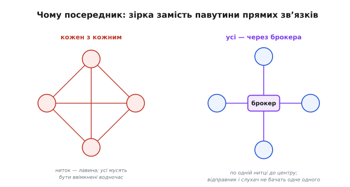
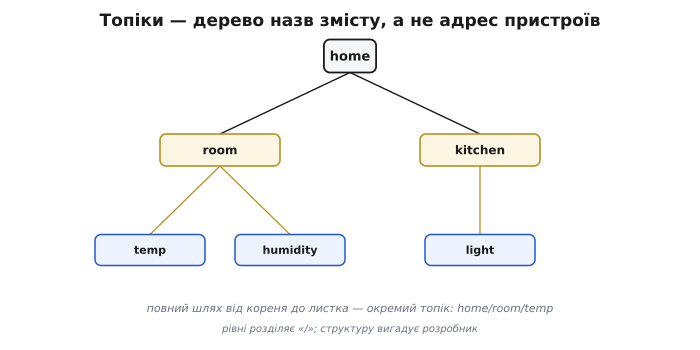
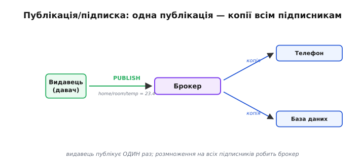
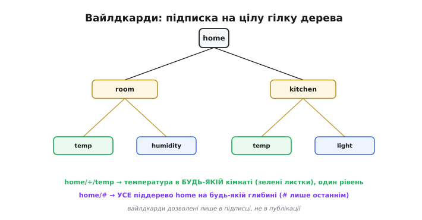
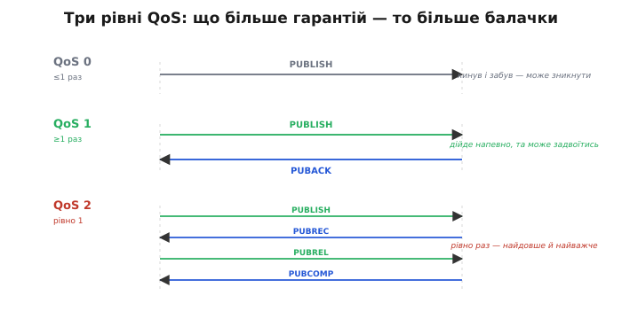
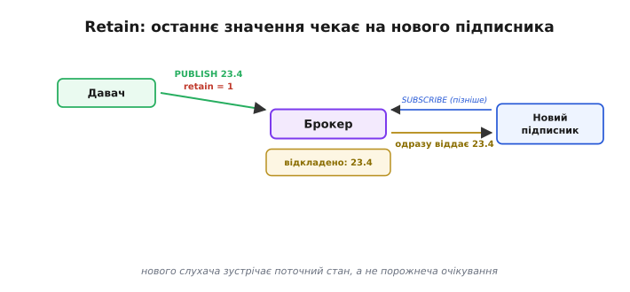
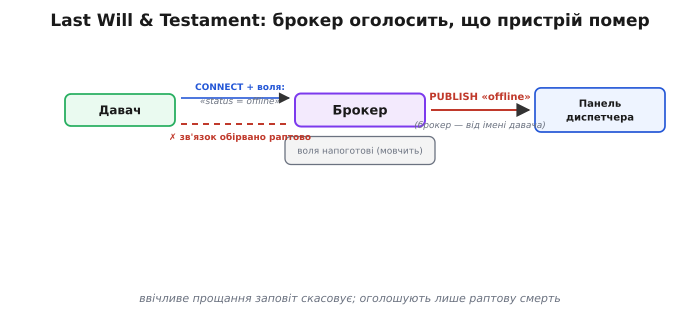
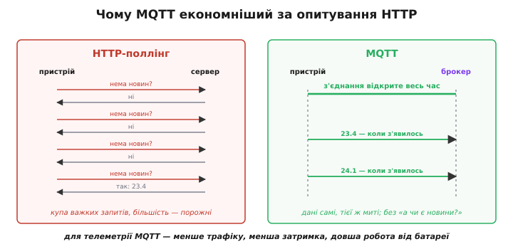

# MQTT

Уяви сотню давачів температури, розкиданих по теплиці, фабриці чи цілому місті. Кожен хоче віддавати своє показання, а кільком програмам — застосунку на телефоні, базі даних, панелі диспетчера — це показання треба чути. Якби кожен споживач сам опитував кожен давач, вийшла б павутина з тисяч прямих з'єднань: кожен має знати адресу кожного, бути ввімкненим тієї ж миті й уміти зв'язатися напряму. Варто комусь поміняти адресу чи заснути — і нитка рветься. **MQTT** (англ. *MQ Telemetry Transport*, «передавання телеметрії MQ»; «MQ» — від давнішого продукту IBM *Message Queue*, «черга повідомлень») розв'язує цей вузол одним поворотом думки: пристрої **не говорять одне з одним напряму взагалі**. Між ними стоїть посередник — **брокер** (англ. *broker*, «посередник, маклер»), і кожен спілкується лише з ним.

Це легкий протокол **публікація/підписка** поверх звичайного [TCP-з'єднання](topic:programming/sockets-tcp-udp), створений для речей, у яких мало пам'яті, слабкий процесор і дорогий чи хисткий зв'язок — тобто для типового пристрою «інтернету речей». Його сила не в швидкості й не в обсязі, а в **ощадливості й розв'язаності**: крихітні повідомлення, мінімум балачки в ефірі й повна незалежність того, хто шле, від того, хто слухає.


*Чому потрібен посередник. Ліворуч — наївний шлях: кожен пристрій тримає пряме з'єднання з кожним, хто його слухає; додати вузол — і кількість ниток зростає лавиною, а всі мають бути ввімкнені водночас. Праворуч — модель MQTT: усі тримають по одному з'єднанню з брокером у центрі, а він уже розводить повідомлення. Той, хто шле, і той, хто слухає, ніколи не бачать одне одного.*

### Брокер посередині: ніхто не зв'язаний напряму

Уся будова MQTT тримається на одній ролі — **брокері**. Це програма-сервер (на звичайному комп'ютері, на платі чи в хмарі), до якої кожен учасник відкриває одне TCP-з'єднання й тримає його. Учасників звуть **клієнтами** (англ. *client*) — і давач, що віддає число, і застосунок, що його читає, для брокера однакові клієнти. Сам клієнт ніколи не шле дані іншому клієнтові: він віддає їх брокерові, а брокер вирішує, кому їх передати далі.

Звідси й береться головна вигода — **розв'язаність** (англ. *decoupling*, «роз'єднання»). Той, хто шле дані, не знає ні скільки в нього слухачів, ні де вони, ні чи ввімкнені вони зараз — він просто віддає число брокерові. Той, хто слухає, не знає, хто й звідки це число прислав. Вони розв'язані в трьох вимірах одразу: **у просторі** (не знають адрес одне одного), **у часі** (не мусять бути на зв'язку тієї ж миті) і **в дії** (відправлення не блокує відправника очікуванням на слухача). Завдяки цьому систему можна нарощувати, не чіпаючи вже наявні пристрої: новий слухач просто приходить до брокера, і старий давач навіть не дізнається про його появу.

> 🔧 **Навіщо це.** Розв'язаність — це те, заради чого MQTT варто брати в реальному проєкті. Поки давач не зашитий намертво на конкретного споживача, ти вільно міняєш усе навколо нього: сьогодні його показання пише база даних, завтра ще й панель на стіні, післязавтра ще й бот, що шле тривогу в месенджер, — а прошивку давача чіпати не треба жодного разу. Один раз навчивши пристрій віддавати число брокерові, ти відв'язуєш його долю від решти системи.

### Топіки: адреса змісту, а не пристрою

Якщо клієнти не знають одне одного, то як брокер розуміє, кому що віддати? Через **топік** (англ. *topic*, «тема»). Топік — це не адреса пристрою, а **назва змісту**: текстовий рядок-мітка, якою позначають, *про що* це повідомлення. Той, хто шле, ставить на повідомлення топік; ті, хто слухає, кажуть брокерові, які топіки їх цікавлять, — і брокер зводить одне з одним за збігом назви. Пристрої лишаються анонімними; зустрічаються не вони, а **теми**.

Топіки будують **ієрархією**, як шлях до файлу, розділяючи рівні скісною рискою. Це дає природний порядок: `home/room/temp` означає «дім → кімната → температура», `home/kitchen/light` — «дім → кухня → світло». Ніхто цю структуру не нав'язує згори — її вигадуєш сам під свою систему; але варто вигадати охайно, бо саме за цими рівнями потім зручно підписуватися на цілі гілки.


*Топіки — це дерево назв змісту. Корінь `home` розгалужується на кімнати, кімната — на величини: `home/room/temp`, `home/room/humidity`, `home/kitchen/light`. Кожен повний шлях від кореня до листка — окремий топік, на який можна слати й підписуватися. Структуру вигадує розробник системи; рівні розділяють скісною рискою.*

### Публікація і підписка: два прості дієслова

Над цим деревом працюють лише два дієслова, і в них уся механіка обміну. **Публікація** (англ. *publish*, «оприлюднити, опублікувати») — клієнт віддає брокерові повідомлення з вказаним топіком: «ось значення для `home/room/temp`». **Підписка** (англ. *subscribe*, «підписатися») — клієнт каже брокерові: «надсилай мені все, що з'являється на `home/room/temp`». Далі щоразу, коли хтось публікує в цей топік, брокер сам розсилає копію всім, хто на нього підписаний. Один і той самий клієнт може водночас і публікувати, і підписуватися — давач публікує температуру й тут-таки підписаний на топік, яким йому шлють команди.


*Коло публікація/підписка. Видавець (давач) публікує число на топік `home/room/temp` — шле його брокерові один раз. Брокер дивиться, хто підписаний на цей топік, і сам розсилає копію кожному: і застосунку на телефоні, і базі даних. Видавець не знає про цих двох слухачів нічого; він зробив одну публікацію, а розмноження зробив брокер.*

Зверни увагу на природну асиметрію цього кола: видавець робить **одну** дію — публікує, а брокер уже сам розмножує її на скільки завгодно підписників. Це і є те, чого важко домогтися прямими з'єднаннями: щоб додати ще одного слухача, нічого не треба міняти ні у видавця, ні в брокері — новий клієнт просто підписується, і з наступної ж публікації починає отримувати дані.

### Вайлдкарди: підписка на цілу гілку

Підписуватися щоразу на кожен окремий топік було б марудно: уяви, що в домі сотня давачів і ти хочеш чути їх усі. Тому в підписці (і **тільки** в підписці, не в публікації) дозволені два особливі символи-замінники — **вайлдкарди** (англ. *wildcard*, «символ-джокер, що заміняє будь-що»), якими підписуються на цілі гілки дерева одразу.

Перший — **`+`**, замінює **рівно один рівень**. Підписка `home/+/temp` означає «температура в *будь-якій* кімнаті»: під неї підпадуть `home/room/temp`, `home/kitchen/temp`, `home/garage/temp`, але не `home/room/humidity` (не той листок) і не `home/room/wall/temp` (зайвий рівень). Другий — **`#`**, замінює **всі рівні до кінця** й може стояти лише останнім. Підписка `home/#` означає «геть усе під `home`»: і всі кімнати, і всі величини в них, на будь-якій глибині. А `home/room/#` — усе, що стосується саме цієї кімнати.


*Два вайлдкарди в підписці. `+` заміняє один рівень: `home/+/temp` ловить температуру з будь-якої кімнати, але не торкається інших величин і не лізе глибше. `#` заміняє всі рівні до кінця й стоїть останнім: `home/#` ловить геть усе піддерево. Так одна підписка накриває десятки топіків, які навіть не мусять існувати на момент підписки.*

Тонкість, варта уваги: під вайлдкард-підписку підпадають і топіки, яких **ще немає**. Підпишешся на `home/#` — і коли завтра з'явиться новий давач, що публікує в `home/garden/soil`, ти почнеш отримувати його дані без жодних змін у себе. Це продовження тієї самої розв'язаності: слухач описує не список конкретних джерел, а **форму** топіків, які його цікавлять.

### Якість обслуговування: скільки гарантій доставки

[TCP під MQTT](topic:communications/tcp-vs-udp) уже забезпечує, що байти всередині з'єднання дійдуть цілими й по порядку. Та цього мало: з'єднання може обірватися просто посеред передавання, клієнт — заснути, мережа — зникнути на хвилину. Тому MQTT додає власну гарантію доставки **повідомлення цілком**, і її рівень обирає сам видавець для кожної публікації. Звуть це **QoS** (англ. *Quality of Service*, «якість обслуговування») — і рівнів три.

**QoS 0 — «щонайбільше раз»** (англ. *at most once*). Видавець шле повідомлення один раз і про нього забуває; брокер не підтверджує отримання. Якщо з'єднання саме впало — повідомлення просто зникне, і ніхто його не повторить. Це найдешевший і найшвидший режим: жодних підтверджень, мінімум балачки. Годиться для частої телеметрії, де наступне значення однаково прийде за мить і буде новіше за втрачене.

**QoS 1 — «щонайменше раз»** (англ. *at least once*). Видавець шле повідомлення й чекає від брокера підтвердження; не дочекавшись — шле **ще раз**. Доставку гарантовано, але ціна — можливий **дублікат**: якщо підтвердження загубилося, а саме повідомлення дійшло, видавець надішле його повторно, і приймач побачить його двічі. Тож приймач має бути готовий до повторів. Це найпоширеніший вибір: команди й важливі показання, де втрата неприйнятна, а зайва копія — не біда.

**QoS 2 — «рівно раз»** (англ. *exactly once*). Найнадійніший і найдорожчий рівень: спеціальний чотирикроковий обмін підтвердженнями гарантує, що повідомлення дійде **і не задвоїться**. За це платиш найбільшою балачкою й найбільшою затримкою. Беруть його лише там, де подвійне виконання справді шкідливе — скажімо, «зняти гроші» чи «додати одиницю до лічильника», де другий примірник усе зіпсує.


*Три рівні гарантії, від дешевого до надійного. QoS 0 — один кидок без відповіді: швидко, але може зникнути. QoS 1 — кидок плюс підтвердження з повтором, якщо тиші: дійде напевно, та може задвоїтись. QoS 2 — чотирикроковий обмін: дійде рівно раз, але це найдовше й найважче. Що вищий рівень, то більше гарантій і більше балачки в ефірі.*

> 🔧 **Навіщо це.** QoS — це ручка, якою ти платиш ефіром за надійність рівно там, де вона потрібна. Телеметрію з давача шлеш на QoS 0 (загубиться відлік — наступний прийде свіжіший, нащо за нього платити). Команду «вимкни насос» — на QoS 1, бо вона мусить дійти. А рідкісну дію, яку не можна виконати двічі, — на QoS 2. Звичка свідомо обирати рівень під кожну тему економить і батарею пристрою, і смугу зв'язку, не жертвуючи там, де ризик реальний.

### Retain: останнє значення зустрічає нового підписника

У підписки є одна природна вада. Підпишешся на `home/room/temp` — і нічого не побачиш, доки давач **не опублікує наступного разу**. А якщо він шле раз на п'ять хвилин? Тоді нового слухача чекає п'ять хвилин порожнечі, хоч значення давно відоме. Щоб цього не було, у MQTT є прапорець **retain** (англ. *retain*, «утримувати, зберігати»).

Коли видавець публікує повідомлення з піднятим прапорцем retain, брокер не лише розсилає його теперішнім підписникам, а й **запам'ятовує** як останнє відоме значення цього топіка. Відтепер кожен, хто *тільки-но* підписався на цей топік, негайно отримує це збережене повідомлення — ще до будь-якої нової публікації. На кожен топік брокер тримає **одне** retained-повідомлення: нова публікація з retain замінює попереднє.


*Retain усуває паузу очікування. Давач опублікував `23.4` з прапорцем retain — брокер не лише роздав це підписникам, а й відклав як останнє значення топіка. За хвилину приходить новий підписник: брокер одразу віддає йому те збережене `23.4`, не чекаючи, доки давач озветься знову. Так нового слухача зустрічає поточний стан, а не порожнеча.*

Це дуже доречно саме для **станів**, а не подій. «Температура зараз», «світло ввімкнене», «двері зачинені» — це поточний стан речі, і новий слухач хоче його знати негайно, а не через п'ять хвилин. Retain робить топік схожим на дошку з останнім записом: хто завгодно, підійшовши, одразу бачить, що там написано востаннє.

### Last Will & Testament: брокер оголосить, що пристрій помер

Лишається неприємний випадок: пристрій **зник раптово** — пропало живлення, обірвалося радіо, завис процесор. Він не встиг ввічливо попрощатися, тож інші клієнти й гадки не мають, що його вже нема: останнє retained-значення спокійно висить, ніби все гаразд. Як сповістити решту, що пристрій мовчить не тому, що нема новин, а тому, що він **відпав**?

Для цього в MQTT є **Last Will & Testament** (англ. «остання воля й заповіт»; часто скорочують до LWT). Працює це напрочуд елегантно. Під'єднуючись до брокера, клієнт наперед лишає йому «заповіт» — повідомлення з певним топіком і текстом, скажімо «offline» на топік `home/room/sensor/status`. Брокер тримає цей заповіт у себе й **не публікує**, доки клієнт на зв'язку. Та щойно з'єднання обірветься **не по-доброму** (клієнт зник, не попрощавшись), брокер сам публікує заповіт від його імені — і всі підписники цього топіка дізнаються: пристрій відпав. А якщо клієнт від'єднається ввічливо, надіславши перед тим належне прощання, брокер заповіт **викидає, не оприлюднюючи** — бо це нормальний вихід, а не смерть.


*Як працює заповіт. Під'єднуючись, давач віддає брокерові «останню волю»: на топік статусу написати «offline». Брокер тримає її напоготові, мовчки, поки давач на зв'язку. Зник давач раптово — брокер сам публікує цей заповіт, і панель диспетчера бачить «offline», хоч сам давач уже мовчить. Ввічливе прощання заповіт скасовує.*

> 🔧 **Навіщо це.** Заповіт — це готова «лампочка присутності» кожного пристрою, яку не треба програмувати окремо. Поєднай його з retain на топіку статусу — і будь-яка панель, підключившись, одразу бачить, хто живий, а хто впав, навіть якщо вони впали ще до її приходу. Без цього довелося б самому вигадувати тайм-аути й здогадуватися, чи пристрій просто мовчить, чи помер. MQTT віддає це даром, на рівні самого протоколу.

### Keepalive: як брокер помічає, що клієнт мовчить

Заповіт спирається на те, що брокер **помічає** обрив. Але обрив TCP-з'єднання помітити не завжди легко: якщо радіо просто зникло, жодного сигналу «з'єднання закрите» не приходить — з боку брокера клієнт просто перестає озиватися, і незрозуміло, він мовчить чи відпав. Щоб розрізнити це, MQTT уводить **keepalive** (англ. *keep alive*, «тримати живим») — домовленість про максимальну тишу.

Під'єднуючись, клієнт називає інтервал keepalive — скажімо, 60 секунд. Це обіцянка: «я озиватимуся бодай раз на цей час». Якщо реальних даних слати нема чого, клієнт шле брокерові крихітний порожній пакет-«пінг» (англ. *ping*, «луна-сигнал»: коротке «я тут»), на який брокер відповідає таким самим. Поки пінги ходять, брокер знає, що клієнт живий. А коли від клієнта немає **нічого** — ні даних, ні пінгу — довше за півтора інтервали keepalive, брокер вважає його відпалим, рве з'єднання й публікує його заповіт. Так keepalive і LWT працюють у парі: перший виявляє мовчання, другий його оголошує.

### Крихітний заголовок: чому MQTT такий ощадний

Тепер головне про вагу. Кожне MQTT-повідомлення починається з **фіксованого заголовка завдовжки лише два байти**: у них — тип пакета (публікація, підписка, пінг…), кілька прапорців (той самий QoS, retain) і довжина решти. Два байти службового на повідомлення — це мізер; для порівняння, у [HTTP](topic:programming/web-server-mcu) кожен запит несе цілий стос текстових заголовків на сотні байтів. Саме ця ощадність заголовка й робить MQTT придатним для слабких пристроїв і дорогого зв'язку: коли давач прокидається раз на хвилину, щоб надіслати число, він майже не витрачає ні ефіру, ні батареї на службову обгортку.

Звідси випливає й те, чому MQTT часто **кращий за опитування через HTTP** для телеметрії. У схемі «пристрій раз на секунду питає сервер по HTTP, чи нема новин» (англ. *polling*, «опитування») кожне питання — це новий важкий запит з усіма заголовками, та ще й більшість відповідей порожні («новин нема»). MQTT вивертає це навспак: з'єднання з брокером тримається відкритим **постійно й дешево**, і дані біжать **самі**, тієї ж миті, коли з'являються, без жодного «а чи є новини?». Видавець шле, лише коли є що сказати; підписник чує одразу, не перепитуючи. Для рідких подій і для частої телеметрії це і набагато менше трафіку, і менша затримка, і менше витрат батареї — рівно те, що цінне для пристрою «інтернету речей».


*Чому для телеметрії MQTT економніший за опитування HTTP. Ліворуч — поллінг: пристрій раз за разом шле важкі запити «нема новин?», і більшість відповідей порожні — змарновані ефір і батарея. Праворуч — MQTT: одне відкрите з'єднання з брокером тримається дешево, а дані летять самі тієї ж миті, коли з'являються. Менше трафіку, менша затримка, довша робота від батареї.*

### Робочий приклад: клієнт MQTT на ESP32

Складімо все докупи на справжньому коді. Візьмемо рідну для ESP32 бібліотеку **ESP-MQTT** з фреймворку ESP-IDF: вона тримає TCP-з'єднання з брокером, сама шле пінги keepalive й віддає нам події через одну функцію-обробник. Зробимо найтиповіше коло пристрою: під'єднатися до брокера, **підписатися** на топік команд, **опублікувати** показання й **обробити подію приходу даних** на топік, на який ми підписані.

**Умова: на ESP32 (Wi-Fi уже піднято) під'єднатися до брокера за адресою `mqtt://192.168.1.10`, після з'єднання підписатися на `home/room/cmd` і опублікувати температуру в `home/room/temp` із прапорцем retain (QoS 1); коли на топік команд прийде повідомлення — вивести його.**

:::tabs
```c
#include "mqtt_client.h"   // клієнт ESP-MQTT з ESP-IDF
#include "esp_log.h"
#include <string.h>

static const char *TAG = "mqtt";

// Один обробник на всі події клієнта: з'єднання, прихід даних тощо.
static void mqtt_event_handler(void *args, esp_event_base_t base,
                               int32_t event_id, void *event_data)
{
    esp_mqtt_event_handle_t e = event_data;
    esp_mqtt_client_handle_t client = e->client;

    switch ((esp_mqtt_event_id_t)event_id) {

    case MQTT_EVENT_CONNECTED:               // брокер прийняв з'єднання
        // 1) підписуємось на топік команд (QoS 1)
        esp_mqtt_client_subscribe(client, "home/room/cmd", 1);

        // 2) публікуємо показання: топік, текст, довжина(0 = порахувати),
        //    QoS = 1, retain = 1 (брокер запам'ятає як останнє значення)
        esp_mqtt_client_publish(client, "home/room/temp", "23.4", 0, 1, 1);
        ESP_LOGI(TAG, "під'єднано: підписались і опублікували");
        break;

    case MQTT_EVENT_DATA:                    // прийшло повідомлення на наш топік
        // 3) обробка приходу даних: топік і тіло — не C-рядки, тож по довжині
        ESP_LOGI(TAG, "топік %.*s = %.*s",
                 e->topic_len, e->topic,
                 e->data_len,  e->data);
        break;

    case MQTT_EVENT_DISCONNECTED:
        ESP_LOGW(TAG, "з'єднання з брокером втрачено");
        break;

    default:
        break;
    }
}

void mqtt_start(void)
{
    // адреса брокера; "останню волю" віддамо тут же, у конфігурації
    esp_mqtt_client_config_t cfg = {
        .broker.address.uri = "mqtt://192.168.1.10",
        .session.last_will.topic   = "home/room/status",
        .session.last_will.msg     = "offline",   // заповіт: брокер опублікує,
        .session.last_will.qos     = 1,           // якщо ми зникнемо раптово
        .session.last_will.retain  = 1,
        .session.keepalive         = 60,          // озиватись бодай раз на 60 с
    };

    esp_mqtt_client_handle_t client = esp_mqtt_client_init(&cfg);
    // підписуємо наш обробник на всі події клієнта
    esp_mqtt_client_register_event(client, ESP_EVENT_ANY_ID,
                                   mqtt_event_handler, NULL);
    esp_mqtt_client_start(client);   // під'єднатись і крутити обмін у фоні
}
```
```python
# Той самий клієнт мовою Python — бібліотека paho-mqtt.
import paho.mqtt.client as mqtt

# на з'єднання: підписуємось на топік команд і публікуємо показання
def on_connect(client, userdata, flags, rc):
    client.subscribe("home/room/cmd", qos=1)          # 1) топік команд (QoS 1)
    # 2) показання: QoS 1, retain=True (брокер запам'ятає як останнє значення)
    client.publish("home/room/temp", "23.4", qos=1, retain=True)
    print("під'єднано: підписались і опублікували")

# прийшло повідомлення на топік, на який ми підписані
def on_message(client, userdata, msg):
    # тут payload — це bytes, тож декодуємо в рядок
    print(f"топік {msg.topic} = {msg.payload.decode()}")

client = mqtt.Client()
client.on_connect = on_connect
client.on_message = on_message

# "остання воля": брокер опублікує, якщо ми зникнемо раптово
client.will_set("home/room/status", "offline", qos=1, retain=True)

client.connect("192.168.1.10", 1883, keepalive=60)    # адреса брокера, keepalive 60 с
client.loop_forever()   # під'єднатись і крутити обмін (пінги — сама бібліотека)
```
:::

Пройдімо коло за кроком. `esp_mqtt_client_init` лише готує клієнта за конфігурацією: адреса брокера, заповіт (топік `home/room/status`, текст «offline», який брокер опублікує, якщо ми зникнемо), та інтервал keepalive 60 секунд. `esp_mqtt_client_start` під'єднується до брокера й далі сам, у фоні, тримає з'єднання та шле пінги — нам лишається тільки реагувати на події в `mqtt_event_handler`.

Сама подієва логіка — три випадки. На `MQTT_EVENT_CONNECTED` (брокер прийняв нас) ми робимо дві дії: `esp_mqtt_client_subscribe` на `home/room/cmd` — кажемо брокерові слати нам усе з цього топіка; і `esp_mqtt_client_publish` на `home/room/temp` — віддаємо показання `23.4`. Останні два аргументи публікації — це QoS і retain: тут `1, 1` означає «доставити гарантовано (QoS 1) і запам'ятати як останнє значення топіка (retain)». На `MQTT_EVENT_DATA` приходить повідомлення з топіка, на який ми підписані; зверни увагу, що `e->topic` і `e->data` — **не нуль-термі­новані C-рядки**, а шматки з довжиною, тому друкуємо їх через `%.*s` із явними `topic_len`/`data_len` — це характерна пастка ESP-MQTT, на якій легко спіткнутися. На `MQTT_EVENT_DISCONNECTED` ми лише пишемо попередження; саме повторне під'єднання бібліотека робить сама.

Зверни увагу, чого тут **немає**: жодного ручного копирсання в [сокетах](topic:programming/sockets-tcp-udp), жодних таймерів для пінгів, жодної логіки повторів QoS — усе це сховано в ESP-MQTT. Від нас — лише сказати, на що підписатися, що опублікувати і як відповідати на події. Це і є типова форма MQTT-клієнта на пристрої.

### Брокери: де живе посередник

Лишилося питання, що ж ставити в центр. Брокер — окрема програма, і вибір тут невеликий та усталений. Найпоширеніший легкий брокер — **Mosquitto** (назва — гра від *mosquito*, «комар»: крихітний і всюдисущий) від фонду Eclipse: маленький, невибагливий, чудово почувається навіть на одноплатному комп'ютері в кутку кімнати, тож його часто й ставлять удома чи на невеликому проєкті. Коли клієнтів стають тисячі й десятки тисяч, беруть потужніші брокери, розраховані на велике навантаження, — як **EMQX** чи HiveMQ. Для пристрою різниці майже немає: він однаково відкриває одне TCP-з'єднання й говорить тим самим MQTT — а вже скільки клієнтів брокер потягне за плечима, вирішує сам брокер, не пристрій.

### Межі: легкий кур'єр станів, а не транспорт для всього

Зведімо чуття, де MQTT доречний. Його стихія — **багато дрібних повідомлень від багатьох слабких пристроїв**, де цінні ощадність, розв'язаність і свіжість стану: телеметрія давачів, команди вузлам, статуси «живий/відпав», поточні значення на дошці топіків. У цій ролі він майже неперевершений — копійчаний чіп тримає повноцінний зв'язок із цілою системою, не знаючи про неї майже нічого.

Та не варто бачити в ньому транспорт на всі випадки. Він збудований навколо **дрібних повідомлень**, тож гнати ним великі файли (образ прошивки, відеопотік) — недоречно; для надійного переливання великого блоку є [своє місце](topic:programming/ota-update), а живий звук чи відео взагалі живуть на [іншому транспорті](topic:communications/tcp-vs-udp). MQTT спирається на постійно відкрите TCP-з'єднання до брокера — а отже, потрібен **сам брокер** (без посередника пристрої не заговорять) і більш-менш стабільна можливість тримати з'єднання. І, як завжди з відкритим зв'язком, лишається питання захисту: голий MQTT шле все відкритим текстом, тож у справжній системі його загортають у шифроване з'єднання, а брокер просить у клієнтів ім'я й пароль.

Тож MQTT — це не «мережа для всього», а **легкий кур'єр коротких новин і станів** між безліччю пристроїв через одного посередника. У цій вузькій, але дуже частій ролі він і став майже стандартною мовою «інтернету речей»: щойно пристроєві треба тихо й ощадно віддавати свої числа в спільний простір і чути команди звідти, MQTT — найприродніший вибір.

---
