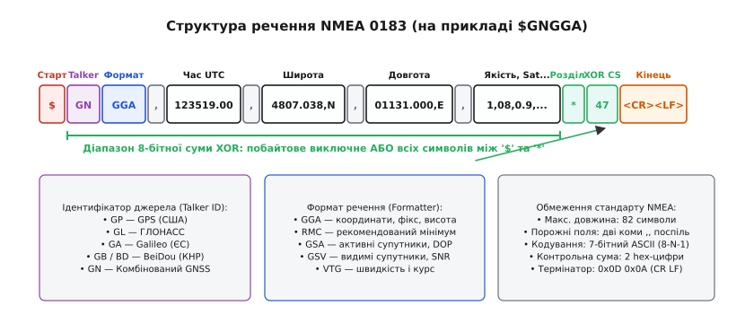
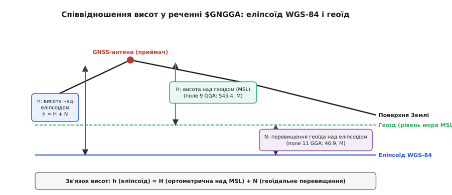
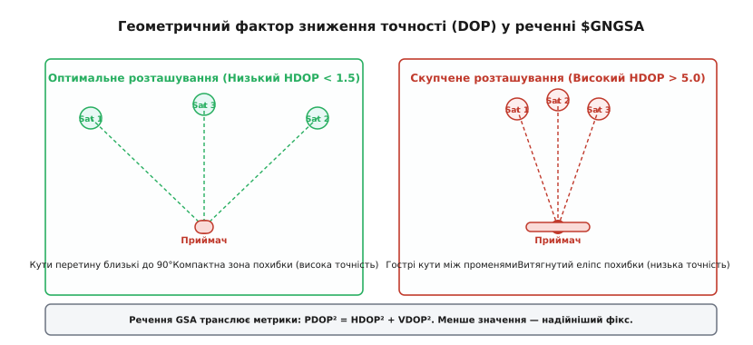
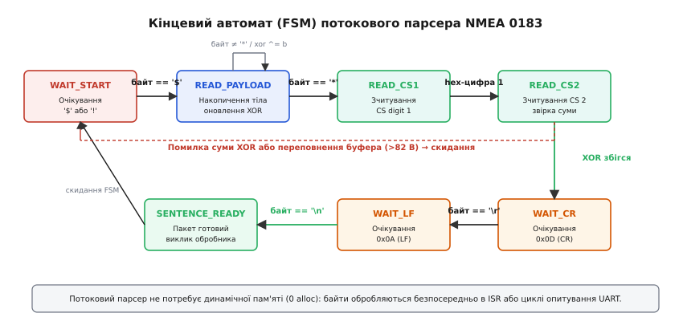

# NMEA 0183: речення супутникового приймача

<preknowlist>
- [UART](book:communications/uart) — асинхронний передавач/приймач, байти без прив'язки до меж повідомлень.
- [RS-422 і RS-485](book:communications/rs422-rs485) — фізичні рівні диференційного послідовного зв'язку.
- [Проєктування пакета](book:communications/packet-design) — межі, маркери та контроль цілості.
- [Системи координат і одиниці](book:communications/coordinate-frames-units) — еліпсоїд WGS-84, геоїд, висота над рівнем моря та курсові кути.
</preknowlist>

Коли навігаційний контролер безпілотного апарата або бортовий комп'ютер морського судна під'єднується до приймача супутникових сигналів GNSS по послідовній лінії UART, він отримує не готові бінарні вектори стану в пам'яті, а безперервний потік друкованих символів ASCII на швидкості від 4800 до 115200 бод. Якщо кожен виробник супутникових чипсетів — від Trimble та Motorola до Garmin і u-blox — формував би двійкові пакети за власною структурою вирівнювання полів, будь-яка заміна модуля супутникового зв'язку вимагала б повної перекомпіляції прошивки автопілота та написання нового низькорівневого драйвера. Щоб забезпечити повну сумісність навігаційного обладнання незалежно від виробника та версії кремнію, Національна асоціація морської електроніки США розробила промисловий стандарт **NMEA 0183**.

Протокол структурує потік навігаційних спостережень у текстові повідомлення — **речення** (англ. *sentences*), кожне з яких передає завершений набір параметрів: поточний час UTC, географічні координати, якість супутникового фіксу, число видимих супутників, просторове зниження точності (DOP) та вектор швидкості.

---

### Фізичний рівень і параметри каналу передачі

Стандарт NMEA 0183 спочатку проектувався для суднових умов з високим рівнем електромагнітних завад від суднових генераторів, тягових електродвигунів та потужних КХ/УКХ радіостанцій. Тому базовим фізичним рівнем стандарту було обрано інтерфейс **RS-422** (або струмову петлю в застарілих версіях).

Фізичний інтерфейс організовано за односпрямованою топологією «Один передавач — багато слухачів» (*Single Talker, Multiple Listeners*):
- **Лінія передавача (Talker)**: диференційний драйвер RS-422 формує протифазні сигнали на лініях `TX+` (лінія A) та `TX-` (лінія B). Логічна одиниця (*Mark*) відповідає від'ємній різниці потенціалів `U_A - U_B < -0.2 В`, а логічний нуль (*Space*) — додатній різниці `U_A - U_B > +0.2 В`.
- **Лінія приймача (Listener)**: диференційний приймач вимірює різницю потенціалів між проводами пари. Для захисту від різниці потенціалів між корпусами судна входи слухачів обов'язково оснащуються швидкісними оптронами з гальванічною розв'язкою напругою не менше 1.5 кВ. До одного передавача дозволяється підключати паралельно до чотирьох приймачів-слухачів без просідання напруги лінії.

У сучасній споживчій та авіаційній електроніці (польотні контролери дронів на базі STM32, трекери, плати Arduino та ESP32) диференційний трансивер RS-422 часто замінюють на звичайний несиметричний інтерфейс **UART** з логічними рівнями TTL / CMOS (напруга логічної одиниці 3.3 В або 5.0 В).

Параметри асинхронного послідовного кадру суворо стандартизовані:
- **Швидкість передачі (Baud rate)**: базовий стандарт NMEA 0183 визначає швидкість **4800 бод**. У сучасних мультисистемних GNSS-приймачах з високою частотою оновлення (5–20 Гц) швидкість підвищують до **9600**, **38400** або **115200 бод**.
- **Формат байта**: 8 бітів даних, без біта парності, 1 стоп-біт (**8-N-1**).
- **Кодування**: 7-бітний друкований набір символів ASCII (коди від `0x20` до `0x7E`).

#### Мультиплексування ліній NMEA (NMEA Multiplexer)

Оскільки шина NMEA 0183 є односпрямованою (один передавач на лінію), підключення декількох навігаційних датчиків (супутникового приймача, ехолота, компаса та вітровимірювача) до одного послідовного порту автопілота неможливе простим паралельним з'єднанням проводів — це призведе до електричного замикання виходів передавачів та взаємного накладання байтів.

Для об'єднання потоків використовують спеціалізовані мікроконтролерні пристрої — **NMEA-мультиплексори** (*NMEA Combiners*). Мультиплексор має від 2 до 8 ізольованих входів RS-422, приймає речення від кожного датчика у власні черги буферизації, перевіряє цілісність контрольних сум XOR і послідовно передає цілісні речення у вихідний порт автопілота на підвищеній швидкості (38400 або 115200 бод).

Із передумовами виникнення морської стандартизації, суперництвом навігаційних систем Loran-C, Transit і GPS та еволюцією версій стандарту можна ознайомитися в [історії появи стандарту NMEA 0183](book:communications/nmea-0183/hist-nmea-origin.md).

---

### Граматика та анатомія речення NMEA 0183

Кожне речення NMEA 0183 являє собою рядок друкованого тексту фіксованої структури, що починається спеціальним символом-маркером і завершується кодом кінця рядка:

```
$<TalkerID><SentenceFormatter>,<Поле 1>,<Поле 2>,...,<Поле N>*<Checksum><CR><LF>
```


*Анатомія речення NMEA 0183: стартовий маркер '$', джерело Talker ID, код формату Formatter, роздільники-коми, діапазон розрахунку суми XOR та термінатор рядка.*

Розгляньмо кожен структурний елемент кадру:

1. **Стартовий префікс (Start Delimiter)**:
   - Символ долара `$` (`0x24` у таблиці ASCII) відкриває стандартне параметричне речення.
   - Символ знака оклику `!` (`0x21`) позначає інкапсульоване речення з 6-бітним двійковим навантаженням (наприклад, повідомлення суднового транспондера AIS `!AIVDM`).
2. **Ідентифікатор джерела даних (Talker ID)**:
   - Дволітерний код, що вказує на навігаційну систему або тип датчика.
   - `GP` — супутникове сузір'я NAVSTAR GPS (США).
   - `GL` — сузір'я ГЛОНАСС (РФ).
   - `GA` — цивільне сузір'я Galileo (Європейський Союз).
   - `GB` або `BD` — сузір'я BeiDou (Китай).
   - `QZ` — регіональна система QZSS (Японія).
   - `GN` — комбінований розв'язок (*Global Navigation Satellite System*), обчислений одночасно за декількома сузір'ями (наприклад, GPS + GLONASS + Galileo).
   - Несупутникові префікси: `HC` (магнітний компас), `SD` (ехолот), `II` (інтегрований приладовий комплекс), `VW` (швидкісний лаг).
3. **Форматувач речення (Sentence Formatter)**:
   - Трилітерний код типу повідомлення: `GGA` (координати та фікс), `RMC` (рекомендований мінімум), `GSA` (DOP та активні канали), `GSV` (супутники в зоні видимості), `VTG` (вектор швидкості та курсу), `ZDA` (час і дата), `GLL` (географічна позиція), `DTM` (відліковий геодезичний еліпсоїд / Datum).
4. **Роздільник полів (Field Delimiter)**:
   - Символ коми `,` (`0x2C`). Усі параметри всередині речення відокремлюються комами.
   - **Правило пропущених полів**: якщо приймач не може виміряти певний параметр (наприклад, відсутні диференційні поправки DGPS або не під'єднано магнітний компас), поле залишається абсолютно порожнім. У тексті це відображається двома комами поспіль `,,`. Порядок і кількість ком у реченні залишаються незмінними.
5. **Роздільник контрольної суми (Checksum Delimiter)**:
   - Символ зірочки `*` (`0x2A`). Він однозначно позначає завершення інформаційних полів даних та початок контрольної суми.
6. **Контрольна сума (Checksum)**:
   - Дві шістнадцяткові цифри у верхньому регістрі (`00`–`FF`), що представляють 8-бітну суму XOR.
7. **Термінатор кадру (End of Sentence)**:
   - Послідовність двох байтів керування: повернення каретки `<CR>` (`0x0D`, `\r`) та переведення рядка `<LF>` (`0x0A`, `\n`).

Повний перелік ідентифікаторів Talker ID, кодів систем та індикаторів режимів наведено у [специфікації полів і статусних кодів речень NMEA 0183](book:communications/nmea-0183/api-nmea-sentences.md).

#### Обмеження максимальної довжини кадру

Стандарт NMEA 0183 накладає жорстке обмеження: повна довжина будь-якого речення від початкового символу `$` до фінального байта `\n` включно **не повинна перевищувати 82 символи**.

Це обмеження обумовлене апаратною архітектурою ранніх 8-бітних мікроконтролерів (Intel 8051, Zilog Z80, Motorola 68HC11): лінійний буфер прийому гарантовано виділявся у статичній пам'яті фіксованим масивом на 84 байти, виключаючи динамічне виділення пам'яті (`malloc`) та фрагментацію ОЗП під час тривалої роботи.

---

### Математичний механізм контрольної суми XOR

Для перевірки цілісності інформаційних полів у стандарті NMEA 0183 використовується порозрядне виключне АБО (операція XOR, математичний символ `⊕`, побітовий оператор `^` у мовах C/C++).

Контрольна сума обчислюється для всіх символів ASCII, розташованих **між префіксом `$` (або `!`) та роздільником `*`**. Самі символи `$`, `*`, а також кінцеві `<CR><LF>` до розрахунку суми не включаються:

```
Контрольна_Сума = Байта[1] ⊕ Байта[2] ⊕ ... ⊕ Байта[k]
```

Операція XOR володіє фундаментальними алгебраїчними властивостями групи в полі Галуа `GF(2)`:
1. **Комутативність**: `a ⊕ b = b ⊕ a`
2. **Асоціативність**: `(a ⊕ b) ⊕ c = a ⊕ (b ⊕ c)`
3. **Нейтральний елемент**: `a ⊕ 0 = a`
4. **Самооберненість (самоанулювання)**: `a ⊕ a = 0`

#### Покроковий числовий приклад розрахунку

Розгляньмо коротке тестове речення: `$GNTXT,01,01,01,ANT_OK*44\r\n`.

Діапазон обчислення містить символи: `G`, `N`, `T`, `X`, `T`, `,`, `0`, `1`, `,`, `0`, `1`, `,`, `0`, `1`, `,`, `A`, `N`, `T`, `_`, `O`, `K`.

Простежмо зміну акумулятора суми в шістнадцятковому та двійковому представленні:

```
Символ 'G' (0x47 = 01000111_2) -> Сума = 0x47
Символ 'N' (0x4E = 01001110_2) -> 0x47 ⊕ 0x4E = 0x09 (00001001_2)
Символ 'T' (0x54 = 01010100_2) -> 0x09 ⊕ 0x54 = 0x5D (01011101_2)
Символ 'X' (0x58 = 01011000_2) -> 0x5D ⊕ 0x58 = 0x05 (00000101_2)
...
Фінальний результат XOR по всіх 21 символах = 0x44 (01000100_2)
```

Значення `0x44` записується після зірочки двома символами ASCII: `*44`.

#### Здатність виявлення помилок та обмеження XOR

8-бітна сума XOR володіє чіткими математичними межами виявлення завад у каналі зв'язку:
- **Поодинокі бітові помилки**: операція XOR гарантовано виявляє **будь-яку непарну кількість інверсій бітів** у довільному стовпчику бітової матриці повідомлення. Якщо завада спотворила рівно 1 біт у будь-якому символі, відповідний біт у сумі `calc_crc` обов'язково зміниться, і сума не зійдеться з `rx_crc`.
- **Подвійні симетричні помилки (сліпа зона)**: якщо завада змінює парну кількість бітів в одній і тій самій бітовій позиції двох різних байтів (наприклад, третій біт інвертувався в символі `'G'` і водночас у символі `'T'`), подвійна інверсія `1 ⊕ 1 = 0` повністю компенсується, і контрольна сума залишається незмінною.

Саме тому сучасніші бінарні протоколи телеметрії (MAVLink, CAN, Ethernet) використовують поліноміальні циклічні надлишкові коди CRC-16 або CRC-32. Проте для низькошвидкісних ліній NMEA 0183 обчислення XOR було ідеальним компромісом: воно виконується за 1 такт процесора на байт і не вимагає таблиць констант у пам'яті програм.

---

### Детальний розбір ключових речень GNSS

Супутниковий приймач щосекунди надсилає групу (пакет) речень, які доповнюють одне одного, транслюючи просторові координати, якісні оцінки та службовий стан сузір'їв.

```
┌─────────────────────────────────────────────────────────────────────────────┐
│                       НАВІГАЦІЙНИЙ ПАКЕТ ПРИЙМАЧА                           │
├─────────────────────────────────────────────────────────────────────────────┤
│ $GNGGA ──> Час UTC, координати, якість фіксу, висота над геоїдом, HDOP      │
│ $GNRMC ──> Швидкість над ґрунтом (SOG), істинний курс (COG), дата, статус   │
│ $GNGSA ──> Розмірність фіксу (2D/3D), активні PRN супутників, PDOP, VDOP    │
│ $GPGSV ──> Видимі супутники GPS: елевація, азимут, рівень сигналу C/N0      │
│ $GLGSV ──> Видимі супутники ГЛОНАСС                                         │
│ $GNVTG ──> Вектор швидкості у вузлах та км/год відносно істинного меридіана │
│ $GNZDA ──> Повна дата та зміщення місцевого часового поясу                  │
│ $GNGLL ──> Компактна географічна позиція (широта, довгота, час UTC)         │
└─────────────────────────────────────────────────────────────────────────────┘
```

#### 1. Речення $xxGGA (Global Positioning System Fix Data)

Речення GGA є основним джерелом тривимірних просторових координат і статусу приймача:

```
$GNGGA,123519.00,4807.0382,N,01131.0000,E,1,08,0.9,545.4,M,46.9,M,1.2,0042*75
```

- `123519.00`: час взяття навігаційного відліку за UTC — 12 годин, 35 хвилин, 19.00 секунд.
- `4807.0382,N`: географічна широта — 48°07.0382' північної широти.
- `01131.0000,E`: географічна довгота — 11°31.0000' східної довготи (три цифри в розряді градусів обов'язкові!).
- `1`: якість супутникового фіксу (**Fix Quality**):
  - `0` — фікс відсутній (*Invalid / No Fix*);
  - `1` — стандартний автономний GPS фікс (точність 2–5 м);
  - `2` — диференційний GPS фікс DGPS / SBAS (точність 0.5–1.5 м);
  - `4` — RTK з фіксованим фазовим розв'язком (*RTK Fixed*, точність 1–2 см);
  - `5` — RTK з плаваючим розв'язком (*RTK Float*, точність 10–50 см);
  - `6` — інерційна екстраполяція (*Dead Reckoning*).
- `08`: кількість супутників, що беруть участь у розрахунку позиції.
- `0.9`: горизонтальний фактор зниження точності HDOP.
- `545.4,M`: ортометрична висота антени над середнім рівнем моря MSL (висота над геоїдом) у метрах.
- `46.9,M`: геоїдальна розбіжність (перевищення геоїда над еліпсоїдом WGS-84) у метрах.
- `1.2`: вік диференційних поправок DGPS/RTK у секундах (для автономного режиму поле порожнє `,,`).
- `0042`: ідентифікатор опорної базової станції.


*Різниця між ортометричною висотою над геоїдом H (рівень моря) та еліпсоїдною висотою h (WGS-84). Речення GGA передає висоту над геоїдом та геоїдальне перевищення N.*

#### Математика геоїдального перевищення

Супутникові приймачі безпосередньо вимірюють геометричну висоту над гладким відліковим еліпсоїдом WGS-84 (`h`). Проте вода в річках та морях тече вздовж гравітаційної еквіпотенціальної поверхні — **геоїда** (рівня моря MSL).

Ортометрична висота над рівнем моря `H` пов'язана з еліпсоїдною висотою `h` та геоїдальним перевищенням `N` формулою:

```
h = H + N
H = h - N
```

У наведеному прикладі `$GNGGA` висота над рівнем моря становить `H = 545.4 м`, а геоїдальне перевищення `N = 46.9 м`. Отже, висота антени над геометричним еліпсоїдом WGS-84 дорівнює:

```
h = 545.4 + 46.9 = 592.3 м
```

#### 2. Речення $xxRMC (Recommended Minimum Specific GNSS Data)

Речення RMC є обов'язковим мінімумом навігаційних даних для автопілотів і картографічних систем:

```
$GNRMC,123519.00,A,4807.0382,N,01131.0000,E,022.4,084.4,230324,003.1,W,A,S*1D
```

- `123519.00`: час UTC.
- `A`: статус достовірності навігаційних даних. `A` (*Active*) — координати валідні; `V` (*Void*) — недостовірні (приймач шукає супутники, автопілот має ігнорувати координати).
- `4807.0382,N`, `01131.0000,E`: широта та довгота.
- `022.4`: швидкість над ґрунтом SOG (*Speed Over Ground*) у **морських вузлах** (1 вузол = 1.852 км/год = 0.5144 м/с). Швидкість `22.4 вузла` відповідає `22.4 · 0.514444 = 11.52 м/с` або `41.48 км/год`.
- `084.4`: істинний шляховий кут курсу COG (*Course Over Ground*) у градусах від 000.0° до 359.9°.
- `230324`: календарна дата за UTC — 23 березня 2024 року (`ddmmyy`).
- `003.1,W`: магнітне схилення — 3.1° західне.
- `A`: індикатор режиму позиціювання FAA (`A` — автономний, `D` — диференційний, `E` — екстраполяція, `N` — недійсний).
- `S`: навігаційний статус безпеки NMEA 4.10+ (`S` — Safe, `C` — Caution, `U` — Unsafe, `V` — Navigational status not valid).

#### 3. Речення $xxGSA (GNSS DOP and Active Satellites)

Речення GSA транслює геометричні фактори зниження точності та перелік активних супутників:

```
$GNGSA,A,3,04,05,09,12,24,28,32,,,,,,1.8,1.0,1.5,1*1E
```

- `A`: режим перемикання розмірності (`M` — примусовий ручний; `A` — автоматичний 2D/3D).
- `3`: розмірність фіксу (`1` — немає фіксу; `2` — 2D-фікс по 3 супутниках; `3` — повноцінний 3D-фікс по 4+ супутниках).
- `04,05,09,12,24,28,32,,,,,,`: 12 фіксованих слотів для номерів PRN супутників. Невикористані канали лишаються порожніми.
- `1.8`: просторовий фактор зниження точності PDOP (*Position Dilution of Precision*).
- `1.0`: горизонтальний фактор зниження точності HDOP (*Horizontal Dilution of Precision*).
- `1.5`: вертикальний фактор зниження точності VDOP (*Vertical Dilution of Precision*).
- `1`: ідентифікатор сузір'я System ID стандарту NMEA 4.10+ (1 = GPS, 2 = GLONASS, 3 = Galileo, 4 = BeiDou).


*Вплив геометричного розташування супутників на розмір еліпса похибки позиціювання: широкий рознос променів забезпечує низький HDOP, а скупчене сузір'я різко погіршує точність.*

#### Геометрія сузір'я та матрична природа DOP

Фактор DOP показує, у скільки разів похибка обчислення просторових координат перевищує власну похибку вимірювання псевдовіддалей до супутників:

```
Похибка_Позиції = DOP · Похибка_Псевдовіддалі
```

Якщо матриця напрямних косинусів одиничних векторів на видимі супутники позначається як `A`, коваріаційна матриця оцінки координат обчислюється як:

```
Q = (Aᵀ · A)⁻¹
```

Діагональні елементи матриці `Q` (`q_xx`, `q_yy`, `q_zz`, `q_tt`) визначають фактори точності:

```
HDOP = √(q_xx + q_yy)      [горизонтальна похибка широти та довготи]
VDOP = √(q_zz)             [вертикальна похибка висоти]
PDOP = √(HDOP² + VDOP²)    [просторова тривимірна похибка]
TDOP = √(q_tt)             [похибка синхронізації годинника]
GDOP = √(PDOP² + TDOP²)    [повний геометричний фактор]
```

Коли супутники рівномірно розподілені по небосхилу (один у зеніті, решта — біля горизонту під кутами 120°), кути перетину променів близькі до 90°, матриця `Aᵀ · A` добре обумовлена, а значення `HDOP` становить менше 1.2. Якщо всі видимі супутники згруповані в одному вузькому секторі, визначник матриці прямує до нуля, промені майже паралельні, а `HDOP` перевищує 5.0, що призводить до роздування просторового еліпса похибки.

#### 4. Речення $xxGSV (GNSS Satellites in View)

Речення GSV описує просторове положення та потужність сигналу кожного супутника в зоні видимості:

```
$GPGSV,3,1,11,03,03,111,00,04,15,270,36,06,01,010,00,13,06,292,38,1*74
```

Оскільки в один рядок вміщується інформація максимум про 4 супутники, блок розбивається на послідовність речень:
- `3`: загальна кількість речень GSV у поточному блоці (від 1 до 9).
- `1`: порядковий номер поточного речення (1 з 3).
- `11`: загальна кількість видимих супутників сузір'я GPS.
- Блоки параметрів супутників (четвірки значень):
  - Супутник 1: PRN = `03`, кут елевації = `03°` (над горизонтом), азимут = `111°`, сигнал/шум SNR = `00` dB-Hz (сигнал не захоплено).
  - Супутник 2: PRN = `04`, кут елевації = `15°`, азимут = `270°`, SNR = `36` dB-Hz (стабільний прийом).
  - Супутник 3: PRN = `06`, елевація = `01°`, азимут = `010°`, SNR = `00` dB-Hz.
  - Супутник 4: PRN = `13`, елевація = `06°`, азимут = `292°`, SNR = `38` dB-Hz.
- `1`: ідентифікатор сигналу Signal ID стандарту NMEA 4.10+ (1 = L1 C/A, 2 = L2 CL, 5 = L5).

#### Рівні сигналу C/N0 та фільтрація завад

Поле SNR у реченні GSV відображає відношення потужності несучої частоти до спектральної густини шуму (*Carrier-to-Noise density ratio*, C/N0), виражене в дБ-Гц (dB-Hz):
- **C/N0 > 40 dB-Hz**: ідеальний сигнал прямої видимості без перешкод.
- **30–40 dB-Hz**: стабільний прийом, типовий для відкритих польових умов.
- **20–30 dB-Hz**: суттєве загасання сигналу (листя дерев, міська забудова, наближення до радіогоризонту).
- **C/N0 < 20 dB-Hz або 00**: сигнал супроводжується на межі зриву або спотворений багатопроменевим перевідбиттям (*Multipath*).

Польотні контролери безпілотників використовують поріг C/N0 (зазвичай 28–32 dB-Hz) для відсікання ненадійних супутників під час формування навігаційного розв'язку.

#### 5. Речення $xxVTG (Course Over Ground and Ground Speed)

Речення VTG транслює вектор швидкості в декількох альтернативних одиницях:

```
$GNVTG,084.4,T,087.5,M,022.4,N,041.5,K,A*23
```

- `084.4,T`: істинний курс у градусах відносно географічної півночі (`T` = True).
- `087.5,M`: магнітний курс у градусах відносно магнітної півночі (`M` = Magnetic).
- `022.4,N`: швидкість у морських вузлах (`N` = Knots).
- `041.5,K`: швидкість у кілометрах за годину (`K` = Kilometers per hour).
- `A`: індикатор режиму FAA.

#### 6. Речення $xxZDA (Time and Date)

Речення ZDA транслює точний атомний час із зазначенням чотиризначного року та зміщення місцевого поясу:

```
$GNZDA,123519.00,23,03,2024,02,00*7D
```

- `123519.00`: час UTC (`hhmmss.ss`).
- `23,03,2024`: день (23), місяць (03), повний 4-значний рік (2024).
- `02,00`: зміщення місцевого часового поясу (+02 години, 00 хвилин).

#### 7. Речення $xxGLL (Geographic Position - Latitude/Longitude)

Речення GLL є компактним повідомленням для передачі координат та часу для приладів з обмеженою пропускною здатністю каналу:

```
$GNGLL,4807.0382,N,01131.0000,E,123519.00,A,A*7B
```

- `4807.0382,N` та `01131.0000,E`: координати широти та довготи.
- `123519.00`: час взяття відліку за UTC.
- `A`: статус валідності даних (`A` — Active, `V` — Void).
- `A`: індикатор режиму FAA.

---

### Геодезичні системи відліку (Datum) та еліпсоїд WGS-84

За замовчуванням усі сучасні супутникові приймачі видають координати в міжнародній загальноземній системі координат **WGS-84** (*World Geodetic System 1984*, ідентифікатор EPSG:4326).

Проте різні навігаційні системи використовують власні орбітальні моделі еліпсоїдів:
- GPS базується на еліпсоїді WGS-84;
- ГЛОНАСС використовує відлікову систему ПЗ-90 (Параметри Землі 1990 року);
- BeiDou спирається на китайську систему CGCS2000;
- Galileo використовує систему GTRF (*Galileo Terrestrial Reference Frame*), сумісну з ITRF.

Мультисистемний GNSS-чипсет виконує внутрішнє математичне перетворення (трансформацію Гельмерта за 7 параметрами) векторів усіх супутників у єдину систему координат WGS-84 перед формуванням речень NMEA 0183.

Якщо приймач налаштовано на роботу в локальній картографічній системі (наприклад, європейській ED50 або північноамериканській NAD83), він додатково транслює речення **`$xxDTM`** (*Datum Reference*):

```
$GNDTM,W84,,0.0,N,0.0,E,0.0,W84*52
```

де код `W84` позначає базовий еліпсоїд WGS-84, а числові поля вказують лінійні зсуви широти, довготи та висоти в метрах відносно локального датума карти.

---

### Перетворення координат у десяткові градуси

Формат координат NMEA `ddmm.mmmm` (градуси та мінути) є спадщиною морської навігації, де 1 мінута широти на меридіані точно відповідає **1 морській милі** (1852 метри).

Проте цифрові карти, алгоритми автопілотів та бібліотеки геодезичних перетворень вимагають представлення координат у десяткових градусах (*Decimal Degrees*, `DD.dddddd`):

```
Градуси_Десяткові = Градуси_Цілі + (Мінути / 60.0)
```

Врахування знаків півкуль:
- Для широти: якщо півкуля `'N'` (Північна) — знак `+`; якщо `'S'` (Південна) — знак `−`.
- Для довготи: якщо півкуля `'E'` (Східна) — знак `+`; якщо `'W'` (Західна) — знак `−`.

**Покроковий приклад перетворення:**
Нехай із речення GGA отримано значення `4807.0382,N` та `01131.0000,E`:

```
Широта:
Градуси = 48
Мінути  = 07.0382
Десяткова_Широта = 48 + (7.0382 / 60.0) = 48 + 0.11730333 = +48.1173033°

Довгота:
Градуси = 011 = 11
Мінути  = 31.0000
Десяткова_Довгота = 11 + (31.0000 / 60.0) = 11 + 0.51666667 = +11.5166667°
```

---

### Скінченний автомат потокового парсера (FSM)

Потоковий прийом символів NMEA 0183 через UART вимагає архітектури скінченного автомата (*Finite State Machine, FSM*), яка обробляє кожен байт у момент його надходження без виділення динамічної пам'яті:


*Логіка переходів скінченного автомата потокового декодера: накопичення корисного навантаження, побайтовий розрахунок суми XOR та скидання при помилках кадрування.*

Автомат містить шість робочих станів:
1. `WAIT_START`: скидання буфера та очікування байта `$` або `!`. Усі інші байти ігноруються як шум лінії.
2. `READ_PAYLOAD`: запис байтів тіла повідомлення в статичний масив та побайтове оновлення акумулятора `calc_crc ^= byte`. При зустрічі `*` рядок нуль-термінується.
3. `READ_CS1`: зчитування першої шістнадцяткової цифри контрольної суми.
4. `READ_CS2`: зчитування другої цифри та порівняння прийнятого значення `rx_crc` із розрахованим `calc_crc`. При розбіжності пакет відкидається.
5. `WAIT_CR`: перевірка байта повернення каретки `\r`.
6. `WAIT_LF`: перевірка байта переведення рядка `\n` та передача валідного рядка семантичному парсеру.

Повну реалізацію потокового парсера з обробкою переривань, кільцевими буферами та безалокаційним парсингом токенів наведено у [проєкті потокового парсера NMEA 0183 на C та C++](book:communications/nmea-0183/proj-nmea-parser.md).

Нижче наведено базовий фрагмент FSM-обробника потоку:

:::tabs
```c
#include <stdint.h>
#include <stdbool.h>

typedef enum {
    FSM_WAIT_START,
    FSM_READ_PAYLOAD,
    FSM_READ_CS1,
    FSM_READ_CS2,
    FSM_WAIT_CR,
    FSM_WAIT_LF
} nmea_state_t;

typedef struct {
    nmea_state_t state;
    char buffer[84];
    uint8_t idx;
    uint8_t calc_crc;
    uint8_t rx_crc;
} nmea_fsm_t;

static inline int hex_val(char c) {
    if (c >= '0' && c <= '9') return c - '0';
    if (c >= 'A' && c <= 'F') return c - 'A' + 10;
    return -1;
}

bool nmea_fsm_feed(nmea_fsm_t *fsm, uint8_t byte) {
    if (byte == '$' || byte == '!') {
        fsm->state = FSM_READ_PAYLOAD;
        fsm->idx = 0;
        fsm->calc_crc = 0;
        return false;
    }
    switch (fsm->state) {
        case FSM_WAIT_START: return false;
        case FSM_READ_PAYLOAD:
            if (byte == '*') {
                fsm->buffer[fsm->idx] = '\0';
                fsm->state = FSM_READ_CS1;
            } else if (fsm->idx < 80) {
                fsm->buffer[fsm->idx++] = (char)byte;
                fsm->calc_crc ^= byte;
            } else {
                fsm->state = FSM_WAIT_START;
            }
            return false;
        case FSM_READ_CS1: {
            int v = hex_val((char)byte);
            if (v >= 0) { fsm->rx_crc = (uint8_t)(v << 4); fsm->state = FSM_READ_CS2; }
            else { fsm->state = FSM_WAIT_START; }
            return false;
        }
        case FSM_READ_CS2: {
            int v = hex_val((char)byte);
            if (v >= 0) {
                fsm->rx_crc |= (uint8_t)v;
                fsm->state = (fsm->rx_crc == fsm->calc_crc) ? FSM_WAIT_CR : FSM_WAIT_START;
            } else { fsm->state = FSM_WAIT_START; }
            return false;
        }
        case FSM_WAIT_CR:
            if (byte == '\r') fsm->state = FSM_WAIT_LF;
            else fsm->state = FSM_WAIT_START;
            return false;
        case FSM_WAIT_LF:
            fsm->state = FSM_WAIT_START;
            return (byte == '\n');
    }
    return false;
}
```
```cpp
#include <cstdint>
#include <string_view>
#include <optional>
#include <array>

class NmeaFsm {
public:
    enum class State {
        WaitStart,
        ReadPayload,
        ReadCs1,
        ReadCs2,
        WaitCr,
        WaitLf
    };

    std::optional<std::string_view> feed(uint8_t byte) noexcept {
        if (byte == '$' || byte == '!') {
            state_ = State::ReadPayload;
            idx_ = 0;
            calc_crc_ = 0;
            return std::nullopt;
        }

        switch (state_) {
            case State::WaitStart:
                return std::nullopt;

            case State::ReadPayload:
                if (byte == '*') {
                    buffer_[idx_] = '\0';
                    state_ = State::ReadCs1;
                } else if (idx_ < buffer_.size() - 4) {
                    buffer_[idx_++] = static_cast<char>(byte);
                    calc_crc_ ^= byte;
                } else {
                    state_ = State::WaitStart;
                }
                return std::nullopt;

            case State::ReadCs1: {
                int v = hexVal(static_cast<char>(byte));
                if (v >= 0) {
                    rx_crc_ = static_cast<uint8_t>(v << 4);
                    state_ = State::ReadCs2;
                } else {
                    state_ = State::WaitStart;
                }
                return std::nullopt;
            }

            case State::ReadCs2: {
                int v = hexVal(static_cast<char>(byte));
                if (v >= 0) {
                    rx_crc_ |= static_cast<uint8_t>(v);
                    state_ = (rx_crc_ == calc_crc_) ? State::WaitCr : State::WaitStart;
                } else {
                    state_ = State::WaitStart;
                }
                return std::nullopt;
            }

            case State::WaitCr:
                state_ = (byte == '\r') ? State::WaitLf : State::WaitStart;
                return std::nullopt;

            case State::WaitLf:
                state_ = State::WaitStart;
                if (byte == '\n') {
                    return std::string_view(buffer_.data(), idx_);
                }
                return std::nullopt;
        }
        return std::nullopt;
    }

private:
    static constexpr int hexVal(char c) noexcept {
        if (c >= '0' && c <= '9') return c - '0';
        if (c >= 'A' && c <= 'F') return c - 'A' + 10;
        return -1;
    }

    State state_{State::WaitStart};
    std::array<char, 84> buffer_{};
    size_t idx_{0};
    uint8_t calc_crc_{0};
    uint8_t rx_crc_{0};
};
```
:::

---

### Обмеження пропускної здатності та баланс частоти видачі

При проектуванні вбудованих навігаційних систем інженер стикається з фізичним обмеженням швидкості передачі символів NMEA 0183:

Розрахуємо сумарний розмір навігаційного повідомлення для типового мультисистемного приймача:
- `$GNGGA`: ~75 байтів;
- `$GNRMC`: ~70 байтів;
- `$GNGSA` (2 речення: GPS та ГЛОНАСС): `2 · 55 = 110` байтів;
- `$GPGSV` (3 речення) + `$GLGSV` (2 речення): `5 · 65 = 325` байтів;
- `$GNVTG`: ~40 байтів.

Сумарний обсяг одного навігаційного оновлення становить приблизно **620 байтів**.

При стандартній швидкості 4800 бод (кожен байт займає 10 бітових інтервалів: 1 старт, 8 даних, 1 стоп) лінія здатна пропустити максимум:

```
Пропускна_Здатність = 4800 / 10 = 480 байт/с
Час_Передачі = 620 байтів / 480 байт/с ≈ 1.29 секунди
```

При 4800 бод фізично неможливо передавати повний пакет речень навіть із частотою 1 Гц: буфер передавача переповнюється, що призводить до втрати речень або затримок доставки навігаційного розв'язку.

Тому для сучасних високочастотних навігаційних систем діють такі правила конфігурації:
1. Для частоти оновлення **1 Гц** швидкість порту повинна бути не менше **9600 бод** (або відключаються непотрібні речення GSV/VTG).
2. Для частоти оновлення **5 Гц** швидкість порту підвищують щонайменше до **38400 бод**.
3. Для високодинамічних польотних контролерів з частотою оновлення **10–20 Гц** швидкість встановлюється на рівні **115200 бод** або здійснюється перехід на двійковий пропрієтарний протокол (наприклад, u-blox UBX-NAV-PVT, де вектор стану передається одним компактним бінарним кадром довжиною 92 байти).

---

### Пропрієтарні речення виробників (Proprietary Sentences)

Стандарт NMEA 0183 передбачає можливість передачі виробничо-специфічних команд конфігурації та діагностики за допомогою **пропрієтарного префікса `$P`**:

```
$P<MID><Data>*<Checksum><CR><LF>
```

- Префікс `$P` сигналізує, що форматувач підпорядковується внутрішній специфікації компанії.
- `MID` (*Manufacturer ID*) — трилітерний код компанії, зареєстрований комітетом NMEA:
  - `MTK` — MediaTek (наприклад, `$PMTK251,115200*1F` для зміни швидкості UART);
  - `UBX` — u-blox (наприклад, `$PUBX,40,GGA,0,1,0,0,0,0*5B` для налаштування частоти речення GGA);
  - `GRM` — Garmin (наприклад, `$PGRME` для оцінки кругової похибки EPE);
  - `SRF` — SiRF Technology (наприклад, `$PSRF103` для вмикання окремих речень);
  - `RMC` або `ASH` — Ashtech / Trimble.

Пропрієтарні речення зберігають загальні правила кадрування (роздільники-коми, діапазон розрахунку суми XOR та термінатор `\r\n`), що дозволяє стандартному потоковому парсеру FSM пропускати або перенаправляти невідомі команди конфігурації без аварійного збою.

---

### Аномалії датування: стрибки секунд і переповнення тижнів GPS

У процесі практичної обробки часу в реченнях RMC та ZDA програмне забезпечення стикається з двома астрономічно-технічними феноменами:

1. **Високосні секунди (Leap Seconds)**: атомна шкала часу супутників GPS (GPST) є безперервною і не містить стрибків. Цивільна шкала UTC періодично коригується додаванням секунд для компенсації уповільнення обертання Землі (на 2024–2026 роки різниця між часом GPS та UTC становить рівно 18 секунд). У момент введення поправки супутниковий приймач транслює в NMEA час `23:59:60.00` або дублює секунду `00:00:00`. Програмний таймстемпер зобов'язаний коректно парсити значення секунди `60`, не сприймаючи його як синтаксичну помилку.
2. **Переповнення номера тижня GPS (WNRO — Week Number Rollover)**: у навігаційному повідомленні супутників GPS номер тижня кодується 10-бітним числом (діапазон 0–1023 тижні, що становить приблизно 19.6 року). Коли лічильник досягає 1024, він обнуляється. Застарілі приймачі без оновлення мікрокоду після роловеру транслюють дату 20-річної давнини у реченні RMC. Сучасні парсери використовують ковзне вікно датування на рівні прошивки для захисту від збоїв календаря.

---

### Порівняння з бінарними протоколами та NMEA 2000

Попри домінування NMEA 0183, сучасні високодинамічні системи доповнюють або замінюють його бінарними стандартами:

| Характеристика | NMEA 0183 | u-blox UBX / SiRF Binary | NMEA 2000 (CAN Bus) |
| :--- | :--- | :--- | :--- |
| **Формат даних** | Друкований текст ASCII | Двійкові структури (Little-Endian) | Двійкові пакети PGN (SAE J1939) |
| **Фізичний рівень** | RS-422 / UART (точка-точка) | UART / SPI / I2C / USB | Диференційна шина CAN (250 кбіт/с) |
| **Контроль цілості**| 8-бітний XOR | 16-бітний алгоритм Флетчера | 15-бітний CRC апаратного рівня CAN |
| **Оверхед кодування**| Високий (координати займають ~20 байтів тексту) | Мінімальний (координати — 8 байтів `int32`) | Мінімальний (компактні бінарні PGN) |
| **Налагодження** | Не потребує спецзасобів (простий термінал) | Потребує парсера або фірмового ПЗ | Потребує CAN-аналізатора та бази сигналів |
| **Частота видачі** | 1–10 Гц (обмежена пропускною здатністю) | 10–50 Гц | 10–20 Гц на багатоабонентській шині |

> 🔧 **Навіщо це.**
> У польотних контролерах безпілотних літальних апаратів (ArduPilot, PX4, Betaflight) парсер NMEA 0183 слугує універсальним резервним каналом входу супутникових даних. Якщо чипсет приймача не розпізнається бінарним драйвером або на борту встановлено навігаційний модуль стороннього виробника, польотний контролер автоматично перемикається на універсальний NMEA-парсер, витягуючи час UTC із речення RMC для синхронізації логів, якість фіксу та координати з GGA для навігаційного фільтра EKF, а значення HDOP та перелік активних супутників із речення GSA для перевірки безпеки зльоту (Arming Checks).
