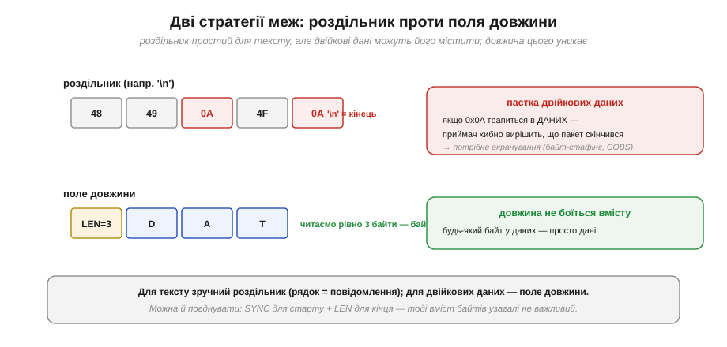
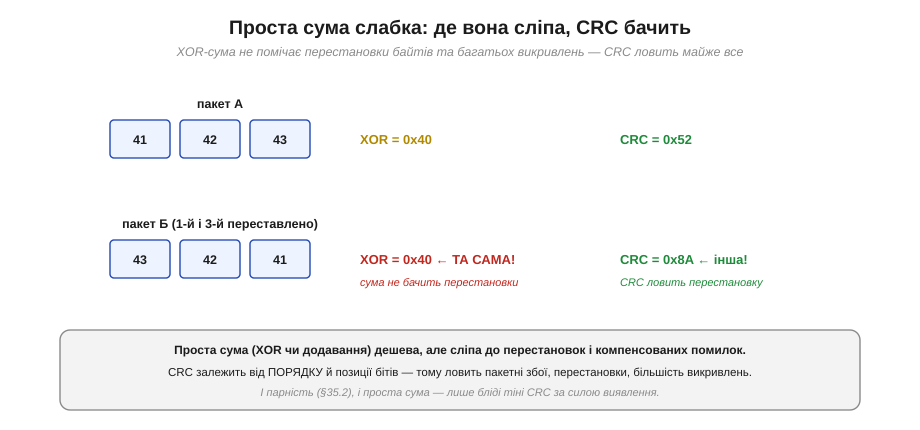
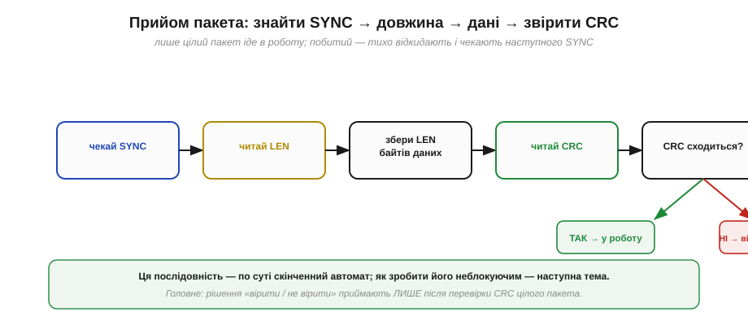

# Проєктування пакета: заголовок, довжина, CRC

UART дає нам надійну «трубу» для байтів — і на цьому його обов'язки закінчуються. Він не знає, де в потоці починається одне повідомлення й закінчується інше, не знає, чи всі байти прибули цілими. Уся ця **структура** — справа рівня вище, який ми будуємо самі: **протокол пакета**. Хороша новина — будувати його просто, і та сама нехитра конструкція (позначка старту, довжина, контрольна сума) лежить в основі практично всіх реальних послідовних протоколів, від простих саморобних до телеметрії дронів. Розберімо її по цеглинці.

### Сирий потік не має меж

Почнімо з проблеми. Уявімо, що приймач отримав низку байтів. Де тут повідомлення?


*Рис. Суцільний потік байтів сам по собі не каже, де початок повідомлення, де кінець і чи нічого не загубилося. Той самий набір байтів можна «нарізати» на повідомлення кількома способами — і всі вони для UART однаково правомірні.*

Сам по собі потік **неоднозначний**: однакові байти можна згрупувати по-різному, і UART не підкаже, який поділ правильний. Гірше: якщо один байт загубився ([overrun](book:communications/flow-control)) чи спотворився, усе подальше «з'їде». Тому над сирим потоком ми накладаємо **рамку** — структуру, що чітко каже: ось тут пакет починається, стільки в ньому даних, ось так перевірити, що він цілий.

### Анатомія пакета

Класична, перевірена десятиліттями структура пакета складається з чотирьох частин: **позначки старту**, **довжини**, **корисних даних** і **контрольної суми**.


*Рис. Типовий пакет: **SYNC** (стала позначка початку), **LEN** (скільки байтів даних далі), необов'язковий **ID/TYPE** (що це за повідомлення), самі **дані** і **CRC** (контроль цілості). CRC рахують по всьому, крім SYNC, — від довжини до останнього байта даних.*

Розгляньмо кожне поле й **навіщо** воно. **SYNC** — одна чи дві сталі (наприклад, 0xAA) на самому початку: за ними приймач упізнає, що пакет почався. **LEN** — поле довжини: каже, скільки байтів даних іде далі, тож приймач **знає, де пакет закінчиться**. Часто додають **ID** або **TYPE** — байт-тип повідомлення (це команда? телеметрія? підтвердження?). Далі — власне **дані** (*payload*). І наприкінці — **CRC**, контрольна сума, за якою приймач переконається, що пакет дійшов неушкодженим. Жодного «обов'язкового стандарту» тут немає — структуру визначаєш ти сам; важливо лише, щоб **обидві сторони** розуміли її однаково.

### Дві стратегії меж: роздільник чи довжина

Як саме позначити, **де пакет закінчується**? Є два підходи, і вибір між ними принциповий.


*Рис. Ліворуч-угорі: **роздільник** — спеціальний байт (як `\n` у тексті) позначає кінець. Просто, але якщо такий байт трапиться **в даних**, приймач хибно «закриє» пакет. Ліворуч-унизу: **поле довжини** — приймач читає рівно LEN байтів, і вміст йому байдужий; жодних колізій.*

Перший спосіб — **роздільник** (*delimiter*): домовляємося, що повідомлення закінчується певним байтом, як рядок тексту закінчується символом нового рядка `\n` (0x0A). Це зручно для **тексту** — рядок дорівнює повідомленню. Але для **двійкових** даних тут пастка: якщо роздільник (0x0A) випадково трапиться **всередині** даних, приймач помилково вирішить, що пакет скінчився. Щоб цього уникнути, такі байти доводиться **екранувати** (*byte stuffing*) — заміняти спеціальною послідовністю, а на прийомі повертати назад (поширений елегантний метод — COBS). Другий спосіб — **поле довжини** (*length prefix*): приймач читає рівно стільки байтів даних, скільки сказано в LEN, і **вміст йому цілком байдужий** — будь-який байт у даних є просто даними. Колізій немає взагалі. Тому для двійкових даних довжина зручніша; а найнадійніше — **поєднати**: SYNC позначає старт, LEN — кінець, і вміст байтів узагалі не впливає на рамку.

> 🔧 **Навіщо це.** Якщо передаєш **текст** (команди, лог) — простий роздільник `\n` чудовий, і парсити легко. Якщо передаєш **двійкові** дані (сирі покази давачів, координати, будь-які байти 0…255) — бери **поле довжини**, інакше рано чи пізно якийсь байт даних збігатиметься з роздільником і ламатиме зв'язок у найгірший момент. Це одна з найпідступніших помилок саморобних протоколів: усе працює, поки в даних випадково не з'явиться «магічний» байт.

### SYNC-байт і самовідновлення

Окремо варто оцінити, наскільки важливий **SYNC**. Він потрібен не лише для першого пакета — він дає приймачеві змогу **відновитися** після будь-якого збою чи якщо той під'єднався до лінії посеред потоку.


*Рис. Приймач, що під'єднався посеред потоку (або щойно пережив помилку), бачить спершу «сміття». Він **відкидає** всі байти, поки не натрапить на позначку SYNC (0xAA) — і лише відтоді починає збирати пакет: довжину, дані, CRC. Так система сама знаходить межу й відновлюється.*

Логіка проста й могутня: хай що сталося — приймач завжди може просто **чекати наступного SYNC** і з нього почати збирати пакет наново. Це робить протокол **самовідновним**: одна зіпсована посилка не валить зв'язок назавжди, наступний SYNC усе виправляє. Щоб SYNC рідше плутався з випадковими даними, його часто роблять **двобайтовим** (наприклад, 0xAA 0x55) — таку пару даремно зустріти набагато важче, ніж один байт.

### Контроль цілості: чому не проста сума

Лишилося найцікавіше — **CRC**. Навіщо він, якщо можна просто скласти (чи скласти за XOR) усі байти й переслати цю суму? Бо проста сума **слабка**: вона сліпа до цілого класу помилок.


*Рис. Два пакети: у другому переставлено перший і третій байти. XOR-сума **однакова** (0x40 в обох) — вона не помічає перестановки. А CRC різний (0x52 проти 0x8A) — він залежить від порядку й позиції бітів, тож перестановку ловить.*

Проблема простої суми в тому, що вона **не зважає на порядок**: переставив байти місцями — сума та сама. Так само вона часто «не помічає» помилок, які компенсують одна одну. CRC (*cyclic redundancy check*, циклічний надлишковий код) позбавлений цієї вади, бо влаштований принципово інакше: він залежить і від значень, і від **позицій** бітів. Тому CRC ловить усе те, що пропускають і [парність](book:communications/parity-bit), і проста сума: будь-яку одиничну й подвійну помилку, будь-яке непарне їх число, усі **пакетні** збої (поспіль зіпсовані біти) завдовжки до розрядності CRC і переважну більшість решти. За ту саму ціну в кілька байтів CRC дає незрівнянно сильніший захист.

### Як працює CRC

Звідки в CRC така сила? Ідея гарна: дані розглядають як одне велике двійкове число й **ділять** його (за особливою арифметикою «за модулем 2», де віднімання — це XOR) на наперед домовлений **генераторний поліном**. **Остача** від ділення і є CRC.


*Рис. Дані 1101 з доданими трьома нулями ділять на генератор 1011 (поліном x³+x+1), послідовно віднімаючи (XOR) дільник. Остача — три біти **001** — і є CRC. Передають дані разом із нею: 1101 001.*

**Приклад (порахуймо CRC уручну).** Візьмімо дані 1101 і генератор 1011 (поліном x³+x+1, що дає 3-бітний CRC). Допишемо до даних три нулі й ділитимемо за модулем 2 (XOR):

```
1101000          ← дані 1101 з трьома нулями
1011             ← віднімаємо (XOR) генератор
-------
0110000          ← зсуваємось до наступної одиниці й повторюємо
 1011
-------
0011100
  1011
-------
0001010
   1011
-------
0000001          ← остача = 001 (3 біти) = CRC

передаємо: 1101 001
```

На прийомі приймач ділить **увесь** отриманий рядок (1101001) на той самий генератор. Якщо пакет цілий, остача буде **рівно нуль**; якщо хоч щось спотворилося — остача ненульова, і пакет відкидають. У реальному коді так уручну, звісно, не рахують: 8- чи 16-бітний CRC обчислюють миттєво за готовою таблицею, тож на мікроконтролері він майже безкоштовний. Найпоширеніші — **CRC-8** і **CRC-16** із кількома усталеними генераторними поліномами.

### Збирання й перевірка на прийомі

Складімо все докупи — як приймач збирає й перевіряє пакет.


*Рис. Послідовність прийому: чекати SYNC → прочитати LEN → зібрати LEN байтів даних → прочитати CRC → перерахувати CRC і звірити. Якщо сходиться — пакет іде в роботу; якщо ні — його тихо відкидають і знову чекають SYNC.*

Уся краса в останньому кроці: рішення «вірити чи ні» приймають **лише після** перевірки CRC цілого пакета. Побитий пакет не калічить систему — його просто відкидають, а наступний SYNC дає шанс почати спочатку. Це і є та надійність, заради якої ми будували пакет: навіть на зашумленій лінії в роботу потраплять **тільки** неушкоджені повідомлення.

> 🔧 **Навіщо це.** Ось мінімальний рецепт власного надійного протоколу поверх UART: **[SYNC][LEN][дані][CRC]**. SYNC дає самовідновлення, LEN — однозначні межі для будь-яких даних, CRC — упевненість у цілості. Додай за потреби ID-тип і номер послідовності (щоб ловити загублені чи здвоєні пакети) — і матимеш структуру, на якій тримаються справжні протоколи телеметрії й керування. Не намагайся «зекономити» на CRC заради простоти: саме він відрізняє іграшковий обмін від такого, якому можна довірити апарат.

Структура пакета каже, що і в якому порядку має приймач прочитати. Але є суто практична перешкода: байти прибувають **по одному й коли завгодно**, а не цілим пакетом нараз. Якщо на кожному кроці зупиняти програму й чекати наступного байта, мікроконтролер не встигатиме робити нічого іншого. Тому збирати пакет треба **не блокуючи** — по байту, зберігаючи стан між викликами; елегантно це робить [скінченний автомат потокового парсера](book:programming/stream-parser).

---
