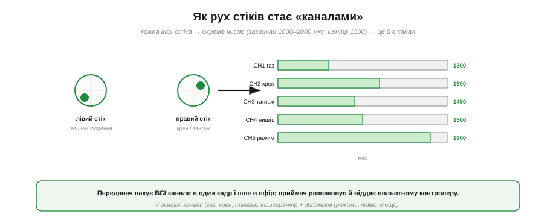
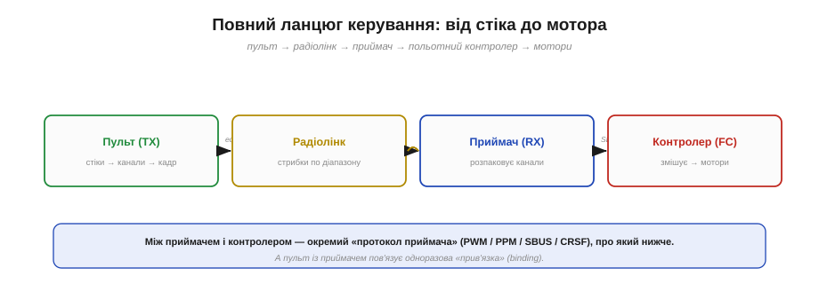
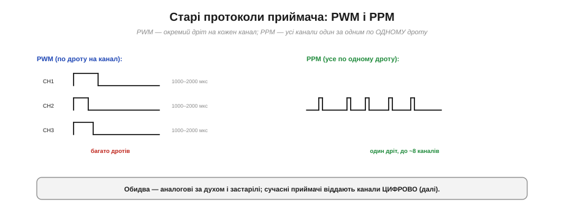
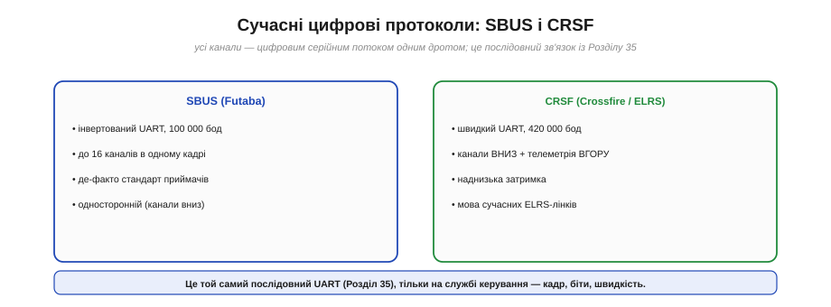
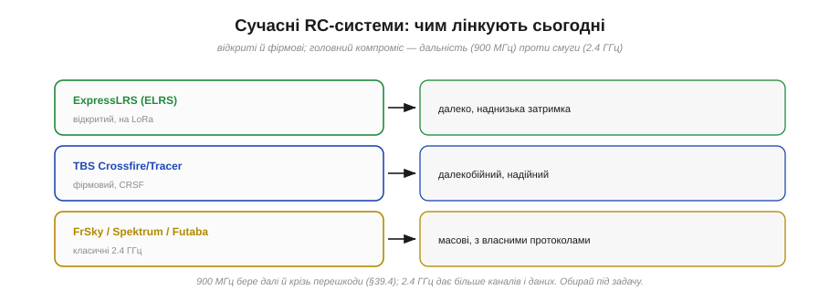

# RC-лінк: канали, прив'язка, протоколи приймача

Розберімо лінію керування — той самий **RC-лінк** (*radio control*), що несе твою волю до апарата. Здавалося б, що тут складного: рухаєш стік — дрон реагує. Але між стіком і мотором лежить цілий ланцюг перетворень, прив'язок і протоколів, і знати його корисно: саме тут криються і налаштування, і типові поломки, і вибір апаратури. Пройдімо цей шлях від руки пілота до польотного контролера.

Лінія керування — це лише половина розмови з апаратом: окремий [потік телеметрії](book:communications/telemetry-stream) несе дані в зворотний бік. А весь поділ на «священну» лінію керування та інформаційну телеметрію закладено в [саму архітектуру каналів зв'язку з апаратом](book:communications/control-telemetry).

### Як рух стіків стає «каналами»

Усе починається з **каналів**. Кожна окрема «команда» пілота — це окремий канал.

*Рис. Кожна вісь стіка перетворюється на число — це **канал** (зазвичай від 1000 до 2000 мкс, центр 1500). Чотири основні: газ, крен, тангаж, нишпорення; плюс допоміжні (перемикачі режимів, підвіс). Передавач пакує всі канали в один кадр і шле в ефір; приймач розпаковує й віддає польотному контролеру.*

Механіка така. Кожна вісь кожного стіка сидить на потенціометрі, що дає **число**. За традицією це число виражають у мікросекундах — від **1000** (стік в одному краю) до **2000** (в іншому), з **1500** посередині (нейтраль). Кожне таке число — окремий **канал**. Чотири основні канали — це **газ** (throttle), **крен** (roll), **тангаж** (pitch) і **нишпорення** (yaw); до них додають **допоміжні** (aux) — перемикачі режимів польоту, керування підвісом камери, скидання вантажу тощо. Сучасні пульти мають 8, 16 і більше каналів. Передавач **пакує всі канали в один кадр** і безперервно шле його в ефір; приймач на борту **розпаковує** кадр назад у канали й передає їх польотному контролеру. Числа 1000–2000 мкс — спадок старого доброго [PWM-керування](book:programming/pwm) [сервомашинками](book:electronics/hobby-servo), і вони живуть досі як «спільна валюта» каналів.

### Повний ланцюг: від стіка до мотора

Складімо весь шлях команди в одну картину.

*Рис. Пульт (TX) перетворює стіки на канали й кадр; **радіолінк** несе його стрибками по діапазону; приймач (RX) розпаковує канали; польотний контролер (FC) змішує їх і керує моторами. Між RX і FC — окремий «протокол приймача» (SBUS/CRSF). А пульт із приймачем пов'язує одноразова **прив'язка**.*

Ланцюг чіткий: **пульт (TX)** → **радіолінк** → **приймач (RX)** → **польотний контролер (FC)** → мотори. Зверни увагу на дві точки стику. Перша — **радіолінк** між пультом і приймачем: він іде по ефіру, зазвичай зі [**стрибками частоти**](book:communications/spread-spectrum), і вимагає **прив'язки**. Друга — з'єднання **приймач→контролер**: воно вже дротове, всередині апарата, і йде окремим **протоколом приймача** (PWM, PPM, SBUS, CRSF). Обидві варті уваги.

### Прив'язка: щоб пульт і приймач упізнавали одне одного

Як приймач знає, що слухати **саме твій** пульт, а не сусідський? Через **прив'язку** (*binding*).

*Рис. Під час прив'язки пульт і приймач одноразово домовляються про спільний **унікальний ключ** і **послідовність стрибків** частоти. Відтоді пара говорить лише між собою; інша пара поряд має інший ключ — і вони не заважають одне одному. Це й дає змогу десяткам пілотів літати поруч.*

Прив'язка — це одноразова процедура, у якій пульт і приймач домовляються про **спільний секрет**: унікальний ідентифікатор пари й **послідовність стрибків** по частотах. Спираючись на [спред-спектр](book:communications/spread-spectrum), кожна прив'язана пара стрибає за **своїм** псевдовипадковим розкладом — тож приймач реагує лише на «свій» пульт, а сусідські сигнали для нього шум. Саме завдяки прив'язці **десятки пілотів** можуть літати поруч на тому самому діапазоні, не перехоплюючи керування один в одного. Роблять прив'язку раз — кнопкою на приймачі, перемичкою-bind-plug або введенням bind-фрази, — і далі вона тримається. Це пряме, життєве застосування [стрибків частоти](book:communications/spread-spectrum).

### Старі протоколи приймача: PWM і PPM

Тепер друга точка стику — як приймач віддає канали контролеру. Історично перші способи — **PWM** і **PPM**.

*Рис. **PWM**: окремий дріт на **кожен** канал, кожен — імпульс 1000–2000 мкс (як сервокерування). Багато дротів. **PPM** (CPPM): усі канали йдуть **один за одним по одному дроту** як послідовність імпульсів (до ~8 каналів). Обидва аналогові за духом і застарілі.*

**PWM** — найстаріший: **окремий дріт** на кожен канал, і по кожному йде імпульс 1000–2000 мкс (точно як керування сервомашинкою). Просто, але дротів — стільки ж, скільки каналів; для 8 каналів це 8 проводів. **PPM** (*pulse-position modulation*, інколи CPPM) розумніший: усі канали шлють **один за одним по одному дроту** як серію імпульсів-кадр, тож вистачає **одного** дроту на ~8 каналів. Обидва протоколи — аналогові за духом, повільні й вразливі до завад; сьогодні їх витіснили **цифрові**.

### Сучасні цифрові протоколи: SBUS і CRSF

Сучасні приймачі віддають канали **цифровим серійним потоком** — і в його основі лежить добре відомий послідовний інтерфейс.

*Рис. **SBUS** (Futaba): інвертований UART на 100 000 бод, до 16 каналів в одному кадрі — де-факто стандарт приймачів, односторонній. **CRSF** (Crossfire/ELRS): швидкий UART на 420 000 бод, що несе канали **вниз** і телеметрію **вгору**, з наднизькою затримкою. Це той самий послідовний UART-зв'язок, лише застосований до керування.*

І SBUS, і CRSF — це звичайний [**послідовний UART**](book:communications/async-serial), застосований до керування. **SBUS** (від Futaba) — інвертований UART на **100 000 бод**, що пакує до **16 каналів** в один компактний кадр; він став **де-факто стандартом** приймачів, хоча й односторонній (тільки канали вниз). **CRSF** (*Crossfire protocol*, який вживають TBS Crossfire та ELRS) — швидший, на **420 000 бод**, і, головне, **двосторонній**: несе канали керування вниз **і** телеметрію вгору, ще й з наднизькою затримкою. Тобто всі базові цеглинки UART — [кадри й біти](book:communications/uart-frame), швидкість, перевірки — тут працюють «по-дорослому» на службі керування дроном: ті самі прості елементи складаються в реальну техніку.

### Сучасні RC-системи: чим лінкують сьогодні

Кілька слів про самі **радіосистеми** керування — бо їх вибирають під задачу.

*Рис. **ExpressLRS (ELRS)** — відкрита система на LoRa: наднизька затримка й велика дальність. **TBS Crossfire/Tracer** — фірмова, на CRSF, далекобійна й надійна. **FrSky / Spektrum / Futaba** — класичні масові 2.4 ГГц із власними протоколами. Головний компроміс: 900 МГц бере далі, 2.4 ГГц дає більше даних.*

Найцікавіше сьогодні — **ExpressLRS (ELRS)**: відкрита система на основі [**LoRa**](book:communications/lora), що поєднує [розширення спектра](book:communications/spread-spectrum) і дає наднизьку затримку й величезну дальність за копійки. Поряд — фірмова **TBS Crossfire/Tracer** на CRSF, теж далекобійна й надійна. І класичні масові системи — **FrSky, Spektrum, Futaba** — переважно на 2.4 ГГц зі своїми протоколами. Головний компроміс — у [виборі діапазону](book:communications/frequency-bands): **900 МГц** (868/915) бере **далі** й краще крізь перешкоди, а **2.4 ГГц** дає **більше** каналів і даних, зате меншу дальність. Обирай під задачу: дальнобійний політ — 900 МГц/ELRS; ближній спритний — 2.4 ГГц.

> 🔧 **Навіщо це.** Коли налаштовуєш чи лагодиш керування, тримай у голові весь ланцюг — і шукай проблему по ланках. Дрон не реагує? Перевір **прив'язку** (чи пов'язані пульт і приймач — світлодіод приймача підкаже). Реагує дивно? Глянь **протокол приймача** й порт контролера (SBUS треба інвертований UART, CRSF — свій порт і швидкість). Бракує **дальності**? Це або діапазон (перейди на 900 МГц/ELRS), або [антена приймача](book:communications/antenna) — її поляризація, розміщення, keep-out. А головне — налаштуй **failsafe**, бо без нього втрата сигналу = падіння. Розуміючи ланцюг «стік → канали → радіолінк → приймач → протокол → контролер», ти діагностуєш керування свідомо, а не навмання.

### Що робить приймач, коли сигнал зник: failsafe

І найважливіше для безпеки — **failsafe**. [Лінія керування «священна»](book:communications/control-telemetry), тож на **втрату сигналу** має бути заздалегідь заданий план.

*Рис. Коли сигнал зникає (вийшов за межу, заглушили, сіла батарея пульта), приймач не має «зависати» з останньою командою назавжди. Варіанти: коротко **утримати останнє**; **прибрати газ**, щоб апарат не полетів геть; або віддати **задані failsafe-значення**, за якими контролер виконує **повернення додому (RTL) чи м'яку посадку**.*

Без failsafe сценарій страшний: сигнал зник, а приймач далі шле контролеру **останню** команду — і апарат летить геть, поки не впаде чи не зникне. Тому грамотний приймач на втрату сигналу робить **заздалегідь налаштоване**: або коротко **утримує** останні значення (на випадок [короткого провалу через багатопроменеве завмирання](book:communications/multipath-fading)), або **прибирає газ**, щоб дрон не помчав удалечінь, або — найкраще — віддає **спеціальні failsafe-значення**, за якими польотний контролер запускає **повернення додому (RTL)** чи контрольовану **посадку**. Це конкретне втілення загальної ідеї [надійної лінії зв'язку](book:communications/reliable-link), що передбачає поведінку на випадок втрати з'єднання. Правило просте й незмінне: **завжди налаштовуй failsafe** перед польотом — це різниця між «дрон сам повернувся» і «дрон загубився».

Так замикається лінія керування — від волі пілота до руху апарата: стіки стають каналами, радіолінк несе їх стрибками частоти, приймач розпаковує їх і віддає контролеру своїм протоколом, а failsafe стереже момент, коли зв'язок обірветься. Це лише половина розмови з апаратом: у зворотний бік тече [телеметрія](book:communications/telemetry-stream), якою борт **розповідає про себе** — і саме там розгортається структурований [протокол MAVLink](book:communications/mavlink-packet).

---
