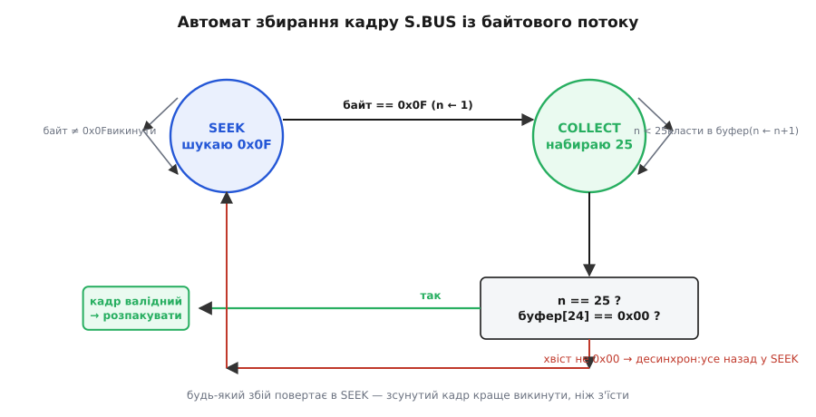
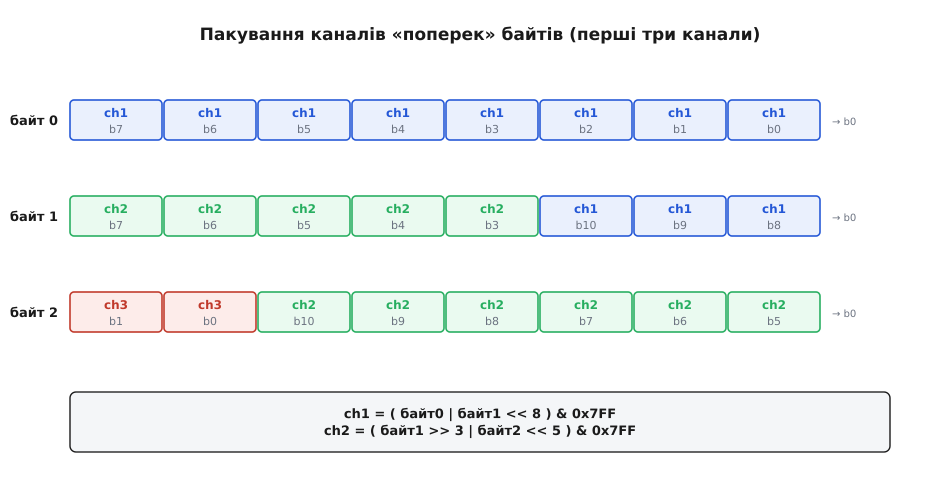

# ⚙️ Парсер S.BUS: від байтового струмочка до 16 каналів у мікросекундах

Приймач шле по одному дроту нескінченний потік байтів, і серед них десь ховаються кадри керування. У прошивці польотного контролера цей дріт заходить у [приймач UART](topic:communications/uart-frame): апаратура одну по одній складає докупи послідовність бітів у байт і кладе його тобі під ніс — байт за байтом, без жодного натяку, де починається кадр і де закінчується. А тобі з цього струмочка треба щоразу дістати рівно 16 чисел, кожне в межах 1000–2000 мкс, та ще й знати, чи не збрехав приймач через втрату зв'язку. Це і є вся задача парсера S.BUS: **перетворити нескінченний ряд байтів на надійний потік готових команд**.

Задача звучить дрібно — «прочитай 25 байтів, розклади на канали». Але саме тут ховаються три пастки, на яких спотикається чи не кожен, хто пише цей код уперше: як спіймати початок кадру в потоці, що вже біжить; як зібрати 11-бітні канали, коли вони порізані впоперек байтів; і як не отримати сміття замість мікросекунд через мовчазне переповнення 16-бітного числа. Розберімо парсер так, щоб кожна з цих пасток була видна й закрита.

## Задача точно: що дано, що треба дістати

Дано — **байтовий потік з UART**. Лінія налаштована так, як вимагає Futaba: 100 000 бод, формат 8E2 (вісім біт даних, парна парність, два стоп-біти), причому лінія **інвертована** — логічний нуль на дроті це високий рівень напруги, одиниця — низький. Апаратура UART віддає нам уже зібрані байти; наша частина починається з того місця, де байт лежить у регістрі даних чи в перерваннєвому колбеку.

Кадр — **рівно 25 байтів фіксованої довжини**:

```
[0]      старт, завжди 0x0F
[1..22]  22 байти даних: 16 каналів по 11 біт, спаковані щільно
[23]     байт прапорців: ch17, ch18, frame_lost, failsafe
[24]     стоп, завжди 0x00
```

Треба дістати:

- **16 пропорційних каналів** — сирі значення 0–2047 (11 біт), а на виході — мікросекунди 1000–2000;
- **два цифрові канали** (17 і 18) — увімк/вимк, по одному біту;
- **прапорець frame_lost** — цей конкретний кадр приймач прийняв не чисто (перешкода, послаблений сигнал), але зв'язок є;
- **прапорець failsafe** — приймач зовсім втратив пульт; це найважливіший біт у всьому кадрі, бо за ним контролер вмикає аварійний план і не вірить значенням каналів.

Одна деталь, що ловить багатьох одразу: **сирі значення каналу не 1000–2000**. По дроту канал їде як число приблизно від 192 до 1792, з центром 992. У мікросекунди його розгортає вже прошивка. Плутати ці дві шкали — класична помилка, і код нижче тримає їх нарізно.

> 🔧 **Навіщо це.** Цей парсер — той шматок прошивки, від якого залежить, чи полетить апарат за стіком. Помилка в синхронізації дасть «канали стрибають раз на секунду» (кадр раз по раз ловиться зсунутим). Помилка в масштабуванні дасть газ, що замість плавного ходу шарпається на крайні значення. А проґавлений біт failsafe — це апарат, що на втраті зв'язку тримає останній газ і летить у стіну замість того, щоб сісти. Кожна з трьох пасток нижче — реальна аварія, а не абстракція.

## Ідея: дві незалежні підзадачі

Спокуса — написати все однією простою функцією «читай 25 байтів і розбирай». Вона працює рівно доти, доки потік ідеальний. Щойно один байт загубиться чи прийде перешкода — простий підхід починає ловити кадри зсунутими на байт-два, і канали перетворюються на кашу. Тому парсер природно розпадається на **дві окремі підзадачі, які не варто змішувати**:

**Перша — синхронізація й збір кадру.** Байти течуть по одному; треба зловити початок (`0x0F`), набрати рівно 25 у буфер, переконатися, що хвіст на місці (`0x00`), і тільки тоді сказати «ось цілий кадр». Це задача про **час і стан**: ми не знаємо наперед, з якого байта потоку почнеться кадр, і мусимо втримувати стан «скільки вже набрали» між викликами. Її розв'язує **кільцевий буфер плюс скінченний автомат**.

**Друга — розпакування готового кадру.** Коли перед нами вже лежать 25 правильних байтів, дістати з них канали — це чиста арифметика зсувів і масок, без жодного стану й часу. Її можна тестувати окремо, згодувавши заготовлений масив.

Розділивши так, ми дістаємо велику вигоду: кожну половину можна перевіряти самостійно, і жодна пастка однієї не переплітається з пасткою іншої. Почнемо зі збору кадру, бо саме там ховається найпідступніша пастка — десинхронізація.

## Збір кадру: кільцевий буфер і автомат синхронізації

Байти з UART приходять асинхронно — зазвичай у перерванні по прийому, по одному. Головний цикл прошивки тим часом зайнятий стабілізацією, читанням гіроскопа, керуванням моторами. Треба, щоб перерваннєвий колбек **не робив нічого важкого**: він лише кладе байт у чергу й вертається. Розбором займеться головний цикл, коли дійдуть руки. Класичний спосіб зшити ці два світи — **кільцевий буфер** (англ. *ring buffer*, він же круговий): масив фіксованого розміру з двома індексами — куди писати (`head`) і звідки читати (`tail`); коли індекс доходить до кінця масиву, він завертається на початок.

:::tabs
```cpp
#include <stdint.h>

// Кільцевий буфер сирих байтів UART. Розмір — степінь двійки,
// щоб замість ділення на модуль обійтися дешевою маскою «& (SIZE-1)».
#define RB_SIZE 64
#define RB_MASK (RB_SIZE - 1)

typedef struct {
    volatile uint8_t buf[RB_SIZE];
    volatile uint16_t head;   // куди пише перервання
    volatile uint16_t tail;   // звідки читає головний цикл
} ring_t;

static ring_t rb;

// Викликається З ПЕРЕРВАННЯ UART на кожен прийнятий байт. Мусить бути коротким.
void sbus_uart_isr(uint8_t byte) {
    uint16_t next = (rb.head + 1) & RB_MASK;
    if (next != rb.tail) {        // є місце — інакше просто губимо байт
        rb.buf[rb.head] = byte;
        rb.head = next;
    }
}

// Читає один байт із буфера. Повертає 1, якщо байт був; 0, якщо буфер порожній.
static int rb_get(uint8_t *out) {
    if (rb.head == rb.tail) return 0;      // порожньо
    *out = rb.buf[rb.tail];
    rb.tail = (rb.tail + 1) & RB_MASK;
    return 1;
}
```
```python
# Кільцевий буфер сирих байтів UART. Розмір — степінь двійки,
# щоб замість ділення на модуль обійтися дешевою маскою «& (SIZE-1)».
RB_SIZE = 64
RB_MASK = RB_SIZE - 1

class Ring:
    def __init__(self):
        self.buf = bytearray(RB_SIZE)
        self.head = 0            # куди пише перервання
        self.tail = 0            # звідки читає головний цикл

rb = Ring()

# Викликається З ПЕРЕРВАННЯ UART на кожен прийнятий байт. Мусить бути коротким.
def sbus_uart_isr(byte):
    nxt = (rb.head + 1) & RB_MASK
    if nxt != rb.tail:           # є місце — інакше просто губимо байт
        rb.buf[rb.head] = byte
        rb.head = nxt

# Читає один байт із буфера. Повертає байт або None, якщо буфер порожній.
def rb_get():
    if rb.head == rb.tail:       # порожньо
        return None
    out = rb.buf[rb.tail]
    rb.tail = (rb.tail + 1) & RB_MASK
    return out
```
:::

Чому розмір — степінь двійки? Тоді «завернути індекс» — це `(i + 1) & (SIZE − 1)` замість `(i + 1) % SIZE`. Ділення на процесорі без апаратного діленця (а таких у світі мікроконтролерів більшість) коштує десятки тактів; побітове «і» — один. У перерванні, що спрацьовує на кожен байт (а на 100 000 бод це кожні 100 мкс), ця дрібниця складається у відчутну економію.

Тепер головне — **автомат синхронізації**. Байти в буфері не розмічені; ми мусимо самі знайти, де кадр починається. Наївний варіант «прочитав 25 байтів — оце й кадр» валиться на першій же втраті байта: якщо один байт десь загубився, усі наступні кадри зсунуться на позицію, і `0x0F` опиниться посеред «кадру», а не на початку. Тому парсер тримає **стан**: він або **шукає старт** (стан SEEK), або **набирає тіло кадру** (стан COLLECT).


*У стані SEEK кожен байт, що не дорівнює 0x0F, викидається; щойно прийшов 0x0F, автомат переходить у COLLECT і починає складати кадр. У COLLECT байти лягають у буфер, доки їх не набереться 25. Тоді — перевірка хвоста: якщо байт 24 це 0x00, кадр валідний і його розпаковують; якщо ні — сталася десинхронізація, і все повертається в SEEK, аби наступний 0x0F почав кадр наново. Зсунутий кадр краще викинути цілком, ніж згодувати контролеру зіпсовані значення.*

:::tabs
```cpp
#define SBUS_LEN     25
#define SBUS_HEADER  0x0F
#define SBUS_FOOTER  0x00

typedef enum { ST_SEEK, ST_COLLECT } sbus_state_t;

typedef struct {
    sbus_state_t state;
    uint8_t frame[SBUS_LEN];
    uint8_t idx;              // скільки байтів кадру вже набрано
} sbus_parser_t;

static sbus_parser_t ps;

// Прожовує все, що накопичилось у кільцевому буфері. Коли зібрано цілий
// валідний кадр — кладе його в out_frame і повертає 1 (можна кликати
// повторно, доки вертає 1: за один прохід кадрів може набратися кілька).
int sbus_poll(uint8_t out_frame[SBUS_LEN]) {
    uint8_t b;
    while (rb_get(&b)) {
        switch (ps.state) {

        case ST_SEEK:
            // У пошуку старту викидаємо все, крім заголовка.
            if (b == SBUS_HEADER) {
                ps.frame[0] = b;
                ps.idx = 1;
                ps.state = ST_COLLECT;
            }
            break;

        case ST_COLLECT:
            ps.frame[ps.idx++] = b;
            if (ps.idx == SBUS_LEN) {
                // Кадр набрано повністю — перевіряємо хвіст.
                ps.state = ST_SEEK;               // хай там що — далі знову шукаємо старт
                if (ps.frame[SBUS_LEN - 1] == SBUS_FOOTER) {
                    for (int i = 0; i < SBUS_LEN; i++) out_frame[i] = ps.frame[i];
                    return 1;                     // валідний кадр
                }
                // Хвіст не 0x00 → десинхрон. Кадр викидаємо, лишаємось у SEEK.
            }
            break;
        }
    }
    return 0;   // цілого кадру поки нема
}
```
```python
SBUS_LEN    = 25
SBUS_HEADER = 0x0F
SBUS_FOOTER = 0x00

ST_SEEK, ST_COLLECT = 0, 1

class SbusParser:
    def __init__(self):
        self.state = ST_SEEK
        self.frame = bytearray(SBUS_LEN)
        self.idx = 0             # скільки байтів кадру вже набрано

ps = SbusParser()

# Прожовує все, що накопичилось у кільцевому буфері. Коли зібрано цілий
# валідний кадр — повертає його копію (bytes); інакше None (можна кликати
# повторно, доки вертає кадр: за один прохід кадрів може набратися кілька).
def sbus_poll():
    b = rb_get()
    while b is not None:
        if ps.state == ST_SEEK:
            # У пошуку старту викидаємо все, крім заголовка.
            if b == SBUS_HEADER:
                ps.frame[0] = b
                ps.idx = 1
                ps.state = ST_COLLECT

        elif ps.state == ST_COLLECT:
            ps.frame[ps.idx] = b
            ps.idx += 1
            if ps.idx == SBUS_LEN:
                # Кадр набрано повністю — перевіряємо хвіст.
                ps.state = ST_SEEK               # хай там що — далі знову шукаємо старт
                if ps.frame[SBUS_LEN - 1] == SBUS_FOOTER:
                    return bytes(ps.frame)       # валідний кадр
                # Хвіст не 0x00 → десинхрон. Кадр викидаємо, лишаємось у SEEK.

        b = rb_get()
    return None   # цілого кадру поки нема
```
:::

Ключова тонкість тут — **що робити на невдалій перевірці хвоста**. Спокуса: «хвіст не той — а раптом усередині є `0x0F`, почнімо звідти». Так робити не варто: `0x0F` цілком законно трапляється **всередині** байтів даних (це просто число 15, а канали набувають будь-яких значень), тож полювання на нього посеред тіла лише погіршить синхронізацію. Надійніше — на будь-якому сумніві повернутися в чистий SEEK і чекати наступного заголовка. Один кадр (14 мс) ми втратимо, але наступний спіймаємо правильно, і канали не стрибнуть. **Краще пропустити кадр, ніж з'їсти зсунутий** — це золоте правило синхронізації будь-якого кадрового протоколу.

Є ще суворіший критерій валідності, який використовують серйозні реалізації (наприклад, у польотному стеку PX4): звірити не лише хвіст, а й **парність кожного байта** та узгодженість заголовка. Ми обмежилися заголовком і хвостом — цього досить для навчального надійного парсера, бо апаратний UART у режимі 8E2 **сам** відкидає байти з побитою парністю ще до того, як вони дійдуть до нас. Тобто перевірку парності за нас уже зробило залізо; нам лишається впіймати випадання цілого байта, а це якраз і ловиться неспівпаданням хвоста.

> 🔧 **Навіщо це.** Автомат станів — не академічна прикраса. Уяви, що ти обмежився «читати 25 і розбирати». На землі, поряд із пультом, усе працює. У повітрі, за 300 метрів, сигнал слабшає, один байт губиться — і твій «простий» парсер починає віддавати кожен кадр зсунутим: газ читається з бітів крену, апарат смикається. Автомат із поверненням у SEEK це переживе: втратить один кадр і синхронізується наново на наступному заголовку.

## Розпакування каналів: 11 біт упоперек байтів

Кадр зібрано, у нас 25 чистих байтів. Тепер друга, суто арифметична підзадача — дістати 16 каналів. І тут своя пастка: **11 біт не діляться на 8**, тож канали не лягають на байтові межі. Шістнадцять каналів по 11 біт — це 176 біт, рівно 22 байти без залишку, але кожен окремий канал розмазаний по двох-трьох сусідніх байтах.

Щоб зрозуміти зсуви, треба знати одну річ про порядок бітів: S.BUS шле дані **молодшим бітом уперед** (LSB first), і при пакуванні канали викладаються так само — молодші біти каналу лягають першими. Тому перший канал займає **всі вісім біт байта 1 (це його молодші біти 0–7) і три молодші біти байта 2 (його старші біти 8–10)**. Другий канал підхоплює решту байта 2 і частину байта 3, і так далі.


*Кожна клітинка — один біт байта, підписано, якому каналу й якому його розряду він належить (b0 — молодший). Оскільки байти йдуть молодшим бітом уперед, ch1 збирається як «байт0 плюс байт1, зсунутий на 8 позицій угору», а ch2 — як «байт1, зсунутий на 3 вниз, плюс байт2, зсунутий на 5 угору», і все обрізається маскою 0x7FF на 11 біт. Рецепт унизу — це рівно ті вирази, що стоять у коді.*

Логіку видно на першому каналі. Його молодші вісім біт — це весь байт 1. Його старші три біти — молодші три біти байта 2, які треба підняти на вісім позицій угору (бо це розряди 8, 9, 10):

```
ch1 = байт1  |  (байт2 & 0x07) << 8
      └─ біти 0..7 ─┘  └─ біти 8..10 ─┘
```

Для решти каналів зсуви інші, але принцип той самий: узяти хвіст біт із одного байта (зсув управо, щоб відкинути чужі молодші біти), доклеїти біти з наступного байта (зсув уліво на потрібну висоту), інколи ще й третій байт, і обрізати все маскою `0x7FF` (одинадцять одиниць — рівно 11 біт). Виписувати шістнадцять таких рядків уручну легко наплутати, тож зручніше зробити це один раз і перевірити:

:::tabs
```cpp
// Розпакувати 16 каналів по 11 біт із 22 байтів даних (frame[1..22]).
// d — вказівник на frame[1], тобто d[0] це другий байт кадру.
void sbus_unpack_channels(const uint8_t *d, uint16_t ch[16]) {
    ch[0]  = (uint16_t)((d[0]       | d[1]  << 8)               & 0x07FF);
    ch[1]  = (uint16_t)((d[1]  >> 3 | d[2]  << 5)               & 0x07FF);
    ch[2]  = (uint16_t)((d[2]  >> 6 | d[3]  << 2 | d[4]  << 10) & 0x07FF);
    ch[3]  = (uint16_t)((d[4]  >> 1 | d[5]  << 7)               & 0x07FF);
    ch[4]  = (uint16_t)((d[5]  >> 4 | d[6]  << 4)               & 0x07FF);
    ch[5]  = (uint16_t)((d[6]  >> 7 | d[7]  << 1 | d[8]  << 9)  & 0x07FF);
    ch[6]  = (uint16_t)((d[8]  >> 2 | d[9]  << 6)               & 0x07FF);
    ch[7]  = (uint16_t)((d[9]  >> 5 | d[10] << 3)               & 0x07FF);
    ch[8]  = (uint16_t)((d[11]      | d[12] << 8)               & 0x07FF);
    ch[9]  = (uint16_t)((d[12] >> 3 | d[13] << 5)               & 0x07FF);
    ch[10] = (uint16_t)((d[13] >> 6 | d[14] << 2 | d[15] << 10) & 0x07FF);
    ch[11] = (uint16_t)((d[15] >> 1 | d[16] << 7)               & 0x07FF);
    ch[12] = (uint16_t)((d[16] >> 4 | d[17] << 4)               & 0x07FF);
    ch[13] = (uint16_t)((d[17] >> 7 | d[18] << 1 | d[19] << 9)  & 0x07FF);
    ch[14] = (uint16_t)((d[19] >> 2 | d[20] << 6)               & 0x07FF);
    ch[15] = (uint16_t)((d[20] >> 5 | d[21] << 3)               & 0x07FF);
}
```
```python
# Розпакувати 16 каналів по 11 біт із 22 байтів даних (frame[1..22]).
# d — це frame[1:], тобто d[0] це другий байт кадру.
def sbus_unpack_channels(d):
    ch = [0] * 16
    ch[0]  = (d[0]       | d[1]  << 8)               & 0x07FF
    ch[1]  = (d[1]  >> 3 | d[2]  << 5)               & 0x07FF
    ch[2]  = (d[2]  >> 6 | d[3]  << 2 | d[4]  << 10) & 0x07FF
    ch[3]  = (d[4]  >> 1 | d[5]  << 7)               & 0x07FF
    ch[4]  = (d[5]  >> 4 | d[6]  << 4)               & 0x07FF
    ch[5]  = (d[6]  >> 7 | d[7]  << 1 | d[8]  << 9)  & 0x07FF
    ch[6]  = (d[8]  >> 2 | d[9]  << 6)               & 0x07FF
    ch[7]  = (d[9]  >> 5 | d[10] << 3)               & 0x07FF
    ch[8]  = (d[11]      | d[12] << 8)               & 0x07FF
    ch[9]  = (d[12] >> 3 | d[13] << 5)               & 0x07FF
    ch[10] = (d[13] >> 6 | d[14] << 2 | d[15] << 10) & 0x07FF
    ch[11] = (d[15] >> 1 | d[16] << 7)               & 0x07FF
    ch[12] = (d[16] >> 4 | d[17] << 4)               & 0x07FF
    ch[13] = (d[17] >> 7 | d[18] << 1 | d[19] << 9)  & 0x07FF
    ch[14] = (d[19] >> 2 | d[20] << 6)               & 0x07FF
    ch[15] = (d[20] >> 5 | d[21] << 3)               & 0x07FF
    return ch
```
:::

Ця таблиця не з голови — це та сама розкладка, що в реалізаціях Betaflight, ArduPilot і бібліотеки bolderflight/sbus; вона перевіряється зворотним пакуванням (запакуй 16 довільних чисел за цим правилом, розпакуй назад — мусиш дістати ті самі числа). Один нюанс `C`, вартий уваги: у виразі `d[1] << 8` операнд `d[1]` має тип `uint8_t`, але за правилами мови перед зсувом він **автоматично розширюється до `int`** (звичайне цілочисельне піднесення, англ. *integer promotion*). Тому зсув на 8 чи навіть на 10 не втрачає біти — проміжний результат живе в 32-бітному `int`, а маска `& 0x07FF` уже вирізає з нього потрібні 11. Якби `int` був 16-бітним (а таке буває на дрібних 8-бітних AVR), зсув на 10 усе одно вліз би в 11 біт результату — тут запасу вистачає, але це саме той клас переповнення, що чигає на наступному кроці.

## Прапорці й цифрові канали: байт 23

Двадцять четвертий за ліком байт (індекс 23) — байт прапорців. Значущі в ньому лише чотири молодші біти:

```
біт 0 (0x01) — ch17, цифровий канал 17 (увімк/вимк)
біт 1 (0x02) — ch18, цифровий канал 18
біт 2 (0x04) — frame_lost:  цей кадр прийнято не чисто
біт 3 (0x08) — failsafe:    зв'язок утрачено, вмикай аварійку
біти 4..7    — не використовуються (нулі)
```

Читаються вони простою перевіркою відповідного біта:

:::tabs
```cpp
typedef struct {
    uint16_t ch[16];      // сирі 0..2047
    uint8_t  ch17;        // 0/1
    uint8_t  ch18;        // 0/1
    uint8_t  frame_lost;  // 0/1
    uint8_t  failsafe;    // 0/1
} sbus_data_t;

static void sbus_read_flags(uint8_t flags, sbus_data_t *out) {
    out->ch17       = (flags & 0x01) ? 1 : 0;
    out->ch18       = (flags & 0x02) ? 1 : 0;
    out->frame_lost = (flags & 0x04) ? 1 : 0;
    out->failsafe   = (flags & 0x08) ? 1 : 0;
}
```
```python
from dataclasses import dataclass, field

@dataclass
class SbusData:
    ch: list = field(default_factory=lambda: [0] * 16)  # сирі 0..2047
    ch17: int = 0        # 0/1
    ch18: int = 0        # 0/1
    frame_lost: int = 0  # 0/1
    failsafe: int = 0    # 0/1

def sbus_read_flags(flags, out):
    out.ch17       = 1 if flags & 0x01 else 0
    out.ch18       = 1 if flags & 0x02 else 0
    out.frame_lost = 1 if flags & 0x04 else 0
    out.failsafe   = 1 if flags & 0x08 else 0
```
:::

Різниця між `frame_lost` і `failsafe` — принципова, і плутати їх небезпечно. **frame_lost** каже «оцей один кадр приймач не розчув до пуття» — може, коротка перешкода; зв'язок при цьому живий, і на наступному кадрі все повернеться. **failsafe** каже «я взагалі більше не бачу передавача» — це вже підстава вмикати аварійний сценарій (утримати висоту, повернутися додому, заглушити мотори — залежно від апарата). Розумний контролер на поодинокий `frame_lost` не панікує (це нормальне життя радіо), а на `failsafe` реагує негайно.

## Усе разом: від кадру до мікросекунд

Лишилося з'єднати частини й перевести сирі значення в мікросекунди — і тут остання, найпідступніша пастка, бо вона мовчазна. Опорні точки Futaba: сире 192 відповідає 1000 мкс, сире 1792 відповідає 2000 мкс. Нахил прямої:

```
нахил = (2000 − 1000) / (1792 − 192) = 1000 / 1600 = 0.625 мкс на крок
us = 1000 + (raw − 192) × 1000 / 1600
```

Спокуса написати це «в лоб» у `uint16_t` — і саме тут ховається аварія. Порахуймо чисельник на верхньому краю: `(1792 − 192) × 1000 = 1600 × 1000 = 1 600 000`. А `uint16_t` тримає максимум `65 535`. Тобто проміжок `raw × 1000` **переповнює 16 біт задовго** до ділення, і замість плавної кривої ти дістаєш пилку зі стрибками на крайніх положеннях стіка. Ліки — рахувати чисельник у **32-бітному типі**: тоді 1 600 000 вільно вміщається (стеля `int32` — понад два мільярди), і ділення дає правильний результат.

:::tabs
```cpp
// Сире значення S.BUS (≈192..1792) → мікросекунди (1000..2000).
static int sbus_raw_to_us(uint16_t raw) {
    // Множення В 32 БІТАХ: (raw-192)*1000 доходить до 1'600'000 — це НЕ влазить у 16 біт.
    return 1000 + (int)((int32_t)(raw - 192) * 1000 / 1600);
}
```
```python
# Сире значення S.BUS (≈192..1792) → мікросекунди (1000..2000).
def sbus_raw_to_us(raw):
    # У Python цілі не переповнюються — але ділення має бути цілим (//),
    # щоб точно повторити C-арифметику: (raw-192)*1000 доходить до 1_600_000.
    return 1000 + (raw - 192) * 1000 // 1600
```
:::

Приведення `(int32_t)` тут не косметика — це і є та лінія, що відділяє робочий газ від смиканого. Без неї `(raw - 192) * 1000` порахувалося б у 16 бітах (бо `raw` це `uint16_t`, `1000` теж влазить у `int`, а на 16-бітних платформах `int` — 16 біт), переповнилося б і зіпсувало результат саме на великих значеннях. Явний `int32_t` змушує компілятор рахувати весь добуток у 32 бітах.

Тепер повна верхньорівнева функція — вона поєднує збір, розпакування, прапорці й масштабування, і повертає готову структуру та окремо мікросекунди:

:::tabs
```cpp
// Головна функція: тягне байти з кільцевого буфера. Коли готовий валідний кадр —
// заповнює out (сирі канали + прапорці) і us[16] (мікросекунди) та повертає 1.
int sbus_read(sbus_data_t *out, int us[16]) {
    uint8_t frame[SBUS_LEN];
    if (!sbus_poll(frame)) return 0;      // цілого кадру ще нема

    sbus_unpack_channels(&frame[1], out->ch);   // 16 каналів із frame[1..22]
    sbus_read_flags(frame[23], out);            // прапорці з байта 23

    for (int i = 0; i < 16; i++)
        us[i] = sbus_raw_to_us(out->ch[i]);     // сире → мкс

    return 1;
}
```
```python
# Головна функція: тягне байти з кільцевого буфера. Коли готовий валідний кадр —
# заповнює out (сирі канали + прапорці) і повертає (out, us[16]); інакше None.
def sbus_read(out):
    frame = sbus_poll()
    if frame is None:                       # цілого кадру ще нема
        return None

    out.ch = sbus_unpack_channels(frame[1:])    # 16 каналів із frame[1..22]
    sbus_read_flags(frame[23], out)             # прапорці з байта 23

    us = [sbus_raw_to_us(c) for c in out.ch]    # сире → мкс

    return out, us
```
:::

Розберемо на конкретному кадрі, щоб числа зійшлися. Нехай перший канал у нейтралі: у кадрі `frame[1] = 0xE0`, `frame[2] = 0x03` (тобто в термінах `sbus_unpack_channels` це `d[0] = 0xE0`, `d[1] = 0x03`).

**Умова.** Дістати перший канал і перевести в мікросекунди.

:::tabs
```cpp
// розпакування ch1:
//   ch[0] = (d[0] | d[1] << 8) & 0x07FF
//         = (0xE0 | (0x03 << 8)) & 0x7FF
//         = (0x0E0 | 0x300) & 0x7FF
//         = 0x3E0
//         = 992                    ← рівно центр діапазону S.BUS
//
// масштабування:
//   us = 1000 + (int32_t)(992 - 192) * 1000 / 1600
//      = 1000 + 800 * 1000 / 1600
//      = 1000 + 800000 / 1600       ← 800000 вимагає 32 біт!
//      = 1000 + 500
//      = 1500 мкс                   ← нейтраль, стік відпущено
```
```python
# розпакування ch1:
#   ch[0] = (d[0] | d[1] << 8) & 0x07FF
#         = (0xE0 | (0x03 << 8)) & 0x7FF
#         = (0x0E0 | 0x300) & 0x7FF
#         = 0x3E0
#         = 992                    ← рівно центр діапазону S.BUS
#
# масштабування:
#   us = 1000 + (992 - 192) * 1000 // 1600
#      = 1000 + 800 * 1000 // 1600
#      = 1000 + 800000 // 1600       ← у C проміжок вимагав би 32 біт!
#      = 1000 + 500
#      = 1500 мкс                   ← нейтраль, стік відпущено
```
:::

Сире 992 дає рівно 1500 мкс — центр, як і має бути для відпущеного стіка. У цих двох рядках видно обидві головні ідеї коду одразу: канал зібрано з двох байтів через маску й зсув, а множення зроблено так, щоб проміжне `800 000` не переповнило 16 біт.

І остання ланка — реакція на failsafe. Парсер віддає прапорець; вирішує вже вищий рівень:

:::tabs
```cpp
sbus_data_t sb;
int ch_us[16];

if (sbus_read(&sb, ch_us)) {
    if (sb.failsafe) {
        enter_failsafe();               // утримати/повернутись/заглушити — за політикою апарата
    } else {
        apply_throttle(ch_us[2]);       // напр., газ на 3-му каналі, вже в мкс
        // frame_lost можна врахувати як «підозрілий кадр», але не як тривогу
    }
}
```
```python
sb = SbusData()

result = sbus_read(sb)
if result is not None:
    sb, ch_us = result
    if sb.failsafe:
        enter_failsafe()               # утримати/повернутись/заглушити — за політикою апарата
    else:
        apply_throttle(ch_us[2])       # напр., газ на 3-му каналі, вже в мкс
        # frame_lost можна врахувати як «підозрілий кадр», але не як тривогу
```
:::

## Складність і пастки: де саме ламається

Обчислювальна складність тут скромна й того варта. Збір кадру — **O(1) на байт**: кожен байт проходить через автомат рівно раз, кільцевий буфер дає сталу вартість запису й читання. Розпакування — **O(1) на кадр**: шістнадцять фіксованих виразів, жодних циклів по бітах. За рахунок кільцевого буфера робота розмазана: перерваннєвий колбек лише кладе байт (кілька тактів), а важча частина — автомат і розпакування — виконується в головному циклі тоді, коли зручно. На 100 000 бод кадр із 25 байтів летить близько 3 мс, і повторюється кожні 14 мс (або 7 мс у швидкому режимі), тож часу на розбір із запасом.

Тепер зберемо всі пастки докупи — це те, на чому реально спотикаються.

**Забута інверсія лінії.** Найчастіша причина «нічого не працює». S.BUS іде по **інвертованому** UART: нуль — високий рівень, одиниця — низький. Якщо порт мікроконтролера читає лінію як звичайний UART, він побачить суцільне сміття — жодного `0x0F` не спіймається ніколи, і парсер вічно сидітиме в SEEK. Ліки: увімкнути апаратну інверсію RX (багато сучасних портів це вміють — прапорець на кшталт інверсії полярності приймача) або поставити зовнішній інвертор (найпростіше — один транзистор). Симптом однозначний: осцилограф показує кадри, а парсер мовчить — майже завжди це інверсія.

**Переповнення 16 біт при масштабуванні.** Розібрана вище тиха аварія. `(raw − 192) × 1000` доходить до 1 600 000 і не влазить у `uint16_t` (та й у 16-бітний `int` на дрібних платформах). Без приведення до `int32_t` газ на верхніх значеннях смикається замість плавного ходу. Це не впаде з помилкою компіляції — воно мовчки віддасть неправильне число, і шукати доведеться довго. Правило: **будь-яке проміжне множення в масштабуванні — у 32 бітах**.

**Десинхронізація на неповному кадрі.** Якщо один байт загубився (перешкода, переповнення буфера, старт із середини потоку), наївний парсер «читати рівно 25» почне ловити кадри зсунутими — і так до кінця сеансу, бо він не має способу вирівнятися назад. Автомат із перевіркою хвоста це лікує: побачивши, що байт 24 не `0x00`, він викидає підозрілий кадр і вертається в SEEK, аби наступний `0x0F` почав кадр наново. Втрата — один кадр; ціна помилки — стрибучі канали. Саме тому не варто «оптимізувати», намагаючись підхопити `0x0F` посеред тіла кадру: число 15 законно трапляється в даних, і таке полювання лише погіршить синхронізацію.

**Плутанина шкал 192–1792 проти 1000–2000.** Сирі значення каналу — **не** мікросекунди. Пряме порівняння сирого значення з `1500` (мовляв, «нейтраль») дасть завжди хибу, бо сира нейтраль це 992. Тримай дві шкали нарізно: канали з `sbus_unpack_channels` — сирі 0–2047, і лише `sbus_raw_to_us` переводить їх у мікросекунди. Дрібна деталь, але через неї губиться купа годин.

**Різні опорні точки в різних приймачів.** Пара 192↔1000 / 1792↔2000 — офіційна для Futaba, але не єдина, що трапляється в дикій природі. Приймачі FrSky часто віддають діапазон приблизно 172–1811 для тих самих −100%…+100%, а деякі стеки (той-таки PX4) масштабують від 200 до 1800. Розбіжність невелика, але на крайніх положеннях помітна. Якщо каналам не вистачає ходу до країв (стік у краю дає не рівно 1000 чи 2000), звір опорні точки саме свого приймача й підправ константи `192`/`1600` у `sbus_raw_to_us`. Це не помилка коду — це відмінність реалізацій, і статус тут «залежить від виробника», а не «є один правильний».

Зібравши все, дістаємо парсер, який переживає реальний ефір: перервання коротке й не гальмує керування, автомат синхронізується наново після будь-якого збою замість того, щоб з'їсти зсунутий кадр, розпакування правильно збирає 11-бітні канали впоперек байтів, масштабування не переповнюється, а failsafe пробивається нагору як окремий сигнал тривоги. Це той шматок прошивки, який пишуть один раз і більше до нього не повертаються — якщо жодну з п'яти пасток не проґавили.
