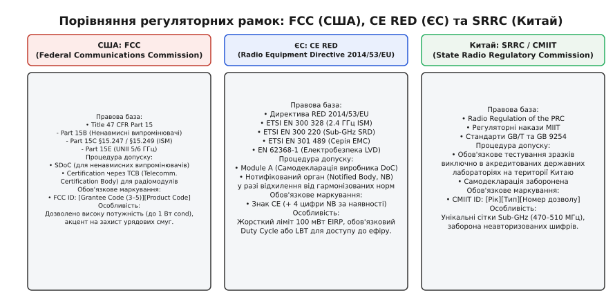
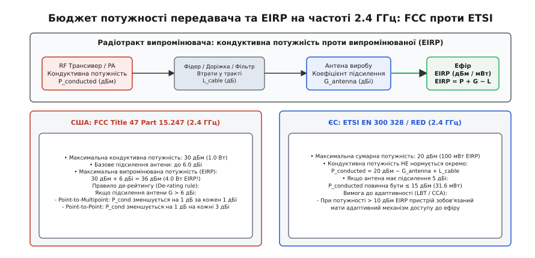
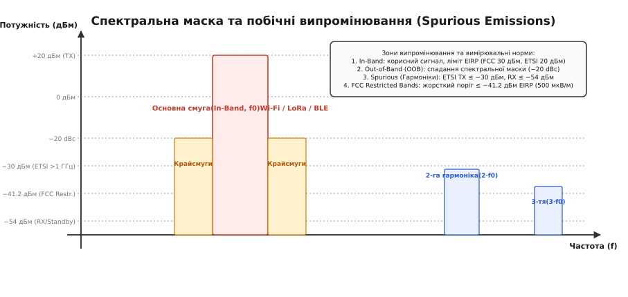
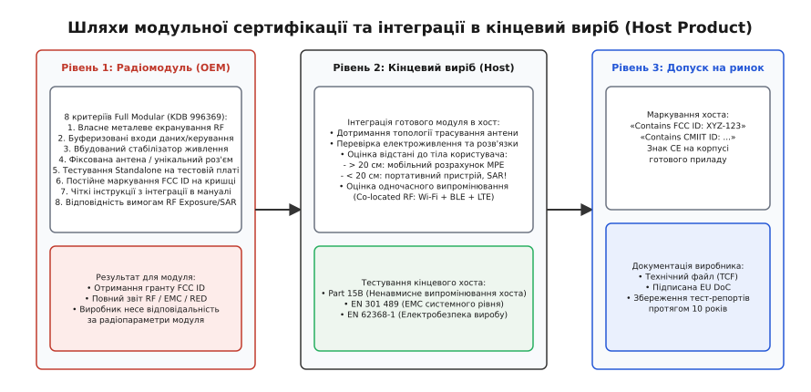

# Радіосертифікація: FCC, CE, SRRC

<preknowlist>
- [ISM-діапазони](topic:communications/ism-bands) — неліцензовані частотні смуги для промислового, наукового та медичного обладнання.
- [Бюджет лінії зв'язку](topic:communications/link-budget) — розрахунок балансу потужності передавача, підсилення антен та чутливості приймача.
- [Коефіцієнт підсилення антени](topic:communications/antenna-gain) — спрямованість випромінювання відносно ізотропного випромінювача (dBi) та диполя (dBd).
- [Радіочастотний модуль](topic:communications/rf-module) — апаратна реалізація бездротового трансивера з інтегрованими колами узгодження.
</preknowlist>

Партія з десяти тисяч комерційних бездротових контролерів з вбудованим модулем Wi-Fi та телеметрією 868 МГц прибуває до митного термінала в Роттердамі. Під час вибіркової перевірки інспекція радіонагляду виявляє, що в заводській прошивці вихідна потужність передавача 2.4 ГГц встановлена на рівні +22 дБм кондуктивної потужності, а зовнішня колінеарна антена має підсилення +5 дБі. Сумарна еквівалентна ізотропно-випромінювана потужність (EIRP) становить +27 дБм (500 мВт), що у п'ять разів перевищує гранично допустимий європейський ліміт 100 мВт (+20 дБм). Одночасно аналізатор фіксує, що телеметричний передавач 868 МГц транслює пакети кожні три секунди без прослуховування ефіру, порушуючи норматив робочого циклу 1%, а друга гармоніка на частоті 4.88 ГГц потрапляє у смугу авіаційної радіолокації без належного придушення. Вся партія вартістю пів мільйона євро конфіскується, імпортер отримує штраф у 150 000 євро, а торговельну марку вносять до реєстру небезпечної продукції з повною забороною продажу на території ЄС.

Цей сценарій демонструє фундаментальну інженерну істину: бездротовий пристрій не є закінченим продуктом доти, доки він не отримав юридичного права випромінювати електромагнітні хвилі у цільовому географічному регіоні. Процес підтвердження відповідності радіоелектронного обладнання вимогам законів, спектральних масок, норм електромагнітної сумісності (EMC) та безпеки людини називається радіосертифікацією.

Історію формування міжнародного радіорегулювання — від радіокатастрофи «Титаніка» та Берлінських радіотелеграфних конференцій до відкриття ISM-діапазонів у 1985 році та ухвалення сучасної європейської директиви RED — викладено в [історичному нарисі радіорегулювання](topic:communications/regulatory-radio-certification/hist-spectrum-regulation.md).

---

### Світові регуляторні ландшафти: FCC, CE RED та SRRC

Фізичний простір поширення радіохвиль єдиний, проте політичний та правовий поділ світу вимагає дотримання трьох головних регуляторних парадигм: північноамериканської (FCC), європейської (CE RED) та східноазійської (SRRC).


*Порівняння регуляторних рамок: правові бази, процедури допуску та обов'язкове маркування обладнання для ринків США, ЄС та Китаю*

#### 1. Сполучені Штати Америки: Федеральна комісія зі зв'язку (FCC)
Регуляторною основою в США є Звід федеральних нормативних актів (англ. *Code of Federal Regulations*, CFR), зокрема **Title 47 CFR**:
- **Part 15 Subpart B (Unintentional Radiators):** Регулює цифрові пристрої, які генерують високочастотні сигнали для внутрішньої роботи (тактові генератори мікроконтролерів, шини пам'яті), але не мають на меті випромінювати радіохвилі в ефір. Для них застосовується процедура декларації відповідності постачальника (англ. *Supplier's Declaration of Conformity*, SDoC).
- **Part 15 Subpart C (§15.247, §15.249):** Регулює навмисні випромінювачі (англ. *Intentional Radiators*) у неліцензованих смугах ISM (902–928 МГц, 2400–2483.5 МГц, 5725–5850 МГц), включаючи системи цифрової модуляції (DTS — Wi-Fi, BLE) та системи стрибкоподібної зміни частоти (FHSS).
- **Part 15 Subpart E (§15.401–§15.407):** Встановлює вимоги до неліцензованих пристроїв національної інформаційної інфраструктури (U-NII) у діапазонах 5 ГГц та 6 ГГц (Wi-Fi 5, 6, 6E, 7).

Для всіх навмисних випромінювачів FCC вимагає проходження процедури сертифікації (Certification). Виробник зобов'язаний протестувати виріб в акредитованій лабораторії (ISO/IEC 17025) та подати пакет документів уповноваженому приватному органу сертифікації телекомунікацій — **TCB (Telecommunication Certification Body)**. Орган TCB реєструє унікальний ідентифікатор **FCC ID** у базі даних FCC Equipment Authorization System (EAS), після чого видається офіційний Грант авторизації (Grant of Equipment Authorization).

#### 2. Європейський Союз: Директива про радіообладнання (CE RED 2014/53/EU)
У Європейському Союзі діє принцип «Нового підходу» (New Approach), юридично закріплений у Директиві **RED 2014/53/EU**. Директива визначає чотири базові суттєві вимоги (англ. *Essential Requirements*):
- **Стаття 3.1(a) Здоров'я та безпека:** Вимагає захисту людей від ураження електричним струмом, перегріву та надмірного електромагнітного опромінення (стандарти EN IEC 62368-1, EN 50663, EN 50566).
- **Стаття 3.1(b) Електромагнітна сумісність (EMC):** Вимагає, щоб пристрій не створював завад іншому обладнанню та мав достатню стійкість до зовнішніх електромагнітних завад (серія стандартів ETSI EN 301 489).
- **Стаття 3.2 Ефективне використання радіочастотного спектра:** Вимагає випромінювання суворо в межах спектральної маски, дотримання лімітів потужності та наявності стійких приймальних трактів (стандарти ETSI EN 300 328 для 2.4 ГГц, ETSI EN 301 893 для 5 ГГц, ETSI EN 300 220 для Sub-GHz SRD).
- **Стаття 3.3 Спеціальні вимоги (Кібербезпека та інтерфейси):** Обов'язковий захист мережевої інфраструктури, персональних даних та уніфікований зарядний порт USB-C.

Якщо виробник повністю застосовує гармонізовані стандарти ETSI, він має право використати процедуру **Module A (Internal Production Control)**: самостійно скласти Технічний файл (TCF), підписати Декларацію про відповідність (EU DoC) та нанести маркування `CE`. Залучення Нотифікованого органу (Notified Body) потрібне лише за відсутності або відхилення від гармонізованих стандартів.

#### 3. Китай: Державна комісія з радіорегулювання (SRRC / CMIIT)
У Китайській Народній Республіці діє сувора державна дозвільна система. Виробник зобов'язаний отримати сертифікат схвалення типу радіообладнання (Radio Transmission Equipment Type Approval) від Міністерства промисловості та інформатизації (MIIT). Самодекларація повністю виключена: зразки продукції в обов'язковому порядку доставляються до Китаю і проходять тестування в державних лабораторіях (SRTC/CTTL). На сертифікований виріб наноситься номер **CMIIT ID**.

#### 4. Динамічний вибір частоти (DFS) та захист метеорологічних радарів у діапазоні 5 ГГц
У діапазонах 5250–5350 МГц (U-NII-2A) та 5470–5725 МГц (U-NII-2C) неліцензовані пристрої Wi-Fi ділять спектр із військовими та цивільними метеорологічними доплерівськими радарами (зокрема радарами виявлення зсуву вітру в аеропортах TDWR). Обидва регулятори (FCC Part 15.407 та ETSI EN 301 893) вимагають обов'язкової апаратно-програмної реалізації двох механізмів:
- **Динамічний вибір частоти (Dynamic Frequency Selection, DFS):** Перед виходом в ефір пристрій зобов'язаний прослуховувати обраний канал протягом 60 секунд (Channel Availability Check, CAC). Якщо за цей час зафіксовано радарний радіоімпульс зі специфічним патерном повторення (PRF), передавач негайно блокує канал і перемикається на іншу частоту. Якщо радар виявлено під час активної передачі, пристрій зобов'язаний повністю припинити трансляцію протягом 10 секунд (Channel Move Time) і не повертатися на цей канал щонайменше 30 хвилин (Non-Occupancy Period).
- **Керування потужністю передавача (Transmit Power Control, TPC):** Пристрій повинен мати динамічне регулювання вихідної потужності для зниження середнього рівня випромінювання щонайменше на 3 дБ (у ЄС для клієнтських терміналів) або 6 дБ (для точок доступу), коли відстань до базової станції мала і максимальна енергія не потрібна.

#### 5. Захист прошивки та програмно-визначені радіосистеми (SDR Firmware Lock)
Сучасні трансивери мають програмне налаштування частот і потужності (Software Defined Radio, SDR). Це створює регуляторний ризик: кінцевий користувач може змінити конфігураційні файли (наприклад, драйвер `ath9k` або регіональний файл `wireless-regdb` у Linux), щоб примусово розблокувати заборонені частоти чи підвищити потужність передавача понад ліміт 1 Вт.

FCC (керівництво KDB 594280) та Директива RED (Стаття 3.3(i)) вимагають обов'язкового захисту прошивки (Software Security Requirements):
- Виробник зобов'язаний реалізувати криптографічну перевірку цілісності прошивки (Secure Boot та цифрові підписи RSA/ECDSA);
- Користувацький інтерфейс (Web UI, SSH, AT-команди) не повинен містити недокументованих інженерних команд для обходу регіональних таблиць Regulatory Domain;
- Радіомодуль зобов'язаний апаратно або через зашитий у захищену пам'ять OTP (One-Time Programmable) блок обмежувати максимальну амплітуду вихідного підсилювача потужності.

Детальне зіставлення технічних параметрів, допустимих частотних сіток та вимог до маркування для ринків США, Європи та Азії наведено в [порівняльному аналізі регуляторних систем](topic:communications/regulatory-radio-certification/comp-regulatory-frameworks.md).

---

### Бюджет потужності: кондуктивна потужність проти випромінюваної (EIRP)

Головна технічна розбіжність між регуляторами полягає у точці вимірювання та лімітуванні потужності передавача.


*Бюджет потужності передавача та EIRP на частоті 2.4 ГГц: порівняння американського підходу FCC (контроль на виході чіпа) та європейського ETSI (контроль сумарного випромінювання в ефір)*

#### 1. Фізична модель радіотракту
Вихідний радіочастотний каскад генерує кондуктивну потужність (англ. *Conducted Power*, `P_cond`). Сигнал проходить через друковані доріжки, фільтри гармонік, антенні перемикачі та коаксіальні фідери, втрачаючи частку енергії `L_cable`, після чого надходить до антени. Антена фокусує електромагнітну енергію в просторі з коефіцієнтом підсилення `G_ant` (дБі).

Еквівалентна ізотропно-випромінювана потужність (англ. *Equivalent Isotropically Radiated Power*, EIRP) визначає еквівалентну потужність ненаправленого випромінювача:
```
EIRP = P_cond - L_cable + G_ant
```

У європейських субгігагерцових стандартах використовується еквівалентна випромінювана потужність відносно напівхвильового диполя (англ. *Effective Radiated Power*, ERP):
```
ERP = EIRP - 2.15
```

#### 2. Протистояння лімітів на 2.4 ГГц: 4 Вт (США) проти 100 мВт (ЄС)
У смузі 2400.0–2483.5 МГц регуляторні вимоги демонструють 40-кратну різницю в дозволеній випромінюваній потужності:
- **FCC Part 15.247 (США):** Нормує кондуктивну потужність безпосередньо на вихідному роз'ємі чіпа — до **30 дБм (1.0 Вт)** для систем цифрової модуляції (DTS) із базовим підсиленням антени до **6.0 дБі**. Це дає максимальну результуючу потужність в ефірі до **36 дБм (4.0 Вт EIRP)**.
  - *Правило де-рейтингу (De-rating Rule):* Якщо коефіцієнт підсилення антени перевищує 6.0 дБі у з'єднаннях «точка–багатоточка» (Point-to-Multipoint), кондуктивна потужність передавача повинна бути зменшена на 1 дБ за кожен 1 дБі перевищення. У з'єднаннях «точка–точка» (Point-to-Point) на 2.4 ГГц потужність зменшується лише на 1 дБ на кожні 3 дБі перевищення.
- **ETSI EN 300 328 (Європейський Союз):** Встановлює абсолютну межу сумарного випромінювання на рівні **20 дБм (100 мВт EIRP)** незалежно від архітектури антени. Якщо розробник встановлює спрямовану антену з підсиленням +8 дБі, кондуктивна потужність передавача повинна бути примусово обмежена на рівні `20 - 8 = +12 дБм (15.8 мВт)`.

Математичні формули перерахунку одиниць, аналітичні виведення меж еквівалентного випромінювання та приклади розрахунку бюджету лінії зв'язку наведено у [математичному довіднику радіовипромінювання](topic:communications/regulatory-radio-certification/math-eirp-sar-budget.md).

---

### Часові обмеження та правила доступу до ефіру: Duty Cycle, Dwell Time та LBT

Оскільки неліцензовані смуги ISM ділять між собою мільйони незалежних пристроїв, регулятори встановлюють жорсткі часові правила поведінки в ефірі для запобігання монополізації спектра.

```
Правила доступу до середовища за регіонами:
+-----------------------+-----------------------------+-----------------------------+-----------------------------+
| Регіон / Стандарт     | Діапазон частот             | Базове обмеження доступу    | Механізм заміни обмеження   |
+-----------------------+-----------------------------+-----------------------------+-----------------------------+
| ЄС: ETSI EN 300 220   | 868.0 – 868.6 МГц (G1)      | Duty Cycle ≤ 1% (36 с/год)  | LBT + AFA (збільшення часу) |
|                       | 869.4 – 869.65 МГц (G3)     | Duty Cycle ≤ 10% (360 с/год)| Потужність до 500 мВт ERP   |
| США: FCC Part 15.247  | 902.0 – 928.0 МГц           | Dwell Time ≤ 400 мс (FHSS)  | Немає ліміту Duty Cycle %   |
| ЄС: ETSI EN 300 328   | 2400.0 – 2483.5 МГц         | Обов'язковий LBT при >10 дБм| Non-adaptive при ≤ 10 дБм   |
| Японія: ARIB STD-T108 | 920.5 – 928.0 МГц           | Обов'язковий LBT (5 мс CCA) | Потужність до 20 мВт / 250 мВт|
+-----------------------+-----------------------------+-----------------------------+-----------------------------+
```

1. **Коефіцієнт заповнення (Duty Cycle) у Європі (ETSI EN 300 220 / ERC 70-03):**
   У субгігагерцових смугах 868 МГц радіопристрій не має права транслювати безперервно. Робочий цикл визначається як частка часу активної передачі протягом будь-якого 1-годинного вікна спостереження (`T_obs = 3600 с`). У піддіапазоні 868.0–868.6 МГц ліміт становить 1% (максимум 36 секунд сумарної передачі за годину). Якщо датчик надсилає пакет тривалістю 360 мс, він зобов'язаний витримувати паузу мовчання щонайменше 35.64 секунди перед наступним виходом в ефір на цій самій підсмузі.
2. **Прослуховування перед передачею (Listen Before Talk, LBT):**
   Як альтернатива жорсткому обмеженню Duty Cycle, стандарти дозволяють використання механізму LBT у поєднанні з адаптивною зміною частоти (Adaptive Frequency Agility, AFA). Перед початком трансляції радіоприймач сканує канал протягом фіксованого часу (Clear Channel Assessment, CCA — типово 5 мс). Якщо виміряний рівень енергії перевищує встановлений поріг (наприклад, −85 дБм), канал вважається зайнятим, передача блокується, а пристрій здійснює випадкову затримку (Backoff) або перемикається на інший вільний канал.
3. **Час перебування на каналі (Dwell Time) у США (FCC Part 15.247):**
   У США на частоті 915 МГц регулятор відмовляється від відсоткового ліміту Duty Cycle на користь обов'язкового використання псевдовипадкової стрибкоподібної зміни частоти (FHSS). Якщо система використовує 50 або більше каналів стрибків, середній час перебування на будь-якому окремому каналі не повинен перевищувати **400 мс** протягом будь-якого **20-секундного** періоду спостереження. Це вимагає від розробників протоколів (зокрема LoRaWAN та фірмових телеметричних лінків БПЛА) розбиття великих пакетів даних на короткі фрагменти при роботі на низьких бітрейтах (високих коефіцієнтах розширення SF11–SF12).

---

### Вимірювання побічних випромінювань та спектральної маски

Жоден реальний радіопередавач не здатний випромінювати енергію виключно на призначеній несучій частоті. Нелінійність підсилювачів потужності, фазові шуми гетеродинів та гармоніки тактових генераторів породжують небажані електромагнітні емісії.


*Спектральна маска випромінювання: корисний сигнал основної смуги (In-Band), спадання на краях робочого каналу (Band Edges) та норми придушення гармонічних завад (Spurious Emissions)*

#### 1. Класифікація спектральних областей
- **Основна смуга (In-Band):** Робочий канал передавача, де зосереджена корисна модульована інформація. Вимірюється ширина смуги (Occupied Bandwidth, OBW) за рівнем 99% енергії та смуга пропускання DTS за рівнем −6 dB (повинна бути не менше 500 кГц за правилами FCC Part 15.247).
- **Позасмугові випромінювання (Out-of-Band, OOB / Band Edges):** Область спектра, безпосередньо прилегла до робочого каналу. Регулятори вимагають швидкого спадання амплітуди: за стандартами FCC рівень випромінювання на краях смуги (2400.0 МГц знизу та 2483.5 МГц зверху) має бути придушений щонайменше на **20 dBc** (або на 30 dBc при вимірюванні RMS) відносно максимального піку несучої.
- **Побічні випромінювання (Spurious Emissions):** Гармоніки несучої частоти (2f0, 3f0, 4f0), паразитні коливання та продукти змішування, віддалені від робочого каналу.

#### 2. Смуги обмеженого використання FCC (Restricted Bands, Title 47 CFR §15.205)
Найнебезпечнішою пасткою для радіоінженерів є перелік смуг обмеженого використання FCC §15.205. У цих смугах (де працюють служби безпеки польотів, супутниковий зв'язок пошуку та порятунку, радіоастрономія та військові радари) діє жорсткий абсолютний ліміт напруженості поля за стандартом FCC Part 15.209:
- Напруженість електричного поля на вимірювальній відстані 3 метри не повинна перевищувати **500 мкВ/м** (що в перерахунку на ізотропну потужність відповідає **−41.2 дБм EIRP**).
- Для передавача Wi-Fi на 11-му каналі (2462 МГц) верхній край спектрального розширення потрапляє безпосередньо у смугу обмеженого використання 2483.5–2500.0 МГц. Якщо вихідний каскад генерує +25 дБм, придушення сигналу на інтервалі всього 21.5 МГц має становити понад `25 - (-41.2) = 66.2 дБ`! Без програмного зменшення потужності на крайніх каналах (Power Backoff) пройти сертифікацію неможливо.

#### 3. Вимоги європейського стандарту ETSI EN 300 328
Європейський стандарт визначає допустимі рівні побічних випромінювань у кондуктивному та випромінюваному просторі:
- **У режимі передачі (TX Mode):**
  - Частоти 30 МГц – 1000 МГц: максимум **−36 дБм** (вимірювання з RBW = 100 кГц);
  - Частоти 1 ГГц – 12.75 ГГц: максимум **−30 дБм** (вимірювання з RBW = 1 МГц).
- **У режимі прийому та очікування (RX / Standby Mode):**
  - Частоти 30 МГц – 1000 МГц: максимум **−54 дБм** (RBW = 100 кГц);
  - Частоти 1 ГГц – 12.75 ГГц: максимум **−47 дБм** (RBW = 1 МГц).

#### 4. Методологія випробувань у напівбезвідлунній камері (SAC)
Вимірювання побічних випромінювань у просторі (Radiated Spurious Emissions) проводяться в екранованій напівбезвідлунній камері (Semi-Anechoic Chamber, SAC) на стандартизованій дистанції 3 або 10 метрів:
- Зразок встановлюється на діелектричному столі (висотою 0.8 м для частот до 1 ГГц та 1.5 м для частот вище 1 ГГц за стандартом ANSI C63.10), який обертається на 360 градусів під час безперервної передачі.
- Вимірювальна калібрована антена на щоглі автоматично переміщується по висоті від 1 до 4 метрів для фіксації конструктивної інтерференції прямої та відбитої від провідної підлоги хвиль.
- Вимірювання повторюються для горизонтальної та вертикальної поляризацій антени. Фіксується максимальне просторове значення напруженості поля (Quasi-Peak для частот до 1 ГГц та Average/Peak для частот понад 1 ГГц), яке зіставляється з нормативними порогами.

Програмні алгоритми автоматизованої верифікації спектральної маски, аналіз вибору вимірювальних фільтрів (RBW/VBW) та роботу з піковими і квазіпіковими детекторами реалізовано у [програмному проекті аналізу спектральної маски](topic:communications/regulatory-radio-certification/proj-spurious-emissions-mask.md).

---

### Електромагнітна безпека для людини: SAR проти MPE

Оцінка біологічного впливу радіовипромінювання на організм людини є обов'язковою складовою сертифікації (Стаття 3.1(a) RED у ЄС та Title 47 CFR §1.1310/§2.1093 у США). Критерій випробувань визначається виключно відстанню між випромінювальною антеною та тілом користувача в умовах штатної експлуатації.

```
Класифікація пристроїв за оцінкою електромагнітної безпеки:
+-----------------------+-----------------------------+-----------------------------+-----------------------------+
| Критерій              | Портативні пристрої         | Мобільні пристрої           | Стаціонарні пристрої        |
+-----------------------+-----------------------------+-----------------------------+-----------------------------+
| Експлуатаційна відст. | d ≤ 20 см до тіла людини    | d > 20 см до тіла людини    | d > 20 см (жорсткий монтаж) |
| Типові приклади       | Смартфони, носимі трекери,  | Автомобільні термінали,     | Базові станції, антени на   |
|                       | натільні радіостанції, пульти| роутери, модулі БПЛА        | дахах, промислові шлюзи     |
| Метод оцінки безпеки  | Вимірювання SAR (Вт/кг)     | Розрахунок MPE (Вт/м²)      | Розрахунок MPE (Вт/м²)      |
| Ліміт США (FCC)       | 1.6 Вт/кг (на 1 г тканини)  | 1.0 мВт/см² (на 2.4 ГГц)    | 1.0 мВт/см² (на 2.4 ГГц)    |
| Ліміт ЄС (ICNIRP)     | 2.0 Вт/кг (на 10 г тканини) | 10.0 Вт/м² (на 2.4 ГГц)     | 10.0 Вт/м² (на 2.4 ГГц)     |
+-----------------------+-----------------------------+-----------------------------+-----------------------------+
```

#### 1. Питомий коефіцієнт поглинання (Specific Absorption Rate, SAR)
SAR визначає швидкість поглинання електромагнітної енергії одиницею маси біологічної тканини й вимірюється у ватах на кілограм (Вт/кг):
```
SAR = (σ · |E|²) / ρ
```
де `σ` — питома електропровідність біологічної тканини (См/м), `E` — напруженість електричного поля всередині тканини (В/м), а `ρ` — густина тканини (кг/м³).

Лабораторне вимірювання SAR — це складний фізичний експеримент:
- Виріб закріплюється на манекені з діелектричного пластику (SAM phantom для голови або плоский фантом для тулуба), наповненому спеціальною рідиною, яка за діелектричною проникністю та провідністю точно імітує людські тканини на тестовій частоті.
- Пристрій переводиться у режим безперервної передачі з максимальною потужністю на всіх підтримуваних каналах.
- Прецизійний роботизований маніпулятор занурює ізотропний трикоординатний вимірювальний зонд у рідину і виконує тривимірне просторове сканування з кроком у кілька міліметрів для локалізації точки максимального тепловиділення (Hotspot).
- Програма інтегрує густину поглинання по кубічному об'єму масою 1 грам (стандарт FCC) або 10 грамів (стандарт ЄС/ICNIRP).

#### 2. Звільнення від тестування SAR (SAR Test Exclusion)
Через високу вартість лабораторного тестування SAR (від 5 000 до 15 000 доларів за кожен радіоінтерфейс) інженери прагнуть проектувати малопотужні пристрої так, щоб вони підпадали під математичне звільнення від тестування:
- **FCC KDB 447498:** Пристрій звільняється від тестування SAR, якщо безрозмірний показник `(P_max_mW / d_mm) · √(f_GHz) ≤ 3.0` для голови/тулуба (або `≤ 7.5` для кінцівок на відстані `d ≤ 50 мм`).
- **Європейський стандарт EN 50663:** Пристрій повністю звільняється від оцінки SAR для будь-якої відстані до тіла (включаючи нульову дистанцію), якщо середньозважена за часом випромінювана потужність передавача не перевищує **20 мВт (13 дБм)**.

#### 3. Максимально допустиме опромінення (Maximum Permissible Exposure, MPE)
Для пристроїв, що експлуатуються на відстані понад 20 см від тіла (роутери, стаціонарні радіомодеми, бортові передавачі дронів), замість SAR застосовується розрахунок густини потоку потужності у дальній зоні:
```
S = EIRP_lin / (4 · π · R²)
```
Інженер розраховує мінімальну безпечну дистанцію (Compliance Distance `R_safe`), на якій густина потоку потужності опускається нижче нормативного ліміту `S_limit` (10 Вт/м² у ЄС або 1.0 мВт/см² у США). Ця відстань обов'язково зазначається у керівництві користувача виробу.

---

### Модульна сертифікація (Modular Approval) проти сертифікації хост-виробу

Для оптимізації бюджету та термінів виведення складних виробів на ринок світова радіоіндустрія використовує концепцію попереднього модульного схвалення.


*Шляхи сертифікації: від базового радіомодуля через модульне схвалення (Full Modular Approval) до інтеграції в кінцевий хост-пристрій з маркуванням*

#### 1. Вісім золотих критеріїв повного модульного схвалення (FCC KDB 996369)
Щоб радіомодуль (OEM Module — наприклад, ESP32, nRF52840, SX1262) міг отримати сертифікат **Full Modular Approval**, його апаратна конструкція повинна відповідати 8 обов'язковим технічним вимогам:
1. **Власне радіочастотне екранування:** Високочастотна частина чіпа, синтезатор та підсилювач потужності мають бути повністю накриті металевим екраном, припаяним по всьому периметру до земляного полігону плати модуля.
2. **Буферизовані цифрові входи:** Усі лінії керування та передачі даних (UART, SPI, GPIO) повинні мати буферні каскади для запобігання впливу сигналів материнської плати хоста на модуляцію передавача.
3. **Вбудований стабілізатор живлення:** Модуль повинен містити власний внутрішній регулятор напруги (LDO або DC-DC), щоб коливання напруги живлення хоста не спричиняли дрейфу вихідної потужності чи частоти.
4. **Фіксована антена або унікальний роз'єм:** Модуль повинен мати інтегровану друковану/керамічну антену або унікальний радіочастотний роз'єм (U.FL, MHF4, RP-SMA), який унеможливлює підключення кінцевим користувачем несертифікованої антени зі збільшеним підсиленням.
5. **Автономне тестування (Standalone Configuration):** Під час лабораторних випробувань модуль має демонструвати відповідність нормам у підключенні до відкритої тестової плати (Test Jig) без додаткового екранування зовнішнім корпусом.
6. **Постійне маркування:** Номер FCC ID / CMIIT ID має бути незмивно нанесений безпосередньо на металеву кришку екрана або захисну маску модуля.
7. **Чітке керівництво з інтеграції (OEM Integration Manual):** Документація повинна містити точні креслення трасування доріжок 50 Ом, вимоги до живлення та перелік дозволених типів антен.
8. **Відповідність вимогам опромінення (RF Exposure):** Модуль повинен відповідати нормам MPE/SAR у standalone-конфігурації.

#### 2. Інтеграція модуля в кінцевий пристрій (Host Product)
Коли виробник інтегрує попередньо сертифікований радіомодуль у свій кінцевий виріб (Host), він звільняється від необхідності повторного тестування радіотракту за статтями Part 15C або ETSI EN 300 328.

Проте інтегратор зобов'язаний виконати такі обов'язкові процедури:
- **Випробування на ненавмисні випромінювання (FCC Part 15B / ETSI EN 301 489):** Кінцевий хост-пристрій у зборі (з процесором, дисплеєм, імпульсним живленням та підключеною периферією) тестується в безвідлунній камері як цифровий пристрій Class B (побутовий) або Class A (промисловий).
- **Оцінка співрозташованих передавачів (Co-located Transmitters):** Якщо в одному корпусі одночасно функціонують два чи більше модулів (наприклад, Wi-Fi + Bluetooth + стільниковий 4G/LTE модем), розраховується сумарний кумулятивний коефіцієнт MPE або виконується оцінка просторового розділення SPLSR для виключення взаємного теплового перегріву тканин.
- **Маркування кінцевого виробу:** На заводський шильдик хоста обов'язково наноситься напис:
  ```
  «Contains FCC ID: ABC-12345»
  «Contains IC: 1234A-12345»
  «Contains CMIIT ID: 2026FP1234»
  ```
- **Складання підсумкової Декларації про відповідність (EU DoC):** Виробник кінцевого виробу бере на себе повну юридичну відповідальність за відповідність готового приладу всім директивам ЄС (RED, RoHS, WEEE, LVD).

#### 3. Зміни в конструкції: Class I та Class II Permissive Change
Якщо після проходження сертифікації виробник вносить зміни в конструкцію, правила FCC Title 47 CFR §2.1043 визначають порядок дій:
- **Class I Permissive Change (C1PC):** Зміни, що не впливають на радіовипромінювання (заміна пасивних компонентів на еквівалентні, зміна форми пластикового корпусу). Сповіщення FCC не вимагається.
- **Class II Permissive Change (C2PC):** Зміни, що можуть погіршити радіопараметри, але зберігають відповідність лімітам (заміна антени на інший конструктивний тип з меншим/рівним підсиленням, зменшення відстані до тіла людини `d < 20 см`, що вимагає вимірювання SAR, використання модуля без екрана в новому хості). Вимагає проведення випробувань, подання заявки в TCB та оновлення гранту без зміни номера FCC ID.

Повний перелік обов'язкових розділів Технічного файла (TCF), зразок тексту Декларації про відповідність ЄС, реєстр стандартів та детальний чеклист інтеграції за керівництвом FCC KDB 996369 наведено у [нормативно-процедурному довіднику](topic:communications/regulatory-radio-certification/api-certification-workflow.md).

---

> 🔧 **Навіщо це.**
>
> 1. **Вибір сертифікованого радіомодуля економить бюджет та час:** Використання готового OEM-модуля з сертифікатами Full Modular Approval (FCC ID, CE RED) скорочує витрати на виведення продукту на ринок з $30 000–$50 000 до $3 000–$5 000 (лише тестування хоста на Part 15B та EMC) і скорочує термін сертифікації з 4 місяців до 2 тижнів.
> 2. **Динамічне керування доменами (Regulatory Domain / Country Code):** Прошивка радіопристрою повинна містити таблицю регіональних обмежень. Під час конфігурації приладу в ЄС потужність Wi-Fi автоматично затискається до +20 дБм EIRP, вмикається обов'язковий LBT та DFS на 5 ГГц, а в США дозволяється вихідна потужність до +30 дБм conducted без обмеження Duty Cycle на 915 МГц.
> 3. **Пре-сертифікаційне тестування (Pre-Compliance) рятує від провалу:** Попереднє сканування спектра у власній лабораторії за допомогою аналізатора спектра та недорогої антени дозволяє виявити перевищення на краях смуг (Band Edges) або просочування гармонік DC-DC перетворювача ще на етапі прототипу, уникаючи повторної оплати дорогих випробувань в акредитованому центрі.
