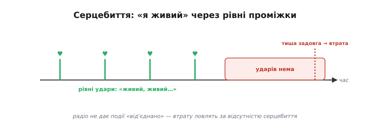
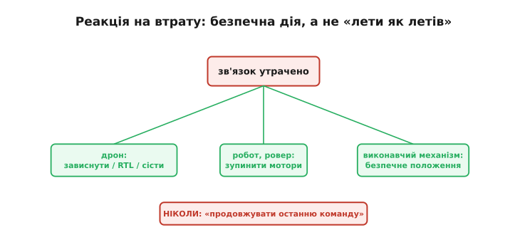
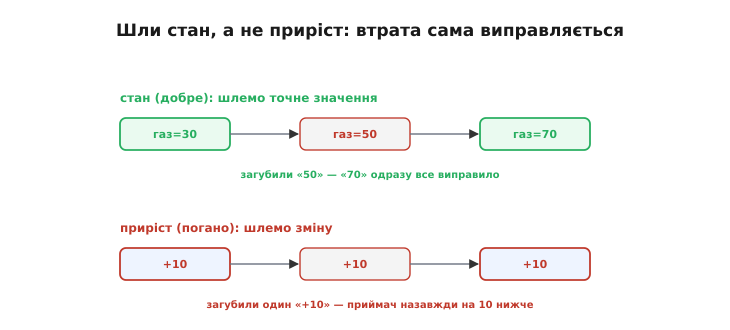
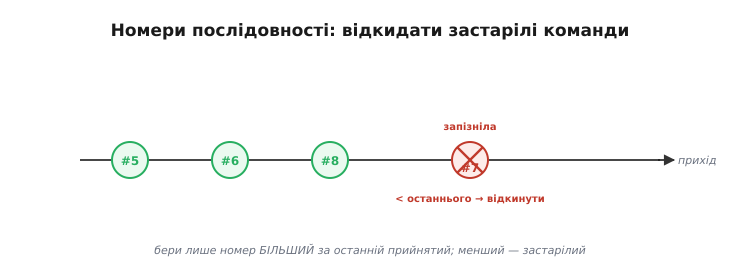
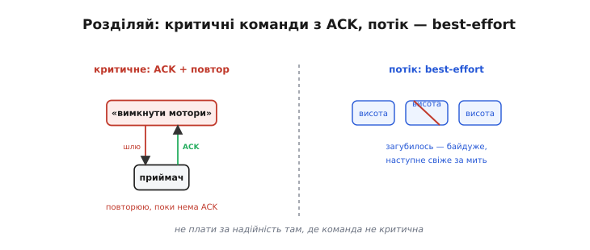
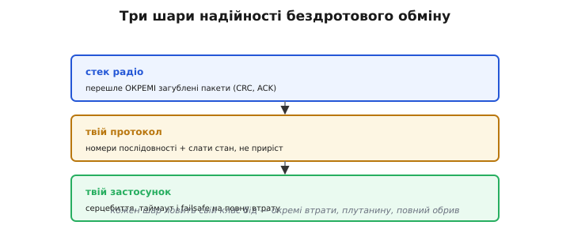

# Надійний обмін

Зручні бездротові обгортки на кшталт [Wi-Fi](book:communications/wifi) чи [Bluetooth](book:communications/bluetooth-spp) ховають ненадійність радіо — але ховати не означає скасувати: зв'язок **зникне**, питання лише коли. Тому надійну бездротову систему будують **навколо** цього факту: не сподіваючись на «гарний сигнал», а заздалегідь вирішивши, що пристрій робитиме, коли сигналу не стане. Прийоми такого проєктування — від виявлення втрати до безпечної реакції — складаються в невелику, але строгу систему, де кожна ланка закриває свій клас бід.

### Серцебиття: «я живий»

Перше питання — **як узагалі помітити**, що зв'язок зник? Радіо рідко дає чітку подію «від'єднано» (це ж не дріт, який можна висмикнути). Тому втрату ловлять інакше: пристрій періодично шле короткий сигнал «я живий» — **серцебиття** (англ. *heartbeat*, «удар серця»), а той бік чекає його через рівні проміжки.


*Поки удари приходять — зв'язок є. Щойно ударів немає задовго — приймач робить висновок: зв'язок утрачено. Це спосіб виявити втрату за відсутністю сигналу, а не за якоюсь «подією».*

Серцебиття — універсальний прийом надійних систем. Той самий механізм лежить в основі протоколу телеметрії дронів [MAVLink](book:communications/mavlink-packet), де heartbeat — обов'язкова частина. Суть проста: **тиша теж несе інформацію** — якщо «живих» сигналів нема, значить, щось обірвалося.

### Виявлення за таймаутом

Технічно втрату виявляють **таймаутом** (англ. *timeout*, «вичерпання часу»): стежать за часом від останнього отриманого повідомлення, і якщо він перевищив поріг — запускають реакцію.


*У головному циклі ([неблокуючий патерн `millis()`](book:programming/nonblocking-time)): щоразу, як прийшло повідомлення, запам'ятовуємо час; якщо `millis() − lastMsg` перевищив TIMEOUT — викликаємо failsafe. Це той самий [watchdog](book:programming/watchdog)-підхід, лише для зв'язку.*

:::tabs
```cpp
// у головному циклі — неблокуюче стеження за зв'язком
if (gotMessage) lastMsg = millis();          // оновлюємо при кожному пакеті
if (millis() - lastMsg > TIMEOUT) {
    failsafe();                              // зв'язок утрачено → безпечна дія
}
```
```python
# у головному циклі — неблокуюче стеження за зв'язком
if got_message:
    last_msg = millis()                      # оновлюємо при кожному пакеті
if millis() - last_msg > TIMEOUT:
    failsafe()                               # зв'язок утрачено → безпечна дія
```
:::

Поріг `TIMEOUT` добирають із запасом, але без надмірності. Замало — і [випадкова втрата кількох пакетів](book:communications/on-chip-radio) (а вона буде) хибно спрацює як «втрата зв'язку». Забагато — і пристрій надто пізно зреагує на справжній обрив. Звичайний підхід: якщо серцебиття йде кожні 100 мс, дозволити **три** пропуски й поставити поріг ≈300 мс. Це той самий [**сторожовий таймер**](book:programming/watchdog) (watchdog), лише націлений на зв'язок.

> 🔧 **Навіщо це.** Один невдалий вибір `TIMEOUT` псує апарат у різні боки: занизький поріг сипле хибними failsafe серед нормального польоту (дрон раз по раз сам сідає на рівному місці), зависокий — лишає секунди некерованого руху після реального обриву. Тому поріг рахують від періоду серцебиття й закладеного числа пропусків, а не беруть «на око».

### Що робити при втраті: failsafe

Найголовніше рішення всієї теми — **що робити**, коли таймаут спрацював? Відповідь залежить від пристрою, але є одне непорушне правило.


*Дрон — зависнути, повернутися додому чи сісти. Робот або ровер — зупинити мотори. Виконавчий механізм — перейти в безпечне положення. А чого робити ніколи не можна — це «продовжувати останню команду»: апарат, що втратив зв'язок на повному газу й мчить далі, — найгірший можливий результат.*

Це кардинальне правило надійних систем: **відсутність команд — це теж команда, і вона має означати «безпечно зупинись»**. Інтуїтивна, але згубна помилка новачка — лишити пристрій «робити, що робив»: дрон полетить у невідомість, ровер вріжеться у стіну, маніпулятор зламає деталь. Правильний **failsafe** (англ. *fail-safe*, «безпечний за відмови») — це заздалегідь продумана **безпечна** реакція: зупинка, повернення, перехід у нейтраль. Саме наявність failsafe відрізняє іграшку від апарата, якому можна довірити рух у реальному світі.

### Шли стан, а не приріст

Від виявлення втрати варто перейти до **стійкості** самого протоколу. Потужний прийом тут — передавати **абсолютний стан**, а не **приріст**. Ідея тонка, але глибока.


*Угорі (добре): шлемо стан «газ=30», «газ=50», «газ=70». Загубили «50» — але наступне «70» одразу все виправило, бо приймач знає точне значення. Унизу (погано): шлемо приріст «+10», «+10», «+10». Загубили один «+10» — і приймач назавжди на 10 нижче, ніж мав бути: втрачений приріст не повернути.*

Різниця вирішальна для ненадійного каналу. Якщо ти шлеш **поточне значення** («швидкість = 50%», «кут = 30°»), то будь-яка загублена посилка **самовиправляється** наступною — вона несе повний стан, не залежний від попередніх. А якщо шлеш **зміну** («додай 10», «поверни на 5°»), то кожна втрата **накопичується** назавжди: загублений приріст ніколи не компенсується. Тому в надійних бездротових протоколах майже завжди передають **стан**, а не команди-прирости — це робить систему стійкою до неминучих втрат майже задарма.

### Номери послідовності

Радіо не лише губить пакети — воно може й [**переплутати** їхній порядок](book:communications/on-chip-radio). Старіша команда може прийти **після** свіжішої — і виконати її означало б відкотити стан назад. Рятують **номери послідовності** (англ. *sequence number*, порядковий номер).


*Команди нумерують: #5, #6, #8… А коли після #8 раптом приходить запізніла #7 — її ігнорують, бо вона старіша за вже прийняту. Правило: бери лише номер, більший за останній прийнятий; менший — застарілий, відкидай.*

Номери послідовності розв'язують одразу кілька бід: дають **відкидати застарілі** команди (як на рисунку), **помічати втрати** (пропуск у нумерації) і **відсіювати дублікати** (той самий номер двічі). Простий лічильник у заголовку пакета — і протокол перестає плутатися в часі, навіть коли мережа тасує посилки. На цьому ж лічильнику тримається й [підтвердження доставки](book:communications/reliable-link/proj-stop-and-wait.md): приймач відповідає, який номер він уже отримав.

### ACK для критичного, best-effort для потоку

Не всі повідомлення рівноцінні, і платити за надійність варто **вибірково**. Тут працює розрізнення [«best-effort проти надійного»](book:communications/on-chip-radio): критичні команди мусять дійти напевно, а безперервний потік можна й губити.


*Критичні команди («увімкнути мотори», «вимкнути», зміна режиму) шлють із підтвердженням і повторюють, поки не отримають ACK — вони мусять дійти. Потік (телеметрія, позиція, кут, відео) шлють best-effort: загубилось — байдуже, наступне свіже значення прийде за мить.*

Тут уперше з'являється **підтвердження** — наріжний камінь усього надійного обміну. Приймач, отримавши команду, шле назад короткий сигнал **ACK** (англ. *acknowledgement*, «підтвердження»): «дійшло». Якщо ACK не повернувся за відведений час, відправник **повторно передає** (англ. *retransmit*, «передати знову») ту саму команду — і так, поки не дочекається підтвердження. Дехто додає й зворотний сигнал **NACK** (англ. *negative acknowledgement*, «заперечне підтвердження»): приймач отримав пакет, але **зіпсований**, і просить повтор одразу, не чекаючи, поки в відправника вичерпається час. Цей цикл «шлю → чекаю ACK → не дочекався → повторюю» зветься **ARQ** (англ. *Automatic Repeat reQuest*, «автоматичний запит повтору») і є основою надійної доставки в будь-якій мережі — від [TCP](book:communications/tcp-vs-udp) до радіоканалу дрона.

Принцип ясний: **не плати за надійність там, де вона не потрібна, і не економ там, де команда мусить дійти**. Команду «роззброїти мотори» повторюй, поки не підтвердять (її втрата небезпечна); а поточну висоту чи кут шли просто потоком — одне старе значення нічого не варте проти свіжого. Змішувати ці два режими в одній системі — норма: рідкісні важливі команди надійно, часта телеметрія — як вийде.

### Підтвердження в дії: чекай ACK, повторюй за таймаутом

Найпростіша робоча схема ARQ — **stop-and-wait** (англ. «спинись і чекай»): відправ один пакет, спинись, чекай ACK; прийшов — шлеш наступний, не прийшов за `ACK_TIMEOUT` — шлеш той самий ще раз. Порахуймо її на конкретних числах.

**Умова.** Команда «роззброїти мотори» критична, тож шлемо її через stop-and-wait. Канал інколи губить і саму команду, і ACK у відповідь; зв'язок вважаємо мертвим після 5 марних спроб. Скільки разів і як довго прошивка слатиме команду, поки не здасться?

:::tabs
```cpp
// stop-and-wait ARQ: шлю критичну команду, поки не прийде ACK
// ACK_TIMEOUT — скільки чекати підтвердження; MAX_TRIES — стеля повторів
bool sendReliable(uint8_t seq, const Cmd& cmd) {
    for (int tries = 0; tries < MAX_TRIES; tries++) {
        sendPacket(seq, cmd);                 // 1) передаю (чи повторно передаю)
        uint32_t t0 = millis();
        while (millis() - t0 < ACK_TIMEOUT) { // 2) чекаю ACK з цим же номером
            if (gotAckFor(seq)) return true;  //    дійшло й підтверджено
        }
        // 3) тиша до таймауту → повтор тієї самої команди з тим самим seq
    }
    return false;                             // 4) MAX_TRIES марно → зв'язок мертвий
}

// ACK_TIMEOUT = 200 мс, MAX_TRIES = 5:
//   спроба 1 @ 0 мс    → тиша 200 мс
//   спроба 2 @ 200 мс  → тиша 200 мс
//   спроба 3 @ 400 мс  → тиша 200 мс
//   спроба 4 @ 600 мс  → тиша 200 мс
//   спроба 5 @ 800 мс  → тиша 200 мс
//   1000 мс: 5 спроб марно → return false → failsafe()
```
```python
# stop-and-wait ARQ: шлю критичну команду, поки не прийде ACK
# ACK_TIMEOUT — скільки чекати підтвердження; MAX_TRIES — стеля повторів
def send_reliable(seq, cmd):
    for _ in range(MAX_TRIES):
        send_packet(seq, cmd)                 # 1) передаю (чи повторно передаю)
        t0 = millis()
        while millis() - t0 < ACK_TIMEOUT:    # 2) чекаю ACK з цим же номером
            if got_ack_for(seq):
                return True                   #    дійшло й підтверджено
        # 3) тиша до таймауту → повтор тієї самої команди з тим самим seq
    return False                              # 4) MAX_TRIES марно → зв'язок мертвий

# ACK_TIMEOUT = 200 мс, MAX_TRIES = 5:
#   спроба 1 @ 0 мс    → тиша 200 мс
#   спроба 2 @ 200 мс  → тиша 200 мс
#   спроба 3 @ 400 мс  → тиша 200 мс
#   спроба 4 @ 600 мс  → тиша 200 мс
#   спроба 5 @ 800 мс  → тиша 200 мс
#   1000 мс: 5 спроб марно → return False → failsafe()
```
:::

Числа показують головний компроміс. Команда йде з **тим самим** номером `seq` на кожній спробі — тому навіть якщо загубився не пакет, а **ACK**, і приймач отримає команду двічі, він за номером послідовності впізнає дублікат і виконає її **один раз**. Стеля в 5 спроб по 200 мс дає рівно **1 секунду** на боротьбу, після чого прошивка чесно визнає обрив і йде у failsafe — замість того, щоб вічно слати в порожнечу. Тягни `ACK_TIMEOUT` нижче — швидше зреагуєш на втрату, але почнеш слати повтори ще до того, як справжній ACK устиг повернутися (зайвий трафік); підіймай — менше марних повторів, та довша «сліпа» затримка. Повний розбір цього циклу з обробкою дублікатів і номерами — у вставці нижче.

> ⚙️ Stop-and-wait ARQ у коді: номери, повтори, дублікати
> [Stop-and-wait у коді](book:communications/reliable-link/proj-stop-and-wait.md)

### Три шари надійності

Усі прийоми природно лягають у **три шари**, і кожен ловить свій клас бід.


*Стек радіо сам перешле окремі загублені пакети (CRC, ACK) — це сховано. Твій протокол додає номери послідовності й передачу стану замість приросту — стійкість до плутанини й втрат. Твій застосунок робить серцебиття, таймаут і failsafe — реакцію на повну втрату зв'язку. Кожен шар ловить свій клас бід.*

Ось чому надійність будують **шарами**, а не сподіваннями на «гарний сигнал». Нижній шар (стек) бере на себе **окремі** загублені пакети. Середній (твій протокол) робить дані **стійкими** до втрат і переплутування — номерами й передачею стану. Верхній (твій застосунок) ловить **повну** втрату зв'язку й безпечно реагує. Разом вони перетворюють принципово ненадійне радіо на пристрій, що поводиться **передбачувано** навіть у найгіршому випадку.

> 🔧 **Навіщо це.** Це чек-лист будь-якого серйозного бездротового пристрою: (1) **серцебиття** — щоб було за чим стежити; (2) **таймаут** — щоб помітити втрату; (3) **failsafe** — безпечна дія (ніколи не «як було»); (4) **стан замість приросту** — щоб втрати самовиправлялися; (5) **номери послідовності** — щоб не плутати час; (6) **ACK на критичне** — щоб важливе точно дійшло. Пройдешся цими шістьма пунктами — і твій пристрій переживе те, що неминуче станеться: зникнення зв'язку. Пропустиш failsafe — рано чи пізно матимеш некерований апарат.
