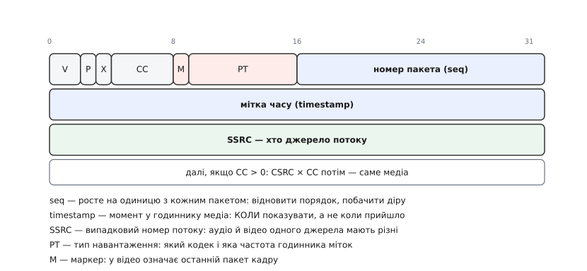
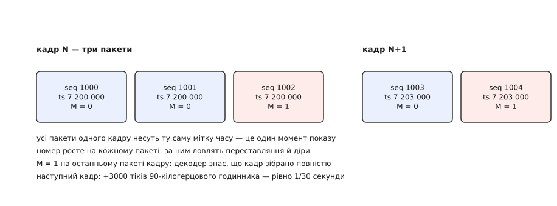
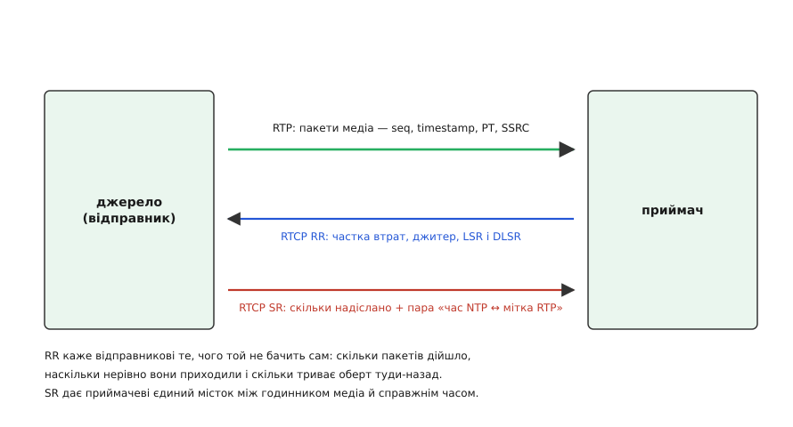
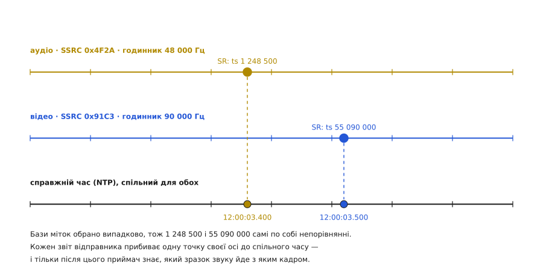

# RTP і RTCP: транспорт медіа поверх UDP

<preknowlist>
- [TCP проти UDP](topic:communications/tcp-vs-udp) — що UDP додає до IP лише порти й контрольну суму: ні порядку, ні повторів, ні гарантій доставки.
- [Канал і пакет](topic:communications/channel-band-packet) — що дані летять окремими пакетами, а мережа вільна їх загубити, переставити місцями чи затримати.
- [Проєктування пакета](topic:communications/packet-design) — що службові відомості живуть у заголовку з фіксованою розкладкою й коштують байтів у кожному пакеті.
- [Міжкадрове стиснення](topic:algorithms/inter-frame) — що стиснене відео складається з опорних і залежних кадрів, тож утрата шматка псує картинку аж до наступного опорного.
- [Затримка й надійність](topic:communications/latency-reliability) — що повторна відправка коштує часу, і для живого потоку цей час буває дорожчим за саму втрату.
</preknowlist>

Камера віддає тридцять кадрів на секунду. Кодер стискає кожен приблизно до сорока кілобайтів — а в одну UDP-датаграму без ризику фрагментації влізає близько тисячі чотирьохсот. Отже, кадр треба різати десь на тридцять шматків, і за секунду в мережу йде близько дев'ятисот датаграм. На тому боці приймач ловить їх — і не може зробити з цією купою нічого.

Він не знає, котрий шматок був раніше, бо UDP порядку не тримає: датаграма, що вийшла п'ятою, легко обжене четверту. Він не знає, де закінчився один кадр і почався наступний, — байти стиснутого потоку самі про це не кажуть. Він не знає, **коли** показувати те, що зібрав: якщо викидати кадр на екран тієї миті, коли він доїхав, зображення тремтітиме рівно так, як тремтить мережа. І коли датаграма пропаде, приймач цього навіть не помітить — просто склеїть сусідів і згодує декодерові сміття.

Перша спокуса — полагодити це надійністю: узяти [TCP](topic:communications/tcp-vs-udp), і хай він сам перепитує втрачене й вишиковує порядок. Спокуса хибна. Кадр живого відео має термін придатності: якщо його момент показу вже минув, доставлений кадр не потрібен нікому — його місце на екрані зайняте наступним. TCP же, побачивши діру, **затримає все, що прийшло після неї**, поки не дочекається повтору; замість одного зіпсованого кадру глядач отримає завмерлу картинку на цілий оберт туди-назад. Надійність тут не рятує, а шкодить.

Отже, потрібна не гарантія доставки, а **відомості**. Приймач упорається з безладом сам — пересортує, згладить нерівність приходу, чесно домалює втрачене чи чесно покаже збій, — але тільки якщо кожен пакет скаже про себе чотири речі: котрий він по порядку, до якого моменту медіа належить, яким кодеком стиснутий і чий він. Саме ці чотири підписи й додає **RTP** (англ. *Real-time Transport Protocol* — «протокол передавання в реальному часі»): тонкий заголовок, що лягає між UDP і шматком медіа. Він нічого не гарантує й нічого не лагодить — він **називає**, і цього досить, щоб розсип датаграм знову став потоком у часі.

### Дванадцять байтів, у яких немає зайвого

Заголовок RTP — рівно дванадцять байтів перед корисними даними (плюс необов'язкові доповнення, до яких дійдемо). Кожне його поле — матеріальний слід одного з питань, які інакше лишилися б без відповіді.


*Дванадцять байтів заголовка. Перший рядок — прапорці й лічильник пакетів, другий — мітка часу, третій — ідентифікатор джерела. Далі, якщо поле CC не нульове, ідуть номери первинних джерел (CSRC), а за ними — сам стиснений медіапотік. Поля рівно стільки, скільки треба, щоб приймач умів пересортувати, полічити втрати, обрати декодер і не переплутати два потоки.*

**Номер пакета** (англ. *sequence number*) — шістнадцятибітовий лічильник, що росте на одиницю з кожною відправленою датаграмою. Він дає приймачеві дві різні речі. Перша — **порядок**: пакети з номерами 1002 і 1001, що прийшли саме в такій черзі, легко поставити правильно. Друга, важливіша, — **чесність про втрати**: у ряду 1000, 1001, 1003 зяє діра, і приймач **знає**, що пакета 1002 бракує, а не мовчки склеює те, що є. Знання про діру — це вже половина порятунку: декодер можна попередити, зіпсовану ділянку кадру можна залити попереднім умістом, а статистику втрат — надіслати назад відправникові.

Починається лічильник **не з нуля, а з випадкового числа**, і на те є проста причина: якщо номер першого пакета передбачити не можна, стороннім важче підсунути в потік свої підроблені пакети. Шістнадцять бітів переповнюються швидко — при дев'ятистах пакетах на секунду ряд обходить коло приблизно за сімдесят дві секунди, — тож приймач мусить рахувати ці кола сам і працювати з розширеним, «розгорнутим» номером, а не з голими шістнадцятьма бітами.

**Мітка часу** (англ. *timestamp*) — тридцять два біти, що кажуть, до якого моменту **медіапотоку** належить уміст пакета. Слово «медіапотоку» тут вирішальне: це не година доби й не час відправлення, а показ лічильника **власного годинника медіа**, чия частота задана типом навантаження. Для відео профіль RTP майже завжди призначає 90 000 Гц, для звичайного телефонного звуку — 8000 Гц, для широкосмугового — 48 000 Гц. Мітка росте рівно так, як біжить цей годинник, незалежно від того, коли пакет насправді вийшов у мережу.

Із цього випливає властивість, що спершу дивує: **усі пакети одного відеокадру несуть однакову мітку часу**. Кадр — це один момент показу, хай його й довелося порізати на тридцять датаграм. Мітка стоїть на місці, поки біжить номер, і стрибає лише на межі кадру.


*Дві осі заголовка незалежні. Номер біжить по пакетах — за ним ловлять переставляння й діри. Мітка часу стоїть на всьому кадрі — це один момент показу. Маркер на останньому пакеті кадру каже декодерові, що збирати більше нічого. Перехід до наступного кадру видно як стрибок мітки на 3000 тіків 90-кілогерцового годинника.*

**Крок мітки між кадрами й пакетами звуку**

```
відео: годинник 90 000 Гц, 30 кадрів/с
крок мітки на кадр   = 90000 / 30            = 3000 тіків
кадр N               → ts = 7 200 000
кадр N+1             → ts = 7 203 000

звук: годинник 48 000 Гц, пакет несе 20 мс
крок мітки на пакет  = 48000 · 0.020         = 960 тіків
пакет k              → ts = 1 248 500
пакет k+1            → ts = 1 249 460
```

Частота 90 000 Гц не випадкова: вона кратна всім поширеним частотам кадрів — 24, 25, 30, 50, 60, — тож крок мітки за кадр виходить цілим числом для кожної з них (3750, 3600, 3000, 1800, 1500), і накопичена похибка округлення не з'їдає синхронізацію за годину трансляції.

**Тип навантаження** (англ. *payload type*, PT) — сім бітів, які кажуть, чим саме заповнено пакет: яким кодеком стиснуто й, разом із цим, з якою частотою цокає годинник міток. Частину номерів закріплено назавжди (наприклад, 0 — це звук G.711 μ-law на 8000 Гц), решту, з 96 до 127, віддано під динамічний розподіл: конкретне значення сторони узгоджують перед сеансом, найчастіше [описом сеансу в SDP](topic:communications/rtsp-sdp). Тому голий RTP-потік, вирваний із контексту, повністю не розшифрувати: цифра 96 сама по собі не каже, H.264 це чи Opus.

**Маркер** (англ. *marker*) — один-єдиний біт, чиє значення визначає профіль. Для відео він означає «це останній пакет кадру»: піднявся маркер — декодер може складати кадр і не чекати більше нічого. Для звуку той самий біт зазвичай означає перший пакет після паузи в мовленні, коли передавач мовчав і мітка часу встигла втекти вперед.

**SSRC** (англ. *synchronization source* — «джерело синхронізації») — тридцять два біти випадкового числа, яким потік називає сам себе. Навіщо ще один ідентифікатор, коли є IP-адреса й порт? Бо адреса й порт до потоку не прив'язані: одне джерело може слати з одного порту звук і відео, кілька джерел можуть лити в одну багатоадресну групу, а адреса відправника змінюється щоразу, коли пакет проходить крізь трансляцію адрес. SSRC ж лишається сталим від першого пакета до останнього й розрізняє потоки **всередині** сеансу. Головне: **звук і відео одного апарата — це завжди два різні SSRC**, кожен зі своїм лічильником пакетів і своїм годинником міток.

Оскільки число випадкове, два учасники можуть випадково обрати однакове. Такий збіг протокол не ігнорує: помітивши свій SSRC у чужих пакетах, учасник зобов'язаний негайно обрати новий і оголосити про заміну. Інакше приймачі змішали б два потоки в один і потонули б у «втратах», яких насправді немає.

Решта полів дрібніші, але потрібні: **версія** (завжди 2), біт **набивки** (пакет доповнено до розміру, зручного шифрові), біт **розширення** (за фіксованим заголовком іде ще один, застосунковий) і чотирибітовий **лічильник CC**. Останній рахує **CSRC** (англ. *contributing source* — «джерело-учасник»): коли посередині стоїть **мікшер**, що зводить кілька мікрофонів в один потік, він виступає новим SSRC, а імена всіх зведених голосів перелічує в CSRC. Так конференція не втрачає відповіді на питання «хто зараз говорить». Побітову розкладку всіх полів — разом із форматами звітів, про які далі, — зведено окремо: [формат пакетів RTP і RTCP](topic:communications/rtp-rtcp/api-packet-format.md).

> 🔧 **Навіщо це.** Коли відео «розсипається на квадрати» або «йде ривками», два поля заголовка розводять причину за десять секунд. Розриви в номерах — губляться пакети, і винен канал: слабкий сигнал, перевантажений маршрутизатор, замалий буфер на комутаторі. Номери суцільні, а мітки часу приходять нерівними стрибками — винне джерело: камера віддає кадри ривками або кодер не встигає. Будь-який аналізатор пакетів показує обидва поля просто в списку, тож діагноз ставлять не здогадом, а поглядом.

### Чого RTP свідомо не робить

Перелік того, чого в заголовку **немає**, розповідає про протокол не менше за перелік полів. Немає підтверджень і повторів: RTP жодного пакета не перешле. Немає впорядкування: він лише проставляє номери, а вишиковувати за ними — робота приймача. Немає керування швидкістю: потік жене рівно стільки, скільки в нього ллє кодер, і затору в мережі не помітить. Немає навіть довжини корисної частини — її бере з довжини датаграми, чим і прив'язує себе до транспорту зі збереженими межами повідомлень.

Ба більше, RTP не знає, **як різати** ваше медіа на пакети. Це навмисно: розумно розкраяти потік можна лише знаючи будову кодека. Для кожного кодека пишуть окремий **формат навантаження** (англ. *payload format*) — правила, за якими одиниці кодека лягають у пакети. Для H.264, наприклад, дрібні одиниці можна складати по кілька в один пакет, а велику доводиться різати на фрагменти зі своїм крихітним підзаголовком, що позначає початок і кінець. Ця межа різання тримається за максимальний розмір, який мережа пропустить нерозділеним, — тому пакети роблять близько 1200–1400 байтів, свідомо не покладаючись на [фрагментацію IP](topic:communications/ip-fragmentation-mtu), бо втрата одного фрагмента там убиває весь пакет. Як саме приймач збирає H.264 назад із таких шматків, розібрано в темі [мережевих джерел GStreamer](topic:media-vision/network-sources).

Уся ця стриманість має єдину причину. RTP лишає рішення **краям з'єднання** — тому що правильне рішення залежить від застосунку, і мережевий шар не має права обирати за нього. Відеодзвінок, побачивши діру, домалює зіпсовану ділянку сусідньою й піде далі; запис лекції краще на мить завмре, але дочекається повтору; кероване відео з дрона зробить іще щось третє. Компроміс між плавністю й затримкою розв'язують у [буфері джитера](topic:algorithms/jitter-buffer) — черзі перед декодером, куди пакети складають за номерами, а забирають рівним кроком за мітками часу. Глибина цієї черги і є та ручка, якою обмінюють затримку на стійкість до [нерівного приходу пакетів](topic:communications/jitter). RTP цієї ручки не крутить — він лише дає обидва числа, без яких її не було б.

### RTCP: як відправник дізнається, що бачить приймач

Односторонній потік має сліпу пляму. Відправник шле свої дев'ятсот пакетів на секунду й **не має жодного уявлення**, чи доходять вони. Мережа не поскаржиться: втрачена датаграма зникає мовчки. Отже, знизити бітрейт при заторі, увімкнути більше надлишкового кодування чи бодай записати в журнал «якість упала» — немає підстав.

Друга сліпа пляма тонша. Мітка часу прив'язує пакет до **власного годинника потоку**, чия початкова точка обрана випадково. Усередині одного потоку цього досить: різниця міток — це справжня різниця моментів. Але два потоки одного апарата — звук і відео — мають **різні бази й різні частоти**, і жодним арифметичним трюком їх не звести. Мітка 1 248 500 у звуку й 55 090 000 у відео не порівнюються ніяк, бо між ними немає спільної одиниці.

Обидві діри закриває **RTCP** (англ. *RTP Control Protocol* — «протокол керування RTP»): другий, рідкий потік службових пакетів, що йде поряд із медіа впродовж усього сеансу. Медіа він не несе; він носить **звіти**.


*Два боки й три потоки між ними. Уперед — щільний потік RTP із медіа. Назад — рідкі звіти приймача: яка частка пакетів загубилася, наскільки нерівно вони приходили, і два поля, за якими відправник обчислить час обертання. Уперед — звіти відправника, у яких найцінніше не лічильники, а пара «показ справжнього годинника ↔ показ годинника медіа».*

**Звіт приймача** (англ. *receiver report*, RR) описує кожне джерело, яке приймач чує, чотирма числами. **Частка втрачених** — скільки пакетів пропало відсотково від останнього звіту, як число від 0 до 255: миттєвий знімок стану каналу. **Накопичена кількість втрачених** — те саме від початку сеансу, для довгої статистики. **Найбільший отриманий номер** — розгорнутий, разом із лічильником переповнень, тож відправник бачить, як далеко приймач просунувся потоком. І **міжприбутковий джитер** — оцінка того, наскільки нерівно пакети приходили.

Джитер рахують не як завгодно, а за формулою протоколу, щоб числа з різних реалізацій означали те саме. Для кожної сусідньої пари беруть різницю: наскільки проміжок **приходу** відрізнявся від проміжку **міток часу** (обидва в тіках годинника медіа), а тоді згладжують ковзним усередненням із вагою однієї шістнадцятої.

**Оцінка джитера при рівномірному запізненні**

```
годинник 90 000 Гц; кадри мали б іти через 3000 тіків
пакети приходять із проміжком 3900 тіків
D = (проміжок приходу) − (проміжок міток) = 3900 − 3000 = 900 тіків (10 мс)

J ← J + (|D| − J) / 16

крок 1:  J = 0   + (900 − 0)   / 16       = 56
крок 2:  J = 56  + (900 − 56)  / 16       = 108
крок 3:  J = 108 + (900 − 108) / 16       = 157
…
рівновага:                    J → 900 тіків = 10 мс
```

Вага однієї шістнадцятої — це вибір компромісу: оцінка не сіпається від одного випадкового пакета, але наздоганяє реальну зміну каналу приблизно за півсотні пакетів, тобто за частки секунди на типовому потоці.

До цих чотирьох чисел додано ще два, і вони служать зовсім іншому — **вимірюванню часу обертання**. Приймач переписує у звіт **мітку останнього почутого звіту відправника** (поле LSR) і **скільки часу він її протримав** до відправлення власного звіту (поле DLSR). Відправник, отримавши це, віднімає одне від одного й дістає оберт туди-назад, не додавши в мережу жодного зайвого пакета — уся вимірювальна робота захована у звітах, які й так ішли.

**Обчислення часу обертання за LSR і DLSR**

```
звіт приймача прийшов о (середні 32 біти часу NTP)  = 0xB710FA1E
LSR — луна мітки мого останнього звіту               = 0xB710F5C8
DLSR — приймач тримав її, в одиницях 1/65536 с       = 0x0000012C = 300

повний проміжок = 0xB710FA1E − 0xB710F5C8 = 0x456   = 1110 / 65536 = 0.016937 с
затримка в приймачі = 300 / 65536                    = 0.004578 с
оберт туди-назад = 0.016937 − 0.004578               = 0.012359 с ≈ 12.4 мс
```

**Звіт відправника** (англ. *sender report*, SR) містить свої лічильники — скільки пакетів і байтів пішло, — та головна його цінність в іншому. Він несе **пару міток одного й того самого моменту**: показ справжнього годинника (у форматі, який дає [мережева синхронізація часу](topic:communications/ntp-sync)) і показ годинника медіа цього потоку. Одна така пара прибиває всю плавучу шкалу потоку до реального часу.


*Звук і відео — окремі потоки з окремими SSRC, окремими частотами й випадково обраними базами міток, тож між собою вони непорівнянні. Кожен звіт відправника прив'язує одну точку своєї осі до спільного справжнього часу. Маючи по такій прив'язці для обох потоків, приймач переводить будь-яку мітку в спільну шкалу — і лише тоді знає, який зразок звуку показувати з яким кадром.*

Ось звідки береться збіг губ і голосу. Приймач бере пару зі звіту звукового потоку, пару зі звіту відеопотоку — і кожну мітку часу перераховує в спільну шкалу, знаючи частоту відповідного годинника. Далі це вже задача одного порівняння. Без RTCP така синхронізація неможлива: у самому RTP немає жодного поля, спільного для двох потоків.

Два потоки одного учасника треба ще й **пізнати як свої** — випадкові SSRC про спорідненість не кажуть. Це робить третій вид звіту, **опис джерела** (англ. *source description*, SDES), у якому передають сталу назву учасника, **CNAME**: рядок на кшталт `user@192.0.2.11`, однаковий для всіх його потоків. Саме за збігом CNAME приймач розуміє, що цей звук і це відео варто зводити разом. Ще два види закривають дрібніші потреби: **BYE** оголошує вихід з сеансу (і приймач одразу прибирає стан, а не чекає, поки джерело «протухне» за таймером), **APP** лишає місце для власних розширень застосунку.

### Скільки можна говорити: службовий потік, що сам себе стримує

Кожен учасник шле звіти — і тут ховається пастка. У двобічному дзвінку звітів двоє, і вони нікому не заважають. У багатоадресній трансляції, де [одну групу слухає](topic:programming/multicast-and-discovery) десять тисяч приймачів, кожен з яких хоче звітувати, службовий потік просто задавив би медіа, заради якого все й затіяно. Отже, частота звітів **не може бути сталою** — вона мусить залежати від того, скільки народу в сеансі.

Протокол розв'язує це, задавши не інтервал, а **частку смуги**. Рекомендація така: на весь RTCP відводять **п'ять відсотків** смуги сеансу, з них **чверть** — тим, хто справді шле медіа (їхні звіти цінніші й не мають розріджуватися разом із натовпом мовчазних глядачів), а три чверті ділять між усіма приймачами. Кожен учасник рахує свій інтервал сам: ділить свою частку смуги на розмір власного звіту.

**Інтервал звітів у трансляції на дві сотні глядачів**

```
смуга сеансу                                = 1 000 000 біт/с
на RTCP — 5 %                               =    50 000 біт/с
чверть відправникам (одне джерело)          =    12 500 біт/с
три чверті приймачам (двісті штук)          =    37 500 біт/с на всіх
на одного приймача                          = 37500 / 200 = 187.5 біт/с
типовий звіт RR із SDES ≈ 100 байтів        =       800 біт
інтервал = 800 / 187.5                      =      4.27 с
мінімальний інтервал за стандартом          =         5 с
фактичний (розкид 0.5…1.5 від розрахунку)   =   2.5 … 7.5 с
```

Два числа в цьому розрахунку заслуговують окремого слова. **Нижня межа** у п'ять секунд не дає малолюдним сеансам засипати мережу звітами частіше, ніж це має сенс (на дуже широких потоках її дозволено пропорційно зменшувати). А **випадковий розкид** від половини до півтора розрахункового інтервалу лікує хворобу, властиву всім періодичним протоколам: без нього тисячі приймачів, що ввімкнулися разом, зійшлися б у фазі й били б залпами. Той самий залп загрожує на старті трансляції, коли глядачі приєднуються лавиною й кожен рахує інтервал за застарілою, надто малою оцінкою кількості учасників, — тому перед кожною відправкою учасник **перераховує** інтервал за свіжою оцінкою й, якщо народу побільшало, відкладає свій звіт.

> 🔧 **Навіщо це.** Смуга під RTCP — це не абстракція зі стандарту, а рядок у конфігурації медіасервера. Виставили нуль (аби «не марнувати канал») — і разом зі звітами зникають синхронізація звуку з відео, вимірювання втрат і час обертання: система лишається без єдиного джерела правди про власну якість. Виставили надто багато на сеансі з тисячами глядачів — службовий потік почне тіснити медіа саме тоді, коли той і так на межі. Розумний вибір — лишити типові п'ять відсотків і не чіпати, а на дуже великих трансляціях перейти на схему, де звіти приймачів збирає й підсумовує проміжний вузол, а не кожен окремо.

### Куди все це вкладається: порти, профілі, шифр

RTP і RTCP їдуть **окремими потоками**, і за традицією стандарту — на сусідніх портах: медіа на парному, звіти на наступному непарному. Схема прозора, поки пакети йдуть напряму, і стає болючою за [трансляцією адрес](topic:communications/nat-traversal): пробивати доводиться не одну дірку, а дві, і то попарно. Тому сучасні системи здебільшого **зводять обидва потоки на один порт**. Розрізняють їх за хитрим збігом розкладок: поле типу пакета RTCP лежить рівно там, де в RTP стоять маркер і тип навантаження, а коди RTCP починаються з 200 — тож досить не вживати типів навантаження з діапазону 64–95, і плутанина стає неможливою. Динамічні типи й так беруть із діапазону 96–127, тому обмеження нікому не заважає.

Сам по собі RTP не самодостатній: він задає каркас, а конкретні значення полів визначає **профіль**. Базовий профіль для аудіо й відео закріплює прив'язку номерів навантаження до кодеків і частот. Профіль зі зворотним зв'язком дозволяє приймачеві порушити повільний ритм звітів і надіслати **термінове повідомлення** — «пакетів із такими номерами бракує, перешліть» або «мій декодер посипався, дайте опорний кадр негайно». Це вже майже [автоматичний запит на повтор](topic:communications/arq-protocol), тільки вибірковий і з жорстким обмеженням частоти, щоб зворотний зв'язок сам не став лавиною.

Тут варто зупинитися й побачити межу. Повторний запит має сенс, лише поки **оберт туди-назад коротший за запас у буфері приймача**: за двадцять мілісекунд обертання й буфера на сто мілісекунд перепитаний пакет устигне на своє місце, а за трьохсот мілісекунд обертання — уже ні, і повтор лише змарнує смугу. Саме тому на довгих чи ненадійних лініях замість повторів шлють **надлишкові дані наперед** — [випереджальне виправлення помилок](topic:communications/fec-channel-coding), яке дозволяє відновити втрачений пакет без жодного зворотного запиту. Вибір між цими двома стратегіями робиться за одним порівнянням: оберт проти запасу часу.

Прохання про опорний кадр — окремий випадок тієї самої логіки, і його ціна висока. Опорний кадр важить у рази більше за звичайний, тож у відповідь на кожну дрібну втрату кодер видавав би сплеск бітрейта саме тоді, коли канал і без того задихається.

Шифрування RTP теж оформлене профілем: [захищений варіант протоколу](topic:communications/srtp) шифрує корисне навантаження, лишаючи заголовок відкритим, і додає короткий код автентичності. Заголовок лишають на видноті свідомо — інакше проміжні вузли не змогли б ні пересортувати потік, ні полічити втрати, ні навіть відрізнити медіа від звітів.

І остання пляма, якої профілі не закривають. RTP **не має керування швидкістю**: він шле стільки, скільки дає кодер, і при заторі поводиться нечемно — тисне на чергу маршрутизатора, поки не почне глушити сусідні з'єднання й самого себе. Стандарт цього не розв'язує, а лише вказує напрямок: користуйтеся звітами. Робочий контур будують уже застосунки — беруть із RR частку втрат, джитер і час обертання, оцінюють, чи є затор, і **керують бітрейтом кодека** так само за духом, як [керує швидкістю TCP](topic:algorithms/congestion-control), тільки замість затримки пакетів жертвують якістю картинки. У браузерних відеодзвінках цей контур доведено до дрібних деталей: там кожен пакет отримує ще й точну мітку приходу, щоб оцінювати затор за зростанням затримки задовго до першої втрати. Саме [ця система](topic:communications/webrtc) сьогодні возить більшість живого відео у світі — і возить його всередині RTP.

### Що з цього виходить

Розподіл обов'язків у цій парі протоколів простий і твердий. RTP не відповідає **ні за що**, крім підписів: номер, момент, кодек, джерело. RTCP не відповідає ні за що, крім правди про те, як ці підписи доїхали, і єдиного містка між годинником медіа й годинником світу. Усе решта — коли показувати, що робити з дірою, скільки тримати в буфері, коли знизити бітрейт — вирішують краї.

Саме тому протокол, описаний ще в дев'яностих для експериментальних багатоадресних трансляцій ранньої мережі, досі несе відеодзвінки, камери спостереження й трансляції на мільйони глядачів: [історія його народження](topic:communications/rtp-rtcp/hist-rtp-birth.md) показує, що ця стриманість була свідомим рішенням, а не браком часу на дописування. Механізми відтоді змінилися до невпізнання — з'явилися зворотний зв'язок, шифрування, оцінка затору за затримкою, — але жоден із них не зачепив дванадцяти байтів заголовка, бо в тих байтах немає нічого, що можна було б застаріти. Як саме перетворити цей заголовок на робочий приймач — розібрати поля, відновити порядок, полічити діри й віддати кадри декодерові — показано в окремому розборі з кодом: [приймач RTP від датаграми до кадру](topic:communications/rtp-rtcp/proj-depacketizer.md).
