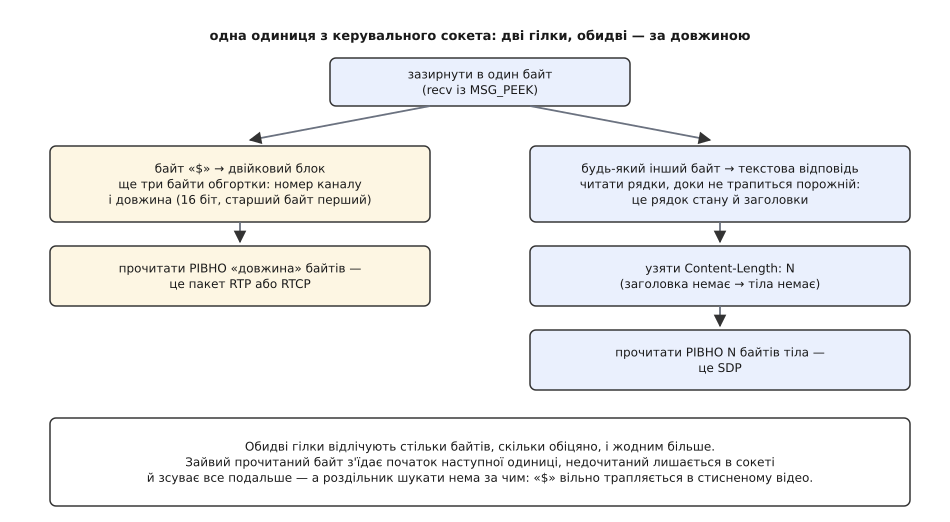

# 🛠 Мінімальний клієнт RTSP: від рядка адреси до першого пакета RTP

Ось повний код програми, яка з рядка `rtsp://192.168.1.64/Streaming/Channels/101` доходить до живих пакетів медіа на власному сокеті: відкриває з'єднання, проводить чотири команди, витягає з опису те, без чого не обійтися, і тримає сеанс живим, доки її не спинять. Близько двохсот рядків на C — і в них уміщається все, що бібліотека робить за вас мовчки, разом із місцями, де камера відповідає не так, як у прикладі з документації.

**Задум.** Порядок команд не довільний: результат кожної є входом для наступної. Перелік можливостей каже, чи розмовляє пристрій узагалі. Опис дає номер типу навантаження, частоту годинника й **адресу доріжки** — без неї немає куди слати наступний запит. Налаштування домовляється про порти й повертає ідентифікатор сеансу з терміном життя. Відтворення повертає опорну точку, від якої мітки часу в пакетах набувають сенсу. Плюс одна дія, яка не є командою й мусить статися раніше за свій результат: прив'язка UDP-сокетів.

### Каркас: один лічильник і одне правило читання

Клієнт починається з двох дрібниць, на яких валиться більшість саморобних реалізацій.

Перша — лічильник `CSeq`. Кожен запит несе власний номер, сервер повертає той самий номер у відповіді, і це єдиний спосіб зіставити відповідь із запитом. Номер зростає на **кожен** запит без винятку — зокрема на повторений після відмови 401 і на кожен пінг підтримання. Камера, що двічі побачила той самий номер, має право вважати другий запит дублікатом і мовчки його проковтнути; симптом — клієнт вічно чекає відповіді, якої не буде.

Друга — читання. Відповідь закінчується порожнім рядком, а за ним може стояти тіло, довжину якого називає `Content-Length`. Прочитати «скільки прийшло» не можна: у змішаному режимі за відповіддю в тому самому сокеті одразу лежить двійковий блок медіа, і зайвий узятий байт з'їсть його початок. Тому заголовки читають байт за байтом до порожнього рядка, тоді беруть рівно `Content-Length` байтів тіла — і зупиняються.


*Обидві гілки читають за оголошеною довжиною, а не за пошуком роздільника. Один зайвий байт зсуває межу назавжди — і далі клієнт бачить у потоці сміття, хоч мережа працює бездоганно.*

```c
/* rtspcli.c — мінімальний клієнт RTSP.  Збирання: cc -O2 -o rtspcli rtspcli.c */
#define _POSIX_C_SOURCE 200809L
#include <stdio.h>
#include <stdlib.h>
#include <string.h>
#include <strings.h>          /* strncasecmp */
#include <unistd.h>
#include <errno.h>
#include <time.h>
#include <poll.h>
#include <sys/socket.h>
#include <netinet/in.h>
#include <arpa/inet.h>
#include <netdb.h>

typedef struct {
    int  ctl;                 /* керувальний сокет TCP */
    int  cseq;                /* лічильник запитів */
    int  status;              /* код стану останньої відповіді */
    int  timeout;             /* оголошений термін життя сеансу, с */
    char base[256];           /* адреса, з якої почали */
    char session[64];         /* ідентифікатор сеансу; порожній до SETUP */
    char hdr[8192];           /* заголовки останньої відповіді */
    char body[16384];         /* тіло останньої відповіді (SDP) */
} rtsp_t;

/* Значення заголовка без урахування регістру: камери пишуть як заманеться —
   Content-length, CSEQ, session. */
static const char *hdr_find(const char *hdr, const char *name) {
    size_t nl = strlen(name);
    for (const char *p = hdr; p && *p; ) {
        if (!strncasecmp(p, name, nl)) {
            p += nl;
            while (*p == ' ' || *p == '\t') p++;
            return p;
        }
        p = strchr(p, '\n');
        if (p) p++;
    }
    return NULL;
}

static int read_byte(int fd, char *c) {
    ssize_t n;
    do { n = recv(fd, c, 1, 0); } while (n < 0 && errno == EINTR);
    return n == 1 ? 0 : -1;
}

/* Заголовки до порожнього рядка, тоді рівно Content-Length байтів тіла.
   Байт за байтом — щоб не забрати початок наступної одиниці в сокеті. */
static int rtsp_read(rtsp_t *r) {
    size_t n = 0;
    for (;;) {
        if (n + 1 >= sizeof r->hdr) return -1;
        if (read_byte(r->ctl, &r->hdr[n])) return -1;
        n++;
        if (n >= 2 && r->hdr[n-1] == '\n' && r->hdr[n-2] == '\n') break;  /* голий LF */
        if (n >= 4 && !memcmp(&r->hdr[n-4], "\r\n\r\n", 4)) break;
    }
    r->hdr[n] = '\0';
    r->status = 0;
    sscanf(r->hdr, "RTSP/%*d.%*d %d", &r->status);

    long len = 0;
    const char *cl = hdr_find(r->hdr, "Content-Length:");
    if (cl) len = strtol(cl, NULL, 10);
    if (len < 0 || (size_t) len >= sizeof r->body) return -1;
    for (long i = 0; i < len; i++)
        if (read_byte(r->ctl, &r->body[i])) return -1;
    r->body[len] = '\0';
    return 0;
}

/* extra — готові рядки заголовків, кожен зі своїм CRLF, або NULL. */
static int rtsp_send(rtsp_t *r, const char *method, const char *url,
                     const char *extra) {
    char req[1024];
    int n = snprintf(req, sizeof req,
        "%s %s RTSP/1.0\r\nCSeq: %d\r\nUser-Agent: minicli/1.0\r\n%s%s%s%s\r\n",
        method, url, ++r->cseq,
        r->session[0] ? "Session: " : "", r->session, r->session[0] ? "\r\n" : "",
        extra ? extra : "");
    if (n < 0 || n >= (int) sizeof req) return -1;
    return send(r->ctl, req, (size_t) n, 0) == n ? 0 : -1;
}
```

### Опис: узяти з SDP рівно чотири значення

З усього опису клієнтові потрібно чотири речі на доріжку, і жодної більше: рід матеріалу (щоб знайти потрібний блок `m=`), номер типу навантаження, частоту годинника з `a=rtpmap` і адресу з `a=control`. Решта рядків — для декодера, для журналу або взагалі ні для чого.

Розбір робиться одним проходом і без буфера, бо формат саме на це й розрахований: блок `m=` відкриває доріжку, наступний `m=` її закриває, усе між ними належить їй.

Адреса доріжки — єдине місце, де є вибір. `a=control:trackID=1` треба дописати до базової адреси, `a=control:rtsp://cam/stream/trackID=1` уже повна, `a=control:*` означає сам сеанс. Базова адреса — не та, яку ви набрали: якщо у відповіді є `Content-Base` або `Content-Location`, чинним є він. Камери за проміжним сервером саме так і переадресовують потік, і клієнт, що склеїв хвіст із адресою запиту, отримає на налаштуванні відмову «не знайдено».

```c
typedef struct {
    int  pt;                  /* номер типу навантаження */
    int  clock;               /* частота годинника міток, Гц */
    char codec[32];
    char control[256];        /* адреса доріжки, вже зведена до повної */
} track_t;

static const char *next_line(const char *p) {
    p = strchr(p, '\n');
    return p ? p + 1 : NULL;
}

/* a=control дає або повну адресу, або хвіст до базової, або «*» — сам сеанс. */
static void join_url(const char *base, const char *ctl, char *out, size_t n) {
    if (!strncasecmp(ctl, "rtsp://", 7)) { snprintf(out, n, "%s", ctl);  return; }
    if (!strcmp(ctl, "*"))               { snprintf(out, n, "%s", base); return; }
    size_t bl = strlen(base);
    const char *sep = (bl && base[bl-1] == '/') || ctl[0] == '/' ? "" : "/";
    snprintf(out, n, "%s%s%s", base, sep, ctl);
}

static int sdp_track(const char *sdp, const char *kind,
                     const char *base, track_t *t) {
    char want[32], v[256], name[32];
    int pt, clock;
    const char *p, *m = NULL;

    memset(t, 0, sizeof *t);
    t->pt = -1;
    snprintf(want, sizeof want, "m=%s ", kind);

    for (p = sdp; p; p = next_line(p))
        if (!strncmp(p, want, strlen(want))) { m = p; break; }
    if (!m) return -1;
    /* «m=video 0 RTP/AVP 96» — беремо перший номер зі списку профілю */
    if (sscanf(m, "m=%*s %*d %*s %d", &t->pt) != 1) return -1;

    for (p = next_line(m); p && strncmp(p, "m=", 2); p = next_line(p)) {
        if (sscanf(p, "a=rtpmap:%d %31[^/]/%d", &pt, name, &clock) == 3
            && pt == t->pt) {
            snprintf(t->codec, sizeof t->codec, "%s", name);
            t->clock = clock;
        } else if (sscanf(p, "a=control:%255[^\r\n]", v) == 1) {
            join_url(base, v, t->control, sizeof t->control);
        }
    }
    if (!t->control[0]) snprintf(t->control, sizeof t->control, "%s", base);
    /* Для номерів 0…95 частоту задає таблиця профілю, а для динамічних 96…127
       вона є ТІЛЬКИ в rtpmap — без неї мітки часу нічого не означають. */
    if (!t->clock && t->pt >= 96) return -1;
    return 0;
}
```

### Спершу сокети, тоді запит

У заголовку транспорту клієнт називає серверові конкретні числа: «слатимеш на мій порт 5000, звіти на 5001». Назвати їх можна тільки тоді, коли вони вже твої. Спокуса зробити навпаки — попросити налаштування, глянути на відповідь і аж тоді прив'язатися — коштує дорого: між запитом і прив'язкою порт може забрати інша програма, а сервер уже цілий сеанс слатиме в нікуди. Тому [сокети](book:programming/sockets-tcp-udp) — пару UDP, парний для медіа й наступний непарний для звітів — беруть **до** відправлення запиту.

> 🔧 **Навіщо це.** Симптом переплутаного порядку впізнаваний і оманливий: команди проходять, сервер відповідає 200, `RTP-Info` приходить — а пакетів немає. Мережа ціла, протокол відпрацював бездоганно, просто камера сумлінно шле медіа на порт, який дістався чужій програмі. Перевіряють це не в коді, а знадвору: чи справді той порт тримає ваш процес.

```c
static int bind_pair(int *rtp, int *rtcp, int *port) {
    struct sockaddr_in sa;
    for (int p = 5000; p < 5100; p += 2) {
        int a = socket(AF_INET, SOCK_DGRAM, 0);
        int b = socket(AF_INET, SOCK_DGRAM, 0);
        if (a < 0 || b < 0) { if (a >= 0) close(a); if (b >= 0) close(b); return -1; }
        memset(&sa, 0, sizeof sa);
        sa.sin_family = AF_INET;
        sa.sin_addr.s_addr = htonl(INADDR_ANY);
        sa.sin_port = htons((unsigned short) p);
        int ok = bind(a, (struct sockaddr *) &sa, sizeof sa) == 0;
        sa.sin_port = htons((unsigned short) (p + 1));
        ok = ok && bind(b, (struct sockaddr *) &sa, sizeof sa) == 0;
        if (ok) { *rtp = a; *rtcp = b; *port = p; return 0; }
        close(a); close(b);
    }
    return -1;
}

/* «Session: 12AF6C;timeout=60» — ідентифікатор до крапки з комою, термін після.
   Шукати timeout треба В МЕЖАХ рядка: слово трапляється й в інших заголовках. */
static void parse_session(rtsp_t *r) {
    const char *v = hdr_find(r->hdr, "Session:"), *eol, *t;
    size_t i = 0;
    if (!v) return;
    while (v[i] && v[i] != ';' && v[i] != '\r' && v[i] != '\n'
           && i + 1 < sizeof r->session) { r->session[i] = v[i]; i++; }
    r->session[i] = '\0';
    r->timeout = 60;                       /* чинне за замовчуванням */
    eol = strpbrk(v, "\r\n");
    t   = strstr(v, "timeout=");
    if (t && (!eol || t < eol)) r->timeout = (int) strtol(t + 8, NULL, 10);
    if (r->timeout < 2) r->timeout = 60;   /* сміття в полі не має ставати нулем */
}

/* RTP-Info: url=…;seq=9810092;rtptime=3450012 — опорна точка нового діапазону.
   Доріжок може бути кілька, через кому; тут беремо ділянку потрібної адреси. */
static void parse_rtp_info(const char *hdr, const char *url,
                           unsigned *seq, unsigned *ts) {
    const char *v = hdr_find(hdr, "RTP-Info:"), *s, *t;
    const char *tail = url ? strrchr(url, '/') : NULL;
    if (!v) return;
    if (tail && (s = strstr(v, tail + 1)) != NULL) v = s;   /* ділянка цієї доріжки */
    s = strstr(v, "seq=");
    t = strstr(v, "rtptime=");
    if (s) *seq = (unsigned) strtoul(s + 4, NULL, 10);
    if (t) *ts  = (unsigned) strtoul(t + 8, NULL, 10);
}
```

Доріжок буває більше за одну, і кожна налаштовується окремим запитом на **свою** адресу зі своєю парою портів. Друга дрібниця тут важить більше за першу: ідентифікатор сеансу з відповіді на перше налаштування треба покласти в заголовок другого запиту — саме так сервер розуміє, що це та сама розмова, а не два незалежні сеанси. Код вище робить це сам: `rtsp_send` додає `Session`, щойно поле заповнилося. Забути про нього — і камера віддасть другий ідентифікатор, після чого відтворення запустить рівно половину того, що ви замовили. Сама ж команда відтворення йде вже не на доріжку, а на спільну адресу сеансу — ту, яку в описі позначає `a=control:*`.

### Грати, тримати, відпустити

Далі все складається в один прохід. Після відтворення клієнт шле в бік камери дві порожні датаграми з того самого порту, куди чекає медіа: [трансляція адрес і фаєрвол](book:communications/nat-traversal) пропускають вхідний UDP лише туди, звідки щойно щось виходило, і без цього поштовху в багатьох мережах картинки не буде взагалі.

Таймер підтримання ставлять на **половині** оголошеного терміну — щоб один загублений пінг не вбив сеанс. Метод підтримання не вгадують: найперша команда, перелік можливостей, повертає заголовок `Public` з переліком того, що камера вміє, і звідти видно, чи є серед методів запит параметра. Відмову на нього все одно обробляють — трапляються пристрої, що перелічують метод і відповідають на нього помилкою, — але тоді це друга лінія оборони, а не спосіб дізнатися правду.

Опорна точка з `RTP-Info` потрібна вже на першому пакеті: номер `seq0` відділяє новий діапазон від залишків старого. Усе з меншим номером клієнт відкидає без вагань — це те, що грало до перемотування й доїхало із запізненням.

```c
int main(int argc, char **argv) {
    char host[128] = "", portstr[8] = "554";   /* типовий порт RTSP — 554 */
    char base[256], tr[128];
    struct addrinfo hints, *ai;
    struct sockaddr_in srv;
    rtsp_t r;
    track_t vid;
    int rtp = -1, rtcp = -1, cport = 0, srtp = 0, srtcp = 0, ping_gp = 1;
    unsigned seq0 = 0, ts0 = 0;
    const char *cb, *sp;
    time_t next_ping;

    if (argc < 2 || sscanf(argv[1], "rtsp://%127[^:/]:%7[0-9]", host, portstr) < 1) {
        fprintf(stderr, "usage: %s rtsp://host[:port]/path\n", argv[0]);
        return 2;
    }
    memset(&hints, 0, sizeof hints);
    hints.ai_family = AF_INET;
    hints.ai_socktype = SOCK_STREAM;
    if (getaddrinfo(host, portstr, &hints, &ai)) return 1;

    memset(&r, 0, sizeof r);
    r.timeout = 60;
    snprintf(r.base, sizeof r.base, "%s", argv[1]);
    r.ctl = socket(ai->ai_family, ai->ai_socktype, 0);
    if (r.ctl < 0 || connect(r.ctl, ai->ai_addr, ai->ai_addrlen)) return 1;
    memcpy(&srv, ai->ai_addr, sizeof srv);
    freeaddrinfo(ai);

    if (rtsp_send(&r, "OPTIONS", r.base, NULL) || rtsp_read(&r)) return 1;
    /* Public: перелічує методи камери — звідси й дізнаємось про GET_PARAMETER. */
    { const char *pub = hdr_find(r.hdr, "Public:");
      ping_gp = pub && strstr(pub, "GET_PARAMETER") != NULL; }

    if (rtsp_send(&r, "DESCRIBE", r.base, "Accept: application/sdp\r\n")
        || rtsp_read(&r)) return 1;
    if (r.status == 401) { fprintf(stderr, "потрібна автентифікація\n"); return 1; }
    if (r.status != 200) { fprintf(stderr, "DESCRIBE: %d\n", r.status); return 1; }

    /* Базова адреса для a=control: Content-Base, інакше Content-Location,
       інакше адреса запиту. */
    cb = hdr_find(r.hdr, "Content-Base:");
    if (!cb) cb = hdr_find(r.hdr, "Content-Location:");
    if (!cb || sscanf(cb, "%255[^\r\n]", base) != 1)
        snprintf(base, sizeof base, "%s", r.base);

    if (sdp_track(r.body, "video", base, &vid)) return 1;
    printf("video: pt=%d %s/%d Гц, control=%s\n",
           vid.pt, vid.codec, vid.clock, vid.control);

    if (bind_pair(&rtp, &rtcp, &cport)) return 1;
    snprintf(tr, sizeof tr,
             "Transport: RTP/AVP;unicast;client_port=%d-%d\r\n", cport, cport + 1);
    if (rtsp_send(&r, "SETUP", vid.control, tr) || rtsp_read(&r)) return 1;
    if (r.status != 200) { fprintf(stderr, "SETUP: %d\n", r.status); return 1; }
    parse_session(&r);
    sp = hdr_find(r.hdr, "Transport:");
    if (sp && (sp = strstr(sp, "server_port=")) != NULL)
        sscanf(sp, "server_port=%d-%d", &srtp, &srtcp);

    if (rtsp_send(&r, "PLAY", base, "Range: npt=0.000-\r\n") || rtsp_read(&r)) return 1;
    parse_rtp_info(r.hdr, vid.control, &seq0, &ts0);
    printf("сеанс %s, timeout=%d с, опора seq=%u rtptime=%u\n",
           r.session, r.timeout, seq0, ts0);

    /* Поштовх у бік камери з нашого порту — щоб відкрилося відображення. */
    if (srtp) {
        srv.sin_port = htons((unsigned short) srtp);
        for (int i = 0; i < 2; i++)
            sendto(rtp, "", 0, 0, (struct sockaddr *) &srv, sizeof srv);
    }

    next_ping = time(NULL) + r.timeout / 2;
    for (;;) {
        unsigned char pkt[2048];
        struct pollfd pf;
        long ms = (long) (next_ping - time(NULL)) * 1000;
        pf.fd = rtp; pf.events = POLLIN; pf.revents = 0;
        if (poll(&pf, 1, ms > 0 ? (int) ms : 0) > 0 && (pf.revents & POLLIN)) {
            ssize_t n = recv(rtp, pkt, sizeof pkt, 0);
            if (n >= 12)
                printf("RTP seq=%u ts=%u pt=%u len=%zd\n",
                       (unsigned) (pkt[2] << 8 | pkt[3]),
                       (unsigned) (pkt[4] << 24 | pkt[5] << 16 | pkt[6] << 8 | pkt[7]),
                       (unsigned) (pkt[1] & 0x7f), n);
        }
        if (time(NULL) >= next_ping) {
            if (rtsp_send(&r, ping_gp ? "GET_PARAMETER" : "OPTIONS", base, NULL)
                || rtsp_read(&r)) break;
            if (r.status >= 400 && ping_gp) {            /* камера не вміє — запасний хід */
                ping_gp = 0;
                if (rtsp_send(&r, "OPTIONS", base, NULL) || rtsp_read(&r)) break;
            }
            next_ping = time(NULL) + r.timeout / 2;
        }
    }

    rtsp_send(&r, "TEARDOWN", base, NULL);
    rtsp_read(&r);
    close(rtp); close(rtcp); close(r.ctl);
    return 0;
}
```

Розбір самого пакета — зняти дванадцятибайтову шапку, врахувати список джерел і зібрати кадр із частин — це вже робота [депакетизатора RTP](book:communications/rtp-rtcp), і вона починається рівно там, де закінчується цей клієнт.

### Чого коштує читання по байту

Читати по одному байту виглядає марнотратно, тож варто порахувати, де ця марнотратність справді щось важить.

**Виклики ядра на кожному шляху**

```
відповідь RTSP                        ≈ 400 байтів  → 400 викликів recv
пінгів за хвилину при timeout = 60 с  = 2
керувальний канал за хвилину          ≈ 2 · 400      = 800 викликів/хв ≈ 13/с

змішаний режим, 4 Мбіт/с, пакет 1044 Б
пакетів за секунду                    ≈ 4e6 / (1044·8) ≈ 479
якби тіло читали по байту             ≈ 479 · 1044     ≈ 500 000 викликів/с
```

Різниця в чотири порядки й вирішує все. На керувальному каналі кілька десятків викликів на секунду не помітить ніхто, зате точна межа гарантована задарма. На шляху медіа так робити не можна: там читають чотири байти обгортки, а тоді **одним** запитом рівно `len` байтів тіла.

І одна пастка, яку байт-за-байтом обходить, а один великий `recv` — ні: у потоці TCP `recv` має право повернути менше, ніж просили, навіть коли решта в дорозі. Тому запит на `len` байтів мусить бути циклом, який добирає залишок, доки не набере рівно стільки, скільки сказала обгортка. Один недочитаний хвіст — і всі дальші межі поїхали.

### Що ламається насправді

**Відмова 401.** Камери майже завжди просять автентифікації, і майже завжди — у формі, до якої RTSP відсилає прямо: механізми HTTP чинні як є. У відповіді приходить `WWW-Authenticate: Digest realm="…", nonce="…"`; з неї беруть два значення й рахують відповідь трьома [обчисленнями геша](book:programming/cryptographic-hash) MD5. Заголовок після цього ставлять у **кожен** дальший запит, а поле `uri` в ньому — адреса саме цього запиту: для налаштування це адреса доріжки, а не базова, і переплутати їх — типова причина того, що перша команда проходить, а друга ні.

```c
/* Форма RFC 2069, на яку посилається специфікація RTSP:
     HA1      = MD5(user ":" realm ":" pass)
     HA2      = MD5(method ":" uri)
     response = MD5(HA1 ":" nonce ":" HA2)
   Камера, що прислала qop="auth", хоче довшу форму RFC 2617:
     response = MD5(HA1 ":" nonce ":" nc ":" cnonce ":" qop ":" HA2)
   md5_hex — будь-яка реалізація MD5, що дає 32 шістнадцяткові символи. */
static void digest_header(const char *user, const char *pass, const char *realm,
                          const char *nonce, const char *method, const char *uri,
                          char *out, size_t n) {
    char a1[33], a2[33], resp[33], buf[512];
    snprintf(buf, sizeof buf, "%s:%s:%s", user, realm, pass); md5_hex(buf, a1);
    snprintf(buf, sizeof buf, "%s:%s", method, uri);          md5_hex(buf, a2);
    snprintf(buf, sizeof buf, "%s:%s:%s", a1, nonce, a2);     md5_hex(buf, resp);
    snprintf(out, n, "Authorization: Digest username=\"%s\", realm=\"%s\", "
                     "nonce=\"%s\", uri=\"%s\", response=\"%s\"\r\n",
             user, realm, nonce, uri, resp);
}
```

**Пакетів немає, хоч усе відповіло 200.** Спершу поштовх у бік камери, потім фаєрвол вашої ж машини, і аж тоді — запасний перехід у змішаний режим: повторити налаштування з `Transport: RTP/AVP/TCP;unicast;interleaved=0-1`. Тоді медіа поїде тим самим з'єднанням, що й команди, а читач із першого коду вже готовий: він зазирає в перший байт і розрізняє гілки.

**Правило межі.** У змішаному режимі блок медіа знаходять **лише** за полем довжини з обгортки. Шукати в потоці байт `$` не можна: він вільно трапляється всередині стисненого відео, і один такий «знайдений» початок зсуває розбирач назавжди — далі клієнт бачить сміття, хоч жоден байт не загублено.

**Сеанс, що обривається на тій самій хвилині.** Це не мережа й не камера: це відсутній таймер підтримання. Поки медіа йде окремими датаграмами, керувальне з'єднання простоює, і сервер має повне право вважати клієнта мертвим.

**Дрібне, що коштує годин.** Заголовки шукають без урахування регістру. `timeout` шукають у межах свого рядка. `Content-Length` буває відсутній — тіла тоді просто немає, а не «нуль байтів чекаємо вічно». Частота годинника береться з опису, ніколи не зашивається числом 90000: потік зі своїм годинником дасть тривалості, помилкові рівно в стільки разів, у скільки розходяться частоти.
