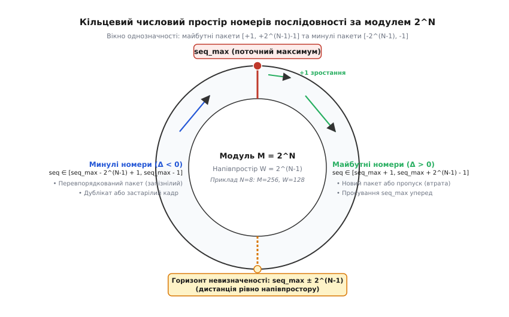
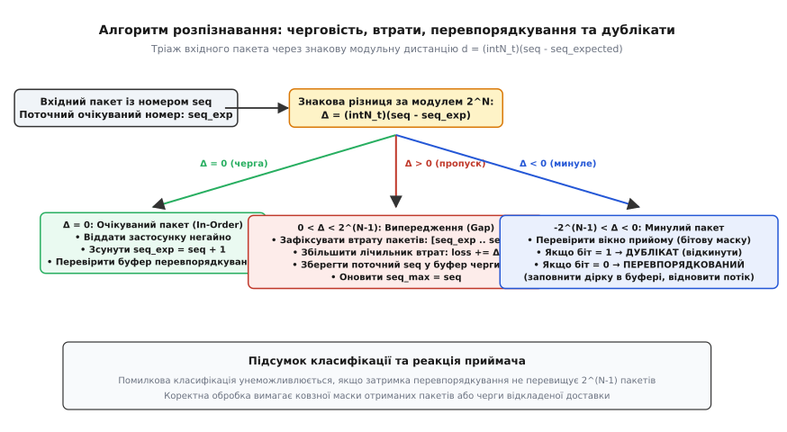
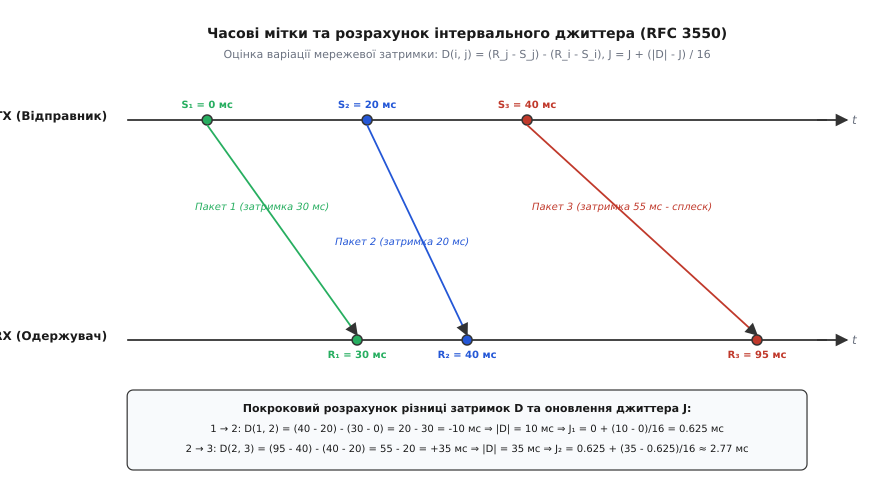
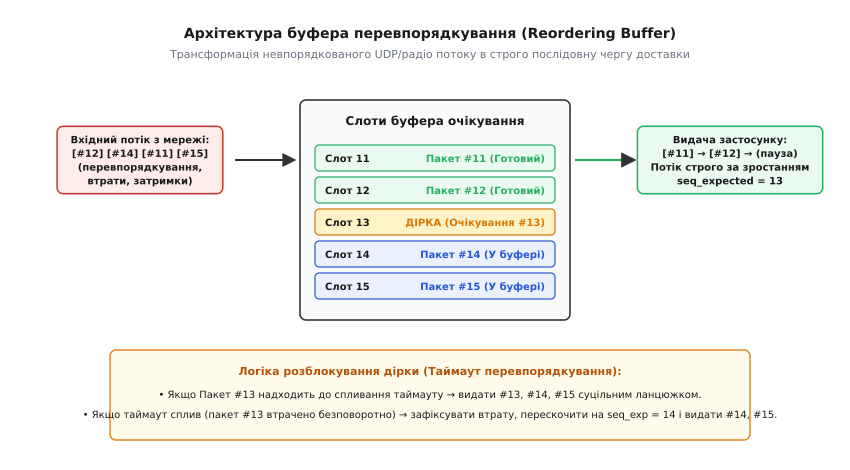
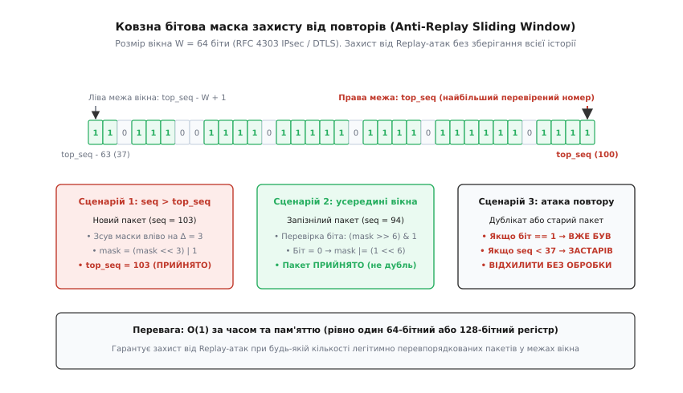

# Нумерація послідовності пакетів: детекція втрат і дублікатів

<preknowlist>
- [Надійний зв'язок поверх ненадійного середовища](book:communications/reliable-link) — виявлення помилок, контрольні суми CRC, базові принципи підтверджень та виявлення втрат.
- [Формування та структура мережевого пакета](book:communications/packet-design) — поля заголовка, корисне навантаження, трейлер та розміщення службових лічильників.
- [Протоколи ARQ: Stop-and-Wait, Go-Back-N та Selective Repeat](book:communications/arq-protocol) — зворотний зв'язок, ковзні вікна передавача та повторна передача втрачених блоків.
- [Керування потоком даних](book:communications/flow-control) — узгодження швидкості передавача з місткістю буфера приймача через віконний механізм.
</preknowlist>

Коли безпілотний літальний апарат передає потік телеметрії на наземну станцію керування зі швидкістю 100 пакетів за секунду через радіоканал із завадами, пакети прибувають до приймача нерівномірно. Радіовідбиття від будівель, короткочасне екранування антени крилом при маневрі та повторні передачі на канальному рівні призводять до того, що пакети міняються місцями: пакет `#12` (крен крила +20°) обганяє пакет `#11` (крен 0°) і прибуває першим. Якщо приймач не має засобів розпізнавання черговості й обробляє кадри в сирому порядку приходу, польотний контролер спочатку відпрацює команду крену +20°, а за кілька мікросекунд отримає запізнілий пакет `#11` і смикне елерони назад на 0°, спричинивши автоколивання та аварію апарата.

Без числового маркування кожного переданого блоку приймач принципово позбавлений можливості визначити стан каналу: він не знає, чи між двома повідомленнями загубилося п'ять пакетів, чи прибулий блок є запізнілим дублікатом попереднього запиту, чи потік просто зазнав випадкового перевпорядкування. Фізичне середовище передачі є безпам'ятним каналом із затримками, тому будь-яка спроба побудувати надійний зв'язок, розрахувати втрати або захиститися від несанкціонованого повторного відтворення команд вимагає єдиного фундаменту — **нумерації послідовності пакетів** (англ. *Packet Sequence Numbering*, від лат. *sequentia* — слідування, черговість).

Цей механізм пройшов шлях від найпростішого однобітового прапорця квитування до складних багаторівневих криптографічних просторів. 

> Детальну хронологію розвитку цих ідей — від протоколу чергування бітів 1969 року та вразливості передбачення номерів TCP 1985 року до стандарту QUIC RFC 9000 — викладено у вставці [📜 Еволюція нумерації пакетів: від біта чергування до криптографічних просторів QUIC](book:communications/sequence-numbering/hist-sequence-numbers.md).

---

## Фізична природа деградації черги в пакетних мережах

У будь-якому цифровому тракті передачі даних між відправником (TX) та одержувачем (RX) виникають три фундаментальні аномалії послідовності:

```
Відправник TX:    [#1] ────────► [#2] ────────► [#3] ────────► [#4] ────────► [#5]
                                       │
                                       ▼  (Канал із шумом, чергами та багатопроменевістю)
Одержувач RX:     [#1] ────────► [#3] ────────► [#2] ────────► [#3 (дубль)] ─► [#5]
                                  ▲              ▲                 ▲
                                  │              │                 └─ ДУБЛІКАТ: повторний кадр
                                  │              └─ ПЕРЕВПОРЯДКУВАННЯ: #2 прийшов після #3
                                  └─ ВТРАТА (GAP): виявлено пропуск пакета #2
```

### 1. Втрати пакетів (Packet Loss) та модель помилок

Фізичний шум, теплове згасання сигналу в кабелі, інтерференція випромінювання від сусідніх передавачів або переповнення буферів проміжних комутаторів (DropTail) призводять до спотворення бітів або відкидання цілих блоків.

Якщо канальний рівень захищає кадри контрольною сумою CRC, навіть один спотворений біт змушує апаратний трансивер без вагань викинути весь кадр. Ймовірність втрати пакета довжиною `L` бітів при бітовій частоті помилок `BER` (англ. *Bit Error Rate*) становить:

```
PER = 1 - (1 - BER)^L
```

Для кадру Ethernet довжиною `1500` байтів (`12 000` бітів) на радіолінії з `BER = 10⁻⁴` коефіцієнт втрати пакетів сягає `1 - (1 - 10⁻⁴)¹²⁰⁰⁰ ≈ 0.699` (майже 70% втрат). 

Крім того, у радіоефірі помилки виникають не поодиноко, а пачками (англ. *Burst Loss*), що описується двостановою моделлю Гілберта — Елліотта: канал перебуває або в доброму стані (низька ймовірність втрат), або в поганому (майже повне згасання сигналу під час глибокого інтерференційного завмирання).

### 2. Перевпорядкування пакетів (Packet Reordering)

Перевпорядкуванням називають зміну вихідної черговості надходження кадрів, коли пізніше відправлений пакет прибуває до приймача раніше за попередній. Основні фізичні та системні причини цього явища:

* **Багатопроменеве поширення (Multipath Propagation):** у бездротових каналах радіохвилі відбиваються від земної поверхні, будівель або металевих конструкцій. Прямий промінь долає меншу дистанцію, ніж відбитий. Якщо передавач випромінює серію коротких пакетів на межі пропускної здатності, відбита копія попереднього кадру може накластися на прямий сигнал наступного, або затримка поширення відбитої хвилі спричинить фіксацію пізнішого кадру першим.
* **Агрегація кадрів та черги Wi-Fi / 4G / 5G:** протоколи IEEE 802.11n/ac/ax застосовують механізм агрегації кадрів A-MPDU та блокові підтвердження Block ACK. Якщо всередині збірки з 32 підкадрів один блок виявився пошкодженим, трансивер підтверджує 31 кадр, а пошкоджений відправляє повторно в наступній збірці разом із новими даними. У результаті потік на виході Wi-Fi приймача має вигляд: `[#1, #3..#32, #2]`.
* **Багатошляхова комутація IP (ECMP Routing):** у високошвидкісних дата-центрах та опорних магістралях пакети розподіляються між паралельними каналами за допомогою гешування заголовків ECMP (Equal-Cost Multi-Path). Якщо розмір черги на одному з комутаторів короткочасно зростає, пакети, що пішли паралельним лінком, обганяють застряглі кадри.

### 3. Дублювання пакетів (Packet Duplication)

Дублікатом є точна копія вже отриманого раніше пакета. Головні механізми їхньої появи:

* **Втрата зворотного сигналу підтвердження (Lost ACK):** приймач успішно прийняв пакет `#5` і надіслав зворотний `ACK 5`. Через сплеск завади `ACK` утратився. Відправник після спливання таймера `RTO` вважає пакет `#5` утраченим і висилає його дублікат.
* **Передчасні таймаути передавача (Spurious Retransmission):** якщо час кругового обігу `RTT` раптово підскочив через затор, передавач починає повторну передачу кадру ще до того, як перший примірник устиг дістатися адресата. У результаті до приймача прибувають обидва екземпляри.
* **Атаки повторного відтворення (Replay Attacks):** сторонній спостерігач записує перехоплені радіопакети в буфер і повторно транслює їх в ефір через довільний проміжок часу.

---

## Архітектура та розрядність лічильників послідовності

Порядковий номер являє собою цілочисельний лічильник, який інкрементується передавачем для кожного нового відправленого кванту інформації:

```
seq_{k+1} = (seq_k + 1) mod 2^N
```

Розрядність поля `N` (кількість бітів у заголовку) визначає компроміс між накладними витратами каналу (англ. *Protocol Overhead*) та часом до циклічного вичерпання простору номерів (англ. *Wrap-around Time*).

```
┌─────────────────┬───────────────────────────────────────────────────────────┐
│ Заголовок кадру │ Корисне навантаження (Payload)                            │
├─────────────────┴───────────────────────────────────────────────────────────┤
│ ... │ Sequence Number (N бітів) │ Timestamp (опціонально) │ ...            │
└─────────────────────────────────────────────────────────────────────────────┘
```

### Фізичний розрахунок часу обертання лічильників

Нехай система транслює пакети розміром `1500` байтів (`12 000` бітів) з інтенсивністю `R_pps` пакетів за секунду на каналі з бітовою швидкістю `R_bps`. Час повного обороту простору номерів `2^N` становить:

```
T_wrap = 2^N / R_pps = (2^N · L) / R_bps
```

| Протокол | Розрядність `N` | Одиниця підрахунку | Швидкість лінії | Інтенсивність `R_pps` | Час обертання `T_wrap` | Призначення та сфера застосування |
|---|---|---|---|---|---|---|
| **MAVLink v2** | `8` бітів | `1` пакет телеметрії | `115.2` кбіт/с | `100` пак/с | **2.56 с** | Телеметрія БПЛА, бортові автопілоти |
| **RTP (RFC 3550)** | `16` бітів | `1` медіапакет | `64` кбіт/с (G.711) | `50` пак/с | **1310.7 с (21.8 хв)** | Потокове аудіо/відео, VoIP, WebRTC |
| **RTP (HD Video)** | `16` бітів | `1` UDP-пакет | `10` Мбіт/с | `1000` пак/с | **65.5 секунди** | Потокове відео 1080p60 RTSP |
| **TCP (RFC 793)** | `32` біти | **1 байт потоку** | `1` Гбіт/с | — | **34.35 секунди** | Надійний потік даних інтернету |
| **TCP (RFC 793)** | `32` біти | **1 байт потоку** | `100` Гбіт/с | — | **0.344 секунди** | Магістральні дата-центри (вимагає PAWS) |
| **QUIC (RFC 9000)**| `62` біти | `1` UDP-пакет | `100` Гбіт/с | `8.33·10⁶` пак/с | **> 17 000 років** | Захищений веб HTTP/3, мобільний трафік |
| **IPsec ESP (ESN)**| `64` біти | `1` IP-пакет | `100` Гбіт/с | `8.33·10⁶` пак/с | **> 70 000 років** | Захищені тунелі, VPN магістралі |

З наведеної таблиці чітко видно: для коротких команд телеметрії 8 бітів є достатнім мінімумом, що економить кожен байт радіоефіру, тоді як для гігабітних мереж навіть 32-бітний лічильник TCP вичерпується за пів хвилини, змушуючи розширювати простір часовими мітками або переходити на 64-бітні архітектури.

> Повні специфікації бітових форматів заголовків, правила оновлення та структури звітів якості для MAVLink, RTP, TCP, QUIC та IPsec зібрано у вставці [📋 Специфікація нумерації послідовностей у мережевих та вбудованих протоколах](book:communications/sequence-numbering/api-seq-protocols.md).

---

## Модульна арифметика та обробка переповнення (Wrap-Around / Rollover)

Оскільки розрядність лічильника `N` обмежена, після досягнення максимального числа `2^N - 1` наступний пакет неминуче отримує номер `0`. Множина номерів утворює замкнене кільце лишків за модулем `M = 2^N`.


*Кільцевий числовий простір номерів послідовності за модулем 2^N: поділ на напівпростір майбутніх пакетів і напівпростір минулих пакетів відносно поточного максимуму.*

### Аксіоматика порівняння RFC 1982 (Serial Number Arithmetic)

У кільцевому просторі класичні оператори нерівності (`<` та `>`) втрачають зміст: не можна стверджувати, що номер `0` завжди менший за `255`, оскільки при переході через межу пакет `#0` є новішим за пакет `#255`.

Стандарт RFC 1982 визначає відношення строгого порядку через **довжину дуги в напрямку годинникової стрілки**:

* Номер `s_new` вважається **новішим (більшим)** за `s_base`, якщо відстань між ними в напрямку зростання строго менша за половину повного числового простору (напівпростір `2^(N-1)`):
```
0 < (s_new - s_base) mod 2^N < 2^(N-1)
```
* Номер `s_new` вважається **старішим (меншим)** за `s_base`, якщо:
```
0 < (s_base - s_new) mod 2^N < 2^(N-1)
```

### Горизонт невизначеності та теорема про максимальне вікно

Якщо різниця між номерами становить рівно половину кільця:

```
(s_new - s_base) mod 2^N = 2^(N-1)
```

напрямок руху стає математично невизначеним: неможливо встановити, чи пакет випередив чергу на `2^(N-1)` позицій уперед, чи відстав на `2^(N-1)` позицій назад.

Звідси випливає фундаментальний інваріант проектування протоколів: **максимальна кількість пакетів, що можуть одночасно перебувати в польоті або затримуватися буферами (розмір ковзного вікна `W`), строго обмежена величиною напівпростору**:

```
W_max ≤ 2^(N-1) - 1
```

Для 8-бітного протоколу (`2^N = 256`) розмір вікна не може перевищувати `127` пакетів; для 16-бітного (`2^N = 65536`) — не більше `32 767` пакетів.

### Апаратна реалізація та інструкції процесорів (ARM Cortex-M та x86-64)

В архітектурі сучасних мікропроцесорів цілі числа зі знаком подаються у **двійковому додатковому коді** (англ. *Two's Complement*). Завдяки цьому обчислення знакової дистанції між двома беззнаковими номерами `uintN_t` зводиться до звичайного віднімання з наступним приведенням типу до знакового `intN_t`:

```
Δ = (intN_t)((uintN_t)s_new - (uintN_t)s_base)
```

* Якщо `Δ == 0` — номери ідентичні (поточний очікуваний пакет).
* Якщо `Δ > 0` — пакет `s_new` є новішим, у потоці виник пропуск із `Δ - 1` пакетів.
* Якщо `Δ < 0` — пакет `s_new` є запізнілим (відстав від максимуму на `|Δ|` позицій).

Ця операція виконується за **1 машинний такт ALU процесора** без жодних інструкцій умовного розгалуження `if / else`, що критично для високонавантажених мережевих драйверів (Linux XDP, DPDK) та обробників переривань реального часу (RTOS ISR):

* **В архітектурі ARM Cortex-M4/M7:** операція `(int16_t)(seq_new - seq_base)` транслюється компілятором у дві надшвидкі інструкції:
  ```asm
  SUBS  r2, r0, r1      ; r2 = seq_new - seq_base (32-бітне віднімання)
  SXTH  r2, r2          ; Знакове розширення молодших 16 бітів (Signed Extend Halfword)
  ```
  Інструкція `SXTH` копіює 15-й біт у верхні 16 розрядів регістра `r2`, миттєво перетворюючи додатне число `0xFFFF` (віднімання `0 - 1` у `uint16_t`) на знакове `-1` (`0xFFFFFFFF`).
* **В архітектурі x86-64:** операція виконується за допомогою `MOVSX` (Move with Sign-Extension):
  ```asm
  sub   eax, edx        ; eax = seq_new - seq_base
  movsx rax, ax         ; Знакове розширення 16-бітного ax у 64-бітний rax
  ```

Відсутність умовних переходів (`branches`) унеможливлює помилки передбачення переходів (Branch Misprediction Penalties), які на глибоких конвеєрах сучасних CPU коштують до 15–20 тактів простою.

> Формальні математичні доведення аксіом RFC 1982, розширення знаку для довільної розрядності лічильників та теорему про час обертання MSL викладено у вставці [🧮 Модульна арифметика RFC 1982 та оцінка джиттера за RFC 3550](book:communications/sequence-numbering/math-sequence-arithmetic.md).

---

## Тріаж вхідного пакета: алгоритм класифікації подій

Кожен вхідний пакет, що надходить із мережевого інтерфейсу, проходить процедуру первинної класифікації (тріаж). Приймач підтримує стан черги за допомогою двох ключових покажчиків та бітового регістра:
1. `seq_expected` — найменший порядковий номер, який очікується для неперервної видачі даних застосунку (початок лінійної черги).
2. `seq_max` — найбільший валідний номер, зафіксований від моменту старту сесії (правий край активного вікна).
3. `recv_mask` — 64-бітна або 128-бітна маска отриманих пакетів, у якій кожен біт `k` позначає стан пакета `seq_max - k`.


*Дерево прийняття рішень при надходженні пакета: розпізнавання черговості, виявлення втрат, фільтрація дублікатів та відновлення перевпорядкованих блоків.*

### Покроковий аналіз станів класифікатора:

* **Стан 1: Очікуваний пакет (In-Order, `diff_exp == 0`):**
  Пакет прибув строго у вихідній послідовності. Приймач негайно передає його корисне навантаження застосунку, інкрементує `seq_expected++` та оновлює бітову маску. Якщо в буфері перевпорядкування вже зберігаються наступні суцільні кадри, вони також негайно виштовхуються у вихідний потік.
* **Стан 2: Випередження черги (Gap Loss, `diff_exp > 0`):**
  Прибув пакет із більшим номером, ніж очікувалося. Це свідчить про те, що діапазон пакетів `[seq_expected .. seq - 1]` або затримався в мережі, або був безповоротно знищений завадами. Лічильник втрат збільшується на `diff_exp`, поточний пакет зберігається в буфері очікування, а таймер дірки активується.
* **Стан 3: Запізнілий пакет (Reordered, `diff_exp < 0` та `diff_max < 64`):**
  Пакет прибув із запізненням, але потрапляє в активне вікно спостереження. За допомогою бітової операції перевіряється, чи цей номер уже оброблявся. Якщо біт дорівнює `0`, пакет є легітимним перевпорядкованим блоком: він заповнює дірку в буфері перевпорядкування, відновлюючи цілісність ланцюжка.
* **Стан 4: Дублікат (Duplicate):**
  Пакет має номер із минулого, і відповідний біт у масці вже виставлений в `1`. Пакет негайно відкидається без передачі вищим рівням, запобігаючи подвійній обробці команд чи дублюванню аудіосемплів.
* **Стан 5: Застарілий пакет поза вікном (Stale Drop, `diff_max ≥ 64`):**
  Пакет запізнився понад максимальну глибину історії вікна. Приймач не може гарантувати, чи це легітинмий старий пакет, чи атака повтору, тому блок безпечно відкидається з фіксацією події в логах моніторингу.

### Програмна реалізація класифікатора пакетів:

:::tabs
```c
#include <stdint.h>
#include <stdbool.h>

typedef enum {
    PKT_IN_ORDER,    /* Пакет прибув строго за чергою */
    PKT_GAP_LOSS,    /* Випередження черги: виявлено втрату або затримку пакетів */
    PKT_REORDERED,   /* Запізнілий пакет: заповнення дірки в черзі */
    PKT_DUPLICATE,   /* Точний дублікат уже отриманого пакета */
    PKT_STALE_DROP   /* Застарілий пакет поза межами вікна прийому */
} packet_status_t;

typedef struct {
    uint16_t seq_expected;  /* Очікуваний наступний номер */
    uint16_t seq_max;       /* Найбільший зафіксований номер */
    uint64_t recv_mask;     /* 64-бітна маска отриманих пакетів */
    bool     initialized;   /* Прапорець первинного старту */
} seq_tracker_t;

void seq_tracker_init(seq_tracker_t *tr) {
    tr->seq_expected = 0;
    tr->seq_max = 0;
    tr->recv_mask = 0;
    tr->initialized = false;
}

packet_status_t seq_tracker_process(seq_tracker_t *tr, uint16_t seq, uint16_t *out_lost_count) {
    *out_lost_count = 0;

    if (!tr->initialized) {
        tr->seq_expected = (uint16_t)(seq + 1);
        tr->seq_max = seq;
        tr->recv_mask = 1ULL;
        tr->initialized = true;
        return PKT_IN_ORDER;
    }

    int16_t diff_exp = (int16_t)(seq - tr->seq_expected);

    /* Випадок 1: Очікуваний пакет за чергою */
    if (diff_exp == 0) {
        tr->seq_expected++;
        if ((int16_t)(seq - tr->seq_max) > 0) {
            uint16_t shift = (uint16_t)(seq - tr->seq_max);
            tr->recv_mask = (shift < 64) ? ((tr->recv_mask << shift) | 1ULL) : 1ULL;
            tr->seq_max = seq;
        }
        return PKT_IN_ORDER;
    }

    /* Випадок 2: Випередження (пропуск у потоці) */
    if (diff_exp > 0) {
        *out_lost_count = (uint16_t)diff_exp;
        int16_t diff_max = (int16_t)(seq - tr->seq_max);
        if (diff_max > 0) {
            uint16_t shift = (uint16_t)diff_max;
            tr->recv_mask = (shift < 64) ? ((tr->recv_mask << shift) | 1ULL) : 1ULL;
            tr->seq_max = seq;
        }
        return PKT_GAP_LOSS;
    }

    /* Випадок 3: Минулий пакет (diff_exp < 0) */
    int16_t diff_max = (int16_t)(tr->seq_max - seq);
    if (diff_max >= 64 || diff_max < 0) {
        return PKT_STALE_DROP; /* Поза межами 64-бітного вікна */
    }

    /* Перевіряємо дублікат за бітовою маскою */
    if (tr->recv_mask & (1ULL << diff_max)) {
        return PKT_DUPLICATE;
    }

    /* Запізнілий пакет, якого ще не було */
    tr->recv_mask |= (1ULL << diff_max);
    return PKT_REORDERED;
}
```
```cpp
#include <cstdint>
#include <optional>
#include <bitset>

enum class PacketStatus {
    InOrder,
    GapLoss,
    Reordered,
    Duplicate,
    StaleDrop
};

struct TriageResult {
    PacketStatus status;
    std::uint16_t lost_packets{0};
};

class SequenceTracker {
public:
    constexpr SequenceTracker() noexcept = default;

    TriageResult process(std::uint16_t seq) noexcept {
        if (!initialized_) {
            expected_seq_ = static_cast<std::uint16_t>(seq + 1);
            max_seq_ = seq;
            mask_.set(0);
            initialized_ = true;
            return {PacketStatus::InOrder, 0};
        }

        const auto diff_exp = static_cast<std::int16_t>(seq - expected_seq_);

        // 1. Очікуваний пакет
        if (diff_exp == 0) {
            ++expected_seq_;
            const auto diff_max = static_cast<std::int16_t>(seq - max_seq_);
            if (diff_max > 0) {
                const auto shift = static_cast<std::size_t>(diff_max);
                if (shift < 64) {
                    mask_ <<= shift;
                    mask_.set(0);
                } else {
                    mask_.reset();
                    mask_.set(0);
                }
                max_seq_ = seq;
            }
            return {PacketStatus::InOrder, 0};
        }

        // 2. Випередження черги (пропуск)
        if (diff_exp > 0) {
            const auto diff_max = static_cast<std::int16_t>(seq - max_seq_);
            if (diff_max > 0) {
                const auto shift = static_cast<std::size_t>(diff_max);
                if (shift < 64) {
                    mask_ <<= shift;
                    mask_.set(0);
                } else {
                    mask_.reset();
                    mask_.set(0);
                }
                max_seq_ = seq;
            }
            return {PacketStatus::GapLoss, static_cast<std::uint16_t>(diff_exp)};
        }

        // 3. Минулий номер
        const auto diff_max = static_cast<std::int16_t>(max_seq_ - seq);
        if (diff_max >= 64 || diff_max < 0) {
            return {PacketStatus::StaleDrop, 0};
        }

        if (mask_.test(static_cast<std::size_t>(diff_max))) {
            return {PacketStatus::Duplicate, 0};
        }

        mask_.set(static_cast<std::size_t>(diff_max));
        return {PacketStatus::Reordered, 0};
    }

private:
    std::uint16_t expected_seq_{0};
    std::uint16_t max_seq_{0};
    std::bitset<64> mask_{};
    bool initialized_{false};
};
```
:::

---

## Розрахунок ковзних метрик якості каналу зв'язку

Для адаптивного керування бітрейтом кодеків (ABR), динамічного вибору потужності передавача та налаштування таймерів ARQ приймач зобов'язаний безперервно розраховувати дві ключові числові характеристики: **коефіцієнт втрати пакетів (Packet Loss Rate)** та **інтервальний джиттер доставки (Interarrival Jitter)**.

### Розрахунок коефіцієнта втрати пакетів (Packet Loss Rate)

Коефіцієнт втрат відображає частку пакетів, знищених завадами, відносно загальної кількості відправлених блоків.

1. **Інтервальна оцінка (Interval PLR):** розраховується на фіксованому вікні вимірювання (наприклад, кожні `500` мс):
```
PLR_{interval} = N_{lost} / N_{expected} = (N_{expected} - N_{received}) / N_{expected}
```
2. **Експоненційне згладжування (EWMA Loss Rate):** усуває різкі поодинокі стрибки:
```
PLR_{smooth} = (1 - α) · PLR_{smooth} + α · PLR_{instant},    де α ≈ 0.1
```

### Фізична природа та діагностична роль джиттера

**Джиттер** (англ. *jitter* — тремтіння, флуктуація) — це статистична варіація часу доставки пакетів мережею. Навіть якщо відправник випромінює кадри через суворо рівні інтервали (наприклад, кожні 20 мс), на приймач вони прибувають із хаотичними відхиленнями (15 мс, 35 мс, 12 мс) через флуктуацію черг у буферах маршрутизаторів.

У мережевій інженерії зростання джиттера є **найпершим індикатором виникнення затору** (англ. *Early Congestion Indicator*): коли проміжний маршрутизатор починає перевантажуватися, його вихідні черги наповнюються, і час очікування пакетів різко коливається ще задовго до того, як буфер переповниться і почнуться реальні втрати кадрів (Packet Drop).


*Часова діаграма відправлення та отримання пакетів: визначення різниці часу транзиту D(i, j) та експоненційне згладжування джиттера J.*

Нехай пакет `i` має часову мітку відправлення `S_i` (встановлену таймером передавача) і мітку отримання `R_i` (зняту локальним таймером приймача). Для двох послідовних пакетів `i` та `j` відносна різниця затримок транзиту `D(i, j)` дорівнює:

```
D(i, j) = (R_j - S_j) - (R_i - S_i) = (R_j - R_i) - (S_j - S_i)
```

Зауважмо: різниця `D(i, j)` не потребує синхронізації абсолютного часу між TX та RX, оскільки постійна різниця годинників взаємно знищується при відніманні.

Середній джиттер `J` розраховується рекурсивним дискретним фільтром низьких частот першого порядку (RFC 3550 §6.4.1):

```
J_{new} = J_{old} + (|D(i, j)| - J_{old}) / 16
```

Ділення на `16` реалізується швидким зсувом `>> 4` без використання чисел із плаваючою комою, що дозволяє вимірювати джиттер безпосередньо в обробниках переривань мікроконтролерів.

:::tabs
```c
#include <stdint.h>
#include <stdlib.h>

typedef struct {
    uint32_t last_s;      /* Час відправлення попереднього пакета (TX) */
    uint32_t last_r;      /* Час отримання попереднього пакета (RX) */
    uint32_t jitter_q4;   /* Джиттер у форматі Q28.4 (значення, помножене на 16) */
    bool     initialized;
} jitter_estimator_t;

void jitter_init(jitter_estimator_t *je) {
    je->last_s = 0;
    je->last_r = 0;
    je->jitter_q4 = 0;
    je->initialized = false;
}

/* Оновлення джиттера на кожен отриманий пакет. Часові мітки в мілісекундах або відліках кодека */
void jitter_update(jitter_estimator_t *je, uint32_t send_time, uint32_t recv_time) {
    if (!je->initialized) {
        je->last_s = send_time;
        je->last_r = recv_time;
        je->initialized = true;
        return;
    }

    int32_t d = (int32_t)((recv_time - send_time) - (je->last_r - je->last_s));
    if (d < 0) {
        d = -d; /* Абсолютне значення |D| */
    }

    je->last_s = send_time;
    je->last_r = recv_time;

    /* Рекурсивний фільтр RFC 3550: J = J + (|D| - J) / 16 */
    /* У цілочисельному форматі Q4: jitter_q4 += (d * 16 - jitter_q4) / 16 */
    je->jitter_q4 += (uint32_t)d - (je->jitter_q4 >> 4);
}

/* Отримання поточного згладженого джиттера в цілих одиницях */
uint32_t jitter_get(const jitter_estimator_t *je) {
    return je->jitter_q4 >> 4;
}
```
```cpp
#include <cstdint>
#include <cmath>

class JitterEstimator {
public:
    constexpr JitterEstimator() noexcept = default;

    void update(std::uint32_t send_time, std::uint32_t recv_time) noexcept {
        if (!initialized_) {
            last_s_ = send_time;
            last_r_ = recv_time;
            initialized_ = true;
            return;
        }

        const auto transit_curr = static_cast<std::int64_t>(recv_time) - static_cast<std::int64_t>(send_time);
        const auto transit_prev = static_cast<std::int64_t>(last_r_) - static_cast<std::int64_t>(last_s_);
        const double d = std::abs(static_cast<double>(transit_curr - transit_prev));

        last_s_ = send_time;
        last_r_ = recv_time;

        // RFC 3550 EWMA фільтр: J = J + (|D| - J) / 16
        jitter_ += (d - jitter_) / 16.0;
    }

    [[nodiscard]] double jitter() const noexcept {
        return jitter_;
    }

private:
    std::uint32_t last_s_{0};
    std::uint32_t last_r_{0};
    double jitter_{0.0};
    bool initialized_{false};
};
```
:::

---

## Буфери перевпорядкування та дедлайни реального часу

Коли пакети надходять у довільному порядку, мережевий стек не може передавати їх застосунку навмання: потік повинен бути відновлений у строго монотонній послідовності. Для цього приймач використовує **буфер перевпорядкування (Reordering Buffer)** або **джиттер-буфер (Jitter Buffer)**.


*Архітектура буфера перевпорядкування: накопичення запізнілих пакетів у слотах кільцевого масиву, очікування пропущеного номера та розблокування за таймаутом.*

### Проблема блокування початку черги (Head-of-Line Blocking)

Якщо пакет `#13` утрачено або він затримався в радіоефірі, а пакети `#14`, `#15`, `#16` уже прибули, буфер перевпорядкування змушений затримати видачу всіх наступних готових пакетів, чекаючи на `#13`. Це явище називається **блокуванням початку черги** (англ. *Head-of-Line Blocking*, HoL).

Для систем реального часу вічне очікування неприпустиме:
* У голосовому зв'язку затримка понад `150–200` мс робить діалог неможливим.
* У контурі керування дроном затримка понад `30–50` мс викликає зрив стабілізації.

### Механізм захисного таймауту дірки (Reorder Gap Timeout)

Щоб усунути блокування черги, буфер реалізує часовий дедлайн:
1. При виявленні пропуску фіксується час початку очікування `T_gap_start`.
2. Запускається таймер `T_reorder`, розмір якого адаптивно підлаштовується під поточний джиттер:
```
T_{reorder} = clamp(3.5 · Jitter + Margin, T_{min}, T_{max})
```
3. Якщо пакет `seq_expected` надходить до спливання таймауту — він займає свій слот, і буфер миттєво виштовхує весь суцільний накопичений ланцюжок пакетів (`#13 → #14 → #15 → #16`).
4. Якщо таймаут спливає, а пакет `#13` так і не з'явився — протокол оголошує його **безповоротно втраченим**, примусово просуває очікування на `seq_expected = 14` і негайно віддає застосунку накопичені кадри `#14, #15, #16`.

### Адаптивні алгоритми та буфери відтворення в мультимедіа (Adaptive Playout)

У потоковому аудіо та відео (VoIP, WebRTC) приймач не може просто скидати дані в ЦАП або відеодекодер у моменти їх прибуття: якщо пакет запізнюється, виникає вичерпання буфера відтворення (англ. *Playout Buffer Underrun*), що спричиняє тріск або заїдання звуку.

Для компенсації джиттера застосовується **адаптивний буфер відтворення** (англ. *Adaptive Playout Buffer*):
1. **Динамічне масштабування часу (Time Scaling):** якщо мережевий джиттер зростає, алгоритм штучно подовжує паузи мовлення (наприклад, за допомогою алгоритму WSOLA — *Waveform Similarity Overlap-Add*), непомітно для людського вуха розширюючи часовий запас буфера без зміни висоти тону.
2. **Приховування втрат (Packet Loss Concealment, PLC):** якщо пакет утрачено безповоротно (таймаут `T_reorder` сплив), аудіокодек синтезує пропущений фрагмент на основі спектральних характеристик попередніх пакетів, маскуючи дірку в потоці.

### Синхронізація лічильників при холодному старті та відновленні з'єднання

Особливим крайовим випадком є раптове апаратне перезавантаження передавача (наприклад, сторожовий таймер Watchdog перезапустив мікроконтролер автопілота в польоті). Після рестарту передавач починає нумерацію з `seq = 0`, тоді як приймач очікував `seq_expected = 230`.

Згідно з модульною арифметикою для 8-бітного лічильника:
```
Δ = (int8_t)(0 - 230) = (int8_t)(-230) = +26
```
Приймач помилково сприйме це як випередження черги на 26 пакетів і зафіксує втрату 25 пакетів. 

Щоб запобігти каскадним збоям, протоколи впроваджують евристичні правила ресинхронізації:
* **Евристика послідовних кадрів (RFC 3550):** після виявлення аномального стрибка номера стан черги переходить у режим валідації `probation`. Приймач вимагає отримати `MIN_SEQUENTIAL` (типово 2 або 3) строго послідовних пакетів (`seq, seq+1, seq+2`), перш ніж остаточно прийняти новий числовий простір та скинути лічильники втрат.
* **Явний скид сесії (Explicit Reset / Epoch):** у захищених тунелях (DTLS, IPsec) при рестарті відправника генерується нове рукостискання, яке інкрементує лічильник епохи `Epoch++` та обнуляє лічильник `seq`, захищаючи потік від змішування зі старими застряглими пакетами.

> Повну робочу реалізацію кільцевого буфера перевпорядкування з підтримкою Zero-Copy та багатопотокової синхронізації наведено у вставці [⚙️ Буфер перевпорядкування пакетів та ковзна бітова маска Anti-Replay](book:communications/sequence-numbering/proj-reorder-buffer.md).

---

## Взаємодія лічильників послідовності з механізмами контролю заторів

Порядкові номери є головним джерелом зворотного зв'язку не лише для надійності, але й для алгоритмів запобігання заторам (англ. *Congestion Control* у TCP Reno, CUBIC та BBR):

```
Відправник TX                          Мережа з затором                       Приймач RX
      │                                       │                                   │
      ├─ Сегмент Seq = 1000 ─────────────────►│                                   │
      ├─ Сегмент Seq = 2000 (ВТРАЧЕНО) ──────►✗                                   │
      ├─ Сегмент Seq = 3000 ─────────────────►│──────────────────────────────────►│
      │                                       │◄── Duplicate ACK 2000 (блок #1) ──┤ (Виявлено дірку)
      ├─ Сегмент Seq = 4000 ─────────────────►│──────────────────────────────────►│
      │                                       │◄── Duplicate ACK 2000 (блок #2) ──┤
      ├─ Сегмент Seq = 5000 ─────────────────►│──────────────────────────────────►│
      │                                       │◄── Duplicate ACK 2000 (блок #3) ──┤
      │  [Отримано 3 Dup ACK: Fast Retransmit]│                                   │
      ├─ Повтор Seq = 2000 (РЕТРАНСМІСІЯ) ───►│──────────────────────────────────►│
```

1. **Детекція втрат через три дублікати ACK (Fast Retransmit):**
   Коли приймач отримує сегменти з випередженням (`Seq = 3000, 4000, 5000`), він не може просунути кумулятивний `ACK` повз втрачений сегмент `2000`. На кожен новий сегмент він генерує `Duplicate ACK` із позначкою `ACK = 2000`. Відправник трактує 3 дублікати поспіль як доказ локальної втрати пакета (а не випадкового перевпорядкування на 1–2 позиції), зменшує вікно перевантаження `cwnd` удвічі та негайно ретранслює `Seq = 2000`.
2. **Аналіз розрізнених блоків через SACK Scoreboard:**
   Опція вибіркових підтверджень SACK (RFC 2018) передає відправнику масив діапазонів `[Left Edge .. Right Edge]`. Відправник формує бітову карту черги (англ. *Scoreboard*), точно знаючи, які байти вже лежать у пам'яті приймача, і транслює виключно пропущені інтервали без марного перевипромінювання мегабайтів трафіку.

---

## Захист від Replay-атак та ковзні бітові маски

У захищених протоколах зв'язку (IPsec ESP, DTLS, SRTP, WireGuard) нумерація послідовності виконує критичну функцію кібербезпеки: **захист від атак повторного відтворення** (англ. *Anti-Replay Protection*).

Якщо зловмисник перехопить зашифрований радіопакет із командою «Вимкнути двигуни» або «Відкрити замок», він не зможе його розшифрувати без ключа, але зможе зберегти його в пам'ять і транслювати в ефір повторно через годину. Без контролю послідовності приймач перевірить валідність підпису та виконає шкідливу дію повторно.

### Чому суворо монотонна перевірка непридатна

Наївний підхід вимагає, щоб кожен новий пакет мав номер строго більший за попередній: `seq > seq_last`.

Проте в реальних мережах UDP та радіоканалах пакети легітимно обганяють один одного. Якщо відправник вислав пакети `#5` та `#6`, а пакет `#6` прибув першим через випадкову затримку маршрутизатора, суворо монотонний приймач оновить стан до `seq_last = 6`, а коли за мікросекунду прибуде цілком легітимний пакет `#5` — приймач відкине його як атаку повтору! Це призводить до катастрофічного зростання відсотка хибних втрат.

### Ковзна бітова маска вікна прийому (RFC 4303)

Стандарти безпеки IPsec та DTLS розв'язують цю суперечність через **ковзну бітову маску** фіксованого розміру `W = 64` (або `128`) бітів:


*Принцип роботи ковзної бітової маски Anti-Replay: розпізнавання нових випереджальних номерів, перевірка біта для запізнілих пакетів та відхилення дублікатів.*

* Приймач зберігає скаляр `top_seq` (найбільший підтверджений номер) та 64-бітний регістр `bitmap`.
* **Якщо `seq > top_seq`:** маска зсувається вліво на `seq - top_seq` розрядів, молодший біт встановлюється в `1`, а `top_seq` оновлюється.
* **Якщо `top_seq - 64 < seq ≤ top_seq`:** перевіряється біт `(bitmap >> (top_seq - seq)) & 1`. Якщо біт `1` — це **дублікат (атака повтору)**, пакет відкидається. Якщо біт `0` — це **легітимний запізнілий пакет**: біт виставляється в `1`, а пакет приймається.
* **Якщо `seq ≤ top_seq - 64`:** пакет лежить лівіше за межу історії і відкидається.

### Криптографічні Nonce / IV простори в тунельних протоколах (WireGuard, IPsec)

У сучасних режимах автентифікованого шифрування AEAD (Authenticated Encryption with Associated Data, як-от `AES-256-GCM` та `ChaCha20-Poly1305`) одноразовий числовий вектор **Nonce (Number used once)** формується безпосередньо з 64-бітного номера послідовності:

```
Nonce = (64-бітний Salt) ⊕ (64-бітний Sequence Number)
```

**Катастрофа повторного використання Nonce (Nonce Reuse):**
Якщо під одним і тим самим сесійним ключем зашифрувати два різних пакети з однаковим номером послідовності, алгоритм Poly1305 або GHASH дозволяє зловмиснику математично відновити ключ автентифікації сесії (вразливість Forbidden Attack).

Саме тому протокол WireGuard встановлює жорстке правило:
* Якщо лічильник повідомлень досягає ліміту `2⁶⁴ - 2¹⁶` пакетів, вузол негайно відхиляє відправлення нових даних і ініціює примусовий обмін сесійними ключами (англ. *Rekeying*).
* Номер послідовності обов'язково включається до блоку автентифікованих додаткових даних `AAD`. Будь-яка модифікація номера зловмисником у транзиті призводить до помилки верифікації криптографічного тегу (`Authentication Tag Verification Failure`) і миттєвого знищення пакета на рівні ядра.

---

## Синтез архітектурних рішень у протоколах нового покоління

Розвиток мережевих технологій за останні пів століття показав: нумерація послідовності є не просто службовим полем заголовка, а стрижнем, навколо якого будується вся логіка надійності, продуктивності та безпеки протоколу.

```
Еволюція парадигми:
1981 (TCP):        [Номер байта потоку]  ──►  Склеювання сегментів, але неоднозначність повторів RTT
1996 (RTP):        [SeqNum] + [Timestamp] ──►  Розділення мережевої черги та часу відтворення
2005 (IPsec/DTLS): [SeqNum] + [Bitmask]   ──►  Стійкість до Replay-атак при O(1) ресурсів
2021 (QUIC):       [PacketNum] ≠ [Offset] ──►  Повна ліквідація Retransmission Ambiguity та HoL-блокування
```

Сучасний протокол **QUIC (RFC 9000)** здійснив революційний крок, розділивши поняття транспортного пакета та прикладного потоку:
1. Номери пакетів (`Packet Number`) монотонно зростають і **ніколи не повторюються** (навіть якщо пакет містить ретрансмісію загублених даних). Це повністю ліквідувало 40-річну проблему неоднозначності повторної передачі (Retransmission Ambiguity), дозволивши вимірювати RTT з ідеальною точністю.
2. Впорядкування корисних даних здійснюється за зміщенням усередині окремих незалежних потоків (`Stream Offset`), завдяки чому втрата пакета в одному потоці (наприклад, завантаженні зображення) більше не зупиняє передачу даних в інших паралельних потоках.

### Підсумкові рекомендації для розробників протоколів

При проєктуванні власного канального або транспортного протоколу варто дотримуватися чотирьох інваріантів:
* **Не заощаджуйте на бітах для швидкісних лінків:** якщо канал перевищує 100 пакетів/с, обирайте мінімум 16-бітний або 32-бітний лічильник, щоб захиститися від колізій через переповнення.
* **Завжди використовуйте арифметику напівпростору RFC 1982:** знакова різниця `(intN_t)(seq - expected)` гарантує коректну обробку переповнення за 1 машинний такт.
* **Відокремлюйте мережевий порядок від часу відтворення:** для потокових медіа передавайте як `Sequence Number`, так і `Timestamp`.
* **Захищайте номери криптографічно:** у тунелях зв'язуйте лічильник із шифротекстом через `AAD`, унеможливлюючи маніпуляції з чергою та атаки повтору.

Розуміння математики модульних кілець, алгоритмів тріажу та структур ковзних бітових масок дозволяє інженеру проектувати високошвидкісні та відмовостійкі канали зв'язку для будь-яких прикладних задач — від вбудованих контролерів безпілотної авіації до глобальних магістралей інтернету.

