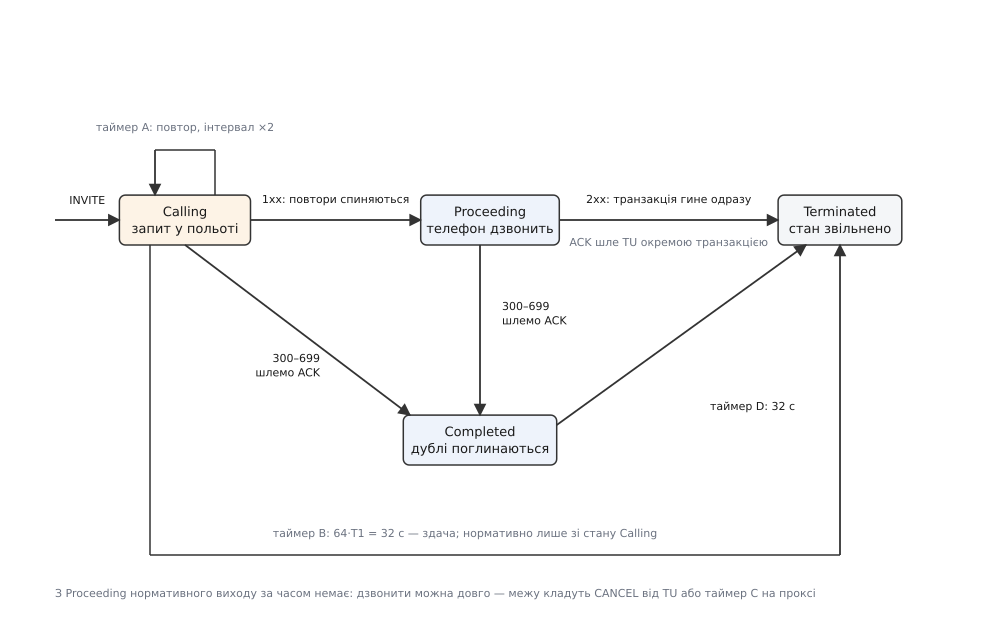
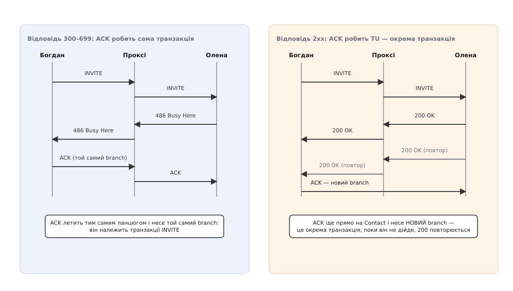

# ⚙️ Клієнтська транзакція INVITE: автомат, що робить UDP надійним

Це той шар, який перетворює «кинули пакет у мережу» на «за скінченний час маємо відповідь: з'єднано, відмовлено або мовчання». Він невеликий — сотня рядків, — але кожен його стан і кожен таймер стоять там через конкретну поломку, яка стається без них.

### Задача

Дано: сокет UDP і готовий текст запиту `INVITE`. Треба надіслати його й **гарантовано** дійти до одного з трьох висновків, не підвісивши того, хто чекає, і не залишивши по собі сміття в пам'яті. При цьому той самий сокет одночасно обслуговує сотні інших викликів, а мережа має право губити будь-який пакет у будь-який бік.

Спокуса написати це як «надіслати й чекати з таймаутом» велика. Розберімо, об що саме вона розбивається.

**Пакет губиться.** [UDP не обіцяє доставки](topic:communications/tcp-vs-udp) — ні запиту, ні відповіді. Отже, повторювати. Але скільки й як часто? Сталий крок у півсекунди протягом 32 секунд — це 64 копії `INVITE` на кожен виклик, що не дійшов; при тисячі викликів за секунду мережа лягає саме тоді, коли їй і так погано. Тому крок [подвоюється](topic:programming/retries-backoff): втрачений через випадковий збіг пакет знайдеться на другій спробі, а справді мертвий напрямок не отримає шторму.

**Відповідь може законно затриматися на хвилину.** Між запитом і `200 OK` стоїть жива людина, яка йде до апарата. Виходить, один таймаут мусить відповідати на два різні питання водночас: «чи дійшов мій запит?» і «яке рішення?» — а це різні питання з різними строками. Розчепити їх дозволяє проміжна відповідь: `100 Trying` не каже про долю виклику нічого, він каже «я його отримав». Цього досить, щоб зупинити повтори й перейти до іншого, набагато довшого очікування.

**Остаточна відповідь теж губиться.** Якщо `486 Busy Here` не дійшов, інша сторона надішле його ще раз — і ще. Наше `ACK` доводиться повторювати на кожен дубль, але доповісти нагору про відмову треба **рівно один раз**. Значить, потрібен стан, у якому транзакція вже все сказала й лише мовчки поглинає повтори.

**Відповіді на всі виклики сиплються в один сокет.** Перш ніж робити з пакетом бодай щось, його треба віднести до конкретної транзакції. Ключ для цього складений, і саме на ньому найлегше помилитися — до цього повернемося серед пасток.

Чотири вимоги — і з них сам собою випадає [скінченний автомат](topic:electronics/finite-state-machines): чотири стани, у кожному свій дозволений набір подій, переходи лише за подією або за часом.


*Автомат клієнтської транзакції INVITE. Таймер A жене повтори, таймер B кладе межу мовчанню, таймер D тримає стан живим рівно стільки, щоб поглинути дублі остаточної відповіді.*

Розклад повторів рахується просто, і його варто побачити числами:

```
T1 = 500 мс — прийнята за замовчуванням оцінка часу обігу

   0.0 с   INVITE       далі крок 0.5 с
   0.5 с   повтор 1     крок → 1.0 с
   1.5 с   повтор 2     крок → 2.0 с
   3.5 с   повтор 3     крок → 4.0 с
   7.5 с   повтор 4     крок → 8.0 с
  15.5 с   повтор 5     крок → 16.0 с
  31.5 с   повтор 6     крок → 32.0 с
  32.0 с   таймер B: здача, 64·T1 = 32 с

усього 7 передач за 32 с — проти 64 зі сталим кроком
```

### Код

Дві реалізації того самого автомата. У C++ стан живе в записі фіксованого розміру, а таймери — це просто два строки в ньому: обробка пакета не робить жодної алокації, а знищення запису знімає обидва таймери за побудовою. У Go природніше дати кожній транзакції горутину, а таймери зробити каналами в `select` — тоді автомат читається як лінійний текст. Стану `Terminated` в жодній із реалізацій немає окремим значенням: він і **є** зникнення запису — у C++ повернення комірки в пул, у Go вихід із горутини.

:::tabs
```cpp
using clk = std::chrono::steady_clock;
using ms  = std::chrono::milliseconds;

constexpr ms T1{500};              // оцінка часу обігу за замовчуванням
constexpr ms TIMER_B  = 64 * T1;   // 32 с — стеля мовчання
constexpr ms TIMER_D{32000};       // ≥ 32 с — поглинання дублів
constexpr ms RINGING{180000};      // власна межа для Proceeding (див. пастку 1)
constexpr auto NEVER = clk::time_point::max();

enum class St : uint8_t { Calling, Proceeding, Completed };

struct Txn {
    St        st       = St::Calling;
    clk::time_point a  = NEVER;    // наступний повтор
    clk::time_point bd = NEVER;    // здача (B) або кінець поглинання (D)
    ms        step     = T1;       // поточний крок повтору
    uint64_t  key      = 0;        // branch ⊕ метод CSeq
    uint16_t  len      = 0;
    char      req[1400];           // серіалізовано ОДИН раз: повтори йдуть байт-у-байт
};

// Дає парсер (поза цим прикладом): вказівники всередину буфера прийому.
struct Match { std::string_view branch, method; int status; };
Match parse(std::string_view msg) noexcept;

class TxnLayer {
public:
    TxnLayer(Udp& u, Tu& tu) : udp_(u), tu_(tu) {
        pool_.resize(kMax);                 // єдині алокації — на старті
        index_.reserve(kMax * 2);
        for (uint32_t i = kMax; i-- > 0;) free_.push_back(i);
    }

    uint32_t start(std::string_view invite, clk::time_point now) {
        uint32_t i = free_.back(); free_.pop_back();
        Txn& t = pool_[i];
        t = Txn{};
        t.step = T1;
        t.a    = now + T1;                  // таймер A
        t.bd   = now + TIMER_B;             // таймер B
        t.len  = pack(t.req, invite);
        t.key  = key_of(top_via_branch(invite), "INVITE");
        index_.emplace(t.key, i);
        udp_.send(t.req, t.len);
        return i;
    }

    // Гарячий шлях: прийшов пакет. Жодної алокації, жодного копіювання тіла.
    void on_response(std::string_view msg, clk::time_point now) {
        const Match m = parse(msg);
        auto it = index_.find(key_of(m.branch, m.method));
        if (it == index_.end()) { tu_.stray(msg); return; }   // не наша — нагору як є
        Txn& t = pool_[it->second];

        if (m.status < 200) {                       // 1xx
            if (t.st == St::Calling) {
                t.st = St::Proceeding;
                t.a  = NEVER;                       // повтори спиняємо
                t.bd = now + RINGING;               // і міняємо межу очікування
            }
            tu_.provisional(it->second, msg);
        } else if (m.status < 300) {                // 2xx
            tu_.success(it->second, msg);           // ACK зробить TU, не ми
            release(it);                            // транзакція гине негайно
        } else {                                    // 300–699
            send_ack(t, m);                         // ACK наш, із тим самим branch
            if (t.st != St::Completed) {            // доповідаємо РІВНО раз
                tu_.failure(it->second, msg);
                t.st = St::Completed;
                t.a  = NEVER;
                t.bd = now + TIMER_D;               // далі лише мовчки ACK-аємо дублі
            }
        }
    }

    void tick(clk::time_point now) {
        for (auto it = index_.begin(); it != index_.end(); ) {
            Txn& t = pool_[it->second];
            if (now >= t.a) {
                udp_.send(t.req, t.len);            // той самий байт-у-байт запит
                t.step *= 2;                        // 0.5 → 1 → 2 → 4 … без стелі T2
                t.a = now + t.step;
            }
            if (now >= t.bd) {
                if (t.st != St::Completed) tu_.timeout(it->second);  // ACK тут НЕ шлемо
                release(it++);
                continue;
            }
            ++it;
        }
    }

private:
    // Єдине місце, де транзакція вмирає. Обидва таймери зникають разом
    // із записом — осиротілий таймер, що стрельне в мертву транзакцію,
    // у цій схемі неможливий.
    void release(Index::iterator it) noexcept {
        free_.push_back(it->second);
        index_.erase(it);
    }

    static constexpr uint32_t kMax = 8192;
    Udp& udp_; Tu& tu_;
    std::vector<Txn>     pool_;
    std::vector<uint32_t> free_;
    Index                index_;   // unordered_map<uint64_t, uint32_t>
};
```
```go
const (
	T1      = 500 * time.Millisecond
	timerB  = 64 * T1              // 32 с — стеля мовчання
	timerD  = 32 * time.Second     // поглинання дублів
	ringing = 3 * time.Minute      // власна межа для Proceeding (див. пастку 1)
)

type response struct {
	status int
	raw    []byte
}

type txn struct {
	key  string             // branch + метод CSeq
	req  []byte             // серіалізований INVITE
	in   chan response      // сюди демультиплексор кладе відповіді
	tu   TU
	send func([]byte)
	drop func(string)       // зняти запис із покажчика транзакцій
}

func (t *txn) run() {
	defer t.drop(t.key)     // хоч як вийдемо — запис зникне

	t.send(t.req)
	a := time.NewTimer(T1)      // таймер A: повтор
	b := time.NewTimer(timerB)  // таймер B: здача
	defer a.Stop()
	defer b.Stop()
	step := T1

	for { // Calling і Proceeding
		select {
		case <-a.C:
			t.send(t.req)          // повтор байт-у-байт
			step *= 2              // 0.5 → 1 → 2 → 4 … без стелі T2
			a.Reset(step)

		case <-b.C:
			t.tu.Timeout(t.key)    // здача; ACK на це НЕ шлемо
			return

		case r := <-t.in:
			switch {
			case r.status < 200: // 1xx
				if a.Stop() {
					step = 0       // повтори більше не потрібні
				}
				b.Reset(ringing)   // і межа очікування тепер інша
				t.tu.Provisional(t.key, r.raw)

			case r.status < 300: // 2xx
				t.tu.Success(t.key, r.raw) // ACK зробить TU, окремою транзакцією
				return

			default: // 300–699
				t.sendACK(r)               // ACK наш, із тим самим branch
				t.tu.Failure(t.key, r.raw) // доповідаємо РІВНО раз
				t.completed()
				return
			}
		}
	}
}

// Completed: транзакція вже все сказала TU. Її єдина робота — повторювати ACK
// на дублі відповіді, щоб ті не піднялися нагору вдруге.
func (t *txn) completed() {
	d := time.NewTimer(timerD)
	defer d.Stop()
	for {
		select {
		case <-d.C:
			return
		case r := <-t.in:
			if r.status >= 300 {
				t.sendACK(r) // мовчки: TU про дубль знати не треба
			}
		}
	}
}
```
:::

### Пастки

**1. `100 Trying` спиняє таймер A — а що робити з B, специфікація насправді не каже.** Нормативне речення RFC 3261 обмежує здачу станом `Calling`: «If the client transaction is still in the 'Calling' state when timer B fires…», і на діаграмі §17.1.1.2 стрілка виходу за таймером B намальована теж лише з `Calling`. Обидва буквальні прочитання погані. Залишити B на 32 секундах — і нормальний виклик обірветься на 32-й секунді дзвінка, хоча телефон дзвонить хвилину. Не залишити нічого — і транзакція висітиме вічно, якщо співрозмовник помер одразу після `100 Trying`. Це не помилка читання: питання «коли ж тоді виклична сторона звільняє ресурс, якщо співрозмовник зник одразу після `100 Trying`» ставили в робочій групі SIP прямо, і відповідь була така — межу кладе не транзакція, а рівень вище: людина, яка кладе слухавку й породжує `CANCEL`, або таймер C на проксі (понад 3 хвилини, RFC 3261 §16.6, поновлюваний кожною новою проміжною відповіддю). Тому в обох реалізаціях вище `Proceeding` дістав власну довгу межу, а не залишок від B.

**2. Два різні `ACK` з однаковою назвою.** На `300–699` підтвердження робить **сама транзакція**: воно несе той самий `branch`, тобто належить тій самій транзакції, і йде тим самим ланцюгом проксі. На `2xx` — навпаки: транзакція гине негайно, а підтвердження робить TU, з **новим** `branch`, як окрему транзакцію, і шле його прямо на адресу з `Contact`, повз проксі. Наслідок, який ловлять найдовше: поки це `ACK` не дійде, інша сторона повторюватиме `200 OK` — а транзакції, яка б їх поглинула, вже немає, тож дублі підуть у TU як «нічиї». Це не аварія, а задум: саме TU мусить на кожен такий дубль надіслати `ACK` ще раз.


*Однакове слово, різні механізми. Ліворуч підтвердження — частина транзакції; праворуч — окрема транзакція, яку робить і повторює рівень вище.*

**3. Зіставляти треба за парою — і невдале зіставлення не привід мовчати.** Ключ транзакції — це `branch` із верхнього `Via` **плюс** метод із `CSeq`. Метод там не для симетрії: `CANCEL` навмисно несе ту саму мітку `branch`, що й `INVITE`, який він скасовує, — інакше проксі не знав би, яку саме транзакцію гасити. Ключ лише за `branch` заведе відповідь `200 OK` на `CANCEL` просто в автомат `INVITE`, той визнає виклик успішним і віддасть TU відповідь на зовсім інший запит. Друга половина правила не менш важлива: відповідь, яка не зіставилася **ні з чим**, не викидається, а йде нагору як є. На цьому тримається пастка 2 — повтори `200 OK` після смерті транзакції прилітають «нічийними» й мусять дійти до TU, щоб той повторив `ACK`.

**4. Форк робить `2xx` не один.** Якщо запит десь по дорозі розмножився на кілька апаратів і двоє підняли слухавку, успішних відповідей буде кілька — з різними мітками сторони. RFC 3261 віддає транзакцію на смерть після першої, і решта прилітає «нічийною». RFC 6026 (2010) це виправив: додав п'ятий стан `Accepted`, у якому транзакція живе ще 64·T1 за таймером M і передає нагору всі `2xx`, які надійдуть. У коді вище це шість рядків: замість `return` на `2xx` — перехід у цикл на кшталт `completed()`, тільки з передачею кожної відповіді в TU.

**5. Таймер D не масштабується від T1.** Його значення — не «стільки-то разів T1», а «не менше ніж 32 секунди» для ненадійного транспорту й нуль для надійного. Причина проста: він мусить пережити **чужий** розклад повторів, а не свій. Хто вважає його за формулою від T1 і підкручує T1 угору «щоб надійніше», отримує стан, який зникає раніше, ніж інша сторона припинить повторювати відповідь, — і поодинокі задвоєні «зайнято» в журналі.

**6. Крок повтору `INVITE` подвоюється без стелі.** У транзакціях інших методів той самий таймер упирається в `T2` = 4 с і далі не росте. Спокуса перевикористати вже написаний код повторів дає `INVITE`, який після четвертої спроби гатить у мережу рівно кожні 4 секунди аж до здачі: 11 передач замість 7 — і саме в той бік, який і так мовчить.

> 🔧 **Навіщо це.** Коли в журналі видно сім `INVITE` поспіль із інтервалами, що подвоюються, — це не «глюк клієнта», це справний таймер A, а справжня новина в тому, що назад не прилетів навіть `100 Trying`: дивитися треба на зворотний шлях, тобто на `Via`. Коли ж `100 Trying` є, а виклик обривається рівно на 32-й секунді дзвінка — навпаки, зламаний клієнт: він залишив таймер B там, де його не мало бути.

### Ціна

На гарячому шляху обидві реалізації — це O(1) на пакет: одне зіставлення за ключем і кілька присвоєнь. Пам'ять — один запис на виклик у польоті плюс уже серіалізований запит; за 32 секунди поглинання дублів запис живе після того, як виклик уже вирішено, тож при тисячі спроб за секунду в найгіршому разі це десятки тисяч живих записів — саме тому запис має фіксований розмір, а не купу рядків.

Один справжній недолік у коді вище навмисний: `tick()` обходить усі транзакції. Так простіше читати, але це O(n) на кожен такт. Щойно транзакцій стають десятки тисяч, строки переїжджають у купу або в таймерне колесо, і вартість падає до O(log n) на подію — сам автомат при цьому не змінюється жодним рядком.
