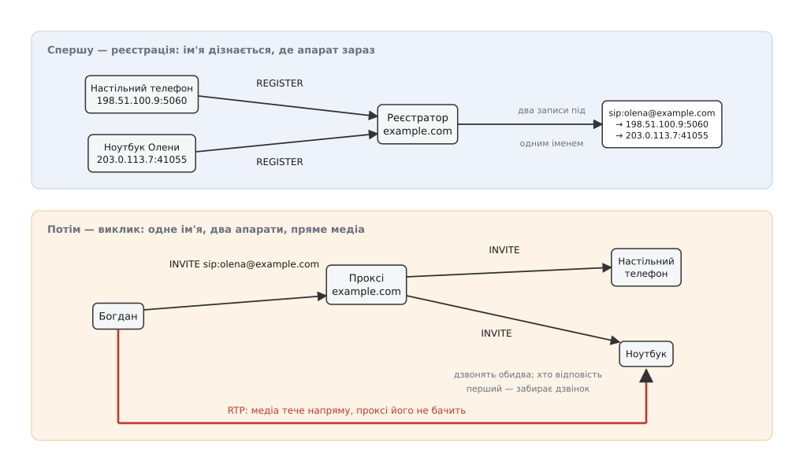
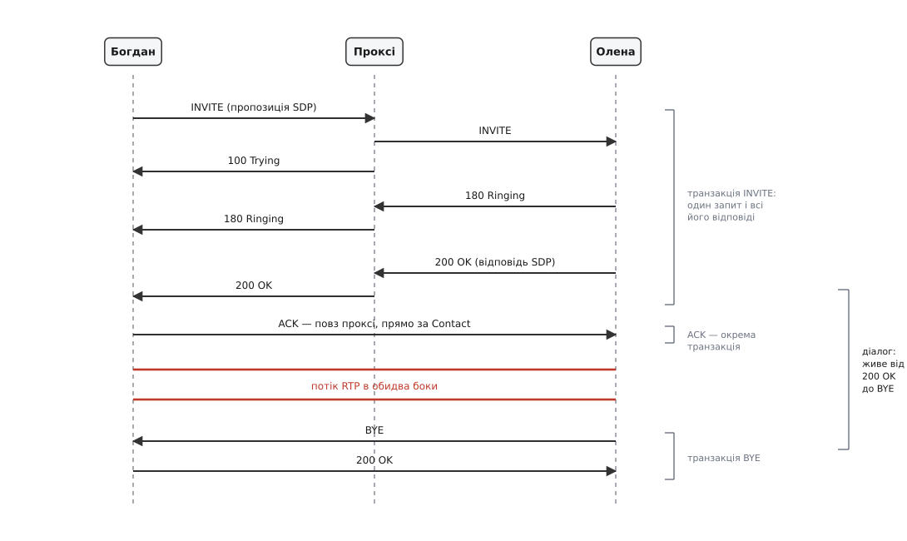
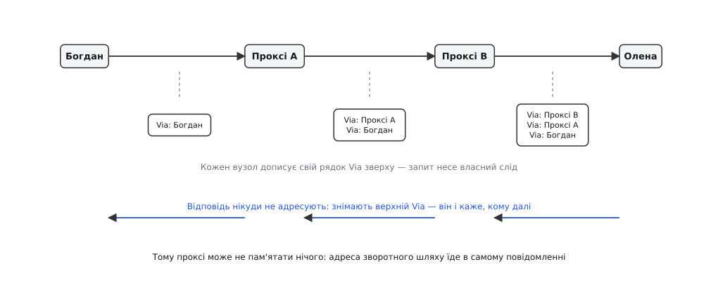

# SIP: сигналізація сеансів зв'язку

<preknowlist>
- [RTP і RTCP](topic:communications/rtp-rtcp) — медіа їде окремими датаграмами з номером і міткою часу; сам потік не каже ні хто його шле, ні кому, ні навіщо.
- [RTSP і SDP](topic:communications/rtsp-sdp) — SDP як телеграма-опис сеансу (рядки `m=`, `a=rtpmap`) і надбудова «пропозиція — відповідь» над ним.
- [TCP проти UDP](topic:communications/tcp-vs-udp) — чим надійне з'єднання відрізняється від датаграм, яким ніхто нічого не гарантує.
- [DHCP і DNS](topic:communications/dhcp-dns) — як ім'я перетворюється на адресу і чому адреса абонента непостійна.
- [NAT](topic:communications/nat) — трансляція адрес: усередині приватна адреса, назовні чужа, і вузол своєї зовнішньої адреси не знає.
- [HTTP](topic:programming/http) — текстовий обмін «запит — відповідь»: рядок методу, заголовки через двокрапку, тризначний код стану.
</preknowlist>

Богдан набирає Олену. Він знає ім'я — `sip:olena@example.com` — і більше нічого. Де Олена цієї хвилини, не знає ніхто: вранці роутер перезавантажився і видав ноутбукові іншу адресу, настільний телефон стоїть у конторі, а телефон у кишені щойно перескочив із Wi-Fi на мобільну мережу. Голос же, коли він піде, буде просто чергою пакетів між парою «адреса : порт» на кожному кінці — чотирма числами, яких зараз не знає жодна зі сторін.

Отже, між «я знаю ім'я» і «пакети течуть» мусить відбутися окрема розмова. У ній треба зробити три речі, і жодна з них не схожа на передавання звуку: знайти людину там, де вона є **зараз**; спитати, чи вона взагалі хоче говорити, і дочекатися, поки вона підійде до апарата; домовитися про ті самі чотири числа й про те, чим стиснуто голос. Розмову ведуть машини, вона не несе ані байта корисного вмісту — лише домовляється. Таку розмову називають **сигналізацією** (від лат. *signum* — «знак»).

Чому її не вбудували в сам потік? Бо вимоги в них протилежні. Домовленість трапляється кілька разів за дзвінок, зате мусить дійти напевно, мусить пройти **через сервери**, які знають, де хто живе, і мусить дозволити цим серверам себе прочитати й дописати. Голос іде тисячами пакетів за хвилину, важить кожні десять мілісекунд затримки, мусить летіти **найкоротшим шляхом** і аж ніяк не через чужі сервери. Один протокол не витягне обох вимог: те, що добре ходить через посередників, погано ходить швидко. Тому домовленість винесли в окремий протокол — **SIP** (англ. *Session Initiation Protocol* — «протокол започаткування сеансу», чинна редакція — RFC 3261 від червня 2002 року), а потік лишили [RTP](topic:communications/rtp-rtcp). Вони не перетинаються ніде: SIP не бачить звуку, RTP не знає імен. [Народився SIP не з телефонії](topic:communications/sip/hist-sip-birth.md), і це помітно в кожній його рисі.

### Ім'я, що не знає адреси

Почнімо з найпершої перешкоди: `sip:olena@example.com` — не адреса. Це ім'я, яке має жити роками й не залежати ні від пристрою, ні від провайдера, ні від міста. Адреса ж міняється щодня. Між ними мусить хтось стояти.

Стоїть **служба розташувань** — проста таблиця «ім'я → де воно зараз». Заповнює її не адміністратор, а сам апарат: увімкнувшись, він шле запит `REGISTER` на сервер свого домену й каже — «я той, кого звати `sip:olena@example.com`, сьогодні мене можна знайти за `198.51.100.9:5060`, тримай цей запис годину». Постійне ім'я в SIP так і називають — **адреса запису** (англ. *address of record*, AoR), а тимчасове місце — **контакт**.

Запис навмисно не вічний. Ноутбук може згорнути кришку, вимкнутися чи піти в інший Wi-Fi, і жоден із цих випадків не надішле серверові жодного повідомлення — то нащо серверові вірити старій адресі? Тому реєстрація має строк (`Expires`), а апарат мусить її повторювати. Строк — це компроміс, який видно неозброєним оком: коротший означає менше «дзвінків у порожнечу», але більше службового трафіку, а на телефоні в кишені ще й помітно менше часу роботи від батареї.

Найважливіше в цій таблиці — те, що записів під одним іменем може бути **кілька**. Це не збій і не крайній випадок, а сенс усієї конструкції: людина одна, апаратів у неї три, і всі три мають повне право сказати «я — вона». Наслідок побачимо за хвилину, і він визначає, як SIP поводиться на виклику.

> 🔧 **Навіщо це.** Коли «дзвінок не проходить», перше, куди варто глянути, — таблиця реєстрацій на сервері. Порожній рядок означає, що апарат до нього не достукався (майже завжди — мережа чи пароль), а не що зламався виклик. Живий, але старий запис із приватною адресою всередині означає, що апарат зареєструвався **своєю** адресою і виклик до нього піде в нікуди. І якщо строк реєстрації більший за час, за який NAT забуває відображення порту, апарат буде «зареєстрований» і недосяжний водночас — стан, що виглядає як містика, поки не подивитися на два числа поруч.

### Виклик, що роздвоюється

Богданів апарат складає запит `INVITE sip:olena@example.com` і мусить кудись його віддати. Куди — випливає з правої частини імені: обслуговувати домен `example.com` має його ж сервер, а знайти цей сервер за іменем домену вміє [DNS через записи SRV і NAPTR](topic:communications/dns-srv-naptr), які кажуть не просто «яка адреса», а «який вузол, на якому порту й яким транспортом обслуговує таку-то службу цього домену».

Сервер, що приймає виклик, зазирає у службу розташувань і бачить там **два** контакти. Далі він робить те, чого не робить жоден звичайний маршрутизатор: **розмножує запит** і шле по копії на кожен контакт. Дзвонять обидва апарати. Хто відповість перший — забере дзвінок; решті сервер негайно шле `CANCEL`, і вони замовкають. Таке розгалуження (англ. *forking*) — не додаткова послуга, а пряме продовження того, що ім'я вказує на людину, а не на пристрій.

*Дві дії, рознесені в часі. Спершу кожен апарат сам записує свою поточну адресу під спільним іменем. Потім виклик за цим іменем розгалужується на всі записи одразу — а щойно хтось відповів, голос іде найкоротшим шляхом і сервера вже не стосується.*

Поки апарат дзвонить, Богданова сторона не мовчить: назад летять проміжні відповіді — `100 Trying` («запит прийнято, працюю»), `180 Ringing` («у неї дзвонить»), і аж потім `200 OK` («взяла слухавку»). Коди — тризначні, класами від 1xx до 6xx, точнісінько як у HTTP, звідки й запозичено весь вигляд повідомлень: рядок запиту, заголовки через двокрапку, порожній рядок, тіло. [Повний перелік методів, заголовків і кодів](topic:communications/sip/api-sip-messages.md) варто мати під рукою окремо — тут важить не список, а те, як із цих частин виходить робочий механізм.

### Дві шкали стану

Тепер придивімося до того, що саме сервер і апарати мусять про цей виклик **пам'ятати**. Виявляється, пам'ять потрібна на двох зовсім різних шкалах часу, і плутанина між ними — джерело половини помилок у роботі з SIP.

Коротка шкала — це **один запит і всі відповіді на нього**. `INVITE` пішов, назад прийшли `100`, `180`, `200` — усе це одна історія, вона триває від секунд до хвилини й закінчується назавжди. Таку історію звуть **транзакцією** (від лат. *transactio* — «залагодження справи»). Її впізнають за міткою `branch` у верхньому заголовку `Via`; мітка починається з умовного набору літер `z9hG4bK`, яким сучасне повідомлення відрізняє себе від давніших редакцій протоколу.

Довга шкала — це **самі стосунки** двох сторін: розмова почалася й триває, доки хтось не поклав слухавку. Це **діалог**, і його впізнають за трійкою «ідентифікатор виклику `Call-ID` плюс мітка кожної зі сторін». Діалог живе годину, поки транзакції всередині нього виникають і згасають: `INVITE` на початку, `re-INVITE` посередині, `BYE` наприкінці — кожна окрема транзакція в межах одного діалогу.

*Дві шкали пам'яті. Транзакція — короткий обмін навколо одного запиту; діалог — стосунок, що переживає кілька транзакцій поспіль. Підтвердження ACK стоїть окремо, і саме тому воно йде повз проксі.*

Звідси випливає особливість, яку помічають одразу: `INVITE` завершується **трьома** ходами, а не двома. Причина — людина посередині. Між запитом і `200 OK` минає стільки, скільки Олена йшла до апарата, і весь цей час виклична сторона не має права вважати запит загубленим. А коли `200 OK` нарешті з'явився, він означає вже не «запит дійшов», а «сеанс відкрито» — і мусить повторюватися, доки його не підтвердять. Тому третім ходом іде `ACK`: він не належить до транзакції `INVITE`, він **окремий**, і саме тому летить напряму від апарата до апарата, минаючи проксі.

### Надійність там, де її не обіцяли

Класичний SIP їздить поверх UDP, а UDP не гарантує нічого. Але щойно ми домовилися рахувати транзакції, надійність будується просто: якщо на запит немає відповіді — повторити його.

Так і зроблено, з експоненційним відступом. Перший повтор — через `T1` = 500 мс (це не виміряна величина, а прийнята за замовчуванням оцінка часу обігу), далі 1 с, 2 с, 4 с, і так до стелі. Загальний строк терпіння — 64 · T1, тобто 32 секунди: не діждавшись за цей час нічого, сторона оголошує запит невдалим. Повтори `INVITE` спиняє перша ж проміжна відповідь: `100 Trying` не каже нічого про долю виклику, він каже лише «замовкни, я його отримав» — і тим економить мережу на весь час, поки людина йде до телефона.

Постає природне питання: навіщо все це, коли є TCP, який ті самі повтори вже вміє? Бо надійність тут потрібна **не на з'єднанні, а на запиті**. Шлях від Богдана до Олени складається з кількох перегонів, і кожен може бути іншим транспортом: апарат тримає TCP до свого сервера, сервери між собою говорять по UDP, останній перегін знову TCP. Обірваний TCP між двома проксі не повинен вбивати розмову, яка вже йде: медіа тече напряму й про сигналізацію не знає. Тому надійність живе рівнем вище за транспорт — у шарі транзакцій, який однаково працює над будь-яким із них. [Цей шар — скінченний автомат із трьома таймерами](topic:communications/sip/proj-invite-transaction.md), і написати його — найкоротший спосіб зрозуміти, чому SIP-стеки виглядають саме так.

### Як відповідь знаходить дорогу назад

Лишається питання, яке в мережі з посередниками зовсім не дрібне: відповідь `200 OK` народжується в Олени — звідки їй знати шлях назад через ланцюг проксі, кожен з яких міг про виклик уже й забути?

Відповідь у тому, що шлях назад **везе з собою сам запит**. Кожен вузол, пропускаючи запит далі, дописує **зверху** рядок `Via` зі своєю адресою. Запит доходить до Олени зі стосом таких рядків — це його власний слід. Відповідь нікуди не адресують: беруть верхній `Via`, знімають його і шлють туди, що там написано. Наступний вузол робить те саме. Стос тане, відповідь іде рівно тим шляхом, яким прийшов запит, у зворотному порядку.

*Зворотний шлях їде в самому повідомленні. Кожен вузол на шляху туди дописує свій рядок згори; на шляху назад верхній рядок знімають — і він каже, кому передавати далі. Проксі, який нічого не запам'ятав, усе одно поверне відповідь правильно.*

Тут легко змішати три заголовки, які всі виглядають як «адреса», а означають різне. `Via` — це шлях **однієї відповіді на один запит**, він живе стільки, скільки транзакція. `Contact` — це «ось я особисто, наступні запити цього діалогу шліть просто сюди»: саме тому `ACK` і `BYE` летять напряму. А коли проксі хоче лишитися на шляху й далі — скажімо, бо він мусить порахувати тривалість дзвінка або пропустити його через себе на виході з мережі, — він дописує себе в `Record-Route`, і обидві сторони запам'ятовують цей маршрут як `Route` на весь діалог. Різниця практична: `Via` зникає за секунди, `Route` тримається годинами.

> 🔧 **Навіщо це.** Читаючи чужий журнал SIP, дивіться на ці три заголовки в такому порядку. Відповіді не доходять назад — винен `Via` (майже завжди адреса в ньому приватна). Дзвінок з'єднався, але `BYE` не спрацював і розмова «зависла» — винен `Contact` із недосяжною адресою. Дзвінок працює, але сервер не бачить його завершення й неправильно тарифікує — забули `Record-Route`. Три різні симптоми, три різні заголовки, жодного перетину.

### Домовитися про медіа, не знаючи про медіа нічого

Тепер найцікавіше: у самому SIP немає жодного слова про звук. Ні про кодеки, ні про частоти, ні про порти для потоку. Усе це їде **в тілі** повідомлення описом [SDP](topic:communications/rtsp-sdp), який SIP переносить, як конверт переносить лист, і не читає.

Домовляються за правилом, простим до банальності: одна сторона кладе в повідомлення **пропозицію** — «ось мої адреса й порт, ось кодеки, які я вмію, в порядку переваги», друга у відповідь кладе **відповідь** — той самий набір блоків у тому самому порядку, але з викресленим зайвим і зі своїми адресою й портом. Зазвичай пропозиція їде в `INVITE`, а відповідь — у `200 OK`. Буває й навпаки: апарат, який ще не знає, з якої мережевої картки говоритиме, шле порожній `INVITE`, і тоді пропозицію робить викликаний, а відповідь їде в `ACK`.

Щойно обмін завершився, обидві сторони мають ті самі чотири числа, з яких ми починали, і потік іде **напряму**. Проксі, який щойно розгалужував виклик, голосу вже не бачить і не почує його, навіть якщо схоче. Це не побічний ефект, а свідомий поділ обов'язків — і водночас причина, чому в SIP-мережах для запису розмов, транскодування чи міжоператорського стику ставлять окремі вузли, які **навмисно** вставляють себе в медійний шлях, підмінюючи адреси в SDP на власні.

### Стіна, об яку все це б'ється

Уся конструкція вище припускає, що вузол знає свою адресу й що за цією адресою до нього можна достукатися. За [NAT](topic:communications/nat) не вірне ні перше, ні друге, і ламається все одразу.

Апарат чесно пише в `Contact` і в SDP те, що бачить у себе, — `192.168.1.42`. Це означає: відповіді на його запити підуть у приватну адресу й помруть; `BYE` до нього не дійде; потік RTP полетить у порожнечу. Латок наросло кілька, і кожна лікує свою частину.

Перша: сервер відповідає **туди, звідки прийшов пакет**, а не туди, що написано в `Via`, — для цього в `Via` дописують позначку `rport` (RFC 3581, серпень 2003), яка це прямо дозволяє. Друга: те саме роблять із медіа — приймач шле пакети назад на ту адресу й порт, з яких вони прийшли, а не на ті, що вказані в SDP; це називають симетричним RTP. Третя: апарат мусить регулярно слати щось назовні, щоб відображення в трансляторі не встигло згаснути. І четверта, коли попередні не рятують, — обидві сторони заздалегідь збирають усі свої можливі адреси, включно з побаченими ззовні й позиченими в ретранслятора, і перевіряють їх перебором; [цим займається окремий механізм проходження NAT](topic:communications/nat-traversal). Той самий набір узяв собі [WebRTC](topic:communications/webrtc), тільки вже як обов'язкову частину, а не як латку.

### Сеанс, що змінюється й закінчується

Діалог, який ми відкрили, живий — і його можна переписати, не розриваючи. Повторний `INVITE` усередині того самого діалогу несе нову пропозицію SDP: так ставлять на утримання (у пропозиції глушать напрямок передавання), так додають до розмови відео, так переходять на інший кодек, коли мережа зіпсувалася.

Переведення дзвінка зроблено окремим методом `REFER` (RFC 3515, квітень 2003): він каже співрозмовникові не «я тебе перемикаю», а «зроби, будь ласка, виклик ось за цим іменем» — і потім сповіщає того, хто просив, чим це скінчилося.

І останнє, що доводиться лікувати окремо: діалог не має способу дізнатися, що на тому кінці вимкнули світло. `BYE` не прийшов, отже сеанс з погляду серверів триває — з зайнятим каналом і, якщо оплата погодинна, з рахунком, що росте. Тому домовилися про строк придатності самого сеансу: сторони узгоджують період і зобов'язуються всередині нього надсилати оновлення (RFC 4028, квітень 2005). Не прийшло оновлення — сеанс вважають мертвим і прибирають. Так само, як реєстрація має строк, — і з тієї самої причини.

### Довіра, якої за замовчуванням немає

SIP — відкритий текст. Хто бачить пакет, той читає, хто й кому дзвонить, і за потреби переписує.

Від найгрубішого зловживання захищаються перевіркою на кожен запит окремо: сервер відмовляє й дає одноразове число, апарат рахує від нього й від пароля хеш і повторює запит із цим доказом. Пароль по мережі не йде, повторити чужий доказ пізніше не вийде — це [дайджест-автентифікація](topic:communications/digest-authentication), позичена в HTTP разом з усім іншим. Вона доводить, що запит склав власник пароля, і не доводить нічого про його вміст: заголовки на шляху лишаються голими.

Далі є `TLS` — але з важливим обмеженням, яке випливає з усього сказаного вище. Проксі **мусить** читати й дописувати заголовки, інакше він не проксі. Отже, шифрування сигналізації буває тільки поперегінним: кожен перегін захищений, кожен проксі бачить усе. Наскрізної таємниці сигналізації в SIP немає за конструкцією, і схема `sips:` обіцяє не її, а лише те, що жоден перегін не піде відкритим. Голос шифрують окремо — [SRTP](topic:communications/srtp); і одразу видно слабину найпростішого способу передати для нього ключі, вписавши їх у SDP: ключ проходить через ті самі проксі, що й усе інше. Саме тому в WebRTC ключі медіа домовляють між кінцевими вузлами, а сигналізації довіряють лише звести їх докупи.

І ще одне, суто грошове. Сервер, який приймає `INVITE` без перевірки й слухняно веде його на телефонну мережу, за ніч продає чужим коштом трафік на кілька тисяч доларів у бік дорогих міжнародних напрямків. Це найчастіший практичний наслідок недбалої конфігурації SIP — не витік розмов, а рахунок.

---

Варто помітити, чого в SIP немає. У ньому немає звуку, немає відео, немає кодеків і немає жодного припущення про те, що саме сторони збираються робити разом. Він уміє рівно одне: знайти абонента за іменем, донести до нього пропозицію, повернути відповідь і тримати цей стосунок, доки хтось його не закриє. Через цю порожнечу всередині той самий протокол, що починався як запрошення на багатоадресну конференцію, однаково носить голос, відео, показ екрана, миттєві повідомлення й ознаку присутності — а WebRTC зміг узяти в нього серцевину «пропозиція — відповідь», викинувши сам SIP і замінивши його чим завгодно, аж до звичайного вебсокета.
