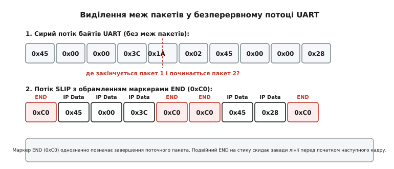
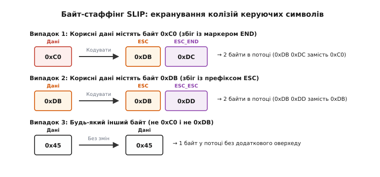
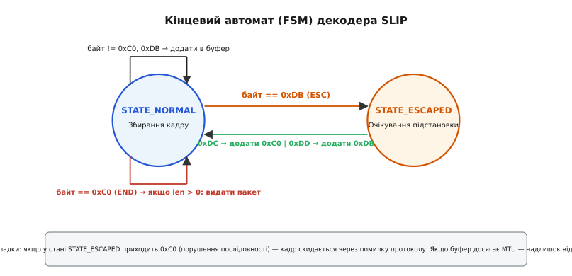
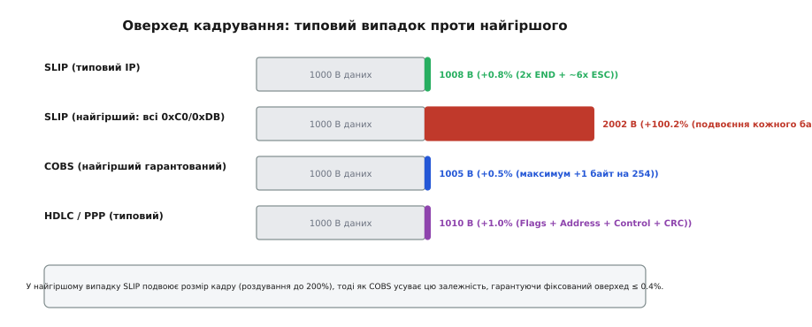
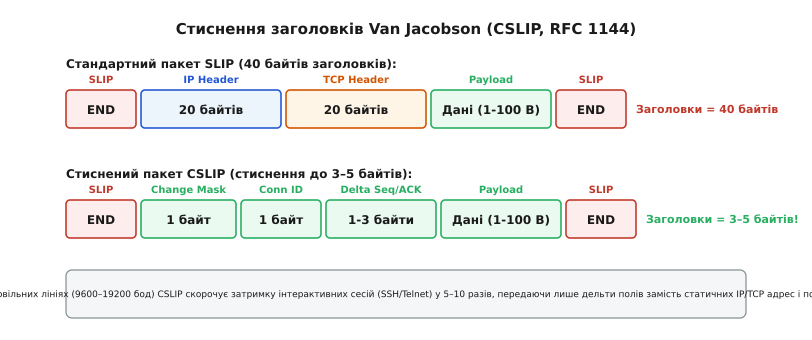

# Протокол SLIP: кадрування послідовного потоку

<preknowlist>
- [UART](topic:communications/uart) — асинхронний передавач/приймач, байти без прив'язки до меж повідомлень.
- [Проєктування пакета](topic:communications/packet-design) — межі, поля довжини, маркери та контроль цілості.
- [CRC](topic:communications/crc) — циклічний надлишковий код для виявлення спотворень у каналі.
- [Кадрування COBS](topic:communications/cobs-framing) — альтернативний метод усунення нульових байтів з гарантованим оверхедом.
- [RS-422 і RS-485](topic:communications/rs422-rs485) — фізичні рівні диференційного послідовного зв'язку.
</preknowlist>

Апаратний послідовний порт UART, лінія RS-232 чи диференційна шина RS-485 передають байти як неперервний потік. Передавач зсуває біти в лінію один за одним, а приймач фіксує перепад напруги старт-біта, зчитує вісім інформаційних бітів, перевіряє стоп-біт і поміщає отриманий байт у буферний регістр. На цьому апаратні обов'язки фізичного інтерфейсу завершуються. Фізичний рівень не має жодного уявлення про зміст даних, які він транспортує: для нього не існує понять «початок мережевого пакета», «заголовок» чи «кінець повідомлення».

Якщо мережевий стек спробує відправити в таку послідовну лінію сирий IP-пакет довжиною 576 байтів, а слідом за ним — наступний пакет на 128 байтів, приймач на іншому кінці кабелю побачить суцільну чергу з 704 байтів. Якщо обидва пристрої увімкнулися одночасно і жоден біт не спотворився завадою, приймач міг би спробувати прочитати поле загальної довжини з IP-заголовка першого пакета, відрахувати вказану кількість байтів і лише тоді шукати початок наступного. Проте в реальному каналі зв'язку приймач може під'єднатися до лінії посеред передачі пакета, апаратне переривання може запізнитися, або завада на лінії може спотворити значення довжини в заголовку. У такому разі вся подальша нарізка потоку на пакети безповоротно зміщується, руйнуючи зв'язок.

Щоб передавати дискретні повідомлення через потоковий канал, потік даних необхідно структурувати за допомогою спеціального канального протоколу **кадрування** (англійською *framing*, від староанглійського *framian* — «будувати рамку, обрамляти»). Історично першим, гранично простим і найвідомішим протоколом для розв'язання цієї задачі в мережах TCP/IP став **SLIP** (*Serial Line Internet Protocol*, латинське *serialis* — «рядний, послідовний», англійське *line* — «лінія, провід»).

### Фізична природа послідовного потоку та проблема меж

Асинхронний послідовний зв'язок працює без спільної тактової лінії. Приймач і передавач налаштовуються на однакову номінальну швидкість передачі (швидкість у бодах, наприклад 115200 біт/с). Приймач безперервно дискретизує лінію з частотою, що в 16 разів перевищує швидкість передачі даних (16-кратний оверсемплінг). Побачивши перепад напруги з логічної одиниці в логічний нуль (старт-біт), логіка порту відраховує 8 тактів до середини бітового інтервалу, а потім бере відліки 7, 8 і 9 для кожного з наступних восьми бітів даних, визначаючи значення біта за принципом більшості (*majority voting*).

На фізичному рівні можливі щонайменше три типи апаратних помилок:
1. **Помилка кадрування (Framing Error, FE)**: якщо стоп-біт наприкінці байта не виявлено (лінія залишилася в нулі), контролер UART виставляє прапорець `FE`. Це свідчить про розбіжність тактових генераторів або апаратний розрив лінії.
2. **Помилка переповнення буфера (Overrun Error, OE)**: якщо центральний процесор або контролер DMA не встиг забрати попередній байт із регістра прийому до того, як зсувний регістр завершив прийом наступного, новий байт перетирає старий або втрачається.
3. **Помилка парності (Parity Error, PE)**: якщо контрольний біт парності не сходиться з сумою бітів даних.

Коли стається помилка переповнення (`OE`), рівно один байт безповоротно випадає з потоку. Якщо вищий рівень намагається визначати межі повідомлень за зміщенням або лічильником байтів у заголовку, втрата одного байта призводить до того, що всі наступні поля зсуваються на одну позицію ліворуч: байти корисних даних інтерпретуються як службові заголовки, порти або контрольні суми.


*Сирий потік UART не має власних меж повідомлень. Протокол SLIP обрамляє кожен блок даних спеціальними маркерами END (0xC0), дозволяючи однозначно відокремити один пакет від іншого.*

Як показано на схемі, накладання спеціальних роздільників перетворює аморфний потік байтів на ланцюжок незалежних кадрів. Якщо передавач позначає завершення кожного кадру домовленим символом, приймачеві більше не потрібно знати внутрішню структуру корисного навантаження: він просто накопичує байти в буфері доти, доки не зустріне цей маркер.

### Керуючі символи SLIP та структура кадру (RFC 1055)

У червні 1988 року інженер Рік Адамс зафіксував механіку роботи протоколу в документі **RFC 1055** під назвою *"A Nonstandard for transmission of IP datagrams over serial lines: SLIP"*. Попри формальний статус «нестандарту» (IETF відмовилася робити SLIP офіційним стандартом через відсутність у ньому контрольної суми та службових полів), протокол став загальноприйнятим базисом для комутованого доступу до Інтернету на багато років. Ознайомитися з передумовами його створення можна в [історії створення SLIP](topic:communications/slip-protocol/hist-slip-origin.md).

Специфікація SLIP визначає чотири спеціальні однобайтові константи:

```
END     = 0xC0  [десяткове 192, двійкове 11000000]: маркер межі кадру
ESC     = 0xDB  [десяткове 219, двійкове 11011011]: префікс екранування колізій
ESC_END = 0xDC  [десяткове 220, двійкове 11011100]: байт підстановки для 0xC0
ESC_ESC = 0xDD  [десяткове 221, двійкове 11011101]: байт підстановки для 0xDB
```

Зверніть увагу: байт керування `ESC` у протоколі SLIP має шістнадцяткове значення `0xDB`. Його в жодному разі не слід плутати зі стандартним символом `ESC` таблиці ASCII, який має код `0x1B` (десяткове 27). Рік Адамс свідомо обрав значення з верхньої половини таблиці байтів (значення з установленим восьмим бітом `0x80`–`0xFF`), щоб уникнути конфліктів зі стандартними символами керування термінальних ліній Unix.

Базова структура кадру SLIP надзвичайно лаконічна:

```
[END (0xC0)]  [Корисні дані (IP-пакет після байт-стаффінгу)...]  [END (0xC0)]
```

Перед початком передачі корисного навантаження передавач надсилає маркер `END` (`0xC0`), потім передає всі байти даних пакета (замінюючи конфліктні символи), і завершує кадр ще одним маркером `END` (`0xC0`).

### Механіка байт-стаффінгу (Byte Stuffing)

Якщо покластися виключно на маркер `END` для позначення меж, виникає фундаментальна проблема колізії символів: що робити, якщо сам передаваний IP-пакет містить байт зі значенням `0xC0`?

IP-пакети транспортують довільні двійкові дані: скомпільовані програми, стиснені зображення, зашифрований трафік, числа з рухомою комою. Байт `0xC0` обов'язково зустрічатиметься всередині корисних даних. Якщо передати його в лінію як є, приймач хибно вирішить, що пакет передчасно завершився, розріже повідомлення навпіл і передасть мережевому стеку уривок, який буде негайно відкинуто як пошкоджений.

Для запобігання таким колізіям SLIP використовує механізм **байт-стаффінгу** (англійською *byte stuffing* від *stuff* — «набивати, вставляти», або *character escaping* від латинського *ex cappa* — «вислизати з плаща, екранувати»).


*При кодуванні конфліктні байти 0xC0 та 0xDB замінюються на двобайтові послідовності 0xDB 0xDC та 0xDB 0xDD. Усі інші байти проходять у потік без змін.*

Правила кодування SLIP суворо однозначні й симетричні:

1. Якщо в потоці вихідних даних зустрічається байт `0xC0` (`END`), передавач замінює його двобайтовою послідовністю:
   ```
   0xC0  →  0xDB 0xDC  (ESC + ESC_END)
   ```
2. Якщо в потоці вихідних даних зустрічається сам байт екранування `0xDB` (`ESC`), передавач замінює його двобайтовою послідовністю:
   ```
   0xDB  →  0xDB 0xDD  (ESC + ESC_ESC)
   ```
3. Будь-який інший байт (від `0x00` до `0xFF`, крім `0xC0` та `0xDB`) передається в послідовну лінію без будь-яких змін.

Завдяки цьому простому перетворенню байт `0xC0` **ніколи** не з'являється всередині тіла кадру під час передачі фізичною лінією. Байт `0xC0` у фізичному потоці стає унікальним, незаперечним маркером межі пакета.

#### Математична ймовірність та ентропія екранування

Оцінімо математичне очікування кількості додаткових службових байтів, які додає байт-стаффінг. Нехай ми передаємо блок даних довжиною `N` байтів, де кожен можливий байт від `0x00` до `0xFF` зустрічається з однаковою ймовірністю:

```
P(байта == 0xC0) = 1 / 256
P(байта == 0xDB) = 1 / 256
P(екранування)   = 2 / 256 = 1 / 128 ≈ 0.0078125  (0.78125%)
```

Математичне очікування кількості вставлених байтів екранування для випадкового некорельованого потоку становить:

```
E[Кількість_ESC] = N · (2 / 256) = N / 128
```

Для стандартного пакета довжиною 1500 байтів середнє число підстановок становить приблизно `1500 / 128 ≈ 11.7` байтів. Разом із двома обов'язковими маркерами `END` (на початку і в кінці кадру) середній розмір закодованого кадру становитиме `1500 + 12 + 2 = 1514` байтів, тобто середній оверхед не перевищує 0.93%.

Проте якщо дані не є випадковими — наприклад, передається масив чисел із плаваючою комою IEEE 754, де старший байт від'ємних чисел експоненти часто містить значення `0xC0` або `0xDB`, або бінарна бітова маска зі специфічним заповненням — частота колізій різко зростає.

#### Покроковий приклад кодування та декодування

Простежмо процес трансформації даних на конкретному масиві байтів. Нехай мережевий стек сформував для відправки повідомлення з шести байтів:

```
Вхідні дані (6 байтів):
[0x45, 0xC0, 0x00, 0x3C, 0xDB, 0x01]
```

**Крок 1. Передавач виконує кодування кадру:**
- Записує початковий маркер `END`: `0xC0`
- Байт `0x45`: звичайний байт → записує `0x45`
- Байт `0xC0`: збіг із `END` → записує два байти `0xDB 0xDC`
- Байт `0x00`: звичайний байт → записує `0x00`
- Байт `0x3C`: звичайний байт → записує `0x3C`
- Байт `0xDB`: збіг із `ESC` → записує два байти `0xDB 0xDD`
- Байт `0x01`: звичайний байт → записує `0x01`
- Записує фінальний маркер `END`: `0xC0`

```
Фізичний потік у дроті (10 байтів):
[0xC0, 0x45, 0xDB, 0xDC, 0x00, 0x3C, 0xDB, 0xDD, 0x01, 0xC0]
```

**Крок 2. Приймач декодує вхідний потік:**
- Отримує `0xC0`: фіксує початок нового кадру (очищає приймальний буфер).
- Отримує `0x45`: записує `0x45` у буфер.
- Отримує `0xDB`: перемикає внутрішній стан в режим «екранування» (*ESCAPED*).
- Отримує `0xDC`: бачить стан *ESCAPED* і код `ESC_END` → записує в буфер відновлений байт `0xC0`, скидає стан у *NORMAL*.
- Отримує `0x00`: записує `0x00` у буфер.
- Отримує `0x3C`: записує `0x3C` у буфер.
- Отримує `0xDB`: перемикає стан у режим *ESCAPED*.
- Отримує `0xDD`: бачить стан *ESCAPED* і код `ESC_ESC` → записує в буфер відновлений байт `0xDB`, скидає стан у *NORMAL*.
- Отримує `0x01`: записує `0x01` у буфер.
- Отримує `0xC0`: зустрічає маркер `END` → завершує збирання кадру та передає відновлений 6-байтовий масив мережевому стеку.

Початковий масив повністю та без спотворень відновлено на боці приймача.

### Кінцевий автомат декодера (FSM) та стійкість до завад

Розбір вхідного потоку байтів найефективніше реалізується у вигляді кінцевого автомата (англійською *Finite State Machine, FSM*, від латинського *finitus* — «визначений, обмежений»).


*FSM декодера має лише два базові стани. Приймач здатний обробляти байти в потоковому режимі прямо в обробнику переривань UART.*

Автомат містить два робочі стани:
1. `STATE_NORMAL`: звичайний режим збирання пакета. Отримані байти складаються в буфер. Зустріч `0xC0` завершує пакет, зустріч `0xDB` переводить автомат у стан `STATE_ESCAPED`.
2. `STATE_ESCAPED`: стан очікування символу підстановки. Отримання `0xDC` записує в буфер `0xC0`, а отримання `0xDD` записує `0xDB`. Будь-який інший байт повертає автомат у стан `STATE_NORMAL`.

#### Очищення лінії початковим END (Line Noise Flush)

Специфікація RFC 1055 вимагає обов'язково надсилати маркер `END` (`0xC0`) не лише наприкінці, але й на самому **початку** кожного кадру.

Навіщо витрачати зайвий байт пропускної здатності? Уявімо ситуацію: кабель зв'язку щойно підключили до роз'єму, або на лінії через електричну заваду згенерувався сплеск напруги, який приймач UART помилково розпізнав як 1–2 випадкові «сміттєві» байти. Ці байти вже лежать у внутрішньому буфері декодера.

Якщо передавач почне штампувати пакет без початкового `END`, декодер приєднає перші справжні байти нового пакета до попереднього сміття. У результаті весь новий пакет буде зіпсовано.

Коли ж передавач надсилає перед пакетом маркер `END`:
1. Початковий `END` негайно «закриває» попередній пакет зі сміттям. Декодер відправляє зібрані сміттєві байти вищому рівню, де стек IP моментально відкидає їх через неправильний заголовок або невалідну контрольну суму.
2. Приймальний буфер декодера очищається.
3. Усі наступні байти гарантовано формують чистий, новий пакет із нульової позиції.

Якщо між двома послідовними пакетами лінія не зазнала завад, приймач бачить два байти `0xC0` поспіль (`END` кінця попереднього пакета і `END` початку наступного). Отримавши другий `END` при нульовій довжині поточного буфера, декодер просто ігнорує його, не створюючи жодних фіктивних порожніх пакетів.

### Потоковий кодер та декодер у коді

Для вбудованих систем критично, щоб кодек працював без динамічного виділення пам'яті (`malloc`), обробляв дані побайтово прямо в кільцевому буфері UART і містив захист від переповнення буфера MTU. Детальний розбір розширеного кодека з обробкою переривань наведено у [потоковому SLIP-кодеку з буферизацією UART](topic:communications/slip-protocol/proj-slip-codec.md).

Розгляньмо базову реалізацію потокового парсера та пакувальника двома мовами: C та ідіоматичним C++.

:::tabs
```c
#include <stdint.h>
#include <stddef.h>
#include <stdbool.h>

#define SLIP_END     0xC0
#define SLIP_ESC     0xDB
#define SLIP_ESC_END 0xDC
#define SLIP_ESC_ESC 0xDD

typedef enum {
    SLIP_ST_NORMAL = 0,
    SLIP_ST_ESCAPED
} slip_fsm_state_t;

typedef struct {
    uint8_t         *rx_buf;
    size_t           max_len;
    size_t           rx_len;
    slip_fsm_state_t state;
    bool             overflow;
    void           (*packet_cb)(const uint8_t *pkt, size_t len, void *ctx);
    void            *user_ctx;
} slip_fsm_t;

void slip_fsm_init(slip_fsm_t *fsm, uint8_t *buf, size_t max_len,
                   void (*cb)(const uint8_t *, size_t, void *), void *ctx) {
    fsm->rx_buf = buf;
    fsm->max_len = max_len;
    fsm->rx_len = 0;
    fsm->state = SLIP_ST_NORMAL;
    fsm->overflow = false;
    fsm->packet_cb = cb;
    fsm->user_ctx = ctx;
}

void slip_fsm_parse_byte(slip_fsm_t *fsm, uint8_t byte) {
    if (fsm->state == SLIP_ST_NORMAL) {
        if (byte == SLIP_END) {
            if (fsm->rx_len > 0) {
                if (!fsm->overflow && fsm->packet_cb) {
                    fsm->packet_cb(fsm->rx_buf, fsm->rx_len, fsm->user_ctx);
                }
                fsm->rx_len = 0;
                fsm->overflow = false;
            }
        } else if (byte == SLIP_ESC) {
            fsm->state = SLIP_ST_ESCAPED;
        } else {
            if (fsm->rx_len < fsm->max_len) {
                fsm->rx_buf[fsm->rx_len++] = byte;
            } else {
                fsm->overflow = true;
            }
        }
    } else { /* SLIP_ST_ESCAPED */
        if (byte == SLIP_ESC_END) {
            if (fsm->rx_len < fsm->max_len) fsm->rx_buf[fsm->rx_len++] = SLIP_END;
            else fsm->overflow = true;
        } else if (byte == SLIP_ESC_ESC) {
            if (fsm->rx_len < fsm->max_len) fsm->rx_buf[fsm->rx_len++] = SLIP_ESC;
            else fsm->overflow = true;
        } else {
            /* Порушення стандарту завадою: записуємо байт як є */
            if (fsm->rx_len < fsm->max_len) fsm->rx_buf[fsm->rx_len++] = byte;
            else fsm->overflow = true;
        }
        fsm->state = SLIP_ST_NORMAL;
    }
}

size_t slip_encode(const uint8_t *src, size_t src_len, uint8_t *dst, size_t dst_max) {
    size_t pos = 0;
    if (pos >= dst_max) return 0;
    dst[pos++] = SLIP_END;

    for (size_t i = 0; i < src_len; ++i) {
        uint8_t b = src[i];
        if (b == SLIP_END) {
            if (pos + 2 > dst_max) return 0;
            dst[pos++] = SLIP_ESC;
            dst[pos++] = SLIP_ESC_END;
        } else if (b == SLIP_ESC) {
            if (pos + 2 > dst_max) return 0;
            dst[pos++] = SLIP_ESC;
            dst[pos++] = SLIP_ESC_ESC;
        } else {
            if (pos + 1 > dst_max) return 0;
            dst[pos++] = b;
        }
    }

    if (pos >= dst_max) return 0;
    dst[pos++] = SLIP_END;
    return pos;
}
```
```cpp
#include <cstdint>
#include <cstddef>
#include <span>
#include <functional>
#include <vector>

class SlipStreamParser {
public:
    enum class State : uint8_t { Normal, Escaped };

    static constexpr uint8_t DelimiterEnd    = 0xC0;
    static constexpr uint8_t PrefixEsc       = 0xDB;
    static constexpr uint8_t SubstringEscEnd = 0xDC;
    static constexpr uint8_t SubstringEscEsc = 0xDD;

    using FrameHandler = std::function<void(std::span<const uint8_t>)>;

    SlipStreamParser(std::span<uint8_t> buffer, FrameHandler handler) noexcept
        : rx_buffer_(buffer), handler_(std::move(handler)) {}

    void parse_byte(uint8_t byte) noexcept {
        if (state_ == State::Normal) {
            if (byte == DelimiterEnd) {
                if (write_index_ > 0) {
                    if (!overflow_flag_ && handler_) {
                        handler_(std::span<const uint8_t>(rx_buffer_.data(), write_index_));
                    }
                    write_index_ = 0;
                    overflow_flag_ = false;
                }
            } else if (byte == PrefixEsc) {
                state_ = State::Escaped;
            } else {
                store_byte(byte);
            }
        } else { /* State::Escaped */
            if (byte == SubstringEscEnd) {
                store_byte(DelimiterEnd);
            } else if (byte == SubstringEscEsc) {
                store_byte(PrefixEsc);
            } else {
                store_byte(byte);
            }
            state_ = State::Normal;
        }
    }

    void parse_chunk(std::span<const uint8_t> bytes) noexcept {
        for (uint8_t b : bytes) {
            parse_byte(b);
        }
    }

    void reset() noexcept {
        write_index_ = 0;
        state_ = State::Normal;
        overflow_flag_ = false;
    }

private:
    void store_byte(uint8_t b) noexcept {
        if (write_index_ < rx_buffer_.size()) {
            rx_buffer_[write_index_++] = b;
        } else {
            overflow_flag_ = true;
        }
    }

    std::span<uint8_t> rx_buffer_;
    FrameHandler handler_;
    size_t write_index_{0};
    State state_{State::Normal};
    bool overflow_flag_{false};
};

class SlipStreamPacker {
public:
    static size_t pack(std::span<const uint8_t> src, std::span<uint8_t> dst) noexcept {
        size_t out_idx = 0;
        if (dst.empty()) return 0;

        dst[out_idx++] = SlipStreamParser::DelimiterEnd;

        for (uint8_t b : src) {
            if (b == SlipStreamParser::DelimiterEnd) {
                if (out_idx + 2 > dst.size()) return 0;
                dst[out_idx++] = SlipStreamParser::PrefixEsc;
                dst[out_idx++] = SlipStreamParser::SubstringEscEnd;
            } else if (b == SlipStreamParser::PrefixEsc) {
                if (out_idx + 2 > dst.size()) return 0;
                dst[out_idx++] = SlipStreamParser::PrefixEsc;
                dst[out_idx++] = SlipStreamParser::SubstringEscEsc;
            } else {
                if (out_idx + 1 > dst.size()) return 0;
                dst[out_idx++] = b;
            }
        }

        if (out_idx >= dst.size()) return 0;
        dst[out_idx++] = SlipStreamParser::DelimiterEnd;
        return out_idx;
    }
};
```
:::

### Інтеграція SLIP у вбудований стек lwIP

У вбудованих мікроконтролерних системах (наприклад, на мікроконтролерах STM32 або ESP-IDF) для роботи з мережами TCP/IP повсюдно використовується відкритий стек **lwIP** (*Lightweight IP*).

Стек lwIP містить готовий драйвер мережевого інтерфейсу `netif/slipif.c`. Архітектура інтеграції включає такі кроки:
1. **Ініціалізація інтерфейсу**: функція `slipif_init(struct netif *netif)` реєструє інтерфейс типу `NETIF_FLAG_POINTTOPOINT`. Вона налаштовує розмір MTU (за замовчуванням 1500 або 576 байтів) та прив'язує функції виводу пакетів `slipif_output()`.
2. **Передавання пакетів**: коли lwIP відправляє датаграму, функція `slipif_output()` проходить ланцюжком буферів `pbuf`, вилучає байти заголовків і корисного навантаження, виконує байт-стаффінг і записує результат у передавальний FIFO-буфер UART за допомогою низькорівневої функції `sio_write()`.
3. **Приймання пакетів**: у фоновій задачі або періодичному таймері викликається функція `slipif_poll(struct netif *netif)`. Вона зчитує байти з послідовного порту через `sio_read()`, пропускає їх через внутрішній FSM і, отримавши кінцевий `0xC0`, виділяє буфер `pbuf` і передає готовий пакет у функцію обробки `netif->input(p, netif)`.

Завдяки цьому мікроконтролер отримує повноцінну підтримку сокетів BSD (TCP-сервери, HTTP-клієнти, MQTT-брокери) через простий трипровідний кабель UART (GND, TX, RX).

### Архітектурні обмеження та недоліки SLIP

Граничний мінімалізм SLIP забезпечив йому швидку популярність у 1980-х роках, проте саме цей мінімалізм став джерелом серйозних інженерних обмежень:

#### 1. Відсутність контролю цілісності на канальному рівні (No Link-Layer CRC)
У протоколі SLIP повністю відсутня власна контрольна сума (ні CRC-16, ні CRC-32, ні навіть контрольна сума XOR). SLIP повністю перекладає перевірку цілісності на вищі рівні мережевого стека — контрольну суму заголовка IP та контрольні суми TCP/UDP.

Якщо на фізичній лінії з'явиться одиночна завада, що спотворить байт даних або роздільник:
- Декодер SLIP не зможе виявити помилку локально;
- Пакет буде передано стеку IP, де він буде відкинутий лише після обчислення IP-хедерної суми;
- Драйвер SLIP не веде надійної канальної статистики співвідношення помилок (*Bit Error Rate, BER*), оскільки не знає, чи був кадр пошкоджений.

#### 2. Відсутність поля типу протоколу (No Protocol ID / EtherType)
Кадр SLIP не містить жодного службового байта, який би вказував тип інкапсульованого протоколу. SLIP здатний передавати **виключно** сирі пакети IPv4. Якщо через ту саму фізичну послідовну лінію потрібно одночасно передавати пакети IPv6, службові пакети ARP чи діагностичні протоколи керування, SLIP виявляється безсилим без нестандартних зовнішніх надбудов.

#### 3. Відсутність узгодження конфігурації та динамічної адресації
SLIP не має жодних засобів для автоматичного узгодження параметрів з'єднання. Обидві сторони зв'язку повинні заздалегідь, жорстко і вручну знати:
- IP-адресу власного вузла та IP-адресу віддаленого шлюзу;
- Максимальний розмір пакета MTU (*Maximum Transmission Unit*).

Якщо клієнт підключається до модемного пулу інтернет-провайдера, сервер не може автоматично виділити йому IP-адресу засобами канального рівня.

#### 4. Невизначений та нерівномірний оверхед (до 200% у найгіршому випадку)
Розмір службової надбавки протоколу SLIP залежить від вмісту передаваних даних:
- У найкращому випадку (якщо в даних немає байтів `0xC0` та `0xDB`): додається лише 2 байти (`END` на початку і в кінці).
- У середньому випадку для випадкових рівномірно розподілених бінарних даних: оверхед становить приблизно `2 / 256 ≈ 0.78%`.
- У **найгіршому випадку** (якщо весь пакет складається суцільно з байтів `0xC0` або `0xDB`): кожен байт даних замінюється двома байтами в лінії. Розмір пакета роздувається на 100% (коефіцієнт розширення 2.0, тобто пакет займає **200%** свого початкового обсягу).


*Порівняння оверхеду кадрування: у найгіршому випадку SLIP подвоює розмір повідомлення, тоді як алгоритм COBS забезпечує суворо фіксовану надбавку не більше 0.4%.*

### Налаштування та діагностика SLIP у Linux

В операційних системах сімейства Linux підтримка протоколу SLIP інтегрована в ядро через спеціальну термінальну дисципліну `N_SLIP` (числовий ідентифікатор 1 у заголовку `<linux/tty.h>`).

Щоб перетворити звичайний послідовний порт (наприклад, USB-UART конвертер `/dev/ttyUSB0`) на мережевий інтерфейс `sl0`, використовують системну утиліту `slattach`:

```
# Підключення термінальної лінії в режимі SLIP на швидкості 115200 бод
sudo slattach -p slip -s 115200 -d /dev/ttyUSB0 &

# Призначення IP-адрес для з'єднання типу «точка-точка» (point-to-point)
sudo ifconfig sl0 192.168.10.2 pointopoint 192.168.10.1 mtu 576 up

# Перевірка статусу мережевого інтерфейсу
ip -s link show sl0
```

Утиліта `slattach` відкриває файловий дескриптор пристрою TTY і викликає системний виклик `ioctl(fd, TIOCSETD, &ldisc)`, де `ldisc = N_SLIP`. Ядро Linux миттєво створює віртуальний мережевий пристрій `sl0`. Усі IP-пакети, спрямовані на адресу `192.168.10.1`, автоматично кодуються функцією байт-стаффінгу ядра і транслюються у чергу передавача `/dev/ttyUSB0`.

Для перевірки проходження пакетів можна запустити стандартний мережевий аналізатор `tcpdump` або Wireshark, обравши інтерфейс `sl0`:

```
sudo tcpdump -i sl0 -n -vvv
```

#### Проблема узгодження MTU та фрагментація IP

У специфікації RFC 1055 Рік Адамс рекомендував використовувати розмір MTU, рівний **1006 байтів**. Це число було обрано не випадково: воно дорівнювало двом стандартним 512-байтним дисковим блокам Unix плюс 40 байтів заголовків TCP/IP мінус службовий оверхед драйвера (1006 байтів).

Проте на повільних лініях зі швидкістю 2400 або 9600 бод великий розмір MTU викликав серйозну проблему інтерактивності (*interactive latency*). Якщо користувач розпочинав завантаження великого файлу через FTP або пошту, передавач відправляв у лінію пакети максимального розміру (1006 байтів). Передача одного такого пакета на швидкості 2400 бод тривала більше 4 секунд:

```
Час_передачі = (1006 байтів · 10 бітів/байт) / 2400 біт/с ≈ 4.19 секунди
```

Якщо в цей час користувач намагався вводити команди в паралельній сесії Telnet, його одиночні символьні пакети ставали в чергу позаду масивних блоків файлу. Кожне натискання клавіші зависало на 4–8 секунд.

Щоб розв'язати цю проблему без складних механізмів черг із пріоритетами (QoS), інженери примусово зменшували розмір MTU на послідовних лініях до **296 байтів** (256 байтів корисного навантаження плюс 40 байтів заголовків TCP/IP). Час блокування лінії одним пакетом скорочувався до 1.2 секунди, що суттєво підвищувало чутливість інтерактивних сесій.

Якщо маршрутизатор передає пакет з локальної мережі Ethernet (MTU 1500) у лінію SLIP (MTU 296), він зобов'язаний розбити пакет на кілька фрагментів (*IP Fragmentation*). Якщо відправник встановив прапорець `DF` (*Don't Fragment*), маршрутизатор відкидає пакет і надсилає назад службове повідомлення ICMP `Destination Unreachable / Fragmentation Needed` (Тип 3, Код 4), що є основою механізму визначення максимального розміру MTU на шляху (*Path MTU Discovery, PMTUD*, RFC 1191). Коли мережеві екрани або проміжні вузли блокують ICMP-повідомлення, виникає явище «чорної діри PMTUD» (*PMTUD Black Hole*), через що з'єднання зависає під час спроби передати великі обсяги даних. У таких випадках системні адміністратори виставляють розмір MTU на обох кінцях з'єднання SLIP вручну.

### Еволюція та сучасні альтернативи

Недоліки класичного SLIP спонукали мережевих інженерів до створення досконаліших протоколів і алгоритмів стиснення.

#### CSLIP: стиснення заголовків Van Jacobson (RFC 1144)

Наприкінці 1980-х років типова швидкість телефонного модему становила від 1200 до 9600 бод. При швидкості 2400 бод передача одного байта займає близько 4.16 мілісекунди.

Стандартний заголовок пакета TCP/IP складається з 20 байтів заголовка IP та 20 байтів заголовка TCP — разом 40 байтів службової інформації. Якщо користувач у сесії віддаленого термінала (Telnet або Rlogin) натискає одну клавішу на клавіатурі, мережевий стек відправляє пакет із корисним навантаженням в 1 байт. Щоб передати цей 1 байт, по лінії SLIP необхідно передати `40 + 1 + 2 = 43` байти, що на швидкості 2400 бод займає майже 180 мілісекунд затримки на кожне натискання клавіші! Інтерактивна робота ставала нестерпно повільною.

У 1990 році Ван Якобсон (*Van Jacobson*) запропонував протокол **CSLIP** (*Compressed SLIP*, RFC 1144).


*CSLIP зменшує 40-байтний заголовок TCP/IP до 3–5 байтів, вилучаючи статичні IP-адреси та передаючи лише зміни (дельти) лічильників послідовності.*

Ідея Вана Якобсона базувалася на тому, що в межах однієї встановленої сесії TCP більшість полів заголовка залишаються незмінними:
- IP-адреси відправника й одержувача (8 байтів) — не змінюються впродовж усієї сесії;
- Порти відправника та одержувача TCP (4 байти) — не змінюються;
- Версія протоколу, довжина заголовка IHL, тип сервісу TOS, протокол TCP (4 байти) — не змінюються;
- Поле прапорців фрагментації IP (2 байти) — зазвичай константа `0x4000` (*Don't Fragment*).

Ті ж поля, які змінюються (номери послідовності `Sequence Number`, номери підтвердження `Acknowledgment Number`, ідентифікатор пакета `IP ID`), у більшості пакетів збільшуються на невелику сталу величину, рівну довжині корисного навантаження попереднього пакета.

CSLIP кешує стан останніх активних TCP-з'єднань на обох кінцях лінії зв'язку (зазвичай 16 слотів підключень). Передавач аналізує різницю між поточним заголовком і попереднім збереженим станом і формує бітову маску змін (*Change Mask*):

```
Байт маски змін (Change Mask):
[0x80] C: Номер підключення Connection ID змінився (передається 1 байт слота)
[0x40] I: IP ID збільшився не на 1 (передається дельта)
[0x20] W: Розмір вікна Window Size змінився (передається дельта)
[0x10] A: ACK Number змінився (передається дельта)
[0x08] S: Sequence Number змінився (передається дельта)
[0x04] P: Встановлено прапорець TCP PUSH
[0x02] U: Встановлено прапорець TCP URGENT (передається вказівник Urgent Pointer)
[0x01] R: Зарезервований біт спеціального стану
```

Завдяки передачі лише дельт та маски змін повний 40-байтний заголовок скорочується до **3–5 байтів**. На приймальному боці декомпресор додає дельти до кешованого стану, відновлює повні поля IP та TCP і наново обчислює контрольну суму заголовка IP. Час відгуку термінальних сесій скоротився у 8–10 разів, що зробило комутований доступ до Інтернету по-справжньому комфортним.

#### COBS: гарантований детермінований оверхед

У сучасних вбудованих системах, де критично важливо гарантувати час доставки телеметрії або команд керування (наприклад, у польотних контролерах безпілотників), використовують алгоритм **COBS** (*Consistent Overhead Byte Stuffing*).

COBS кодує байти таким чином, що символ `0x00` повністю виключається з тіла кадру і стає єдиним маркером межі. При цьому максимальний оверхед становить лише 1 байт на кожні 254 байти даних. Роздування кадру до 200%, притаманне SLIP, у COBS математично неможливе.

#### PPP: універсальний стандарт канального зв'язку

Для повноцінних мережевих операційних систем стандартом став протокол **PPP** (*Point-to-Point Protocol*, RFC 1661). PPP запровадив багатопротокольне кадрування на основі прапорця `0x7E`, 16- або 32-бітну контрольну суму CRC (FCS) та окремі протоколи узгодження конфігурації (LCP) і динамічного призначення IP-адрес (IPCP).

Детальне порівняння характеристик усіх чотирьох технологій кадрування дивіться у [порівняльному аналізі методів кадрування](topic:communications/slip-protocol/comp-framing-methods.md).

#### Протокол SLCAN: інкапсуляція шини CAN через SLIP

Окремим прикладом живучості ідей SLIP у сучасному системному програмуванні є протокол **SLCAN** (*Serial Line CAN*), інтегрований у підсистему SocketCAN ядра Linux.

Більшість недорогих діагностичних адаптерів CAN-шини побудовані на базі простих мікроконтролерів (STM32 або ATmega) і підключаються до комп'ютера через послідовний USB-UART міст. Протокол SLCAN транслює двійкові кадри CAN в ASCII-рядки:
- `t123411223344\r`: стандартний кадр із 11-бітним ідентифікатором `0x123`, довжиною `4` та чотирма байтами даних;
- `T18EA010B80102030405060708\r`: розширений кадр із 29-бітним ідентифікатором `0x18EA010B`;
- `r1232\r`: кадр віддаленого запиту передачі (RTR);
- `O\r` та `C\r`: команди відкриття та закриття каналу зв'язку.

Утиліта `slcand` ядра Linux зчитує ці повідомлення, огортає їх у SLIP-подібне термінальне кадрування і реєструє в операційній системі повноцінний мережевий інтерфейс `can0`. Розробник отримує змогу використовувати стандартні мережеві сокети `AF_CAN` та утиліти `candump`, `cansend` або `wireshark` без придбання спеціалізованого дорогого апаратного забезпечення.

> 🔧 **Навіщо це.** Попри поважний вік, протокол SLIP залишається незамінним інструментом системного інженера у двох ключових сферах:
> 1. **Прошивки мікроконтролерів (ESP32, STM32, nRF52)**: якщо на платі потрібно підняти легковагий стек TCP/IP (наприклад, lwIP) через послідовний порт або Bluetooth SPP без витрат пам'яті на громіздкий стек PPP, SLIP розгортається у 30 рядків коду FSM.
> 2. **Шина CAN і протокол SLCAN (SocketCAN)**: утиліти ядра Linux (наприклад, `slcand`) використовують адаптований варіант SLIP для кадрування сирих CAN-повідомлень через звичайні USB-UART перехідники, надаючи розробнику стандартний мережевий інтерфейс `can0` без покупки спеціалізованих дорогих адаптерів.
