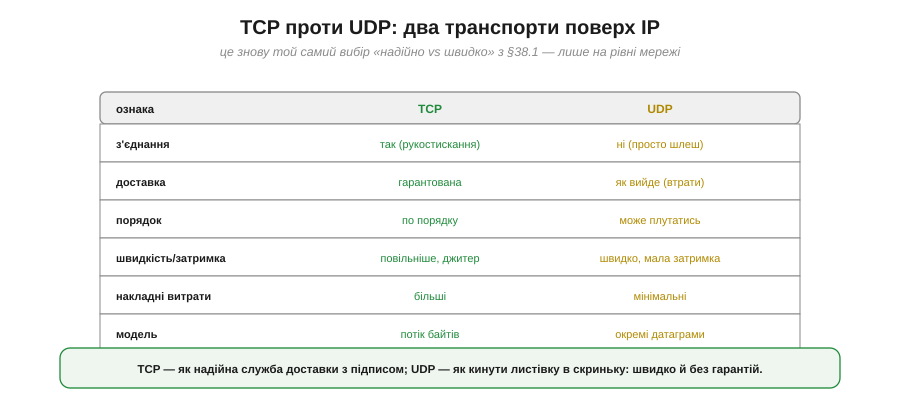
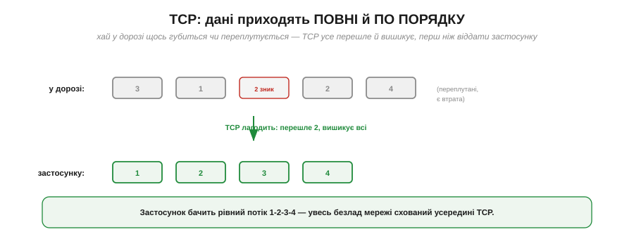
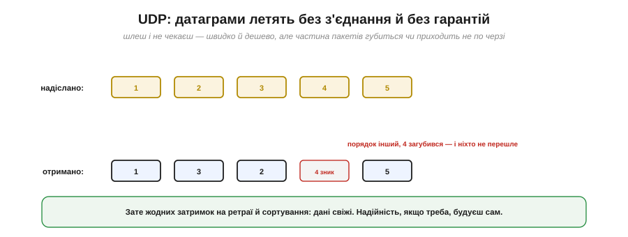

# TCP vs UDP: надійно vs швидко

Коли пристрій уже в мережі (має IP), постає вибір **способу доставки** даних — і це чи не найважливіше архітектурне рішення всього бездротового обміну. Поверх IP працюють два транспортні протоколи: **TCP** і **UDP**. Перший — надійний, але повільніший; другий — швидкий, але без гарантій. Це той самий вибір «надійно проти швидко», що стоїть уже на рівні [сирого радіо](book:communications/on-chip-radio), — тільки тепер його роблять одним рядком коду. Зрозуміти різницю критично: невдалий вибір транспорту перетворює добрий пристрій на або «гальмівний», або «ненадійний».

### Дві служби доставки

Спершу — загальне зіставлення.


*Рис. **TCP** встановлює з'єднання, гарантує доставку, тримає порядок — але повільніший, із плаваючою затримкою й більшими накладними; це «потік байтів». **UDP** не встановлює з'єднання, нічого не гарантує, може плутати порядок — зате швидкий, із мінімальними накладними; це «окремі датаграми».*

Гарна побутова аналогія: **TCP** — як надійна служба доставки з підписом про вручення (повільніше, дорожче, але точно дійде й у тому стані); **UDP** — як кинути листівку в скриньку (миттєво й дешево, але без гарантій, що дійде). Розгляньмо кожен ближче.

### TCP спершу встановлює з'єднання

Найхарактерніша риса TCP — він не починає слати дані одразу. Спершу сторони **встановлюють з'єднання** особливим обміном службовими пакетами, який звуть **трикроковим рукостисканням**.


*Рис. Клієнт шле SYN («з'єднаймось?»), сервер відповідає SYN-ACK («згода»), клієнт підтверджує ACK («домовились») — і лише тоді йдуть дані. Три обміни туди-сюди ще до першого байта корисних даних.*

Це рукостискання — основа надійності TCP: сторони домовляються, синхронізують лічильники, готуються стежити за доставкою. Але воно ж — і ціна: **затримка на старті** (кілька проходів туди-назад) ще до першого корисного байта. Для разової великої передачі це дрібниця; а от для коротких частих повідомлень накладні з'єднання стають відчутними.

### TCP: дані приходять повні й по порядку

Установивши з'єднання, TCP бере на себе всю боротьбу з ненадійністю мережі — і віддає застосунку ідеально рівний результат.


*Рис. Хай у дорозі пакети переплутались, а один загубився — TCP перешле втрачений, дочекається решти й вишикує все в правильному порядку, перш ніж віддати застосунку. Той бачить рівний потік 1-2-3-4, не знаючи про жоден збій мережі.*

Це і є суть TCP: він ховає **весь** безлад мережі (втрати, переплутаний порядок, дублікати) усередині й гарантує застосунку, що дані прийдуть **повними** й **у тому порядку**, у якому надіслані. Працює це знайомими механізмами — [підтвердженнями ACK](book:communications/start-stop-ack) і [перевідправленнями](book:communications/on-chip-radio), плюс нумерацією пакетів для впорядкування. Розплата — час: кожна втрата вимагає ретраю, а впорядкування змушує **чекати**. І саме це очікування породжує головну ваду TCP для реального часу.

### UDP: швидко й без гарантій

Протилежність TCP — **UDP**. Він не встановлює з'єднання й нічого не гарантує: просто шле окремі **датаграми** й одразу забуває про них.


*Рис. UDP шле пакети й не чекає підтверджень: частина приходить не по черзі, один загубився — і ніхто його не перешле. Зате немає ні рукостискання, ні ретраїв, ні очікування впорядкування — дані доходять миттєво й свіжими.*

UDP — це чистий [**best-effort**](book:communications/on-chip-radio) на рівні мережі: швидко, дешево, без церемоній, але без жодних обіцянок. Пакет може загубитися, прийти не в тому порядку чи навіть продублюватися — і UDP цим не переймається. Якщо надійність усе ж потрібна, її будують **самотужки** зверху (легкими ACK для важливих повідомлень) — рівно стільки, скільки треба, не платячи за повний апарат TCP.

### Блокування голови черги: чому TCP погано для реального часу

Тепер — ключове прозріння, чому для відео чи гри беруть саме UDP. Винна вимога TCP віддавати дані **строго по порядку**. Якщо один пакет загубився, усі наступні, що вже прийшли, **застрягають** у черзі, чекаючи на його перевідправлення. Це звуть **блокуванням голови черги** (*head-of-line blocking*).


*Рис. TCP: пакет 2 загубився — пакети 3, 4, 5 уже прийшли, але **чекають**, поки перешлеться 2; виходить великий «затор» і стрибок затримки. UDP: пакет 2 просто відсутній — 3, 4, 5 віддаються **одразу**; натомість маємо пропуск (зник кадр-два), але дані лишаються свіжими.*

Для потокових даних це вирішальна різниця. У відеодзвінку краще **пропустити** один кадр, ніж заморозити картинку на пів секунди, чекаючи його перевідправлення, — стара інформація вже нікому не потрібна. TCP же, женучи все по порядку, саме й заморожує. Тому **реальний час майже завжди йде по UDP**: свіжість важливіша за повноту, і пропуск кадру кращий за затор.

### Коли що

Зведімо вибір у просте правило.


*Рис. **TCP** — коли важливий кожен байт: команди керування, передача файлів і прошивок, веб (HTTP), MQTT (типова IoT-телеметрія), будь-що, де втрата неприпустима. **UDP** — коли важлива свіжість: потокове відео й голос, ігровий стан, жива телеметрія, що часто оновлюється, широкомовлення.*

Орієнтир простий: **разовий важливий обмін** (команда, файл, запит) — бери TCP; **безперервний потік**, де старі дані вже не потрібні (відео, часта телеметрія), — бери UDP. Зауваж, що дуже популярний у пристроях протокол **MQTT** (легка IoT-телеметрія) працює поверх **TCP** — бо там важлива гарантована доставка кожного повідомлення.

### Той самий вибір — у коді

Найкраще, що ця глибока дилема в коді зводиться до вибору **класу**.


*Рис. Надійно — береш `WiFiClient` (TCP): `connect()`, `print()` — з'єднання, ACK і впорядкування сховані. Швидко — береш `WiFiUDP`: `beginPacket()`, `write()`, `endPacket()` — шлеш і не чекаєш. Одна й та сама задача, два транспорти.*

```
// надійно (TCP): кожен байт дійде, по порядку
WiFiClient tcp;
tcp.connect(serverIP, 1883);
tcp.print(command);            // з'єднання й ретраї — усередині

// швидко (UDP): шлеш і не чекаєш
WiFiUDP udp;
udp.beginPacket(serverIP, port);
udp.write(telemetry, len);     // може загубитись — і байдуже
udp.endPacket();
```

> 🔧 **Навіщо це.** Обирай транспорт **за природою даних**, а не «про всяк випадок надійно». Команда «зброя на запобіжник» чи передача файлу прошивки — **TCP**: тут втрата неприпустима. Потік телеметрії 50 разів на секунду чи відео — **UDP**: одне старе значення нікому не потрібне, а затримка від ретраїв зашкодила б керуванню. Дуже часто в одному пристрої беруть **обидва**: рідкісні важливі команди — по TCP, безперервний потік стану — по UDP. Сліпо обрати TCP «бо надійніше» для реального часу — класична помилка, що дає смикану, лагучу картинку замість плавної.

Вибір TCP проти UDP постає там, де пристрій працює в IP-мережі — а такий шлях у бездротовий світ дає Wi-Fi. Але для багатьох задач Wi-Fi завеликий: він жадібний до енергії й заточений під вихід у мережу. Коли ж треба просто з'єднати **два** пристрої поряд — пульт із роботом, давач із телефоном — простіше й ощадливіше взяти **Bluetooth**. Його класичний варіант прикидається звичайним послідовним портом: [**Bluetooth Classic** і профіль SPP](book:communications/bluetooth-spp) — «бездротовий UART».

---
