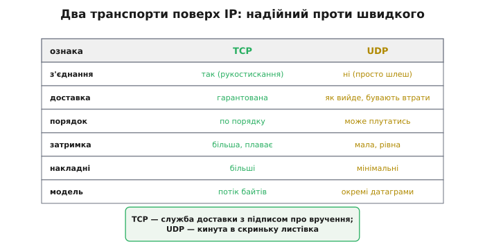
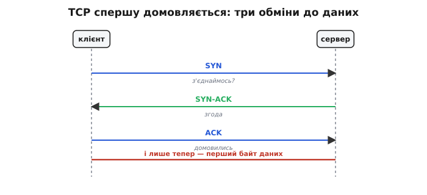
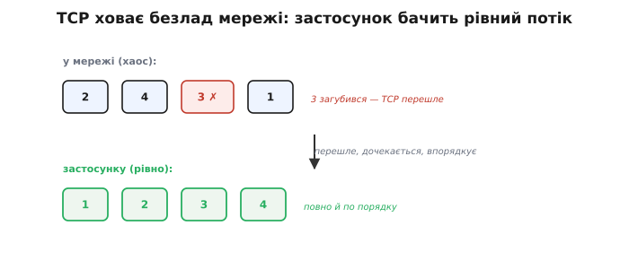
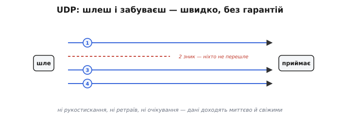
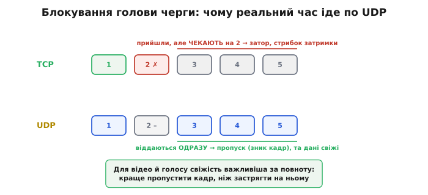
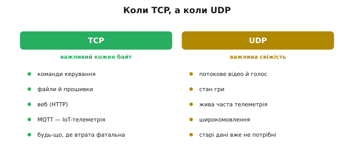
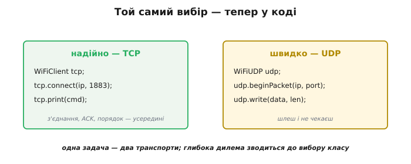

# TCP проти UDP

Коли пристрій уже в мережі (має IP-адресу), постає вибір **способу доставки** даних — чи не найважливіше архітектурне рішення всього обміну. Поверх IP працюють два транспортні протоколи: **TCP** (англ. *Transmission Control Protocol*, «протокол керування передачею») і **UDP** (англ. *User Datagram Protocol*, «протокол користувацьких датаграм»). Перший — надійний, але повільніший; другий — швидкий, але без гарантій. Це той самий компроміс «надійно проти швидко», що живе вже на рівні [сирого радіо](topic:communications/on-chip-radio), — тільки тут його роблять одним рядком коду. Невдалий вибір транспорту перетворює добрий пристрій або на «гальмівний», або на «ненадійний», тож різницю варто бачити наскрізь.

### Дві служби доставки


*TCP встановлює з'єднання, гарантує доставку, тримає порядок — але повільніший, із плаваючою затримкою й більшими накладними; це «потік байтів». UDP не встановлює з'єднання, нічого не гарантує, може плутати порядок — зате швидкий, із мінімальними накладними; це «окремі датаграми».*

Гарна побутова аналогія схоплює всю суть. **TCP** — як служба доставки з підписом про вручення: повільніше й дорожче, зате точно дійде й у цілості. **UDP** — як кинута в скриньку листівка: миттєво й дешево, але без жодної гарантії, що дійде. За цією парою образів стоять два різні механізми, і кожен варто розібрати окремо.

### TCP спершу встановлює з'єднання

Найхарактерніша риса TCP — він не починає слати дані одразу. Спершу сторони **встановлюють з'єднання** особливим обміном службовими пакетами, який звуть **трикроковим рукостисканням**.


*Клієнт шле SYN («з'єднаймось?»), сервер відповідає SYN-ACK («згода»), клієнт підтверджує ACK («домовились») — і лише тоді йдуть дані. Три обміни туди-сюди ще до першого байта корисних даних.*

Це рукостискання — основа надійності TCP: сторони впізнають одна одну, синхронізують лічильники (номери, з яких рахуватимуть байти) і готуються стежити за доставкою. Але воно ж і ціна: **затримка на старті** — кілька проходів туди-назад ще до першого корисного байта. Для разової великої передачі це дрібниця, а от для коротких частих повідомлень накладні з'єднання стають відчутними.

### TCP: дані приходять повні й по порядку

Установивши з'єднання, TCP бере на себе всю боротьбу з ненадійністю мережі — і віддає застосунку ідеально рівний результат.


*Хай у дорозі пакети переплутались, а один загубився — TCP перешле втрачений, дочекається решти й вишикує все в правильному порядку, перш ніж віддати застосунку. Той бачить рівний потік 1-2-3-4, не знаючи про жоден збій мережі.*

У цьому і є суть TCP: він ховає **весь** безлад мережі — втрати, переплутаний порядок, дублікати — усередині й гарантує застосунку, що дані прийдуть **повними** й **у тому порядку**, у якому надіслані. Працює це знайомими механізмами — [підтвердженнями ACK](topic:communications/start-stop-ack), коли приймач квитує отримане, і повторними відправками втрачених пакетів, плюс нумерацією для впорядкування. Розплата — час: кожна втрата вимагає повторної відправки, а впорядкування змушує **чекати**. Саме це очікування й породжує головну ваду TCP для реального часу.

### UDP: швидко й без гарантій

Протилежність TCP — **UDP**. Він не встановлює з'єднання й нічого не гарантує: просто шле окремі **датаграми** (англ. *datagram*, від *data* + грец. *gramma*, «щось записане») й одразу забуває про них.


*UDP шле пакети й не чекає підтверджень: частина приходить не по черзі, один загубився — і ніхто його не перешле. Зате немає ні рукостискання, ні повторних відправок, ні очікування впорядкування — дані доходять миттєво й свіжими.*

UDP — це чистий [«як вийде» (best-effort)](topic:communications/on-chip-radio) на рівні мережі: швидко, дешево, без церемоній, але без жодних обіцянок. Пакет може загубитися, прийти не в тому порядку чи навіть продублюватися — і UDP цим не переймається. Якщо надійність усе ж потрібна, її будують **самотужки** зверху — легкими підтвердженнями лише для важливих повідомлень, рівно стільки, скільки треба, не платячи за повний апарат TCP.

### Блокування голови черги: чому TCP погано для реального часу

Звідси й випливає, чому для відео чи гри беруть саме UDP. Винна вимога TCP віддавати дані **строго по порядку**. Якщо один пакет загубився, усі наступні, що вже прийшли, **застрягають** у черзі, чекаючи на його повторну відправку. Це звуть **блокуванням голови черги** (англ. *head-of-line blocking*).


*TCP: пакет 2 загубився — пакети 3, 4, 5 уже прийшли, але чекають, поки перешлеться 2; виходить великий «затор» і стрибок затримки. UDP: пакета 2 просто немає — 3, 4, 5 віддаються одразу; натомість маємо пропуск (зник кадр-два), але дані лишаються свіжими.*

Для потокових даних це вирішальна різниця. У відеодзвінку краще **пропустити** один кадр, ніж заморозити картинку на пів секунди, чекаючи його повторної відправки, — стара інформація вже нікому не потрібна. TCP же, женучи все по порядку, саме й заморожує. Тому **реальний час майже завжди йде по UDP**: свіжість важливіша за повноту, і пропуск кадру кращий за затор.

> 🔧 **Навіщо це.** Блокування голови черги — це причина, чому стрім по TCP «лагає» ривками: не мережа повільна, а протокол тримає вже прибуті кадри, доки переб'є один загублений. Якщо ти будуєш живу телеметрію чи відео і бачиш плавні дані, що раптом завмирають і стрибають уперед, — майже напевно ти на TCP там, де треба UDP.

### Коли що


*TCP — коли важливий кожен байт: команди керування, передача файлів і прошивок, веб (HTTP), MQTT (типова IoT-телеметрія), будь-що, де втрата неприпустима. UDP — коли важлива свіжість: потокове відео й голос, ігровий стан, жива телеметрія, що часто оновлюється, широкомовлення.*

Орієнтир простий: **разовий важливий обмін** — команда, файл, запит — бери TCP; **безперервний потік**, де старі дані вже не потрібні (відео, часта телеметрія), — бери UDP. Показовий приклад — дуже популярний у пристроях протокол **MQTT** (легка IoT-телеметрія): він працює поверх **TCP**, бо там важлива гарантована доставка кожного повідомлення, навіть ціною затримки.

### Той самий вибір — у коді

Найкраще, що ця глибока дилема в коді зводиться до вибору **класу**.


*Надійно — береш `WiFiClient` (TCP): `connect()`, `print()`, і з'єднання, підтвердження й упорядкування сховані. Швидко — береш `WiFiUDP`: `beginPacket()`, `write()`, `endPacket()` — шлеш і не чекаєш. Одна й та сама задача, два транспорти.*

**Умова:** з ESP32 (фреймворк Arduino) надіслати одну команду так, щоб вона гарантовано дійшла, і окремо — потік телеметрії, де втрата окремого значення не страшна.

:::tabs
```cpp
// надійно (TCP): кожен байт дійде, по порядку
WiFiClient tcp;
tcp.connect(serverIP, 1883);
tcp.print(command);            // з'єднання й повтори — усередині

// швидко (UDP): шлеш і не чекаєш
WiFiUDP udp;
udp.beginPacket(serverIP, port);
udp.write(telemetry, len);     // може загубитись — і байдуже
udp.endPacket();
```
```python
import socket

# надійно (TCP): кожен байт дійде, по порядку
tcp = socket.socket(socket.AF_INET, socket.SOCK_STREAM)
tcp.connect((server_ip, 1883))
tcp.sendall(command)           # з'єднання й повтори — усередині

# швидко (UDP): шлеш і не чекаєш
udp = socket.socket(socket.AF_INET, socket.SOCK_DGRAM)
udp.sendto(telemetry, (server_ip, port))  # може загубитись — і байдуже
```
:::

Уся різниця характеру схована за двома класами: `WiFiClient` тягне на собі рукостискання, підтвердження й упорядкування, а `WiFiUDP` лише пакує байти в датаграму й кидає в мережу.

> 🔧 **Навіщо це.** Обирай транспорт **за природою даних**, а не «про всяк випадок надійно». Команда «зброя на запобіжник» чи передача файлу прошивки — **TCP**: тут втрата неприпустима. Потік телеметрії 50 разів на секунду чи відео — **UDP**: одне старе значення нікому не потрібне, а затримка від повторів зашкодила б керуванню. Дуже часто в одному пристрої беруть **обидва**: рідкісні важливі команди по TCP, безперервний потік стану по UDP. Сліпо обрати TCP «бо надійніше» для реального часу — класична помилка, що дає смикану, лагучу картинку замість плавної.

Вибір TCP проти UDP постає там, де пристрій працює в IP-мережі, а такий шлях у бездротовий світ дає Wi-Fi. Але для багатьох задач Wi-Fi завеликий: він жадібний до енергії й заточений під вихід у мережу. Коли ж треба просто з'єднати **два** пристрої поряд — пульт із роботом, давач із телефоном — простіше й ощадливіше взяти Bluetooth. Його класичний варіант прикидається звичайним послідовним портом: [Bluetooth Classic і профіль SPP](topic:communications/bluetooth-spp) — «бездротовий UART».
