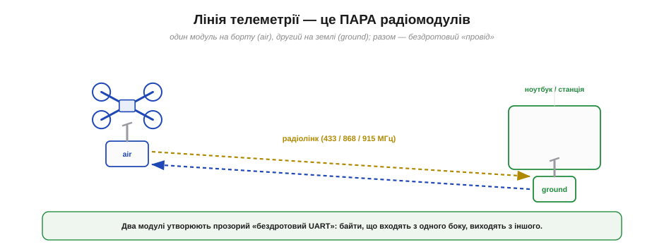
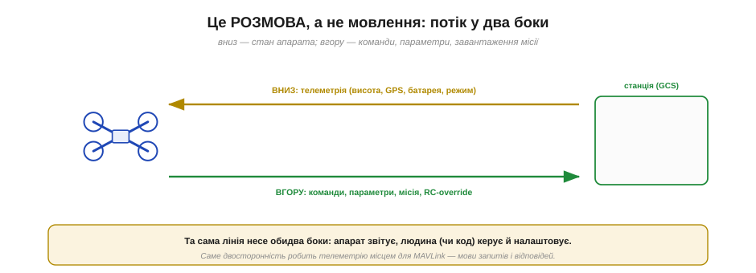
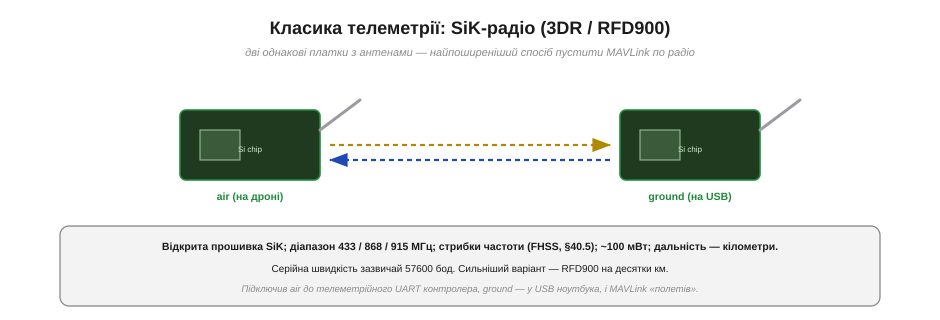
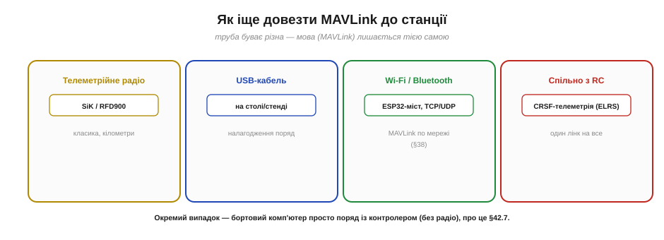

# Телеметрія: двосторонній потік (air/ground модулі)

Якщо [лінія керування](book:communications/rc-link) несе **нашу волю** до апарата, то лінія **телеметрії** несе **його відповідь** назад — і не лише назад, а в обидва боки. Це та сама лінія, де живе MAVLink. Тут ми розбираємо, з чого вона зроблена фізично, що нею тече і чому це справжня **двостороння розмова**, а не просто «дрон щось мовить у простір».

### Телеметрія — це пара модулів

Перше, що варто засвоїти: лінія телеметрії — це не один пристрій, а **пара** радіомодулів.

*Рис. Один модуль («**air**») сидить на борту, під'єднаний до польотного контролера; другий («**ground**») — на землі, під'єднаний до ноутбука чи станції. Між ними — радіолінк на 433 / 868 / 915 МГц. Разом ця пара утворює прозорий «бездротовий провід».*

Один модуль — **бортовий** (*air*) — стоїть на апараті й з'єднаний дротом із телеметрійним портом польотного контролера. Другий — **наземний** (*ground*) — лежить біля оператора, під'єднаний до ноутбука (зазвичай по USB). Між собою ці два модулі говорять по радіо — типово на 433, 868 чи 915 МГц. Ключова ідея: **пара модулів разом працює як один бездротовий «провід»**. І щоб зрозуміти, наскільки це елегантно, треба усвідомити, що вони роблять із даними.

### Прозорий серійний міст

Магія телеметрійної пари в тому, що вона — **прозорий серійний міст**: для контролера й станції вона виглядає як звичайний дріт.

*Рис. Контролер віддає байти на свій UART → бортовий модуль шле їх по радіо → наземний модуль приймає → віддає по USB у станцію. Байти, що ввійшли з одного кінця, виходять з іншого. Контролер і станція «думають», що з'єднані дротом, — насправді між ними радіо.*

В основі лежить звичайний [UART](book:communications/uart-frame): два пристрої обмінюються байтами по серійній лінії. Телеметрійна пара робить рівно це, тільки **бездротово**: байти, які контролер віддає на свій телеметрійний UART, бортовий модуль шле по радіо, наземний приймає й віддає по USB у програму на ноутбуці — і навпаки. Жодна сторона **не знає**, що між ними радіо: для них це просто **серійний кабель**, що випадково став довгим і невидимим. А **MAVLink** тече цією трубою **наскрізь** — радіомодулям байдуже, що саме вони несуть, для них це потік байтів. Звідси чудовий наслідок: **ту саму** телеметрію можна пустити будь-якою «трубою» — радіо, USB-кабелем, Wi-Fi, Bluetooth — і мова (MAVLink) не зміниться. Розділення «труба» / «мова» — одна з найкорисніших ідей розділу.

### Що тече вниз: потік MAVLink

А що ж саме тече цією трубою? **Потік повідомлень MAVLink**, кожне свого типу й зі своєю частотою.

*Рис. Різні повідомлення йдуть зі своєю частотою «потоку»: HEARTBEAT («я живий», тип, режим) ~1 Гц; ATTITUDE (кути) ~10–50 Гц; GLOBAL_POSITION_INT (координати) ~5 Гц; SYS_STATUS (батарея, давачі) ~2 Гц; VFR_HUD (швидкість, висота) ~10 Гц. Кожен тип — на своїй частоті потоку, яку можна налаштувати.*

Униз безперервно тече набір **типізованих** повідомлень. Найважливіше — **HEARTBEAT** («серцебиття»), що йде раз на секунду й каже «я живий», повідомляючи тип апарата, режим польоту й чи він *armed*. Поряд течуть **ATTITUDE** (кути нахилу, часто), **GLOBAL_POSITION_INT** (координати й висота), **SYS_STATUS** (заряд батареї, стан давачів), **VFR_HUD** (швидкість, висота, вертикальна швидкість) і ще десятки інших. Важлива деталь: кожне повідомлення йде зі **своєю частотою потоку** (*stream rate*) — кути потрібні часто (десятки разів на секунду), а серцебиття раз на секунду досить. Ці частоти **налаштовують**, бо канал вузький: на типових 57600 бод не можна качати все підряд на повній частоті, доводиться **розставляти пріоритети**. Внутрішня структура самих повідомлень — окрема тема ([пакет MAVLink](book:communications/mavlink-packet)); тут важливо відчути, що телеметрія — це **потік маленьких типізованих звітів**.

### Це розмова, а не мовлення

Найважливіше для розуміння: телеметрія йде **в обидва боки**. Це не дрон «віщає» в простір, а **діалог**.

*Рис. Униз тече стан апарата (телеметрія). Угору — команди, читання й запис параметрів, завантаження місії, навіть RC-override. Та сама лінія несе обидва напрями: апарат звітує, людина (чи код) керує й налаштовує. Саме двосторонність робить телеметрію місцем для MAVLink.*

Униз тече **стан** апарата. А вгору, тією **самою** лінією, йдуть **команди** й **запити**: «зміни режим», «лети на цю точку», «прочитай параметр», «запиши новий параметр», «завантаж ось цю місію з десяти точок», ба навіть RC-override (підміна каналів керування). Тобто це повноцінна **розмова запитів і відповідей**: станція може **спитати** дрон («який у тебе максимальний кут нахилу?») і дрон **відповість**. Саме ця двосторонність і робить телеметрійну лінію природним домом для **MAVLink** — мови, спроєктованої для запитів, відповідей, команд і підтверджень. [Лінія керування](book:communications/rc-link) — монолог «віжок»; телеметрія — діалог.

### Класика заліза: SiK-радіо

Кілька слів про найпоширеніше **залізо** телеметрії — щоб ти впізнав його вживу.

*Рис. Найвідоміший варіант — **SiK-радіо**: дві однакові маленькі платки з антенами, відкрита прошивка SiK, діапазон 433/868/915 МГц, стрибки частоти (FHSS), потужність ~100 мВт, дальність — кілометри. Серійна швидкість зазвичай 57600 бод. Потужніший родич — **RFD900** — бере на десятки кілометрів.*

Класика — це **SiK-радіо** (відоме як «3DR Radio»): дві **однакові** дешеві платки з антенами на чипах Silicon Labs, з **відкритою** прошивкою SiK (знову відкритий код!). Вони працюють на 433/868/915 МГц, стрибають частотою ([FHSS](book:communications/spread-spectrum) — щоб не глушитися), дають близько 100 мВт і дальність у кілька кілометрів; серійна швидкість типово **57600 бод**. Для далеких місій беруть потужніший **RFD900**, що дотягує на десятки кілометрів. Підключення просте до краси: бортову платку — у телеметрійний UART контролера, наземну — у USB ноутбука, і MAVLink одразу «полетів». Жодного програмування радіо — воно прозоре.

### Як іще довезти MAVLink

SiK-радіо — не єдиний шлях. Оскільки труба й мова розділені, MAVLink можна довезти **по-різному**.

*Рис. Варіанти «труби»: **телеметрійне радіо** (SiK/RFD900) — класика на кілометри; **USB-кабель** — для налагодження поряд; **Wi-Fi / Bluetooth** через ESP32-міст (MAVLink по TCP/UDP); **спільно з RC** — CRSF-телеметрія (ELRS), один лінк на все. А окремий випадок — бортовий комп'ютер просто поряд із контролером.*

Перелічімо «труби». **Телеметрійне радіо** (SiK/RFD900) — класика на кілометри. **USB-кабель** — найпростіше для роботи на столі чи стенді (контролер прямо в ноутбук). **Wi-Fi або Bluetooth** через міст на ESP32 — і тоді MAVLink тече по [**TCP/UDP**](book:communications/tcp-vs-udp), а станцією може бути телефон. **Спільно з RC-лінком** — сучасні ELRS/Crossfire несуть CRSF-телеметрію тим самим радіо, що й [керування](book:communications/rc-link), тобто один лінк на все. І нарешті особливий випадок — **бортовий комп'ютер** просто **поряд** із контролером, з'єднаний коротким UART **без жодного радіо**; це вже місток до автоматизації на борту. Мова всюди одна — MAVLink; різниться лише доставка.

> 🔧 **Навіщо це.** Розділення «труба / мова» — практично безцінне. Якщо MAVLink не доходить до станції, **діагностуй пошарово**: спершу труба (чи з'єднані модулі, чи світяться, чи та швидкість UART, чи той COM-порт), потім мова (чи йде HEARTBEAT). Налагоджуєш на столі — бери USB; полетів далеко — телеметрійне радіо; хочеш зі смартфона — ESP32 + Wi-Fi. І пам'ятай про **вузькість** каналу: на 57600 бод не можна вимагати всю телеметрію на 50 Гц — поставиш надто високі stream rate, і канал захлинеться, повідомлення почнуть губитися. Налаштовуй частоти потоку розумно: критичне — частіше, фонове — рідше. Це і є інженерне мислення про вузький радіоканал.

### Людський кінець: наземна станція

І останнє — **хто** на землі читає всю цю телеметрію. Програма-**наземна станція** (*ground control station*, GCS).

*Рис. **QGroundControl** чи **Mission Planner** читають потік MAVLink і показують «панель приладів»: карту з маршрутом, висоту, швидкість, заряд, режим, стан GPS. Звідти ж оператор шле команди й завантажує місії. Людина «розмовляє» з дроном через цю програму.*

На землі MAVLink приймає програма — **наземна станція**: найвідоміші **QGroundControl** (зі світу PX4) і **Mission Planner** (зі світу ArduPilot). Вона **розуміє** MAVLink: розкладає потік повідомлень у наочну «панель приладів» — карту з маршрутом і поточним положенням, висоту, швидкість, заряд, режим, кількість супутників GPS, попередження. І звідти ж оператор діє у зворотний бік: міняє режим, ставить точки маршруту, завантажує місію, читає й пише параметри. GCS — це **людський кінець** телеметрійної лінії, перекладач між мовою машини (MAVLink) і очима людини. Те саме, що робить GCS, можна зробити й власним кодом, який читає той самий потік MAVLink і шле команди назад.

Отже, телеметрійна лінія складається з чотирьох частин: пара модулів, прозорий міст, двосторонній потік MAVLink і наземна станція. Лишається питання, спільне і для керування, і для телеметрії, — **наскільки швидко й надійно** все це працює: чому [затримка й надійність](book:communications/latency-reliability) у цій системі бувають питанням життя і смерті апарата, що таке «втрата лінка» і як її пережити.

---
