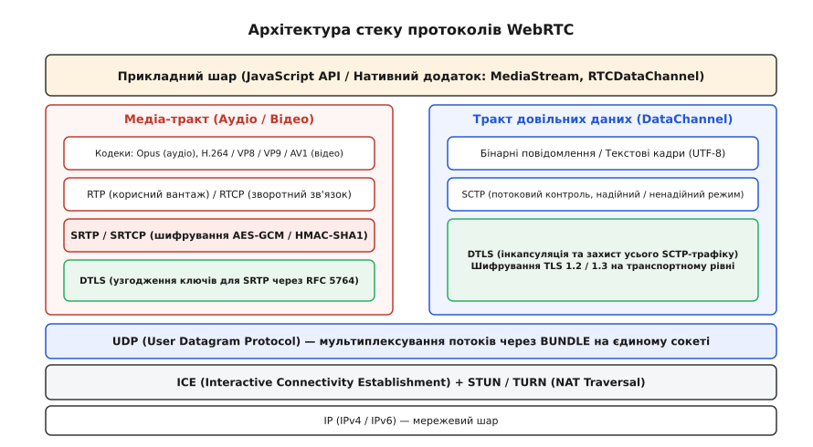
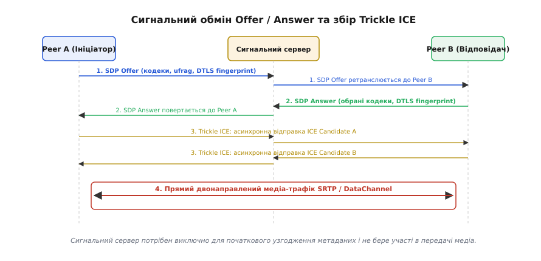
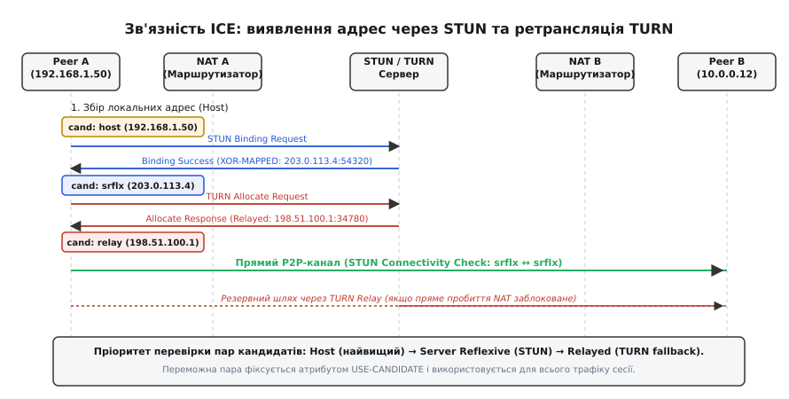
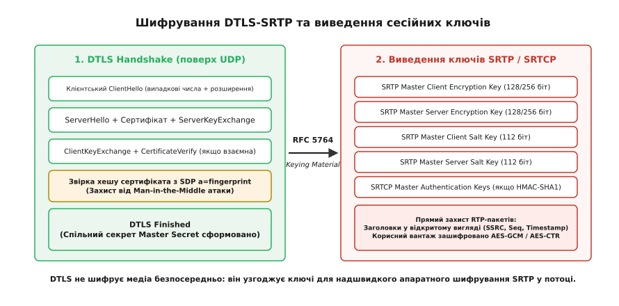
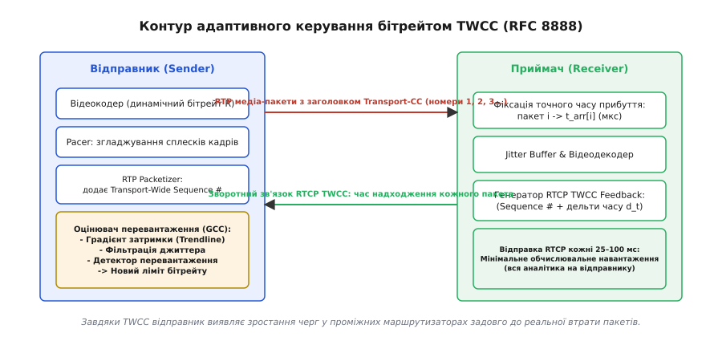
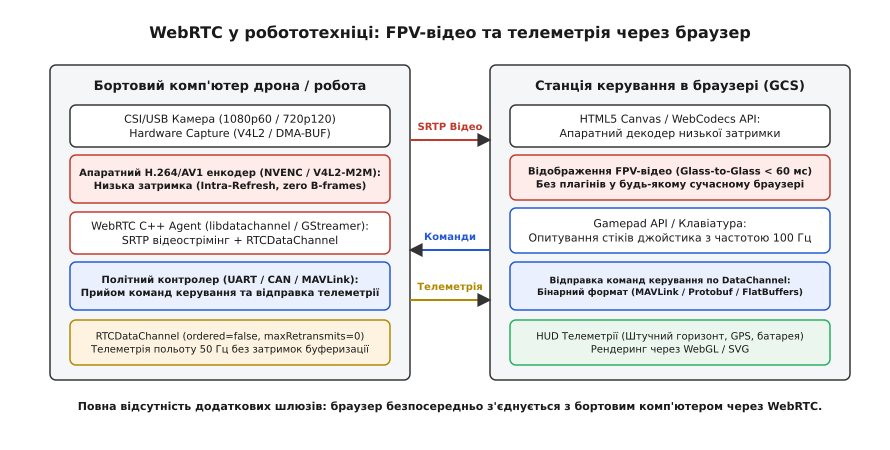

# WebRTC: медіа напряму між кінцевими вузлами

<preknowlist>
- [TCP проти UDP](book:communications/tcp-vs-udp) — різниця між потоковою надійною доставкою та низькозатримковими датаграмами.
- [NAT-траверсаль](book:communications/nat-traversal) — проходження трансляторів мережевих адрес через STUN/TURN та ICE.
- [TLS Handshake](book:communications/tls-handshake) — узгодження симетричних ключів та автентифікація через сертифікати.
- [Контрольні суми](book:communications/checksums) — перевірка цілісності пакетів у транспортних протоколах.
</preknowlist>

Коли оператор керує безпілотним апаратом або бере участь у відеоконференції через звичайний веббраузер, передача медіапотоку поверх протоколу TCP призводить до раптових затримок та зависань зображення. Втрата бодай одного IP-пакета у бездротовому каналі Wi-Fi чи LTE примушує мережевий стек операційної системи повністю зупинити просування всього байтового потоку TCP: ядро блокує виклик `recv()`, чекаючи на повторну доставку втраченого байта через механізм ARQ. У результаті відеокадри, які надійшли вчасно і вже знаходяться в пам'яті комп'ютера, не можуть бути передані на екран. Затримка відтворення миттєво зростає з 50 мілісекунд до кількох секунд, роблячи інтерактивне керування фізично неможливим.

Спроби розв'язати цю проблему за допомогою сторонніх бінарних плагінів (ActiveX, Adobe Flash Player з протоколом RTMP) створювали хронічні діри в безпеці та не дозволяли браузеру взаємодіяти з апаратними відеокодерами напряму.

Технологія WebRTC (Web Real-Time Communication, RFC 8825 – RFC 8874) докорінно змінює архітектуру вебкомунікацій. Вона надає стандартизований набір протоколів простору користувача та JavaScript API для встановлення захищеного прямого пірингового з'єднання (Peer-to-Peer) між кінцевими вузлами поверх беззв'язкових датаграм UDP. WebRTC гарантує субсекундну затримку доставки (Glass-to-Glass затримка менше ніж 100 мс), обов'язкове наскрізне шифрування медіатрафіку DTLS-SRTP, адаптивне керування бітрейтом під реальний стан каналу та передачу довільних двійкових даних через надійні або ненадійні канали SCTP без встановлення стороннього програмного забезпечення.


*Архітектура стеку протоколів WebRTC: поділ на медіа-тракт SRTP/DTLS та тракт довільних даних SCTP/DTLS поверх єдиного UDP-порту BUNDLE.*

## Багаторівневий стек протоколів WebRTC

Архітектура WebRTC є ієрархічним стеком протоколів, кожен шар якого відповідає за розв'язання ізольованої інженерної задачі: виявлення мережевої зв'язності, взаємну автентифікацію, шифрування, упаковку корисного вантажу кодеків та керування заторами.

Трафік WebRTC чітко розділяється на два паралельні тракти:
1. **Медіа-тракт (RTP / RTCP)**: призначений для передачі аудіо- та відеопотоків із жорсткими вимогами до затримки.
2. **Тракт довільних даних (RTCDataChannel)**: призначений для обміну двійковими або текстовими структурами (телеметрією, командами керування, повідомленнями чату).

```text
+-----------------------------------------------------------------------------------+
|            Прикладний рівень (JavaScript API / Нативний C++ застосунок)           |
+-----------------------------------------+-----------------------------------------+
|        Медіа-тракт (Аудіо / Відео)      |   Тракт довільних даних (DataChannel)   |
+-----------------------------------------+-----------------------------------------+
| Кодеки: Opus, H.264, VP8, VP9, AV1      | Бінарні структури / Текстові кадри UTF-8|
+-----------------------------------------+-----------------------------------------+
| RTP (медіа) / RTCP (зворотний зв'язок)  | SCTP (Stream Control Transmission Proto)|
+-----------------------------------------+-----------------------------------------+
| SRTP / SRTCP (шифрування AES-GCM/CTR)   | DTLS (Шифрування SCTP-тунелю TLS 1.2/1.3|
+-----------------------------------------+-----------------------------------------+
| DTLS (Узгодження ключів для SRTP)       |                                         |
+-----------------------------------------+-----------------------------------------+
|                  Мультиплексування BUNDLE (єдиний сокет UDP)                      |
+-----------------------------------------------------------------------------------+
|         ICE (Interactive Connectivity Establishment: STUN / TURN)                 |
+-----------------------------------------------------------------------------------+
|                             UDP (User Datagram Protocol)                          |
+-----------------------------------------------------------------------------------+
|                             IP (IPv4 / IPv6 Мережевий шар)                        |
+-----------------------------------------------------------------------------------+
```

### Мультиплексування портів через BUNDLE та `rtcp-mux`

У традиційній IP-телефонії (SIP/H.323) кожен аудіо- та відеотрек вимагав окремого UDP-порту для RTP (наприклад, порт 5004) та суміжного непарного порту для RTCP (порт 5005). При одночасній передачі аудіо, відео та каналу даних хост відкривав до шести незалежних UDP-сокетів. У глобальному інтернеті це створювало катастрофічні проблеми: кожен сокет вимагав окремого сеансу пробиття NAT, окремої пари портів на трансляторі та окремого рукостискання безпеки.

WebRTC розв'язує цю проблему завдяки двом обов'язковим механізмам стандартизації IETF:
1. **`rtcp-mux` (RFC 5761)**: трафік протоколу зворотного зв'язку RTCP мультиплексується на той самий UDP-порт, що й медіапакети RTP. Демодулятор розрізняє їх за другим байтом заголовка (значенням `Payload Type` у RTP та `Packet Type` `200–211` у RTCP).
2. **`BUNDLE` (RFC 8843)**: усі медіасекції сесії (аудіо, всі відеопотоки та тунель SCTP DataChannel) об'єднуються на **одному єдиному UDP-сокеті**. Диспетчеризація вхідних датаграм здійснюється за першим байтом заголовка та внутрішніми маркерами:
   - Значення першого байта `0..1` (RFC 7983): пакет протоколу STUN (перевірки зв'язності ICE).
   - Значення першого байта `20..63`: пакет протоколу DTLS (рукостискання безпеки або інкапсульований SCTP).
   - Значення першого байта `128..191`: захищений пакет SRTP / SRTCP (аудіо або відео).

### Диспетчеризація та демультиплексування пакетів на сокеті BUNDLE (RFC 7983)

Коли всі типи трафіку надходять на один UDP-порт, рушій WebRTC виконує побайтову класифікацію вхідних датаграм безпосередньо в циклі обробки сокета за алгоритмом демультиплексування RFC 7983:

```text
               Вхідна датаграма UDP на порту BUNDLE
                                │
             Перевірка першого байта B[0]
                                │
        ┌───────────────────────┼───────────────────────┐
        ▼                       ▼                       ▼
   0 <= B[0] <= 1         20 <= B[0] <= 63       128 <= B[0] <= 191
  ┌───────────────┐       ┌───────────────┐       ┌───────────────┐
  │  STUN / ICE   │       │     DTLS      │       │  RTP / RTCP   │
  │ (Перевірки    │       │ (Рукостискання│       │ (Захищене     │
  │  зв'язності)  │       │  або SCTP)    │       │  медіа SRTP)  │
  └───────────────┘       └───────────────┘       └───────┬───────┘
                                                          │
                                         Перевірка другого байта B[1]
                                                          │
                                         ┌────────────────┴────────────────┐
                                         ▼                                 ▼
                                  PT < 64 або 96..127             192 <= PT <= 223
                                 ┌───────────────────┐           ┌───────────────────┐
                                 │    SRTP (Медіа)   │           │    SRTCP (Звіт)   │
                                 └───────────────────┘           └───────────────────┘
```

1. **Ідентифікація STUN (`0 ≤ B[0] ≤ 1`)**: Перші два біти заголовка повідомлення STUN завжди дорівнюють `00`. Отримавши такий пакет, рушій передає його підсистемі ICE для обробки запитів перевірки зв'язності або відповідей `Binding Response`.
2. **Ідентифікація DTLS (`20 ≤ B[0] ≤ 63`)**: Перший байт запису DTLS позначає тип контенту (`ContentType`: `20` для ChangeCipherSpec, `21` для Alert, `22` для Handshake, `23` для ApplicationData). Якщо сесію DTLS вже встановлено, пакети з типом `23` передаються внутрішньому стеку SCTP для обробки каналів DataChannel.
3. **Ідентифікація RTP/RTCP (`128 ≤ B[0] ≤ 191`)**: Перші два біти заголовка RTP позначають версію протоколу (`Version = 2`, двійкове `10`, тобто значення першого байта потрапляє в діапазон від `128` до `191`).
4. **Розділення RTP та RTCP (`rtcp-mux`)**: Другий байт датаграми містить поле `Payload Type` (PT). Для стандартних RTCP-пакетів (Sender Report `200`, Receiver Report `201`, SDES `202`, BYE `203`, APP `204`, RTPFB `205`, PSFB `206`) значення знаходиться в діапазоні `192–223`. Для медіапакетів RTP використовуються динамічні номери з діапазону `96–127` або статичні `0–34`.

Після ідентифікації SRTP-пакета рушій зчитує 32-бітове поле `SSRC` (Synchronization Source) або розширення заголовка `MID` (Media ID) і спрямовує корисний вантаж у відповідний черговий конвеєр декодування відеотреку чи аудіотреку.

## Анатомія заголовків RTP та RTCP

Протокол RTP (Real-time Transport Protocol, RFC 3550) забезпечує часову синхронізацію, нумерацію та маркування меж кадрів мультимедіа.

### Фіксований заголовок RTP (12 байтів)

```text
 0                   1                   2                   3
 0 1 2 3 4 5 6 7 8 9 0 1 2 3 4 5 6 7 8 9 0 1 2 3 4 5 6 7 8 9 0 1
+-+-+-+-+-+-+-+-+-+-+-+-+-+-+-+-+-+-+-+-+-+-+-+-+-+-+-+-+-+-+-+-+
|V=2|P|X|  CC   |M|     PT      |       Sequence Number         |
+-+-+-+-+-+-+-+-+-+-+-+-+-+-+-+-+-+-+-+-+-+-+-+-+-+-+-+-+-+-+-+-+
|                           Timestamp                           |
+-+-+-+-+-+-+-+-+-+-+-+-+-+-+-+-+-+-+-+-+-+-+-+-+-+-+-+-+-+-+-+-+
|           Synchronization Source (SSRC) identifier            |
+-+-+-+-+-+-+-+-+-+-+-+-+-+-+-+-+-+-+-+-+-+-+-+-+-+-+-+-+-+-+-+-+
```

| Поле | Розмір | Призначення у WebRTC |
| :--- | :--- | :--- |
| `V` (Version) | 2 біти | Версія протоколу (завжди `2`). |
| `P` (Padding) | 1 біт | Наявність вирівнювальних байтів наприкінці пакета для блокових шифрів. |
| `X` (Extension) | 1 біт | Ознака наявності заголовка розширень (використовується для передачі TWCC, MID, Audio-Level). |
| `CC` (CSRC Count) | 4 біти | Кількість джерел мікшування (Contributing Sources) при роботі через аудіомікшери. |
| `M` (Marker) | 1 біт | Критичний прапорець межі кадру: для відео `M=1` позначає **останній RTP-пакет поточного відеокадру**, сигналізуючи декодеру про можливість збирання; для аудіо `M=1` позначає початок мовленнєвого сегмента після паузи. |
| `PT` (Payload Type) | 7 бітів | Формат кодека (наприклад, `111` для Opus, `96` для H.264). |
| `Sequence Number` | 16 бітів | Монотонно зростаючий лічильник пакетів для виявлення втрат і відновлення порядку. |
| `Timestamp` | 32 біти | Часова мітка генерації семплу (квантована за частотою 48 кГц для аудіо або 90 кГц для відео). |
| `SSRC` | 32 біти | Унікальний випадковий ідентифікатор джерела медіапотоку в межах сесії. |

### Протокол зворотного зв'язку RTCP та синхронізація звуку й зображення (Lip-Sync)

Протокол RTCP (RTP Control Protocol) функціонує паралельно з RTP і виконує дві найважливіші функції: моніторинг якості каналу та міжканальну синхронізацію аудіо й відео.

Основним пакетом є **Sender Report (SR, тип 200)**, який відправник надсилає кожні кілька сотень мілісекунд:
- Містить 64-бітовий абсолютний час за шкалою NTP (Wall-Clock Time).
- Містить відповідний 32-бітовий відносний таймстемп RTP на цей момент часу.

Оскільки аудіо- та відеотреки генеруються різними апаратними пристроями (мікрофоном і камерою) із власними незалежними тактовими генераторами (48 кГц та 90 кГц), їхні лічильники `Timestamp` не мають спільної точки відліку. Отримуючи пакети RTCP SR для обох треків із єдиним канонічним ім'ям `a=ssrc:... cname:user@host`, приймач зіставляє мітки RTP з абсолютним часом NTP і виконує точне вирівнювання звуку та артикуляції губ (**Lip-Sync**) перед подачею на рендеринг.

## Сигналізація та узгодження сесії: модель Offer/Answer через SDP

WebRTC навмисно не визначає транспортного протоколу для передачі початкових керівних повідомлень (сигналізації). Для передачі параметрів сесії між вузлами може використовуватися будь-який наявний двосторонній канал: WebSocket, HTTP/REST, MQTT або протокол SIP.

Сам зміст сесії описується за допомогою декларативного формату SDP (Session Description Protocol) у межах моделі **Offer/Answer** (RFC 3264) з розширенням Unified Plan (RFC 8829).


*Сигнальний обмін дескрипторами SDP Offer/Answer та асинхронний збір кандидатів зв'язності Trickle ICE.*

### Послідовність встановлення сесії

1. **Генерація Offer**: Вузол-ініціатор (Peer A) викликає локальний метод `createOffer()`. Рушій формує документ SDP, у якому перелічує:
   - Перелік підтримуваних кодеків із параметрами дискретизації (`a=rtpmap`, `a=fmtp`).
   - Реквізити безпеки ICE: логін `a=ice-ufrag` та сесійний пароль `a=ice-pwd`.
   - Криптографічний відбиток власного X.509 сертифіката `a=fingerprint:sha-256 ...`.
   - Декларацію групування потоків `a=group:BUNDLE 0 1 2`.
2. **Фіксація локального стану**: Peer A викликає `setLocalDescription(offer)` і надсилає сформований SDP через сигнальний сервер до Peer B.
3. **Обробка на боці відповідача**: Вузол Peer B отримує Offer, фіксує його викликом `setRemoteDescription(offer)` та генерує відповідь `createAnswer()`.
4. **Формування Answer**: Вузол Peer B залишає у документі лише взаємно підтримувані кодеки (наприклад, обирає H.264 замість VP8), вказує свій DTLS-відбиток сертифіката, фіксує роль DTLS як `active` та надсилає Answer назад до Peer A.
5. **Завершення сигналізації**: Peer A викликає `setRemoteDescription(answer)`. Автомат станів переходить у положення `stable`.

Синтаксис усіх полів сесії, правила групування BUNDLE, формати атрибутів зворотного зв'язку `a=rtcp-fb` та повні зразки документів наведено у вставці [Анатомія SDP-дескриптора у WebRTC: Offer/Answer та атрибути сесії](book:communications/webrtc/api-sdp-structure.md).

## Зв'язність та проходження NAT: топологія ICE

У переважній більшості випадків кінцеві пристрої користувачів (ноутбуки, смартфони, робототехнічні платформи) не мають публічних маршрутизованих IP-адрес і знаходяться за трансляторами мережевих адрес (NAT) або міжмережевими екранами.

Для пошуку найкоротшого та найшвидшого прямого мережевого маршруту WebRTC використовує фреймворк **ICE (Interactive Connectivity Establishment, RFC 8445)**, який інтегрує протоколи STUN (RFC 5389) та TURN (RFC 5766).


*Процедура перевірки зв'язності ICE: пряме з'єднання через STUN та резервна ретрансляція трафіку через TURN.*

### Типи кандидатів зв'язності (ICE Candidates)

Кожен вузол збирає три категорії кандидатів — потенційних мережевих адрес `(IP, Port, Protocol)`:

1. **Host Candidates (Локальні кандидати)**: фізичні IP-адреси мережевих інтерфейсів пристрою (Ethernet `192.168.1.50`, Wi-Fi, локальний `127.0.0.1`). Мають найвищий числовий пріоритет.
2. **Server Reflexive Candidates (STUN-кандидати, `srflx`)**: зовнішні публічні IP-адреси та порти транслятора NAT. Вузол надсилає датаграму `STUN Binding Request` на публічний STUN-сервер (порт 3478). Сервер бачить зовнішню точку відправлення пакета і повертає її у відповіді `STUN Binding Response` в атрибуті `XOR-MAPPED-ADDRESS`.
3. **Relayed Candidates (TURN-кандидати, `relay`)**: публічні адреси, виділені на спеціальному ретрансляційному сервері TURN за допомогою процедури виділення ресурсів `TURN Allocate`. Використовуються як резервний шлях, коли пряме пробиття NAT неможливе (наприклад, симетричний NAT з обох боків або блокування UDP).

### Перевірка зв'язності (Connectivity Checks) та Trickle ICE

Після того, як вузли обмінялися списками кандидатів, вони формують матрицю пар `(Локальний кандидат ↔ Віддалений кандидат)` і впорядковують їх за пріоритетом.

Вузол надсилає серію тестових пакетів `STUN Binding Request` безпосередньо на адресу віддаленого кандидата. Якщо віддалена сторона повертає валідний підписаний `Binding Response`, пара позначається як успішна (`Succeeded`). Перша успішна пара з найвищим пріоритетом закріплюється атрибутом `USE-CANDIDATE` і стає активним каналом передачі всього трафіку сесії.

Завдяки розширенню **Trickle ICE (RFC 8838)** вузли не чекають завершення повного збору всіх кандидатів перед відправкою SDP Offer: вони відправляють Offer миттєво з базовими параметрами, а виявлені кандидати надсилаються асинхронно окремими пакетами по мірі їх опитування. Це скорочує час до початку дзвінка з 2–3 секунд до 150–300 мс.

## Криптографічний шар: автентифікація та шифрування DTLS-SRTP

Безпека в WebRTC не є опціональною: стандарт забороняє передачу незашифрованого аудіо, відео чи даних.

Захист медіатракту базується на взаємодії двох протоколів згідно зі специфікацією **DTLS-SRTP (RFC 5764)**:
- **DTLS (Datagram Transport Layer Security, RFC 6347 / RFC 9147)** — протокол захисту датаграм, що виконує асиметричне рукостискання, автентифікацію кінцевих точок та узгодження майстер-секрету.
- **SRTP (Secure Real-time Transport Protocol, RFC 3711)** — симетричний протокол потокового шифрування корисного вантажу аудіо/відео з мінімальними накладними витратами процесора.


*Криптографічний захист медіа: виведення сесійних ключів SRTP через розширення DTLS Keying Material Exporter (RFC 5764).*

### Механізм виведення ключів (Keying Material Exporter)

Шифрувати кожен медіапакет через DTLS безпосередньо було б неефективно: заголовок запису DTLS додає 13 байтів накладних витрат на кожну датаграму, а сам протокол вимагає строгого підтримання послідовності епох.

Тому DTLS використовується виключно для узгодження ключів:
1. Після вибору активного ICE-каналу вузли виконують стандартне трибічне рукостискання DTLS поверх UDP.
2. Взаємна автентифікація здійснюється через перевірку відбитка сертифіката: вузол перевіряє, що SHA-256 хеш сертифіката, отриманого у пакеті `ServerHello/Certificate`, збігається з рядком `a=fingerprint`, переданим раніше у сигнальному SDP. Це унеможливлює атаку Man-in-the-Middle навіть за умови самопідписаних сертифікатів.
3. Після завершення рукостискання обидві сторони використовують стандартну функцію експорту псевдовипадкових послідовностей (PRF RFC 5705) з міткою `"EXTRACTOR-dtls_srtp"` для генерації матеріалу ключів:

```text
srtp_master_keys = PRF(master_secret, "EXTRACTOR-dtls_srtp", client_random + server_random, 2 * (key_len + salt_len))
```

З отриманого бінарного блоку виділяються:
- `SRTP Master Client Encryption Key` (128 або 256 біт для AES-CTR / AES-GCM).
- `SRTP Master Server Encryption Key` (128 або 256 біт).
- `SRTP Master Client Salt Key` (112 біт).
- `SRTP Master Server Salt Key` (112 біт).
- `SRTCP Master Authentication Keys` (якщо використовується HMAC-SHA1).

### Структура захищеного пакета SRTP

Під час передачі відео чи аудіо заголовок RTP (номери послідовності `Sequence Number`, часові мітки `Timestamp`, ідентифікатор джерела `SSRC`) залишається у **відкритому вигляді**, що дозволяє маршрутизаторам та комутаторам читати метадані без розшифрування.

Шифрується лише корисний вантаж (Payload кодека). Вектор ініціалізації (IV / Nonce) для кожного пакета обчислюється як побітове виключне АБО (XOR) між майстер-сіллю `Salt Key` та 16-бітовим розширеним лічильником послідовності `(ROC || Sequence Number)`:

```
IV[i]
= Master_Salt ⊕ (SSRC · 2⁶⁴ + ROC · 2¹⁶ + SeqNum)
```

де `ROC` (Rollover Counter) — 32-бітовий лічильник повних обертів 16-бітового номера послідовності RTP (збільшується на 1 щоразу, коли `SeqNum` переходить через 65535). Наприкінці пакета додається 4-байтовий або 16-байтовий тег автентифікації (Authentication Tag), який гарантує цілісність як корисного вантажу, так і відкритого заголовка RTP.

## Адаптивне керування бітрейтом (Congestion Control)

На відміну від звичайного завантаження файлів, де швидкість передачі обмежується лише фізичною пропускною здатністю каналу, відеозв'язок реального часу вимагає постійної динамічної адаптації швидкості кодера під поточний стан мережі.

Класичний механізм TCP, що орієнтується на втрату пакетів (Loss-Based), для медіа непридатний: коли маршрутизатор перевантажується, він спочатку накопичує пакети у своєму внутрішньому буфері (Bufferbloat). Затримка зростає до 500–1000 мс задовго до того, як виникне перша втрата пакета.

Сучасний WebRTC реалізує оцінювач **GCC (Google Congestion Control)**, що спирається на зворотний зв'язок **TWCC (Transport-Wide Congestion Control, RFC 8888)**.


*Контур адаптивного керування бітрейтом TWCC: зворотний зв'язок затримки прибуття пакетів для запобігання переповненню черг.*

### Робота контуру TWCC

1. **Маркування на відправнику**: Відправник додає до кожного вихідного RTP-пакета (аудіо, відео, ретрансляції) 16-бітовий наскрізний номер розширення `Transport-Wide Sequence Number` (не залежний від SSRC конкретного треку).
2. **Реєстрація на приймачі**: Приймач фіксує точний час надходження кожного пакета з точністю до мікросекунд `t_recv[i]`.
3. **RTCP TWCC Feedback**: Кожні 25–100 мс приймач пакує серію отриманих номерів та часових дельт у компактний пакет RTCP і повертає його відправнику.
4. **Аналіз градієнта затримки**: Відправник зіставляє інтервал між часом відправки `ΔT = T[i] - T[i-1]` та інтервалом між часом прибуття `Δt = t[i] - t[i-1]`.
   - Якщо `Δt > ΔT`, черга в буфері проміжного комутатора зростає — канал перевантажується.
   - За допомогою лінійного фільтра регресії (Trendline Filter) відправник обчислює градієнт затримки `m`. Якщо градієнт перевищує адаптивний поріг `γ`, фіксується стан `Overuse`.
5. **Корекція кодера**: Модуль AIMD негайно знижує бітрейт кодера на 15% (`A_new = 0.85 · R_recv`), що запобігає втратам пакетів та усуває чергу в маршрутизаторі за 1 RTT.

Математичне виведення градієнта затримки, оновлення адаптивного порогу `γ` та фільтрацію джиттера детально розглянуто у вставці [Градієнт затримки та фільтрація джиттера в алгоритмі TWCC](book:communications/webrtc/math-twcc-delay-gradient.md).

## Медіакодеки та механізми стійкості до втрат

Якість та інтерактивність зв'язку визначаються ефективністю кодування аудіо- та відеосигналів у реальному часі.

### Аудіокодек Opus (RFC 6716)
Opus є обов'язковим для реалізації стандартом аудіо у WebRTC. Він поєднує дві фундаментальні технології:
- **SILK**: оптимізований для розбірливості людського мовлення на низьких бітрейтах (6–20 кбіт/с).
- **CELT**: алгоритм кодування на основі модифікованого дискретного косинусного перетворення (MDCT) для передачі музики та високоякісного звуку (до 510 кбіт/с, частота дискретизації 48 кГц).

Opus підтримує вбудовану корекцію помилок (In-Band FEC): кодер упаковує низькобітрейтну копію попереднього аудіофрейму в поточний пакет. Якщо попередній пакет було втрачено в мережі, декодер витягує його з наступного пакета без запиту ретрансляції.

### Відеокодеки: H.264, VP8/VP9 та AV1
- **H.264 (AVC)**: найпоширеніший кодек завдяки повсюдній апаратній підтримці на смартфонах, процесорах та відеокартах. У WebRTC використовується режим Constrained Baseline або High Profile без B-кадрів (двостороннього передбачення), оскільки B-кадри вимагають буферизації та вносять затримку.
- **VP8 / VP9**: відкриті кодеки від Google. VP9 підтримує масштабоване відеокодування (SVC — Scalable Video Coding), де відео розбивається на просторові та часові шари.
- **AV1**: кодек нового покоління від консорціуму AOMedia, що забезпечує на 30–40% вищу компресію порівняно з H.264 за однакової якості, проте вимагає потужних апаратних блоків кодування.

### Механізми відновлення втрат пакетів (Loss Recovery)
Якщо втрати пакетів все ж відбулися, WebRTC задіює комплекс заходів:
1. **NACK (Negative Acknowledgment, RFC 4585)**: приймач помічає дірку в послідовності `Sequence Number` і надсилає запит на повторну доставку конкретного пакета.
2. **RTX (Retransmission Stream, RFC 4588)**: відправник надсилає повторний пакет через виділений допоміжний SSRC, що дозволяє відокремити ретрансляції від основного потоку для точного підрахунку джиттера.
3. **PLI / FIR (Picture Loss Indication / Full Intra Request)**: якщо втрачено ключовий кадр або опорну точку декодера, приймач надсилає запит на негайну генерацію нового повного I/IDR-кадру.
4. **FlexFEC (RFC 8627)**: надсилання надлишкових XOR-пакетів прямої корекції помилок, що дозволяє відновити втрачені дані без очікування RTT на повторний запит.

## Практичний дизайн: FPV-відео та керування робототехнікою

Сучасний WebRTC вийшов далеко за межі браузерних відеоконференцій і став стандартом де-факто для дистанційного керування роботами, FPV-дронами та телемедичними комплексами.


*Застосування WebRTC для прямого FPV-відеострімінгу та телеметрії польоту з браузерною станцією керування.*

### Оптимізація конвеєра наднизької затримки (Sub-50ms Pipeline)

Для досягнення затримки менше ніж 50 мс у системі застосовується специфічний інженерний дизайн:

1. **Вимкнення B-кадрів та періодичний Intra-Refresh**:
   Генерація звичайного IDR-кадру (розміром 50–100 КіБ) створює короткочасне перевантаження радіоканалу. Замість IDR застосовується техніка Intra-Refresh: кожен P-кадр містить невелику вертикальну смугу оновлених внутрішньокадрових макроблоків. Повний кадр оновлюється плавно за кілька циклів без сплесків бітрейту.
2. **Апаратне захоплення DMA-BUF / V4L2**:
   Кадри з CSI-камери бортового комп'ютера (Raspberry Pi або NVIDIA Jetson) передаються в апаратний кодер через спільну нуль-копійну пам'ять DMA-BUF без копіювання байтів між простором ядра та пам'яттю програми.
3. **RTCDataChannel для телеметрії та джойстика**:
   Керуючі команди передаються в ненадійному невпорядкованому режимі (`ordered: false, maxRetransmits: 0`) з частотою 100 Гц. Якщо пакет втрачено, польотний контролер не чекає на ретрансляцію, а приймає наступну свіжу команду через 10 мс.

Історію еволюції WebRTC від власницьких плагінів та поглинання компанії GIPS до офіційної стандартизації IETF/W3C висвітлено у вставці [Від закритих плагінів до відкритого стандарту: як народився WebRTC](book:communications/webrtc/hist-webrtc-evolution.md).

## Топології багатокористувацького зв'язку: Mesh, MCU та SFU

Хоча WebRTC проектувався як одноранговий протокол для з'єднання двох клієнтів (Peer-to-Peer), масштабування на групові конференції з десятками чи сотнями учасників вимагає вибору серверної топології:

```text
       Mesh (Повнозв'язна)                 MCU (Мікшер)                    SFU (Селективний комутатор)
  Клієнт A ◄──────► Клієнт B          Клієнт A ───┐               ┌───► Клієнт A     Клієнт A ───┐               ┌───► Клієнт A
     ▲  ╲        ╱  ▲                             ▼               │                              ▼               │
     │    ╲    ╱    │                 Клієнт B ──►┌─────────────┐─┤                  Клієнт B ──►┌─────────────┐─┤
     │      ╳       │                             │ Мікшування  │ │                              │ Маршрутизація││
     │    ╱    ╲    │                 Клієнт C ──►│ та декодер  │─┤                  Клієнт C ──►│ RTP-пакетів │─┤
     ▼  ╱        ╲  ▼                             └─────────────┘ │                              └─────────────┘ │
  Клієнт C ◄──────► Клієнт D          Клієнт D ───┘               └───► Клієнт D     Клієнт D ───┘               └───► Клієнт D
```

### 1. Повнозв'язна мережа (Mesh P2P)
Кожен учасник встановлює пряме peer-to-peer з'єднання з кожним іншим учасником.
- **Переваги**: повна відсутність медіасерверів, нульові витрати на інфраструктуру, наскрізне шифрування між браузерами.
- **Обмеження**: навантаження на вихідний канал клієнта зростає пропорційно кількості учасників `N-1`. Для конференції на 5 осіб комп'ютер мусить кодувати й надсилати 4 паралельні відеопотоки. Mesh стає непрацездатним вже при 4–6 учасниках.

### 2. Сервер мікшування (MCU — Multipoint Control Unit)
Сервер приймає відео та аудіо від усіх учасників, повністю декодує їх, мікшує звук в один трек, формує з відеопотоків єдину «картинку-мозаїку» (Grid View), кодує її в один новий відеопотік і транслює кожному клієнту.
- **Переваги**: кожен клієнт відправляє лише 1 потік і приймає лише 1 потік незалежно від кількості людей у дзвінку.
- **Недоліки**: гігантське навантаження на процесори серверів (декодування та кодування десятків потоків на льоту), додаткова затримка транскодування (50–150 мс), висока вартість серверної інфраструктури та неможливість змінити розкладку вікон на боці окремого клієнта.

### 3. Селективний маршрутизатор (SFU — Selective Forwarding Unit)
Сучасний архітектурний стандарт групових відеоконференцій (використовується в Zoom, Google Meet, Discord, Jitsi). Сервер SFU **не декодує і не транскодує медіапотоки**. Він працює як високопродуктивний інтелектуальний маршрутизатор пакетів RTP:
- Клієнт надсилає на SFU один вихідний відеотрек (або кілька шарів Simulcast/SVC).
- SFU аналізує заголовки RTP та розширення `Transport-CC` і пересилає відповідні пакети іншим клієнтам.
- SFU динамічно адаптує якість: якщо у клієнта C поганий зв'язок, SFU відправляє йому низькороздільний шар Simulcast (360p), продовжуючи відправляти клієнту A потік 1080p.
- Сервер обробляє тисячі паралельних відеопотоків на одному ядрі процесора, оскільки операції зводяться до читання та пересилання датаграм UDP у просторі користувача без затрат на стиснення відео.

## Адаптивний джиттер-буфер та обробка мовлення (NetEQ)

Навіть якщо середня затримка мережі є низькою, окремі IP-пакети прибувають із нерівномірними інтервалами через джиттер маршрутизації та черги бездротового зв'язку. Якщо передавати аудіосемпли на звукову карту безпосередньо по мірі прибуття з мережі, звук буде перериватися постійними клацаннями та випаданнями (Buffer Underrun).

Для згладжування нерівномірностей WebRTC використовує підсистему **NetEQ** (успадковану від GIPS):

1. **Оцінка джиттера (RFC 3550)**: Для кожної пари послідовних аудіопакетів обчислюється різниця часу передачі `D(i-1, i) = (t[i] - t[i-1]) - (T[i] - T[i-1])`. Поточне згладжене значення джиттера оновлюється фільтром:
   ```
   J[i]
   = J[i-1] + (|D(i-1, i)| - J[i-1]) ÷ 16
   ```
2. **Динамічний розмір буфера**: NetEQ підтримує розмір черги аудіопакетів рівно на рівні поточного розмаху джиттера (зазвичай 20–60 мс), мінімізуючи загальну затримку відтворення.
3. **Масштабування часу без зміни тону (Time-Scale Modification)**:
   - Якщо черга зростає (джиттер зменшився), NetEQ непомітно для людського вуха прискорює відтворення мовлення (Accelerate) шляхом видалення окремих періодів основного тону голосу.
   - Якщо черга вичерпується (пакет затримався), NetEQ уповільнює відтворення (Pre-emptive Expand), повторюючи періоди коливань голосових зв'язок.
4. **Маскування втрат пакетів (PLC — Packet Loss Concealment)**: Якщо пакет безповоротно втрачено в ефірі, модуль PLC генерує синтетичне продовження попереднього звукового сигналу на основі автокореляційного аналізу та поступово згасаючої амплітуди, маскуючи випадання звуку тривалістю до 40–60 мс.

## Діагностика та телеметрія сесій: API getStats та WebRTC Internals

Для аналізу якості з'єднання у виробничих системах WebRTC надає стандартизований інтерфейс телеметрії `RTCPeerConnection.getStats()`, що повертає ієрархічний звіт `RTCStatsReport`:

| Тип об'єкта статистики | Ключові метрики | Діагностичне значення |
| :--- | :--- | :--- |
| `inbound-rtp` | `packetsLost`, `jitter`, `framesDecoded`, `nackCount`, `pliCount` | Дозволяє виявити деградацію вхідного каналу, кількість артефактів декодера та частоту запитів ключових кадрів. |
| `outbound-rtp` | `targetBitrate`, `qualityLimitationReason`, `retransmittedPacketsSent` | Показує, чому обмежено якість відео: `cpu` (перевантаження процесора пристрою), `bandwidth` (звуження смуги каналу) чи `none`. |
| `candidate-pair` | `currentRoundTripTime`, `availableOutgoingBitrate`, `requestsSent` | Відображає точний фізичний RTT активного ICE-каналу та доступну швидкість передачі, розраховану контуром TWCC. |
| `media-source` | `audioLevel`, `framesPerSecond`, `width`, `height` | Параметри апаратного захоплення з вебкамери та мікрофона до моменту кодування. |

У браузерах на базі Chromium вбудовано інструмент діагностики **`chrome://webrtc-internals`**, який у реальному часі малює графіки градієнта затримки TWCC, бітрейту, розміру вікон ICE та повних журналів Offer/Answer, що є основним засобом налагодження розподілених медіасистем.

Повну програмну реалізацію C++ агента телеметрії, обробника команд геймпада на TypeScript та методи захисту від переповнення черги розібрано у вставці [Низькозатримковий канал телеметрії та керування через WebRTC DataChannel](book:communications/webrtc/proj-webrtc-datachannel.md).
