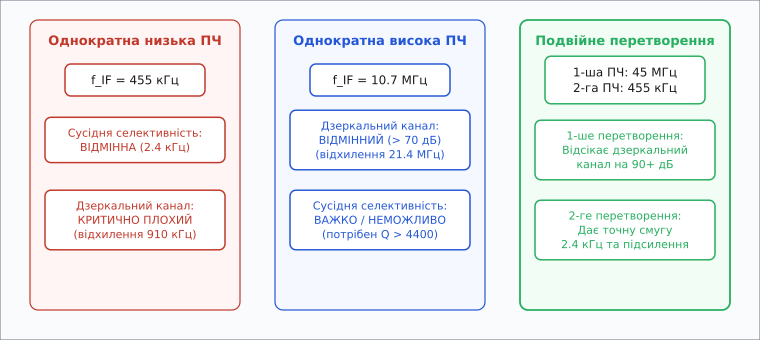
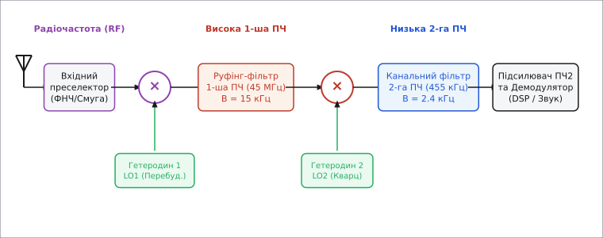
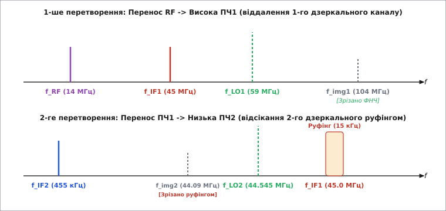
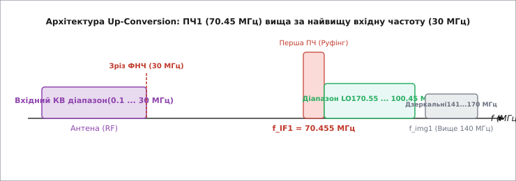

# Подвійне перетворення частоти

<preknowlist>
- [Супергетеродин](book:communications/superheterodyne) — перенесення частоти на проміжну за допомогою гетеродина та змішувача.
- [Змішувач частот](book:communications/mixer) — нелінійний елемент чи перемикач, що множить сигнали й створює сумарні та різницеві частоти.
- [Гетеродин](book:communications/local-oscillator) — генератор чистого синусоїдного сигналу для змішування.
</preknowlist>

Уявімо приймач коротких хвиль, який має впевнено приймати слабкий сигнал аматорської станції з рівнем −120 дБм на частоті 14.050 МГц (діапазон 20 метрів). Поруч, на частоті 14.053 МГц — лише на 3 кГц вище, — працює сусідня станція з потужністю в мільйон разів більшою (−60 дБм). А на частоті 13.140 МГц випромінює потужний передавач трансляційного радіомовлення з рівнем 0 дБм. Якщо побудувати класичний однократний [супергетеродин](book:communications/superheterodyne) із низькою проміжною частотою (скажімо, `f_IF = 455` кГц), то для селективності за сусіднім каналом (відсікання 14.053 МГц) ми можемо легко застосувати керамічний або електромеханічний фільтр шириною 2.4 кГц із відносною добротністю `Q = 455 / 2.4 ≈ 190`. Проте дзеркальний канал припаде точно на `14.050 − 2·0.455 = 13.140` МГц. Відстань між корисним сигналом і дзеркальним становить лише 910 кГц — це менше 7% від вхідної несучої частоти. Вхідний діапазонний фільтр на 14 МГц із реальною добротністю котушок `Q = 20` послабить заваду на частоті 13.140 МГц лише на 12–15 дБ. Потужне мовлення з рівнем 0 дБм після такого згасання матиме на вході змішувача рівень −15 дБм, що на 105 дБ перевищує корисний аматорський сигнал (−120 дБм), повністю заглушаючи прийом.

Якщо ж спробувати розв'язати проблему дзеркального каналу радикально й підняти єдину проміжну частоту до `f_IF = 10.7` МГц, дзеркальний канал зсунеться на `14.050 − 2·10.7 = −7.350` МГц (абсолютна частота `f_img = 7.35` МГц). Відстань розносу розшириться до 21.4 МГц. Вхідний смуговий преселектор відсіче цю заваду без найменшого зусилля більше ніж на 80 дБ. Але тут виникає друга пастка: щоб виділити смугу телеграфного чи односмугового сигналу (2.4 кГц) на частоті 10.7 МГц, потрібен фільтр із відносною добротністю `Q = 10 700 / 2.4 ≈ 4458`. Створити такий кварцовий фільтр зі стрімкими прямокутними схилами та низькими втратами надзвичайно дорого, а підсилення слабкого сигналу на 100–120 дБ на частоті 10.7 МГц створює високий ризик паразитного самозбудження каскадів через ємність монтажу та просочування через шини живлення.

Оцим жорстким фізичним тупиком і диктується інженерне рішення: **подвійне перетворення частоти** (*double frequency conversion*). Замість намагання вирішити дві суперечливі задачі — придушення дзеркального каналу та селективність за сусіднім каналом — в одному тракті, приймач ділить цю роботу між двома послідовними ступенями перетворення.


*Конфлікт однократного перетворення: низька ПЧ дає чудову сусідню селективність, але пропускає дзеркальний канал; висока ПЧ легко відсікає дзеркальний канал, але вимагає наднереальних фільтрів для селективності. Подвійне перетворення поєднує високу 1-шу ПЧ і низьку 2-гу ПЧ.*

### Розділення обов'язків: висока перша та низька друга ПЧ

Архітектура подвійного перетворення розгортає приймальний тракт у послідовність із двох [змішувачів](book:communications/mixer), кожен з яких живиться від власного [гетеродина](book:communications/local-oscillator).


*Класичний тракт подвійного перетворення: вхідний преселектор → перша ПЧ із руфінг-фільтром → друга ПЧ із вузьким канальним фільтром та підсилювачем-демодулятором.*

Розгляньмо докладний фізичний механізм і роль кожного елемента цього ланцюга:

1. **Вхідний преселектор (RF Bandpass Filter):** смуговий фільтр радіочастоти, що пропускає робочий діапазон (наприклад, 14.0–14.35 МГц). Його завдання — захистити перший змішувач від сильних позадіапазонних сигналів та від дзеркального каналу *першого* перетворення.
2. **Перший змішувач та перший гетеродин (LO1):** перераховують вхідний сигнал `f_RF` у **високу першу проміжну частоту** `f_IF1` (наприклад, 45.0 МГц). Оскільки гетеродин LO1 є перебудовуваним, зміна його частоти вибирає потрібну станцію на ефірній шкалі.
3. **Руфінг-фільтр (Roofing Filter):** кварцовий або ПАХ-фільтр (*SAW filter*) на частоті `f_IF1` із відносно широкою смугою (наприклад, 15–30 кГц). Він не намагається відфільтрувати сусідній канал 2.4 кГц — його задача полягає у звуженні спектрального вікна перед другим змішувачем, щоб туди не потрапили завади дзеркального каналу *другого* перетворення та потужні сусідні станції, здатні перевантажити другий змішувач.
4. **Другий змішувач та другий гетеродин (LO2):** переносять сигнал із високої частоти `f_IF1` на **низьку другу проміжну частоту** `f_IF2` (наприклад, 455 кГц або 10.7 МГц). Другий гетеродин LO2 є фіксованим кварцовим генератором (наприклад, 44.545 МГц).
5. **Канальний фільтр та підсилювач другої ПЧ (Channel Filter & IF2 Amp):** на низькій частоті 455 кГц керамічний або електромеханічний фільтр формує точну прямокутну смугу пропускання (2.4 кГц для SSB, 6 кГц для AM, 15 кГц для FM). Підсилювач другої ПЧ забезпечує основне стабільне підсилення сигналу (80–100 дБ) без загрози самозбудження.

Історія виникнення цієї архітектури від легендарного приймача Collins R-390A до зенітних радіолокаційних станцій Другої світової війни описана в історичному екскурсі [📜 Історія подвійного перетворення](book:communications/double-conversion/hist-double-conversion.md).

> 🔧 **Навіщо це.** Скелетна ідея подвійного перетворення — **розділення фізичних обмежень**. Перше перетворення робить дзеркальний канал «далеким» і легко виліковним за допомогою вхідних фільтрів. Друге перетворення робить проміжну частоту «низькою» і зручною для надгострої фільтрації та стійкого підсилення.

### Спектральні співвідношення та математика двох дзеркальних каналів

Кожне нелінійне змішування створює нові спектральні компоненти за принципом множення синусоїд. При подвійному перетворенні виникає **дві пари** проміжних і дзеркальних частот.


*Спектральна трансформація: перше перетворення пересуває `f_RF` далеко вгору на `f_IF1`, віддаляючи першу дзеркальну частоту `f_img1`. Друге перетворення знижує сигнал до `f_IF2`, де руфінг-фільтр придушує другу дзеркальну частоту `f_img2`.*

Простежмо частотний розрахунок для першого перетворення (припустимо верхню настройку гетеродина, `f_LO1 > f_RF`):

```
f_IF1 = f_LO1 − f_RF
```

Тоді дзеркальний канал першого перетворення `f_img1` знаходиться на частоті:

```
f_img1 = f_LO1 + f_IF1 = f_RF + 2·f_IF1
```

Якщо `f_RF = 14.050` МГц, а `f_IF1 = 45.000` МГц, то частота першого гетеродина дорівнює `f_LO1 = 59.050` МГц. При цьому перший дзеркальний канал припадає на:

```
f_img1 = 59.050 + 45.000 = 104.050 МГц
```

Відстань між корисним сигналом 14.050 МГц і першим дзеркальним каналом 104.050 МГц становить `2·f_IF1 = 90` МГц! Вхідний смуговий фільтр на 14 МГц пригнічує сигнал на частоті 104 МГц більше ніж на 90 дБ, практично повністю стираючи заваду.

Тепер розгляньмо друге перетворення. Сигнал `f_IF1 = 45.000` МГц подається на другий змішувач із фіксованим гетеродином `f_LO2 = 44.545` МГц:

```
f_IF2 = f_IF1 − f_LO2 = 45.000 − 44.545 = 0.455 МГц (455 кГц)
```

Другий дзеркальний канал для другого змішувача припадає на частоту:

```
f_img2 = f_LO2 − f_IF2 = 44.545 − 0.455 = 44.090 МГц
```

Зверніть увагу: другий дзеркальний канал 44.090 МГц віддалений від першої ПЧ (45.000 МГц) лише на `2·f_IF2 = 910` кГц. Звичайний вхідний фільтр на 14 МГц його б не відфільтрував. Але цей сигнал іде **не з антени** — він повинен був би пройти через першу ПЧ! А на частоті 45.000 МГц стоїть кварцовий руфінг-фільтр шириною 15 кГц. Для нього частота 44.090 МГц лежить далеко за межами смуги пропускання (відхилення 910 кГц), тому руфінг-фільтр відсікає другу дзеркальну частоту ще до того, як вона досягне другого змішувача.

Детальний алгебраїчний вивід рівнянь частотного планування, інверсії бічних смуг та матричного аналізу придушення дзеркальних каналів викладено у математичному розборі [🧮 Математика частотного планування](book:communications/double-conversion/math-frequency-planning.md).

### Вверх-перетворення (Up-Conversion) та плаваючі преселектори

Історично перші супергетеродини виконували **вниз-перетворення** (*down-conversion*): перша проміжна частота була нижчою за вхідну радіочастоту. Проте з появою високочастотних синтезаторів частоти та кварцових фільтрів на десятки megahertz в інтенсивну практику увійшла схема **вверх-перетворення** (*up-conversion*).

При вверх-перетворенні перша проміжна частота `f_IF1` обирається **вищою за найвищу частоту прийомного діапазону**. Наприклад, для суцільного КВ-приймача діапазону 0.5–30 МГц обирають `f_IF1 = 70.455` МГц або `45.000` МГц.


*Принцип вверх-перетворення: перша ПЧ (70.455 МГц) лежить вище за весь вхідний діапазон (0.5–30 МГц). Перший гетеродин перебудовується від 70.955 до 100.455 МГц. Дзеркальний канал винесено в діапазон 141.4–170.9 МГц, що дозволяє замінити складний перестроюваний преселектор єдиним ФНЧ.*

Переваги вверх-перетворення є колосальними:

- **Відсутність перестроюваних вхідних фільтрів:** оскільки `f_img1 = f_RF + 2·f_IF1` перебуває в діапазоні 141.4–170.9 МГц, вхідний преселектор приймача не потрібно переключати реле чи варикапами при переході з 1 МГц на 28 МГц. Достатньо поставити єдиний стаціонарний фільтр низьких частот (ФНЧ) із частотою зрізу 30 МГц!
- **Безперервне перекриття діапазону:** приймач може плавно перебудовуватися від 100 кГц до 30 МГц без жодного розриву та без перемикання барабанів чи реле діапазонів.
- **Стабільність характеристик:** постійність параметрів вхідного тракту по всьому діапазону.

Недоліком вверх-перетворення є підвищені вимоги до першого змішувача: оскільки перед ним немає вузьких фільтрів, на його вхід діють абсолютно всі сигнали ефіру від 0.5 до 30 МГц. Змішувач повинен мати надзвичайно високий динамічний діапазон за інтермодуляцією (високі значення `IIP3`).

Детальний аналіз схемотехніки сучасних двоперетворювальних фронтендів, активних і пасивних змішувачів на ключах FST3125 та чипів MC3362/SA605 наведено в огляді [🔌 Компоненти та фронтенди подвійного перетворення](book:communications/double-conversion/comp-dual-conversion-receiver.md).

### Взаємне змішування фазового шуму та проблема Reciprocal Mixing

Окрім дзеркальних каналів та комбінаційних завад, при високочастотному першому перетворенні виникає явище **взаємного змішування фазового шуму** (*reciprocal mixing*). 

Жоден реальний гетеродин не випромінює чисту ідеальну синусоїду — його спектр оточений «боковими спідницями» фазового шуму `L(Δf)`, вимірюваного у дБк/Гц. Якщо поруч із слабким корисним сигналом `f_RF` виникає потужна позасмугова завада `f_unwanted` на відстані `Δf`, ця завада перемножується з боковими шумами першого гетеродина.

В результаті фазовий шум гетеродина переноситься безпосередньо на першу проміжну частоту `f_IF1` і накриває собою слабкий корисний сигнал. Тобто, навіть якщо дзеркальний канал повністю відфільтровано, а руфінг-фільтр ідеально прямокутний, високий фазовий шум першого гетеродина на частотах 50–100 МГц може повністю знищити чутливість приймача при наявності сильних сусідніх станцій.

Механіка розрахунку фазового шуму та його вплив на вибір гетеродинів розглянуті у темах [Гетеродин](book:communications/local-oscillator) та [Сінтезатор частоти](book:communications/frequency-synthesizer).

### Комбінаційні завади та побічні канали прийому (Spurs)

Головна розплата за використання двох гетеродинів — поява мультиплікативних побічних продуктів змішування, які в радіотехніці називають **комбінаційними завадами** або **ураженими частотами** (*spurs* / *birdies*).

Нелінійність реальних змішувачів призводить до того, що на виході народжуються не лише фундаментальні різницеві частоти `|f_RF − f_LO1|`, а й гармоніки обох сигналів:

```
f_out = |m·f_RF ± n·f_LO1|
```

Якщо комбінаційне число `|m·f_RF − n·f_LO1|` випадково потрапляє в смугу пропускання першої ПЧ `f_IF1`, приймач зафіксує ложну станцію («фантом»), якої насправді немає в ефірі на частоті `f_RF`.

Окрім того, при наявності двох гетеродинів виникає небезпека взаємного просочування:
- Нагармоніка другого гетеродина `k·f_LO2` може через наводки по живленню чи платі проникати на вхід першого змішувача.
- Змішування гармонік першого та другого гетеродинів `m·f_LO1 ± n·f_LO2` може утворювати паразитну частоту, яка потрапляє безпосередньо в тракт другої ПЧ.

У результаті оператор приймача, обертаючи ручку настройки при повністю відключеній антені, чує у динаміку свисти й тональні завади на певних частотах. Вони називаються **«побутовими свистами» приймача** (*internal birdies*).

Щоб запобігти цьому, розробники радіоапаратури застосовують суворе **частотне планування** (*frequency planning*): ретельно обчислюють комбінаційні сітки й вибирають значення `f_IF1` та `f_LO2` так, щоб комбінації нижчих порядків (`m + n ≤ 5`) ніколи не потрапляли у внутрішні проміжні частоти.

Алгоритм калькулятора частотного планування та перевірки комбінаційних завад на C та C++ подано у проєкті [⚙️ Програмний калькулятор частотного плану](book:communications/double-conversion/proj-frequency-planner.md).

### Подвійне перетворення в еру цифри та SDR

З розвитком цифрової обробки сигналів ([DSP](book:communications/decimation)) та технологій прямого цифрового синтезу ([DDS](book:communications/frequency-synthesizer)) архітектура подвійного перетворення зазнала еволюції, але не зникла.

У сучасних трансиверах і вимірювальних приладах (аналізаторах спектра) класична схема з двома аналоговими змішувачами часто трансформується в **гібридну архітектуру**:

```
Антена → Вхідний ФНЧ → 1-й аналоговий змішувач (f_IF1 = 70.455 МГц) 
       → Руфінг-фільтр → 2-й змішувач / AЦП → Цифрова ПЧ (DSP)
```

Перше перетворення залишають аналоговим і високим, щоб зберегти переваги широкого придушення дзеркального каналу та відсутності важких вхідних фільтрів. А друге перетворення (або безпосередню оцифровку на 70 МГц) виконує високошвидкісний АЦП (*ADC*). Подальше зниження частоти до нуля, квадратурне розділення на `I/Q` компоненти та остаточна вузькосмугова фільтрація виконуються цифровим шляхом у ПЛІС або DSP.

Також порівняємо подвійне перетворення з архітектурою прямого перетворення (Zero-IF), що детально вивчається у статті [Zero-IF та Low-IF архітектури](book:communications/zero-if-receiver):

- **Пряме перетворення (Zero-IF):** переносить сигнал одразу на нульову частоту. Вона позбавлена дзеркального каналу, але має важку проблему постійного зсуву (DC Offset) та флікер-шуму `1/f` активного змішувача.
- **Подвійне перетворення:** повністю вільне від флікер-шуму `1/f` та DC Offset, оскільки друга ПЧ (455 кГц) лежить далеко за межами білянульової зони шумів транзисторів.

| Архітектурний тип | Придушення дзеркального каналу | Сусідня селективність | Вхідний преселектор | Складність схемотехніки |
| :--- | :--- | :--- | :--- | :--- |
| **Однократний супергетеродин (низька ПЧ)** | Низьке (15–30 дБ) | Висока (кераміка/ПЧ) | Складний перестроюваний | Низька |
| **Однократний супергетеродин (висока ПЧ)** | Високе (> 70 дБ) | Низька (важко розбити `Q`) | Простий | Середня |
| **Подвійне перетворення (Up-Conversion)** | Відмінне (> 90 дБ) | Надвисока (2-га ПЧ / DSP) | Простий ФНЧ (0–30 МГц) | Висока (2 змішувачі, 2 LO) |
| **Пряме перетворення (Zero-IF)** | Залежить від I/Q балансу | Надвисока (DSP ФНЧ) | Простий | Низька аналогова, висока цифрова |

Подвійне перетворення залишається еталоном для професійного зв'язку, радіолокації та вимірювальної техніки там, де потрібен граничний динамічний діапазон, де відсутній провал за дзеркальним каналом і де цифровий прийом безпосередньо з ефіру ще обмежений шумами та динамікою АЦП.
