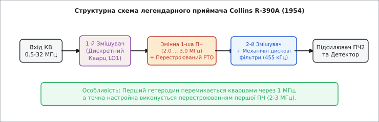

# 📜 Історія подвійного перетворення частоти

Подвійне перетворення частоти виникло наприкінці 1930-х років як відповідь на глибоку кризу радіозв'язку в короткохвильовому (КВ) та ультракороткохвильовому (УКХ) діапазонах. У той час традиційні однократні супергетеродини більше не могли впоратися зі швидким зростанням кількості радіостанцій, появою авіаційної навігації та викликами перших військових радіолокаційних систем. Цей екскурс розкриває еволюційний шлях від перших лабораторних експериментів до радіолокаторів Другої світової війни, легендарних армійських приймачів Cold War era та сучасних вимірювальних систем.

### Вхід у короткі хвилі: тупик класичного супергетеродина

Винайдення [Едвіном Армстронгом](book:communications/why-modulation) супергетеродина у 1918 році перевернуло світову радіотехніку. Проте перші приймачі розроблялися для довгохвильового та середньохвильового діапазонів (частоти до 1.5 МГц). Для цих задач міжнародним стандартом стала проміжна частота 455 кГц (або 175 кГц). При прийомі середньохвильової станції на частоті 1.0 МГц дзеркальний канал припадав на `1.0 + 2·0.455 = 1.91` МГц. Відносна відстань між корисним і дзеркальним сигналом становила майже 90%, і простий одиночний резонаторний контур на вході легко придушував заваду більше ніж на 40 дБ.

Все кардинально змінилося наприкінці 1920-х і в 1930-х роках, коли глобальний радіозв'язок почав масово освоювати короткі хвилі (від 3 до 30 МГц). На високих частотах виявилося, що класична схемотехніка безпомічна:
- На частоті 28 МГц дзеркальний канал при стандартній ПЧ 455 кГц знаходився на `28 + 0.91 = 28.91` МГц. Вхідні смугові контури на високих частотах мали абсолютну смугу пропускання значно ширшу, ніж 910 кГц. У динаміку приймача масово лунали сигналі дзеркальних станцій, створюючи хаос в ефірі.
- Спроба підняти єдину ПЧ до 3–9 МГц віддаляла дзеркальний канал, але унеможливлювала створення вузькосмугових фільтрів для прийому мови (тоді існували лише громіздкі LC-контури зі скромною добротністю). Окрім того, високе підсилення на мегагерцових частотах призводило до паразитного самозбудження каскадів через внутрішні ємності триодів і тетродів.
- Спроба спорудити складний преселектор із 3–4 послідовних перестроюваних контурів вимагала чотирисекційних змінних конденсаторів колосальної точності. Найменший розсинхрон механіки зсував настройку, а сам приймач ставав громіздким, важким і надзвичайно дорогим.

Радіоінженерія опинилася перед фізичним роздоріжжям: або відмовитися від селективності, або шукати принципово нову структуру приймального тракту.

### Радіолокація Другої світової війни та перший технологічний прорив

Справжнім випробувальним полігоном для радіотехнічних інновацій стала Друга світова війна. Розвиток військово-морських і авіаційних радіолокаторів (радарів), що працювали в діапазонах від 100 МГц до 3 ГГц (з винайденням британського магнетрона у 1940 році), поставив небувалі вимоги до чутливості та селективності апаратури.

У британських та американських радарних приймачах (наприклад, станціях SCR-268, SCR-584 та авіаційних радарах AI Mk IV) виникла гостра потреба підсилювати й обробляти імпульси шириною в частки мікросекунди на гігагерцових несучих частотах. Однократний перенос з 3 ГГц на стандартну ПЧ 30 МГц залишав дзеркальний канал всього на 60 МГц осторонь, що було недопустимо для надширокосмугових вхідних систем.

Інженери провідних лабораторій — MIT Radiation Laboratory у США та Telecommunications Research Establishment (TRE) у Великій Британії — запропонували та втілили приймачі з подвійним перетворенням:
- **Перша проміжна частота (1-ша ПЧ):** обиралася дуже високою (60 МГц або 100 МГц), що відсувало першу дзеркальну частоту на 120–200 МГц від робочої несучої та дозволяло легко зрізати її вхідним об'ємним резонатором.
- **Друга проміжна частота (2-га ПЧ):** становила 2–10 МГц, де забезпечувалося стабільне підсилення широкої смуги відеоімпульсів та остаточне формування імпульсного відгуку тракту.

Ця концепція дозволила створити стабільні приймачі для авіаційних радарів виявлення бомбардувальників та корабельних систем протиповітряної оборони, що зіграли вирішальну роль у Битві за Атлантику та повітряних боях над Європою.

### Легенда Артура Коллінза: R-390A та епоха механічних фільтрів

Після завершення війни накопичений досвід військових розробок перейшов у масове виробництво цивільної, професійної та аматорської КВ-апаратури. Справжнім триумфом схемотехніки подвійного перетворення став радіоприймач **Collins R-390A / URR**, розроблений компанією *Collins Radio Company* під керівництвом видатного інженера Артура Коллінза (Art Collins) на замовлення армії США у 1954 році.

*Приймач Collins R-390A (1954): використовував змінну першу ПЧ (2–3 МГц) та фіксовану другу ПЧ (455 кГц) з електромеханічними дисковими фільтрами, встановивши еталон динамічного діапазону на десятиліття.*

У R-390A було втілено унікальну концепцію **змінної першої ПЧ** (*variable 1st IF*):
- Приймач покривав безперервний КВ-діапазон від 0.5 до 32 МГц, розбитий на 31 піддіапазон шириною по 1 МГц.
- Перший гетеродин випромінював дискретні високостабільні частоти із кроком в 1 МГц, які стабілізувалися кварцовими резонаторами.
- Перша ПЧ була не фіксованою, а перестроювалася в межах 2.0–3.0 МГц (або 9–18 МГц на верхніх діапазонах) за допомогою прецизійного перестроюваного індуктивного генератора (PTO — *Permeability Tuned Oscillator*).
- Друге перетворення зсувало сигнал зі змінної першої ПЧ на фіксовану другу ПЧ 455 кГц, де стояли знамениті **електромеханічні дискові фільтри Коллінза** (*Collins mechanical filters*).

Завдяки подвійному перетворенню R-390A володів невиданим на той час придушенням дзеркального каналу (> 80 дБ) та абсолютно лінійною шкалою настройки (1 оберт ручки дорівнював точно 100 кГц). Він залишався на озброєнні армії США, спецслужб та дипломатичних місій до кінця 1980-х років і вважається одним із найкращих аналогових приймачів в історії радіотехніки.

Паралельно американська компанія *Drake* у своїх легендарних лінійках приймачів R-4, R-4B та R-4C впровадила схему подвійного перетворення для радіоаматорів, зробивши високий динамічний діапазон доступним для масового ринку.

### Революція Up-Conversion: від трансиверів Drake до сучасного SDR

У 1970-х роках виник наступний революційний еволюційний крок — **вверх-перетворення** (*up-conversion*). З появою синтезаторів частоти на основі фазового автопідлаштування частоти (PLL) та винайденням монолітних кварцових фільтрів (MCF) на 45–70 МГц стало можливим відмовитися від складних механічних барабанів перемикання діапазонів і змінної першої ПЧ.

Японські корпорації Yaesu, Icom та Kenwood випустили серію культових трансиверів (таких як Yaesu FT-101ZD, Icom IC-751A, Kenwood TS-940S), де перша ПЧ становила 70.455 МГц, а друга — 455 кГц чи 8.83 МГц. Це дозволило створити суцільнохвильові приймачі від 100 кГц до 30 МГц з єдиним вхідним ФНЧ, позбувшись десятків механічних контурних реле.

У сучасну цифрову еру подвійне перетворення зберігає свої позиції у вимірювальних приладах найвищого класу — аналізаторах спектра та векторних аналізаторах мереж (Agilent/Keysight N9020B, Rohde & Schwarz FSW). У них застосовується навіть потрійне перетворення (з першою ПЧ вище 5 ГГц), що дозволяє досліджувати сигнали до 90 ГГц без жодних фантомних дзеркальних завад.
