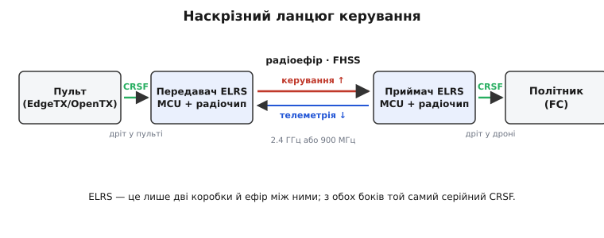
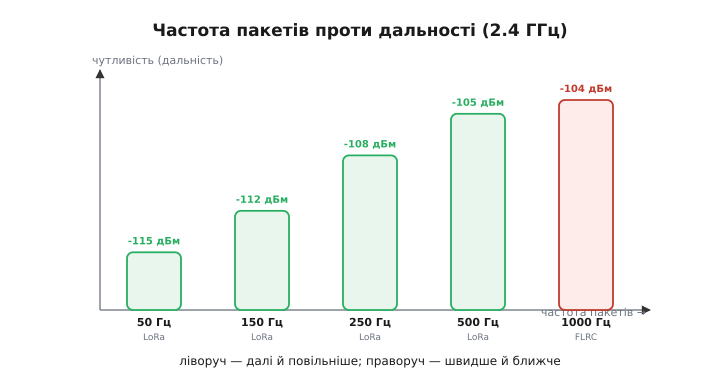
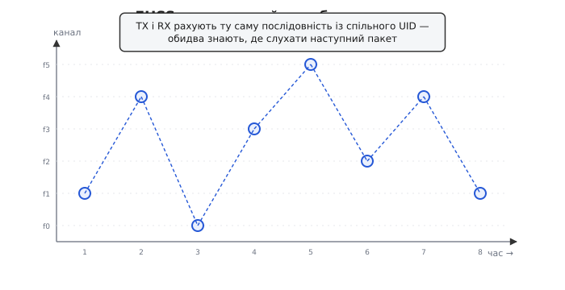
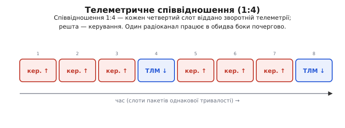

# Архітектура ExpressLRS

Уяви, що керуєш дроном за кілька кілометрів від себе. Ти хитнув стик — і машина мусить відреагувати **зараз**, а не за півсекунди: на швидкості сто кілометрів за годину півсекунди затримки означає п'ятнадцять метрів наосліп. Водночас зв'язок мусить діставати далеко й не рватися серед чужого радіохаосу міського діапазону, де в тій самій смузі кричать Wi-Fi, Bluetooth, мікрохвильовки й сотні інших дронів. І бажано, щоб уся ця апаратура коштувала як вечеря, а не як крило літака.

Донедавна це були несумісні бажання. Далекі надійні лінки керування продавали закриті, дорогі, від одного виробника — і кожен диктував свою ціну. **ExpressLRS** (англ. *express* — «швидкий, спішний»; *LRS* — *long range system*, «система великої дальності») з'явилася як відповідь спільноти пілотів: відкрита прошивка, яку заливають на дешеві модулі з магазину, а вона витискає з них затримку, дальність і надійність на рівні найкращих закритих систем — часом і краще. Розберімо, **як** вона це робить: не за списком можливостей, а від першопричини — чому саме така будова дає одночасно швидкість, дальність і копійчану ціну.

### Що таке ELRS насправді: дві коробки й ефір між ними

Почнімо з найпростішого — що фізично являє собою система. Її легко уявити складнішою, ніж вона є. Насправді це **дві невеликі коробки** і повітря між ними.

Одна коробка — **передавач** — стоїть у пульті пілота (модуль у гнізді або вбудований). Друга — **приймач** — сидить на борту дрона, крихітна плата завбільшки з ніготь. Кожна коробка — це мікроконтролер плюс радіочіп; більше в ній по суті нічого немає. Уся розумна частина — не в залізі, а в **прошивці**, тій самій відкритій ExpressLRS, що крутиться на обох боках.

А тепер найважливіше для розуміння всієї архітектури: **як ці коробки спілкуються зі світом навколо**. Пульт не знає нічого про радіо — він просто вигукує положення стиків звичайним серійним протоколом по дроту всередині корпусу. Політник дрона (англ. *flight controller*, FC — плата, що керує моторами) теж нічого не знає про радіо — він чекає ті самі положення стиків звичайним серійним протоколом по дроту. Обидва дроти говорять **однією мовою — CRSF**. ELRS — це те, що стоїть посередині: бере CRSF-потік з пульта, переносить його через ефір і на тому боці віддає точно такий самий CRSF-потік політнику.

*Наскрізний ланцюг: з обох кінців — той самий серійний CRSF по короткому дроту, а посередині радіоланка зі стрибками частотою. Угору йде керування, вниз — телеметрія. ELRS не знає й не хоче знати, що там за політник; вона лише чесно переносить CRSF з боку на бік.*

Ця подвійна роль CRSF — ключ до всієї гнучкості. Пульту байдуже, яке радіо стоїть у гнізді, аби воно розуміло CRSF; політнику байдуже, який приймач причеплено, аби він видавав CRSF. Тому один відкритий протокол-«розетка» дозволяє змішувати залізо різних виробників, а прошивці ELRS — жити всередині як окремий, замінний шар.

> 🔧 **Навіщо це.** Розділення на «мову з апаратурою» (CRSF) і «мову в ефірі» (радіопротокол ELRS) — не академічна краса, а причина, чому ELRS так швидко захопила ринок. Виробник плати не мусить винаходити протокол — він бере готовий CRSF з одного боку, готове радіо Semtech з другого, заливає спільну прошивку — і його пристрій одразу сумісний з усіма пультами й політниками. Ти як пілот міняєш приймач на дроні, не чіпаючи ані пульта, ані налаштувань політника.

Що таке [CRSF](topic:communications/crsf-protocol) детальніше — це компактний кадрований серійний протокол (синхробайт, довжина, тип, корисне навантаження, контрольна сума CRC); положення шістнадцяти каналів він пакує в одинадцятибітні числа, шістнадцять каналів у двадцять два байти. Тут досить знати одне: це та єдина мова, якою ELRS говорить із рештою апаратури з обох боків.

### Чому так мало байтів і так швидко

Тепер — до серця затримки. Чому лінк керування може бути настільки жвавішим за звичайне радіо?

Відповідь у тому, **що саме** передається. Голосу чи відео тут немає — лише положення кількох стиків і перемикачів. Це мізерний обсяг: типовий пакет ELRS несе всього близько восьми–тринадцяти байтів корисних даних. Коли передавати треба крихту, її можна передати **дуже коротко** — а короткий пакет означає короткий час у ефірі, а короткий час у ефірі означає, що наступне свіже положення стика піде майже одразу.

Звідси й пекельні частоти оновлення. ELRS шле пакети з частотою від 50 до 1000 разів на секунду. На тисячі пакетів за секунду новий стан стиків летить кожну **одну мілісекунду**; наскрізна затримка «стик — мотор» у швидких режимах падає нижче кількох мілісекунд. Для порівняння: кадр відео на екрані пілота живе 16 мілісекунд і довше. Керування ELRS оновлюється в рази частіше, ніж пілот встигає щось побачити, — саме тому машина здається продовженням руки.

Але тут ховається перший фундаментальний обмін, і його треба зрозуміти чесно.

### Головна ручка: частота пакетів проти дальності

Здавалося б — став найвищу частоту й радій. Але задарма швидкість не дається; за неї платять **дальністю**. Щоб побачити чому, згадаймо, як радіо взагалі добуває дальність: приймачу треба зібрати з ефіру досить енергії сигналу, щоб упевнено відрізнити його від шуму. А енергія пакета — це його потужність, помножена на **час**. Довший пакет накопичує більше енергії, тож його чути з більшої відстані; коротший пакет несе менше енергії й тоне в шумі раніше.

Виходить прямий конфлікт. Хочеш високу частоту — роби пакети коротшими — але короткий пакет чутно ближче. Хочеш велику дальність — роби пакети довшими — але тоді їх за секунду вміщується менше, і частота падає. Одне проти одного, і обійти це неможливо: то фізика самого каналу.

*Чутливість приймача (а отже дальність) для режимів на 2.4 ГГц. Повільний режим 50 Гц чути аж до −115 дБм — сигнал глибоко в шумі, дальність величезна. Швидкий 1000 Гц вимагає −104 дБм — сигнал має бути помітно сильнішим, дальність менша. Ліворуч — далеко й повільно, праворуч — швидко й близько.*

ELRS дає цей вибір прямо в руки пілота однією ручкою — **частотою пакетів**. Гонщик, що ганяє за сто метрів на дистанції прямої видимості, ставить 500 чи 1000 Гц: дальність йому не потрібна, а найменша затримка — так. Пілот далекого польоту, якому важать кілометри, а не мілісекунди, ставить 50 чи 100 Гц: реакція трохи млявіша, зате зв'язок добиває за горизонт.

Щоб покрити такий широкий діапазон, ELRS користується **двома різними способами модуляції** — двома способами накласти біти на радіохвилю, у кожного своя сильна сторона. На низьких частотах пакетів вона бере [LoRa](topic:communications/lora) — чирпову модуляцію, де сигнал розмазаний по широкій смузі й приймач витягує його навіть з-під шуму; це дає ту саму феноменальну дальність, заради якої LoRa й створювали. На високих частотах пакетів дальність уже не в пріоритеті, зате кожна мікросекунда рахується, тож ELRS перемикається на **FLRC** (англ. *fast long range communication*) — швидкий різновид [частотної маніпуляції](topic:communications/fsk-psk), який передає пакет помітно коротше за LoRa. Одна прошивка, дві модуляції, і межа між ними проходить рівно там, де пілот пересуває ручку швидкості.

> 🔧 **Навіщо це.** Цей обмін — не абстракція, а рішення, яке пілот ухвалює перед кожним типом польоту. Поставив зависоку частоту для далекого маршруту — і на межі дальності зв'язок обірветься раптово, бо коротким пакетам забракне енергії. Поставив завиську для гонки — і керування відчутно «підгальмовує». Правило просте: **бери найнижчу частоту, що дає потрібну реакцію**, — вона лишає найбільший запас дальності й найкраще пробиває завади.

### Як TX і RX не губляться в ефірі: стрибки частотою

Тепер найтонше. Міський діапазон — це базар, де всі кричать одночасно. Якби ELRS сиділа на одній частоті, будь-хто — сусідній Wi-Fi, інший дрон — міг би її заглушити, просто зайнявши цю частоту. Одна забита частота — і керування зникло.

Рятунок — **не сидіти на місці**. ELRS весь час **стрибає частотами**: щоразу передає на новій, за псевдовипадковим розкладом, десятки разів на секунду перескакуючи по всьому діапазону. Цей прийом зветься [стрибками частоти в розширеному спектрі](topic:communications/spread-spectrum) (англ. *frequency-hopping spread spectrum*, FHSS). Якщо якусь частоту хтось забив — постраждає лише той один пакет, що на неї випав; наступний уже полетить на іншій, чистій. Завада, прив'язана до однієї частоти, тепер з'їдає не весь зв'язок, а лише малу його частку.

Але тут — головна загадка. Якщо передавач стрибає непередбачувано, **звідки приймач знає, де слухати наступний пакет?** Він же не може обшукувати весь діапазон — на це немає часу. Відповідь елегантна: розклад стрибків **не випадковий насправді**, він лише *виглядає* випадковим. І передавач, і приймач обчислюють ту саму послідовність частот із того самого числа-зерна.

Це зерно зветься **UID** — унікальний ідентифікатор пари. Береться воно з **фрази прив'язки** (англ. *binding phrase*): пілот вигадує якийсь текстовий рядок, вписує його однаково в прошивку передавача й приймача, а з нього прошивка рахує хеш (за алгоритмом MD5) — і кілька байтів цього хешу стають UID. Далі UID подають у детермінований генератор псевдовипадкових чисел, і той видає обом бокам **однакову** послідовність каналів. Обидва рахують той самий розклад — отже, обидва завжди знають, на якій частоті зустрітися наступної миті.

*Стрибки частотою виглядають хаотичними, та насправді задані наперед: спільний UID (з фрази прив'язки) — це зерно, з якого обидва боки рахують ту саму послідовність каналів. Тому приймач завжди слухає рівно там, куди зараз передає передавач, і чужому не вгадати цей розклад.*

Той самий UID заразом і **розділяє** сусідні системи. У двох пілотів поряд — різні фрази прив'язки, отже різні UID, отже різні розклади стрибків: їхні пакети майже ніколи не потрапляють на ту саму частоту в ту саму мить, тож вони не плутаються й не глушать одне одного, навіть літаючи бік у бік. Прив'язка (біндинг) — це і є момент, коли приймач уперше отримує UID передавача й починає рахувати його розклад; далі вони знаходять одне одного в ефірі самі.

> 🔧 **Навіщо це.** Фраза прив'язки — це не просто «пароль». Вона робить три речі одразу: пускає приймач у розклад стрибків саме твого передавача, тримає його осторонь чужих систем і не дає стороннім легко вгадати, куди ти стрибнеш далі. Тому в ELRS не потрібен фізичний ритуал прив'язки з кнопкою — досить вписати однакову фразу з обох боків, і пара знайдеться в ефірі. І тому ту фразу тримають при собі: хто її знає, той знає й твій розклад.

### Один канал у два боки: телеметричне співвідношення

Дотепер ми говорили лише про потік **вгору** — від пульта до дрона. Але пілот хоче й зворотного: скільки лишилося напруги в акумуляторі, наскільки сильний сигнал, де дрон на карті. Це **телеметрія** — потік **вниз**, від дрона до пульта.

Виникає незручність: радіочіп у кожен момент або передає, або слухає — одночасно не вміє (він **напівдуплексний**). Виділити для телеметрії окрему частоту чи окремий чіп — зайві гроші й складність, а вся філософія ELRS у дешевизні. Тому вона робить хитріше: **позичає час у того самого каналу**. Час поділено на однакові слоти; майже всі йдуть на керування вгору, але зрідка один слот віддається під телеметрію вниз — передавач на мить замовкає й слухає, а приймач у цей слот сам стає передавачем.

Як часто траплятиметься зворотний слот, задає **телеметричне співвідношення** (англ. *telemetry ratio*): 1:2 означає «кожен другий слот — телеметрія», 1:128 — «лише кожен сто двадцять восьмий». Вибір — знову обмін. Частіша телеметрія оновлює покази жвавіше, але з'їдає слоти в керування; рідша віддає майже весь ефір керуванню, зате дані з борту оновлюються ліниво.

*Співвідношення 1:4: три слоти поспіль несуть керування вгору, четвертий — телеметрію вниз, і так по колу. Один напівдуплексний радіоканал працює в обидва боки почергово, без другої частоти й другого чіпа. Що рідший зворотний слот, то більше залишається чистому керуванню.*

Логіка проста: керування важливіше за телеметрію, тож йому й віддають левову частку часу. Значення «напруга падає» можна оновити раз на секунду й нічого не втратити; а от «стик пішов управо» мусить долетіти негайно. Тому типові співвідношення сильно зміщені в бік керування, а часту телеметрію вмикають лише там, де без свіжих даних з борту не обійтися.

### Коли зв'язок на межі: якість лінка й динамічна потужність

Лишилося зрозуміти, як ELRS поводиться, коли зв'язок починає слабнути, — і як пілот про це дізнається завчасно, а не в мить, коли дрон уже впав.

Головна метрика тут — **якість лінка** (англ. *link quality*, LQ): проста частка пакетів, що дійшли. Сто відсотків — долетіли всі; сімдесят — кожен третій загубився. LQ чесніша за силу сигналу як передвісник біди: сигнал може бути слабким, але поки пакети доходять, керування ціле; а щойно LQ поповзла вниз — пакети реально пропадають, і це вже тривога. За рахунок надлишку частоти (пакетів шлеться більше, ніж конче треба) керування переживає втрату частини пакетів непомітно: пропав один — за мілісекунду прийде наступний зі свіжим станом стиків.

Друга розумна риса — **динамічна потужність**. Кричати на повну весь час марно: зблизька це лише гріє передавач і глушить сусідів. Тому ELRS стежить за запасом сигналу над шумом і **сама піднімає потужність**, коли запас тане (дрон відлітає, LQ хитається), і **сама стишує** її, коли зв'язок з головою (дрон поряд). Пілот нічого не крутить — система тримає рівно стільки потужності, скільки треба цієї миті, економлячи батарею й ефір.

Разом ці дві речі дають головне відчуття від ELRS: зв'язок не обривається раптово. Він **деградує плавно** — спершу тихо піднімає потужність, тоді LQ починає повільно сповзати, даючи пілотові час розвернутись до дому, і лише на самій межі, коли пакети вже майже не доходять, політник вмикає завчасно налаштований безпечний режим (англ. *failsafe*) — рівняє машину, зависає чи повертається сам.

### Звідки це взялося

ExpressLRS народилася не в лабораторії корпорації, а у **відкритій спільноті пілотів**, невдоволених тим, що якісний далекий зв'язок продають дорого й закрито. Перший код у сховище GitHub заклав інженер Алессандро Карчоне (Alessandro Carcione, у спільноті — AlessandroAU) 1 жовтня 2018 року; проєкт від початку відкритий під ліцензією GPLv3. Ранні версії працювали на діапазоні 900 МГц і вже тоді давали 200 пакетів за секунду — більше, ніж тодішні комерційні системи. Коли близько 2020 року додали діапазон 2.4 ГГц і дешеве серійне залізо, ELRS вибухнула популярністю серед FPV-пілотів; сотні учасників спільноти доточували режими, телеметрію, підтримку нового заліза. Докладніше цю історію — і чому саме **відкритість** виявилася технічною перевагою, а не лише етичною позицією — розібрано в [нарисі про походження ELRS](topic:communications/elrs-architecture/hist-elrs-origin.md).

Залізну основу дали чіпи Semtech — родина SX127x для діапазону 900 МГц і SX1280 для 2.4 ГГц (новіші плати беруть SX1262 чи LR1121), — а мозком стали дешеві мікроконтролери ESP32, ESP8285 чи STM32. Ніщо з цього не було створене спеціально для ELRS; уся заслуга архітектури — в тому, **як** ці готові, копійчані шматки склали докупи.

Звідси й підсумок. ExpressLRS — це тонкий, розумний шар між двома CRSF-дротами: він ріже дані на крихітні пакети заради швидкості, дає пілотові одну ручку обміну «частота проти дальності», стрибає частотами за спільним таємним розкладом заради стійкості до завад, позичає той самий канал під зворотну телеметрію й сам керує потужністю, щоб зв'язок слабнув плавно, а не обривався. Складність — уся в прошивці; залізо — дешеве й звичайне. Саме в цьому поєднанні — а не в якомусь одному хитрому чіпі — і криється те, чому відкрита система обійшла закриті.
